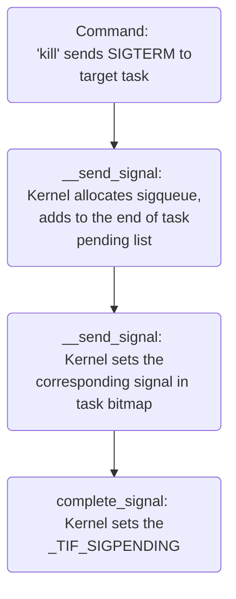
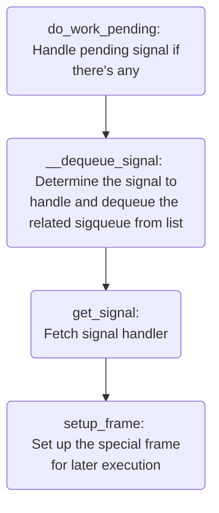

## Index

- [Introduction](#introduction)
- [Boot Up](#bootup)
- [Tasks & Scheduler](#scheduler)
- [Fair Class](#fair-class)
- [Preemption (optional)](#preemption)
- [Task Creation](#task-creation)
- [Task State](#task-state)
- [Strace (to be refined)](#strace)
- [Signal (to be refined)](#signal)
- [Reference (to be refined)](#reference)
- Ptrace (to be added)

## <a name="introduction"></a> Introduction

The 'process' is a concept of running logic designed to fulfill the target purpose.
It can be simple enough, such as the famous 'hello world' containing only one thread printing the greeting string.
The complicated process works as a group of multiple threads executing the assigned jobs to achieve its goal.
Meanwhile, kernel threads are working in privilege space, managing system resources, and meeting requirements from userspace.
In this document, I'd like to introduce the process from different perspectives.

```                                                                 
                    process          process                        
                 +-----------+    +-----------+                     
                 | +-------+ |    | +-------+ |                     
                 | |thread | |    | |thread | |                     
                 | +-------+ |    | +-------+ |    -  -  -   -      
                 |           |    | +-------+ |                     
                 |           |    | |thread | |                     
                 |           |    | +-------+ |                     
 user space      +-----------+    +-----------+                     
--------------------------------------------------------------------
 kernel space                                                       
               +-------+    +-------+    +-------+                  
               |kthread|    |kthread|    |kthread|   - -- -  -      
               +-------+    +-------+    +-------+                  
```

## <a name="bootup"></a> Boot Up

When the register pc points to kernel entry, it sets some low-level stuff in assembly language, and I don't bother looking into it.
The first c function is named 'start_kernel,' and every module will sequentially kick off starting from there.
Before the 'process' mechanism gets ready, we can conceptually regard the running logic as a thread.
Once the most fundamental infrastructures, such as memory and interrupt, are prepared, the running logic essentially becomes a kernel thread.
To take advantage of multiple cores in the processor, the thread forks 'kernel_init' (PID = 1) and 'kthreadd' (PID = 2), and itself turns to an idle task.
The task 'kernel_init' then walks through all kinds of initialization and delivers the kernel thread creation request to 'khtreadd' whenever there is one.
When boot flow reaches the end, 'kernel_init' tries a bunch of possible userspace 'init' utilities and transforms to whichever works first.

```                     
                     PID=1                                       
           fork  +-------------+  transform   +-----------------+
            +--> | kernel_init |  ----------> | init or systemd |
            |    +-------------+              +-----------------+
  +-----+   |                                                    
  | ??? |----                                                    
  +-----+   |                                                    
            |    +------------+     fork +-------------+         
            +--> |  kthreadd  | ------>  |  kthread A  |         
           fork  +------------+    |     +-------------+         
                     PID=2         |                             
                                   |fork +-------------+         
                                   +-->  |  kthread B  |         
                                   |     +-------------+         
                                   |                             
                                   |fork +-------------+         
                                   +-->  |  kthread C  |         
                                         +-------------+         
```

Although 'init' or 'systemd' possesses PID 1, it's not the first thread during boot up.
The task 'kthreadd' is responsible for kernel thread creation, and therefore it's the parent of most kernel threads.

```
$ ps xao pid,ppid,comm | head
    PID    PPID COMMAND
      1       0 systemd
      2       0 kthreadd
      3       2 rcu_gp
      4       2 rcu_par_gp
      6       2 kworker/0:0H-events_highpri
      9       2 mm_percpu_wq
     10       2 rcu_tasks_rude_
     11       2 rcu_tasks_trace
     12       2 ksoftirqd/0
     
Note: PPID is parent PID
```

## <a name="scheduler"></a> Tasks & Scheduler

Before we start introducing the scheduler, let's clarify the below terms.
- Process: refers to userspace utilities or applications, and it consists of at least one thread.
- Thread: the fundamental execution unit within a process.
- Kthread: kernel thread, and there's no process concept in kernel space.

Kernel refers to each thread or kthread as a task, and the process is just a collection of them or formally called 'thread group.'
With that many processor cores, multiple tasks can physically run simultaneously to boost performance and throughput.
The scheduler has a few scheduling classes to satisfy all kinds of task entities, and each entity runs with a priority.
Please note the scheduler itself is not a process or thread but a mechanism with its implementation spread across the kernel flow.

```
                                                              +-------------------------------------------+
                                                              |  +----+                                   |
                                                              |  |  0 |                                   |
               +--------+               +--------+            |  +----+     +------+     +------+         |
               | core 0 |               | core 1 |            |  |  1 |-----| task |-----| task |         |
               +--------+               +--------+            |  +----+     +------+     +------+         |
                                                              |     -                                     |
                                                             -|     -                                     |
                run queue                run queue          / |     -                                     |
            +---------------+        +---------------+     /  |     -                                     |
+------+    |  +---------+  |        |  +---------+  |    /   |     -                                     |
| task |-------|  stop   |  |        |  |  stop   |  |   /    |  +----+     +------+                      |
+------+    |  |  class  |  |        |  |  class  |  |  /     |  | 99 |-----| task |                      |
            |  +---------+  |        |  +---------+  | /      |  +----+     +------+                      |
+------+    |  |deadline |  |        |  |deadline |  |/       +-------------------------------------------+
| ???? |-------|  class  |  |        |  |  class  |  /                                                     
+------+    |  +---------+  |        |  +---------+ /|                                                     
            |  |real time|  |        |  |real time|/ |                                                     
            |  |  class  |  |        |  |  class  |  |                                                     
            |  +---------+  |        |  +---------+  |                                                     
            |  |  fair   |  |        |  |  fair   |  |                                                     
            |  |  class  |  |        |  |  class  |\ |                                                     
+------+    |  +---------+  |        |  +---------+ \|                                                     
| task |-------|  idle   |  |        |  |  idle   |  \                                                     
+------+    |  |  class  |  |        |  |  class  |  |\       +-------------------------------------------+
            |  +---------+  |        |  +---------+  | \      |                 +------+                  |
            +---------------+        +---------------+  \     |                 | task |                  |
                                                         \    |                 +------+                  |
                                                          \   |                /        \                 |
                                                           \  |               /          \                |
                                                            \ |        +------+          +------+         |
                                                             -|        | task |          | task |         |
                                                              |        +------+          +------+         |
                                                              |-        /\                    /\          |
                                                              |        /  \                  /  \         |
                                                              | +------+   +------+   +------+   +------+ |
                                                              | | task |   | task |   | task |   | task | |
                                                              | +------+   +------+   +------+   +------+ |
                                                              +-------------------------------------------+
```

Individual core has its run queue, and it further divides into sub-queues of different scheduling classes.
1. Stop class: it has only one task, which helps task migration between run queues.
2. Deadline class: relatively newly implemented class compared to others. I only know that tasks within this class are guaranteed to run within a certain period.
3. Real-time class: Tasks of this class have a strict policy that lower priority tasks have to wait until higher ones relinquish the execution right.
4. Fair class: also known as Completely Fair Scheduler (CFS). The majority of system tasks belong to this class, and they will run sooner or later.
5. Idle class: like stop class, it has precisely one task which assists in power saving.

In the regard of class priority, stop > deadline > real time > fair > idle.
The rule of selecting the next running task is:
- Start from the high precedence class and check if it has at least one task to run.
  - Yes, if an entity of the real-time class keeps running with no mercy, tasks in fair scheduling class have no chance to shine at all
- Call scheduling class methods to select the best candidate within that class and remove it from sub run queue
Of course, the currently running one will return to its sub-queue for the next chance or somewhere else waiting for the resource.

A few places in the kernel raise the flag of 'it is time to schedule again' when any below conditions become true.
- The given time slice for the running entity consumes entirely.
- Wait for resources, such as data from drives or the internet.
- Priority of a task in the run queue is boosted and becomes a better candidate than the current one.
- After helping share loading, a higher priority task arrives from other run queues.

Many flag checking points exist somewhere inside the kernel, and one of them is hardware interrupt.
Interrupts happen from time to time, and on its way back to executing the ordinary task, it performs a task switch if that flag raises.
The formal name is  'context switch,' which saves CPU registers of running task to memory and loads the register set of next candidate into CPU.
Voila! Now the 'next task' becomes running and continues the logic where it stopped previously.

```      
                                               memory      
                                          +---------------+
                                          |               |
                                          |               |
            CPU                           |               |
+-------------------------+               |               |
| +---+ +---+ +---+ +---+ |               |               |
| |r0 | |r4 | |r8 | |r12| |     save      +---------------+
| +---+ +---+ +---+ +---+ |  ---------->  |  task A regs  |
| +---+ +---+ +---+ +---+ |               +---------------+
| |r1 | |r5 | |r9 | |sp | |               |               |
| +---+ +---+ +---+ +---+ |               |               |
| +---+ +---+ +---+ +---+ |               |               |
| |r2 | |r6 | |r10| |lr | |               |               |
| +---+ +---+ +---+ +---+ |    restore    +---------------+
| +---+ +---+ +---+ +---+ |  <----------  |  task B regs  |
| |r3 | |r7 | |r11| |pc | |               +---------------+
| +---+ +---+ +---+ +---+ |               |               |
+-------------------------+               |               |
                                          |               |
                                          |               |
                                          |               |
                                          |               |
                                          |               |
                                          |               |
                                          |               |
                                          +---------------+
```

## <a name="fair-class"></a> Fair Class

We mainly introduce this class since it covers most utilities, applications, and kernel threads.
Instead of a conventional queue, it's a tree sorted by each entity's 'virtual runtime.'
Because of much effort in maintaining this tree, selecting the next task equals finding the leftmost node.
As its name 'virtual' hints, it relates to actual runtime but not the same. Priority matters when updating virtual ones.
For example, assuming the given time slice is 10s by default, high-priority tasks might add only 5s to virtual runtime after using up all the 10s.
In the meantime, low-priority tasks double the accounting after completely consuming 10s.
By inspecting such rule, we can infer that:
- Tasks with lower priority quickly move far from the leftmost node, which means it's hard to be the next running task.
- Even though high-priority tasks increase virtual runtime slowly, it's still strictly increasing and won't always be the candidate.

The command 'nice' controls the priority of tasks in fair class as we've expected, except the 'nice' value is opposite to precedence.

```
  +-------+                                                        
  |       |                      +------+                          
  |  CPU  |                      | task |                          
  | +------+                     +------+                          
  +-|-task+|                    /        \                         
    +------+                   /          \                        
  running task          +------+          +------+                 
                        | task |          | task |                 
                        +------+          +------+                 
                         /\                    /\                  
                        /  \                  /  \                 
                 +------+   +------+   +------+   +------+         
 next candidate  | task |   | task |   | task |   | task |         
                 +------+   +------+   +------+   +------+         
                                                                   
                                                                   
         the task with a higher 'nice' value moves rightward easily 
                      ------------------------------->             
                                                                   
                                                                   
         the task with a lower 'nice' value stays left side longer
                      <-------------------------------             
```

## <a name="preemption"></a> Preemption (optional)

Whenever the logic flow reaches the flag checking point, it selects and schedules to next task if necessary.
The thread itself might relinquish the execution right early.
Or the kernel mechanism applies context switch because of running out of time slice, and the passive schedule is named 'preemption.'
For example, if we attempt to cause a system busy by running a process that loops infinitely, it's doubtful that the system is affected by our trying.
During the execution of the infinite loop, the timer interrupt triggers as usual, and its interrupt handler checks the remaining time slice of the running task.
No matter how busy our infinite loop shows, it's forced to context switch when time's up, and OS isn't even aware of our intention to drag system performance down.
This kind of preemption belongs to the user space category, and it's always working, or there will be a mess everywhere,
The situation becomes complicated in kernel space since it's not always safe to switch, and the interrupt mechanism is disabled temporarily to avoid preempting.
Commonly speaking, when we talk about the feature 'preemption', it means the behavior in kernel space.
As we can imagine, the feature improves the responsiveness of the OS, but it is better to disable it on systems without much interaction between users.

```
 +--------------+    +--------------+    +--------------+                                   
 |  user mode   |    | kernel mode  |    |interrupt mode|                                   
 +--------------+    +--------------+    +--------------+                                   
 my loop |                                                                                  
         |                                                                                  
         +-------------------> syscall                                                      
                             |                                                              
                             |                                                              
 my loop <-------------------+ check point                                                  
         |                                                                                  
         |                                                                                  
         +--------------------------------------> timer interrupt                           
                                                |                                           
                                                |                                           
           interrupt handler <------------------+                                           
                             |                                                              
                             |                                                              
 my loop <-------------------+ check point                                                  
         |                                                                                  
         |                                                                                  
         |
```

The above diagram shows exceptions happen though we are just running a simple task.
When the CPU mode switches from 'kernel' to 'user,' there is a point checking if it's suitable to preempt the currently running task.
By the way, the OpenBMC kernel disables CONFIG_PREEMPT.

## <a name="task-creation"></a> Task Creation

From users' perspective, threads within the same process share the same virtual memory space, file table, files, etc. 
In contrast, tasks from the different groups have their resources exclusively. 
Two syscalls, 'clone' and 'fork,' are provided to meet the individual requirement, and surprisingly they call to the same core function inside the kernel.
The passed-in parameters determine whether the newly generated task shares the existing resource with its parent task or has its private copy.
Cloning a thread as a new helper sharing the same resource is understandable, but forking a thread to do the same job without helping each other?
The syscall 'fork' itself rarely works alone. Instead, it combines with another syscall 'execve', which loads the target application into memory and overwrites the existing logic.

```
           case 1                                 case 2                                   
     task clones a task         |           task forks a task                              
                                |                                                          
                                |                                                          
+-------+  clone   +-------+    |    +-------+    fork      +-------+                      
|thread |  ----->  |thread |    |    |thread |   ------>    |thread |                      
+-------+          +-------+    |    +-------+              +-------+                      
   |                    |       |       |                      |                           
   |  +--------------+  |       |       |  +--------------+    |  +--------------+         
   +--| memory space |--+       |       +--| memory space |    +--| memory space |         
   |  +--------------+  |       |       |  +--------------+    |  +--------------+         
   |                    |       |       |                      |                           
   |  +--------------+  |       |       |  +--------------+    |  +--------------+         
   +--|  file table  |--+       |       +--|  file table  |    +--|  file table  |         
   |  +--------------+  |       |       |  +--------------+    |  +--------------+         
   |                    |       |       |                      |                           
   |  +--------------+  |       |       |  +--------------+    |  +--------------+         
   +--|    blabla    |--+       |       +--|    blabla    |    +--|    blabla    |         
   |  +--------------+  |       |       |  +--------------+    |  +--------------+         
   |                    |       |       |                      |                           
   |  +--------------+  |       |       |  +--------------+    |  +--------------+         
   +--|    blabla    |--+       |       +--|    blabla    |    +--|    blabla    |         
      +--------------+                     +--------------+       +--------------+              
```

## <a name="task-state"></a> Task State

When a task is created but not yet added into any run queue, its has the state NEW.
Once positioned in a run queue or selected to be run on CPU, state turns to RUNNING.
If read or write operation involves longer waiting time, the task will temporarily wait in a queue with state set to INTERRUPTIBLE, UNINTERRUPTIBLE, or KILLABLE.
- STATE_INTERRUPTIBLE: can receive signal
- STATE_UNINTERRUPTIBLE: can't receive signal
- STATE_KILLABLE: can receive 'kill' signal only

```
                                            run queue                                
              +-------+    |                                                          
              |       |    |                  +------+                                
              |  CPU  |    |                  | task | state: RUNNING                 
              | +------+   |                  +------+                                
              +-|-task+|   |                 /        \                               
 state: RUNNING +------+   |                /          \                              
                    |      |         +------+          +------+                       
               fork |      |         | task |          | task | state: RUNNING        
                    v      |         +------+          +------+                       
                +------+   |          /\                    /\                        
     state: NEW | task |   |         /  \                  /  \                       
                +------+   |  +------+   +------+   +------+   +------+               
                           |  | task |   | task |   | task |   | task | state: RUNNING
                           |  +------+   +------+   +------+   +------+               
                           |                                                          
   --------------------------------------------------------------------------------
                                                                                     
                                             wait queue                              
                                                                                     
                                 +--------------------------------+                  
                                 | +------+                       |                  
                                 | | task | state: INTERRUPTIBLE  |                  
                                 | +------+                       |                  
                                 | +------+                       |                  
                                 | | task | state: UNINTERRUPTIBLE|                  
                                 | +------+                       |                  
                                 | +------+                       |                  
                                 | | task | state: KILLABLE       |                  
                                 | +------+                       |                  
                                 +--------------------------------+                                    
```

## <a name="strace"></a> Strace

Utility *strace* is a user space tool that can be used to trace the issued syscall sequence of target process. 
Below log is the trace output of the classic 'Hello, World!' test program and we can observe that lots of unrelated syscalls happen before printing our greetings. 
Every forked task starts from the dynamic linker, e.g. /lib/ld-linux.so.3, which follows the naming convention of the shared library but is actually an executable. 
It's responsible to load specified libraries into memory for the main task to use later, and that explains the list of unrelated syscalls in the log. 

Common used options:
```
strace -p -f -o log.txt running_task
-p: attach to target task
-f: trace the forked or cloned tasks as well
-o: save output to specified file
```

Log:
```
execve("./a.out", ["./a.out"], [/* 15 vars */]) = 0
└─ Triggered by parent process, e.g. bash

brk(NULL)                               = 0xd76000
mmap2(NULL, 8192, PROT_READ|PROT_WRITE, MAP_PRIVATE|MAP_ANONYMOUS, -1, 0) = 0x76f94000
access("/etc/ld.so.preload", R_OK)      = -1 ENOENT (No such file or directory)
openat(AT_FDCWD, "/etc/ld.so.cache", O_RDONLY|O_LARGEFILE|O_CLOEXEC) = 3
syscall_397(0x3, 0x76f7e44c, 0x1800, 0x7ff, 0x7eee4008, 0x7eee4120) = 0
mmap2(NULL, 6720, PROT_READ, MAP_PRIVATE, 3, 0) = 0x76f8c000
close(3)                                = 0
└─ Load /etc/ld.so.cache into memory

openat(AT_FDCWD, "/lib/tls/v6l/vfp/libc.so.6", O_RDONLY|O_LARGEFILE|O_CLOEXEC) = -1 ENOENT (No such file or directory)
syscall_397(0xffffff9c, 0x7eee4150, 0x800, 0x7ff, 0x7eee3fb0, 0x7eee40c8) = -1 (errno 2)
openat(AT_FDCWD, "/lib/tls/v6l/libc.so.6", O_RDONLY|O_LARGEFILE|O_CLOEXEC) = -1 ENOENT (No such file or directory)
syscall_397(0xffffff9c, 0x7eee4150, 0x800, 0x7ff, 0x7eee3fb0, 0x7eee40c8) = -1 (errno 2)
openat(AT_FDCWD, "/lib/tls/vfp/libc.so.6", O_RDONLY|O_LARGEFILE|O_CLOEXEC) = -1 ENOENT (No such file or directory)
syscall_397(0xffffff9c, 0x7eee4150, 0x800, 0x7ff, 0x7eee3fb0, 0x7eee40c8) = -1 (errno 2)
openat(AT_FDCWD, "/lib/tls/libc.so.6", O_RDONLY|O_LARGEFILE|O_CLOEXEC) = -1 ENOENT (No such file or directory)
syscall_397(0xffffff9c, 0x7eee4150, 0x800, 0x7ff, 0x7eee3fb0, 0x7eee40c8) = -1 (errno 2)
openat(AT_FDCWD, "/lib/v6l/vfp/libc.so.6", O_RDONLY|O_LARGEFILE|O_CLOEXEC) = -1 ENOENT (No such file or directory)
syscall_397(0xffffff9c, 0x7eee4150, 0x800, 0x7ff, 0x7eee3fb0, 0x7eee40c8) = -1 (errno 2)
openat(AT_FDCWD, "/lib/v6l/libc.so.6", O_RDONLY|O_LARGEFILE|O_CLOEXEC) = -1 ENOENT (No such file or directory)
syscall_397(0xffffff9c, 0x7eee4150, 0x800, 0x7ff, 0x7eee3fb0, 0x7eee40c8) = -1 (errno 2)
openat(AT_FDCWD, "/lib/vfp/libc.so.6", O_RDONLY|O_LARGEFILE|O_CLOEXEC) = -1 ENOENT (No such file or directory)
syscall_397(0xffffff9c, 0x7eee4150, 0x800, 0x7ff, 0x7eee3fb0, 0x7eee40c8) = -1 (errno 2)
└─ Don't care

openat(AT_FDCWD, "/lib/libc.so.6", O_RDONLY|O_LARGEFILE|O_CLOEXEC) = 3
read(3, "\177ELF\1\1\1\0\0\0\0\0\0\0\0\0\3\0(\0\1\0\0\0000\264\1\0004\0\0\0"..., 512) = 512
syscall_397(0x3, 0x76f7e44c, 0x1800, 0x7ff, 0x7eee3fa0, 0x7eee40b8) = 0
mmap2(NULL, 1361392, PROT_READ|PROT_EXEC, MAP_PRIVATE|MAP_DENYWRITE, 3, 0) = 0x76e0c000
mprotect(0x76f3f000, 61440, PROT_NONE)  = 0
mmap2(0x76f4e000, 16384, PROT_READ|PROT_WRITE, MAP_PRIVATE|MAP_FIXED|MAP_DENYWRITE, 3, 0x132000) = 0x76f4e000
mmap2(0x76f52000, 26096, PROT_READ|PROT_WRITE, MAP_PRIVATE|MAP_FIXED|MAP_ANONYMOUS, -1, 0) = 0x76f52000
close(3)  = 0
└─ Load /lib/libc.so.6 into memory

set_tls(0x76f94d30, 0x76f954a8, 0x76f95428, 0x76f94d30, 0x76f92010) = 0
mprotect(0x76f4e000, 8192, PROT_READ)   = 0
mprotect(0x20000, 4096, PROT_READ)      = 0
mprotect(0x76f91000, 4096, PROT_READ)   = 0
└─ Change some mappings to be read-only

munmap(0x76f8c000, 6720)                = 0
└─ Unload /etc/ld.so.cache from memory

syscall_397(0x1, 0x76f390dc, 0x1800, 0x7ff, 0x7eee4a18, 0x7eee4b30) = 0
ioctl(1, TCGETS, {B115200 opost isig icanon echo ...}) = 0
brk(NULL)                               = 0xd76000
brk(0xd97000)                           = 0xd97000
└─ Prepare heap (even I didn't call malloc)

write(1, "Hello, World!\n", 14)         = 14
└─ Finally!

exit_group(0)                           = ?
+++ exited with 0 +++
```

## <a name="signal"></a> Signal

1. Tasks can receive signals and handle them accordingly.
2. Signal handlers can be overwritten but SIGKILL is an exception, otherwise, tasks can opt to be indestructible!
3. More or less we had the experience of sending signals, e.g. exit running task on bash foreground by Ctrl+C, or use utility *kill* to end target process.
4. Utility *kill* is used to send specified signals to the target process, although most of the time it's SIGTERM or SIGKILL.



Every user space process enters kernel space on purpose or involuntarily (e.g. by interrupt), and pending signals are checked before tasks return to user space. 
If \_TIF_SIGPENDING is set, kernel delivers the signal to the task by:
1. Determine the next signal to handle and it's not guaranteed to correspond to the first sigqueue in the list.
2. Clear that signal in task bitmap and remove related sigqueue from the list accordingly. 
3. (Assume that signal has a decent signal handler) Fetch that handler info and prepare signal frame on user space stack. 
4. Once the flow switches back to user space, it starts from the special frame to run handler and returns to the original process flow(?)



## <a name="reference"></a> Reference

1. [Signals in Linux](https://towardsdatascience.com/signals-in-linux-b34cea8c5791)
2. [TASK_KILLABLE](https://lwn.net/Articles/288056/)
3. [Reap zombie processes using a SIGCHLD handler](http://www.microhowto.info/howto/reap_zombie_processes_using_a_sigchld_handler.html)
4. [Thread Scheduling with pthreads under Linux and FreeBSD](http://www.icir.org/gregor/tools/pthread-scheduling.html)
 
