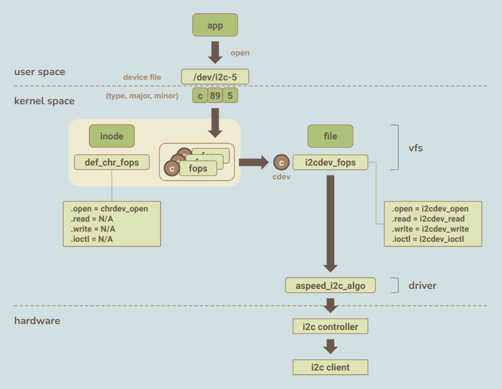
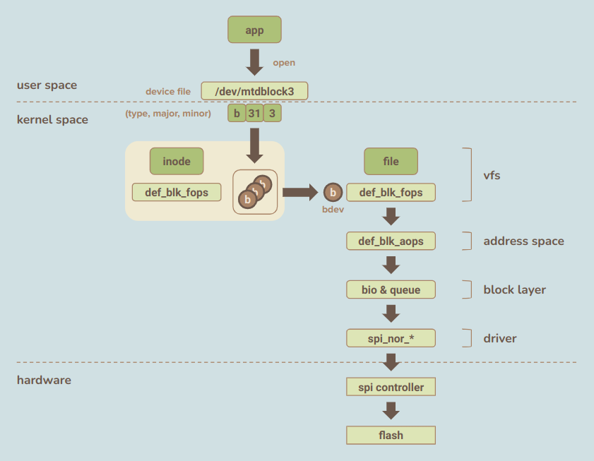
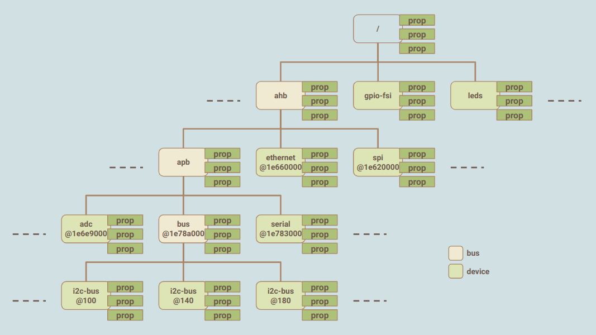

> The note is based on Linux version 5.15.43 in OpenBMC.

## Index

- [Introduction](#introduction)
- [Character Device](#character-device)
- [Block Device](#block-device)
- [Device Tree](#device-tree)
- [System Startup](#system-startup)
- [Cheat Sheet](#cheat-sheet)
- [Reference](#reference)

## <a name="introduction"></a> Introduction

(TBD)

## <a name="character-device"></a> Character Device

The virtual filesystem supports a few file types, two of which are character and block devices that behave as interfaces exported to user space.
Traditionally we place all device files under `/dev/`; list the files it contains, and we can see each file's type, major, and minor number. 
We can also create a device file elsewhere through `mknod`; as long as we specify the above three attributes correctly, they work no differently.

```
root@romulus:~# ls -l /dev/
...
crw-------    1 root     root       89,   1 Oct 23 04:00 /dev/i2c-1
crw-------    1 root     root       89,  10 Oct 23 04:00 /dev/i2c-10
crw-------    1 root     root       89,  11 Oct 23 04:00 /dev/i2c-11
...
brw-rw----    1 root     disk       31,   0 Oct 23 04:00 /dev/mtdblock0
brw-rw----    1 root     disk       31,   1 Oct 23 04:00 /dev/mtdblock1
brw-rw----    1 root     disk       31,   2 Oct 23 04:00 /dev/mtdblock2
|                                    |    |
v                                    v    v
file type                         major  minor
```

Roughly speaking, not strictly correct, character files can be any non-storage devices such as I2C, SPI, TTY, and so on. 
Though the underlying devices vary, the applications work on them through typical file operations like handling regular files. 
On the kernel side, no uniform functions are provided since only the specific driver knows how to manage its hardware. 
Therefore, the kernel solely offers the `open`, which locates the corresponding driver and switches to it.

- `open`
    - The virtual filesystem generates a `file` structure in kernel space accessible by file identifier from user space.
    - Given a type, major, and minor number, it finds the target `cdev` from the related table and fetches the file operations (fops) from it.
    - Immediately attaches the specific file operations, the replacement for default ones, to the opened `file`.
- `read`
    - No default function is available.
- `write`
    - No default function is available.
- `ioctl`
    - No default function is available.

<p align="center"></p>

<details><summary> More Details </summary>

```c
struct inode {
    umode_t         i_mode;                     // file type: char or block
    dev_t           i_rdev;                     // dev#
    union {
        const struct file_operations    *i_fop; // file operations
        void (*free_inode)(struct inode *);
    };
    union {
        struct pipe_inode_info  *i_pipe;
        struct cdev     *i_cdev;
        char            *i_link;
        unsigned        i_dir_seq;
    };
}
```

```c
const struct file_operations def_chr_fops = {
    .open = chrdev_open,
    .llseek = noop_llseek,
};
```

```
+-------------+                                         
| chrdev_open | :
+---|---------+                                         
    |                                                   
    |--> if inode doesn't know where cdev is            
    |                                                   
    |------> serach cdev in 'cdev_map' based on dev#    
    |                                                   
    |------> save cdev addr in inode                    
    |                                                   
    |--> get file ops from cdev                         
    |                                                   
    |    +--------------+                               
    |--> | replace_fops | replace fops of file to cdev's
    |    +--------------+                               
    |                                                   
    +--> call ->open, e.g.,                             
         +--------------+                               
         | mtdchar_open |                               
         +--------------+                               
```

```c
struct cdev {
    struct kobject kobj;
    struct module *owner;               // points to module if there's any
    const struct file_operations *ops;  // file operations
    struct list_head list;              // all inodes that represent the cdev are on the list
    dev_t dev;                          // dev#
    unsigned int count;                 // range of minor
} __randomize_layout;
```
    
</details>

## <a name="block-device"></a> Block Device

Block device files uniformly represent storage such as hard drive, pen drive, NVMe, and non-persistent storage like ramdisk. 
Besides the difference in medium and transfer protocol complexity, they are merely used as spaces from which we save files and read. 
Commonly speaking, drive data operation is slow, especially compared to processor cache and memory. 
Such drawback indicates that optimizations are necessary and have been made between application and driver layers.

- VFS Layer
    - Given the type, major, and minor numbers, it grabs the corresponding block device (bdev) and saves it in the `file` for the following use.
    - Default operations are ready for `open`, `read`, `write`, and `ioctl`.
- Address Space
    - A file duplication, a.k.a. page cache, is kept in memory for faster operation while retaining interfaces toward the actual file in storage.
    - Reads from disk if the file doesn't exist in memory yet.
    - Writes the file to disk periodically or on demand.
    - (will be covered on another page)
- Block Layer
    - A per-bdev queue holds requests for a while, giving the IO scheduler a chance to do its job before consigning them to the driver.
    - (will be covered on another page)
- Driver
    - Drops the command to the hardware controller for actual read and write actions.
    - (will be covered on another page)

<p align="center"></p>

<details><summary> More Details </summary>

```
Surprise! Nothing is here; please refer to another page that hasn't existed!
```
    
</details>

## <a name="device-tree"></a> Device Tree

Kernel features a significantly tremendous collection of drivers, which users can configure before the image is built. 
We can enable a decent number of built-in drivers or standalone modules to support the chip, such as AST2500. 
However, hardware configurations inevitably differ, like adding mux on motherboard A or disabling unused SPI controller on motherboard B. 
Instead of having device info fixed inside the kernel and building images for each kind, the developers come up with the idea: device tree. 
The parent-children hierarchy starts with the root `/`, and nodes are mostly descriptors of devices and come with generic or driver-specific properties. 
We select a device tree of a hardware configuration for the kernel before startup; later kernel parses the input and matches the drivers accordingly. 
Here are the typical terms related to the device tree and the corresponding files in our study case:

- Device Tree Source (DTS)
    - for human to write and configure
    - e.g., `arch/arm/boot/dts/aspeed-bmc-opp-romulus.dts`
- Device Tree Source Include Files (DTSI)
    - for DTS to use as the base and later overwrite specific nodes if necessary.
    - e.g., `arch/arm/boot/dts/aspeed-g5.dtsi`
    - e.g., `arch/arm/boot/dts/openbmc-flash-layout.dtsi`
- Device Tree Blob (DTB)
    - for kernel to parse
    - e.g., `arch/arm/boot/dts/aspeed-bmc-opp-romulus.dtb`

<p align="center"></p>

<details><summary> More Details </summary>

Property **#address-cells** and **size-cells** in parent node specify how to interpret property **reg** of children. 
The most common node properties are the register base and hardware interrupt number, and the kernel will regard them as device resources when parsing.

```
    ahb {
        compatible = "simple-bus";
        #address-cells = <1>;   // 1 dword (4 bytes)
        #size-cells = <1>;      // 1 dword (4 bytes)
        ranges;                 // so we interpret child node's reg as < 1 dword addr + 1 dword size, and so on >

        fmc: spi@1e620000 {
            reg = < 0x1e620000 0xc4             // a. 1 dword addr (0x1e620000) + 1 dword size (0xc4)
                0x20000000 0x10000000 >;        // b. 1 dword addr (0x20000000) + 1 dword size (0x10000000)
            #address-cells = <1>;              
            #size-cells = <0>; 
            compatible = "aspeed,ast2500-fmc";
            clocks = <&syscon ASPEED_CLK_AHB>;
            status = "disabled";
            interrupts = <19>;                  // c. hardware irq
```

The kernel will add resources for the above item a, b, and c. So the driver can later access them by the usage:

```
platform_get_resource(pdev, IORESOURCE_MEM, 0); // access the MEM type resource with index = 0
platform_get_resource(pdev, IORESOURCE_MEM, 1); // access the MEM type resource with index = 1
platform_get_resource(pdev, IORESOURCE_IRQ, 0); // access the IRQ type resource with index = 0
```

```
dtc -I dtb -O dts arch/arm/boot/dts/aspeed-bmc-opp-romulus.dtb  # construct dts from dtb
dtc -I fs -O dts /sys/firmware/devicetree/base                  # construct dts from filesystem (not that useful to me)
```

- List of devices added from DTB in function **of_platform_default_populate_init**

```
[    0.180038] device: 'ahb': device_add
[    0.198481] device: '1e620000.spi': device_add
[    0.203438] device: '1e630000.spi': device_add
[    0.204606] device: '1e6c2000.copro-interrupt-controller': device_add
[    0.205406] device: '1e660000.ethernet': device_add
[    0.206037] device: '1e6a0000.usb-vhub': device_add
[    0.206468] device: 'ahb:apb': device_add
[    0.207725] device: '1e6e2000.syscon': device_add
[    0.209195] device: '1e6e207c.silicon-id': device_add
[    0.209675] device: '1e6e2080.pinctrl': device_add
[    0.210556] device: 'platform:1e6e2080.pinctrl--platform:1e6a0000.usb-vhub': device_add
[    0.211799] device: 'platform:1e6e2080.pinctrl--platform:1e660000.ethernet': device_add
[    0.212234] device: 'platform:1e6e2080.pinctrl--platform:1e630000.spi': device_add
[    0.219286] device: '1e6e2078.hwrng': device_add
[    0.220000] device: '1e6e6000.display': device_add
[    0.220521] device: '1e6e9000.adc': device_add
[    0.221058] device: '1e700000.video': device_add
[    0.221494] device: '1e720000.sram': device_add
[    0.224925] device: '1e780000.gpio': device_add
[    0.226185] device: '1e782000.timer': device_add
[    0.226842] device: '1e783000.serial': device_add
[    0.227221] device: 'platform:1e6e2080.pinctrl--platform:1e783000.serial': device_add
[    0.228314] device: '1e784000.serial': device_add
[    0.228824] device: '1e785000.watchdog': device_add
[    0.230142] device: '1e785020.watchdog': device_add
[    0.230842] device: '1e786000.pwm-tacho-controller': device_add
[    0.231402] device: 'platform:1e6e2080.pinctrl--platform:1e786000.pwm-tacho-controller': device_add
[    0.233039] device: '1e787000.serial': device_add
[    0.233714] device: '1e789000.lpc': device_add
[    0.234579] device: '1e789080.lpc-ctrl': device_add
[    0.235052] device: '1e789098.reset-controller': device_add
[    0.235502] device: 'platform:1e789098.reset-controller--platform:1e783000.serial': device_add
[    0.236189] device: '1e7890a0.lhc': device_add
[    0.236727] device: '1e789140.ibt': device_add
[    0.237134] device: 'ahb:apb:bus@1e78a000': device_add
[    0.237557] device: 'platform:1e6e2080.pinctrl--platform:ahb:apb:bus@1e78a000': device_add
[    0.238347] device: '1e78a080.i2c-bus': device_add
[    0.238912] device: '1e78a0c0.i2c-bus': device_add
[    0.239235] device: 'platform:1e6e2080.pinctrl--platform:1e78a0c0.i2c-bus': device_add
[    0.240138] device: '1e78a100.i2c-bus': device_add
[    0.240517] device: 'platform:1e6e2080.pinctrl--platform:1e78a100.i2c-bus': device_add
[    0.241372] device: '1e78a140.i2c-bus': device_add
[    0.241701] device: 'platform:1e6e2080.pinctrl--platform:1e78a140.i2c-bus': device_add
[    0.242752] device: '1e78a180.i2c-bus': device_add
[    0.243082] device: 'platform:1e6e2080.pinctrl--platform:1e78a180.i2c-bus': device_add
[    0.244224] device: '1e78a1c0.i2c-bus': device_add
[    0.244661] device: 'platform:1e6e2080.pinctrl--platform:1e78a1c0.i2c-bus': device_add
[    0.245651] device: '1e78a300.i2c-bus': device_add
[    0.246012] device: 'platform:1e6e2080.pinctrl--platform:1e78a300.i2c-bus': device_add
[    0.246913] device: '1e78a340.i2c-bus': device_add
[    0.247237] device: 'platform:1e6e2080.pinctrl--platform:1e78a340.i2c-bus': device_add
[    0.248209] device: '1e78a380.i2c-bus': device_add
[    0.248543] device: 'platform:1e6e2080.pinctrl--platform:1e78a380.i2c-bus': device_add
[    0.249513] device: '1e78a3c0.i2c-bus': device_add
[    0.249877] device: 'platform:1e6e2080.pinctrl--platform:1e78a3c0.i2c-bus': device_add
[    0.251000] device: '1e78a400.i2c-bus': device_add
[    0.251382] device: 'platform:1e6e2080.pinctrl--platform:1e78a400.i2c-bus': device_add
[    0.252276] device: '1e78a440.i2c-bus': device_add
[    0.252613] device: 'platform:1e6e2080.pinctrl--platform:1e78a440.i2c-bus': device_add
[    0.253403] device: 'leds': device_add
[    0.254278] device: 'platform:1e780000.gpio--platform:leds': device_add
[    0.254838] device: 'gpio-fsi': device_add
[    0.256303] device: 'platform:1e780000.gpio--platform:gpio-fsi': device_add
[    0.256757] device: 'gpio-keys': device_add
[    0.257201] device: 'platform:1e780000.gpio--platform:gpio-keys': device_add
[    0.257606] device: 'iio-hwmon-battery': device_add
```

</details>
    
## <a name="system-startup"></a> System Startup

Except for interrupt controllers and disabled components, the kernel registers the remaining devices, and here's how they are handled:

1. Traverse each driver and attempt to find a match.
2. If found, the driver starts probing, initializing the infrastructure by throwing together properties, irq number, and iomem fed from the node.

Later, when drivers register to the framework, it similarly goes through the devices to find the soul mate and set up. 
Registration sequence doesn't matter, and the net result is that some matched drivers further prepare the character and block device interfaces.
    
```
[    0.000000] Booting Linux on physical CPU 0x0
[    0.000000] Linux version 5.15.69-gaae649813251-dirty (bobfu@bobfu-Vostro-5402) (arm-linux-gnueabi-gcc (Ubuntu 11.3.0-1ubuntu1~22.04) 11.3.0, GNU ld (GNU Binutils for Ubuntu) 2.38) #4 SMP Wed Oct 26 23:47:31 PDT 2022
[    0.000000] CPU: ARMv6-compatible processor [410fb767] revision 7 (ARMv7), cr=00c5387d
[    0.000000] CPU: VIPT aliasing data cache, unknown instruction cache
[    0.000000] OF: fdt: Machine model: Romulus BMC
[    0.000000] earlycon: ns16550a0 at MMIO 0x1e784000 (options '')
[    0.000000] printk: bootconsole [ns16550a0] enabled
[    0.000000] Memory policy: Data cache writeback
[    0.000000] Reserved memory: created CMA memory pool at 0x9d000000, size 16 MiB
[    0.000000] OF: reserved mem: initialized node framebuffer, compatible id shared-dma-pool
[    0.000000] Reserved memory: created CMA memory pool at 0x96000000, size 32 MiB
[    0.000000] OF: reserved mem: initialized node jpegbuffer, compatible id shared-dma-pool
[    0.000000] cma: Reserved 16 MiB at 0x9c000000
[    0.000000] Ignoring RAM at 0x9ee00000-0xa0000000
[    0.000000] Consider using a HIGHMEM enabled kernel.
[    0.000000] Zone ranges:
[    0.000000]   Normal   [mem 0x0000000080000000-0x000000009eefffff]
[    0.000000]   HighMem  empty
[    0.000000] Movable zone start for each node
[    0.000000] Early memory node ranges
[    0.000000]   node   0: [mem 0x0000000080000000-0x0000000097ffffff]
[    0.000000]   node   0: [mem 0x0000000098000000-0x000000009bffffff]
[    0.000000]   node   0: [mem 0x000000009c000000-0x000000009edfffff]
[    0.000000] Initmem setup node 0 [mem 0x0000000080000000-0x000000009edfffff]
[    0.000000] CPU: All CPU(s) started in SVC mode.
[    0.000000] percpu: Embedded 16 pages/cpu s35340 r8192 d22004 u65536
[    0.000000] pcpu-alloc: s35340 r8192 d22004 u65536 alloc=16*4096
[    0.000000] pcpu-alloc: [0] 0 
[    0.000000] Built 1 zonelists, mobility grouping on.  Total pages: 125476
[    0.000000] Kernel command line: console=ttyS4,115200 earlycon
[    0.000000] Dentry cache hash table entries: 65536 (order: 6, 262144 bytes, linear)
[    0.000000] Inode-cache hash table entries: 32768 (order: 5, 131072 bytes, linear)
[    0.000000] mem auto-init: stack:off, heap alloc:off, heap free:off
[    0.000000] Memory: 354588K/505856K available (9216K kernel code, 830K rwdata, 2248K rodata, 1024K init, 186K bss, 85732K reserved, 65536K cma-reserved, 0K highmem)
[    0.000000] SLUB: HWalign=64, Order=0-3, MinObjects=0, CPUs=1, Nodes=1
[    0.000000] ftrace: allocating 28976 entries in 85 pages
[    0.000000] ftrace: allocated 85 pages with 4 groups
[    0.000000] trace event string verifier disabled
[    0.000000] rcu: Hierarchical RCU implementation.
[    0.000000] rcu: 	RCU event tracing is enabled.
[    0.000000] rcu: 	RCU restricting CPUs from NR_CPUS=2 to nr_cpu_ids=1.
[    0.000000] 	Rude variant of Tasks RCU enabled.
[    0.000000] 	Tracing variant of Tasks RCU enabled.
[    0.000000] rcu: RCU calculated value of scheduler-enlistment delay is 10 jiffies.
[    0.000000] rcu: Adjusting geometry for rcu_fanout_leaf=16, nr_cpu_ids=1
[    0.000000] NR_IRQS: 16, nr_irqs: 16, preallocated irqs: 16
[    0.000000] i2c controller registered, irq 17
[    0.000000] clocksource: FTTMR010-TIMER2: mask: 0xffffffff max_cycles: 0xffffffff, max_idle_ns: 77222644334 ns
[    0.000112] sched_clock: 32 bits at 24MHz, resolution 40ns, wraps every 86767015915ns
[    0.001752] Switching to timer-based delay loop, resolution 40ns
----- console_initcall section starts -----
----- console_initcall section ends -----
[    0.005743] Calibrating delay loop (skipped), value calculated using timer frequency.. 49.50 BogoMIPS (lpj=247500)
[    0.006114] pid_max: default: 32768 minimum: 301
[    0.009279] Mount-cache hash table entries: 1024 (order: 0, 4096 bytes, linear)
[    0.009468] Mountpoint-cache hash table entries: 1024 (order: 0, 4096 bytes, linear)
[    0.026029] CPU: Testing write buffer coherency: ok
----- early_initcall section starts -----
[    0.039965] Setting up static identity map for 0x80100000 - 0x80100078
[    0.040797] rcu: Hierarchical SRCU implementation.
[    0.044779] ASPEED AST2500 rev A1 (04010303)
----- early_initcall section ends -----
[    0.046486] smp: Bringing up secondary CPUs ...
[    0.046641] smp: Brought up 1 node, 1 CPU
[    0.046826] SMP: Total of 1 processors activated (49.50 BogoMIPS).
[    0.047021] CPU: All CPU(s) started in SVC mode.
[    0.057870] devtmpfs: initialized
----- pure_initcall section starts -----
----- pure_initcall section ends -----
----- core_initcall section starts -----
[    0.076306] VFP support v0.3: implementor 41 architecture 1 part 20 variant b rev 5
[    0.091632] clocksource: jiffies: mask: 0xffffffff max_cycles: 0xffffffff, max_idle_ns: 19112604462750000 ns
[    0.092715] futex hash table entries: 256 (order: 2, 16384 bytes, linear)
[    0.098764] pinctrl core: initialized pinctrl subsystem
[    0.114512] NET: Registered PF_NETLINK/PF_ROUTE protocol family
----- core_initcall section ends -----
----- postcore_initcall section starts -----
[    0.125983] DMA: preallocated 256 KiB pool for atomic coherent allocations
----- postcore_initcall section ends -----
----- arch_initcall section starts -----
[    0.130412] hw-breakpoint: debug architecture 0x0 unsupported.
----- arch_initcall section ends -----
----- subsys_initcall section starts -----    
[    0.185670] Kprobes globally optimized
[    0.205378] SCSI subsystem initialized
[    0.206391] usbcore: registered new interface driver usbfs
[    0.206812] usbcore: registered new interface driver hub
[    0.207223] usbcore: registered new device driver usb
[    0.208119] mc: Linux media interface: v0.10
[    0.208577] videodev: Linux video capture interface: v2.00
[    0.209095] pps_core: LinuxPPS API ver. 1 registered
[    0.209419] pps_core: Software ver. 5.3.6 - Copyright 2005-2007 Rodolfo Giometti <giometti@linux.it>
[    0.210041] PTP clock support registered
[    0.210386] EDAC MC: Ver: 3.0.0
[    0.221265] mctp: management component transport protocol core
[    0.221491] NET: Registered PF_MCTP protocol family
----- subsys_initcall section ends -----  
----- fs_initcall section starts -----    
[    0.232205] clocksource: Switched to clocksource FTTMR010-TIMER2
[    0.286552] NET: Registered PF_INET protocol family
[    0.288124] IP idents hash table entries: 8192 (order: 4, 65536 bytes, linear)
[    0.291880] tcp_listen_portaddr_hash hash table entries: 512 (order: 0, 6144 bytes, linear)
[    0.292201] Table-perturb hash table entries: 65536 (order: 6, 262144 bytes, linear)
[    0.292481] TCP established hash table entries: 4096 (order: 2, 16384 bytes, linear)
[    0.292830] TCP bind hash table entries: 4096 (order: 3, 32768 bytes, linear)
[    0.293143] TCP: Hash tables configured (established 4096 bind 4096)
[    0.294303] UDP hash table entries: 256 (order: 1, 8192 bytes, linear)
[    0.294691] UDP-Lite hash table entries: 256 (order: 1, 8192 bytes, linear)
[    0.296047] NET: Registered PF_UNIX/PF_LOCAL protocol family
----- fs_initcall section ends -----
----- rootfs_initcall section starts -----
----- rootfs_initcall section ends -----
----- device_initcall section starts -----
[    0.303449] Unpacking initramfs...
[    0.324379] workingset: timestamp_bits=30 max_order=17 bucket_order=0
[    0.333170] squashfs: version 4.0 (2009/01/31) Phillip Lougher
[    0.333798] jffs2: version 2.2. (SUMMARY)  © 2001-2006 Red Hat, Inc.
[    0.335792] NET: Registered PF_ALG protocol family
[    0.348923] gpio-819 (nic_func_mode0): hogged as output/low
[    0.349182] gpio-820 (nic_func_mode1): hogged as output/low
[    0.349355] gpio-943 (seq_cont): hogged as output/low
[    0.365049] ipmi-bt-host 1e789140.ibt: Found bt bmc device
[    0.366584] ipmi-bt-host 1e789140.ibt: Using IRQ 34
[    0.385032] Serial: 8250/16550 driver, 6 ports, IRQ sharing enabled
[    0.392850] 1e787000.serial: ttyS5 at MMIO 0x1e787000 (irq = 34, base_baud = 1546875) is a ASPEED VUART
[    0.407534] 1e783000.serial: ttyS0 at MMIO 0x1e783000 (irq = 32, base_baud = 1500000) is a 16550A
[    0.412622] 1e784000.serial: ttyS4 at MMIO 0x1e784000 (irq = 33, base_baud = 1500000) is a 16550A
[    0.414064] printk: console [ttyS4] enabled
[    0.414556] printk: bootconsole [ns16550a0] disabled
[    0.424346] timeriomem_rng 1e6e2078.hwrng: 32bits from 0x(ptrval) @ 1us
[    0.426618] aspeed_gfx 1e6e6000.display: assigned reserved memory node framebuffer
[    0.466909] [drm] Initialized aspeed-gfx-drm 1.0.0 20180319 for 1e6e6000.display on minor 0
[    0.502691] aspeed_gfx 1e6e6000.display: [drm] fb0: aspeed-gfx-drmd frame buffer device
[    0.523210] loop: module loaded
[    0.540976] random: crng init done
[    0.586796] spi-nor spi0.0: n25q256a (32768 Kbytes)
[    1.344986] spi-aspeed-smc 1e620000.spi: CE0 read buswidth:2 [0x203b0641]
[    1.675808] Freeing initrd memory: 1076K
[    1.762860] 5 fixed-partitions partitions found on MTD device bmc
[    1.763113] Creating 5 MTD partitions on "bmc":
[    1.763369] 0x000000000000-0x000000060000 : "u-boot"
[    1.765620] 0x000000060000-0x000000080000 : "u-boot-env"
[    1.766919] 0x000000080000-0x0000004c0000 : "kernel"
[    1.768134] 0x0000004c0000-0x000001c00000 : "rofs"
[    1.769322] 0x000001c00000-0x000002000000 : "rwfs"
[    1.775133] spi-nor spi1.0: mx66l1g45g (131072 Kbytes)
[    1.775289] spi-aspeed-smc 1e630000.spi: CE0 window resized to 120MB (AST2500 HW quirk)
[    1.775864] spi-aspeed-smc 1e630000.spi: CE0 window (120MB) too small for mapping
[    1.783126] spi-aspeed-smc 1e630000.spi: Calibration area too uniform, using low speed
[    1.783342] spi-aspeed-smc 1e630000.spi: CE0 read buswidth:2 [0x203c0041]
[    1.829208] ftgmac100 1e660000.ethernet: Read MAC address 52:54:00:12:34:56 from chip
[    1.829612] ftgmac100 1e660000.ethernet: Using NCSI interface
[    1.842780] ftgmac100 1e660000.ethernet eth0: irq 20, mapped at 0a792023
[    1.843482] MCTP I2C interface driver
[    1.843690] ehci_hcd: USB 2.0 'Enhanced' Host Controller (EHCI) Driver
[    1.843969] ehci-platform: EHCI generic platform driver
[    1.844593] usbcore: registered new interface driver usb-storage
[    1.845091] usbcore: registered new interface driver pl2303
[    1.845426] usbserial: USB Serial support registered for pl2303
[    1.860765] aspeed_vhub 1e6a0000.usb-vhub: Initialized virtual hub in USB2 mode
[    1.863027] i2c_dev: i2c /dev entries driver
[    1.865924] aspeed-i2c-bus 1e78a080.i2c-bus: i2c bus 1 registered, irq 35
[    1.866938] aspeed-i2c-bus 1e78a0c0.i2c-bus: i2c bus 2 registered, irq 36
[    1.867731] aspeed-i2c-bus 1e78a100.i2c-bus: i2c bus 3 registered, irq 37
[    1.868507] aspeed-i2c-bus 1e78a140.i2c-bus: i2c bus 4 registered, irq 38
[    1.869326] aspeed-i2c-bus 1e78a180.i2c-bus: i2c bus 5 registered, irq 39
[    1.870070] aspeed-i2c-bus 1e78a1c0.i2c-bus: i2c bus 6 registered, irq 40
[    1.870956] aspeed-i2c-bus 1e78a300.i2c-bus: i2c bus 7 registered, irq 41
[    1.872189] aspeed-i2c-bus 1e78a340.i2c-bus: i2c bus 8 registered, irq 42
[    1.873143] aspeed-i2c-bus 1e78a380.i2c-bus: i2c bus 9 registered, irq 43
[    1.873938] aspeed-i2c-bus 1e78a3c0.i2c-bus: i2c bus 10 registered, irq 44
[    1.879169] rtc-rv8803 11-0032: registered as rtc0
[    1.880576] rtc-rv8803 11-0032: setting system clock to 2022-10-27T14:31:13 UTC (1666881073)
[    1.882506] aspeed-i2c-bus 1e78a400.i2c-bus: i2c bus 11 registered, irq 45
[    1.883936] aspeed-i2c-bus 1e78a440.i2c-bus: i2c bus 12 registered, irq 46
[    1.885895] aspeed-video 1e700000.video: assigned reserved memory node jpegbuffer
[    1.891435] Driver for 1-wire Dallas network protocol.
[    1.893721] w83773g 12-004c: error writing config rate register
[    1.900103] sdhci: Secure Digital Host Controller Interface driver
[    1.900259] sdhci: Copyright(c) Pierre Ossman
[    1.900362] sdhci-pltfm: SDHCI platform and OF driver helper
[    1.904658] usbcore: registered new interface driver usbhid
[    1.904878] usbhid: USB HID core driver
[    1.910429] SPI driver bmp280 has no spi_device_id for bosch,bmp085
[    1.916138] fsi-master-acf gpio-fsi: ColdFire initialized, firmware v4 API v2.1 (trace disabled)
[    2.212752] fsi-master-acf gpio-fsi: Coprocessor startup timeout !
[    2.233701] NET: Registered PF_INET6 protocol family
[    2.241406] Segment Routing with IPv6
[    2.242001] In-situ OAM (IOAM) with IPv6
[    2.243175] NET: Registered PF_PACKET protocol family
[    2.243544] 8021q: 802.1Q VLAN Support v1.8
----- device_initcall section ends -----
----- late_initcall section starts -----
[    2.244279] Registering SWP/SWPB emulation handler
[    2.256221] printk: console [netcon0] enabled
[    2.256452] netconsole: network logging started
[    2.260362] input: gpio-keys as /devices/platform/gpio-keys/input/input0
----- late_initcall section ends -----
[    2.289015] Freeing unused kernel image (initmem) memory: 1024K
[    2.306049] Checked W+X mappings: passed, no W+X pages found
[    2.306450] Run /init as init process
[    2.306663]   with arguments:
[    2.306725]     /init
[    2.306754]   with environment:
[    2.306773]     HOME=/
[    2.306789]     TERM=linux
...
```
    
Before introducing driver and device, let's talk about the **bus** first. 
We can regard the **bus** as a collection of devices and drivers, and there are numerous buses in the system.

```
                                        +-------+        +-------+
                                   ┌──► | dev A | ◄────► | dev B |
                 subsys_private    │    +-------+        +-------+
bus_type        +---------------+  │
  +---+         | klist_devices ◄──┘
  | p ────────► |               |
  +---+         | klist_drivers ◄──┐
                +---------------+  │
                                   │    +-------+        +-------+        +-------+
                                   └──► | drv C | ◄────► | drv D | ◄────► | drv E |
                                        +-------+        +-------+        +-------+
```

```
root@romulus:/sys/bus# ls
clockevents   cpu           fsi           i2c           media         nvmem         serio         usb
clocksource   edac          gpio          iio           mmc           platform      soc           w1
container     event_source  hid           mdio_bus      mmc_rpmb      sdio          spi           workqueue
```

When registering a driver, it must specify the bus type so the kernel knows where to append the driver structure. 
Function **paltform_driver_register** is the helper that selects the bus **platform** automatically.


```
struct kobj_map {
    struct probe {
        struct probe *next;   // singly linked list
        dev_t dev;            // dev# = (major, minor)
        unsigned long range;  // range of consecutive minor#
        struct module *owner;
        kobj_probe_t *get;    // point to func that returns kobj
        int (*lock)(dev_t, void *);
        void *data;           // points to struct cdev of gendisk           
    } *probes[255];
    struct mutex *lock;
};
```

```
static struct char_device_struct {
    struct char_device_struct *next;    // singly linked list
    unsigned int major;                 // major#
    unsigned int baseminor;             // smallest minor#
    int minorct;                        // minor count = 'range' in kobj_map
    char name[64];                      // dev identifier
    struct cdev *cdev;                  // points to cdev
} *chrdevs[CHRDEV_MAJOR_HASH_SIZE];
```

```
+-------------------+                                                                              
| __register_chrdev |                                                                              
+----|--------------+                                                                              
     |    +--------------------------+                                                             
     |--> | __register_chrdev_region | check if specified dev# range is available, reserve it if so
     |    +--------------------------+                                                             
     |                                                                                             
     |--> prepare a 'cdev' for the dev# range                                                      
     |                                                                                             
     |    +----------+                                                                             
     +--> | cdev_add | add the 'cdev' to a table for later lookup                                  
          +----------+                                                                             
```

```
 +--------------------------+                                                        
 | platform_driver_register |                                                        
 +------|-------------------+                                                        
        |                                                                            
        |--> driver bus = platform_bus_type                                          
        |                                                                            
        |    +-----------------+                                                     
        +--> | driver_register | ensure driver is in bus, probe devices if newly registered                                                           
             +-----------------+                                                     
```

```
+-----------------+                                                                    
| driver_register | : ensure driver is in bus, probe devices if newly registered       
+----|------------+                                                                    
     |    +-------------+                                                              
     |--> | driver_find | check if it's already registered                             
     |    +-------------+                                                              
     |    +----------------+                                                           
     +--> | bus_add_driver | add driver to list of bus, probe devices to find match(es)
          +----------------+                                                           
```

```
+----------------+                                                             
| bus_add_driver | : add driver to list of bus, probe devices to find match(es)
+---|------------+                                                             
    |                                                                          
    |--> alloc private                                                         
    |                                                                          
    |--> drvier kset = bus-driver kset                                         
    |                                                                          
    |    +----------------+                                                    
    |--> | klist_add_tail | add drvier to the driver list of bus               
    |    +----------------+                                                    
    |                                                                          
    |--> if bus 'auto probe' is labeled                                        
    |                                                                          
    |        +---------------+                                                 
    |------> | driver_attach | probe each device in bus to find the match      
    |        +---------------+                                                 
    |                                                                          
    +--> create files under /sys/                                              
```

```c
struct resource {
    resource_size_t start;  // start addr or irq
    resource_size_t end;    // end addr or irq
    const char *name;       // displays in /proc
    unsigned long flags;    // e.g., indicate the resource type
    unsigned long desc;
    struct resource *parent, *sibling, *child;  // hierarchy
};
```

```c
struct device {
    struct device       *parent;            // points to parent device
    struct kobject kobj;                    // generic kobject framework
    struct bus_type *bus;                   // points to the bus where the device belongs to
    truct device_driver *driver;            // points to the corresponding driver
    void        *platform_data;             // private to platform code
    void        *driver_data;               // private to driver code
    void    (*release)(struct device *dev); // release resource to kernel
};
```

```c
struct device_driver {
    const char      *name;                  // driver identifier
    struct bus_type     *bus;               // points to the bus where the driver belongs to
    int (*probe) (struct device *dev);      // check if the driver can be applied to arg device
    int (*remove) (struct device *dev);     // call when device is removed 
    void (*shutdown) (struct device *dev);  // power management related
    int (*suspend) (struct device *dev, pm_message_t state);    // power management related
    int (*resume) (struct device *dev);     // power management related
};
```

```c
struct bus_type {
    const char      *name;                                  // name shown in /sys
    int (*match)(struct device *dev, struct device_driver *drv);    // attempt to find the matching driver for a given device
    int (*probe)(struct device *dev);                       // link driver and device
    void (*remove)(struct device *dev);                     // remove the unlink between driver and device
    void (*shutdown)(struct device *dev);                   // power management operation
    int (*suspend)(struct device *dev, pm_message_t state); // power management operation
    int (*resume)(struct device *dev);                      // power management operation
    struct subsys_private *p;                               // list heads for both drivers and devices
};
```

```
+--------------+                                            
| bus_register | : register bus and prepare files under /sys
+---|----------+                                            
    |                                                       
    |--> alloc private                                      
    |                                                       
    |    +------------------+                               
    |--> | kobject_set_name |                               
    |    +------------------+                               
    |    +---------------+                                  
    |--> | kset_register | add to bus subsystem
    |    +---------------+                                  
    |    +-----------------+                                
    |--> | bus_create_file | create files under /sys        
    |    +-----------------+                                
    |    +---------------------+                            
    |--> | kset_create_and_add | register "devices" kset to sysfs
    |    +---------------------+                            
    |    +---------------------+                            
    |--> | kset_create_and_add | register "drivers" kset to sysfs
    |    +---------------------+                            
    |    +-----------------+                                
    |--> | add_probe_files | create files under /sys        
    |    +-----------------+                                
    |    +----------------+                                 
    +--> | bus_add_groups | create files under /sys         
         +----------------+                                 
```

The kernel prepares the device structure for any device from DTS/DTB, parses its node properties, and then allocates resource structures accordingly. 
The rest is similar to the driver registration.
It doesn't matter whether the driver or device registers first. Both flows will trigger the probe mechanism to find the match within the bus.

<details>
  <summary> Code Trace </summary>

```
+---------------------------------+                                                                            
| of_platform_device_create_pdata |                                                                            
+--------|------------------------+                                                                            
         |    +-----------------+                                                                              
         |--> | of_device_alloc | prepare the structure of the device and resources                            
         |    +-----------------+                                                                              
         |                                                                                                     
         |--> set bus = platform_bus_type                                                                      
         |                                                                                                     
         |    +---------------+                                                                                
         +--> | of_device_add |                                                                                
              +---------------+                                                                                
                                                         
```
    
```
+-----------------+                                                          
| device_register | ： add to bus, send 'add dev' to notifier, probe device   
+----|------------+                                                          
     |    +-------------------+                                              
     |--> | device_initialize |                                              
     |    +-------------------+                                              
     |    +------------+                                                     
     +--> | device_add | add to bus, send 'add dev' to notifier, probe device
          +------------+                                                     
```
    
```
+------------+
| device_add | : add to bus, send 'add dev' to notifier, probe device
+--|---------+
   |    +--------------+
   |--> | dev_set_name |
   |    +--------------+
   |    +-------------+
   +--> | kobject_add | register to device subsystem (kset is set in, e.g., device_initialize)
   |    +-------------+
   |    +----------------+
   |--> | bus_add_device | create files in /sys, add device to list of bus
   |    +----------------+
   |
   |--> if dev->bus is set
   |
   |        +------------------------------+
   |------> | blocking_notifier_call_chain | send event 'ADD_DEVICE' to notifier, e.g.,
   |        +------------------------------+ +----------------------+
   |                                         | i2cdev_notifier_call | action handler
   |                                         +----------------------+ e.g., if 'add device': prepare and register cdev
   |    +------------------+
   +--> | bus_probe_device | traverse each driver and try to match, call driver->probe() if matched
   |    +------------------+
   |
   |--> if parent dev exists
   |
   |        +----------------+
   +------> | klist_add_tail | add dev to parent's children list
            +----------------+
```
    
```
+----------------+                                                     
| bus_add_device | : create files in /sys, add device to list of bus   
+---|------------+                                                     
    |    +-------------------+                                         
    |--> | sysfs_create_link | sysfs: create device in bus folder      
    |    +-------------------+                                         
    |    +-------------------+                                         
    |--> | sysfs_create_link | sysfs: create bus in device folder      
    |    +-------------------+                                         
    |    +----------------+                                            
    +--> | klist_add_tail | append the device to the device list of bus
         +----------------+                                            
```
    
</details>

Both **driver_attach** and **bus_probe_device** are not directly but eventually go to **really_probe**, which triggers the driver defined probe function

```
+--------------+                                                                            
| really_probe |                                                                            
+---|----------+                                                                            
    |    +-------------------+                                                              
    |--> | pinctrl_bind_pins | switch pins to the expected state before probing if necessary
    |    +-------------------+                                                              
    |    +-------------------+                                                              
    |--> | call_driver_probe | call bus->probe or driver->probe (most cases)                
    |    +-------------------+                                                              
    |    +--------------+                                                                   
    +--> | driver_bound | attach the device to the driver, but not vice versa               
         +--------------+ (one driver might take care of multiple similar devices)          
```

<details>
  <summary> Messy Notes </summary>
    
To debug init calls, we add _initcall_debug_ to _bootargs_ in DTS.

```
    chosen {
        stdout-path = &uart5;
        bootargs = "console=ttyS4,115200 earlycon initcall_debug";
    };

```

Please note that by default the debug log won't display during boot time, and we need to utilize _dmesg_ to check it instead. 

- Related log
```
[    1.489785] aspeed-smc 1e620000.spi: Using 50 MHz SPI frequency
[    1.493323] aspeed-smc 1e620000.spi: n25q256a (32768 Kbytes)
[    1.493947] aspeed-smc 1e620000.spi: CE0 window [ 0x20000000 - 0x22000000 ] 32MB
[    1.494494] aspeed-smc 1e620000.spi: CE1 window [ 0x22000000 - 0x2a000000 ] 128MB
[    1.494842] aspeed-smc 1e620000.spi: read control register: 203b0045
[    1.728658] random: crng init done
[    1.923572] 5 fixed-partitions partitions found on MTD device bmc
[    1.923940] Creating 5 MTD partitions on "bmc":
[    1.924305] 0x000000000000-0x000000060000 : "u-boot"
[    1.927399] 0x000000060000-0x000000080000 : "u-boot-env"
[    1.930167] 0x000000080000-0x0000004c0000 : "kernel"
[    1.932337] 0x0000004c0000-0x000001c00000 : "rofs"
[    1.934627] 0x000001c00000-0x000002000000 : "rwfs"

▲ fmc: spi@1e620000/flash@0
------------------------------------------------------------------------------------------
▼ spi1: spi@1e630000/flash@0

[    1.941091] aspeed-smc 1e630000.spi: Using 100 MHz SPI frequency
[    1.942534] aspeed-smc 1e630000.spi: mx66l1g45g (131072 Kbytes)
[    1.942806] aspeed-smc 1e630000.spi: CE0 window resized to 120MB (AST2500 HW quirk)
[    1.943841] aspeed-smc 1e630000.spi: CE0 window [ 0x30000000 - 0x37800000 ] 120MB
[    1.944343] aspeed-smc 1e630000.spi: CE1 window [ 0x37800000 - 0x38000000 ] 8MB
[    1.944715] aspeed-smc 1e630000.spi: CE0 window too small for chip 128MB
[    1.945007] aspeed-smc 1e630000.spi: read control register: 203c0045
[    1.947181] aspeed-smc 1e630000.spi: Calibration area too uniform, using low speed

Code flow:
[aspeed_smc_probe]
    prepare controller
    get 1st MEM resource and map it as registers
    get 2nd MEM resource and map it as AHB base <- ?
    [aspeed_smc_setup_flash]
        for each flash connected to the controller (e.g. only 1)
            prepare chip
        
```
                                                   
</details>

## <a name="cheat-sheet"></a> Cheat Sheet

```
ls -l /sys/dev/char
ls -l /sys/dev/block                                                   
cat /proc/partitions
ls -l /dev
/sys/block
cat /proc/iomem
cat /proc/ioports
ls /sys/bus
CONFIG_LOG_BUF_SHIFT=17
initcall_debug
```

## <a name="reference"></a> Reference

- W. Mauerer, Professional Linux Kernel Architecture
    

