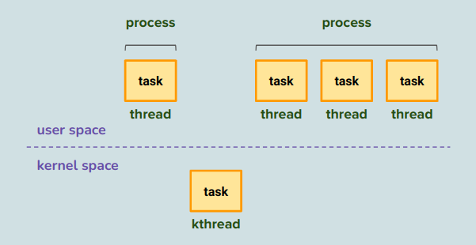
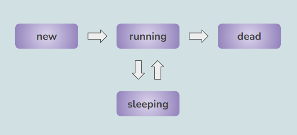
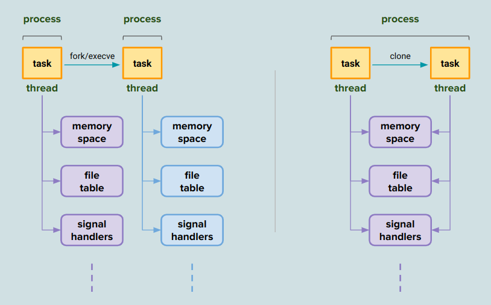
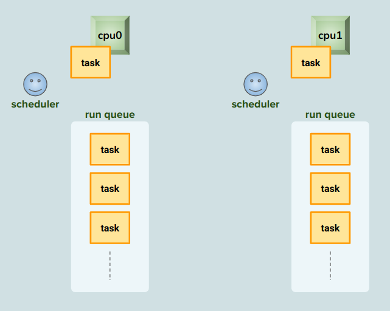
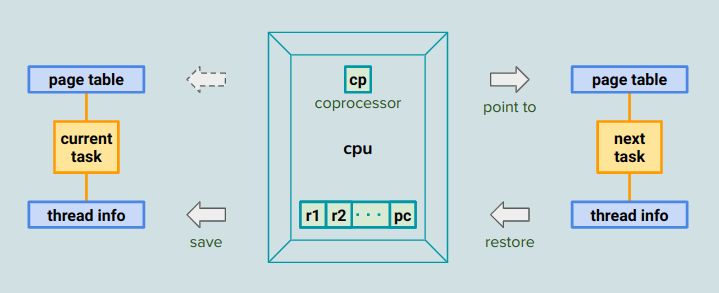
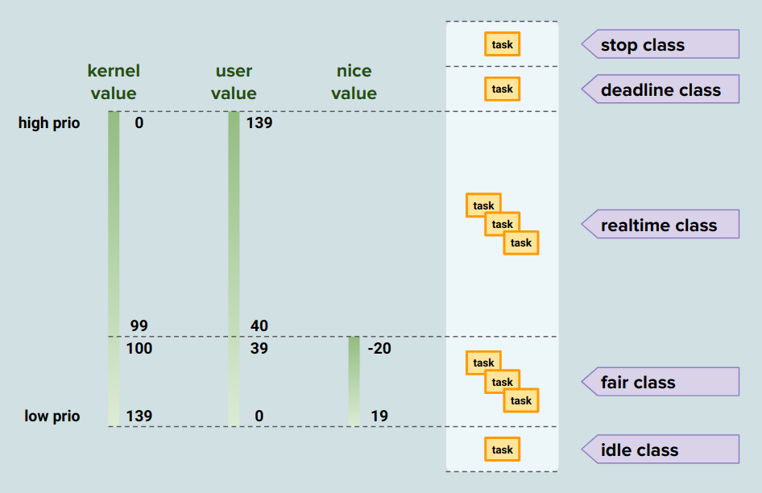
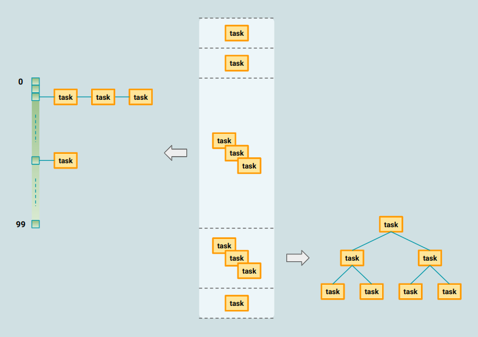
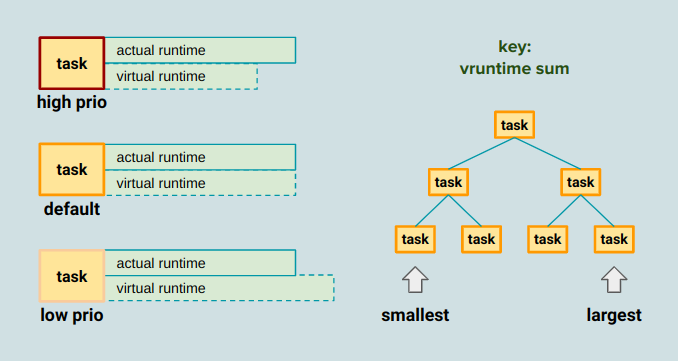
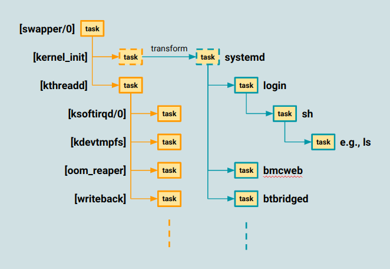

> Based on Linux version 5.15.0

## Index

- [Introduction](#introduction)
- [Process and Thread](#process-and-thread)
- [Life Cycle](#life-cycle)
- [Scheduler and Run Queue](#scheduler-and-run-queue)
- [Priority and Class](#priority-and-class)
- [System Startup](#system-startup)
- [Others](#others)
  - Resource Limit
  - PID Structure
- [Reference](#reference)

## <a name="introduction"></a> Introduction

(TBD)


## <a name="process-and-thread"></a> Process and Thread

The **process** is a concept of running logic designed to fulfill the target purpose. 
It can be simple enough, such as the famous 'hello world' containing only one thread printing the greeting string. 
Or quite complicated, working as a collection of threads executing the specified functions to solve complex jobs. 
There are also kernel threads that operate in privileged mode and manage system resources. 
Either user thread or kernel thread is regarded as a **task** from the kernel's perspective.

<p align="center"></p>

<details><summary> More Details </summary>

```                                                                 
                    process          process                        
                 +-----------+    +-----------+                     
                 | +-------+ |    | +-------+ |                     
                 | |thread | |    | |thread | |                     
                 | +-------+ |    | +-------+ |    -  -  -   -      
                 |           |    | +-------+ |                     
                 |           |    | |thread | |                     
                 |           |    | +-------+ |                     
 user space      +-----------+    +-----------+                     
--------------------------------------------------------------------
 kernel space                                                       
               +-------+    +-------+    +-------+                  
               |kthread|    |kthread|    |kthread|   - -- -  -      
               +-------+    +-------+    +-------+                  
```
  
</details>

## <a name="life-cycle"></a> Life Cycle

A task is in **NEW** status when it's newly created but not yet added to any run queue. 
It changes to **RUNNING** once queued, waiting to run, or running on a CPU. 
If actions involve event waiting during runtime, the task becomes **SLEEPING** and temporarily standby somewhere until the condition is met. 
The task can be a daemon working in the background continuously or a regular command exiting after performing its job.

<p align="center"></p>

<details><summary> More Details </summary>

```
                                             run queue                                
              +-------+    |                                                          
              |       |    |                  +------+                                
              |  CPU  |    |                  | task | state: RUNNING                 
              | +------+   |                  +------+                                
              +-|-task+|   |                 /        \                               
 state: RUNNING +------+   |                /          \                              
                    |      |         +------+          +------+                       
               fork |      |         | task |          | task | state: RUNNING        
                    v      |         +------+          +------+                       
                +------+   |          /\                    /\                        
     state: NEW | task |   |         /  \                  /  \                       
                +------+   |  +------+   +------+   +------+   +------+               
                           |  | task |   | task |   | task |   | task | state: RUNNING
                           |  +------+   +------+   +------+   +------+               
                           |                                                          
   --------------------------------------------------------------------------------
                                                                                     
                                             wait queue                              
                                                                                     
                                 +--------------------------------+                  
                                 | +------+                       |                  
                                 | | task | state: INTERRUPTIBLE  |                  
                                 | +------+                       |                  
                                 | +------+                       |                  
                                 | | task | state: UNINTERRUPTIBLE|                  
                                 | +------+                       |                  
                                 | +------+                       |                  
                                 | | task | state: KILLABLE       |                  
                                 | +------+                       |                  
                                 +--------------------------------+                                    
```
  
```
struct task_struct {
    unsigned int            __state;  // current running state
    int             exit_state;       // state for exiting process
}
```
  
```
/* Used in tsk->state: */
#define TASK_RUNNING            0x0000      // the task is running or ready to run
#define TASK_INTERRUPTIBLE      0x0001      // sleeping (accept signal)
#define TASK_UNINTERRUPTIBLE        0x0002  // sleeping (ignore signal)
#define __TASK_STOPPED          0x0004      // task is stopped by intention, e.g., debug
#define __TASK_TRACED           0x0008      // task is ptraced
  
/* Used in tsk->exit_state: */
#define EXIT_DEAD           0x0010          // after parent's ack, before it totally vanishes
#define EXIT_ZOMBIE         0x0020          // after task termination, before parent's ack
```
  
</details>

### State - New

Threads within the same process share the same virtual memory space, file table, etc., of which the collection is exclusive to each process. 
Syscalls like **clone** and **fork** are used to create new tasks with different shared resources, and surprisingly they call to the same core function.
For each resource, the routine determines whether to share it with the parent task or create a new copy of its own based on pass-in flags. 
The syscall **fork** itself rarely works alone since two identical copies are pretty redundant. 
Instead, another syscall **execve** follows to load the target application into memory, overwriting the existing logic.

<p align="center"></p>

<details><summary> More Details </summary>

```
           case 1                                 case 2                                   
     task clones a task         |           task forks a task                              
                                |                                                          
                                |                                                          
+-------+  clone   +-------+    |    +-------+    fork      +-------+                      
|thread |  ----->  |thread |    |    |thread |   ------>    |thread |                      
+-------+          +-------+    |    +-------+              +-------+                      
   |                    |       |       |                      |                           
   |  +--------------+  |       |       |  +--------------+    |  +--------------+         
   +--| memory space |--+       |       +--| memory space |    +--| memory space |         
   |  +--------------+  |       |       |  +--------------+    |  +--------------+         
   |                    |       |       |                      |                           
   |  +--------------+  |       |       |  +--------------+    |  +--------------+         
   +--|  file table  |--+       |       +--|  file table  |    +--|  file table  |         
   |  +--------------+  |       |       |  +--------------+    |  +--------------+         
   |                    |       |       |                      |                           
   |  +--------------+  |       |       |  +--------------+    |  +--------------+         
   +--|    blabla    |--+       |       +--|    blabla    |    +--|    blabla    |         
   |  +--------------+  |       |       |  +--------------+    |  +--------------+         
   |                    |       |       |                      |                           
   |  +--------------+  |       |       |  +--------------+    |  +--------------+         
   +--|    blabla    |--+       |       +--|    blabla    |    +--|    blabla    |         
      +--------------+                     +--------------+       +--------------+              
```

```
+----------+
| sys_fork |---+
+----------+   |
+-----------+  |
| sys_clone |--+
+-----------+  |
               |  +--------------+
               +--| kernel_clone |
                  +--------------+
```
  
```
+--------------+                                                                                                       
| kernel_clone | : prepare new task and wake it up                                                                     
+---|----------+                                                                                                       
    |    +--------------+                                                                                              
    |--> | copy_process | allocate task, clone or share resource based on flags, set pid value and attach to struct pid
    |    +--------------+                                                                                              
    |                                                                                                                  
    |--> if CLONE_PARENT_SETTID is specified                                                                           
    |                                                                                                                  
    +------> write the pid value to the given userspace address                                                        
    |                                                                                                                  
    |    +------------------+                                                                                          
    |--> | wake_up_new_task | add the newly generated task into a run queue
    |    +------------------+                                                                                          
    |                                                                                                                  
    +--> if child is traced                                                                                            
    |                                                                                                                  
    |        +------------------+                                                                                      
    +------> | ptrace_event_pid | notify tracer of the event                                                           
             +------------------+                                                                                      
```
  
```
+--------------+                                                                                                
| copy_process | : allocate task, clone or share resource based on flags, set pid value and attach to struct pid
+---|----------+                                                                                                
    |    +-----------------+                                                                                    
    |--> | dup_task_struct | allocate task and thread stack, copy from parent and reset some fields             
    |    +-----------------+      
    |   
    |--> save child_tid to ->set_child_tid for later use if CLONE_CHILD_SETTID is speficied
    |
    |--> save child_tid to ->clear_child_tid for later use if CLONE_CHILD_CLEARTID is speficied
    |                                                                            
    |    +------------+                                                                                         
    |--> | sched_fork | state = NEW, set prio & sched class                                                     
    |    +------------+                                                                                         
    |    +--------------+                                                                                       
    |--> | copy_semundo | share sem undo list if CLONE_SYSVSEM is specified                                     
    |    +--------------+                                                                                       
    |    +------------+                                                                                         
    |--> | copy_files | share files if CLONE_FILES is specfied                                                  
    |    +------------+                                                                                         
    |    +---------+                                                                                            
    |--> | copy_fs | share fs if CLONE_FS is specified                                                          
    |    +---------+                                                                                            
    |    +--------------+                                                                                       
    |--> | copy_sighand | share sighand if CLONE_SIGHAND is specified                                           
    |    +--------------+                                                                                       
    |    +-------------+                                                                                        
    |--> | copy_signal | share signal is CLONE_THREAD is specified                                              
    |    +-------------+                                                                                        
    |    +---------+                                                                                            
    |--> | copy_mm | share mm if CLONE_VM is specified                                                          
    |    +---------+                                                                                            
    |    +-----------------+                                                                                    
    |--> | copy_namespaces | create new namespace if any related flag is specified                              
    |    +-----------------+                                                                                    
    |    +---------+                                                                                            
    |--> | copy_io | share io contect if CLONE_IO is specified                                                  
    |    +---------+                                                                                            
    |    +-------------+                                                                                        
    |--> | copy_thread | set tls if CLONE_SETTLS is specified, set ret pc = ret_from_fork
    |    +-------------+                                                                                        
    |    +-----------+                                                                                          
    |--> | alloc_pid | allocate 'pid' and set up pid value for each level                                       
    |    +-----------+                                                                                          
    |                                                                                                           
    |--> set task pid value                                                                                     
    |                                                                                                           
    |--> determine parent and exit signal                                                                       
    |                                                                                                           
    +--> attach task to all types of struct pid                                                                 
```

```
+-----------------+                                                                         
| dup_task_struct | : allocate task and thread stack, copy from parent and reset some fields
+----|------------+                                                                         
     |    +------------------------+                                                        
     |--> | alloc_task_struct_node | allocate 'task'                                        
     |    +------------------------+                                                        
     |    +-------------------------+                                                       
     |--> | alloc_thread_stack_node | allocate two pages (4K * 2) as task stack             
     |    +-------------------------+                                                       
     |    +----------------------+                                                          
     |--> | arch_dup_task_struct | copy content from parent task to child's                 
     |    +----------------------+                                                          
     |    +--------------------+                                                            
     |--> | setup_thread_stack | copy 'thread info' from parent's                           
     |    +--------------------+                                                            
     |                                                                                      
     +--> reset some task fields                                                            
```

```
+------------+                                                            
| sched_fork | : state = NEW, set prio & sched class                      
+--|---------+                                                            
   |    +--------------+                                                  
   |--> | __sched_fork | init sched related fields                        
   |    +--------------+                                                  
   |                                                                      
   |--> task state = NEW                                                  
   |                                                                      
   |--> child prio = parent normal prio (to avoid booted prio inheritance)
   |                                                                      
   |--> determine shed class based on prio                                
   |                                                                      
   +--> task preempt count = 0 in our config                              
```
  
```
+---------------+                                                                     
| ret_from_fork |                                                                     
+---|-----------+                                                                     
    |    +---------------+                                                            
    |--> | schedule_tail | write pid value to the given userspace address if necessary
    |    +---------------+                                                            
    |    +------------------+                                                         
    +--> | ret_slow_syscall |                                                         
         +------------------+                                                         
```
  
```
+---------------+                                                              
| schedule_tail | : write pid value to the given userspace address if necessary
+---|-----------+                                                              
    |    +--------------------+                                                
    |--> | finish_task_switch |                                                
    |    +--------------------+                                                
    |    +----------------+                                                    
    |--> | preempt_enable | (disabled config)                                  
    |    +----------------+                                                    
    |                                                                          
    |--> if task set_child_tid is saved during copy_process()                  
    |                                                                          
    +------> write the pid value to the given userspace address                
```
  
```
+-----------+                                                     
| alloc_pid | : allocate 'pid' and set up pid value for each level
+--|--------+                                                     
   |                                                              
   |--> allocate 'pid'                                            
   |                                                              
   |--> pid level = ns level                                      
   |                                                              
   |--> from child to root namespace                              
   |                                                              
   |------> prepare pid value                                     
   |                                                              
   |------> set up pid number of that level                       
   |                                                              
   +--> for each level, install pid to that ns                    
```
  
```
+------------------+                                                                               
| wake_up_new_task | : state = RUNNING, place task onto the suitable runqueue, resched if necessary
+----|-------------+                                                                               
     |                                                                                             
     |--> task state = RUNNING                                                                     
     |                                                                                             
     |--> determine runqueue to place into and set that cpu to task                                
     |                                                                                             
     |    +---------------+                                                                        
     |--> | activate_task | e.g., place task into runqueue                                         
     |    +---------------+                                                                        
     |    +--------------------+                                                                   
     |--> | check_preempt_curr | mark current running task 'resched' if appropriate                
     |    +--------------------+                                                                   
     |                                                                                             
     |--> if ->task_woken() exists                                                                 
     |                                                                                             
     +------> call ->task_woken(), e.g.,                                                           
              +---------------+                                                                    
              | task_woken_rt |                                                                    
              +---------------+                                                                    
```
  
```
struct linux_binfmt {
    struct list_head lh;                            // list node
    struct module *module;
    int (*load_binary)(struct linux_binprm *);      // to load the program into memory
    int (*load_shlib)(struct file *);               // to load the shared library
    int (*core_dump)(struct coredump_params *cprm); // to write out the core dump when process crashes
    unsigned long min_coredump;                     // minimum size of a core dump file
}
```

```
+------------+                                                                                              
| sys_execve |                                                                                              
+--|---------+                                                                                              
   |    +-----------+                                                                                       
   +--> | do_execve |                                                                                       
        +--|--------+                                                                                       
           |    +--------------------+                                                                      
           +--> | do_execveat_common |                                                                      
                +----|---------------+                                                                      
                     |    +------------+                                                                    
                     |--> | alloc_bprm |                                                                    
                     |    +--|---------+                                                                    
                     |       |                                                                              
                     |       |--> allocate 'bprm'                                                           
                     |       |                                                                              
                     |       |--> set filename and interp of bprm                                           
                     |       |                                                                              
                     |       |    +--------------+                                                          
                     |       +--> | bprm_mm_init |                                                          
                     |            +---|----------+                                                          
                     |                |    +----------+                                                     
                     |                |--> | mm_alloc | prepare mm and page table                           
                     |                |    +----------+                                                     
                     |                |    +----------------+                                               
                     |                +--> | __bprm_mm_init | prepare vma of stack, and link it to framework
                     |                     +----------------+                                               
                     |    +--------------+                                                                  
                     |--> | copy_strings | copy env to somewhere                                            
                     |    +--------------+                                                                  
                     |    +--------------+                                                                  
                     |--> | copy_strings | copy arg to somewhere                                            
                     |    +--------------+                                                                  
                     |    +-------------+                                                                   
                     +--> | bprm_execve | move to a proper rq, clear old mapping, map exec and interp       
                          +-------------+                                                                   
```

```
+-------------+
| bprm_execve | move to a proper rq, clear old mapping, map exec and interp
+---|---------+
    |    +----------------+
    |--> | do_open_execat |
    |    +---|------------+
    |        |
    |        |--> determine flags
    |        |
    |        |    +--------------+
    |        +--> | do_filp_open | allocate 'file', find dentry/inode, install ops, and call ->open()
    |             +--------------+
    |    +------------+
    |--> | sched_exec | select rq and migrate task onto it
    |    +------------+
    |    +-------------+
    +--> | exec_binprm |
         +---|---------+
             |
             |--> for 1 exec and at most 5 interpreters
             |
             |        +-----------------------+
             |------> | search_binary_handler |
             |        +-----|-----------------+
             |              |    +----------------+
             |              |--> | prepare_binprm | read file into buffer
             |              |    +----------------+
             |              |
             |              |--> for each registered format (e.g., script, elf)
             |              |
             |              |------> call ->load_binary(), e.g.,
             |              |        +-----------------+
             |              |        | load_elf_binary | map segments of exec and interp
             |              |        +-----------------+ copy and env to stack, regs->pc to interp
             |              |
             |              +------> return if ok
             |
             +------> break if brpm->interpreter isn't set (though elf has interpreter, it doesn't set this field)
```
 
```
+-------------+                                                                                              
| sys_unshare | : based on flags, unshare specified resources and switch to the newly created ones           
+---|---------+                                                                                              
    |    +--------------+                                                                                    
    +--> | ksys_unshare |                                                                                    
         +---|----------+                                                                                    
             |    +------------+                                                                             
             |--> | unshare_fs | uhsnare fs (root, pwd) if specified                                         
             |    +------------+                                                                             
             |    +------------+                                                                             
             |--> | unshare_fd | unshare file descriptors if specified                                       
             |    +------------+                                                                             
             |    +----------------+                                                                         
             |--> | unshare_userns | (disabled config)                                                       
             |    +----------------+                                                                         
             |    +----------------------------+                                                             
             |--> | unshare_nsproxy_namespaces | allocate nsproxy, determine to share or clone each namespace
             |    +----------------------------+                                                             
             |                                                                                               
             +--> switch to the newly created resource                                                       
```
  
```
+----------------------------+                                                                      
| unshare_nsproxy_namespaces | : allocate nsproxy, determine to share or clone each namespace       
+------|---------------------+                                                                      
       |                                                                                            
       |--> determine user namespace                                                                
       |                                                                                            
       |    +-----------------------+                                                               
       +--> | create_new_namespaces | : allocate nsproxy, determine to share or clone each namespace
            +-----|-----------------+                                                               
                  |    +----------------+                                                           
                  |--> | create_nsproxy | allocate nsproxy                                          
                  |    +----------------+                                                           
                  |    +-------------+                                                              
                  |--> | copy_mnt_ns | share or clone mnt namespace based on flags                  
                  |    +-------------+                                                              
                  |    +--------------+                                                             
                  |--> | copy_utsname | share or clone uts namespace based on flags                 
                  |    +--------------+                                                             
                  |    +-------------+                                                              
                  |--> | copy_pid_ns | share or clone pid namespace based on flags                  
                  |    +-------------+                                                              
                  |    +----------------+                                                           
                  |--> | copy_cgroup_ns | share or clone cgroup namespace based on flags            
                  |    +----------------+                                                           
                  |    +-------------+                                                              
                  |--> | copy_net_ns | share or clone net namespace based on flags                  
                  |    +-------------+                                                              
                  |    +--------------+                                                             
                  +--> | copy_time_ns | (disabled config)                                           
                       +--------------+                                                             
```
  
</details>

### State - Running

A task is in such state when it's running or ready to run.

### State - Sleeping

Sleeping is a conceptual state that indicates the task is removed from the run queue and waits somewhere for the specified event to happen, such as:

- waiting for the data read from the disk
- waiting for a few seconds
- waiting till there's a coming request

When the task sleeps, the practical state value can be any of the below ones.

- TASK_KILLABLE: task wakes up when receiving a **kill** signal
- TASK_INTERRUPTIBLE: task wakes up when receiving any signal
- TASK_UNINTERRUPTIBLE: task wakes up only when the condition is met

### State - Dead

When a task exits, it notifies its parent before releasing the resources allocated so far. 
And the state goes from ZOMBIE, DEAD, till the task vanishes completely. 
Indifferent parents might cause the children to remain in the ZOMBIE state.

<details><summary> More Details </summary>

```
              process                 
           +------------+             
           |   leader   |             
           | +--------+ |             
+----------- | thread | sys_gorup_exit
|  |       | +--------+ |             
|  |       | +--------+ |             
|  +-------> | thread | sys_exit      
| sys_clone| +--------+ |             
|          | +--------+ |             
+----------> | thread | sys_exit      
  sys_clone| +--------+ |             
           +------------+             
```

```
+----------------+
| sys_exit_group |
+---|------------+
    |    +---------------+
    +--> | do_group_exit |
         +---|-----------+
             |
             |--> if thread group is exiting
             |
             |        get exit code from signal struct
             |
             |--> else
             |
             |        set exit code and GROPU_EXIT flag in signal struct
             |
             |        +-------------------+
             |        | zap_other_threads | for each other thread in the group
             |        +-------------------+ set SIGKILL bit and wake up the thread to face the bad news
             |
             |    +---------+
             +--> | do_exit |
                  +---------+                                                                         
```
  
```
+----------+
| sys_exit |
+--|-------+
   |    +---------+
   +--> | do_exit |
        +--|------+
           |    +--------------+
           |--> | ptrace_event | notify tracer of the exit
           |    +--------------+
           |    +--------------+
           |--> | exit_signals |
           |    +---|----------+
           |        |
           |        |--> label EXITING on the task
           |        |
           |        |    +--------------------------+
           |        +--> | retarget_shared_pending  | ask other threads in the group
           |             +--------------------------+ to take of pending signals of the current thread
           |
           |--> set exit code of the task
           |
           |    +-------------+
           |--> | exit_notify |
           |    +---|---------+
           |        |    +------------------------+
           |        +--> | forget_original_parent | ask reaper (init or systemd) to take care of the children
           |        |    +------------------------+
           |        |
           |        |--> set task exit state to ZOMBIE
           |        |
           |        |--> notify parent of the exist
           |        |
           |        +--> if auto reap (either task isn't the group leader, or the parent doesn't care)
           |
           |                 change task exit state to DEAD
           |
           |                 +--------------+
           |                 | release_task |
           |                 +--------------+
           |
           |    +--------------+
           +--> | do_task_dead | schedule to let other task run
                +--------------+
```
  
</details>

## <a name="scheduler-and-run-queue"></a> Scheduler and Run Queue

Each CPU has its own run queue that holds all the ready-to-run tasks, and the scheduler is responsible for picking up the next candidate for running. 
Please note that the scheduler is not a task but a mechanism taking effect in frequented code paths. 
We can roughly break down the design into two parts:

- RESCHED flag
- context switch

The flag is raised to indicate that it's time to service the next task in line if, for example:

- it uses up the given time slice
- it's required to sleep for a while
- target lock is acquired somewhere else
- waiting for data to be read or written
- its priority is lowered
- another more critical task pops up

Accompanied by checkpoints spread across the kernel, they examine the flag and perform the task replacement, formally called the **context switch**. 
A typical scenario is that the timer interrupt handler routinely checks the remaining time slice, which eventually runs out and has the flag set. 
On its way back to the userspace, the encountered checkpoint proceeds the context switch, and the chosen task resumes and continues.
The below image is just for example since there's no second CPU in our QEMU configuration.

<p align="center"></p>

<details><summary> More Details </summary>

```
                                                              +-------------------------------------------+
                                                              |  +----+                                   |
                                                              |  |  0 |                                   |
               +--------+               +--------+            |  +----+     +------+     +------+         |
               | core 0 |               | core 1 |            |  |  1 |-----| task |-----| task |         |
               +--------+               +--------+            |  +----+     +------+     +------+         |
                                                              |     -                                     |
                                                             -|     -                                     |
                run queue                run queue          / |     -                                     |
            +---------------+        +---------------+     /  |     -                                     |
+------+    |  +---------+  |        |  +---------+  |    /   |     -                                     |
| task |-------|  stop   |  |        |  |  stop   |  |   /    |  +----+     +------+                      |
+------+    |  |  class  |  |        |  |  class  |  |  /     |  | 99 |-----| task |                      |
            |  +---------+  |        |  +---------+  | /      |  +----+     +------+                      |
+------+    |  |deadline |  |        |  |deadline |  |/       +-------------------------------------------+
| ???? |-------|  class  |  |        |  |  class  |  /                                                     
+------+    |  +---------+  |        |  +---------+ /|                                                     
            |  |real time|  |        |  |real time|/ |                                                     
            |  |  class  |  |        |  |  class  |  |                                                     
            |  +---------+  |        |  +---------+  |                                                     
            |  |  fair   |  |        |  |  fair   |  |                                                     
            |  |  class  |  |        |  |  class  |\ |                                                     
+------+    |  +---------+  |        |  +---------+ \|                                                     
| task |-------|  idle   |  |        |  |  idle   |  \                                                     
+------+    |  |  class  |  |        |  |  class  |  |\       +-------------------------------------------+
            |  +---------+  |        |  +---------+  | \      |                 +------+                  |
            +---------------+        +---------------+  \     |                 | task |                  |
                                                         \    |                 +------+                  |
                                                          \   |                /        \                 |
                                                           \  |               /          \                |
                                                            \ |        +------+          +------+         |
                                                             -|        | task |          | task |         |
                                                              |        +------+          +------+         |
                                                              |-        /\                    /\          |
                                                              |        /  \                  /  \         |
                                                              | +------+   +------+   +------+   +------+ |
                                                              | | task |   | task |   | task |   | task | |
                                                              | +------+   +------+   +------+   +------+ |
                                                              +-------------------------------------------+
```
  
```
+--------------------------+
| fttmr010_timer_interrupt |
+------|-------------------+
       |
       +--> call ->event_handler(), e.g.,
            +----------------------+
            | tick_handle_periodic |
            +-----|----------------+
                  |    +---------------+
                  +--> | tick_periodic |
                       +---|-----------+
                           |    +----------------------+
                           +--> | update_process_times |
                                +-----|----------------+
                                      |    +----------------+
                                      +--> | scheduler_tick | update rq clock, call ->task_tick()
                                           +----------------+ balance runqueues if necessary
```
  
```
+----------------+                                                                                           
| scheduler_tick | : update rq clock, call ->task_tick(), balance runqueues if necessary                     
+---|------------+                                                                                           
    |    +-----------------+                                                                                 
    |--> | update_rq_clock |                                                                                 
    |    +-----------------+                                                                                 
    |                                                                                                        
    |--> call ->task_tick(), e.g.,                                                                             
    |    +----------------+                                                                                  
    |    | task_tick_fair | update vruntime, resched current task if necessary                               
    |    +----------------+                                                                                  
    |    +----------------------+                                                                            
    +--> | trigger_load_balance | : if it's about time, balance loading between the busiest rq and this one  
         +-----|----------------+                                                                            
               |                                                                                             
               |--> if it's time to do balance again                                                         
               |                                                                                             
               |        +---------------+                                                                    
               +------> | raise_softirq | label SCHED_SOFTIRQ and somewhere will call run_rebalance_domains()
                        +---------------+                                                                    
```
  
</details>

### Context Switch

Take the ARM processor as an example; the CPU has a few general purpose registers and specific coprocessors. 
Every coprocessor has particular functionality, but we now only care about the table translation base register (TTBR). 
It always points to the page table of the currently running task, so the CPU knows how to access the mapped page frame in memory. 
The thread info structure is designed to keep some architecture-specific fields of a task, such as CPU context, to accommodate the regular registers. 
Whenever a context switch happens, the scheduler logic does:

- Have TTBR point to the new page table.
- Back up the CUP standard registers to thread info and resume the ones from the next task.

<p align="center"></p>

<details><summary> More Details</summary>

```      
                                               memory      
                                          +---------------+
                                          |               |
                                          |               |
            CPU                           |               |
+-------------------------+               |               |
| +---+ +---+ +---+ +---+ |               |               |
| |r0 | |r4 | |r8 | |r12| |     save      +---------------+
| +---+ +---+ +---+ +---+ |  ---------->  |  task A regs  |
| +---+ +---+ +---+ +---+ |               +---------------+
| |r1 | |r5 | |r9 | |sp | |               |               |
| +---+ +---+ +---+ +---+ |               |               |
| +---+ +---+ +---+ +---+ |               |               |
| |r2 | |r6 | |r10| |lr | |               |               |
| +---+ +---+ +---+ +---+ |    restore    +---------------+
| +---+ +---+ +---+ +---+ |  <----------  |  task B regs  |
| |r3 | |r7 | |r11| |pc | |               +---------------+
| +---+ +---+ +---+ +---+ |               |               |
+-------------------------+               |               |
                                          |               |
                                          |               |
                                          |               |
                                          |               |
                                          |               |
                                          |               |
                                          |               |
                                          +---------------+
```
  
```
struct thread_info {
    unsigned long       flags;  // TIF_SIGPENDING: signal pending
                                // TIF_NEED_RESCHED: rescheduling necessary
    int         preempt_count;  // for preemption, which is disabled in our config
    struct task_struct  *task;  // point to the task_struct
    __u32           cpu;        // where the process is running on
    struct cpu_context_save cpu_context;

};
```
                                         
```
     low addr  +--+-----------+                
               |  |thread_info|                
               |  +-----------+                
           ^   |  |0x57AC6E9D | stack end magic
           |   |  +-----------+                
           |   |           |                   
           |   |           |                   
           |   |           |                   
           |   +-----------+                   
           |   |           |                   
           |   |           |                   
           |   |           |                   
           |   |  +-----------+                
           |   |  |  pt_regs  |                
 stack  ---+   |  +-----------+                
               |  |  reserved | 8 bytes        
    high addr  +--+-----------+                    
```
  
```
+----------+
| schedule | : select next task and switch to it
+--|-------+
   |    +-------------------+
   |--> | sched_submit_work | if there's io requests, submit them before sleeping
   |    +-------------------+
repeat
   |    +------------+
   +--> | __schedule | : select next task and switch to it
   |    +--|---------+
   |       |
   |       |--> if there's pending signal
   |       |
   |       |------> task->__state = 'RUNNING'
   |       |
   |       |--> else
   |       |
   |       |        +-----------------+
   |       |------> | deactivate_task | prev (prev->on_rq is set here, and later put_prev_task will add it to rq accordingly)
   |       |        +-----------------+
   |       |    +----------------+
   |       |--> | pick_next_task | pick next and enqueue prev
   |       |    +----------------+
   |       |    +------------------------+
   |       |--> | clear_tsk_need_resched | prev
   |       |    +------------------------+
   |       |    +----------------+
   |       +--> | context_switch | switch page table and cpu registers
   |            +----------------+
   |
   +--> go to 'repeat' if need resched                                      
```
  
```
+----------------+                                                                 
| context_switch | : switch page table and cpu registers                           
+---|------------+                                                                 
    |    +---------------------+                                                   
    |--> | prepare_task_switch | next->on_cpu = 1                                  
    |    +---------------------+                                                   
    |                                                                              
    |--> if next task has userspace maps                                           
    |                                                                              
    |        +--------------------+                                                
    |------> | switch_mm_irqs_off | switch to next task's page table               
    |        +--------------------+                                                
    |    +-----------+                                                             
    |--> | switch_to |                                                             
    |    +--|--------+                                                             
    |       |    +-------------+                                                   
    |       +--> | __switch_to | : save prev's registers, and load next's registers
    |            +---|---------+                                                   
    |                |                                                             
    |                |--> save registers of 'prev' to stack                        
    |                |                                                             
    |                +--> load registers of 'next' from stack                      
    |                                                                              
    |    +--------------------+                                                    
    +--> | finish_task_switch | prev->on_cpu = 0                                   
         +--------------------+                                                    
```
  
</details>

### Load Balance
  
A task has the **load** attribute to reflect its importance, and a run queue sums up the values of in-queue tasks to indicate how busy it is. 
With such busyness measurement, a few methods introduce to help balance the load among queues. 
When a task is newly generated or just awakened, the scheduler mechanism will try hard to choose a relatively leisurely queue to add in. 
Also, active balancing is triggered from the routine timer interrupt handler that eventually makes a request fulfilled by the soft IRQ framework. 
It's worth noting that migration of queued tasks comes with a cost, considering the potentially remaining data in the local CPU cache.
  
<details><summary> More Details </summary>
  
```
struct sched_entity {
    struct load_weight      load;           // weight of the task
    struct rb_node          run_node;       // tree node
    unsigned int            on_rq;          // indicate whether the task is on rq or not
    u64             exec_start;             // indicate when the task starts running
    u64             sum_exec_runtime;       // sum of past running time
    u64             vruntime;               // sum of curr running time
    u64             prev_sum_exec_runtime;  // copy of sum_exec_runtime, for preemption handling
}
```
  
```
+-----------------+                                   
| set_load_weight | : set task's weight and inv_weight
+----|------------+                                   
     |                                                
     |--> if policy is idle                           
     |                                                
     |------> specially set weight and return         
     |                                                
     |--> if it's in cfs sched class                  
     |                                                
     |        +---------------+                       
     |------> | reweight_task |                       
     |        +---------------+                       
     |                                                
     |--> else                                        
     |                                                
     +------> set weight and inv_weight               
```
  
```
+-----------------------+                                                                                 
| run_rebalance_domains | : if it's about time, balance loading between the busiest rq and this one       
+-----|-----------------+                                                                                 
      |    +-------------------+                                                                          
      |--> | nohz_idle_balance | (idle balance related, skip for now)                                     
      |    +-------------------+                                                                          
      |    +-------------------+                                                                          
      +--> | rebalance_domains | : if it's about time, balance loading between the busiest rq and this one
           +----|--------------+                                                                          
                |                                                                                         
                |--> for each domain (probably only 1 to us)                                              
                |                                                                                         
                |        +-------------------------+                                                      
                |------> | get_sd_balance_interval | determine balance 'interval'                         
                |        +-------------------------+                                                      
                |                                                                                         
                |------> if it's time to do balance                                                       
                |                                                                                         
                |            +--------------+                                                             
                +----------> | load_balance | move tasks from the busiest rq to this one                  
                             +--------------+                                                             
```
  
```
+--------------+                                                             
| load_balance | : move tasks from the busiest rq to this one, or ask 'cpu_stopper_thread' to help                
+---|----------+                                                             
    |                                                                        
    |--> set up parameters                                                   
    |                                                                        
    |    +--------------------+                                              
    |--> | find_busiest_group |                                              
    |    +--------------------+                                              
    |    +--------------------+                                              
    |--> | find_busiest_queue |                                              
    |    +--------------------+                                              
    |    +--------------+                                                    
    |--> | detach_tasks | remove enough tasks from rq and add to another list
    |    +--------------+                                                    
    |                                                                        
    |--> if we did detatch tasks                                             
    |                                                                        
    |        +--------------+                                                
    +------> | attach_tasks | move tasks to dst rq, preemption might happen  
             +--------------+                                                
```
  
```
+--------------+                                                      
| detach_tasks | : remove enough tasks from rq and add to another list
+---|----------+                                                      
    |                                                                 
    |--> while rq still has task                                      
    |                                                                 
    |        +-----------------+                                      
    |------> | list_last_entry | get last task on the list            
    |        +-----------------+                                      
    |                                                                 
    |------> break loop if condition is met                           
    |                                                                 
    |        +-------------+                                          
    |------> | detach_task | remove task from rq                      
    |        +-------------+                                          
    |        +----------+                                             
    +------> | list_add | move task to another list                   
             +----------+                                             
```
  
```
+--------------------+                                                                     
| cpu_stopper_thread | : handler work on list, e.g., move task to new rq                   
+----|---------------+                                                                     
     |                                                                                     
     |--> remove the first work from list (might be empty)                                 
     |                                                                                     
     |--> if work                                                                          
     |                                                                                     
     |------> set up 'stoper' from work                                                    
     |                                                                                     
     |------> call work->fn(), e.g.,                                                       
     |        +--------------------+                                                       
     |        | migration_cpu_stop | deactivate task from old rq, and activate it on new rq
     |        +--------------------+                                                       
     |                                                                                     
     +------> reset 'stoper'                                                               
```
  
</details>
  
### Low Latency
  
When somewhere raises the RESCHED flag, it's not guaranteed that the running task can step down immediately; therefore, latency grows till it schedules. 
Unlike resource waiting, sometimes it simply takes a longer time to finish the function. 
The enhancement is that the task yields actively before the time-consuming main body or within the loop. 
That said, breaking down those potential hogger functions into finer-grained execution pieces is a way of improving the latency.
  
<details><summary> More Details </summary>
  
```
+--------------+                                                   
| cond_resched | : perform context switch if RESCHEd flag is set   
+---|----------+                                                   
    |    +---------------+                                         
    +--> | _cond_resched |                                         
         +---|-----------+                                         
             |    +----------------+                               
             +--> | __cond_resched |                               
                  +---|------------+                               
                      |                                            
                      |--> if it should resched                    
                      |                                            
                      |        +-------------------------+         
                      +------> | preempt_schedule_common | schedule
                               +-------------------------+         
```
  
</details>
  
### Preemption

Let's skip this topic since it's disabled in the OpenBMC kernel.
  
</details>
  
## <a name="priority-and-class"></a> Priority and Class

More or less, we have the experience of boosting a task's priority and hope it's especially taken care of by the system. 
Aside from priority, tasks are also governed by a scheduling class that determines how they interact with sub-queues within the run queue.
The classes are sorted by priority and listed below in descending order:

- Stop class
  - It's for the kernel. Only one kthread exists, is part of the load balance function, and helps with task migration.
- Deadline class
  - It's for the user. Either we can't promote tasks to this class, or they are guaranteed to be run by the specified deadline.
- Real-time class
  - It's for the user. Not as timely as the deadline class is, but every task still runs before other regular tasks.
- Fair class
  - It's for the user. Most tasks fall into this category and are promised to shine sooner or later if no other active task in the higher classes.
- Idle class
  - It's for the kernel. Only one kthread exists and makes full use of power saving mechanism, given there's nothing else worth doing.

<p align="center"></p>

So far, we've talked about how the current task switches out, but how to get the next candidate? 
It starts from the high precedence class and checks if that class has at least one active task in hand.

- If yes, we have the task in readiness for running.
- Else, advance to the next class and do it again.

Though we have the resident stop-class kthread, it's inactive if no migration request is received and thus won't be selected. 
Most of the time, they are about fair and sometimes real-time classes. 
It's notable that even though it's a highly chilled system, we still have the idle-class kthread as our last choice. 
Rather than continuing from the previously visited scheduling class, the procedure starts from the stop class again before the next context switch. 
Besides task selection, each class implements quite a few functions, such as enqueue and dequeue, due to their essential design differences.

<p align="center"></p>

<details><summary> More Details </summary>

```
    prio   kernel           user            nice                        
            view            view            value                       
                                                                        
      ^      | |             | |                                        
 high |      | | < 0         | | < 139?                  deadline class 
      |   --------------------------------------------------------------
      |      | | 0           | | 139                                    
      |      | |             | |                                        
      |      | |             | |                                        
      |      | |             | |                                        
      |      | |             | |                                        
      |      | |             | |                                        
      |      | |             | |                         realtime class 
      |      | |             | |                                        
      |      | |             | |                                        
      |      | |             | |                                        
      |      | |             | |                                        
      |      | |             | |                                        
      |      | |             | |                                        
      |      | |             | |                                        
      |      | | 99          | | 40                                     
      |   --------------------------------------------------------------
      |      | | 100         | | 39          | | -20                    
      |      | |             | |             | |                        
      |      | |             | |             | |                        
      |      | |             | |             | |           fair class   
      |      | |             | |             | |                        
      |      | |             | |             | |                        
      |      | |             | |             | |                        
  low |      +-+ 139         +-+ 0           +-+ 19                     
```

```
struct rq {
    unsigned int        nr_running;     // number of tasks on the run queue
    struct cfs_rq       cfs;            // sub runqueue
    struct rt_rq        rt;             // sub runqueue
    struct dl_rq        dl;             // sub runqueue
    struct task_struct __rcu    *curr;  // point to the current running task
    struct task_struct  *idle;          // point to the idle task of the runqueue
    u64         clock;                  // per runqueue clock
```
  
```
struct sched_class {
    void (*enqueue_task) (struct rq *rq, struct task_struct *p, int flags);       // add the task into the rq, e.g., wake up
    void (*dequeue_task) (struct rq *rq, struct task_struct *p, int flags);       // remove the task from the rq, e.g., change prio
    void (*yield_task)   (struct rq *rq);                                         // yield the cpu to other tasks
    void (*check_preempt_curr)(struct rq *rq, struct task_struct *p, int flags);  // check if current task should be preempted
    struct task_struct *(*pick_next_task)(struct rq *rq);                         // select the next task to run on the cpu
    void (*put_prev_task)(struct rq *rq, struct task_struct *p);                  // prepare to withdraw cpu control from current task
    void (*set_next_task)(struct rq *rq, struct task_struct *p, bool first);     
    void (*task_tick)(struct rq *rq, struct task_struct *p, int queued);          // called when timer interrupt happens
```

```
+----------------+
| pick_next_task | ： enqueue prev, select next task for running and dequeue it
+---|------------+
    |    +------------------+
    +--> | __pick_next_task | ： enqueue prev, select next task for running and dequeue it
         +----|-------------+
              |
              +--> if prev sched class <= fair sched class (optimal case)
              |
              |        +---------------------+
              +------> | pick_next_task_fair | enqueue prev, select next task for running and dequeue it
              |        +---------------------+
              |
              +--> else
              |
              +------> for each scheduling class, call its ->pick_next_task, return the first found                                                      
```
 
```
struct task_struct {
    int             prio;                     // it might boost temporarily
    int             static_prio;              // the initial prio and can be changed by 'nice'
    int             normal_prio;              // calculated from static prio, and inherited by children
    unsigned int            rt_priority;      // real-time priority: 0 to 99

    const struct sched_class    *sched_class; // scheduler class of the task
    struct sched_entity     se;               // schedulable entity
    struct sched_rt_entity      rt;
    struct sched_dl_entity      dl;
    unsigned int            policy;           // NORMAL, BATCH, IDLE, RR, FIFO, DEADLINE
    cpumask_t           cpus_mask;            // specify which cpu the task can run
```
  
```
struct sched_rt_entity {
    struct list_head        run_list;   // list node
    unsigned int            time_slice; // remaining time for execution
}
```
  
```
+----------+                                                           
| sys_nice | : adjust task prio                                        
+--|-------+                                                           
   |    +---------------+                                              
   +--> | set_user_nice |                                              
        +---|-----------+                                              
            |                                                          
            |--> if current task is queued                             
            |                                                          
            |        +--------------+                                  
            |------> | dequeue_task |                                  
            |        +--------------+                                  
            |                                                          
            +--> if current task is running                            
            |                                                          
            |        +---------------+                                 
            |------> | put_prev_task |                                 
            |        +---------------+                                 
            |                                                          
            |--> set ->static_prio based on nice value                 
            |                                                          
            |--> adjust ->normal_prio and ->prio based on ->static_prio
            |                                                          
            |--> if current task was queued                            
            |                                                          
            |        +--------------+                                  
            |------> | enqueue_task |                                  
            |        +--------------+                                  
            |                                                          
            |--> if current task was running                           
            |                                                          
            |        +---------------+                                 
            |------> | set_next_task |                                 
            |        +---------------+                                 
            |                                                          
            +--> call ->prio_changed(), e.g.,                          
                 +-------------------+                                 
                 | prio_changed_fair |                                 
                 +-------------------+                                 
```
  
```
+----------------+                                                         
| effective_prio | : get effective prio                                    
+---|------------+                                                         
    |    +-------------+                                                   
    |--> | normal_prio |                                                   
    |    +---|---------+                                                   
    |        |    +---------------+                                        
    |        +--> | __normal_prio | determine prio based on policy and nice
    |             +---------------+                                        
    |                                                                      
    |--> ->normal_prio = return value                                      
    |                                                                      
    |--> if it's a regular task                                            
    |                                                                      
    |------> return ->normal_prio                                          
    |                                                                      
    |--> else                                                              
    |                                                                      
    +------> return ->prio (might get boosted temporarily)                 
```
  
```
+------------------------+                                                                 
| sys_sched_setscheduler | : set schedule-related fields in task                           
+-----|------------------+                                                                 
      |    +-----------------------+                                                       
      +--> | do_sched_setscheduler |                                                       
           +-----|-----------------+                                                       
                 |    +----------------+                                                   
                 |--> | copy_from_user | copy param from userspace                         
                 |    +----------------+                                                   
                 |    +---------------------+                                              
                 |--> | find_process_by_pid | find task from pid value                     
                 |    +---------------------+                                              
                 |    +--------------------+                                               
                 +--> | sched_setscheduler |                                               
                      +----|---------------+                                               
                           |    +---------------------+                                    
                           +--> | _sched_setscheduler | set schedule-related fields in task
                                +---------------------+                                    
```
  
```
+-----------------------+                                                                            
| sys_sched_setaffinity | : set cpu affinity of task                                                 
+-----|-----------------+                                                                            
      |    +-------------------+                                                                     
      |--> | get_user_cpu_mask | copy cpumask from userspace to the newly generated one              
      |    +-------------------+                                                                     
      |    +-------------------+                                                                     
      +--> | sched_setaffinity |                                                                     
           +----|--------------+                                                                     
                |    +---------------------+                                                         
                |--> | find_process_by_pid | find task from pid value                                
                |    +---------------------+                                                         
                |    +---------------------+                                                         
                +--> | __sched_setaffinity |                                                         
                     +-----|---------------+                                                         
                           |                                                                         
                           |--> new mask = arg mask & current mask                                   
                           |                                                                         
                           |    +------------------------+                                           
                           +--> | __set_cpus_allowed_ptr |                                           
                                +-----|------------------+                                           
                                      |    +-------------------------------+                         
                                      +--> | __set_cpus_allowed_ptr_locked |                         
                                           +-------|-----------------------+                         
                                                   |    +-----------------------+                    
                                                   |--> | __do_set_cpus_allowed | set tasl->cpus_mask
                                                   |    +-----------------------+                    
                                                   |    +------------------+                         
                                                   +--> | affine_move_task |                         
                                                        +------------------+                         
```
  
</details>

### Fair Class

Its full name is the complete fair scheduler (CFS), and it covers most utilities, applications, and kernel threads. 
The sub-queue of the class is a red-black tree sorted by the accumulated virtual runtime of each task, while the smaller ones are on the left side. 
To be fair, the leftmost task possesses the least (virtual) runtime and deserves more, so it's always the candidate for task selection. 
As for the virtual runtime, it's calculated from the execution time and the task load. 
When we modify the priority of a task, both the **priority** and **load** fields are changed accordingly.

- Higher priority/load --> smaller vruntime --> slower vruntime accumulation --> prone to move leftward in tree
- Lower priority/load --> larger vruntime --> faster vruntime accumulation --> prone to move rightward in tree

In other words, when we 'nice' down a task, it receives more chances instead of longer timeslice. 
Nonetheless, the vruntime accumulation still strictly increases, and other typical or low-priority tasks are guaranteed to run sooner or later.

<p align="center"></p>
  
<details><summary> More Details </summary>
  
```
  +-------+                                                        
  |       |                      +------+                          
  |  CPU  |                      | task |                          
  | +------+                     +------+                          
  +-|-task+|                    /        \                         
    +------+                   /          \                        
  running task          +------+          +------+                 
                        | task |          | task |                 
                        +------+          +------+                 
                         /\                    /\                  
                        /  \                  /  \                 
                 +------+   +------+   +------+   +------+         
 next candidate  | task |   | task |   | task |   | task |         
                 +------+   +------+   +------+   +------+         
                                                                   
                                                                   
         the task with a higher 'nice' value moves rightward easily 
                      ------------------------------->             
                                                                   
                                                                   
         the task with a lower 'nice' value stays left side longer
                      <-------------------------------             
```

```
struct cfs_rq {
    struct load_weight  load;               // total load of the tasks
    unsigned int        nr_running;         // number of runnable tasks
    u64         min_vruntime;               // minimum vruntime of all tasks
    struct rb_root_cached   tasks_timeline; // rb tree
    struct sched_entity *curr;              // point to currently running task
}
```
                                                       
```
DEFINE_SCHED_CLASS(fair) = {
    .enqueue_task       = enqueue_task_fair,
    .dequeue_task       = dequeue_task_fair,
    .yield_task     = yield_task_fair,
    .yield_to_task      = yield_to_task_fair,
    .check_preempt_curr = check_preempt_wakeup,
    .pick_next_task     = __pick_next_task_fair,
    .put_prev_task      = put_prev_task_fair,
    .set_next_task          = set_next_task_fair,
    .balance        = balance_fair,
    .pick_task      = pick_task_fair,
    .select_task_rq     = select_task_rq_fair,
    .migrate_task_rq    = migrate_task_rq_fair,
    .rq_online      = rq_online_fair,
    .rq_offline     = rq_offline_fair,
    .task_dead      = task_dead_fair,
    .set_cpus_allowed   = set_cpus_allowed_common,
    .task_tick      = task_tick_fair,
    .task_fork      = task_fork_fair,
    .prio_changed       = prio_changed_fair,
    .switched_from      = switched_from_fair,
    .switched_to        = switched_to_fair,
    .get_rr_interval    = get_rr_interval_fair,
    .update_curr        = update_curr_fair,
}
```
                                                       
```
+-------------------+                                 
| enqueue_task_fair | : add task to rb tree           
+----|--------------+                                 
     |                                                
     |--> if flag specifies 'wakeup'                  
     |                                                
     |        +--------------+                        
     |------> | place_entity | update se's vruntime   
     |        +--------------+                        
     |                                                
     |--> if it's not the curr                        
     |                                                
     |        +----------------+                      
     +------> | enqueue_entity | add entity to rb tree
              +----------------+                      
```
                                                       
```
+------------------+                                                                                          
| __enqueue_entity |                                                                                          
+------------------+                                                                                          
          |                                                                                                   
          |                                                                                                   
          |-- find the right place in the fair class queue (tree) by using 'vruntime' as key                  
          |                                                                                                   
          |   +--------------+                                                                                
          +-- | rb_link_node | insert the task entity into the tree                                           
              +--------------+            
```
                        
```
 +----------------------+                                                       
 | check_preempt_wakeup | : set current 'need_resched' if it should be preempted
 +-----|----------------+                                                       
       |                                                                        
       |--> return if current need resched                                      
       |                                                                        
       |--> go to 'preempt' if current is idle task                             
       |                                                                        
       |    +-------------+                                                     
       |--> | update_curr |                                                     
       |    +-------------+                                                     
       |    +-----------------------+                                           
       |--> | wakeup_preempt_entity |                                           
       |    +-----------------------+                                           
       |                                                                        
       |--> go to 'preempt' if curr vruntime > p vruntime                       
 preempt                                                                        
       |    +--------------+                                                    
       +--> | resched_curr |                                                    
            +--------------+                                                    
```
  
```
 +---------------------+                                                                
 | pick_next_task_fair | : enqueue prev, select next task for running and dequeue it
 +-----|---------------+                                                                
       |                                                                                
       |--> return if no runnable task                                                  
       |                                                                                
       +--> if prev exists                                                              
       |                                                                                
       |        +---------------+                                                       
       |------> | put_prev_task | call class->put_prev_task(), e.g., add task back to rq
       |        +---------------+                                                       
       |    +------------------+                                                        
       |--> | pick_next_entity | pick next proper task for running                      
       |    +------------------+                                                        
       |    +-----------------+                                                         
       |--> | set_next_entity | dequeue if it's on rq, cfs_rq->curr = entity            
       |    +-----------------+                                                         
       |    +-----------+                                                               
       +--> | list_move | move task to mru (most) list of rq                            
            +-----------+                                                               
```
                        
```
+----------------+                                                         
| task_tick_fair | : update vruntime, resched current task if necessary    
+---|------------+                                                         
    |    +-------------+                                                   
    |--> | entity_tick | update vruntime, resched current task if necessary
    |    +-------------+                                                   
    |    +----------------+                                                
    +--> | task_tick_core | (disabled config)                              
         +----------------+                                                
```
  
```
+-------------+                                                                                              
| entity_tick | : update vruntime, resched current task if necessary                                         
+---|---------+                                                                                              
    |    +-------------+                                                                                     
    |--> | update_curr | update vruntime and related fields of current task                                  
    |    +-------------+                                                                                     
    |    +-----------------+                                                                                 
    |--> | update_load_avg | update average load                                                             
    |    +-----------------+                                                                                 
    |                                                                                                        
    |--> if queued                                                                                           
    |                                                                                                        
    |        +--------------+                                                                                
    |------> | resched_curr | set 'NEED_RESCHED' on task                                                     
    |        +--------------+                                                                                
    |                                                                                                        
    |------> return                                                                                          
    |                                                                                                        
    |--> if there's other task(s) in the rq                                                                  
    |                                                                                                        
    |        +--------------------+                                                                          
    +------> | check_preempt_tick | check a few conditions, and set 'NEED_RESCHED' on rq current if necessary
             +--------------------+                                                                          
```
  
```
 +-------------+                                                                                          
 | update_curr | : update vruntime and related fields of current task
 +------|------+                                                                                          
        |                                                                                                 
        |-- calculate the delta runtime                                                                   
        |                                                                                                 
        |  +-----------------+                                                                            
        +--| calc_delta_fair | calculate the adjusted runtime (vruntime)                                  
        |  +-----------------+                                                                            
        |                                                                                                 
        +-- accumulate the vruntime into the task entity
```

```
+--------------+                                                
| resched_curr | : set 'NEED_RESCHED' on task                   
+---|----------+                                                
    |                                                           
    |--> return if current need resched                         
    |                                                           
    |--> if target rq == this rq                                
    |                                                           
    |        +----------------------+                           
    |------> | set_tsk_need_resched | set 'NEED_RESCHED' on task
    |        +----------------------+                           
    |                                                           
    |------> return                                             
    |                                                           
    |    +------------------------+                             
    |--> | set_nr_and_not_polling |                             
    |    +------------------------+  set 'NEED_RESCHED' on task 
    |    +---------------------+                                
    +--> | smp_send_reschedule | (probably do nothing)          
         +---------------------+                                
```
                        
```
+--------------------+                                                                            
| check_preempt_tick | : check a few conditions, and set 'NEED_RESCHED' on rq current if necessary
+----|---------------+                                                                            
     |    +-------------+                                                                         
     |--> | sched_slice | calc how much time I can run                                            
     |    +-------------+                                                                         
     |                                                                                            
     |--> calc how much time I've run                                                             
     |                                                                                            
     |--> if it's already exceeded                                                                
     |                                                                                            
     |        +--------------+                                                                    
     |------> | resched_curr | set 'NEED_RESCHED' on task                                         
     |        +--------------+                                                                    
     |                                                                                            
     |------> return                                                                              
     |                                                                                            
     |    +---------------------+                                                                 
     |--> | __pick_first_entity | select the leftmost task                                        
     |    +---------------------+                                                                 
     |                                                                                            
     |--> if curr vruntime < next vruntime                                                        
     |                                                                                            
     |------> return                                                                              
     |                                                                                            
     |--> if curr vruntime >> next vruntime                                                       
     |                                                                                            
     |        +--------------+                                                                    
     +------> | resched_curr | set 'NEED_RESCHED' on task                                         
              +--------------+                                                                    
```
                        
```
+-------------+                                                     
| sched_slice | : calc time slice for the given sched entity        
+---|---------+                                                     
    |    +----------------+                                         
    |--> | __sched_period | get total time slice                    
    |    +----------------+                                         
    |    +--------------+                                           
    +--> | __calc_delta | calc time slice for the given sched entity
         +--------------+                                           
```
 
```
+----------------+                                                                 
| task_fork_fair | : determine vruntime of new task, resched current task if needed
+---|------------+                                                                 
    |                                                                              
    |--> if curr task exists                                                       
    |                                                                              
    |------> new task vruntime = cur task vruntime                                 
    |                                                                              
    |    +--------------+                                                          
    |--> | place_entity | adjust new task vruntime                                 
    |    +--------------+                                                          
    |                                                                              
    |--> if child should run first                                                 
    |                                                                              
    |------> swap the runtime of cur and new tasks                                 
    |                                                                              
    |        +--------------+                                                      
    |------> | resched_curr |                                                      
    |        +--------------+                                                      
    |                                                                              
    +--> adjust new vruntime                                                       
```
  
</details>
  
### Real-Time Class
  
(TBD)
                        
<details><summary> More Details</summary>
  
```
DEFINE_SCHED_CLASS(rt) = {
    .enqueue_task       = enqueue_task_rt,
    .dequeue_task       = dequeue_task_rt,
    .yield_task     = yield_task_rt,
    .check_preempt_curr = check_preempt_curr_rt,
    .pick_next_task     = pick_next_task_rt,
    .put_prev_task      = put_prev_task_rt,
    .set_next_task          = set_next_task_rt,
    .balance        = balance_rt,
    .pick_task      = pick_task_rt,
    .select_task_rq     = select_task_rq_rt,
    .set_cpus_allowed       = set_cpus_allowed_common,
    .rq_online              = rq_online_rt,
    .rq_offline             = rq_offline_rt,
    .task_woken     = task_woken_rt,
    .switched_from      = switched_from_rt,
    .find_lock_rq       = find_lock_lowest_rq,
    .task_tick      = task_tick_rt,
    .get_rr_interval    = get_rr_interval_rt,
    .prio_changed       = prio_changed_rt,
    .switched_to        = switched_to_rt,
    .update_curr        = update_curr_rt,
}
```
  
```
+-------------------+                                               
| pick_next_task_rt | : select the next task in rt_rq               
+----|--------------+                                               
     |    +--------------+                                          
     |--> | pick_task_rt | select the next task in rt_rq            
     |    +--------------+                                          
     |    +------------------+                                      
     +--> | set_next_task_rt | push some other rt tasks to other rqs
          +------------------+                                      
```
  
```
+--------------+                                                      
| task_tick_rt | : resched if it's RR and runs out of time slice      
+---|----------+                                                      
    |    +----------------+                                           
    |--> | update_curr_rt | update execution time, resched if needed  
    |    +----------------+                                           
    |    +----------+                                                 
    |--> | watchdog | ???                                             
    |    +----------+                                                 
    |                                                                 
    |--> return if policy != SCHED_RR                                 
    |                                                                 
    |--> time slice --                                                
    |                                                                 
    |--> return if it's still positive                                
    |                                                                 
    |--> refill time slice to sched_rr_timeslice (100ms) if it expires
    |                                                                 
    |--> if there's other rt task of the same prio                    
    |                                                                 
    |        +-----------------+                                      
    |------> | requeue_task_rt | add to the end of list               
    |        +-----------------+                                      
    |        +--------------+                                         
    +------> | resched_curr |                                         
             +--------------+                                         
```
  
```
+----------------+                                             
| update_curr_rt | : update execution time, resched if needed  
+---|------------+                                             
    |                                                          
    |--> return if current isn't an rt task                    
    |                                                          
    |--> update current's execution time                       
    |                                                          
    |    +---------------------------+                         
    |--> | sched_rt_runtime_exceeded | check if runtime exceeds
    |    +---------------------------+                         
    |                                                          
    |--> if it does                                            
    |                                                          
    |        +--------------+                                  
    +------> | resched_curr |                                  
             +--------------+                                  
```
  
```
+-----------------+                                           
| sys_sched_yield |                                           
+----|------------+                                           
     |    +----------------+                                  
     |--> | do_sched_yield |                                  
     |    +----------------+                                  
     |                                                        
     |--> call ->yield_task(), e.g.,                          
     |    +-----------------+                                 
     |    | yield_task_fair | clear buddies and set skip buddy
     |    +-----------------+                                 
     |    +----------+                                        
     +--> | schedule |                                        
          +----------+                                        
```

</details>
  
## <a name="system-startup"></a> System Startup

Take the OpenBMC as an example; U-Boot runs first after the power is on, then it delegates the control to the assembly code of the kernel. 
The first C function is start_kernel; from there, the most fundamental subsystems, such as memory, interrupt, and process, are initialized. 
Before these frameworks are ready, there's no scheduler concept, not to mention tasks, the run queues, and scheduling classes. 
After passing a certain point, that running logic wraps itself as the init task (pid = 0) and forks the other two kernel threads:

- kernel_init (pid = 1)
  - It takes over the duty to initialize the remaining subsystems, like file systems, network stacks, IPC frameworks, and all sorts of drivers, ...
- kthreadd (pid = 2)
  - The ending 'd' means daemon. It helps fulfill the kthread generation request delivered from kernel_init or other kthread.
  - Thus it's the parent of all other kthreads except kerenl_init.

Meanwhile, that init task, a.k.a. swapper, becomes the idle thread of the stop class on CPU 0. 
When the kernel_init reaches the end of kernel initialization, it transforms to systemd, the first user space process. 
Unlike the kthread creation, the transform only involves the internal context replacement rather than starting a new task. 
The systemd then spawns many other applications, including the shell we are familiar with, and the system is pretty much fully functional.
                        
<p align="center"></p>


<details><summary> More Details </summary>

```                     
                     PID=1                                       
           fork  +-------------+  transform   +-----------------+
            +--> | kernel_init |  ----------> | init or systemd |
            |    +-------------+              +-----------------+
  +-----+   |                                                    
  | ??? |----                                                    
  +-----+   |                                                    
            |    +------------+     fork +-------------+         
            +--> |  kthreadd  | ------>  |  kthread A  |         
           fork  +------------+    |     +-------------+         
                     PID=2         |                             
                                   |fork +-------------+         
                                   +-->  |  kthread B  |         
                                   |     +-------------+         
                                   |                             
                                   |fork +-------------+         
                                   +-->  |  kthread C  |         
                                         +-------------+         
```

```
+-----------+                                                    
| rest_init |                                                    
+-----------+                                                    
       |                                                         
       |--- create a kernel thread running function 'kernel_init'
       |                                                         
       |                                                         
       +--- create a kernel thread running function 'kthreadd'   
```
  
```
+----------------+                                                                                                              
| kthread_create | : ask kthreadd help creating kthread, set its name, sched-related, and cpu mask                              
+---|------------+                                                                                                              
    |    +------------------------+                                                                                             
    +--> | kthread_create_on_node |                                                                                             
         +-----|------------------+                                                                                             
               |    +--------------------------+                                                                                
               +--> | __kthread_create_on_node | : ask kthreadd help creating kthread, set its name, sched-related, and cpu mask
                    +------|-------------------+                                                                                
                           |                                                                                                    
                           |--> allocate and setup 'create'                                                                     
                           |                                                                                                    
                           |--> add 'create' to the end of kthread_create_list                                                  
                           |                                                                                                    
                           |    +-----------------+                                                                             
                           |--> | wake_up_process | wake up kthreadd_task                                                       
                           |    +-----------------+                                                                             
                           |    +------------------------------+                                                                
                           |--> | wait_for_completion_killable | wait for completion                                            
                           |    +------------------------------+                                                                
                           |    +---------------+                                                                               
                           |--> | set_task_comm | set task name                                                                 
                           |    +---------------+                                                                               
                           |    +----------------------------+                                                                  
                           |--> | sched_setscheduler_nocheck | set schedule-related fields in task                              
                           |    +----------------------------+                                                                  
                           |    +----------------------+                                                                        
                           +--> | set_cpus_allowed_ptr | set cpu mask                                                           
                                +----------------------+                                                                        
```
  
```
+----------------------------+                                                                           
| sched_setscheduler_nocheck | : set schedule-related fields in task                                     
+------|---------------------+                                                                           
       |    +---------------------+                                                                      
       +--> | _sched_setscheduler | : set schedule-related fields in task
            +-----|---------------+                                                                      
                  |                                                                                      
                  |--> set up 'sched attr'                                                               
                  |                                                                                      
                  |    +----------------------+                                                          
                  +--> | __sched_setscheduler |                                                          
                       +-----|----------------+                                                          
                             |                                                                           
                             |--> dequeue task if it's queued                                            
                             |                                                                           
                             +--> put task if it's running                                               
                             |                                                                           
                             |    +-----------------------+                                              
                             |    | __setscheduler_params | set task policy, static prio, and normal prio
                             |--> +-----------------------+                                              
                             |    +---------------------+                                                
                             |    | __setscheduler_prio | set task sched class and prio                  
                             |--> +---------------------+                                                
                             |                                                                           
                             |--> queue it back if it was queued                                         
                             |                                                                           
                             +--> set task as next if it was running                                     
```
  
```
+-------------------+                                                                   
| smpboot_thread_fn | : endless loop, run the installed thread function whenever necessary
+----|--------------+                                                                   
     |                                                                                  
     +--> endless loop                                                                  
             +-------------------------------------------------------+                  
             |if kthread should stop                                 |                  
             |                                                       |                  
             |    call ->cleanup() if it exists                      |                  
             |                                                       |                  
             |    return                                             |                  
             +-------------------------------------------------------+                  
             |if kthread should park                                 |                  
             |                                                       |                  
             |    call ->park() if it exists                         |                  
             |                                                       |                  
             |    change status to PARKED                            |                  
             |                                                       |                  
             |    +----------------+                                 |                  
             |    | kthread_parkme | wait till SHOULD_PARK is cleared|                  
             |    +----------------+                                 |                  
             |                                                       |                  
             |    continue                                           |                  
             +-------------------------------------------------------+                  
             |if status is NONE                                      |                  
             |                                                       |                  
             |    call ->setup() if it exists                        |                  
             |                                                       |                  
             |    change status to ACTIVE                            |                  
             |                                                       |                  
             |else if status is PARKED                               |                  
             |                                                       |                  
             |    call ->unpark() if it exists                       |                  
             |                                                       |                  
             |    change status to ACTIVE                            |                  
             +-------------------------------------------------------+                  
             |if kthread doesn't have to run                         |                  
             |                                                       |                  
             |    +----------+                                       |                  
             |    | schedule |                                       |                  
             |    +----------+                                       |                  
             |                                                       |                  
             |else                                                   |                  
             |                              +---------------+        |                  
             |    call ->thread_fn(), e.g., | run_ksoftirqd |        |                  
             |                              +---------------+        |                  
             +-------------------------------------------------------+                  
```
  
```
+---------+
| kthread | : run argument 'threadfn'
+--|------+
   |
   |--> allocate struct 'kthread' and set up
   |
   |--> complete 'done'
   |
   |    +----------+
   |--> | schedule |
   |    +----------+
   |
   |--> if struct 'kthread' isn't labeled SHOULD_STOP
   |
   |        +------------------+
   |------> | __kthread_parkme | wait till SHOULD_PARK is cleared
   |        +------------------+
   |
   |------> call threadfn()
   |              +-------------------+
   |        e.g., | smpboot_thread_fn | endless loop, run the installed thread function whenever necessary
   |              +-------------------+
   |
   |    +---------+
   +--> | do_exit | <========== might not reach here if the above threadfn doesn't return
        +---------+                                                                                  
```
     
```
+----------+
| kthreadd |
+--|-------+
   |
   +--> endless loop
   |
   +------> if no request on list
   |
   |            +----------+
   +----------> | schedule |
   |            +----------+
   |
   +------> while request list isn't empty
   |
   +----------> remove request from list
   |
   |            +----------------+
   +----------> | create_kthread | clone task, wake it up to run function 'kthread'
                +----------------+                                            |
                                                                              v
                                                                    run argument 'threadfn'
                                                                    e.g., smpboot_thread_fn
                                                                              |
                                                                              v
                                                              endless loop, run the installed
                                                              thread function whenever necessary
```
                           
```
+-------------------------+                                                                                         
| __smpboot_create_thread | : fork a kthread running 'smpboot_thread_fn', park it and call ->create()                 
+------|------------------+                                                                                         
       |    +-----------------------+                                                                               
       |--> | kthread_create_on_cpu | ask kthreadd to create a kthread running arg threadfn, e.g., smpboot_thread_fn
       |    +-----------------------+                                                                               
       |    +--------------+                                                                                        
       |--> | kthread_park | label SHOULD_PARK on target kthread, which will become PARKED                          
       |    +--------------+                                                                                        
       |                                                                                                            
       +--> call ->create() if it exists                                                                            
```
  
```  
+--------------------------------+
| smpboot_register_percpu_thread | : for each cpu, prepare a kthread running specified hotplug thread
+-------|------------------------+
        |
        +--> for each online cpu
        |
        |        +-------------------------+
        +------> | __smpboot_create_thread | fork a kthread running 'smpboot_thread_fn', park it and call ->create()
        |        +-------------------------+
        |        +-----------------------+
        +------> | smpboot_unpark_thread | clear SHOULD_PARK of that kthread and wake it up
                 +-----------------------+                     
```
  
</details>
  
## <a name="others"></a> Others
  
### Resource Limit
  
(TBD)
  
<details><summary> More Details </summary>
  
```
struct signal_struct {
    struct rlimit rlim[RLIM_NLIMITS];
}

struct rlimit {
    __kernel_ulong_t    rlim_cur;   // soft limit
    __kernel_ulong_t    rlim_max;   // hard limit
};
```

```
+---------------+                           
| sys_setrlimit | : set rlimit              
+---|-----------+                           
    |    +----------------+                 
    +--> | copy_from_user |                 
    |    +----------------+                 
    |    +------------+                     
    +--> | do_prlimit |                     
         +--|---------+                     
            |                               
            |--> get rlimit from task signal
            |                               
            |--> if old is provided         
            |                               
            |------> *old = *rlimit         
            |                               
            |--> if new is provided         
            |                               
            +------> *rlimit = *new         
```

```
+---------------+                           
| sys_getrlimit | : get rlimit              
+---|-----------+                           
    |    +------------+                     
    +--> | do_prlimit |                     
    |    +--|---------+                     
    |       |                               
    |       |--> get rlimit from task signal
    |       |                               
    |       |--> if old is provided         
    |       |                               
    |       |------> *old = *rlimit         
    |       |                               
    |       |--> if new is provided         
    |       |                               
    |       +------> *rlimit = *new         
    |                                       
    |    +----------------+                 
    +--> | copy_from_user |                 
         +----------------+                 
```
  
| Name              | Value  | Note                               |
| ---               | ---    | ---                                |
| RLIMIT_CPU        | 0      | CPU time in sec                    |   
| RLIMIT_FSIZE      | 1      | Maximum filesize                   |   
| RLIMIT_DATA       | 2      | max data size                      |   
| RLIMIT_STACK      | 3      | max stack size                     |   
| RLIMIT_CORE       | 4      | max core file size                 |   
| RLIMIT_RSS        | 5      | max resident set size              |   
| RLIMIT_NPROC      | 6      | max number of processes            |   
| RLIMIT_NOFILE     | 7      | max number of open files           |   
| RLIMIT_MEMLOCK    | 8      | max locked-in-memory address space |
| RLIMIT_AS         | 9      | address space limit                |   
| RLIMIT_LOCKS      | 10     | maximum file locks held            |   
| RLIMIT_SIGPENDING | 11     | max number of pending signals      |   
| RLIMIT_MSGQUEUE   | 12     | maximum bytes in POSIX mqueues     |   
| RLIMIT_NICE       | 13     | max nice prio allowed to raise to 0-39 for nice level 19 .. -20 |
| RLIMIT_RTPRIO     | 14     | maximum realtime priority          |   
| RLIMIT_RTTIME     | 15     | timeout for RT tasks in us         |   
| RLIM_NLIMITS      | 16     |                                    |   
| RLIM_INFINITY     | (~0UL) |                                    |
  
  
```
root@romulus:~# cat /proc/self/limits 
Limit                     Soft Limit           Hard Limit           Units     
Max cpu time              unlimited            unlimited            seconds   
Max file size             unlimited            unlimited            bytes     
Max data size             unlimited            unlimited            bytes     
Max stack size            8388608              unlimited            bytes     
Max core file size        unlimited            unlimited            bytes     
Max resident set          unlimited            unlimited            bytes     
Max processes             2770                 2770                 processes 
Max open files            1024                 524288               files     
Max locked memory         65536                65536                bytes     
Max address space         unlimited            unlimited            bytes     
Max file locks            unlimited            unlimited            locks     
Max pending signals       2770                 2770                 signals   
Max msgqueue size         819200               819200               bytes     
Max nice priority         0                    0                    
Max realtime priority     0                    0                    
Max realtime timeout      unlimited            unlimited            us
```
  
</details>
  
### PID Structure
  
(TBD)
  
<details><summary> More Details </summary>
  
```
                                                                                         
                         task_struct                                                     
                     +-----------------+                                                 
                     |       pid       | task id, a.k.a. thread id in user space         
                     |                 |                                                 
                     |      tgid       | thread group id, a.k.a. process id in user space
                     |                 |                                                 
       +---------------- thread_pid    |                                                 
       |             |                 |                                                 
       |             | pid_links[PID]  | list node                                       
       |             |                 |                                                 
       |        +------pid_links[TGID] | list node                                       
       |        |    |                 |                                                 
       |        |    | pid_links[PGID]---list node-------------+                         
       v        |    |                 |                       |                         
                |  +---pid_links[SID]  | list node             |                         
  struct pid    |  | |                 |                       |      struct pid         
+-------------+ |  | |     signal   --------> signal_struct    |    +-------------+      
| tasks[PID]  | |  | +-----------------+      +------------+   |    | tasks[PID]  |      
|             | |  |                          | pids[PID]  |   |    |             |      
| tasks[TGID] --+  |                          |            |   |    | tasks[TGID] |      
|             | <--|----------------------------pids[TGID] |   |    |             |      
| tasks[PGID] |    |                          |            |   +------tasks[PGID] |      
|             |    |                          | pids[PGID]------->  |             |      
| tasks[SID]  |    |                          |            |        | tasks[SID]  |      
+-------------+    |                +-----------pids[SID]  |        +-------------+      
                   |                |         +------------+                             
                   |     struct pid v                                                    
                   |   +-------------+                                                   
                   |   | tasks[PID]  | list head                                         
                   |   |             |                                                   
                   |   | tasks[TGID] | list head                                         
                   |   |             |                                                   
                   |   | tasks[PGID] | list head                                         
                   |   |             |                                                   
                   +-----tasks[SID]  | list head                                         
                       +-------------+                                                   
```
  
```
+------------+                                                      
| sys_setsid | : set task special pid = group leader's pid          
+--|---------+                                                      
   |    +-------------+                                             
   +--> | ksys_setsid |                                             
        +---|---------+                                             
            |                                                       
            |--> get group leader                                   
            |                                                       
            |--> group_leader->signal->leader = 1                   
            |                                                       
            |    +------------------+                               
            +--> | set_special_pids | set task special pid = arg pid
                 +------------------+                               
```
  
```
+------------------+                                                
| set_special_pids | : set task special pid = arg pid               
+----|-------------+                                                
     |                                                              
     |--> get group leader                                          
     |                                                              
     |--> if leader's session != arg pid                            
     |                                                              
     |        +------------+                                        
     |------> | change_pid | change task pid, and attach task to pid
     |        +------------+                                        
     |                                                              
     |--> if leader's pgrp != arg pid                               
     |                                                              
     |        +------------+                                        
     +------> | change_pid | change task pid, and attach task to pid
              +------------+                                        
```
  
```
+------------+                                                 
| change_pid | : change task pid, and attach task to pid       
+--|---------+                                                 
   |    +--------------+                                       
   |--> | __change_pid | change pid, free the old one if unused
   |    +--------------+                                       
   |    +------------+                                         
   +--> | attach_pid | attach task to pid                      
        +------------+                                         
```
  
```
+--------------+                                         
| __change_pid | : change pid, free the old one if unused
+---|----------+                                         
    |                                                    
    |-> replace pid_links[type] = arg pid                
    |                                                    
    |--> return if the old one is in use                 
    |                                                    
    |    +----------+                                    
    +--> | free_pid |                                    
         +----------+                                    
```
  
```
struct pid_namespace {
    struct task_struct *child_reaper; // the task to call wait4 when other tasks terminate
    unsigned int level;               // the depth of namespace (0: root, 1: child, ...)
    struct pid_namespace *parent;     // points to the parent namespace
}
  
struct upid {
    int nr;                   // pid value
    struct pid_namespace *ns; // points to namespace that contains the pid value
};

struct pid
{
    refcount_t count;                     // ref counter
    unsigned int level;                   // the number of namespaces that the struct pid is visible in
    struct hlist_head tasks[PIDTYPE_MAX]; // array of hlist head
    struct upid numbers[1];               // upid array for each level
};
  
enum pid_type
{
    PIDTYPE_PID,
    PIDTYPE_TGID,
    PIDTYPE_PGID,
    PIDTYPE_SID,
    PIDTYPE_MAX,
};
```
  
```
+----------+                                           
| task_pid | return task->thread_pid                   
+----------+                                           
+-----------+                                          
| task_tgid | return task->signal->pids[PIDTYPE_TGID]  
+-----------+                                          
+-----------+                                          
| task_pgrp | return task->signal->pids[PIDTYPE_PGID]  
+-----------+                                          
+--------------+                                       
| task_session | return task->signal->pids[PIDTYPE_SID]
+--------------+                                       
```
  
```
+-----------+                                                               
| pid_nr_ns | get pid value from struct pid based on level of arg namespace 
+-----------+                                                               
+---------+                                                                 
| pid_vnr | get pid value from struct pid based on level of active namespace
+---------+                                                                 
+--------+                                                                  
| pid_nr | get pid value from struct pid based on level of init namespace   
+--------+                                                                  
```
  
```
+----------------+                                                 
| task_pid_nr_ns | get pid value of task in given namespace        
+----------------+                                                 
+-----------------+                                                
| task_tgid_nr_ns | get tgid value of task in given namespace      
+-----------------+                                                
+-----------------+                                                
| task_pgrp_nr_ns | get pgrp value of task in given namespace      
+-----------------+                                                
+--------------------+                                             
| task_session_nr_ns | get session value of task in given namespace
+--------------------+                                             
```
  
```
+-------------+                                                                        
| find_pid_ns | find struct pid by pid value from the given namespace                  
+-------------+                                                                        
+----------+                                                                           
| pid_task | get the first task of the type from struct pid                            
+----------+                                                                           
                                                                                       
                                                                                       
+---------------------+                                                                
| find_task_by_pid_ns | get the first task of type from the given pid value and ns     
+---------------------+                                                                
+-------------------+                                                                  
| find_task_by_vpid | get the first task of type from the given pid value and active ns
+-------------------+                                                                  
```
  
</details>
  
## <a name="reference"></a> Reference
  
- W. Mauerer, Professional Linux Kernel Architecture
- [J. Corbet, TASK_KILLABLE](https://lwn.net/Articles/288056/)
- [G. Shaw, Reap zombie processes using a SIGCHLD handler](http://www.microhowto.info/howto/reap_zombie_processes_using_a_sigchld_handler.html)
- [G. Maier, Thread Scheduling with pthreads under Linux and FreeBSD](http://www.icir.org/gregor/tools/pthread-scheduling.html)
- [W. Shen, Understanding Linux Kernel Stack](https://wenboshen.org/posts/2015-12-18-kernel-stack.html)
