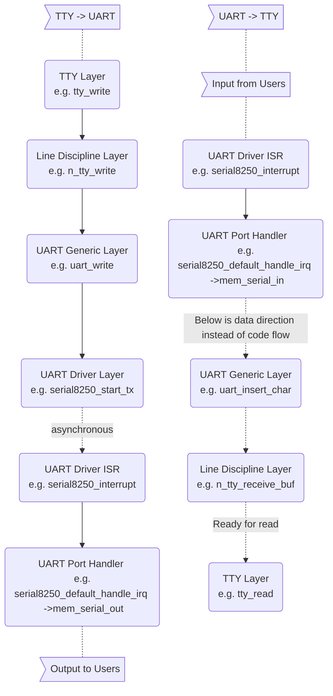

> Note: browser extension [GitHub + Mermaid](https://chrome.google.com/webstore/detail/github-%20-mermaid/goiiopgdnkogdbjmncgedmgpoajilohe?hl=en)
> is needed to view flow chart of mermaid syntax

## Index

1. [Introduction](#introduction)
2. [TTY Types](#tty-types)
3. [TTY <-> UART](#tty-uart)
4. [Boot Flow](#boot-flow)
5. Kernel Boot Command (to be added)
6. Mechanism of printk (to be added)
7. Virtual UART (to be added)

## <a name="introduction"></a> Introduction

Console is the interface that users interact with systems through. 
In the old days, computers were expensive and many users shared one and accessed it by terminals, 
which were composed of small screens and teletypewriters (TTY). 
Nowadays it has become legacy but we can still see it on common OS. 
There are also pseudo TTYs shown when people access consoles in GUI desktop, or operate remote machines by SSH. 
On embedded systems, it's common that developers type commands through serial port interface (UART).

## <a name="tty-types"></a> TTY Types
Device Name       | Description
--                | --
tty1 ~ n          | Command line interface. On Raspberry Pi, Ctrl + Alt + F1 ~ F6 can switch to corresponding TTY 
ptmx & pts/0 ~ n  | Pseudo TTY, responsible for GUI and SSH consoles
ttyS0 ~ n         | It means serial console and each represents one UART within chip
ttyAMA0 ~ n       | ARM serial console?
ttyUSB0 ~ n       | Serial cable with USB interface. E.g. connect the USB-to-TTL cable into Raspberry Pi and you can see one
ttyprintk         | Not really related to TTY. Redirect message to this file and then it can be displayed by command 'dmesg'
tty               | (to be added)
console           | (to be added)

## <a name="tty-uart"></a> TTY <-> UART



## <a name="boot-flow"></a> Boot Flow
```
start_kernel()
  └─ console_init()
       └─ univ8250_console_init()
   
init calls
  └─ chr_dev_init()
       └─ tty_init()
  └─ serial8250_init()
  └─ dw8250_platform_driver_init()
  └─ of_platform_serial_driver_init()
```
Here we list a few functions that are related to our topic and we'll introduce them one by one.

```
univ8250_console_init()
  └─ serial8250_isa_init_ports(): initialize serial8250_ports[0~5]
  └─ register_console(univ8250_console): fail to register because of -ENODEV returned from serial8250_console_setup()
```
(Should I introduct register_console first?)

```
tty_init()
  └─ register character device for /dev/tty
  └─ register character device for /dev/console
```
This function also registers character devices for /dev/tty0\~63, and also note that tty0 is handled separately from tty1\~63.
Since any of them isn't in the root filesystem of OpenBMC, I'm not bothering to look into it.
