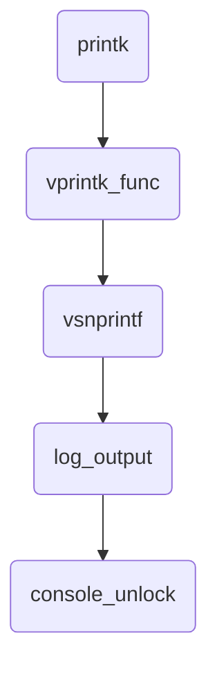

> Note: browser extension [GitHub + Mermaid](https://chrome.google.com/webstore/detail/github-%20-mermaid/goiiopgdnkogdbjmncgedmgpoajilohe?hl=en)
> is needed to view the flow chart of mermaid syntax

## Index

1. [Introduction](#introduction)
2. [TTY Types](#tty-types)
3. [TTY <-> UART](#tty-uart)
4. [Boot Flow](#boot-flow)
5. [Mechanism of printk](#mechanism-of-printk)
6. [Kernel Boot Arguments](#kernel-boot-arguments)
7. Virtual UART (to be added)

## <a name="introduction"></a> Introduction

Console is the interface that users interact with systems through. 
In the old days, computers were expensive and many users shared one and accessed it by terminals, 
which were composed of small screens and teletypewriters (TTY). 
Nowadays it has become legacy but we can still see it on common OS. 
There are also pseudo TTYs shown when people access consoles in GUI desktop, or operate remote machines by SSH. 
On embedded systems, it's common that developers type commands through serial port interface (UART).

## <a name="tty-types"></a> TTY Types
Device Name       | Description
--                | --
tty1 ~ n          | Command line interface. On Raspberry Pi, Ctrl + Alt + F1 ~ F6 can switch to corresponding TTY 
ptmx & pts/0 ~ n  | Pseudo TTY, responsible for GUI and SSH consoles
ttyS0 ~ n         | It means serial console and each represents one UART within chip
ttyAMA0 ~ n       | ARM serial console?
ttyUSB0 ~ n       | Serial cable with USB interface. E.g. Plug in the USB-to-TTL cable to Raspberry Pi and you can see one
ttyprintk         | Redirect message to this file and then it can be displayed by command 'dmesg'
tty               | (to be added)
console           | (to be added)

## <a name="tty-uart"></a> TTY <-> UART

By default, each user space task has the first three file descriptors used for stdin/stdout/stderr. Issue below command to inspect which TTY devices are used.
```
ls -l /proc/$$/fd
```

```
In serial console:
root@romulus:~# ls -l /proc/$$/fd
lrwx------    1 root     root            64 Jul 27 15:25 0 -> /dev/ttyS4
lrwx------    1 root     root            64 Jul 27 15:25 1 -> /dev/ttyS4
lrwx------    1 root     root            64 Jul 27 15:25 2 -> /dev/ttyS4
lrwx------    1 root     root            64 Jul 27 15:25 255 -> /dev/ttyS4

In SSH console:
root@romulus:~# ls -l /proc/$$/fd
lrwx------    1 root     root            64 Jul 27 15:26 0 -> /dev/pts/0
lrwx------    1 root     root            64 Jul 27 15:26 1 -> /dev/pts/0
lrwx------    1 root     root            64 Jul 27 15:26 2 -> /dev/pts/0
lrwx------    1 root     root            64 Jul 27 15:26 255 -> /dev/pts/0
```

Below are the flowcharts showing how data is output to or input from users.


## <a name="boot-flow"></a> Boot Flow
Here we list a few functions that are related to our topic and we'll introduce them one by one.
```
init calls
  └─ of_platform_default_populate_ini()
  └─ chr_dev_init()
       └─ tty_init()
  └─ of_platform_serial_driver_init()
```

- of_platform_default_populate_init

  In this function, it adds lots of devices specified in DTS, which contains UART1 (serial0) and UART5 (serial4).
  Later they are initialized and correspond to ttyS0 and ttyS4 separately.
  
  ```
  of_platform_default_populate_init()
    └─ add device ooo
    └─ add device 1e783000.serial <-- serial0 in DTS
    └─ add device 1e784000.serial <-- serial4 in DTS
    └─ add device xxx
  ```

- tty_init

  This function registers character devices for /dev/tty, /dev/console, and /dev/tty0~63 one after another.
  Noet that /dev/tty0 is handled differently from other /dev/tty#.
  However we won't look into any of them since they are not in the root fileysyste of OpenBMC.
  
  ```
  tty_init()
    └─ register character device for /dev/tty
    └─ register character device for /dev/console
  ```
  
- of_platform_serial_driver_init

  It registers driver 'of_serial' and probes device '1e783000.serial' & '1e784000.serial' sequentially. Here we have to introduce the 'port' concept of uart.
  Take AST2500 for example, it might be equipped with up to 5 regular UARTs (leave virtual UART alone).
  Each UART component is regarded as 'port' in the code, e.g. ttyS4 is the port 5 of UART.
  Back to the probe, it registers the UART port to the framework for each of the matched devices.

  ```
  of_platform_serial_driver_init()
    └─ register driver 'of_serial'
         └─ probe device 1e783000.serial
              └─ set up the UART port and register it
              └─ register console but fail (it's not our preferred console, which is set by kernel boot command)
         └─ probe device 1e784000.serial
              └─ set up the UART port and register it              
              └─ register console and pass (preferred console)
  ```
  
  Registered consoles are for kernel space to print out messages.
  
## <a name="mechanism-of-printk"></a> Mechanism of printk()

Unlike user space processes have TTY device to direct input/output/error, kernel threads output messages by printk and below flowchart shows how it works.



- printk(), aggregate arguments
- vprintk_func(), deal with different contexts, e.g. NMI, safe, ...
- vsnprintf(), replace specifiers with real data
- log_output(), commit string to the circular buffer of printk as 'record'
- console_unlock(), for each valid record, add prefix and write to each console

```
console_unlock()
  └─ record_print_text(), insert timestamp to the beginning of string
  └─ call_console_drivers(), write out the committed record to each registered console
```

## <a name="kernel-boot-arguments"></a> Kernel Boot Arguments
