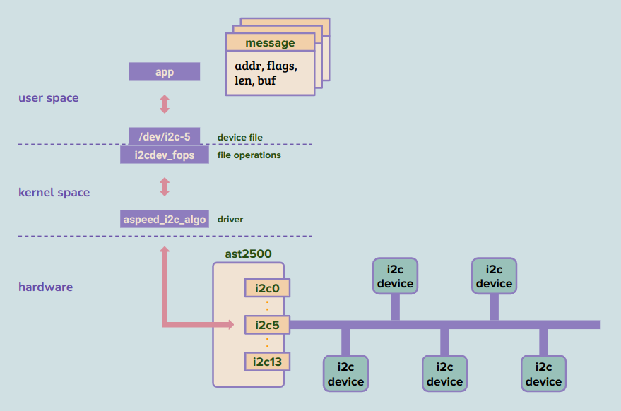
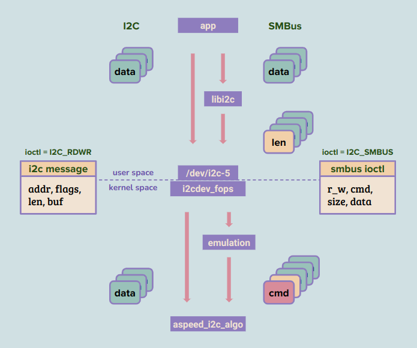
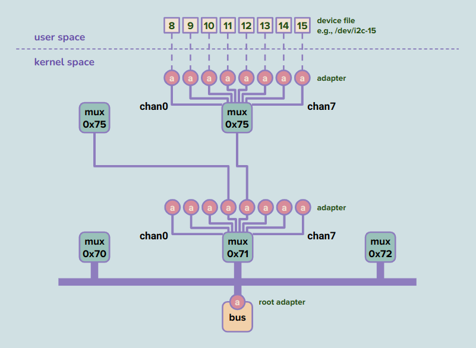

> The note is based on Linux version 5.15.0 in OpenBMC.

## Index

- [Introduction](#introduction)
- [I2C and SMBus](#i2c-and-smbus)
- [Mux](#mux)
- [SMBus System Interface](#smbus-system-interface)
- [System Startup](#system-startup)
- [Cheat Sheet](#cheat-sheet)
- [Reference](#reference)

## <a name="introduction"></a> Introduction

(TBD)

## <a name="i2c-and-smbus"></a> I2C and SMBus

The I2C protocol is one of the several ways that allow the master to communicate with other devices on the same bus. 
The layout between buses and devices is totally decided by motherboard designers as long as they ensure no device on a bus shares the same address. 
The master broadcasts the bus-wide unique address of the target, and only that associated device will respond an ack while others remain silent.

From the application's perspective, we prepare the 'message' and pass it to the device file; the driver then takes over and operates on the hardware. 
Though a message can only be either read- or write-type, we can send a list of messages with different types for the driver to handle at once. 
Read-type messages communicate data from the slave device back to the user space application.

- Read-type message
  - slave: where to read from
  - flags: read (1)
  - len: how many bytes to read
  - buf: where to place the data before returning to the application
- Write-type message
  - slave: where to write to
  - flags: write (0)
  - len: how many bytes to write
  - buf: where to take data from before copying to the I2C controller register

<p align="center"></p>

<details><summary> More Details </summary>

```
                                                                                                                   
                                              addr=++           addr=??           addr=##           addr=@@         
                                                                                                                   
                                            +--------+        +--------+        +--------+        +--------+       
                                            | slave  |        | slave  |        | slave  |        | slave  |       
                                            +--------+        +--------+        +--------+        +--------+       
                                              |    |            |    |            |    |            |    |         
                                              |    |            |    |            |    |            |    |         
                                              |    |            |    |            |    |            |    |         
                                              |    |            |    |            |    |            |    |         
+---------+                                   |    |            |    |            |    |            |    |         
|      i2c-0              +-     sda  -------------|-----------------|-----------------|-----------------|---------
|         |          i2c  |   (data)               |                 |                 |                 |         
|      i2c-1  -----  bus  |                        |                 |                 |                 |         
|         |               +-     scl  -----------------------------------------------------------------------------
|         |                  (clock)                                                                               
| AST2500 |                                                                                                        
|         |                                                                                                        
|         |                                                                                                        
|      i2c-12                                                                                                      
|         |                                                                                                        
|      i2c-13                                                                                                      
+---------+                                                                                                        
```

```
                                                              +--------+                          +-------+
                                                              | master |                          | slave |
                                                              +--------+                          +-------+
                                                                                                           
                                                                       +--   +-+                           
                                                                       |     |s|           ---->           
                                                                       |     +-+                           
                                                                       |     +--------+-+                  
                                                                       |     |  addr  |w|  ---->           
                                                                       |     +--------+-+                  
                                                                       |                                   
                                                         i2c_msg[0]    |                     +-+           
                                                        +----------+   |     <----           |a|           
                                                        |  addr    |   |                     +-+           
                    +-----+                             |  flags   |   |                                   
                    | app |                             |  len     |   |     +----------+                  
                    +-----+                             |  *buf -------|->   |   data   |  ---->           
                     |  ｜                               +----------+   |     +----------+                  
                     | +-----+                                         |                     +-+           
                     | | lib | libi2c.so                               |     <----           |a|           
                     | +-----+                                         |                     +-+           
                     |  |                                              |               -                   
            I2C_RDWR |  | I2C_SMBUS                                    |               -                   
                   +------+                                            |               -                   
                   | cdev |                                            |     +-+                           
                   +------+                                            |     |p|           ---->           
                      |                                                +--   +-+                           
        user          |                                                                                    
        --------------|-------------                                   +--   +-+                           
        kernel        |                                                |     |s|           ---->           
                      |                                                |     +-+                           
                 +---------+                                           |     +--------+-+                  
 aspeed_i2c_algo | adapter |                                           |     |  addr  |r|  ---->           
                 +---------+                                           |     +--------+-+                  
                                                                       |                                   
                                                         i2c_msg[1]    |                     +-+           
                                                        +----------+   |     <----           |a|           
                                                        |  addr    |   |                     +-+           
                                                        |  flags   |   |                                   
                                                        |  len     |   |             +----------+          
                                                        |  *buf <------|--   <----   |   data   |          
                                                        +----------+   |             +----------+          
                                                                       |     +-+                           
                                                                       |     |a|           ---->           
                                                                       |     +-+       -                   
                                                                       |               -                   
                                                                       |               -                   
                                                                       |     +-+                           
                                                                       |     |p|           ---->           
                                                                       +--   +-+                           
```

```
static const struct file_operations i2cdev_fops = {
    .owner      = THIS_MODULE,
    .llseek     = no_llseek,
    .read       = i2cdev_read,
    .write      = i2cdev_write,
    .unlocked_ioctl = i2cdev_ioctl,
    .compat_ioctl   = compat_i2cdev_ioctl,
    .open       = i2cdev_open,
    .release    = i2cdev_release,
};
```

```
+-------------+                                                         
| i2cdev_open | : alloc i2c_client, relate adapter, and set to file priv
+---|---------+                                                         
    |    +-----------------+                                            
    |--> | i2c_get_adapter | get adapter from minor (adapter nr)        
    |    +-----------------+                                            
    |                                                                   
    |--> alloc i2c_client                                               
    |                                                                   
    +--> relate file priv, client, and adapter                          
```

```
+--------------+                                                                                              
| i2cdev_ioctl | : i2c ioctl                                                                                  
+---|----------+                                                                                              
    |                                                                                                         
    |--> get i2c client from file priv                                                                        
    |                                                                                                         
    |--> switch cmd                                                                                           
    |                                                                                                         
    |--> case slave                                                                                           
    +--> case slave_force                                                                                     
    |                                                                                                         
    |------> client addr = arg                                                                                
    |                                                                                                         
    |--> case ten bit                                                                                         
    |                                                                                                         
    |------> set or clear the flag of client                                                                  
    |                                                                                                         
    |--> case pec                                                                                             
    |                                                                                                         
    |------> set or clear the flag of client                                                                  
    |                                                                                                         
    |--> case funcs                                                                                           
    |                                                                                                         
    |------> get adapter functionalities                                                                      
    |                                                                                                         
    |--> case read write                                                                                      
    |                                                                                                         
    |        +-------------+                                                                                  
    |------> | memdup_user | alloc buffer and copy msg meta from user space                                   
    |        +-------------+                                                                                  
    |        +-------------------+                                                                            
    |------> | i2cdev_ioctl_rdwr | copy msg data from user, transfer i2c packet(s), copy msg data to user     
    |        +-------------------+                                                                            
    |                                                                                                         
    |--> case smbus                                                                                           
    |                                                                                                         
    |------> copy info from user space                                                                        
    |                                                                                                         
    |        +--------------------+                                                                           
    |------> | i2cdev_ioctl_smbus | copy smbus data from user, transfer i2c packet(s), copy smbus data to user
    |        +--------------------+                                                                           
    |                                                                                                         
    |--> case retries                                                                                         
    |                                                                                                         
    |------> config adapter->retries                                                                          
    |                                                                                                         
    |--> case timeout                                                                                         
    |                                                                                                         
    +------> config adapter->timeout                                                                          
```

```
+-------------------+                                                                         
| i2cdev_ioctl_rdwr | : copy msg data from user, transfer i2c packet(s), copy msg data to user
+----|--------------+                                                                         
     |                                                                                        
     |--> alloc buffer and copy msg data from user space                                      
     |                                                                                        
     |    +--------------+                                                                    
     |--> | i2c_transfer | lock bus, transfer i2c packet, unlock bus                          
     |    +--------------+                                                                    
     |                                                                                        
     +--> if flag specifies 'read', copy msg data to user space                               
```
  
```
+----------------+                                         
| __i2c_transfer | : transfer i2c packet                   
+---|------------+                                         
    |                                                      
    |--> while we can still retry                          
    |                                                      
    +------> call ->master_xfer(), e.g.,                   
    |        +------------------------+                    
    |        | aspeed_i2c_master_xfer | transfer i2c packet
    |        +------------------------+                    
    |                                                      
    +------> break if it's not 'again' error               
```
  
```
tatic const struct i2c_algorithm aspeed_i2c_algo = {
    .master_xfer    = aspeed_i2c_master_xfer,
    .functionality  = aspeed_i2c_functionality,
    .reg_slave  = aspeed_i2c_reg_slave,
    .unreg_slave    = aspeed_i2c_unreg_slave,
};
```
  
```
+------------------------+                                                            
| aspeed_i2c_master_xfer | : transfer i2c packet                                      
+-----|------------------+                                                            
      |                                                                               
      |--> if the bus is busy && it's a single master bus                             
      |                                                                               
      |        +------------------------+                                             
      |------> | aspeed_i2c_recover_bus | try to recover                              
      |        +------------------------+                                             
      |                                                                               
      |--> set up bus (msg, cnt, idx, err)                                            
      |                                                                               
      |    +---------------------+                                                    
      |--> | aspeed_i2c_do_start | prepare cmd, write slave addr & cmd to hw registers
      |    +---------------------+                                                    
      |    +----------------------------+                                             
      +--> | wait_for_completion_timeout|                                             
           +----------------------------+                                             
```

```
+---------------------+                                                      
| aspeed_i2c_do_start | : prepare cmd, write slave addr & cmd to hw registers
+-----|---------------+                                                      
      |                                                                      
      |--> set cmd to 'start | tx'                                           
      |                                                                      
      |--> set master state to 'master start'                                
      |                                                                      
      +--> if the curr msg is to read                                        
      |                                                                      
      |------> cmd |= 'rx'                                                   
      |                                                                      
      +--> write slave addr and cmd to hw registers                          
```
  
```
+---------------------------+                                                                  
| aspeed_i2c_ic_irq_handler | : the top i2c isr, for each set bit: call that bus's handler     
+------|--------------------+                                                                  
       |    +---------------------------+                                                      
       |--> | irq_desc_get_handler_data | get aspeed_i2c_ic from irq desc                      
       |    +---------------------------+                                                      
       |    +-------------------+                                                              
       |--> | irq_desc_get_chip | get irq chip, e.g., dummy_irq_chip                           
       |    +-------------------+                                                              
       |    +-------------------+                                                              
       |--> | chained_irq_enter | do nothing bc our chip is 'dummy_irq_chip'                   
       |    +-------------------+                                                              
       |                                                                                       
       |--> read status from register                                                          
       |                                                                                       
       |--> for each set bit (bus# = 14)                                                       
       |                                                                                       
       |        +---------------------------+                                                  
       |------> | generic_handle_domain_irq | given hwirq, get irq desc and call ->handle_irq()
       |        +---------------------------+                                                  
       |    +-----------------+                                                                
       +--> | chained_irq_exit| do nothing bc our chip is 'dummy_irq_chip'                     
            +-----------------+                                                                
```
  
```
+--------------------+                                                                                                 
| aspeed_i2c_bus_irq | : ack, based on master state: write or read, if rx done: ack                                    
+----|---------------+                                                                                                 
     |                                                                                                                 
     |--> read interrupt bits                                                                                          
     |                                                                                                                 
     |--> ack all interrupts except rx done                                                                            
     |                                                                                                                 
     |--> (ignore the case of slave controller)                                                                        
     |                                                                                                                 
     |    +-----------------------+                                                                                    
     +--> | aspeed_i2c_master_irq | based on master state, write to or read from hw reg for a byte, notify waiting task
     |    +-----------------------+                                                                                    
     |                                                                                                                 
     |--> if bits has 'rx done'                                                                                        
     |                                                                                                                 
     +------> write hw register to ack                                                                                 
```

```
+-----------------------+                                                                                      
| aspeed_i2c_master_irq | : based on master state, write to or read from hw reg for a byte, notify waiting task
+-----|-----------------+                                                                                      
      |                                                                                                        
      |--> switch master state                                                                                 
      |                                                                                                        
      |--> case master_tx                                                                                      
      |                                                                                                        
      |--> case master_tx_first                                                                                
      |                                                                                                        
      |------> if msg still has bytes to send                                                                  
      |                                                                                                        
      |----------> write next byte to hw reg and send out                                                      
      |                                                                                                        
      |------> else                                                                                            
      |                                                                                                        
      |            +-----------------------------+                                                             
      |----------> | aspeed_i2c_next_msg_or_stop | start next msg if there's any, or otherwise stop            
      |            +-----------------------------+                                                             
      |                                                                                                        
      |--> case master_rx_first                                                                                
      |                                                                                                        
      |--> case master_rx                                                                                      
      |                                                                                                        
      +------> read data from hw register                                                                      
      |                                                                                                        
      |------> copy to msg buf                                                                                 
      |                                                                                                        
      |------> if msg expects more data                                                                        
      |                                                                                                        
      |----------> set master state to 'master rx'                                                             
      |                                                                                                        
      |----------> prepare rx cmd and write to hw register                                                     
      |                                                                                                        
      |------> else                                                                                            
      |                                                                                                        
      |            +-----------------------------+                                                             
      |----------> | aspeed_i2c_next_msg_or_stop | start next msg if there's any, or otherwise stop            
      |            +-----------------------------+                                                             
      |                                                                                                        
      |--> case stop: set master state to 'invactive'                                                          
      |                                                                                                        
      |--> case inactive: shouldn't receive interrupt                                                          
      |                                                                                                        
      |--> default: unknow, so set master state to inactive                                                    
      |                                                                                                        
      |    +----------+                                                                                        
      +--> | complete |                                                                                        
           +----------+                                                                                        
```

```
+-----------------------------+                                                              
| aspeed_i2c_next_msg_or_stop | : start next msg if there's any, or otherwise stop           
+-------|---------------------+                                                              
        |                                                                                    
        |--> if bus still has msg                                                            
        |                                                                                    
        |------> move to next msg                                                            
        |                                                                                    
        |        +---------------------+                                                     
        |------> | aspeed_i2c_do_start | prepare cmd, write slave addr & cmd to hw registers 
        |        +---------------------+                                                     
        |                                                                                    
        |--> else                                                                            
        |                                                                                    
        |        +--------------------+                                                      
        +------> | aspeed_i2c_do_stop | set master state to stop, write 'stop' to hw register
                 +--------------------+                                                      
```
  
</details>

### SMBus
  
The SMBus protocol shares some characteristics with the I2C protocol while being sufficiently different in the ioctl argument structure and data stream.
  
- read_write
  - It's like the 'flags' in the I2C message that indicate the transaction direction.
- command
  - SMBus devices interpret the first byte they receive as a command; however, the I2C devices have no such assumption.
- len
  - Instead of a flexible length attribute, it only accepts a few predefined options.
  - e.g., I2C_SMBUS_BYTE_DATA
  - e.g., I2C_SMBUS_WORD_DATA
  - e.g., I2C_SMBUS_BLOCK_DATA
- buf
  - Depending on the chosen `len`, the I2C library might stuff the accurate size information to the head of the byte array before passing it to ioctl.

The data structures are dissimilar, and I2C drivers can opt to provide exact two handlers or, surprisingly, just one going strong.
The kernel offers an emulation function that converts SMBus ioctl data into I2C messages before going to the driver. 
Take the combination of `len=I2C_SMBUS_BLOCK_DATA` and `read_write=write` as an example:
  
- The application first calls library API with `command`, `length`, and `data` arguments.
- The library inserts the `length` to the head of `data` and prepares the SMBus ioctl structure accordingly.
  - The field `len` within the form is then set to `I2C_SMBUS_BLOCK_DATA` instead of the actual size.
- The kernel further prepends the `command` into data while performing the structure conversion.
  
Data stream for I2C and SMBus certainly differ in that `command` byte and sometimes `length` byte. 
Knowing what kind of devices we are dealing with may be desirable before selecting transaction type in ioctl.
Please note that I don't distinguish them outside this section and continue to use the term 'I2C device' for convenience.
  
<p align="center"></p>
  
<details><summary> More Details </summary>
  
```
  i2c control         |      smbus control                   i2c control
                      |                                      (emulation)
                      |                                                 
                      |                                                 
                      |                                                 
    i2c_msg           |     i2c_smbus_ioctl_data              i2c_msg   
   +--------+         |       +-----------+                  +--------+ 
   |  addr  |         |       |read_write |                  |  addr  | 
   | flags  |         |       |  command  |                  | flags  | 
   |  len   |         |       |   size    |                  |  len   | 
+---- *buf  |         |     +---- *data   |               +---- buf   | 
|  +--------+         |     | +-----------+               |  +--------+ 
|                     |     |                             |             
|                     |     |                             |             
|   +------+          |     |   +------+                  |   +------+  
+-->| data |          |     +---> len  |                  +-->| cmd  |  
    +------+          |         +------+                      +------+  
    | data |          |         | data |                      | len  |  
    +------+          |         +------+                      +------+  
    | data |          |         | data |                      | data |  
    +------+          |         +------+                      +------+  
        -             |         | data |                      | data |  
        -             |         +------+                      +------+  
    +------+          |             -                         | data |  
    | data |          |             -                         +------+  
    +------+          |         +------+                          -     
                      |         | data |                          -     
                      |         +------+                      +------+  
                      |                                       | data |  
                      |                                       +------+  
                      |                                                 
                      |                                                 
                      |                                                 
                      |                                                 
```
  
```
+--------------------+                                                                             
| i2cdev_ioctl_smbus | : copy smbus data from user, transfer i2c packet(s), copy smbus data to user
+----|---------------+                                                                             
     |                                                                                             
     |--> if it's 'quick' or 'write a byte'                                                        
     |                                                                                             
     |               +----------------+                                                            
     +------> return | i2c_smbus_xfer | lock, transfer i2c packet(s), unlock                       
     |               +----------------+                                                            
     |                                                                                             
     |--> copy smbus data from user space if necessary                                             
     |                                                                                             
     |    +----------------+                                                                       
     +--> | i2c_smbus_xfer | lock, transfer i2c packet(s), unlock                                  
     |    +----------------+                                                                       
     |                                                                                             
     +--> copy smbus data to user space if necessary                                               
```

```
+----------------+                                       
| i2c_smbus_xfer | : lock, transfer i2c packet(s), unlock
+---|------------+                                       
    |                                                    
    |--> lock                                            
    |                                                    
    |    +------------------+                            
    |--> | __i2c_smbus_xfer | transfer i2c packet(s)     
    |    +------------------+                            
    |                                                    
    +--> unlock                                          
```

```
+------------------+                                                      
| __i2c_smbus_xfer | : transfer i2c packet(s)                             
+----|-------------+                                                      
     |                                                                    
     |--> if adapter has ->smbus_xfer (not our case)                      
     |                                                                    
     |------> (ignore) and return                                         
     |                                                                    
     |    +-------------------------+                                     
     +--> | i2c_smbus_xfer_emulated | emulate smbus behavior by i2c method
          +-------------------------+                                     
```
  
</details>
  
## <a name="mux"></a> Mux
  
Sometimes I2C devices come with no or little configurable address, thus limiting the number of the same devices on a bus. 
Mux is a particular I2C device that branches a bus into multiple channels, and the I2C controller can only see one channel at a time. 
The benefit is that the address space behind the mux is independent of each other; therefore, the identical components can live on separate channels.
  
The mux mechanism is centered around adapters that transfer data for connected devices. 
A controller is an adapter, and so is each channel of a mux, but the mux itself is not. 
Analogous to the hardware layout, adapter hierarchy starts from the controller as root, first-level channels, second-level channels, and so on. 
A different kind of transfer function is installed on the channel-type adapters.

- transfer logic of a controller-type adaptor
  - call I2C driver, e.g., aspeed_i2c_master_xfer()
- transfer logic of a channel-type adaptor
  - call parent adapter's transfer() for channel selection
  - call parent adapter's transfer() for data transaction
  - call parent adapter's transfer() for channel deselection if needed
  
The channel-type transfer logic implements a capability of recursively switching mux channels before the actual data transaction. 
Since our studying case doesn't have the mux setting specified in DTS, the below example is taken from `aspeed-bmc-ampere-mtjade.dts`. 
We can see that the root adapter connects to two I2C devices: mux 0x70 and mux 0x71. 
Mux 0x71 is split into eight channels, and two of them further connect mux 0x75 and mux 0x75. 
When we try to communicate the endpoint on a channel, the demand of channel selection is recursively sent to the root and fulfilled in reverse order. 
The subsequent data transaction behaves similarly, and in the end, the root adapter helps forward the I2C messages to the driver for processing.
  
<p align="center"></p>
  
<details><summary> More Details </summary>
  
```
                                   ch0 ---- nvme0                           ch0 ---- nvme8
                                   ch1 ---- nvme1                           ch1 ---- nvme9
                     ch3   +-----+ ch2 ---- nvme2            ch4   +-----+  ch2 ---- nvme10
               +---------- | mux | ch3 ---- nvme3      +---------- | mux |  ch3 ---- nvme11
               |           +-----+ ch4 ---- nvme4      |           +-----+  ch4 ---- nvme12
               |            slave  ch5 ---- nvme5      |            slave   ch5 ---- nvme13
               |            0x75   ch6 ---- nvme6      |            0x75    ch6 ---- nvme14
               |                   ch7 ---- nvme7      |                    ch7 ---- nvme15
               |                                       |
               |                                       |
               |                                       |                    ch0 ---- nvme16
               |                                       |                    ch1 ---- nvme17
               |                                       |     ch3   +-----+  ch2 ---- nvme18
               |                                       |   +------ | mux |  ch3 ---- nvme19
               |                                       |   |       +-----+  ch4 ---- nvme20
             +-----+                                  +-----+       slave   ch5 ---- nvme21
             | mux |                                  | mux |       0x75    ch6 ---- nvme22
             +--+--+                                  +--+--+               ch7 ---- nvme23
i2c-5           |slave                                   |slave
                |0x70                                    |0x71
                |                                        |
   +------------+----------------------------------------+---------------+----------------------------+
                                                                         |
                                                                         |slave
                                                                         |0x72
                                                                      +--+--+
                                                                      | mux |  ch0 ---- nvme_m2_0
                                                                      +-----+  ch1 ---- nvme_m2_1
```

```
                                                                                                                                         
                                                                 mux75                                                                   
                  +----------- mux70                            +-----+                                                                  
                  |                                             |  +--|---(adapter) ----- (client)                                       
                  |                                             |  +--|---(adapter) ----- (client)                                       
                  |            mux71                    (client)|  |--|---(adapter) ----- (client)                                       
                  |           +-----+                   +-------|--|--|---(adapter) ----- (client)                                       
                  |           |  +--|---(adapter)       |       |  |--|---(adapter) ----- (client)                                       
                  |           |  +--|---(adapter)       |       |  |--|---(adapter) ----- (client)                                       
        (adapter) |   (client)|  |--|---(adapter)       |       |  +--|---(adapter) ----- (client)                                       
 i2c-5 -----------|-----------|--|--|---(adapter) ---+  |       |  +--|---(adapter) ----- (client)                                       
                  |           |  |--|---(adapter) ---|--+       +-----+                                                                  
                  |           |  |--|---(adapter)    |                                                                                   
                  |           |  +--|---(adapter)    |                                                                                   
                  |           |  +--|---(adapter)    |                                                                                   
                  |           +-----+                |           mux75                                                                   
                  |                                  |          +-----+                                                                  
                  |                                  |          |  +--|---(adapter) ----- (client)                                       
                  +----------- mux72                 |          |  +--|---(adapter) ----- (client)                                       
                                                     |  (client)|  |--|---(adapter) ----- (client)                                       
                                                     +----------|--|--|---(adapter) ----- (client)                                       
                                                                |  |--|---(adapter) ----- (client)                                       
                                                                |  |--|---(adapter) ----- (client)                                       
                                                                |  +--|---(adapter) ----- (client)                                       
                                                                |  +--|---(adapter) ----- (client)                                       
                                                                +-----+                                                                  
                                                                                                                             i2c_mux_priv
                     client                                                                                                   +--------+ 
                   +---------+                                                       client                  +------------------ muxc  | 
      +--------------adapter |                                  i2c_mux_priv       +---------+               |                |chan_id | 
      |            +---------+                                   +--------+  +-------adapter |<-+       muxc v                |  algo  | 
      v                                         +------------------ muxc  |  |     +---------+  |   +----------+              |  adap  | 
   adapter           client                     |                |chan_id |  |           |------------ parent  | <--------+   +--------+ 
  +------+         +---------+                  v                |  algo  |  |           |      |   |  select  |          |              
  | algo | <---------adapter | <---+       muxc                  |  adap <---+ <---------+      |   | deselect |          |       -      
  +------+         +---------+     |   +----------+ <--------+   +--------+                     |   |   priv ------+      |       -      
           <-----------------------|----- parent  |          |                                  |   +----------+   |      |              
      ^              client        |   |  select  |          |       -                          |                  |      |  i2c_mux_priv
      |            +---------+     |   | deselect |          |       -                          |      pca954x  <--+      |   +--------+ 
      +--------------adapter |     |   |   priv ------+      |                                  |    +---------+          +------muxc  | 
                   +---------+     |   +----------+   |      |  i2c_mux_priv                    +--> | client  |              |chan_id | 
                                   |                  |      |   +--------+                          |  chip   |              |  algo  | 
                                   |      pca954x  <--+      +------muxc  |                          +---------+              |  adap  | 
                                   |    +---------+              |chan_id |                                                   +--------+ 
                                   +--> | client  |              |  algo  |                                                              
                                        |  chip   |              |  adap  |                                                              
                                        +---------+              +--------+                                                              
```
  
```
+---------------------+                                              
| pca954x_select_chan | : switch mux to target channel               
+-----|---------------+                                              
      |    +----------------+                                        
      |--> | pca954x_regval | given target channel, prepare reg value
      |    +----------------+                                        
      |                                                              
      |--> if last_chan != reg value                                 
      |                                                              
      |        +-------------------+                                 
      |------> | pca954x_reg_write |                                 
      |        +-------------------+                                 
      |                                                              
      +------> ->last_chan = reg value                               
```

```
+----------------------+                                                 
| pca954x_deselect_mux | : switch mux to predefined 'idle state' or 0    
+-----|----------------+                                                 
      |                                                                  
      |--> if data has defined 'idle state'                              
      |                                                                  
      |               +---------------------+                            
      |------> return | pca954x_select_chan | switch to that 'idle state'
      |               +---------------------+                            
      |                                                                  
      |--> if idle state == 'disconnect'                                 
      |                                                                  
      |------> ->last_state = 0                                          
      |                                                                  
      |        +-------------------+                                     
      +------> | pca954x_reg_write | switch to 0, no matter what it means
               +-------------------+                                     
```

```
+-----------------------+                                                         
| __i2c_mux_master_xfer | : switch mux, transfer i2c packet, switch mux to default
+-----|-----------------+                                                         
      |                                                                           
      |--> call ->select(), e.g.,                                                 
      |    +---------------------+                                                
      |    | pca954x_select_chan | switch mux to target channel                   
      |    +---------------------+                                                
      |                                                                           
      |    +----------------+                                                     
      |--> | __i2c_transfer | transfer i2c packet                                 
      |    +----------------+                                                     
      |                                                                           
      +--> call ->deselect(), e.g.,                                               
           +----------------------+                                               
           | pca954x_deselect_mux | switch mux to predefined 'idle state' or 0    
           +----------------------+                                               
```
  
</details>

## <a name="smbus-system-interface"></a> SMBus System Interface

(TBD)
  
<details><summary> More Details </summary>

```
drivers/char/ipmi/ssif_bmc_aspeed.c                                                                  
+----------------+                                                                                    
| ssif_bmc_probe | : alloc ssif_bmc, register misc dev, prepare client for bus, enable slave mode     
+-|--------------+                                                                                    
  |    +----------------+                                                                             
  |--> | ssif_bmc_alloc | alloc ssif_bmc, register misc dev, prepare client for bus, enable slave mode
  |    +----------------+                                                                             
  |                                                                                                   
  |--> ssif_bmc.priv = adapter data                                                                   
  |                                                                                                   
  +--> install status function = aspeed_set_ssif_bmc_status                                           
```
  
```
+----------------+                                                                                    
| ssif_bmc_alloc | : alloc ssif_bmc, register misc dev, prepare client for bus, enable slave mode     
+-|--------------+                                                                                    
  |                                                                                                   
  |--> alloc 'ssif_bmc'                                                                               
  |                                                                                                   
  |--> set up misc dev (minor, name, fops=ssif_bmc_fops)                                              
  |                                                                                                   
  |    +---------------+                                                                              
  |--> | misc_register | determine dev#, add arg 'misc' to list (misc_list)                           
  |    +---------------+                                                                              
  |                                                                                                   
  |--> relate arg 'client' and ssif_bmc                                                               
  |                                                                                                   
  |    +--------------------+                                                                         
  +--> | i2c_slave_register | set up client (callback) and register to bus as slave, enable slave mode
       +--------------------+ +-------------+                                                         
                              | ssif_bmc_cb | handle smbus read or write request                      
                              +-------------+                                                         
```
  
```
drivers/char/misc.c                                                  
+---------------+                                                     
| misc_register | : determine dev#, add arg 'misc' to list (misc_list)
+-|-------------+                                                     
  |                                                                   
  |--> determine if minor# is dynamic selection                       
  |                                                                   
  |--> if is_dynamic                                                  
  |    |                                                              
  |    |    +---------------------+                                   
  |    |--> | find_first_zero_bit | find the first available one      
  |    |    +---------------------+                                   
  |    |                                                              
  |    +--> set bitmap to mark it's used                              
  |                                                                   
  |--> else                                                           
  |    -                                                              
  |    +--> check if the specified one is available                   
  |                                                                   
  |--> make dev# = (10, minor)                                        
  |                                                                   
  |    +---------------------------+                                  
  |--> | device_create_with_groups | create files in in sysfs         
  |    +---------------------------+                                  
  |                                                                   
  +--> add arg 'misc' into list (misc_list)                           
```
  
```
drivers/char/ipmi/ssif_bmc.c                                                                  
+-------------+                                                                                
| ssif_bmc_cb | : handle smbus read or write request                                           
+-|-----------+                                                                                
  |                                                                                            
  |--> switch event                                                                            
  |    case read_requested                                                                     
  |    |                                                                                       
  |    |--> if is_single_part                                                                  
  |    |    |                                                                                  
  |    |    |    +--------------------------------+                                            
  |    |    +--> | set_singlepart_response_buffer | get value from response                    
  |    |         +--------------------------------+                                            
  |    +--> else                                                                               
  |         -    +-------------------------------+                                             
  |         +--> | set_multipart_response_buffer | get valuem, set up response buffer          
  |              +-------------------------------+                                             
  |                                                                                            
  |--> case write_requested                                                                    
  |    -                                                                                       
  |    +--> ssif_bmc.msg_ids = 0                                                               
  |                                                                                            
  |    case read_processed                                                                     
  |    |                                                                                       
  |--> |    +-----------------------+                                                          
  |    +--> | handle_read_processed | get value, complete response                             
  |         +-----------------------+                                                          
  |                                                                                            
  |--> case write_received                                                                     
  |    |                                                                                       
  |    |--> if msg_idx is 0                                                                    
  |    |    |                                                                                  
  |    |    |    +---------------------+                                                       
  |    |    +--> | initialize_transfer | smbus_cmd = arg value                                 
  |    |         +---------------------+                                                       
  |    +--> else                                                                               
  |         -    +-----------------------+                                                     
  |         +--> | handle_write_received | handle write request                                
  |              +-----------------------+                                                     
  |--> case stop                                                                               
  |    -                                                                                       
  |    +--> if last_event == write_received                                                    
  |         |                                                                                  
  |         |     +-------------------------+                                                  
  |         +-->  | complete_write_received | reset response, wake up task for request handling
  |               +-------------------------+                                                  
  |                                                                                            
  +--> update ssif_bmc.last_event                                                              
```
  
```
set_multipart_response_buffer                                
+-------------------------------+                             
| set_multipart_response_buffer | : set up response buffer    
+-|-----------------------------+                             
  |                                                           
  |--> switch smbus_cmd                                       
  |                                                           
  |--> case read_start                                        
  |    -                                                      
  |    +--> set up response buffer (net_fn, cmd, payload, ...)
  |                                                           
  |--> case read_middle                                       
  |    |                                                      
  |    |--> if it's end (remain_len < 31)                     
  |    |    -                                                 
  |    |    +--> label 0xff (end) on response buffer          
  |    |                                                      
  |    |--> else (middle)                                     
  |    |    -                                                 
  |    |    +--> label block_num on response buffer           
  |    |                                                      
  |    +--> copy payload to response buffer                   
  |                                                           
  +--> update ssif_bmc.processed_bytes                        
```
  
```
drivers/char/ipmi/ssif_bmc.c                                                
+-----------------------+                                                    
| handle_read_processed | : get value, complete response                     
+-|---------------------+                                                    
  |                                                                          
  |--> calculate pec on start_read_addr, ssif_cmd, restart_write_addr        
  |                                                                          
  |--> if it's single_part_read                                              
  |    |                                                                     
  |    |--> determine value (buf, pec, or 0)                                 
  |    |                                                                     
  |    |    +-------------------+                                            
  |    +--> | complete_response | reset ssif_bmc, wake up task if there's any
  |         +-------------------+                                            
  |                                                                          
  +--> else                                                                  
       |                                                                     
       |--> get value from pec                                               
       |                                                                     
       |    +-------------------+                                            
       +--> | complete_response | reset ssif_bmc, wake up task if there's any
            +-------------------+                                            
```
  
```
drivers/char/ipmi/ssif_bmc.c                                                     
+---------------------+                                                           
| initialize_transfer | : smbus_cmd = arg value                                   
+-|-------------------+                                                           
  |                                                                               
  |--> smbus_cmd = arg value                                                      
  |                                                                               
  +--> if host sends a new request bc of timeout on bmc side                      
       -                                                                          
       +--> if response is in progress                                            
            |                                                                     
            |    +-------------------+                                            
            +--> | complete_response | reset ssif_bmc, wake up task if there's any
                 +-------------------+                                            
```
  
```
drivers/char/ipmi/ssif_bmc.c                   
+-----------------------+                       
| handle_write_received | : handle write request
+-|---------------------+                       
  |                                             
  |--> get buffer from ssif_bmc.request         
  |                                             
  |--> switch smbus_cmd                         
  |                                             
  |--> case single_part_write                   
  |    -                                        
  |    +--> save value in buf, idx++            
  |                                             
  |--> case multi_part_write_start              
  |--> case multi_part_write_middle             
  +--> case multi_part_write_end                
       -                                        
       +--> get request len, idx++              
```
  
```
drivers/char/ipmi/ssif_bmc.c                                                   
+-------------------------+                                                     
| complete_write_received | : reset response, wake up task for request handling 
+-|-----------------------+                                                     
  |    +--------------+                                                         
  |--> | validate_pec | validate checksum                                       
  |    +--------------+                                                         
  |                                                                             
  +--> if cmd == single_part_write || cmd == multi_part_write                   
       |                                                                        
       |    +----------------+                                                  
       +--> | handle_request | reset response, wake up task for request handling
            +----------------+                                                  
```
  
```
drivers/char/ipmi/ssif_bmc.c                                            
+----------------+                                                       
| handle_request | : reset response, wake up task for request handling   
+-|--------------+                                                       
  |                                                                      
  |--> if ->set_ssif_bmc_status exists                                   
  |    -                                                                 
  |    +--> call it, e.g.,                                               
  |         +----------------------------+                               
  |         | aspeed_set_ssif_bmc_status | write hw reg to set bmc status
  |         +----------------------------+                               
  |                                                                      
  |--> label 'request_available' on ssif_bmc                             
  |                                                                      
  |--> reset response                                                    
  |                                                                      
  |    +-------------+                                                   
  +--> | wake_up_all | wake up waiting task if there's any               
       +-------------+                                                   
```
  
```
drivers/i2c/i2c-core-slave.c                                                                       
+--------------------+                                                                              
| i2c_slave_register | : set up client (callback) and register to bus as slave, enable slave mode   
+-|------------------+                                                                              
  |                                                                                                 
  |--> return error if i2c adapter doesn't support being a slave                                    
  |                                                                                                 
  |--> save callback in client                                                                      
  |                                                                                                 
  +--> call ->reg_slave(), e.g.,                                                                    
       +----------------------+                                                                     
       | aspeed_i2c_reg_slave | bus.slave = client, set it slave_addr into hw reg, enable slave mode
       +----------------------+                                                                     
```
  
```
drivers/i2c/busses/i2c-aspeed.c                                                               
+----------------------+                                                                       
| aspeed_i2c_reg_slave | : bus.slave = client, set it slave_addr into hw reg, enable slave mode
+-|--------------------+                                                                       
  |                                                                                            
  |--> get bus from adapter                                                                    
  |                                                                                            
  |--> bus.slave = arg client                                                                  
  |                                                                                            
  |    +------------------------+                                                              
  +--> | __aspeed_i2c_reg_slave | save its slave_addr into hw reg, enable slave mode           
       +------------------------+                                                              
```
  
</details>
  
## <a name="system-startup"></a> System Startup
  
During the kernel startup, a few functions build the I2C framework and let's introduce the log a little bit.
  
- `aspeed_i2c_ic_of_init`
  - All the I2C buses are designed to share one interrupt line, and the parent ISR is made ready here.
  - Every time an interrupt arrives, the parent ISR reads from the hardware and switches to that specific bus handler accordingly.
- `i2c_dev_init`
  - It reserves a range of device numbers for I2C character devices (cdev) and hooks a callback.
  - Whenever an adapter presents, that callback helps add its cdev to the object map.
- `aspeed_i2c_probe_bus`
  - Each I2C bus registration from DTB eventually triggers the probing function, which prepares an adapter to the I2C framework.
  - We don't see bus 0 and bus 13 because they are disabled in the device tree and thus left out.
  
```
[    0.000000] i2c controller registered, irq 17                               <---- aspeed_i2c_ic_of_init()
...
[    2.053378] MCTP I2C interface driver                                       <---- not related
...
[    2.073894] i2c_dev: i2c /dev entries driver                                <---- i2c_dev_init()
[    2.076731] aspeed-i2c-bus 1e78a080.i2c-bus: i2c bus 1 registered, irq 35   <---- aspeed_i2c_probe_bus()
[    2.078057] aspeed-i2c-bus 1e78a0c0.i2c-bus: i2c bus 2 registered, irq 36   <---- aspeed_i2c_probe_bus()
[    2.080005] aspeed-i2c-bus 1e78a100.i2c-bus: i2c bus 3 registered, irq 37   <---- aspeed_i2c_probe_bus()
[    2.081004] aspeed-i2c-bus 1e78a140.i2c-bus: i2c bus 4 registered, irq 38   <---- aspeed_i2c_probe_bus()
[    2.082583] aspeed-i2c-bus 1e78a180.i2c-bus: i2c bus 5 registered, irq 39   <---- aspeed_i2c_probe_bus()
[    2.083489] aspeed-i2c-bus 1e78a1c0.i2c-bus: i2c bus 6 registered, irq 40   <---- aspeed_i2c_probe_bus()
[    2.084395] aspeed-i2c-bus 1e78a300.i2c-bus: i2c bus 7 registered, irq 41   <---- aspeed_i2c_probe_bus()
[    2.085306] aspeed-i2c-bus 1e78a340.i2c-bus: i2c bus 8 registered, irq 42   <---- aspeed_i2c_probe_bus()
[    2.086268] aspeed-i2c-bus 1e78a380.i2c-bus: i2c bus 9 registered, irq 43   <---- aspeed_i2c_probe_bus()
[    2.087459] aspeed-i2c-bus 1e78a3c0.i2c-bus: i2c bus 10 registered, irq 44  <---- aspeed_i2c_probe_bus()
[    2.096190] aspeed-i2c-bus 1e78a400.i2c-bus: i2c bus 11 registered, irq 45  <---- aspeed_i2c_probe_bus()
[    2.097970] aspeed-i2c-bus 1e78a440.i2c-bus: i2c bus 12 registered, irq 46  <---- aspeed_i2c_probe_bus()
```
  
<details><summary> More Details </summary>
                                                                                     
```
[init sequence]
aspeed_i2c_ic_of_init      : [X] irqchip related; not part of i2c driver
i2c_init                   : [O]
pca953x_init               : [X] gpio related
tpm_tis_i2c_driver_init    : [X] tpm related; it's the i2c user instead of driver
mctp_i2c_mod_init          : [X] netdev related
i2c_dev_init               : [O]
aspeed_i2c_bus_driver_init : [O]
fsi_i2c_driver_init        : [X] skip, no device registered
i2c_mux_gpio_driver_init   : [X] skip, no device registered
pca9541_driver_init        : [O]
pca954x_driver_init        : [O] 
pca955x_driver_init        : [X] led related
bmp280_i2c_driver_init     : [X] skip, no device registered
```

```
+-----------------------+                                                          
| aspeed_i2c_ic_of_init |                                                          
+-----|-----------------+                                                          
      |                                                                            
      |--> set up i2c interrupt controller (i2c_ic)                                
      |                                                                            
      |    +----------+                                                            
      |--> | of_iomap | read register base from DTS/DTB                            
      |    +----------+                                                            
      |    +----------------------+                                                
      +--> | irq_of_parse_and_map | get parent irq                                 
      |    +----------------------+                                                
      |    +-----------------------+                                               
      |--> | irq_domain_add_linear | register domain                               
      |    +-----------------------+                                               
      |    +----------------------------------+                                    
      |--> | irq_set_chained_handler_and_data | handler = aspeed_i2c_ic_irq_handler
      |    +----------------------------------+                                    
      |                                                                            
      +--> print "i2c controller registered, irq 17"
```
  
```
+----------+                                      
| i2c_init | : register i2c bus and dummy driver  
+--|-------+                                      
   |    +--------------+                          
   |--> | bus_register | register 'i2c_bus_type'  
   |    +--------------+                          
   |    +----------------+                        
   +--> | i2c_add_driver | register a dummy driver
        +----------------+                        
```

```
+--------------+                                                                                 
| i2c_dev_init | : create i2c class and track addition/removal of adapters                       
+---|----------+                                                                                 
    |                                                                                            
    +--> print "i2c /dev entries driver"                                                         
    |                                                                                            
    |    +------------------------+                                                              
    |--> | register_chrdev_region | reserve the specified dev# range                             
    |    +------------------------+                                                              
    |    +--------------+                                                                        
    |--> | class_create | "i2c-dev"                                                              
    |    +--------------+                                                                        
    |    +-----------------------+                                                               
    |--> | bus_register_notifier | track the addition and removal of adapters                    
    |    +-----------------------+ 'i2cdev_notifier_call'                                                              
    |                                                                                            
    |--> for each i2c dev                                                                        
    |                                                                                            
    |        +-----------------------+                                                           
    +------> | i2cdev_attach_adapter | bind to existing adapters, but there's none at the momemnt
             +-----------------------+                                                           
```

```
+----------------------+                                                                   
| i2cdev_notifier_call | : action handler, e.g., if 'add device': prepare and register cdev
+-----|----------------+                                                                   
      |                                                                                    
      |--> switch action                                                                   
      |                                                                                    
      |--> case 'add device'                                                               
      |                                                                                    
      |        +-----------------------+                                                   
      |------> | i2cdev_attach_adapter | alloc i2c_dev, init as cdev and register it       
      |        +-----------------------+                                                   
      |                                                                                    
      |--> case 'del device'                                                               
      |                                                                                    
      |        +-----------------------+                                                   
      +------> | i2cdev_detach_adapter | (skip)                                            
               +-----------------------+                                                   
```

```
+-----------------------+                                                 
| i2cdev_attach_adapter | : alloc i2c_dev, init as cdev and register it   
+-----|-----------------+                                                 
      |                                                                   
      |--> return if dev type != 'i2c_adapter_type'                       
      |                                                                   
      |    +----------------+                                             
      |--> | to_i2c_adapter | get adapter that contains the dev           
      |    +----------------+                                             
      |    +------------------+                                           
      |--> | get_free_i2c_dev | alloc i2c_dev and add to 'i2c_dev_list'   
      |    +------------------+                                           
      |    +-----------+                                                  
      |--> | cdev_init | init dev with 'i2cdev_fops'                      
      |    +-----------+                                                  
      |    +-------------------+                                          
      |--> | device_initialize |                                          
      |    +-------------------+                                          
      |                                                                   
      |--> determine dev_t  = (i2c_major, adapter_nr)                     
      |                                                                   
      |--> set up i2c_dev->dev                                            
      |                                                                   
      |    +--------------+                                               
      |--> | dev_set_name | "i2c-%d"                                      
      |    +--------------+                                               
      |    +-----------------+                                            
      +--> | cdev_device_add | add cdev to kobj_map and register inner dev
           +-----------------+                                            
```

```
parent ---->   bus@1e78a000 {
                   compatible = "simple-bus";
                   #address-cells = <0x01>;
                   #size-cells = <0x01>;
                   ranges = <0x00 0x1e78a000 0x1000>;

    target ---->   i2c-bus@80 {
                       #address-cells = <0x01>;
                       #size-cells = <0x00>;
                       #interrupt-cells = <0x01>;
                       reg = <0x80 0x40>;       <------- reg addr = 0x1e78a000 (parent) + 0x80 (child), size is 0x40
                       compatible = "aspeed,ast2500-i2c-bus";
                       clocks = <0x02 0x1a>;
                       resets = <0x02 0x07>;
                       bus-frequency = <0x186a0>;
                       interrupts = <0x01>;     <------- local hwirq 1 is mapped to virq 35 (non-linear mapping)
                       interrupt-parent = <0x1c>;
                       status = "okay";
                   };
```

```
+----------------------+                                                                    
| aspeed_i2c_probe_bus | : map iomem, init controller, register isr, register adapter       
+-----|----------------+                                                                    
      |                                                                                     
      |--> alloc bus                                                                        
      |                                                                                     
      |    +-----------------------+                                                        
      |--> | platform_get_resource | get iomem info from resource                           
      |    +-----------------------+                                                        
      |    +-----------------------+                                                        
      |--> | devm_ioremap_resource | map iomem                                              
      |    +-----------------------+                                                        
      |    +-------------------------------+                                                
      |--> | devm_reset_control_get_shared | (skip)                                         
      |    +-------------------------------+                                                
      |    +------------------------+                                                       
      |--> | reset_control_deassert | (skip)                                                
      |    +------------------------+                                                       
      |                                                                                     
      |--> set up adapter and install ops 'aspeed_i2c_algo'                                 
      |                                                                                     
      |--> clear interrupt if there's any (hw)                                              
      |                                                                                     
      |    +-----------------+                                                              
      |--> | aspeed_i2c_init | init i2c controller (hw)                                     
      |    +-----------------+                                                              
      |    +----------------------+                                                         
      |--> | irq_of_parse_and_map | get irq from of of_node                                 
      |    +----------------------+                                                         
      |    +------------------+                                                             
      |--> | devm_request_irq | prepare 'action' (handler, thread_fn, ...) and install to irq desc
      |    +------------------+ (ack, based on master state: write or read, if rx done: ack)
      |    +-----------------+                                                              
      |--> | i2c_add_adapter | determine adapter id and register it                         
      |    +-----------------+                                                              
      |                                                                                     
      +--> print "i2c bus %d registered, irq %d\n"                                          
```

```
+-----------------+                           
| aspeed_i2c_init | : init i2c controller (hw)
+----|------------+                           
     |                                        
     |--> disable everything (hw)             
     |                                        
     |    +---------------------+             
     |--> | aspeed_i2c_init_clk |             
     |    +---------------------+             
     |                                        
     |--> enable master mode (hw)             
     |                                        
     +--> enable interrupt (hw)               
```

```
+-----------------+                                                                                                 
| i2c_add_adapter | : determine adapter id and register it                                                          
+----|------------+                                                                                                 
     |                                                                                                              
     |--> if of node has specified the adapter# (not our case)                                                      
     |                                                                                                              
     |------> read and set to adapter                                                                               
     |                                                                                                              
     |        +----------------------------+                                                                        
     |------> | __i2c_add_numbered_adapter | :                                                                      
     |        +------|---------------------+                                                                        
     |               |                                                                                              
     |               |--> ensure # isn't used                                                                       
     |               |                                                                                              
     |               |    +----------------------+                                                                  
     |               +--> | i2c_register_adapter | set name/bus/type, register dev and of_node, install recovery ops
     |                    +----------------------+                                                                  
     |                                                                                                              
     |------> return                                                                                                
     |                                                                                                              
     |    +-----------+                                                                                             
     |--> | idr_alloc | get an unused id                                                                            
     |    +-----------+                                                                                             
     |                                                                                                              
     |--> set to adapter                                                                                            
     |                                                                                                              
     |    +----------------------+                                                                                  
     +--> | i2c_register_adapter | set name/bus/type, register dev and of_node, install recovery ops                
          +----------------------+                                                                                  
```

```
+----------------------+                                                                                               
| i2c_register_adapter | : set name/bus/type, register dev and of_node, install recovery ops                           
+-----|----------------+                                                                                               
      |                                                                                                                
      |--> ensure adapter has installed 'i2c_adapter_lock_ops' and 'i2c_adapter_mux_root_ops'                          
      |                                                                                                                
      |    +----------------------------------+                                                                        
      |--> | i2c_setup_host_notify_irq_domain | (ignore, our adapter probably won't support I2C_FUNC_SMBUS_HOST_NOTIFY)
      |    +----------------------------------+                                                                        
      |    +--------------+                                                                                            
      |--> | dev_set_name | "i2c-%d"                                                                                   
      |    +--------------+                                                                                            
      |                                                                                                                
      |--> dev.bus = i2c_bus_type                                                                                      
      |                                                                                                                
      |--> dev.type = i2c_adapter_type                                                                                 
      |                                                                                                                
      |    +-----------------+                                                                                         
      |--> | device_register |                                                                                         
      |    +-----------------+                                                                                         
      |    +--------------------------+                                                                                
      |--> | of_i2c_setup_smbus_alert | do nothing bc of disabled config                                               
      |    +--------------------------+                                                                                
      |    +-------------------+                                                                                       
      |--> | i2c_init_recovery | install recovery ops                                                                  
      |    +-------------------+                                                                                       
      |    +-------------------------+                                                                                 
      |--> | of_i2c_register_devices |                                                                                 
      |    +-------------------------+                                                                                 
      |    +----------------------------+                                                                              
      |--> | i2c_scan_static_board_info | check if adapter num == bus num, this is an error                            
      |    +----------------------------+                                                                              
      |                                                                                                                
      |--> for each driver registered to 'i2c_bus_type'                                                                
      |                                                                                                                
      |        +-----------------------+                                                                               
      +------> | __process_new_adapter | (skip, seems it's only used by hwmon)                                         
               +-----------------------+                                                                               
```
  
```
struct device_type i2c_adapter_type = {
    .groups     = i2c_adapter_groups,
    .release    = i2c_adapter_dev_release,
};


static const struct attribute_group *i2c_adapter_groups[] = {   \    -+
    &i2c_adapter_group,                     \                         | generated
    NULL,                           \                                 | by macro
}                                                                    -+


static const struct attribute_group i2c_adapter_group = {       \    -+
    .attrs = i2c_adapter_attrs,                 \                     | generated
};                                                                   -+ by macro


static struct attribute *i2c_adapter_attrs[] = {
    &dev_attr_name.attr,
    &dev_attr_new_device.attr,
    &dev_attr_delete_device.attr,
    NULL
};


struct device_attribute dev_attr_new_device = {     \                -+
    .attr = {.name = "new_device",                \                   |
        .mode = 0x200 },     \                                        | generated
    .store  = new_device_store,                       \               | by macro
}                                                                    -+


struct device_attribute dev_attr_delete_device = {     \             -+
    .attr = {.name = "delete_device",                \                |
        .mode = S_IWUSR },     \                                      | generated
    .show   = NULL,                        \                          | by macro
    .store  = delete_device_store,                       \            |
}                                                                    -+
```

```
+------------------+                                                                   
| new_device_store | : get (type, addr) from buf, register new i2c client dev          
+----|-------------+                                                                   
     |    +----------------+                                                           
     |--> | to_i2c_adapter | get adapter from dev                                      
     |    +----------------+                                                           
     |                                                                                 
     |--> parse arg buf to get (type, addr)                                            
     |                                                                                 
     |    +-----------------------+                                                    
     |--> | i2c_new_client_device | prepare 'i2c client' and register device           
     |    +-----------------------+ (which potentially triggers other i2c driver probe)
     |    +---------------+                                                            
     |--> | list_add_tail | add client dev to the list of adapter                      
     |    +---------------+                                                            
     |                                                                                 
     +--> print "%s: Instantiated device %s at 0x%02hx\n", "new_device"                
```
  
```
+---------------------+                                       
| delete_device_store | : remove i2c client dev from adapter  
+-----|---------------+                                       
      |                                                       
      |--> parse addr from arg buf                            
      |                                                       
      |--> for each client of adapter                         
      |                                                       
      |------> if addr matches                                
      |                                                       
      |----------> print "%s: Deleting device %s at 0x%02hx\n"
      |                                                       
      |            +----------+                               
      |----------> | list_del | remove client dev from adapter
      |            +----------+                               
      |            +-----------------------+                  
      +----------> | i2c_unregister_device |                  
                   +-----------------------+                  
```
  
```
+--------------------------+
| of_i2c_register_devices  | : for each child of adapter: register i2c client device (might trigger pca954x_probe)
+------|-------------------+
       |
       |--> for each child of adapter
       |
       |        +------------------------+
       +------> | of_i2c_register_device | get slave addr of child, prepare i2c client and register it
                +------------------------+ (might trigger pca954x_probe)                    
```

```
+------------------------+                                                                                              
| of_i2c_register_device | : get slave addr of child, prepare i2c client and register it (might trigger pca954x_probe)  
+-----|------------------+                                                                                              
      |    +-----------------------+                                                                                    
      |--> | of_i2c_get_board_info | get property 'reg' as slave addr, save to arg info                                 
      |    +-----------------------+                                                                                    
      |    +-----------------------+                                                                                    
      +--> | i2c_new_client_device | prepare 'i2c client' and register device (which potentially triggers pca954x_probe)
           +-----------------------+                                                                                    
```

```
+-----------------------+                                                                                      
| i2c_new_client_device | : prepare 'i2c client' and register device (which potentially triggers pca954x_probe)
+-----|-----------------+                                                                                      
      |                                                                                                        
      |--> alloc 'client' (in our case, it's a mux)                                                            
      |                                                                                                        
      |--> set up 'client'                                                                                     
      |                                                                                                        
      |    +---------------------+                                                                             
      |--> | i2c_check_addr_busy | check if the slave addr is used                                             
      |    +---------------------+                                                                             
      |    +-----------------+                                                                                 
      +--> | device_register | add to bus, send 'add dev' to notifier, probe device                            
           +-----------------+                                         e.g., pca954x_probe                     
```

```
+---------------+                                                                                          
| pca954x_probe |                                                                                          
+---|-----------+                                                                                          
    |    +---------------+                                                                                 
    |--> | i2c_mux_alloc | alloc mux core (muxc) and install ops                                           
    |    +---------------+ +---------------------+                                                         
    |                      | pca954x_select_chan | switch mux to target channel                            
    |                      +----------------------+                                                        
    |                      | pca954x_deselect_mux | switch mux to predefined 'idle state' or 0             
    |                      +----------------------+                                                        
    |                                                                                                      
    |--> relate client dev and mux                                                                         
    |                                                                                                      
    |    +-------------------------+                                                                       
    |--> | devm_gpiod_get_optional | reset mux if client dev asks so                                       
    |    +-------------------------+                                                                       
    |                                                                                                      
    |--> determine mux chip (e.g., 9542? 9543?)                                                            
    |                                                                                                      
    |--> set idle state to 'idle as is' by default                                                         
    |                                                                                                      
    |--> further set to 'disconnect if dev property specifies                                              
    |                                                                                                      
    |    +--------------+                                                                                  
    |--> | pca954x_init | determine initial ->last_chan and switch to it                                   
    |    +--------------+                                                                                  
    |    +-------------------+                                                                             
    |--> | pca954x_irq_setup | ???                                                                         
    |    +-------------------+                                                                             
    |                                                                                                      
    |--> for each mux channel                                                                              
    |                                                                                                      
    |        +---------------------+                                                                       
    |------> | i2c_mux_add_adapter | prepare adaptor, install special ops, and register it                 
    |        +---------------------+                                                                       
    |                                                                                                      
    |--> if ->irq has value                                                                                
    |                                                                                                      
    |        +---------------------------+                                                                 
    |------> | devm_request_threaded_irq | install isr 'pca954x_irq_handler', which read a byte from client
    |        +---------------------------+                                                                 
    |    +----------+                                                                                      
    +--> | dev_info | print "registered %d multiplexed busses for I2C %s %s\n"                             
         +----------+                                                                                      
```

```
+---------------------+                                                                    
| i2c_mux_add_adapter | : prepare adaptor, install special ops, and register it            
+-----|---------------+                                                                    
      |                                                                                    
      |--> alloc priv for adapter                                                          
      |                                                                                    
      |--> relate it to muxc and channel idx                                               
      |                                                                                    
      |--> install ops, e.g.,                                                              
      |    +-----------------------+                                                       
      |    | __i2c_mux_master_xfer | switch mux, transfer i2c packet, switch mux to default
      |    +-----------------------+                                                       
      |                                                                                    
      |--> set up priv->adap                                                               
      |                                                                                    
      |    +-----------------+                                                             
      +--> | i2c_add_adapter | determine adapter id and register it                        
           +-----------------+                                                             
```
  
</details>

## <a name="cheat-sheet"></a> Cheat Sheet

- Detect I2C devices on a bus.

```
E.g.,
  
i2cdetect -y -a 11
  
# -y: yes, to avoid the interactive confirmation
# -a: all devices or the tool skip the first and last few addresses
# 11: bus 11
```
  
- List all I2C adapters (controllers + mux channels).
  
```
i2cdetect -l
```
  
- Transfer data with the target device on a bus.
 
```
E.g.,
  
i2ctransfer -y -a 11 w1@0x71 0x40 r1
  
# -y: yes, to avoid the interactive confirmation
# -a: all devices or the tool skip the first and last few addresses
# 11: bus 11
# w1@0x71: write 1 byte to slave 0x71
# 0x40: the data to write
# r1: read 1 byte from the previously specified slave address
# i2ctransfer uses ICC
```
  
```
Equivalent:
  
ipmitool i2c bus=11 0xe2 0x01 0x40
  
# 0xe2 is the 8-bit address representation of 0x71
# [note] openbmc accepts bus numbers 0 to 7 only due to the uint3_t type in ipmiMasterWriteRead()
# [note] tools use different i2c protocols
#     i2c: i2ctransfer, ipmitool
#     smbus: i2cget, i2cset
```
  
- Dump transaction data from kernel space.
  
```
E.g.,
  
# enable i2c tracing
echo 1 > /sys/kernel/debug/tracing/events/i2c/enable
  
# add a filter, or it traces on all buses by default
echo adapter_nr==11 >/sys/kernel/debug/tracing/events/i2c/filter
  
# read trace
cat /sys/kernel/debug/tracing/trace
```
  
## <a name="reference"></a> Reference

- [S. Crump, SMBus Compatibility With an I2C Device](https://www.ti.com/lit/an/sloa132/sloa132.pdf)
- [Ftrace:snoop i2c bus transactions](https://technolinchpin.wordpress.com/2017/08/07/ftracesnoop-i2c-bus-transactions/)
