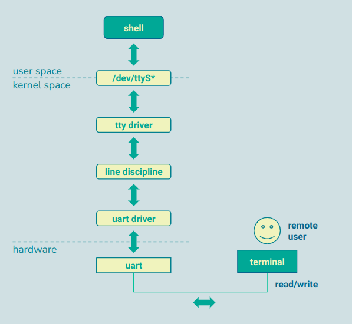
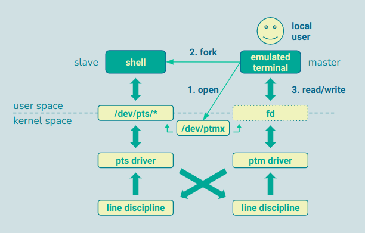
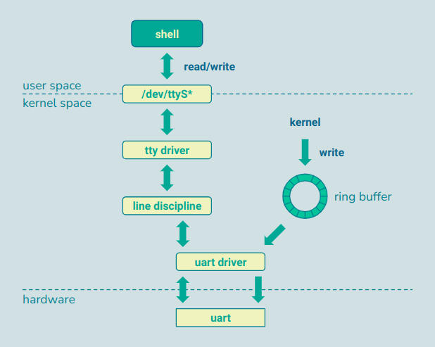
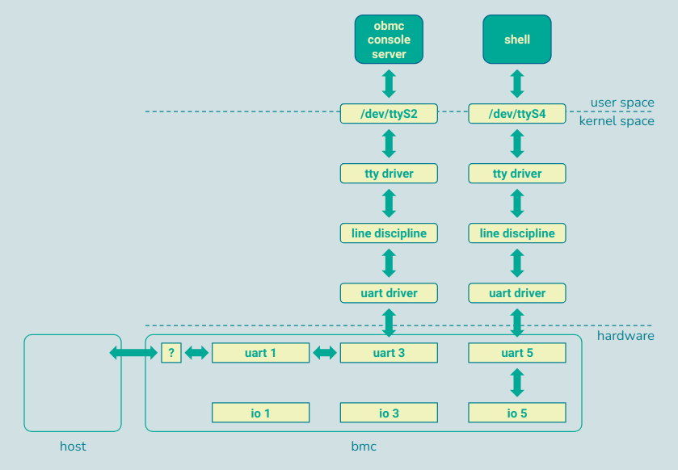

> Study case: Linux version 5.15.69 on OpenBMC

## Index

- [Introduction](#introduction)
- [TTY & PTY](#tty-and-pty)
- [Console](#console)
- [Serial over Lan (SOL)](#sol)
- [System Startup](#system-startup)
- [Cheat Sheet](#cheat-sheet)
- [Reference](#reference)

## <a name="introduction"></a> Introduction

The teletype, initially unrelated to computers, allowed users to input characters that were printed onto paper. 
As computers emerged, teletypes were repurposed as input and output devices due to their suitability. 
While not an integral part of the computer, teletypes functioned as terminals connected to computers, enabling users to interact with the shared resource. 
Over time, as personal computers became more affordable, the terminal/computer model was simplified, and terminals were integrated into a single PC. 
Initially emulated in the kernel, terminal functionality eventually transitioned to userspace, resulting in the design of pseudo terminals with master and slave components for enhanced flexibility.

## <a name="tty-and-pty"></a> TTY & PTY

### TTY

Whether it's a traditional hardware terminal or a modern software application like PuTTY, both serve as interfaces to access a target machine via a UART cable. 
When using PuTTY as an example, data passes through various components before reaching the shell, and the same path is taken for output display:

- TTY driver
  - Manages session input and output.
- Line discipline
  - Handles tasks such as character echo, ^C interrupts, line editing, and more.
- UART driver
  - Controls the hardware component responsible for UART communication.

<p align="center"></p>

<details><summary> More Details </summary>
   
Device Name       | Description
--                | --
tty1 ~ n          | Command line interface. On Raspberry Pi, Ctrl + Alt + F1 ~ F6 can switch to corresponding TTY 
ptmx & pts/0 ~ n  | Pseudo TTY, responsible for GUI and SSH consoles
ttyS0 ~ n         | It means serial console and each represents one UART within chip
ttyAMA0 ~ n       | ARM serial console?
ttyUSB0 ~ n       | Serial cable with USB interface. E.g. Plug in the USB-to-TTL cable to Raspberry Pi and you can see one
ttyprintk         | Redirect message to this file and then it can be displayed by command 'dmesg'
tty               | Conceptually it's like a link that always points to the TTY device of current task
console           | In terms of results, it represents the one specified by the kernel boot argument 'console=', which is ttyS4 in my case

```
In serial console:
root@romulus:~# ls -l /proc/$$/fd
lrwx------    1 root     root            64 Jul 27 15:25 0 -> /dev/ttyS4
lrwx------    1 root     root            64 Jul 27 15:25 1 -> /dev/ttyS4
lrwx------    1 root     root            64 Jul 27 15:25 2 -> /dev/ttyS4
lrwx------    1 root     root            64 Jul 27 15:25 255 -> /dev/ttyS4

In SSH console:
root@romulus:~# ls -l /proc/$$/fd
lrwx------    1 root     root            64 Jul 27 15:26 0 -> /dev/pts/0
lrwx------    1 root     root            64 Jul 27 15:26 1 -> /dev/pts/0
lrwx------    1 root     root            64 Jul 27 15:26 2 -> /dev/pts/0
lrwx------    1 root     root            64 Jul 27 15:26 255 -> /dev/pts/0
```

```
         TTY out                         TTY in          
                                                         
      +-----------+                    +----------+      
      | tty_write |                    | tty_read |      
      +-----------+                    +----------+      
            |                                |           
            v                                v           
     +-------------+                  +------------+     
     | n_tty_write |                  | n_tty_read |     
     +-------------+                  +------------+     
            |                                |           
            |                                v           
            |                              data          
            |                                ^           
            |                                |           
            |                      +-------------------+ 
            |                      | n_tty_receive_buf | 
            |                      +-------------------+ 
            |                                ^           
            v                                |           
     +------------+                +------------------+  
     | uart_write |                | uart_insert_char |  
     +------------+                +------------------+  
            |                                ^           
            v                                |           
 +---------------------+                     |           
 | serial8250_start_tx |                     |           
 +---------------------+                     |           
     async  |                                |           
            v                                |           
+----------------------+         +----------------------+
| serial8250_interrupt |         | serial8250_interrupt |
+--+----------------+--+         +---+---------------+--+
   | mem_serial_out |                | mem_serial_in |   
   +----------------+                +---------------+   
            |                                ^           
            v                                |           
      UART hardware                    UART hardware     
```
    
```
root@romulus:/dev# ls -l tty* console
crw-------    1 root     root        5,   1 Jan 31 04:06 console
crw-rw-rw-    1 root     tty         5,   0 Jan 31 04:05 tty
crw-rw----    1 root     dialout     4,  64 Jan 31 04:05 ttyS0
crw-rw----    1 root     dialout     4,  65 Jan 31 04:05 ttyS1
crw-rw----    1 root     dialout     4,  66 Jan 31 04:05 ttyS2
crw-rw----    1 root     dialout     4,  67 Jan 31 04:05 ttyS3
crw-------    1 root     tty         4,  68 Feb  1 06:36 ttyS4
crw-rw----    1 root     dialout     4,  69 Jan 31 04:05 ttyS5
lrwxrwxrwx    1 root     root             5 Jan 31 04:05 ttyVUART0 -> ttyS5
```

```
                                                                                                                                                                        
                                                                                                     static const struct uart_ops serial8250_pops = {                   
                                                                                                         .tx_empty   = serial8250_tx_empty,                             
                                                                                                         .set_mctrl  = serial8250_set_mctrl,                            
                                  static const struct tty_port_operations uart_port_ops = {              .get_mctrl  = serial8250_get_mctrl,                            
                                      .carrier_raised = uart_carrier_raised,                             .stop_tx    = serial8250_stop_tx,                              
                                      .dtr_rts    = uart_dtr_rts,                                        .start_tx   = serial8250_start_tx,                             
                                      .activate   = uart_port_activate,                                  .stop_rx    = serial8250_stop_rx,                              
                                      .shutdown   = uart_tty_port_shutdown,                              .startup    = serial8250_startup,                              
                                  };                                                                     .shutdown   = serial8250_shutdown,                             
                                                                                                                                                                        
                                                                                                         ...-------------------------+                                  
                                                      +------------------------------+               |                               |           (struct uart_8250_port)
                                                      |         uart_port  -------------------------------------> port               |                                  
                                                      |                              |               |  +--------------------------+ |                                  
                                                      |         (tty_)port  <---------------+        |  |                          | | ---------- serial8250_ports[0]   
                                                      |  +------------------------+  |      |        |  |  ops = serial8250_pops   | |                                  
                       （uart_driver）                  |  |  ops = uart_port_ops   |  | <----|------------- state                   | |            serial8250_ports[1]   
                                                      |  |                        |  |      |        |  |  minor                   | |                                  
                         serial8250_reg->state[0] ----|  |                        |  |      |        |  +--------------------------+ |                     -            
                                                      |  |                        |  |      |        |                               |                     -            
                         serial8250_reg->state[1]     |  +------------------------+  |      |        |    ops = univ8250_driver_ops  |                     -            
                                                      +------------------------------+      |        +-------------------------------+                                  
                                    -                                                       |                                                     serial8250_ports[5]   
                                    -                                                       |                                                                           
                                    -                                                       |                                                                           
                                                                                            |         static const struct uart_8250_ops univ8250_driver_ops = {         
                         serial8250_reg->state[5]                                           |             .setup_irq  = univ8250_setup_irq,                             
                                                                                            |             .release_irq    = univ8250_release_irq,                       
                         serial8250_reg->tty_driver                                         |                                                                           
                                            |                                               |                                                                           
                                            |                                               |                                                                           
                                            |                    tty_driver                 |                                                                           
                                            |        +--------------------------------------|---+                                                                       
                                            |        |  ttys[0]   - - -    ttys[5]          |   |                                                                       
                                            +---->   |                                  ports[0]|                                                                       
                                                     |                                  ports[1]|                                                                       
 static const struct file_operations tty_fops = {    |                                  ports[2]|                                                                       
     .llseek     = no_llseek,                        |  termios[0]  - - -  termios[5]           |                                                                       
     .read_iter  = tty_read,                         |                                          |                                                                       
     .write_iter = tty_write,                        |  cdevs[0]   - - -   cdevs[5]             |                                                                       
     .splice_read    = generic_file_splice_read,     |                                  ports[5]|                                                                       
     .splice_write   = iter_file_splice_write,       |  ops = uart_ops                          |                                                                       
     .poll       = tty_poll,                         +------------------------------------------+                                                                       
     .unlocked_ioctl = tty_ioctl,                                                                                                                                       
     .compat_ioctl   = tty_compat_ioctl,             static const struct tty_operations uart_ops = {         static const struct tty_operations pty_unix98_ops = {      
     .open       = tty_open,                             .install    = uart_install,                             .lookup = pts_unix98_lookup,                           
     .release    = tty_release,                          .open       = uart_open,                                .install = pty_unix98_install,                         
     .fasync     = tty_fasync,                           .close      = uart_close,                      or       .open = pty_open,                                      
     .show_fdinfo    = tty_show_fdinfo,                  .write      = uart_write,                               .close = pty_close,                                    
 };                                                  ...                                                         .write = pty_write,                                    
                                                                                                             ...                                                        
```
    
```
static const struct file_operations tty_fops = {
    .llseek     = no_llseek,
    .read_iter  = tty_read,
    .write_iter = tty_write,
    .splice_read    = generic_file_splice_read,
    .splice_write   = iter_file_splice_write,
    .poll       = tty_poll,
    .unlocked_ioctl = tty_ioctl,
    .compat_ioctl   = tty_compat_ioctl,
    .open       = tty_open,
    .release    = tty_release,
    .fasync     = tty_fasync,
    .show_fdinfo    = tty_show_fdinfo,
};
```

```
drivers/tty/tty_io.c                                                                    
+----------+                                                                             
| tty_open | : ready tty/ldisc/tty_port(xmit buffer, isr, ...), wait                     
+-|--------+                                                                             
  |    +------------------+                                                              
  |--> | nonseekable_open | remove flags to make the file non-seekable                   
  |    +------------------+                                                              
  |    +----------------+                                                                
  |--> | tty_alloc_file | alloc private and save in file                                 
  |    +----------------+                                                                
  |    +----------------------+                                                          
  |--> | tty_open_current_tty | get tty from current->signal, ensure it has ldisc        
  |    +----------------------+                                                          
  |                                                                                      
  |--> if no tty, which means its dev# isn't (5, 0)                                      
  |    |                                                                                 
  |    |    +--------------------+                                                       
  |    +--> | tty_open_by_driver | look up driver, ensure tty and ldisc are ready        
  |         +--------------------+                                                       
  |    +--------------+                                                                  
  |--> | tty_add_file | add file_priv to tty                                             
  |    +--------------+                                                                  
  |                                                                                      
  +--> call ->open, e.g.,                                                                
       +-----------+                                                                     
       | uart_open | ensure tty_port is initialized (xmit buffer, port set up, isr), wait
       +-----------+                                                                     
```

```
drivers/tty/tty_io.c                                                       
+----------------------+                                                    
| tty_open_current_tty | : get tty from current->signal, ensure it has ldisc
+-|--------------------+                                                    
  |                                                                         
  |--> if dev# isn't (5, 0), return null (let caller handle it)             
  |                                                                         
  |    +-----------------+                                                  
  |--> | get_current_tty | get tty from current->signal                     
  |    +-----------------+                                                  
  |    +------------+                                                       
  +--> | tty_reopen | ensure tty has ldisc                                  
       +------------+                                                       
```

```
drivers/tty/tty_io.c                                                                                
+--------------------+                                                                               
| tty_open_by_driver | : look up driver, ensure tty and ldisc are ready                              
+-|------------------+                                                                               
  |    +-------------------+                                                                         
  |--> | tty_lookup_driver | look up tty driver based on dev#                                        
  |    +-------------------+                                                                         
  |    +-----------------------+                                                                     
  |--> | tty_driver_lookup_tty | look up tty from slave dentry (pty case) or tty driver (tty case)
  |    +-----------------------+                                                                     
  |                                                                                                  
  |--> if tty exists                                                                                 
  |    |                                                                                             
  |    |    +------------+                                                                           
  |    +--> | tty_reopen | ensure tty has ldisc                                                      
  |         +------------+                                                                           
  |                                                                                                  
  +--> else                                                                                          
       |                                                                                             
       |    +--------------+                                                                         
       +--> | tty_init_dev | prepare tty and save in driver, ensure it has port, open line discipline
            +--------------+                                                                         
```

```
drivers/tty/tty_io.c                                                                                          
+-------------------+                                                                                          
| tty_lookup_driver | : look up tty driver based on dev#                                                       
+-|-----------------+                                                                                          
  |                                                                                                            
  |--> switch dev#                                                                                             
  |--> case (5, 1)                                                                                             
  |    |                                                                                                       
  |    |    +----------------+                                                                                 
  |    +--> | console_device | traverse console_drivers, get the 1st console with driver, return the driver    
  |         +----------------+                                                                                 
  |                                                                                                            
  +--> default                                                                                                 
       |                                                                                                       
       |    +----------------+                                                                                 
       +--> | get_tty_driver | traverse tty_drivers to find the driver that governs arg dev#, return the driver
            +----------------+                                                                                 
```

```
kernel/printk/printk.c                                                                          
+----------------+                                                                               
| console_device | : traverse console_drivers, get the 1st console with driver, return the driver
+-|--------------+                                                                               
  |                                                                                              
  +--> for each console in console_drivers                                                       
       |                                                                                         
       |--> if ->device() doesn't exist, continue                                                
       |                                                                                         
       |--> call ->device(), e.g.,                                                               
       |    +---------------------+                                                              
       |    | uart_console_device | return index & tty_driver                                    
       |    +---------------------+                                                              
       |                                                                                         
       +--> if driver found, break                                                               
```

```
drivers/tty/tty_io.c                                                                        
+-----------------------+                                                                    
| tty_driver_lookup_tty | : look up tty from slave dentry (pty case) or tty driver (tty case)
+-|---------------------+                                                                    
  |                                                                                          
  |--> if tty driver has ->lookup()                                                          
  |    -                                                                                     
  |    +--> call it, e.g.,                                                                   
  |         +-------------------+                                                            
  |         | pts_unix98_lookup | get slave tty from dentry private                          
  |         +-------------------+                                                            
  |                                                                                          
  +--> else                                                                                  
       -                                                                                     
       +--> given idx, get tty from tty_driver                                               
```

```
drivers/tty/tty_io.c                                                                      
+--------------+                                                                           
| tty_init_dev | : prepare tty and save in driver, ensure it has port, open line discipline
+-|------------+                                                                           
  |    +------------------+                                                                
  |--> | alloc_tty_struct | alloc and set up tty                                           
  |    +------------------+                                                                
  |    +------------------------+                                                          
  |--> | tty_driver_install_tty | install tty to driver                                    
  |    +------------------------+                                                          
  |                                                                                        
  |--> ensure tty has port                                                                 
  |                                                                                        
  |    +-----------------+                                                                 
  +--> | tty_ldisc_setup | open tty's line discipline                                      
       +-----------------+                                                                 
```

```
drivers/tty/tty_io.c                                                
+------------------------+                                           
| tty_driver_install_tty | : install tty to driver                   
+-|----------------------+                                           
  |                                                                  
  |--> if ->install() exists                                         
  |    -                                                             
  |    +--> call ->install(), e.g.,                                  
  |         +--------------+                                         
  |         | uart_install | save state in tty, install tty to driver
  |         +--------------+    
  |         +--------------------+                                         
  |         | pty_unix98_install | set up pty pair
  |         +--------------------+   
  |                                                                  
  +--> else                                                          
       |                                                             
       |    +----------------------+                                 
       +--> | tty_standard_install | install tty to driver           
            +----------------------+                                 
```

```
drivers/tty/tty_io.c                                              
+-----------------+                                                
| tty_ldisc_setup | : open tty's line discipline                   
+-|---------------+                                                
  |    +----------------+                                          
  |--> | tty_ldisc_open | open a line discipline                   
  |    +----------------+                                          
  |                                                                
  +--> if o_tty is provided                                        
       |                                                           
       |    +----------------+                                     
       +--> | tty_ldisc_open | open o_tty's line discipline as well
            +----------------+                                     
```

```
drivers/tty/tty_ldisc.c                                 
+----------------+                                       
| tty_ldisc_open | : open a line discipline              
+-|--------------+                                       
  |                                                      
  +--> if ->open() exists                                
       -                                                 
       +--> call it, e.g.,                               
            +------------+                               
            | n_tty_open | alloc and set up ldisc for tty
            +------------+                               
```

```
drivers/tty/serial/serial_core.c                                                            
+-----------+                                                                                
| uart_open | : ensure tty_port is initialized (xmit buffer, port set up, isr), wait         
+-|---------+                                                                                
  |    +---------------+                                                                     
  +--> | tty_port_open | ensure tty_port is initialized (xmit buffer, port set up, isr), wait
       +---------------+                                                                     
```

```
drivers/tty/tty_port.c                                                                                        
+---------------+                                                                                              
| tty_port_open | : ensure tty_port is initialized (xmit buffer, port set up, isr), wait                       
+-|-------------+                                                                                              
  |    +------------------+                                                                                    
  |--> | tty_port_tty_set | save tty in port                                                                   
  |    +------------------+                                                                                    
  |                                                                                                            
  |--> if the port isn't initialized yet                                                                       
  |    |                                                                                                       
  |    |--> if ->activate() exisits                                                                            
  |    |    -                                                                                                  
  |    |    +--> call it, e.g.,                                                                                
  |    |         +--------------------+                                                                        
  |    |         | uart_port_activate | prepare transmit buffer, set up 8250/uart ports, register isr for tx/rx
  |    |         +--------------------+                                                                        
  |    |    +--------------------------+                                                                       
  |    +--> | tty_port_set_initialized | set 'initialized' flag                                                
  |         +--------------------------+                                                                       
  |    +--------------------------+                                                                            
  +--> | tty_port_block_til_ready | waiting logic for tty open                                                 
       +--------------------------+                                                                            
```

```
drivers/tty/serial/serial_core.c                                                               
+--------------------+                                                                          
| uart_port_activate | : prepare transmit buffer, set up 8250/uart ports, register isr for tx/rx
+-|------------------+                                                                          
  |    +--------------+                                                                         
  +--> | uart_startup | prepare transmit buffer, set up 8250/uart ports, register isr for tx/rx 
       +--------------+                                                                         
```

```
drivers/tty/serial/serial_core.c                                                                   
+--------------+                                                                                    
| uart_startup | : prepare transmit buffer, set up 8250/uart ports, register isr for tx/rx          
+-|------------+                                                                                    
  |                                                                                                 
  |--> if tty_port is initialized already, return                                                   
  |                                                                                                 
  |    +-------------------+                                                                        
  +--> | uart_port_startup | prepare transmit buffer, set up 8250/uart ports, register isr for tx/rx
       +-------------------+                                                                        
```

```
drivers/tty/serial/serial_core.c                                                                     
+-------------------+                                                                                 
| uart_port_startup | : prepare transmit buffer, set up 8250/uart ports, register isr for tx/rx       
+-|-----------------+                                                                                 
  |                                                                                                   
  |--> ensure the uart_state has transmit buffer                                                      
  |                                                                                                   
  +--> call ->startup(), e.g.,                                                                        
       +--------------------+                                                                         
       | serial8250_startup | set up 8250/uart ports, clear fifo and interrupt, register isr for tx/rx
       +--------------------+                                                                         
```

```
drivers/tty/serial/8250/8250_port.c                                                                     
+--------------------+                                                                                   
| serial8250_startup | : set up 8250/uart ports, clear fifo and interrupt, register isr for tx/rx        
+-|------------------+                                                                                   
  |                                                                                                      
  |--> if uart_port has ->startup()                                                                      
  |    -                                                                                                 
  |    +--> call it, and return                                                                          
  |                                                                                                      
  |    +-----------------------+                                                                         
  +--> | serial8250_do_startup | set up 8250/uart ports, clear fifo and interrupt, register isr for tx/rx
       +-----------------------+                                                                         
```

```
drivers/tty/serial/8250/8250_port.c                                                                
+-----------------------+                                                                           
| serial8250_do_startup | : set up 8250/uart ports, clear fifo and interrupt, register isr for tx/rx
+-|---------------------+                                                                           
  |                                                                                                 
  |--> set up 8250_port and uart_port                                                               
  |                                                                                                 
  |    +------------------------+                                                                   
  |--> | serial8250_clear_fifos | clear fifo buffer (hw level)                                      
  |    +------------------------+                                                                   
  |                                                                                                 
  |--> clear interrupt registers                                                                    
  |                                                                                                 
  |--> test 'thre' if appropriate                                                                   
  |                                                                                                 
  +--> call ->setup_irq(), e.g.,                                                                    
       +--------------------+                                                                       
       | univ8250_setup_irq | prepare timer or isr to handle tx/rx                                  
       +--------------------+                                                                       
```

```
drivers/tty/serial/8250/8250_core.c                                                             
+--------------------+                                                                           
| univ8250_setup_irq | : prepare timer or isr to handle tx/rx                                    
+-|------------------+                                                                           
  |                                                                                              
  |--> if uart_port has no irq                                                                   
  |    |                                                                                         
  |    |    +-----------+                                                                        
  |    +--> | mod_timer |                                                                        
  |         +-----------+                                                                        
  |                                                                                              
  +--> else                                                                                      
       |                                                                                         
       |    +-----------------------+                                                            
       +--> | serial_link_irq_chain | add 8250_port's irq_info to chain, ensure isr is registered
            +-----------------------+                                                            
```

```
drivers/tty/serial/8250/8250_core.c                                                   
+-----------------------+                                                              
| serial_link_irq_chain | : add 8250_port's irq_info to chain, ensure isr is registered
+-|---------------------+                                                              
  |                                                                                    
  |--> ensure 8250_port has its irq_info in irq_lists                                  
  |                                                                                    
  |--> if irq_info has head (someone's there already)                                  
  |    -                                                                               
  |    +--> add 8250_port to it                                                        
  |                                                                                    
  +--> else                                                                            
       |                                                                               
       |--> set 8250_port as its head                                                  
       |                                                                               
       |    +-------------+                                                            
       +--> | request_irq | register isr                                               
            +-------------+ +----------------------+                                   
                            | serial8250_interrupt |                                   
                            +----------------------+                                   
                            for each irq_info in list: handle irq (perform rx/tx)      
```

```
drivers/tty/serial/8250/8250_core.c                                                             
+----------------------+                                                                         
| serial8250_interrupt | : for each irq_info in list: handle irq (perform rx/tx)                 
+-|--------------------+                                                                         
  |                                                                                              
  +--> for each irq_info in list                                                                 
       |                                                                                         
       |--> get its uart_port                                                                    
       |                                                                                         
       +--> call ->handle_irq(), e.g.,                                                           
            +-------------------------------+                                                    
            | serial8250_default_handle_irq | read line status register, handle rx/tx accordingly
            +-------------------------------+                                                    
```

```
drivers/tty/serial/8250/8250_port.c                                                   
+-------------------------------+                                                      
| serial8250_default_handle_irq | : read line status register, handle rx/tx accordingly
+-|-----------------------------+                                                      
  |    +----------------+                                                              
  |--> | serial_port_in | read interrupt id register                                   
  |    +----------------+                                                              
  |    +-----------------------+                                                       
  +--> | serial8250_handle_irq | read line status register, handle rx/tx accordingly   
       +-----------------------+                                                       
```

```
drivers/tty/serial/8250/8250_port.c                                                  
+-----------------------+                                                             
| serial8250_handle_irq | : read line status register, handle rx/tx accordingly       
+-|---------------------+                                                             
  |    +----------------+                                                             
  |--> | serial_port_in | read line status register                                   
  |    +----------------+                                                             
  |                                                                                   
  |--> if status has flag 'dr' or 'bi' set                                            
  |    |                                                                              
  |    |    +---------------------+                                                   
  |    +--> | serial8250_rx_chars | read chars from register, place in tty read buffer
  |         +---------------------+                                                   
  |                                                                                   
  +--> if status has flag 'thre' set                                                  
       |                                                                              
       |    +---------------------+                                                   
       +--> | serial8250_tx_chars | for chars in transmit buffer, output to register  
            +---------------------+                                                   
```

```
drivers/tty/tty_io.c                                       
+----------+                                                
| tty_read | : wait for ldisc, read data into arg iterator  
+-|--------+                                                
  |    +--------------------+                               
  |--> | tty_ldisc_ref_wait | wait for tty ldisc            
  |    +--------------------+                               
  |                                                         
  +--> if ldisc has ->read()                                
       |                                                    
       |    +------------------+                            
       +--> | iterate_tty_read | read data into arg iterator
            +------------------+                            
```

```
drivers/tty/tty_io.c                             
+------------------+                              
| iterate_tty_read | : read data into arg iterator
+-|----------------+                              
  |                                               
  +--> while still valid                          
       |                                          
       |--> call ->read(), e.g.,                  
       |    +------------+                        
       |    | n_tty_read | read data into arg kbuf
       |    +------------+                        
       |                                          
       |    +--------------+                      
       |--> | copy_to_iter | copy to arg iterator 
       |    +--------------+                      
       |                                          
       +--> update offset and remaining count     
```

```
drivers/tty/tty_io.c                                                               
+-----------+                                                                       
| tty_write | : copy data from iter to tty_write_buf, call tty-level write          
+-|---------+                                                                       
  |    +----------------+                                                           
  +--> | file_tty_write | copy data from iter to tty_write_buf, call tty-level write
       +----------------+                                                           
```

```
drivers/tty/tty_io.c                                                             
+----------------+                                                                
| file_tty_write | : copy data from iter to tty_write_buf, call tty-level write   
+-|--------------+                                                                
  |    +--------------------+                                                     
  |--> | tty_ldisc_ref_wait | wait for tty ldisc                                  
  |    +--------------------+                                                     
  |    +--------------+                                                           
  +--> | do_tty_write | copy data from iter to tty_write_buf, call tty-level write
       +--------------+                                                           
```

```
drivers/tty/tty_io.c                                                        
+--------------+                                                             
| do_tty_write | : copy data from iter to tty_write_buf, call tty-level write
+-|------------+                                                             
  |                                                                          
  +--> endless loop                                                          
       |                                                                     
       |    +----------------+                                               
       |--> | copy_from_iter | copy data from iterator to tty write buf      
       |    +----------------+                                               
       |                                                                     
       |--> cal arg write(), e.g.,                                           
       |    +-------------+                                                  
       |    | n_tty_write | tty-level write                                  
       |    +-------------+                                                  
       |                                                                     
       |--> update written and remaining count                               
       |                                                                     
       +--> break if nothing left to write                                   
```

```
drivers/tty/tty_io.c                                                           
+-------------+                                                                 
| tty_release | : delete file, release ldisc, flush work, remove tty from driver
+-|-----------+                                                                 
  |    +--------------+                                                         
  |--> | __tty_fasync | (skip)                                                  
  |    +--------------+                                                         
  |                                                                             
  |--> if ->close() exists                                                      
  |    -                                                                        
  |    +--> call it, e.g.,                                                      
  |         +------------+                                                      
  |         | uart_close |                                                      
  |         +------------+                                                      
  |    +--------------+                                                         
  +--> | tty_del_file | delete file from tty (free file private)                
  |    +--------------+                                                         
  |    +--------------------+                                                   
  +--> | tty_release_struct | release ldisc, flush work, remove tty from driver 
       +--------------------+                                                   
```
    
</details>

### PTY


In the PTY (pseudo-terminal) design, a master and slave TTY device are paired together, creating a bidirectional connection. 
The master's output is redirected to the slave, and vice versa.

For instance, when launching a GUI terminal application, it opens /dev/ptmx to obtain the file descriptor of the pseudo-terminal master (ptm). 
Simultaneously, a pseudo-terminal slave (pts) file is generated, such as /dev/pts/0, and a newly forked shell is attached to it.

Any input provided on the master side undergoes processing by its TTY driver and line discipline. 
When the enter key is pressed, the data is transmitted to the slave side, passing through the slave's line discipline, TTY driver, and ultimately reaching the shell for command processing.

Likewise, output from the shell follows a similar path back to the master side for display, whether it is local or remote (e.g., in the case of an SSH server).

<p align="center"></p>

<details><summary> More Details </summary>

```
static const struct tty_operations pty_unix98_ops = { 
    .lookup = pts_unix98_lookup, ------------- set up pty pair
    .install = pty_unix98_install,
    .remove = pty_unix98_remove,
    .open = pty_open, ------------------------ set flags
    .close = pty_close, ---------------------- set flags
    .write = pty_write, ---------------------- copy data to tty buffer, and flush to ldisc
    .write_room = pty_write_room,
    .flush_buffer = pty_flush_buffer,
    .unthrottle = pty_unthrottle,
    .set_termios = pty_set_termios,
    .start = pty_start,
    .stop = pty_stop,
    .cleanup = pty_cleanup,
};
```

```
drivers/tty/pty.c                                          
+--------------------+                                      
| pty_unix98_install | : set up pty pair                    
+-|------------------+                                      
  |    +--------------------+                               
  +--> | pty_common_install | : set up pty pair             
       +-|------------------+                               
         |                                                  
         |--> alloc two tty ports                           
         |                                                  
         |    +------------------+                          
         |--> | alloc_tty_struct | alloc and set up o_tty   
         |    +------------------+                          
         |                                                  
         |--> link arg tty and newly created o_tty          
         |                                                  
         |--> init both ports                               
         |                                                  
         +--> assign port[0] to o_tty and port[1] to arg tty
```

```
drivers/tty/pty.c                                                                           
+-----------+                                                                                
| pty_write | : copy data to tty buffer, and flush to ldisc                                  
+-|---------+                                                                                
  |    +----------------------------------------+                                            
  +--> | tty_insert_flip_string_and_push_buffer | copy data to tty buffer, and flush to ldisc
       +----------------------------------------+                                            
```

```
drivers/tty/tty_buffer.c                                                                 
+----------------------------------------+                                                
| tty_insert_flip_string_and_push_buffer | : copy data to tty buffer, and flush to ldisc  
+-|--------------------------------------+                                                
  |    +------------------------+                                                         
  |--> | tty_insert_flip_string | copy data to tty buffer                                 
  |    +------------------------+                                                         
  |    +------------------------+                                                         
  |--> | tty_flip_buffer_commit | data is ready to be flushed to ldisc                    
  |    +------------------------+                                                         
  |    +------------+ +----------------+                                                  
  +--> | queue_work | | flush_to_ldisc |                                                  
       +------------+ +----------------+                                                  
                      receive data to tty read buffer till no more, wake up task if needed
```

```
include/linux/tty_flip.h                                             
+------------------------+                                            
| tty_insert_flip_string | : copy data to tty buffer                  
+-|----------------------+                                            
  |    +-----------------------------------+                          
  +--> | tty_insert_flip_string_fixed_flag | : copy data to tty buffer
       +-|---------------------------------+                          
         |    +---------------------------+                           
         |--> | __tty_buffer_request_room | grow tty buffer if needed 
         |    +---------------------------+                           
         |                                                            
         +--> copy data to tty buffer                                 
```

```
drivers/tty/pty.c                                                                              
+-----------+                                                                                   
| ptmx_open | : open a unix98 pty master (create inode for pts)                                 
+-|---------+                                                                                   
  |    +----------------+                                                                       
  |--> | tty_alloc_file | alloc private and save in file                                        
  |    +----------------+                                                                       
  |    +----------------+                                                                       
  |--> | devpts_acquire | get fs_info of sb                                                     
  |    +----------------+                                                                       
  |    +------------------+                                                                     
  |--> | devpts_new_index | find an unused index                                                
  |    +------------------+                                                                     
  |    +--------------+                                                                         
  |--> | tty_init_dev | prepare tty and save in driver, ensure it has port, open line discipline
  |    +--------------+                                                                         
  |    +--------------+                                                                         
  |--> | tty_add_file | add file_priv to tty                                                    
  |    +--------------+                                                                         
  |    +----------------+                                                                       
  |--> | devpts_pty_new | create (inode, dentry) for pts                                        
  |    +----------------+                                                                       
  |                                                                                             
  +--> call ->open(), e.g.,                                                                     
       +----------+                                                                             
       | pty_open | set flags on tty                                                            
       +----------+                                                                             
```

```
drivers/tty/pty.c                                     
+----------------+                                     
| devpts_pty_new | : create (inode, dentry) for pts    
+-|--------------+                                     
  |    +-----------+                                   
  |--> | new_inode |                                   
  |    +-----------+                                   
  |    +--------------------+                          
  |--> | init_special_inode | char dev for slave       
  |    +--------------------+                          
  |    +--------------+                                
  |--> | d_alloc_name | alloc child dentry of sb dentry
  |    +--------------+                                
  |    +-------+                                       
  +--> | d_add | add to hash table                     
       +-------+                                       
```

</details>

## <a name="console"></a> Console


The TTY and PTY devices serve as input/output devices for user space applications, while the kernel utilizes the console device to output its logs. 
The device tree source (DTS) configuration allows for the setup of both the early console and the preferred console, which serve as channels for the kernel to display its messages.

```
chosen {
    stdout-path = "/ahb/apb/serial@1e784000";
    bootargs = "console=ttyS4,115200 earlycon";
};
```

The earlycon attribute in the device tree configuration instructs the kernel to set up an early console, also known as a boot console. 
It uses the ns16550a property in the serial@1e784000 node to configure the console device.

```
serial@1e784000 {
    compatible = "ns16550a";
    reg = <0x1e784000 0x20>;
    reg-shift = <0x02>;
    interrupts = <0x0a>;
    clocks = <0x02 0x0f>;
    no-loopback-test;
    status = "okay";
};
```

Once the serial devices specified in the device tree are enabled, they are sequentially added and matched. 
However, only the preferred console becomes the formal console device for the kernel.

In our case, we have the following enabled serial devices:

- 1e787000.serial: ttyS5 (virtual uart)
- 1e783000.serial: ttyS0 (regular uart)
- 1e784000.serial: ttyS4 (regular uart and specified as the preferred console)

During the boot process, the kernel uses functions like `printk` to commit log messages to the ring buffer. 
These log messages remain in the buffer until a console is registered. 
Although we cannot see them before the console is available, they are stored in the buffer.

Once a console is ready, the `console_unlock` function is called, which flushes the stacked logs from the ring buffer to the console(s) simultaneously. 
However, if the log messages in the buffer are not overwritten, they will be flushed out to the console(s) when the console becomes available.

<p align="center"></p>

<details><summary> More Details </summary>
    
```
include/linux/printk.h                                                                       
+--------+                                                                                    
| printk |                                                                                    
+-|------+                                                                                    
  |    +-------------------+                                                                  
  +--> | printk_index_wrap |                                                                  
       +-|-----------------+                                                                  
         |    +---------+                                                                     
         +--> | _printk |                                                                     
              +-|-------+                                                                     
                |    +---------+                                                              
                +--> | vprintk |                                                              
                     +-|-------+                                                              
                       |    +-----------------+                                               
                       +--> | vprintk_default |                                               
                            +-|---------------+                                               
                              |    +--------------+                                           
                              +--> | vprintk_emit | commit log to ring buffer, try to flush it
                                   +--------------+ 
```
    
```
kernel/printk/printk.c                                                                                          
+--------------+                                                                                                 
| vprintk_emit | : commit log to ring buffer, try to flush it                                                    
+-|------------+                                                                                                 
  |    +---------------+                                                                                         
  |--> | vprintk_store | complete string and commit to ring buffer                                               
  |    +---------------+                                                                                         
  |                                                                                                              
  +--> if not from scheduler                                                                                     
       |                                                                                                         
       |    +--------------------------+                                                                         
       |--> | console_trylock_spinning |                                                                         
       |    +--------------------------+                                                                         
       |                                                                                                         
       +--> if try lock successfully                                                                             
            |                                                                                                    
            |    +----------------+                                                                              
            +--> | console_unlock | for each valid record: prepend timestamp and ask console drivers to print out
                 +----------------+                                                                              
```
    
```
kernel/printk/printk.c                                                                     
+---------------+                                                                           
| vprintk_store | : complete string and commit to ring buffer                               
+-|-------------+                                                                           
  |    +-------------+                                                                      
  |--> | local_clock | get timestamp                                                        
  |    +-------------+                                                                      
  |    +-----------+                                                                        
  |--> | vsnprintf | replace specifier(s) in prefix string                                  
  |    +-----------+                                                                        
  |    +---------------------+                                                              
  |--> | printk_parse_prefix | get log level and control flags                              
  |    +---------------------+                                                              
  |    +-----------------+                                                                  
  |--> | prb_rec_init_wr | init record                                                      
  |    +-----------------+                                                                  
  |    +-------------+                                                                      
  |--> | prb_reserve | reserve space for record in ring buffer                              
  |    +-------------+                                                                      
  |    +---------------+                                                                    
  |--> | printk_sprint | fill (complete) msg in record (space is allocated from ring buffer)
  |    +---------------+                                                                    
  |    +------------------+                                                                 
  +--> | prb_final_commit | reserved entry's state = desc_finalized                         
       +------------------+                                                                 
```
    
</details>

## <a name="sol"></a> Serial over Lan (SOL)

<p align="center"></p>

## <a name="system-startup"></a> System Startup

Certainly! Here are some console-related functions that print logs during system startup:

- `param_setup_earlycon`: 
  - This function parses the kernel command and sets up the early console, which serves as the boot console for printing early-stage logs.
- `aspeed_uart_routing_driver_init`: 
  - This function initializes the UART routing driver for AST2500, allowing users to configure the routing of UART signals.
- `serial8250_init`: 
  - This function initializes six serial 8250 ports as specified in the configuration file. These ports are commonly used for regular UART communication.
- `aspeed_vuart_probe`: 
  - This function is responsible for probing the Aspeed virtual UART (vUART) and handling any necessary initialization. (Skipping details as per request)
- `of_platform_serial_probe`: 
  - This function matches and probes enabled serial devices specified in the device tree (DTS). It overwrites the default settings in the corresponding 8250 ports with the configuration from the DTS.
- `init_netconsole`: 
  - This function initializes the netconsole, which allows logging messages to be sent over the network. (Skipping details as per request)

```
start_kernel
|
|--> setup_arch
|    -
|    +--> parse_early_param
|         -
|         +--> param_setup_earlycon                  [    0.000000] earlycon: ns16550a0 at MMIO 0x1e784000 (options '')
|                                                    [    0.000000] printk: bootconsole [ns16550a0] enabled
|
+--> print                                           [    0.000000] Kernel command line: console=ttyS4,115200 earlycon


kernel_init
-
+--> kernel_init_freeable
     -
     +--> do_basic_setup
          -
          +--> do_initcalls
               |
               |--> aspeed_uart_routing_driver_init  [    0.399431] aspeed-uart-routing 1e78909c.uart-routing: module loaded
               |
               |--> serial8250_init                  [    0.401357] Serial: 8250/16550 driver, 6 ports, IRQ sharing enabled
               |
               |--> aspeed_vuart_driver_init
               |    -
               |    +--> aspeed_vuart_probe          [    0.410609] 1e787000.serial: ttyS5 at MMIO 0x1e787000 (irq = 34, base_baud = 1546875) is a ASPEED VUART
               |
               |--> of_platform_serial_driver_init
               |    |
               |    |--> of_platform_serial_probe    [    0.424438] 1e783000.serial: ttyS0 at MMIO 0x1e783000 (irq = 32, base_baud = 1500000) is a 16550A
               |    +--> of_platform_serial_probe    [    0.429486] 1e784000.serial: ttyS4 at MMIO 0x1e784000 (irq = 33, base_baud = 1500000) is a 16550A
               |                                     [    0.430992] printk: console [ttyS4] enabled
               |                                     [    0.431583] printk: bootconsole [ns16550a0] disabled
               |
               +--> init_netconsole                  [    2.159554] printk: console [netcon0] enabled
                                                     [    2.159703] netconsole: network logging started
```

<details><summary> More Details </summary>

```
param_setup_earlycon:            set up early console
console_setup:                   parse 'console=xxx,yyy', add as preferred console 
proc_consoles_init:              create /proc/consoles
chr_dev_init:                    (don't care)
   tty_init:                     init char devices for tty and console
aspeed_uart_routing_driver_init: register 'aspeed_uart_routing_driver' to bus 'platform'
pty_init:                        init ptmx/ptm/pty       
serial8250_init:                 init and register 'seerial8250_ports', prepare tty driver, register platform dev/drv (serial8250)
   serial8250_probe:             for each valid port in dev data: register a 8250 port
aspeed_vuart_driver_init:        register platform driver 'aspeed_vuart_driver'
   aspeed_vuart_probe:           prepare port (ops), install handle_irq, register 8250 ports, set enabled  
of_platform_serial_driver_init:  register platform driver 'of_platform_serial_driver'
   of_platform_serial_probe:     get iomem/irq, prepare info, register 8250 ports
mctp_serial_init:                (mctp over serial, skip)
usb_serial_init:                 prepare tty driver, register bus 'usb-serial'
usb_serial_module_init:          register usb intf driver, register arg drivers to bus 'usb-serial'
init_netconsole:                 register netdevice notifer, register net console
univ8250_console_init:           init serial8250 ports, register console (univ8250)          
```

```
drivers/tty/serial/earlycon.c                                       
+----------------------+                                             
| param_setup_earlycon | : set up early console                      
+-|--------------------+                                             
  |                                                                  
  |--> if no buf (it is 'earlycon' alone)                            
  |    |                                                             
  |    |    +----------------------------------+                     
  |    |--> | early_init_dt_scan_chosen_stdout | set up early console
  |    |    +----------------------------------+                     
  |    |                                                             
  |    +--> return                                                   
  |                                                                  
  |    +----------------+                                            
  +--> | setup_earlycon | （skip, it is for case of 'earlycon=???')   
       +----------------+                                            
```

```
drivers/of/fdt.c                                                                                                     
+----------------------------------+                                                                                  
| early_init_dt_scan_chosen_stdout | ： set up early console                                                           
+-|--------------------------------+                                                                                  
  |                                                                                                                   
  |--> get node '/chosen'                                                                                             
  |                                                                                                                   
  |--> get property 'stdout-path'                                                                                     
  |                                                                                                                   
  |--> based on property value, get node, e.g., 'serial@1e784000'                                                     
  |                                                                                                                   
  +--> for each entry in '__earlycon_table' (drivers/tty/serial/8250/8250_early.c)                                    
       |                                                                                                              
       |--> if entry has no 'compatible' field, continue                                                              
       |                                                                                                              
       |    +---------------------------+                                                                             
       |--> | fdt_node_check_compatible | check if entry can handle the earlycon                                      
       |    +---------------------------+                                                                             
       |                                                                                                              
       |--> if not, continue                                                                                          
       |                                                                                                              
       |    +-------------------+                                                                                     
       +--> | of_setup_earlycon | iomap, handle dt properties, set up uart/ops, register console, print out queued log
            +-------------------+          
            
chosen {
   stdout-path = "/ahb/apb/serial@1e784000"; <----------
   bootargs = "console=ttyS4,115200 earlycon";
};

serial@1e784000 {
    compatible = "ns16550a"; <----------
    reg = <0x1e784000 0x20>;
    reg-shift = <0x02>;
    interrupts = <0x0a>;
    clocks = <0x02 0x0f>;
    no-loopback-test;
    status = "okay";
};

drivers/tty/serial/8250/8250_early.c
   EARLYCON_DECLARE(uart8250, early_serial8250_setup);
   EARLYCON_DECLARE(uart, early_serial8250_setup);
   OF_EARLYCON_DECLARE(ns16550, "ns16550", early_serial8250_setup);
   OF_EARLYCON_DECLARE(ns16550a, "ns16550a", early_serial8250_setup); <----------
   OF_EARLYCON_DECLARE(uart, "nvidia,tegra20-uart", early_serial8250_setup);
   OF_EARLYCON_DECLARE(uart, "snps,dw-apb-uart", early_serial8250_setup);
```

```
drivers/tty/serial/earlycon.c                                                                              
+-------------------+                                                                                       
| of_setup_earlycon | : iomap, handle dt properties, set up uart/ops, register console, print out queued log
+-|-----------------+                                                                                       
  |    +------------------------------+                                                                     
  |--> | of_flat_dt_translate_address | translate reg addr from given node, e.g., 'serial@1e784000'         
  |    +------------------------------+                                                                     
  |                                                                                                         
  |--> handle other dt properties                                                                           
  |                                                                                                         
  |--> if options (baud rate) is provided, save it in early_console_dev                                     
  |                                                                                                         
  |    +---------------+                                                                                    
  |--> | earlycon_init | parse string to determine idx                                                      
  |    +---------------+                                                                                    
  |                                                                                                         
  |--> call ->setup(), e.g.,                                                                                
  |    +------------------------+                                                                           
  |    | early_serial8250_setup | set up uart and install ops                                               
  |    +------------------------+                                                                           
  |                                                                                                         
  |    +---------------------+                                                                              
  |--> | earlycon_print_info | print, e.g., "earlycon: ns16550a0 at MMIO 0x1e784000 (options '')"           
  |    +---------------------+                                                                              
  |    +------------------+                                                                                 
  +--> | register_console | add console to 'console_drivers', print out queued log                          
       +------------------+                                                                                 
```

```
drivers/tty/serial/8250/8250_early.c                                         
+------------------------+                                                    
| early_serial8250_setup | : set up uart and install ops                      
+-|----------------------+                                                    
  |                                                                           
  |--> if dev hasn't specified baud rate                                      
  |    -                                                                      
  |    +--> read/write hw reg to setup uart                                   
  |                                                                           
  |--> else (not our case)                                                    
  |    |                                                                      
  |    |    +-----------+                                                     
  |    +--> | init_port | read/write hw reg to config baud rate and setup uart
  |         +-----------+                                                     
  |                                                                           
  +--> install ops                                                            
       +------------------------+                                             
       | early_serial8250_write | write each char in string to hw reg         
       +-----------------------++                                             
       | early_serial8250_read | (null bc of disabled config)                 
       +-----------------------+                                              
```

```
drivers/tty/serial/8250/8250_early.c                                              
+------------------------+                                                         
| early_serial8250_write | : write each char in string to hw reg                   
+-|----------------------+                                                         
  |    +--------------------+                                                      
  +--> | uart_console_write | : write each char in string to hw reg                
       +-|------------------+                                                      
         |                                                                         
         +--> for each char in string                                              
              -                                                                    
              +--> call arg putchar(), e.g.,                                       
                   +-------------+                                                 
                   | serial_putc | write 'c' to tx reg, wait till status shows done
                   +-------------+                                                 
```

```
kernel/printk/printk.c                                                                                          
+------------------+                                                                                             
| register_console | : add console to 'console_drivers', print out queued log                                    
+-|----------------+                                                                                             
  |                                                                                                              
  |--> ensure we have a preferred console                                                                        
  |                                                                                                              
  |    +------------------------+                                                                                
  |--> | try_enable_new_console | try to match new_con with 'console_cmdline', enable it if matched              
  |    +------------------------+                                                                                
  |                                                                                                              
  |--> if fail, try again with loosen condition                                                                  
  |                                                                                                              
  |    +--------------+                                                                                          
  |--> | console_lock |                                                                                          
  |    +--------------+                                                                                          
  |                                                                                                              
  |--> add new_con to the head of 'console_drivers'                                                              
  |                                                                                                              
  |    +----------------+                                                                                        
  |--> | console_unlock | for each valid record: prepend timestamp and ask console drivers to print out          
  |    +----------------+                                                                                        
  |    +----------------------+                                                                                  
  |--> | console_sysfs_notify | (skip)                                                                           
  |    +----------------------+                                                                                  
  |                                                                                                              
  |--> print, e.g., 'printk: bootconsole [ns16550a0] enabled'                                                    
  |                                                                                                              
  +--> if we have boot console already, and new one is real console                                              
       -                                                                                                         
       +--> for each console in 'console_drivers'                                                                
            -                                                                                                    
            +--> if it's boot console                                                                            
                 |                                                                                               
                 |    +--------------------+                                                                     
                 +--> | unregister_console | remove console from list, clear 'enabled' flag, print out queued log
                      +--------------------+                                                                     
```

```
kernel/printk/printk.c                                                                       
+------------------------+                                                                    
| try_enable_new_console | : try to match new_con with 'console_cmdline', enable it if matched
+-|----------------------+                                                                    
  |                                                                                           
  +--> for each console in 'console_cmdline' (e.g., added by console_setup)                   
       |                                                                                      
       |--> if attributes 'user_specified' mismatch, continue                                 
       |                                                                                      
       |--> if new_con doesn't have ->match() or fail to match                                
       |    |                                                                                 
       |    |--> try other attributes: name, index, and ->setup()                             
       |    |                                                                                 
       |    +--> if it still fails, continue or return error                                  
       |                                                                                      
       |--> label 'enabled' on new_con                                                        
       |                                                                                      
       |--> if it's the preferred console                                                     
       |    |                                                                                 
       |    |--> label 'cons_dev' on new_con                                                  
       |    |                                                                                 
       |    +--> has_preferred_console = true                                                 
       |                                                                                      
       +--> return                                                                            
```

```
kernel/printk/printk.c                                                                           
+----------------+                                                                                
| console_unlock | : for each valid record: prepend timestamp and ask console drivers to print out
+-|--------------+                                                                                
  |    +-----------------+                                                                        
  |--> | prb_rec_init_rd | init record with info and text                                         
  |    +-----------------+                                                                        
  |again:                                                                                         
  |--> endless loop                                                                               
  |    |                                                                                          
  |    |    +----------------+                                                                    
  |    |--> | prb_read_valid | read a record, update arg seq#                                     
  |    |    +----------------+                                                                    
  |    |                                                                                          
  |    |--> if fail to read, break                                                                
  |    |                                                                                          
  |    |--> ensure console_seq == r.info->seq                                                     
  |    |                                                                                          
  |    |    +-------------------+                                                                 
  |    |--> | record_print_text | prepend prefix and append '\0' to text body                     
  |    |    +-------------------+                                                                 
  |    |                                                                                          
  |    |--> console_seq++                                                                         
  |    |                                                                                          
  |    |    +----------------------+                                                              
  |    +--> | call_console_drivers | for each driver in 'console_drivers': call ->write()         
  |         +----------------------+                                                              
  |                                                                                               
  |--> next_seq = console_seq                                                                     
  |                                                                                               
  |    +----------------+                                                                         
  |--> | prb_read_valid | next_seq                                                                
  |    +----------------+                                                                         
  |                                                                                               
  +--> if next_seq is valid (somewhere fills it while we're performing the above actions)         
       -                                                                                          
       +--> go to 'again'                                                                         
```

```
kernel/printk/printk_ringbuffer.c                               
+----------------+                                               
| prb_read_valid | : read a record, update arg seq#              
+-|--------------+                                               
  |    +-----------------+                                       
  +--> | _prb_read_valid | : read a record, update arg seq#      
       +-|---------------+                                       
         |          +----------+                                 
         |--> while | prb_read |                                 
         |    |     +----------+                                 
         |    |     copy text data from ring buffer to arg record
         |    |                                                  
         |    |    +---------------+                             
         |    |--> | prb_first_seq | get seq# of tail descriptor 
         |    |    +---------------+                             
         |    |                                                  
         |    |--> if seq# < tail                                
         |    |    -                                             
         |    |    +--> seq# = tail (catch up and try again)     
         |    |                                                  
         |    +--> else                                          
         |         -                                             
         |         +--> return false (no existent record)        
         |                                                       
         +--> return true                                        
```

```
kernel/printk/printk_ringbuffer.c                                         
+----------+                                                               
| prb_read | : copy text data from ring buffer to arg record               
+-|--------+                                                               
  |                                                                        
  |--> extract descriptor id                                               
  |                                                                        
  |    +-------------------------+                                         
  |--> | desc_read_finalized_seq | copy desc to desc_out                   
  |    +-------------------------+                                         
  |                                                                        
  |--> if r->info is provided, copy info to it                             
  |                                                                        
  |    +-----------+                                                       
  |--> | copy_data |                                                       
  |    +-----------+                                                       
  |    +-------------------------+                                         
  +--> | desc_read_finalized_seq | to ensure it's still a finalized record?
       +-------------------------+                                         
```

```
kernel/printk/printk_ringbuffer.c                 
+-------------------------+                        
| desc_read_finalized_seq | : copy desc to desc_out
+-|-----------------------+                        
  |    +-----------+                               
  +--> | desc_read | : copy desc to desc_out       
       +-|---------+                               
         |                                         
         |--> copy desc to desc_out                
         |                                         
         +--> save state in desc_out               
```

```
kernel/printk/printk.c
+-------------------+                                                        
| record_print_text | : prepend prefix and append '\0' to text body          
+-|-----------------+                                                        
  |    +-------------------+                                                 
  |--> | info_print_prefix | add prefix (syslog/timestamp/caller) is required
  |    +-------------------+                                                 
  |                                                                          
  |--> endless loop (to handle multiple lines)                               
  |    |                                                                     
  |    |--> determine line_len                                               
  |    |                                                                     
  |    |--> assemble prefix and text                                         
  |    |                                                                     
  |    +--> append '\n' and break                                            
  |                                                                          
  +--> append '\0'                                                           
```

```
kernel/printk/printk.c                                                 
+-------------------+                                                   
| info_print_prefix | : add prefix (syslog/timestamp/caller) is required
+-|-----------------+                                                   
  |                                                                     
  |--> if arg syslog is specified                                       
  |    |                                                                
  |    |    +--------------+                                            
  |    +--> | print_syslog | add "<%u>" to buffer                       
  |         +--------------+                                            
  |                                                                     
  |--> if arg time is specified                                         
  |    |                                                                
  |    |    +------------+                                              
  |    +--> | print_time | add timestamp to buffer                      
  |         +------------+                                              
  |    +--------------+                                                 
  +--> | print_caller | print caller?                                   
       +--------------+                                                 
```

```
kernel/printk/printk.c
+----------------------+
| call_console_drivers | : for each driver in 'console_drivers': call ->write()
+-|--------------------+
  |
  +--> for each driver in 'console_drivers'
       -
       +--> call driver->write(), e.g.,
            +------------------------+
            | early_serial8250_write | write each char in string to hw reg
            +------------------------+
            +------------------------+
            | univ8250_console_write |
            +------------------------+
```

```
kernel/printk/printk.c                                                                                
+--------------------+                                                                                 
| unregister_console | : remove console from list, clear 'enabled' flag, print out queued log          
+-|------------------+                                                                                 
  |                                                                                                    
  +--> print, e.g., "printk: bootconsole [ns16550a0] disabled"                                         
  |                                                                                                    
  |    +--------------+                                                                                
  |--> | console_lock |                                                                                
  |    +--------------+                                                                                
  |                                                                                                    
  |--> remove arg console from 'console_drivers'                                                       
  |                                                                                                    
  |--> remove flag 'enabled' from arg console                                                          
  |                                                                                                    
  |    +----------------+                                                                              
  |--> | console_unlock | for each valid record: prepend timestamp and ask console drivers to print out
  |    +----------------+                                                                              
  |                                                                                                    
  +--> if ->exit() exists, call it                                                                     
```

```
kernel/printk/printk.c                                                                   
+---------------+                                                                         
| console_setup | : parse 'console=xxx,yyy', add as preferred console                     
+-|-------------+                                                                         
  |                                                                                       
  |--> parse arg 'str, e.g., buf=ttyS4, options=115200                                    
  |                                                                                       
  |    +-------------------------+                                                        
  |--> | __add_preferred_console | ensure preferred console is set up in 'console_cmdline'
  |    +-------------------------+                                                        
  |                                                                                       
  +--> console_set_on_cmdline = 1                                                         
```

```
kernel/printk/printk.c                                                                 
+-------------------------+                                                             
| __add_preferred_console | ： ensure preferred console is set up in 'console_cmdline'   
+-|-----------------------+                                                             
  |                                                                                     
  |--> for each entry in 'console_cmdline'                                              
  |    |                                                                                
  |    |--> find name- and index-matched console_cmd                                    
  |    |                                                                                
  |    +--> if found                                                                    
  |         |                                                                           
  |         |--> preferred_console = i                                                  
  |         |                                                                           
  |         +--> return                                                                 
  |                                                                                     
  |--> preferred_console = i                                                            
  |                                                                                     
  +--> set up first empty entry in 'console_cmdline' (name/options/user_specified/index)
```

```
drivers/tty/tty_io.c                                                     
+----------+                                                              
| tty_init | : init char devices for tty and console                      
+-|--------+                                                              
  |    +-----------------+                                                
  |--> | tty_sysctl_init | (skip)                                         
  |    +-----------------+                                                
  |    +-----------+                                                      
  |--> | cdev_init | init cdev and install ops (tty_fops)                 
  |    +-----------+                                                      
  |    +----------+                                                       
  |--> | cdev_add | register cdev (tty_cdev)                              
  |    +----------+                                                       
  |    +------------------------+                                         
  |--> | register_chrdev_region | reserve the specified dev# range        
  |    +------------------------+                                         
  |    +---------------+                                                  
  |--> | device_create | given params (tty), create device                
  |    +---------------+                                                  
  |    +-----------+                                                      
  |--> | cdev_init | init cdev and install ops (console_fops)             
  |    +-----------+                                                      
  |    +----------+                                                       
  |--> | cdev_add | register cdev (console_cdev)                          
  |    +----------+                                                       
  |    +------------------------+                                         
  |--> | register_chrdev_region | reserve the specified dev# range        
  |    +------------------------+                                         
  |    +---------------------------+                                      
  +--> | device_create_with_groups | given params (console), create device
       +---------------------------+                                      
```

```
drivers/soc/aspeed/aspeed-uart-routing.c            
                                                      
#define ROUTING_ATTR(_name) {                   \    
    .attr = {.name = _name,                 \        
         .mode = VERIFY_OCTAL_PERMISSIONS(0644) },  \
    .show = aspeed_uart_routing_show,           \    
    .store = aspeed_uart_routing_store,         \    
}                                                    
```

```
drivers/soc/aspeed/aspeed-uart-routing.c                                          
+--------------------------+                                                       
| aspeed_uart_routing_show | : given current reg setting, print options accordingly
+-|------------------------+                                                       
  |                                                                                
  |--> get value from register (e.g., read hicra, shift, and mask)                 
  |                                                                                
  +--> for each opiton                                                             
       |                                                                           
       |--> if it matches the current value, print [$option]                       
       |                                                                           
       +--> else, print $option                                                    
```

```
drivers/soc/aspeed/aspeed-uart-routing.c                         
+---------------------------+                                     
| aspeed_uart_routing_store | : update option in hw reg           
+-|-------------------------+                                     
  |    +--------------+                                           
  |--> | match_string | given string, try to find a match in array
  |    +--------------+                                           
  |                                                               
  +--> update option in hw reg                                    
```

```
drivers/tty/pty.c                                                                                       
+----------+                                                                                             
| pty_init | : init ptmx/ptm/pty
+-|--------+                                                                                             
  |    +-----------------+                                                                               
  |--> | legacy_pty_init | (do nothing bc of disabled config)                                            
  |    +-----------------+                                                                               
  |    +-----------------+                                                                               
  +--> | unix98_pty_init | alloc and register tty drivers for ptm/pts, prepare and register cdev for ptmx
       +-----------------+                                                                               
```

```
drivers/tty/pty.c                                                                                  
+-----------------+                                                                                 
| unix98_pty_init | : alloc and register tty drivers for ptm/pts, prepare and register cdev for ptmx
+-|---------------+                                                                                 
  |    +------------------+                                                                         
  |--> | tty_alloc_driver | prepare tty_driver (e.g., uart case: alloc ttys/termios/ports)          
  |    +------------------+                                                                         
  |    +------------------+                                                                         
  |--> | tty_alloc_driver | the above is for ptm, this one is for pts                               
  |    +------------------+                                                                         
  |                                                                                                 
  |--> set up ptm (major = 128, install ptm_unix98_ops)                                             
  |                                                                                                 
  |--> set up pts (major = 136, install pty_unix98_ops)                                             
  |                                                                                                 
  |    +---------------------+                                                                      
  |--> | tty_register_driver | reserve dev# range, add tty_driver to list, create proc file(s)      
  |    +---------------------+                                                                      
  |    +---------------------+                                                                      
  |--> | tty_register_driver | the above is for ptm, this one is for pts                            
  |    +---------------------+                                                                      
  |    +------------------+                                                                         
  |--> | tty_default_fops | ptmx_fops = tty_fops                                                    
  |    +------------------+                                                                         
  |                                                                                                 
  |--> overwrite ->open() = ptmx_open()                                                             
  |                         +-----------+                                                           
  |                         | ptmx_open |                                                           
  |                         +-----------+                                                           
  |    +-----------+                                                                                
  |--> | cdev_init | init cdev and install ops (ptmx_fops)                                          
  |    +-----------+                                                                                
  |    +----------+                                                                                 
  |--> | cdev_add | register cdev (ptmx_cdev)                                                       
  |    +----------+                                                                                 
  |    +------------------------+                                                                   
  |--> | register_chrdev_region |                                                                   
  |    +------------------------+                                                                   
  |    +---------------+                                                                            
  +--> | device_create |                                                                            
       +---------------+                                                                            
```

```
drivers/tty/serial/8250/8250_core.c                                                                                     
+-----------------+                                                                                                      
| serial8250_init | : init and register 'seerial8250_ports', prepare tty driver, register platform dev/drv (serial8250)  
+-|---------------+                                                                                                      
  |    +---------------------------+                                                                                     
  |--> |serial8250_isa_init_ports  | init each port in 'serial8250_ports'                                                
  |    +---------------------------+                                                                                     
  |                                                                                                                      
  |--> print, e.g., Serial: "8250/16550 driver, 6 ports, IRQ sharing enabled"                                            
  |                                                                                                                      
  |    +----------------------+                                                                                          
  |--> | uart_register_driver | prepare tty driver (ops, cdeev, ...) for uart driver                                     
  |    +----------------------+                                                                                          
  |    +-----------------------+                                                                                         
  |--> | platform_device_alloc | prepare platform_object (name = "serial8250")                                           
  |    +-----------------------+                                                                                         
  |    +---------------------+                                                                                           
  |--> | platform_device_add | add device to bus 'platform'                                                              
  |    +---------------------+                                                                                           
  |    +---------------------------+                                                                                     
  |--> | serial8250_register_ports | for each port in 'serial8250_ports': config port, prepare device/cdev, register them
  |    +---------------------------+                                                                                     
  |    +--------------------------+                                                                                      
  +--> | platform_driver_register | register platform driver 'serial8250_isa_driver'                                     
       +--------------------------+                                                                                      
```

```
drivers/tty/serial/8250/8250_core.c
+---------------------------+
| serial8250_isa_init_ports | : init each port in 'serial8250_ports'
+-|-------------------------+
  |
  |--> for each port in 'serial8250_ports'
  |    |
  |    |    +----------------------+
  |    |--> | serial8250_init_port | init port and install ops (serial8250_pops)
  |    |    +----------------------+
  |    |
  |    |--> overwrite ops with 'univ8250_port_ops' (which is later duplicated from serial8250_pops)
  |    |
  |    |    +-------------+ +--------------------+
  |    |--> | timer_setup | | serial8250_timeout |
  |    |    +-------------+ +--------------------+
  |    |
  |    |--> install uart ops (univ8250_driver_ops)
  |    |
  |    |    +-------------------------+
  |    +--> | serial8250_set_defaults | install default ops for up and p
  |         +-------------------------+
  |
  +--> univ8250_driver_ops = base_ops, e.g., serial8250_pops
```

```
drivers/tty/serial/8250/8250_port.c                                 
+-------------------------+                                          
| serial8250_set_defaults | : install default ops for up and p       
+-|-----------------------+                                          
  |    +------------------+                                          
  |--> | set_io_from_upio | install ops for up, install ops/isr for p
  |    +------------------+                                          
  |                                                                  
  +--> if specified, install dma ops                                 
```

```
drivers/tty/serial/serial_core.c                                                             
+----------------------+                                                                      
| uart_register_driver | : prepare tty driver (ops, cdeev, ...) for uart driver               
+-|--------------------+                                                                      
  |                                                                                           
  |--> alloc state                                                                            
  |                                                                                           
  |    +------------------+                                                                   
  |--> | tty_alloc_driver | : prepare tty_driver (tty, ports, cdevs)                          
  |    +------------------+                                                                   
  |                                                                                           
  |--> save tty_driver in uart_driver                                                         
  |                                                                                           
  |--> set up tty_driver and install ops (uart_ops)                                           
  |                                                                                           
  |--> for each uart state                                                                    
  |    |                                                                                      
  |    |--> get tty_port from state                                                           
  |    |                                                                                      
  |    |    +---------------+                                                                 
  |    +--> | tty_port_init | init tty_port and install ops (tty_port_default_client_ops)     
  |         +---------------+                                                                 
  |    +---------------------+                                                                
  +--> | tty_register_driver | reserve dev# range, add tty_driver to list, create proc file(s)
       +---------------------+                                                                
```

```
include/linux/tty_driver.h                                                                   
+------------------+                                                                          
| tty_alloc_driver | : prepare tty_driver (e.g., uart case: alloc ttys/termios/ports)         
+-|----------------+                                                                          
  |    +--------------------+                                                                 
  +--> | __tty_alloc_driver | : prepare tty_driver (e.g., uart case: alloc ttys/termios/ports)
       +-|------------------+                                                                 
         |                                                                                    
         |--> alloc and set up 'driver' struct (magic, lines, ...)                            
         |                                                                                    
         |--> if no 'devpts_mem' flag (e.g., uart case)                                       
         |    -                                                                               
         |    +--> alloc ttys and termios for 'driver'                                        
         |                                                                                    
         |--> if no 'dynamic_alloc' flag (e.g., uart case)                                    
         |    -                                                                               
         |    +--> alloc ports for 'driver'                                                   
         |                                                                                    
         +--> alloc cdevs for 'driver'                                                        
                                                                                             
                                                                                              
     uart                          pty                                                        
     TTY_DRIVER_REAL_RAW           TTY_DRIVER_RESET_TERMIOS                                   
     TTY_DRIVER_DYNAMIC_DEV        TTY_DRIVER_REAL_RAW                                        
                                   TTY_DRIVER_DYNAMIC_DEV                                     
                                   TTY_DRIVER_DEVPTS_MEM                                      
                                   TTY_DRIVER_DYNAMIC_ALLOC                                   
```

```
drivers/tty/tty_io.c                                                                      
+---------------------+                                                                    
| tty_register_driver | : reserve dev# range, add tty_driver to list, create proc file(s)  
+-|-------------------+                                                                    
  |                                                                                        
  |--> alloc or register char dev# range                                                   
  |                                                                                        
  |--> if driver has specified 'dynamic_alloc' (not our case)                              
  |    |                                                                                   
  |    |    +--------------+                                                               
  |    +--> | tty_cdev_add | prepare cdev and install ops (tty_fops), add to slot, add cdev
  |         +--------------+                                                               
  |                                                                                        
  |--> add tty_driver to 'tty_drivers'                                                     
  |                                                                                        
  |--> if driver hasn't specified 'dynamic_dev' (not our case)                             
  |    -                                                                                   
  |    +--> for each dev governed by driver                                                
  |         |                                                                              
  |         |    +---------------------+                                                   
  |         +--> | tty_register_device |                                                   
  |              +---------------------+                                                   
  |    +--------------------------+                                                        
  |--> | proc_tty_register_driver | create proc file(s)                                    
  |    +--------------------------+                                                        
  |                                                                                        
  +--> label 'installed' on driver                                                         
```

```
drivers/tty/serial/8250/8250_core.c                                                                                
+---------------------------+                                                                                       
| serial8250_register_ports | : for each port in 'serial8250_ports': config port, prepare device/cdev, register them
+-|-------------------------+                                                                                       
  |                                                                                                                 
  +--> for each port in 'serial8250_ports'                                                                          
       |                                                                                                            
       |--> save dev in it                                                                                          
       |                                                                                                            
       |    +-------------------+                                                                                   
       +--> | uart_add_one_port | config port, save port in driver, alloc device/cdev for tty and register them     
            +-------------------+                                                                                   
```

```
drivers/tty/serial/8250/8250_core.c                                                                            
+-------------------+                                                                                           
| uart_add_one_port | : config port, save port in driver, alloc device/cdev for tty and register them           
+-|-----------------+                                                                                           
  |                                                                                                             
  |--> given line as index, get target state and port                                                           
  |                                                                                                             
  |--> link uport and state                                                                                     
  |                                                                                                             
  |--> set up uport                                                                                             
  |                                                                                                             
  |    +----------------------+                                                                                 
  |--> | tty_port_link_device | save port in driver                                                             
  |    +----------------------+                                                                                 
  |    +---------------------+                                                                                  
  |--> | uart_configure_port | low-level config port, set mctrl, ensure the port console is registered          
  |    +---------------------+                                                                                  
  |    +--------------------------------------+                                                                 
  +--> | tty_port_register_device_attr_serdev | save port in driver, alloc device/cdev for tty and register them
       +--------------------------------------+                                                                 
```

```
drivers/tty/serial/serial_core.c                                                                                                    
+---------------------+                                                                                                              
| uart_configure_port | : low-level config port, set mctrl, ensure the port console is registered                                    
+-|-------------------+                                                                                                              
  |                                                                                                                                  
  |--> if port has specified boot_auto_config                                                                                        
  |     -                                                                                                                            
  |     +--> call ->config_port(), e.g.,                                                                                             
  |          +------------------------+                                                                                              
  |          | serial8250_config_port | request mem region as resource, config port type and reset uart                              
  |          +------------------------+                                                                                              
  |                                                                                                                                  
  +--> if port type isn't unknown                                                                                                    
       |                                                                                                                             
       |    +------------------+                                                                                                     
       |--> | uart_report_port | print, e.g., "1e783000.serial: ttyS0 at MMIO 0x1e783000 (irq = 32, base_baud = 1500000) is a 16550A"
       |    +------------------+                                                                                                     
       |                                                                                                                             
       |--> call ->set_mctrl(), e.g.,                                                                                                
       |    +-----------------------+                                                                                                
       |    | serial8250_set_mctrl  | set mctrl                                                                                      
       |    +-----------------------+                                                                                                
       |                                                                                                                             
       +--> if the port has an unregistered console                                                                                  
            |                                                                                                                        
            |    +------------------+                                                                                                
            +--> | register_console | add console to 'console_drivers', print out queued log                                         
                 +------------------+                                                                                                
```

```
drivers/tty/serial/8250/8250_port.c                                                        
+------------------------+                                                                  
| serial8250_config_port | : request mem region as resource, config port type and reset uart
+-|----------------------+                                                                  
  |    +---------------------------------+                                                  
  |--> | serial8250_request_std_resource | request mem region as resource                   
  |    +---------------------------------+                                                  
  |                                                                                         
  |--> if io type changes                                                                   
  |    |                                                                                    
  |    |    +------------------+                                                            
  |    +--> | set_io_from_upio | install ops for up, install ops/isr for p                  
  |         +------------------+                                                            
  |                                                                                         
  +--> if there is 'config_type' flag                                                       
       |                                                                                    
       |    +------------+                                                                  
       +--> | autoconfig | find out port type and config if needed, reset uart              
            +------------+                                                                  
```

```
drivers/tty/serial/8250/8250_port.c                                
+------------+                                                      
| autoconfig | : find out port type and config if needed, reset uart
+-|----------+                                                      
  |                                                                 
  |--> if port has no 'buggy_uart' flag                             
  |    -                                                            
  |    +--> do existence test                                       
  |                                                                 
  |--> if port has no 'skip_test' flag                              
  |    -                                                            
  |    +--> see if uart is really there?                            
  |                                                                 
  |--> find out port type and config it if needed                   
  |                                                                 
  +--> reset uart                                                   
```

```
drivers/tty/tty_port.c                                                                                    
+--------------------------------------+                                                                   
| tty_port_register_device_attr_serdev | : save port in driver, alloc device/cdev for tty and register them
+-|------------------------------------+                                                                   
  |    +----------------------+                                                                            
  |--> | tty_port_link_device | save port in driver                                                        
  |    +----------------------+                                                                            
  |    +--------------------------+                                                                        
  |--> | serdev_tty_port_register | (do nothing bc of disabled config)                                     
  |    +--------------------------+                                                                        
  |    +--------------------------+                                                                        
  +--> | tty_register_device_attr | alloc device for tty and register it, prepare its cdev as well         
       +--------------------------+                                                                        
```

```
drivers/tty/tty_io.c                                                                                    
+--------------------------+                                                                             
| tty_register_device_attr | : alloc device for tty and register it, prepare its cdev as well            
+-|------------------------+                                                                             
  |                                                                                                      
  |--> determine name based on type (pty or tty)                                                         
  |                                                                                                      
  |--> alloc device and set up (tty class)                                                               
  |                                                                                                      
  |    +-----------------+                                                                               
  |--> | device_register |                                                                               
  |    +-----------------+                                                                               
  |                                                                                                      
  +--> if driver has no 'dynamic_alloc' flag (our case)                                                  
       |                                                                                                 
       |    +--------------+                                                                             
       +--> | tty_cdev_add | prepare cdev and install ops (tty_fops), save in driver and add to framework
            +--------------+                                                                             
```

```
drivers/tty/serial/8250/8250_core.c                                                           
+------------------+                                                                           
| serial8250_probe | : for each valid port in dev data: register a 8250 port                   
+-|----------------+                                                                           
  |                                                                                            
  |--> get port(s) from device data                                                            
  |                                                                                            
  +--> for each valid port                                                                     
       |                                                                                       
       |--> given the port, set up a tmp uart port                                             
       |                                                                                       
       |    +-------------------------------+                                                  
       +--> | serial8250_register_8250_port | find matched uport from 'serial8250_ports',      
            +-------------------------------+ set it up based on arg uport, add it to framework
```

```
drivers/tty/serial/8250/8250_core.c                                                                                             
+-------------------------------+                                                                                                
| serial8250_register_8250_port | : find matched uport from 'serial8250_ports', set it up based on arg uport, add it to framework
+-|-----------------------------+                                                                                                
  |    +---------------------------------+                                                                                       
  |--> | serial8250_find_match_or_unused | try to find a matched or available uart port from 'serial8250_ports'                  
  |    +---------------------------------+                                                                                       
  |                                                                                                                              
  +--> if uart port is found                                                                                                     
       |                                                                                                                         
       |--> if the uart port has dev                                                                                             
       |    |                                                                                                                    
       |    |    +----------------------+                                                                                        
       |    +--> | uart_remove_one_port | label 'dead' on port, unregister device/cdev and console                               
       |         +----------------------+                                                                                        
       |                                                                                                                         
       |--> set up the uart_port by arg uart_port                                                                                
       |                                                                                                                         
       |    +-------------------------+                                                                                          
       |--> | serial8250_set_defaults | install default ops for up and p                                                         
       |    +-------------------------+                                                                                          
       |                                                                                                                         
       |--> install ops to the uart_port based on arg uart_port                                                                  
       |                                                                                                                         
       |    +-------------------+                                                                                                
       +--> | uart_add_one_port | config port, save port in driver, alloc device/cdev for tty and register them                  
            +-------------------+                                                                                                
```

```
drivers/tty/serial/serial_core.c                                                                      
+----------------------+                                                                               
| uart_remove_one_port | : label 'dead' on port, unregister device/cdev and console                    
+-|--------------------+                                                                               
  |                                                                                                    
  |--> set 'dead' flag to prevent other opens                                                          
  |                                                                                                    
  |    +----------------------------+                                                                  
  |--> | tty_port_unregister_device | destroy device/cdev, remove cdev from driver                     
  |    +----------------------------+                                                                  
  |    +------------------+                                                                            
  |--> | tty_port_tty_get | get tty from port                                                          
  |    +------------------+                                                                            
  |                                                                                                    
  |--> if the port is used as console                                                                  
  |    |                                                                                               
  |    |    +--------------------+                                                                     
  |    +--> | unregister_console | remove console from list, clear 'enabled' flag, print out queued log
  |         +--------------------+                                                                     
  |                                                                                                    
  |--> if ->release_port() exists, call it                                                             
  |                                                                                                    
  +--> set port_type = unknown to indicate it's not there                                              
```

```
drivers/tty/tty_port.c                                                      
+----------------------------+                                               
| tty_port_unregister_device | : destroy device/cdev, remove cdev from driver
+-|--------------------------+                                               
  |    +----------------------------+                                        
  |--> | serdev_tty_port_unregister | (do nothing bc of disabled config)     
  |    +----------------------------+                                        
  |    +-----------------------+                                             
  +--> | tty_unregister_device | destroy device/cdev, remove cdev from driver
       +-----------------------+                                             
```

```
drivers/tty/serial/8250/8250_aspeed_vuart.c                                                     
+--------------------+                                                                           
| aspeed_vuart_probe | : prepare port (ops), install handle_irq, register 8250 ports, set enabled
+-|------------------+                                                                           
  |                                                                                              
  |--> alloc vuart                                                                               
  |                                                                                              
  |    +-------------+ +-----------------------------+                                           
  |--> | timer_setup | | aspeed_vuart_unthrottle_exp | control throttling                        
  |    +-------------+ +-----------------------------+                                           
  |                                                                                              
  |--> set up port and install ops                                                               
  |                                                                                              
  |    +--------------------+                                                                    
  |--> | sysfs_create_group | create files under /sys                                            
  |    +--------------------+                                                                    
  |                                                                                              
  |--> handlel dt properties                                                                     
  |                           +-------------------------+                                        
  +--> parse irq# and install | aspeed_vuart_handle_irq |                                        
  |                           +-------------------------+                                        
  |                           rx data, and tx data if needed                                     
  |                                                                                              
  |    +-------------------------------+                                                         
  |--> | serial8250_register_8250_port | find matched uport from 'serial8250_ports',             
  |    +-------------------------------+ set it up based on arg uport, add it to framework       
  |                                                                                              
  |    +------------------------------+                                                          
  |--> | aspeed_vuart_set_lpc_address | set lpc addr in hw reg                                   
  |    +------------------------------+                                                          
  |    +-----------------------+                                                                 
  |--> | aspeed_vuart_set_sirq | set sirq in hw reg                                              
  |    +-----------------------+                                                                 
  |    +--------------------------------+                                                        
  |--> | aspeed_vuart_set_sirq_polarity | set sirq polarity in hw reg                            
  |    +--------------------------------+                                                        
  |    +--------------------------+                                                              
  |--> | aspeed_vuart_set_enabled |                                                              
  |    +--------------------------+                                                              
  |    +----------------------------------+                                                      
  +--> | aspeed_vuart_set_host_tx_discard |                                                      
       +----------------------------------+                                                      
```

```
drivers/tty/serial/8250/8250_aspeed_vuart.c
+-------------------------+
| aspeed_vuart_handle_irq | : rx data, and tx data if needed
+-|-----------------------+
  |
  |--> read reg 'lsr'
  |
  |--> if bit 'dr' or 'bi is set
  |    |
  |    |    +------------------------+
  |    |--> | tty_buffer_space_avail | get unused buffer space
  |    |    +------------------------+
  |    |
  |    |--> if no space left
  |    |    |
  |    |    |    +-----------------------------+
  |    |    |--> | __aspeed_vuart_set_throttle |
  |    |    |    +-----------------------------+
  |    |    |
  |    |    +--> schedule the timer for later unthrottle
  |    |
  |    +--> else
  |         |
  |         |--> while available
  |         |    |
  |         |    |    +----------------------+
  |         |    +--> | serial8250_read_char | serial in a char, add to uart/tty layer
  |         |         +----------------------+
  |         |    +----------------------+
  |         +--> | tty_flip_buffer_push | queue work to receive data to tty read buffer, wake up task if needed
  |              +----------------------+
  |
  +--> if transmit_hold_register is empty
       |
       |    +---------------------+
       +--> | serial8250_tx_chars | send out data from transmit buffer
            +---------------------+
```

```
drivers/tty/serial/8250/8250_port.c                                   
+----------------------+                                               
| serial8250_read_char | : serial in a char, add to uart/tty layer     
+-|--------------------+                                               
  |         +-----------+                                              
  |--> ch = | serial_in |                                              
  |         +-----------+                                              
  |    +------------------+                                            
  +--> | uart_insert_char | add ch to uart layer, further to tty buffer
       +------------------+                                            
```

```
drivers/tty/tty_buffer.c                                                                                    
+----------------------+                                                                                     
| tty_flip_buffer_push | : queue work to receive data to ldisc buffer, wake up task if needed             
+-|--------------------+                                                                                     
  |    +------------------------+                                                                            
  |--> | tty_flip_buffer_commit | (skip, not our concern)                                                    
  |    +------------------------+                                                                            
  |    +------------+ +----------------+                                                                     
  +--> | queue_work | | flush_to_ldisc | receive data to ldisc buffer till no more, wake up task if needed
       +------------+ +----------------+                                                                     
```

```
drivers/tty/tty_buffer.c                                                                             
+----------------+                                                                                    
| flush_to_ldisc | : receive data to ldisc buffer till no more, wake up task if needed             
+-|--------------+                                                                                    
  |                                                                                                   
  +--> endless loop                                                                                   
       |                                                                                              
       |--> calculate how much to read (count)                                                        
       |                                                                                              
       |    +-------------+                                                                           
       |--> | receive_buf | receive data to tty read buffer, wake up task if needed, clear data source
       |    +-------------+                                                                           
       |                                                                                              
       |--> if receive nothing, break                                                                 
       |                                                                                              
       +--> reschedule if needed                                                                      
```

```
drivers/tty/tty_buffer.c                                                                              
+-------------+                                                                                        
| receive_buf | : receive data and put to ldisc buffer, wake up task if needed, clear data source           
+-|-----------+                                                                                        
  |                                                                                                    
  |--> get ptr to the data head                                                                        
  |                                                                                                    
  |--> call ->receive_buf(), e.g.,                                                                     
  |    +------------------------------+                                                                
  |    | tty_port_default_receive_buf | receive data and put to ldisc buffer, wake up task if needed
  |    +------------------------------+                                                                
  |                                                                                                    
  +--> memset data source                                                                              
```

```
drivers/tty/tty_buffer.c                                                                         
+-----------------------+                                                                         
| tty_ldisc_receive_buf | : receive data and put to ldisc buffer, wake up task if needed
+-|---------------------+                                                                         
  |                                                                                               
  |--> if ld has ->receive_buf2()                                                                 
  |    -                                                                                          
  |    +--> call ->receive_buf2(), e.g.,                                                          
  |         +--------------------+                                                                
  |         | n_tty_receive_buf2 | receive data and put to tty read buffer, wake up task if needed
  |         +--------------------+                                                                
  |                                                                                               
  +--> elif ->receive_buf() exists                                                                
       -                                                                                          
       +--> call ->receive_buf()                                                                  
```

```
drivers/tty/n_tty.c                                                                                 
+--------------------+                                                                               
| n_tty_receive_buf2 | : receive data and put to tty read buffer, wake up task if needed             
+-|------------------+                                                                               
  |    +--------------------------+                                                                  
  +--> | n_tty_receive_buf_common | : receive data and put to tty read buffer, wake up task if needed
       +-|------------------------+                                                                  
         |                                                                                           
         |--> while flag 'changing' is not set                                                       
         |    |                                                                                      
         |    |--> min(count, room)                                                                  
         |    |                                                                                      
         |    +--> break if no count or no room                                                      
         |    |                                                                                      
         |    |    +---------------+                                                                 
         |    |--> | __receive_buf | receive data and put to tty read buffer, wake up task if needed 
         |    |    +---------------+                                                                 
         |    |                                                                                      
         |    +--> update cp/count/rcvd                                                              
         |                                                                                           
         |    +----------------------+                                                               
         +--> | n_tty_check_throttle |                                                               
              +----------------------+                                                               
```

```
drivers/tty/n_tty.c                                                                     
+---------------+                                                                        
| __receive_buf | : receive data and put to tty read buffer, wake up task if needed      
+-|-------------+                                                                        
  |--> if blabla                                                                         
  |    -    +----------------------------+                                               
  |    +--> | n_tty_receive_buf_real_raw | (skip)                                        
  |         +----------------------------+                                               
  |--> elif blabla                                                                       
  |    -    +-----------------------+                                                    
  |    +--> | n_tty_receive_buf_raw | (skip)                                             
  |         +-----------------------+                                                    
  |--> elif blabla                                                                       
  |    -    +---------------------------+                                                
  |    +--> | n_tty_receive_buf_closing | (skip)                                         
  |         +---------------------------+                                                
  |--> else                                                                              
  |    |    +----------------------------+                                               
  |    |--> | n_tty_receive_buf_standard | add each char in arg buffer to tty read buffer
  |    |    +----------------------------+                                               
  |    |    +--------------+                                                             
  |    |--> | flush_echoes |                                                             
  |    |    +--------------+                                                             
  |    +--> if ->flush_chars() exists                                                    
  |         -                                                                            
  |         +--> call it, e.g.,                                                          
  |              +------------------+                                                    
  |              | uart_flush_chars | start uart                                         
  |              +------------------+                                                    
  +--> if ldata has read cnt                                                             
       |    +-------------+                                                              
       |--> | kill_fasync | (skip)                                                       
       |    +-------------+                                                              
       |    +----------------------------+                                               
       +--> | wake_up_interruptible_poll | wake up task                                  
            +----------------------------+                                               
```

```
                                                                               
 drivers/tty/n_tty.c                                                           
+----------------------------+                                                 
| n_tty_receive_buf_standard | : add each char in arg buffer to tty read buffer
+-|--------------------------+                                                 
  |                                                                            
  +--> while count > 0                                                         
       |                                                                       
       |--> if data has next                                                   
       |    |                                                                  
       |    |    +--------------------------+                                  
       |    +--> | n_tty_receive_char_lnext | add char to tty read buffer      
       |    |    +--------------------------+                                  
       |    |                                                                  
       |    +--> continue                                                      
       |                                                                       
       |--> if c is in ldata's char_map                                        
       |    |                                                                  
       |    |    +----------------------------+                                
       |    +--> | n_tty_receive_char_special | (skip)                         
       |         +----------------------------+                                
       |                                                                       
       +--> else                                                               
            |                                                                  
            |    +--------------------+                                        
            +--> | n_tty_receive_char | add char to tty read buffer            
                 +--------------------+                                        
```

```
drivers/tty/n_tty.c                                       
+--------------------------+                               
| n_tty_receive_char_lnext | : add char to tty read buffer 
+-|------------------------+                               
  |    +--------------------+                              
  +--> | n_tty_receive_char | : add char to tty read buffer
       +-|------------------+                              
         |                                                 
         |--> other handling                               
         |                                                 
         |    +---------------+                            
         +--> | put_tty_queue | add char to tty read buffer
              +---------------+                            
```

```
drivers/tty/serial/8250/8250_port.c                         
+---------------------+                                      
| serial8250_tx_chars | : send out data from transmit buffer 
+-|-------------------+                                      
  |                                                          
  +--> while --count > 0                                     
       |                                                     
       |    +------------+                                   
       +--> | serial_out | send out data from transmit buffer
            +------------+                                   
```

```
drivers/tty/serial/8250/8250_of.c                                                        
+--------------------------+                                                              
| of_platform_serial_probe | : get iomem/irq, prepare info, register 8250 ports           
+-|------------------------+                                                              
  |    +--------------------------+                                                       
  |--> | of_platform_serial_setup | handle dt properties, get iomem/irq, do reset control 
  |    +--------------------------+                                                       
  |                                                                                       
  |--> handle dt properties                                                               
  |                                                                                       
  |--> alloc 'info'                                                                       
  |                                                                                       
  |    +-------------------------------+                                                  
  |--> | serial8250_register_8250_port | find matched uport from 'serial8250_ports',      
  |    +-------------------------------+ set it up based on arg uport, add it to framework
  |                                                                                       
  +--> save port_type and line# in 'info'                                                 
```

```
drivers/tty/serial/8250/8250_of.c                                                     
+--------------------------+                                                           
| of_platform_serial_setup | : handle dt properties, get iomem/irq, do reset control   
+-|------------------------+                                                           
  |                                                                                    
  |--> handle dt properties                                                            
  |                                                                                    
  |--> get iomem resource from dt and save in port                                     
  |                                                                                    
  |    +------------+                                                                  
  |--> | of_irq_get | get hwirq, prepare virq, create mapping of them and add to domain
  |    +------------+                                                                  
  |    +----------------------------------------+                                      
  |--> | devm_reset_control_get_optional_shared | (reset control, skip)                
  |    +----------------------------------------+                                      
  |    +------------------------+                                                      
  +--> | reset_control_deassert | (reset control, skip)                                
       +------------------------+                                                      
```

```
drivers/usb/serial/usb-serial.c
+-----------------+                                                    
| usb_serial_init | : prepare tty driver, register bus 'usb-serial'    
+-|---------------+                                                    
  |    +------------------+                                            
  |--> | tty_alloc_driver | prepare tty driver                         
  |    +------------------+                                            
  |                                                                    
  |--> assign to 'usb_serial_tty_driver'                               
  |                                                                    
  |    +--------------+                                                
  |--> | bus_register | 'usb_serial_bus_type'                          
  |    +--------------+                                                
  |                                                                    
  |--> further set up 'usb_serial_tty_driver'                          
  |                                                                    
  |    +--------------------+                                          
  |--> | tty_set_operations | 'serial_ops'                             
  |    +--------------------+                                          
  |    +-----------------------------+                                 
  +--> | usb_serial_generic_register | do nothing bc of disabled config
       +-----------------------------+                                 
```

```
serial/pl2303.c                                                                                                    
+------------------------+                                                                                           
| usb_serial_module_init | : register usb intf driver, register arg drivers to bus 'usb-serial'                      
+-|----------------------+                                                                                           
  |    +-----------------------------+                                                                               
  +--> | usb_serial_register_drivers | : register usb intf driver, register arg drivers to bus 'usb-serial'          
       +-|---------------------------+                                                                               
         |                                                                                                           
         |--> alloc usb_driver                                                                                       
         |                                                                                                           
         |--> set up driver and install ops                                                                          
         |                                                                                                           
         |    +--------------+                                                                                       
         |--> | usb_register | register usb interface driver                                                         
         |    +--------------+                                                                                       
         |                                                                                                           
         |--> for each driver in arg 'serial_drivers'                                                                
         |                                                                                                           
         |------> save the newly allocated usb_driver ptr                                                            
         |                                                                                                           
         |        +---------------------+                                                                            
         |------> | usb_serial_register | add driver to 'usb_serial_driver_list', register driver to bus 'usb-serial'
         |        +---------------------+                                                                            
         |                                                                                                           
         |--> set id_table for match                                                                                 
         |                                                                                                           
         |    +---------------+                                                                                      
         +--> | driver_attach | try match device and probe (but I don't see the 'bus' set anywhere)                  
              +---------------+                                                                                      
```

```
drivers/usb/serial/usb-serial.c
+---------------------+                                                                              
| usb_serial_register | : add driver to 'usb_serial_driver_list', register driver to bus 'usb-serial'
+-|-------------------+                                                                              
  |    +----------------------------+                                                                
  |--> | usb_serial_operations_init | reset some fields                                              
  |    +----------------------------+                                                                
  |                                                                                                  
  |--> add driver to 'usb_serial_driver_list'                                                        
  |                                                                                                  
  |    +-------------------------+                                                                   
  +--> | usb_serial_bus_register | set driver bus type to 'usb-serial', register driver              
       +-------------------------+                                                                   
```

```
drivers/net/netconsole.c                                                              
+-----------------+                                                                    
| init_netconsole | : register netdevice notifer, register net console                 
+-|---------------+                                                                    
  |                                                                                    
  |--> handle config (it's empty in our case)                                          
  |                                                                                    
  |    +-----------------------------+                                                 
  |--> | register_netdevice_notifier | .notifier_call  = netconsole_netdev_event       
  |    +-----------------------------+                                                 
  |    +-------------------------+                                                     
  |--> | dynamic_netconsole_init | (do nothing bc of disabled config)                  
  |    +-------------------------+                                                     
  |                                                                                    
  |--> if netconsole_ext has specified 'enabled' (not our case)                        
  |    |                                                                               
  |    |    +------------------+                                                       
  |    +--> | register_console | add console to 'console_drivers', print out queued log
  |         +------------------+ (console = external net console)                      
  |    +------------------+                                                            
  |--> | register_console | add console to 'console_drivers', print out queued log     
  |    +------------------+ (console = net console)                                    
  |                                                                                    
  +--> print "netconsole: network logging started"                                     
```

```
drivers/net/netconsole.c                               
+-------------------------+                             
| netconsole_netdev_event |                             
+-|-----------------------+                             
  |                                                     
  |--> for each entry on target_list (empty in our case)
  |    -                                                
  |    +--> (skip)                                      
  |                                                     
  +--> if stopped (false in our case)                   
       -                                                
       +--> (skip)                                      
```

```
drivers/tty/serial/8250/8250_core.c                                              
+-----------------------+                                                         
| univ8250_console_init | : init serial8250 ports, register console (univ8250)    
+-|---------------------+                                                         
  |    +---------------------------+                                              
  |--> | serial8250_isa_init_ports | init each port in 'serial8250_ports'         
  |    +---------------------------+                                              
  |    +------------------+                                                       
  +--> | register_console | add console to 'console_drivers', print out queued log
       +------------------+ (console = univ8250_console)                          
```

</details>
    
## <a name="cheat-sheet"></a> Cheat Sheet

- Get register bases of enabled serial devices.
    
```
grep '0x' /sys/class/tty/ttyS*/iomem_base  
```

## <a name="reference"></a> Reference

- [What are TTY, serial, and UART lines?](https://subscription.packtpub.com/book/hardware-&-creative/9781786461803/7/ch07lvl1sec37/what-are-tty-serial-and-uart-lines)
- [The TTY demystified](https://www.linusakesson.net/programming/tty/)
- [pty(7) — Linux manual page](https://man7.org/linux/man-pages/man7/pty.7.html)
- [A. Yakout, Terminal under the hood - TTY & PTY](https://yakout.io/blog/terminal-under-the-hood/)
- [A. Rubini, Serial Drivers](https://www.linux.it/~rubini/docs/serial/serial.html)
- [What are the responsibilities of each Pseudo-Terminal (PTY) component (software, master side, slave side)?](https://unix.stackexchange.com/questions/117981/what-are-the-responsibilities-of-each-pseudo-terminal-pty-component-software)
