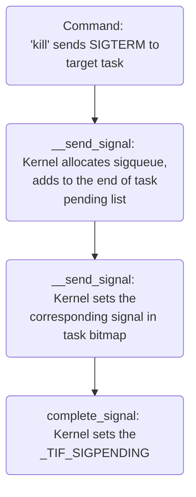
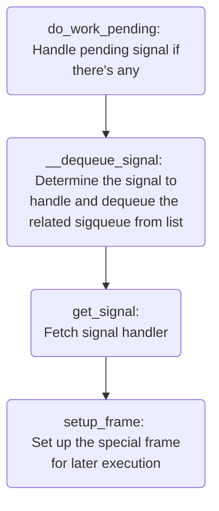

## Index

- [Signal](#signal)
- [Ptrace](#ptrace)
- [Strace](#strace)
- [Reference](#reference)

## <a name="signal"></a> Signal

1. Tasks can receive signals and handle them accordingly.
2. Signal handlers can be overwritten but SIGKILL is an exception, otherwise, tasks can opt to be indestructible!
3. More or less we had the experience of sending signals, e.g. exit running task on bash foreground by Ctrl+C, or use utility *kill* to end target process.
4. Utility *kill* is used to send specified signals to the target process, although most of the time it's SIGTERM or SIGKILL.



Every user space process enters kernel space on purpose or involuntarily (e.g. by interrupt), and pending signals are checked before tasks return to user space. 
If \_TIF_SIGPENDING is set, kernel delivers the signal to the task by:
1. Determine the next signal to handle and it's not guaranteed to correspond to the first sigqueue in the list.
2. Clear that signal in task bitmap and remove related sigqueue from the list accordingly. 
3. (Assume that signal has a decent signal handler) Fetch that handler info and prepare signal frame on user space stack. 
4. Once the flow switches back to user space, it starts from the special frame to run handler and returns to the original process flow(?)



- Signals on ARM
   - arch/arm/include/uapi/asm/signal.h
   
| Name      | Number | Note 1                   | Note 2 |
| ---       | ---    | ---                      | ---    |
| SIGHUP    | 1      | hangup                   |        |
| SIGINT    | 2      | interrupt                |        |
| SIGQUIT   | 3      | quit                     |        |
| SIGILL    | 4      | illegal                  |        |
| SIGTRAP   | 5      | trap                     |        |
| SIGABRT   | 6      | abort                    |        |
| SIGIOT    | 6      | input/output trap        |        |
| SIGBUS    | 7      | bus error                |        |
| SIGFPE    | 8      | floating point exception |        |
| SIGKILL   | 9      | kill                     |        |
| SIGUSR1   | 10     | user-defined conditions  |        |
| SIGSEGV   | 11     | segmentation violation   |        |
| SIGUSR2   | 12     | user-defined conditions  |        |
| SIGPIPE   | 13     | pipe                     |        |
| SIGALRM   | 14     | alarm                    |        |
| SIGTERM   | 15     | termination              |        |
| SIGSTKFLT | 16     | stack fault              |        |
| SIGCHLD   | 17     | child                    |        |
| SIGCONT   | 18     | continue                 |        |
| SIGSTOP   | 19     | stop                     |        |
| SIGTSTP   | 20     | terminal stop            |        |
| SIGTTIN   | 21     | tty in                   |        |
| SIGTTOU   | 22     | tty out                  |        |
| SIGURG    | 23     | urgent                   |        |
| SIGXCPU   | 24     | exceeds CPU              |        |
| SIGXFSZ   | 25     | exceeds file size        |        |
| SIGVTALRM | 26     | virtual alarm            |        |
| SIGPROF   | 27     | profiling                |        |
| SIGWINCH  | 28     | window change            |        |
| SIGIO     | 29     | input/output             |        |
| SIGPOLL   | SIGIO  | poll                     |        |
| SIGPWR    | 30     | power failure            |        |
| SIGSYS    | 31     | syscall                  |        |
| SIGUNUSED | 31     | unused                   |        |

## <a name="ptrace"></a> Ptrace

(TBD)

## <a name="strace"></a> Strace

Utility *strace* is a user space tool that can be used to trace the issued syscall sequence of target process. 
Below log is the trace output of the classic 'Hello, World!' test program and we can observe that lots of unrelated syscalls happen before printing our greetings. 
Every forked task starts from the dynamic linker, e.g. /lib/ld-linux.so.3, which follows the naming convention of the shared library but is actually an executable. 
It's responsible to load specified libraries into memory for the main task to use later, and that explains the list of unrelated syscalls in the log. 

Common used options:
```
strace -p -f -o log.txt running_task
-p: attach to target task
-f: trace the forked or cloned tasks as well
-o: save output to specified file
```

Log:
```
execve("./a.out", ["./a.out"], [/* 15 vars */]) = 0
└─ Triggered by parent process, e.g. bash

brk(NULL)                               = 0xd76000
mmap2(NULL, 8192, PROT_READ|PROT_WRITE, MAP_PRIVATE|MAP_ANONYMOUS, -1, 0) = 0x76f94000
access("/etc/ld.so.preload", R_OK)      = -1 ENOENT (No such file or directory)
openat(AT_FDCWD, "/etc/ld.so.cache", O_RDONLY|O_LARGEFILE|O_CLOEXEC) = 3
syscall_397(0x3, 0x76f7e44c, 0x1800, 0x7ff, 0x7eee4008, 0x7eee4120) = 0
mmap2(NULL, 6720, PROT_READ, MAP_PRIVATE, 3, 0) = 0x76f8c000
close(3)                                = 0
└─ Load /etc/ld.so.cache into memory

openat(AT_FDCWD, "/lib/tls/v6l/vfp/libc.so.6", O_RDONLY|O_LARGEFILE|O_CLOEXEC) = -1 ENOENT (No such file or directory)
syscall_397(0xffffff9c, 0x7eee4150, 0x800, 0x7ff, 0x7eee3fb0, 0x7eee40c8) = -1 (errno 2)
openat(AT_FDCWD, "/lib/tls/v6l/libc.so.6", O_RDONLY|O_LARGEFILE|O_CLOEXEC) = -1 ENOENT (No such file or directory)
syscall_397(0xffffff9c, 0x7eee4150, 0x800, 0x7ff, 0x7eee3fb0, 0x7eee40c8) = -1 (errno 2)
openat(AT_FDCWD, "/lib/tls/vfp/libc.so.6", O_RDONLY|O_LARGEFILE|O_CLOEXEC) = -1 ENOENT (No such file or directory)
syscall_397(0xffffff9c, 0x7eee4150, 0x800, 0x7ff, 0x7eee3fb0, 0x7eee40c8) = -1 (errno 2)
openat(AT_FDCWD, "/lib/tls/libc.so.6", O_RDONLY|O_LARGEFILE|O_CLOEXEC) = -1 ENOENT (No such file or directory)
syscall_397(0xffffff9c, 0x7eee4150, 0x800, 0x7ff, 0x7eee3fb0, 0x7eee40c8) = -1 (errno 2)
openat(AT_FDCWD, "/lib/v6l/vfp/libc.so.6", O_RDONLY|O_LARGEFILE|O_CLOEXEC) = -1 ENOENT (No such file or directory)
syscall_397(0xffffff9c, 0x7eee4150, 0x800, 0x7ff, 0x7eee3fb0, 0x7eee40c8) = -1 (errno 2)
openat(AT_FDCWD, "/lib/v6l/libc.so.6", O_RDONLY|O_LARGEFILE|O_CLOEXEC) = -1 ENOENT (No such file or directory)
syscall_397(0xffffff9c, 0x7eee4150, 0x800, 0x7ff, 0x7eee3fb0, 0x7eee40c8) = -1 (errno 2)
openat(AT_FDCWD, "/lib/vfp/libc.so.6", O_RDONLY|O_LARGEFILE|O_CLOEXEC) = -1 ENOENT (No such file or directory)
syscall_397(0xffffff9c, 0x7eee4150, 0x800, 0x7ff, 0x7eee3fb0, 0x7eee40c8) = -1 (errno 2)
└─ Don't care

openat(AT_FDCWD, "/lib/libc.so.6", O_RDONLY|O_LARGEFILE|O_CLOEXEC) = 3
read(3, "\177ELF\1\1\1\0\0\0\0\0\0\0\0\0\3\0(\0\1\0\0\0000\264\1\0004\0\0\0"..., 512) = 512
syscall_397(0x3, 0x76f7e44c, 0x1800, 0x7ff, 0x7eee3fa0, 0x7eee40b8) = 0
mmap2(NULL, 1361392, PROT_READ|PROT_EXEC, MAP_PRIVATE|MAP_DENYWRITE, 3, 0) = 0x76e0c000
mprotect(0x76f3f000, 61440, PROT_NONE)  = 0
mmap2(0x76f4e000, 16384, PROT_READ|PROT_WRITE, MAP_PRIVATE|MAP_FIXED|MAP_DENYWRITE, 3, 0x132000) = 0x76f4e000
mmap2(0x76f52000, 26096, PROT_READ|PROT_WRITE, MAP_PRIVATE|MAP_FIXED|MAP_ANONYMOUS, -1, 0) = 0x76f52000
close(3)  = 0
└─ Load /lib/libc.so.6 into memory

set_tls(0x76f94d30, 0x76f954a8, 0x76f95428, 0x76f94d30, 0x76f92010) = 0
mprotect(0x76f4e000, 8192, PROT_READ)   = 0
mprotect(0x20000, 4096, PROT_READ)      = 0
mprotect(0x76f91000, 4096, PROT_READ)   = 0
└─ Change some mappings to be read-only

munmap(0x76f8c000, 6720)                = 0
└─ Unload /etc/ld.so.cache from memory

syscall_397(0x1, 0x76f390dc, 0x1800, 0x7ff, 0x7eee4a18, 0x7eee4b30) = 0
ioctl(1, TCGETS, {B115200 opost isig icanon echo ...}) = 0
brk(NULL)                               = 0xd76000
brk(0xd97000)                           = 0xd97000
└─ Prepare heap (even I didn't call malloc)

write(1, "Hello, World!\n", 14)         = 14
└─ Finally!

exit_group(0)                           = ?
+++ exited with 0 +++
```

## <a name="reference"></a> Reference

- [G. Price, Strace -- The Sysadmin's Microscope](https://blogs.oracle.com/linux/post/strace-the-sysadmins-microscope)
- [N. Elhage, Write yourself an strace in 70 lines of code](https://blog.nelhage.com/2010/08/write-yourself-an-strace-in-70-lines-of-code/)
- [C. Costa, Using C to inspect Linux syscalls](https://ops.tips/gists/using-c-to-inspect-linux-syscalls/)


