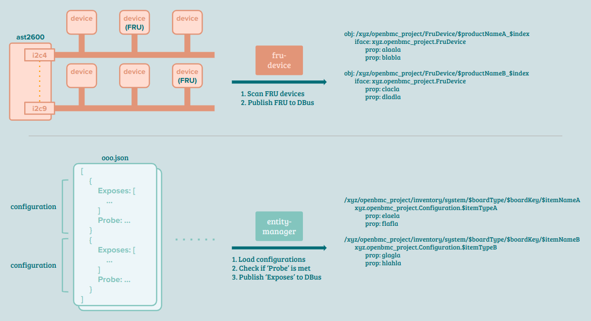

## Index

- [Introduction](#introduction)
- [Cheat Sheet](#cheat-sheet)
- [Reference](#reference)

## <a name="introduction"></a> Introduction

In the context of physically detachable devices, such as backplanes, power supply units (PSUs), and PCIe cards, these devices are referred to as "entities." 
One of the challenges with entities, specifically PCIe cards, is that they can be plugged into any available slot, requiring dynamic detection and identification.

To identify the installed devices, the system relies on the presence of a Field Replaceable Unit (FRU) that contains relevant information. 
Detecting the presence of an FRU indicates the existence of an entity in the system. 
This detection process is handled by a daemon called "fru-device," despite not being an actual device itself. 
The scanning process begins in the "/dev/" folder, where various I2C files are located.

The "fru-device" daemon communicates with potential slave devices through the I2C interface, attempting to read data from each device. 
If successful, it performs parsing of the FRU format to extract relevant information. 
Valid devices are then published to the D-Bus, a message bus system, allowing other components of the system to access and utilize this device information.

```
service: "xyz.openbmc_project.FruDevice"

    obj: "/xyz/openbmc_project/FruDevice"
        iface: "xyz.openbmc_project.FruDeviceManager"
            method: "ReScan"     <-- Scan all I2C buses and install D-Bus objects for detected FRU devices.
            method: "ReScanBus"  <-- Scan the specified I2C bus and install D-Bus objects for identified FRU devices.
            method: "GetRawFru"  <-- Retrieve FRU data from the device on bus $bus and address $addr.
            method: "WriteFru"   <-- Write FRU data to the device on bus $bus and address $addr.

    obj: "/xyz/openbmc_project/FruDevice/$bus_$address"        -+
        iface: "xyz.openbmc_project.Inventory.Item.I2CDevice"   | * (number of discovered I2C devices)
            prop: "Bus"                                         |
            prop: "Address"                                    -+

    obj: /xyz/openbmc_project/FruDevice/$productName_$index    -+
        iface: "xyz.openbmc_project.FruDevice"                  |
            prop: $key0                                         |
            prop: $key1                                         | * (number of identified FRUs)
            ...                                                 |
            prop: "Bus"                                         |
            prop: "Address"                                    -+


callback of match rule
    service: "xyz.openbmc_project.State.Host"
        obj: "/xyz/openbmc_project/state/host0"
            iface: "org.freedesktop.DBus.Properties"

inotify watch
    "/dev"
```

<details><summary> More Details </summary>

```
from dbus perspective
  
fru_device.cpp
+------+
| main |
+-|----+
  |
  |--> set up service: xyz.openbmc_project.FruDevice
  |
  |--> set up object: /xyz/openbmc_project/FruDevice
  |
  |    +--------------+
  +--> | rescanBusses |
       +-|------------+
         |    +------------------------------+
         |--> | FindDevicesWithCallback::run |
         |    +-|----------------------------+
         |      |    +----------------+
         |      +--> | findI2CDevices |
         |           +-|--------------+
         |             |
         |             +--> for each bus
         |             |
         |             |        +------------+
         |             +------> | getBusFRUs |
         |                      +-|----------+
         |                        |
         |                        +--> for each addr in specified range
         |                        |
         |                        |        +--------------------+
         |                        +------> | makeProbeInterface | set up object: /xyz/openbmc_project/FruDevice/$bus_$addr
         |                                 +--------------------+
         |    +---------------------------------------------------+
         +--> | FindDevicesWithCallback::~FindDevicesWithCallback |
              +-|-------------------------------------------------+
                |
                +--> for each bus
                |
                +------> for each device
                |
                |            +--------------------+
                +----------> | addFruObjectToDbus | set up object: /xyz/openbmc_project/FruDevice/$product_name
                             +--------------------+                                                             
                                                                                                                  
                                                                                                                  
  +----- main                                                                                                     
  |+---- property change (interface: xyz.openbmc_project.State.Host)                                              
  ||+--- inotify (/dev)                                                                                           
  |||+-- method call                                                                                              
  ||||                                                                                                            
+-vvvv---------+                                                                                                  
| rescanBusses |                                                                                                  
+--------------+                                                                                                  
```

```
fru_device.cpp
+------+
| main |
+-|----+
  |    +-----------+
  |--> | findFiles | find matched file path (i2c devices) and add to arg list
  |    +-----------+
  |    +---------------+
  |--> | loadBlacklist | (skip)
  |    +---------------+
  |
  |--> ->request_name   service "xyz.openbmc_project.FruDevice"
  |
  |--> .add_interface   add interface "xyz.openbmc_project.FruDeviceManager" to obj "/xyz/openbmc_project/FruDevice"
  |
  |--> ->register_method() for 'rescan'
  |      +----------------------------------------------------------+
  |      |+--------------+                                          |
  |      || rescanBusses | scan i2c busses and register fru to dbus |
  |      |+--------------+                                          |
  |      +----------------------------------------------------------+
  |
  |--> ->register_method() * n, for 'rescan bus', 'get raw fru', 'write fru'
  |
  |-->  prepare event handler
  |        +--------------------------+
  |        |rescan busses if power on |
  |        +--------------------------+
  |
  |-->  register the handler to dbus?
  |
  |-->  prepare monitor for new i2c dev
  |        +----------------+
  |        |+--------------+|
  |        || rescanOneBus ||
  |        |+--------------+|
  |        +----------------+
  |
  |--> register the monitor callback?
  |
  |    +--------------+
  |--> | rescanBusses | scan i2c busses and register fru to dbus
  |    +--------------+
  +--> io.run()
```

```
+-----------+                                             
| findFiles | : find matched file path and add to arg list
+--|--------+                                             
   |                                                      
   |--> for each dir in arg                               
   |                                                      
   |------> for each file in dir                          
   |                                                      
   |----------> if match, add file path to local map      
   |                                                      
   |--> for each (key, value) in map                      
   |                                                      
   +------> add to arg 'found paths'                      
```

```
+--------------+
| rescanBusses | : scan i2c busses and register fru to dbus
+---|----------+
    |
    |--> set 1-second expirationfor the timer
    |
    |    +-------------+
    +--> | .async_wait |
         +-------------+
             +-------------------------------------------------------------------------------------------+
             |+-------------------+                                                                      |
             || getI2cDevicePaths | iterate target dir and add (bus, path) of i2c file to arg 'bus paths'|
             |+-------------------+                                                                      |
             |                                                                                           |
             |for each path in 'bus paths': add to local 'i2c buses'                                     |
             |                                                                                           |
             |clear global 'found devices'                                                               |
             |                                                                                           |
             |prepare 'find devices with callback'                                                       |
             |   +--------------------------------------------------------------+                        |
             |   |+------------------+                                          |                        |
             |   || readBaseboardFRU | read in "/etc/fru/baseboard.fru.bin"     |                        |
             |   |+------------------+                                          |                        |
             |   |                                                              |                        |
             |   |for each device map in bus map                                |                        |
             |   |                                                              |                        |
             |   +--> for each device in device map                             |                        |
             |   |                                                              |                        |
             |   |        +--------------------+                                |                        |
             |   +------> | addFruObjectToDbus | register fru properties to dbus|                        |
             |   |        +--------------------+                                |                        |
             |   +--------------------------------------------------------------+                        |
             |                                                                                           |
             |->run(), it calls findI2CDevices()                                                           |
             +-------------------------------------------------------------------------------------------+
```

```
+-------------------+                                                                        
| getI2cDevicePaths | : iterate target dir and add (bus, path) of i2c file to arg 'bus paths'
+----|--------------+                                                                        
     |                                                                                       
     |--> for each entry under arg 'dir path'                                                
     |                                                                                       
     |------> if it's a i2c device                                                           
     |                                                                                       
     +----------> add the (bus, path) to arg 'bus paths'                                     
```

```
+------------------+                                          
| readBaseboardFRU | : read in "/etc/fru/baseboard.fru.bin"   
+----|-------------+                                          
     |                                                        
     |--> have an ifstream of "/etc/fru/baseboard.fru.bin"    
     |                                                        
     |--> prepare baseboardFRUFile (can't find its definition)
     |                                                        
     |--> if it's good (what's good?)                         
     |                                                        
     +------> read data to baseboardFRUFile                   
```

```
+--------------------+                                                                    
| addFruObjectToDbus | : register fru properties to dbus                                  
+----|---------------+                                                                    
     |    +---------------+                                                               
     |--> | formatIPMIFRU | given fru, format (key, value) pairs and save in arg 'result' 
     |    +---------------+                                                               
     |                                                                                    
     |--> decide 'product name'                                                           
     |                                                                                    
     |--> for each bus-map in dbus-interface-map                                          
     |                                                                                    
     |------> if it's a mux                                                               
     |                                                                                    
     |----------> return if the device is already added                                   
     |                                                                                    
     |------> found = true, continue to see if there's higher match                       
     |                                                                                    
     |--> if found                                                                        
     |                                                                                    
     |------> add suffix to 'product name'                                                
     |                                                                                    
     |--> map[(bus, addr)] = interface                                                    
     |                                                                                    
     |--> for each property in formatted-fru                                              
     |                                                                                    
     |------> if it's 'asset tag'                                                         
     |                                                                                    
     |----------> call ->register_property()
     |                                                                                    
     |                +------------------------------------------------------------------+
     |                |+-------------------+                                             |
     |                || updateFRUProperty | update fru property, write back to somewhere|
     |                |+-------------------+                                             |
     |                +------------------------------------------------------------------+
     |                                                                    
     |--> ->register_property (bus)                                                       
     |                                                                                    
     +--> ->register_property (addr)                                                      
```

```
+---------------+                                                                
| formatIPMIFRU | : given fru, format (key, value) pairs and save in arg 'result'
+---|-----------+                                                                
    |                                                                            
    |--> for each fru area                                                       
    |                                                                            
    |        +--------------+                                                    
    |------> | verifyOffset | (skip)                                             
    |        +--------------+                                                    
    |                                                                            
    |------> switch area                                                         
    |                                                                            
    |------> case chassis                                                        
    |                                                                            
    |----------> set result["CHASSIS_TYPE"]                                      
    |                                                                            
    |----------> use 'chassisFruAreas' for field names                           
    |                                                                            
    |------> case board                                                          
    |                                                                            
    |----------> set result["BOARD_LANGUAGE_CODE"]                               
    |                                                                            
    |----------> set result["BOARD_MANUFACTURE_DATE"]                            
    |                                                                            
    |------> case product                                                        
    |                                                                            
    |----------> set result["PRODUCT_LANGUAGE_CODE"]                             
    |                                                                            
    |------> while decode state is ok                                            
    |                                                                            
    |            +---------------+                                               
    |----------> | decodeFRUData | given type, decode fru data into string       
    |            +---------------+                                               
    |                                                                            
    |----------> decide 'name'                                                   
    |                                                                            
    +----------> set result[name]                                                
```

```
+---------------+                                          
| decodeFRUData | : given type, decode fru data into string
+---|-----------+                                          
    |                                                      
    |--> if iter reaches the end                           
    |                                                      
    |------> return pair(decode_state, string)             
    |                                                      
    |--> decode type and length                            
    |                                                      
    |--> switch type                                       
    |                                                      
    |--> case binary                                       
    |                                                      
    |------> prepare string   
    |
    |--> case language dependent
    |                                                      
    |------> shift iter
    |                                                      
    |--> case bcd plus                                     
    |                                                      
    |------> prepare string                                
    |                                                      
    |--> case six bit ascii                                
    |                                                      
    +------> prepare string                                
```

```
+-------------------+                                                                                      
| updateFRUProperty | : update fru property, write back to somewhere                                       
+----|--------------+                                                                                      
     |    +------------+                                                                                   
     |--> | getFRUInfo | given (bus, addr), get fru info from map                                          
     |    +------------+                                                                                   
     |                                                                                    
     |--> write len and data of requested property                                                         
     |                                                         ENABLE_FRU_AREA_RESIZE isn't defined        
     |--> copy remaining data to main fru area                                                             
     |                                                                                                     
     |    +-----------------------------+                                                                  
     |--> | updateFRUAreaLenAndChecksum | update the final area len and csum                               
     |    +-----------------------------+                                                                  
     |    +----------+                                                                                     
     |--> | writeFRU | given (bus, addr), write fru data accordingly                                       
     |    +----------+                                                                                     
     |    +--------------+                                                                                 
     +--> | rescanBusses | recursive?                                                                      
          +--------------+                                                                                 
```

```
+----------+                                                                      
| writeFRU |  : given (bus, addr), write fru data accordingly                     
+--|-------+                                                                      
   |    +---------------+                                                             
   |--> | formatIPMIFRU | verify if fru format is valid by parsing it
   |    +---------------+                                                             
   |                                                                              
   |--> if bus is 0 && addr is 0 (baseboard fru)                                  
   |                                                                              
   |------> write data to "/etc/fru/baseboard.fru.bin"                      
   |                                                                              
   +------> return                                                                
   |                                                                              
   |--> if that (bus, addr) has a eeprom                                          
   |                                                                              
   |------> write fru to it                                                       
   |                                                                              
   +------> return                                                                
   |                                                                              
   |    +-------+                                                                 
   |--> | ioctl | set slave                                                       
   |    +-------+                                                                 
   |                                                                              
   |--> while the write hans't completed yet                                      
   |                                                                              
   |        +-------+                                                             
   |------> | ioctl | set slave                                                   
   |        +-------+                                                             
   |        +---------------------------+                                         
   +------> | i2c_smbus_write_byte_data | write data to slave through i2c protocol
            +---------------------------+                                         
```

```
+----------------+                                                                
| findI2CDevices | : given bus range and addr range, try read fru from each slave 
+---|------------+                                                                
    |                                                                             
    |--> for each bus in arg 'buses'                                              
    |                                                                             
    |        +------------+                                                       
    |------> | getRootBus | get root adapter                                      
    |        +------------+                                                       
    |                                                                             
    |------> continue if the root bus is in blacklist                             
    |                                                                             
    |        +------------+                                                       
    +------> | getBusFRUs | given bus and addr range, try read fru from each slave
             +------------+                                                       
```

```
+------------+                                                                
| getBusFRUs | : given bus and addr range, try read fru from each slave       
+--|---------+                                                                
   |                                                                          
   |--> prepare function 'future'                                             
   |       +-----------------------------------------------------------------+
   |       |+----------------+                                               |
   |       || findI2CEeproms | （skip)                                        |
   |       |+----------------+                                               |
   |       |                                                                 |
   |       |for each slave in range [first, last]                            |
   |       |                                                                 |
   |       |    +-------+                                                    |
   |       +--> | ioctl | set slave                                          |
   |       |    +-------+                                                    |
   |       |    +---------------------+                                      |
   |       +--> | i2c_smbus_read_byte | probe                                |
   |       |    +---------------------+                                      |
   |       |    +--------------------+                                       |
   |       +--> | makeProbeInterface | for (bus, addr), add interface to dbus|
   |       |    +--------------------+                                       |
   |       |    +-----------------+                                          |
   |       +--> | readFRUContents | read fru contents                        |
   |       |    +-----------------+                                          |
   |       +-----------------------------------------------------------------+
   |                                                                          
   +--> fugure.get()                                                          
```

```
+-----------------+                                          
| readFRUContents | : read fru contents                      
+----|------------+                                          
     |                                                       
     |--> return if we fail to find the fru header           
     |                                                       
     +--> for each fru area                                  
     |                                                       
     +------> read data, e.g., through i2c protocol          
     |                                                       
     |--> if the fru has multi records                       
     |                                                       
     |------> read data, e.g., through i2c protocol          
     |                                                       
     +--> read the remaining data, e.g., through i2c protocol
```
  
</details>

The "entity-manager" daemon plays a crucial role in handling events related to entity addition and removal. 
It registers callbacks to respond to these events, particularly when FRU devices are added to the system. Once an event occurs, the daemon takes charge and reads configuration files located in "/usr/share/entity-manager/configurations/".

By comparing the FRU information available on the D-Bus with the specified "Probe" rules outlined in each configuration, such as product name and/or part number, the daemon determines if a supported entity is present. 
When a supported entity is found, the "entity-manager" adds corresponding "Exposes" attributes to the D-Bus hierarchy.

The "Exposes" attributes can be thought of as additional information associated with an entity. 
These attributes include details such as the entity's name, type, controller bus, and address. 
By exposing this information through the D-Bus hierarchy, other components and services in the system can access and utilize these attributes as needed.

```
# example from reference 'Entity Manager'

root@romulus:~# busctl tree xyz.openbmc_project.EntityManager
`-/xyz
  `-/xyz/openbmc_project
    |-/xyz/openbmc_project/EntityManager
    `-/xyz/openbmc_project/inventory
      `-/xyz/openbmc_project/inventory/system
        `-/xyz/openbmc_project/inventory/system/board
          |-/xyz/openbmc_project/inventory/system/board/18_Great_Card
          | |-/xyz/openbmc_project/inventory/system/board/18_Great_Card/18_great_local
          |-/xyz/openbmc_project/inventory/system/board/19_Great_Card
          | |-/xyz/openbmc_project/inventory/system/board/19_Great_Card/19_great_local
```

When entity information is in readiness, a suite of sensor daemons dedicates to reading sensor values and updating the record. 
From the `fru device` and `entity manager` to sensor daemons, they don't talk to each other; instead, the D-Bus mechanism has them work sequentially.

<details><summary> More Details </summary>
  
```
from dbus perspective
  
entity_manager.cpp
+------+                                                                                                                  
| main |                                                                                                                  
+-|----+                                                                                                                  
  |                                                                                                                       
  |--> set up service: xyz.openbmc_project.EntityManager                                                                  
  |                                                                                                                       
  |--> set up object: /xyz/openbmc_project/EntityManager                                                                  
  |                                                                                                                       
  |    +---------------------------+                                                                                      
  +--> | propertiesChangedCallback |                                                                                      
       +-|-------------------------+                                                                                      
         |    +------------------+                                                                                        
         |--> | PerformScan::run |                                                                                        
         |    +-|----------------+                                                                                        
         |      |    +-----------------+                                                                                  
         |      +--> | findDbusObjects | call service: xyz.openbmc_project.ObjectMapper                                   
         |           +-----------------+      object: /xyz/openbmc_project/object_mapper                                  
         |                                    interface: xyz.openbmc_project.ObjectMapper                                 
         |                                    method: GetSubTree                                                          
         |                                                                                                                
         |    +---------------------------+                                                                               
         +--> | PerformScan::~PerformScan |                                                                               
              +-|-------------------------+                                                                               
                |    +------------+                                                                                       
                +--> | postToDbus |                                                                                       
                     +-|----------+                                                                                       
                       |                                                                                                  
                       |--> for each board                                                                                
                       |                                                                                                  
                       |------> set up object: /xyz/openbmc_project/inventory/system/$board_type/$board_key               
                       |                                                                                                  
                       |------> for each item                                                                             
                       |                                                                                                  
                       +----------> set up object: /xyz/openbmc_project/inventory/system/$board_type/$board_key/$item_name
                                                                                                                          
                                                                                                                          
  +------- main                                                                                                           
  |+------ name owner changed                                                                                             
  ||+----- interface added                                                                                                
  |||+---- interface removed                                                                                              
  ||||+--- property changed                                                                                               
  |||||                                                                                                                   
+-vvvvv---------------------+                                                                                             
| propertiesChangedCallback |                                                                                             
+---------------------------+                                                                                             
```
  
```
entity_manager.cpp
+------+
| main |
+-|----+
  |
  |--> ->request_name("xyz.openbmc_project.EntityManager")
  |
  |--> .add_manager("/xyz/openbmc_project/inventory")
  |
  |--> .add_interface("/xyz/openbmc_project/EntityManager", "xyz.openbmc_project.EntityManager")
  |
  |--> prepare callback for 'name owner change match'
  |       +---------------------------------------------------------+
  |       |+---------------------------+                            |
  |       || propertiesChangedCallback | callback of property change|
  |       |+---------------------------+                            |
  |       +---------------------------------------------------------+
  |
  |--> do the same for 'interface added match', 'interfaces remove match'
  |
  |--> io.post()
  |
  |--> ->register_method('rescan')
  |       +---------------------------------------------------------+
  |       |+---------------------------+                            |
  |       || propertiesChangedCallback | callback of property change|
  |       |+---------------------------+                            |
  |       +---------------------------------------------------------+
  |
  |    +-----------------+
  |--> | setupPowerMatch |
  |    +-----------------+
  |
  +--> io.run()
```

```
+---------------------------+                                                           
| propertiesChangedCallback | : callback of property change                             
+------|--------------------+                                                           
       |                                                                                
       |--> set a timer expiring after 5 sec                                            
       |                                                                                
       +--> timer async wait                                                            
               +-----------------------------------------------------------------------+
               |if we receive a new request while handling an old one                  |
               |                                                                       |
               |    +---------------------------+                                      |
               |--> | propertiesChangedCallback | recursive                            |
               |    +---------------------------+                                      |
               |                                                                       |
               |--> return                                                             |
               |                                                                       |
               |in_progress = true                                                     |
               |                                                                       |
               |+-------------------+                                                  |
               ||loadConfigurations | for each found json: parse and add to arg 'config'
               |+-------------------+                                                  |
               |                                                                       |
               |prepare 'perform scan'                                                 |
               |   +------------------------------------------------------------------+|
               |   |for each (name, dev) in missing_config                            ||
               |   |                                                                  ||
               |   |    +--------------------+                                        ||
               |   |    | pruneConfiguration | release configuration                  ||
               |   |    +--------------------+                                        ||
               |   |+------------------------+                                        ||
               |   || deriveNewConfiguration | ensure new configuration has no old one||
               |   |+------------------------+                                        ||
               |   |+----------------+                                                ||
               |   || logDeviceAdded | add dev log                                    ||
               |   |+----------------+                                                ||
               |   |+---------+                                                       ||
               |   || io.post | publishNewConfiguration                               ||
               |   |+---------+                                                       ||
               |   +------------------------------------------------------------------+|
               |                                                                       |
               |run the perf scan                                                      |
               +-----------------------------------------------------------------------+
```

```
+--------------------+                                                            
| loadConfigurations | : for each found json: parse and add to arg 'config'       
+----|---------------+                                                            
     |    +-----------+                                                           
     |--> | findFiles | find matched file path and add to arg list                
     |    +-----------+ PACKAGE_DIR="/usr/share/entity-manager/                   
     |                  SYSCONF_DIR="/etc/entity-manager/                         
     |                                                                            
     |--> for each json in 'found jsons'                                          
     |                                                                            
     |        +-----------------------+                                           
     |------> | nlohmann::json::parse |                                           
     |        +-----------------------+                                           
     |                                                                            
     |------> if parsed result is an array                                        
     |                                                                            
     |----------> add each element to arg 'config' separately                     
     |                                                                            
     |------> else                                                                
     |                                                                            
     +----------> add result to arg 'config'                                      
```

```
+--------------------+                                                          
| pruneConfiguration | : release configuration                                  
+----|---------------+                                                          
     |    +-----------------------+                                             
     |--> | deviceRequiresPowerOn | check if dev needs power on or post complete
     |    +-----------------------+                                             
     |                                                                          
     |--> return if it's power off && dev needs power on                        
     |                                                                          
     |    +---------------------+                                               
     |--> | getDeviceInterfaces | get device interfaces                         
     |    +---------------------+                                               
     |                                                                          
     |--> for each interface                                                    
     |                                                                          
     |------> remove interface from obj server if share ptr exists (?)          
     |                                                                          
     |    +---------------------------+                                         
     |--> | systemConfiguration.erase | ???                                     
     |    +---------------------------+                                         
     |    +------------------+                                                  
     +--> | logDeviceRemoved | remove dev log                                   
          +------------------+                                                  
```
  
```
+------------------+                                   
| logDeviceRemoved | : remove dev log                  
+----|-------------+                                   
     |    +------------------+                         
     |--> | deviceHasLogging | check if dev has logging
     |    +------------------+                         
     |                                                 
     |--> return if not                                
     |                                                 
     |--> find 'type' and 'asset' from record          
     |                                                 
     |--> find 'model' and 'serial number'             
     |                                                 
     |    +----------------+                           
     +--> | sd_jounal_send |                           
          +----------------+                           
```
  
```
+-------------------------+                                                                                          
| publishNewConfiguration | : export device, write current configs to /var/configuration/, post board exposes to dbus
+------|------------------+                                                                                          
       |    +--------------+                                                                                         
       |--> | loadOverlays | for each found entity: for each config in exposes: export device to specified bus path  
       |    +--------------+                                                                                         
       |                                                                                                             
       |--> io.post                                                                                                  
       |       +------------------------------------------------------------------------+                            
       |       |+----------------+                                                      |                            
       |       || writeJsonFiles | write system configurations to "/var/configuration/" |                            
       |       |+----------------+                                                      |                            
       |       +------------------------------------------------------------------------+                            
       |                                                                                                             
       +--> io.post                                                                                                  
               +-----------------------------------------------------------+                                         
               |+------------+                                             |                                         
               || postToDbus | post board related info and exposes to dbus |                                         
               |+------------+                                             |                                         
               +-----------------------------------------------------------+                                         
```
  
```
+--------------+                                                                                         
| loadOverlays | : for each found entity: for each config in exposes: export device to specified bus path
+---|----------+                                                                                         
    |                                                                                                    
    |--> create folder "/tmp/overlays"                                                                   
    |                                                                                                    
    |--> for each entity in system configurations                                                        
    |                                                                                                    
    |------> continue if we don't have valid 'Exposes'                                                   
    |                                                                                                    
    |------> for each config in 'Exposes' (one 'Exposes' can have multiple configs inside)               
    |                                                                                                    
    |----------> continue if we don't have valid 'Status' ('disabled' is invalid)                        
    |                                                                                                    
    |----------> continue if we don't have valid 'Type'                                                  
    |                                                                                                    
    |----------> locate 'Type' from devices::exportTemplates                                             
    |                                                                                                    
    |----------> if found                                                                                
    |                                                                                                    
    |                +--------------+                                                                    
    +--------------> | exportDevice | export device to specified bus path                                
                     +--------------+                                                                    
```
  
```
+--------------+                                                                                                                
| exportDevice | : export device to specified bus path                                                                          
+---|----------+                                                                                                                
    |                                                                                                                           
    |--> for each key in config                                                                                                 
    |                                                                                                                           
    |------> if key == 'Name'                                                                                                   
    |                                                                                                                           
    |----------> replace unwanted char with underline, e.g., space to underline                                                 
    |                                                                                                                           
    |------> if key == 'Bus'                                                                                                    
    |                                     const boost::container::flat_map<const char*, ExportTemplate, CmpStr>                 
    |----------> read value                   exportTemplates{                                                                  
    |                                             {{"EEPROM_24C01",    <--------------------------------------- type            
    |------> elif key == 'Address'                  ExportTemplate("24c01 $Address",    <---------------------- params          
    |                                                              "/sys/bus/i2c/devices/i2c-$Bus",    <------- bus path        
    |----------> read value                                        "new_device",    <-------------------------- add             
    |                                                              "delete_device",    <----------------------- remove          
    |------> elif key == 'ChannelNames'                            createsHWMon::noHWMonDir)},    <------------ has hwmon folder
    |                                                                                                                           
    |------> replace variable in exportTemplate to real value                                                                   
    |                                                                                                                           
    |        +-------------+                                                                                                    
    |------> | buildDevice | ensure the device file is created                                                                  
    |        +-------------+                                                                                                    
    |                                                                                                                           
    |------> if 'Type' ends with 'Mux'                                                                                          
    |                                                                                                                           
    |            +---------+                                                                                                    
    +----------> | linkMux | create channel link under "/dev/i2c-mux"                                                           
                 +---------+                                                                                                    
```
  
```
+-------------+                                                                               
| buildDevice | : ensure the device file is created                                           
+---|---------+                                                                               
    |    +-----------------+                                                                  
    |--> | deviceIsCreated | given bus and addr, prepare path and check if it's created or not
    |    +-----------------+                                                                  
    |                                                                                         
    |--> return if it's already created                                                       
    |                                                                                         
    |    +--------------+                                                                     
    +--> | createDevice | create device file and feed params                                  
         +--------------+                                                                     
```

```
+-----------------+                                                                    
| deviceIsCreated | : given bus and addr, prepare path and check if it's created or not
+----|------------+                                                                    
     |                                                                                 
     |--> return error if 'bus' or 'address' isn't specified                           
     |                                                                                 
     |    +---------------+                                                            
     |--> | deviceDirName | prepare name as %bus-$addr                                 
     |    +---------------+                                                            
     |                                                                                 
     |--> extend to absolute path (this is folder)                                     
     |                                                                                 
     |--> append '/hwmon' to path if specified                                         
     |                                                                                 
     +--> check if it's already there and return                                       
```

```
+------------+                                                                    
| postToDbus | : post board related info and exposes to dbus                      
+--|---------+                                                                    
   |                                                                              
   |--> for each (board id, board config) in new configurations                   
   |                                                                              
   |------> determine board type                                                  
   |                                                                              
   |------> create interfaces for board object                                    
   |                                                                              
   |        +-----------------------+                                             
   |------> | createAddObjectMethod | register method "AddObject"                 
   |        +-----------------------+                                             
   |        +---------------------------+                                         
   |------> | populateInterfaceFromJson | populate interface from json to dbus    
   |        +---------------------------+                                         
   |                                                                              
   |------> for (property name, property value) in board items                    
   |                                                                              
   |            +-----------------+                                               
   |----------> | createInterface |                                               
   |            +-----------------+                                               
   |            +---------------------------+                                     
   |----------> | populateInterfaceFromJson | populate interface from json to dbus
   |            +---------------------------+                                     
   |                                                                              
   |------> for each expose                                                       
   |                                                                              
   |----------> decide item type                                                  
   |                                                                              
   |----------> create interface and populate it                                  
   |                                                                              
   |----------> for (name, config) in item                                        
   |                                                                              
   +--------------> create interface and populate it                              
```
  
```
+-----------------------+                                                             
| createAddObjectMethod | : register method "AddObject"                               
+-----|-----------------+                                                             
      |                                                                               
      +--> register method "AddObject"                                                
              +----------------------------------------------------------------------+
              |find 'Name' and 'Type' from data                                      |
              |                                                                      |
              |for expose in exposes                                                 |
              |                                                                      |
              |    (name, type) shouldn't exist already                              |
              |                                                                      |
              |    given type, find target schema                                    |
              |                                                                      |
              |    append new data to found exposes                                  |
              |                                                                      |
              |    +-----------------+                                               |
              |    | createInterface |                                               |
              |    +-----------------+                                               |
              |    +---------------------------+                                     |
              |    | populateInterfaceFromJson | populate interface from json to dbus|
              |    +---------------------------+                                     |
              +----------------------------------------------------------------------+
```
  
```
+------------------+                                                              
| PerformScan::run | : parse configurations and generate dbus objects             
+----|-------------+                                                              
     |                                                                            
     |--> for each configuration                                                  
     |                                                                            
     |------> continue if we fail to find 'probe'                                 
     |                                                                            
     |------> continue if we fail to find 'name'                                  
     |                                                                            
     |------> 'probe name' = 'find name'                                          
     |                                                                            
     |------>  if 'probe name' is in object member 'passedProbes'                 
     |                                                                            
     |-----------> remove the current configuration from configurations           
     |                                                                            
     |-----------> continue                                                       
     |                                                                            
     |------> prepare 'probe command' from the give 'probe name'                  
     |                                                                            
     |        +---------------+                                                   
     |------> | findProbeType | return the found type                             
     |        +---------------+                                                   
     |                                                                            
     |------> continue if found                                                   
     |                                                                            
     |------> (reaching here means not found)                                     
     |                                                                            
     |------> have the interface pushed back to 'dbusProbeInterfaces'             
     |                                                                            
     |------> have the probe ptr pushed back to 'dbusProbePointers'               
     |                                                                            
     |    +-----------------+                                                     
     +--> | findDbusObjects | given interfaces, ensure all instances are in 'scan'
          +-----------------+                                                     
```

```
+---------------+                        
| findProbeType | : return the found type
+---|-----------+                        
    |                                    
    |--> for each type in 'probeTypes'   
    |                                    
    +------> return the found type       
```

```
+-----------------+                                                                               
| findDbusObjects | : given interfaces, ensure all instances are in 'scan'                        
+----|------------+                                                                               
     |                                                                                            
     |--> remove those already-obtained interfaces from arg                                       
     |                                                                                            
     +--> prepare method_call                                                                     
             +-----------------------------------------------------------------------------------+
             |+--------------------+                                                             |
             || processDbusObjects | ensure all instances under 'interface subtree' are in 'scan'|
             |+--------------------+                                                             |
             |for                                                                                |
             |service: xyz.openbmc_project.ObjectMapper                                          |
             |object: /xyz/openbmc_project/object_mapper                                         |
             |interface: xyz.openbmc_project.ObjectMapper                                        |
             +-----------------------------------------------------------------------------------+
```

```
+--------------------+                                                               
| processDbusObjects | : ensure all instances under 'interface subtree' are in 'scan'
+----|---------------+                                                               
     |                                                                               
     |--> for each (path, obj) in 'interface subtree'                                
     |                                                                               
     |        +------------------+                                                   
     |------> | registerCallback | ensure the (path, match) is in dbusMatches        
     |        +------------------+                                                   
     |                                                                               
     |------> for (bus, ifaces) in obj                                               
     |                                                                               
     |----------> for each iface                                                     
     |                                                                               
     |----------> if the iface doesn't start with 'org.freedesktop'                  
     |                                                                               
     |                +---------------+                                              
     +--------------> | getInterfaces | ensure arg instance is in 'scan'             
                      +---------------+                                              
```

```
+------------------+                                                    
| registerCallback | : ensure the (path, match) is in dbusMatches       
+----|-------------+                                                    
     |                                                                  
     |--> return if path is already in dbusMatches                      
     |                                                                  
     |--> prepare event handler                                         
     |       +---------------------------------------------------------+
     |       |+---------------------------+                            |
     |       || propertiesChangedCallback | callback of property change|
     |       |+---------------------------+                            |
     |       +---------------------------------------------------------+
     |                                                                  
     |--> prepare match = rule + handler                                
     |                                                                  
     +--> place match in dbusMatches                                    
```

```
+---------------+                                         
| getInterfaces | : ensure arg instance is in 'scan'      
+---|-----------+                                         
    |                                                     
    +--> prepare async method call                        
            +--------------------------------------------+
            |+----------------------------+              |
            ||probe_obj[path][iface] = arg|              |
            |+----------------------------+              |
            |for                                         |
            |service: bus name                           |
            |object: path                                |
            |interface: "org.freedesktop.DBus.Properties"|
            +--------------------------------------------+
```
  
</details>
  
<p align="center"></p>
  
## <a name="cheat-sheet"></a> Cheat Sheet

- Check found FRU devices.

```
busctl tree xyz.openbmc_project.FruDevice
```
  
- Check FRU inventory area information.
  
```
# example from reference '[IPMI] FRU Inventory Device Commands'
  
                       +--> fru dev id
                       |
                       +---
ipmitool raw 0x0a 0x10 0x00
 ff 00 00
 +- +- +-
 |  |  |
 |  |  +--> access type
 |  +-----> size_h
 +--------> size_l                 
```
  
- Read FRU data.
  
```
# example from reference '[IPMI] FRU Inventory Device Commands'
  
ipmitool raw 0x0a 0x11 0x00 0x00 0x00 0xff           
                       +--- +--- +--- +---           
                       |    |    |    |              
                       |    |    |    +--> count     
                       |    |    +-------> offset_h  
                       |    +------------> offset_l  
                       +-----------------> fru dev id
```
  
- Write FRU data.
  
```
# example from reference '[IPMI] FRU Inventory Device Commands'
  
ipmitool raw 0x0a 0x12 0x00 0x00 0x00 0x01 0x01 0x02 0x04 0x08 0x00 0x00 0xf0
                       +--- +--- +--- +--------------------------------------
                       |    |    |    |
                       |    |    |    +--> data
                       |    |    +-------> offset_h
                       |    +------------> offset_l
                       +-----------------> fru dev id
```
  
- Query FRU information from the object mapper.
  
```
busctl call --verbose \
   xyz.openbmc_project.ObjectMapper \
   /xyz/openbmc_project/object_mapper \
   xyz.openbmc_project.ObjectMapper \
   GetSubTree \
   sias \
   / \
   0 \
   1 \
   xyz.openbmc_project.FruDevice
```
  
- Check matched exposes.
  
```
busctl tree xyz.openbmc_project.EntityManager
```
  
- Get managed objects.
  
```
busctl call xyz.openbmc_project.EntityManager \
            / \
            org.freedesktop.DBus.ObjectManager \
            GetManagedObjects
```
  
## <a name="reference"></a> Reference

- [Entity Manager](https://github.com/openbmc/entity-manager)
- [[IPMI] FRU Inventory Device Commands](https://computercheese.blogspot.com/2013/05/ipmi-fru-commands.html)
