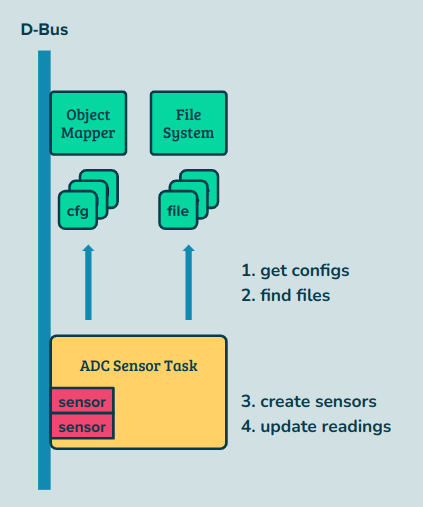

## Index

- [Introduction](#introduction)
- [Sensor Daemons](#sensor-daemons)
    - [ADC Sensor](#adcsensor)
    - [Intel CPU Sensor](#cpusensor)
    - [Exit Air Temp Sensor](#exitairtempsensor)
    - [External Sensor](#externalsensor)
    - [Fan Sensor](#fansensor)
    - [Hwmon Temp Sensor](#hwmontempsensor)
    - [Intrusion Sensor](#intrusionsensor)
    - [IPMB Sensor](#ipmbsensor)
    - [MCU Temp Sensor](#mcutempsensor)
    - [NVMe Sensor](#nvmesensor)
    - [PSU Sensor](#psusensor)
- [Cheat Sheet](#cheat-sheet)
- [Reference](#reference)

## <a name="introduction"></a> Introduction

(TBD)

## <a name="sensor-daemons"></a> Sensor Daemons

### <a name="adcsensor"></a> ADC Sensor

The ADC sensor task is a background daemon responsible for converting analog signals into digital values. It performs the following steps:

1. Requests the service `xyz.openbmc_project.ADCSensor` to establish communication.
2. Retrieves ADC descriptors from `xyz.openbmc_project.ObjectMapper` to obtain information about available ADC hardware.
3. Searches for existing ADC hardware located in the `/sys/class/hwmon/` directory.
4. Sets up an ADC sensor for each matched pair of (descriptor, component) found during the search.
5. Periodically reads values from the sensors and updates them to the D-Bus, ensuring the latest values are accessible to other components and services.

```
[service] xyz.openbmc_project.ADCSensor                                <-- main
    [obj] /xyz/openbmc_project/sensors                                 <-- main

    [obj] /xyz/openbmc_project/sensors/voltage/$name                   <-- ADCSensor
        [iface] xyz.openbmc_project.Sensor.Value                       <-- ADCSensor
            [prop] Unit                                                <-- Sensor
            [prop] MaxValue                                            <-- Sensor
            [prop] MinValue                                            <-- Sensor
            [prop] Value                                               <-- Sensor

        [iface] xyz.openbmc_project.Sensor.Threshold.Critical          <-- ADCSensor
            [prop] CriticalAlarmHigh                                   <-- Sensor
            [prop] CriticalAlarmLow                                    <-- Sensor
            [prop] CriticalHigh                                        <-- Sensor
            [prop] CriticalLow                                         <-- Sensor

        [iface] xyz.openbmc_project.Sensor.Threshold.Warning           <-- ADCSensor
            [prop] WarningAlarmHigh                                    <-- Sensor
            [prop] WarningAlarmLow                                     <-- Sensor
            [prop] WarningHigh                                         <-- Sensor
            [prop] WarningLow                                          <-- Sensor

        [iface] xyz.openbmc_project.Association.Definitions            <-- ADCSensor
            [prop] Associations                                        <-- Sensor

        [iface] xyz.openbmc_project.State.Decorator.Availability       <-- Sensor
            [prop] Available                                           <-- Sensor

        [iface] xyz.openbmc_project.State.Decorator.OperationalStatus  <-- Sensor
            [prop] Functional                                          <-- Sensor
```

<p align="center"></p>

<details><summary> More Details </summary>

```
from dbus perspective                                                                                  
                                                                                                        
+------+                                                                                                
| main |                                                                                                
+-|----+                                                                                                
  |                                                                                                     
  |--> request service: "xyz.openbmc_project.ADCSensor"                                                 
  |                                                                                                     
  |    +---------------+                                                                                
  +--> | createSensors |                                                                                
       +-|-------------+                                                                                
         |    +------------------------------------------+                                              
         |--> | GetSensorConfiguration::getConfiguration | arg = "xyz.openbmc_project.Configuration.ADC"
         |    +-|----------------------------------------+                                              
         |      |                                                                                       
         |      +--> call interface: "xyz.openbmc_project.ObjectMapper"                                 
         |                object: "/xyz/openbmc_project/object_mapper"                                  
         |                interface: "xyz.openbmc_project.ObjectMapper"                                 
         |                method: "GetSubTree"                                                          
         |                                                                                              
         |    +-------------------------------------------------+                                       
         +--> | GetSensorConfiguration::~GetSensorConfiguration |                                       
              +-|-----------------------------------------------+                                       
                |                                                                                       
                |--> for each candidate ("/sys/class/hwmon/hwmon*/in*_input")                           
                |                                                                                       
                +------> prepare ADCSensor                                                              
                         +----------------------+                                                       
                         | ADCSensor::ADCSensor |                                                       
                         +-|--------------------+                                                       
                           |                                                                            
                           +--> set up object: "/xyz/openbmc_project/sensors/voltage/" + name           
                                                                                                        
                                                                                                        
+---------------+                                                                                       
| createSensors | <---- main                                                                            
+---------------+ <---- property change (interface: "xyz.openbmc_project.Configuration.ADC")            
                  <---- property change (interface: "xyz.openbmc_project.Inventory.Item")


configuration:
"Index"
"Name"
"CPURequired"
"ScaleFactor"
"PollRate"
"PowerState"
"BridgeGpio"
    "Name"
    "Polarity"
    "SetupTime"
```

```
+------+                                              
| main | : register callbacks to create sensors       
+-|----+ ADCSensorMain.cpp                            
  |                                                   
  |--> prepare service "xyz.openbmc_project.ADCSensor"
  |                                                   
  |--> io.post                                        
  |       +---------------------------------+         
  |       |+---------------+                |         
  |       || createSensors | create sensors |         
  |       |+---------------+                |         
  |       +---------------------------------+         
  |                                                   
  |--> prepare event handler                          
  |       +------------------------------------------+
  |       |insert msg path to local 'sensor changed' |
  |       |                                          |
  |       |.async_wait                               |
  |       |   +---------------------------------+    |
  |       |   |+---------------+                |    |
  |       |   || createSensors | create sensors |    |
  |       |   |+---------------+                |    |
  |       |   +---------------------------------+    |
  |       +------------------------------------------+
  |                                                   
  |--> prepare cpu presence handler                   
  |       +------------------------------------------+
  |       |read msg to local 'values'                |
  |       |                                          |
  |       |if 'Presence' found in 'values'           |
  |       |                                          |
  |       |    add it to global 'cpuPresence'        |
  |       |                                          |
  |       |    .async_wait                           |
  |       |       +---------------------------------+|
  |       |       |+---------------+                ||
  |       |       || createSensors | create sensors ||
  |       |       |+---------------+                ||
  |       |       +---------------------------------+|
  |       +------------------------------------------+
  |                                                   
  |--> for each sensor types                          
  |                                                   
  |------> register the event handler                 
  |                                                   
  +--> register cpu presence handler                  
```

```
+---------------+                                                                                                           
| createSensors | : create sensors                                                                                          
+---|-----------+                                                                                                           
    |                                                                                                                       
    |--> prepare callback for 'sensor config getter'                                                                        
    |       +--------------------------------------------------------------------------------------------------------------+
    |       |check if "/sys/class/hwmon" has files (sensors)                                                               |
    |       |                                                                                                              |
    |       |for path of each adc sensor                                                                                   |
    |       |                                                                                                              |
    |       |--> continue if it's not "iio_hwmon"                                                                          |
    |       |                                                                                                              |
    |       |--> for sensor in configurations                                                                              |
    |       |                                                                                                              |
    |       |------> attempt to get sensor_data and iface_path of sensor                                                   |
    |       |                                                                                                              |
    |       |------> break if found                                                                                        |
    |       |                                                                                                              |
    |       |    +----------------------------+                                                                            |
    |       |--> | parseThresholdsFromConfig  | given sensor data, find pairs of (hysteresis, direction, severity, value), |
    |       |    +----------------------------+ and push bask to arg vector                                                |
    |       |                                                                                                              |
    |       |--> determine 'scale factor', 'poll rate'                                                                     |
    |       |                                                                                                              |
    |       |--> handle requirement of 'power state' and 'cpu' if specified                                                |
    |       |                                                                                                              |
    |       |--> handle gpio if needed                                                                                     |
    |       |                                                                                                              |
    |       |    +----------------------+                                                                                  |
    |       +--> | ADCSensor::setupRead | alloc buffer and handle response                                                 |
    |       |    +----------------------+                                                                                  |
    |       +--------------------------------------------------------------------------------------------------------------+
    |    +------------------------------------------+                                                                       
    +--> | GetSensorConfiguration::getConfiguration | get configuration path if it with matches any of the interfaces       
         +------------------------------------------+                                                                       
```

```
+---------------------------+
| parseThresholdsFromConfig | : given sensor data, find pairs of (hysteresis, direction, severity, value),
+------|--------------------+   and push bask to arg vector
       |
       |--> for (intf, cfg) in sensor data
       |
       |------> continue if can't find "Thresholds"
       |
       |------> ignore arg 'match label'
       |
       |------> ignore arg 'sensorr index'
       |
       |------> find "Hysteresis", "Direction", "Severity", "Value" and parse
       |
       +------> append to arg 'thresholdVector'                                                                                    
```

```
+----------------------+                                          
| ADCSensor::setupRead | : alloc buffer and handle response       
+-----|----------------+                                          
      |                                                           
      |--> alloc buffer                                           
      |                                                           
      |--> if it's the case of bridge gpio                        
      |                                                           
      |------> (skip)                                             
      |                                                           
      |--> else                                                   
      |                                                           
      +------> ::async_read_until                                 
                  +----------------------------------------------+
                  |+---------------------------+                 |
                  || ADCSensor::handleResponse | handle response |
                  |+---------------------------+                 |
                  +----------------------------------------------+
```

```
+---------------------------+                                              
| ADCSensor::handleResponse | : handle response                            
+------|--------------------+                                              
       |                                                                   
       |--> open file                                                      
       |                                                                   
       +--> .async_wait                                                    
               +----------------------------------------------------------+
               |+----------------------+                                  |
               || ADCSensor::setupRead | alloc buffer and handle response |
               |+----------------------+                                  |
               +----------------------------------------------------------+
```

```
+------------------------+
| GetSensorConfiguration |
|  --------------------  |
|    getPath()           |
|    getConfiguration()  |
|    dbusConnection      |
|    callback            |
|    respData            |
+------------------------+
```

```
+------------------------------------------+
| GetSensorConfiguration::getConfiguration | : get configuration path if it with matches any of the interfaces
+----------|-------------------------------+
           |
           |--> for each type, add to interface
           |
           |    +-----------------------------------+
           +--> | dbusConnection->async_method_call |
                +------------------------------------------+
                | for each (path, dict) in ret             |
                |                                          |
                |     for each interface in dict           |
                |                                          |
                |         find something in interface      |
                |                                          |
                |         continue if not found            |
                |                                          |
                |         +---------------+                |
                |         | self->getPath | get what path? |
                |         +---------------+                |
                +------------------------------------------+                                                     
```

```
+---------------------------------+                     
| GetSensorConfiguration::getPath | : get what path?    
+--------|------------------------+                     
         |                                              
         +--> ->async_method_call                       
                 +-----------------------------------+  
                 |->respData[path][iface] = arg data |  
                 +-----------------------------------+  
                 srv = owner                            
                 obj = path                             
                 ifc = "org.freedesktop.DBus.Properties"
                 mth = "GetAll"                         
```
                    
</details>

### <a name="cpusensor"></a> Intel CPU Sensor
  
The CPU sensor task is responsible for monitoring properties such as temperature, power, and energy of the CPU and DIMM. It performs the following steps:

1. Requests the service `xyz.openbmc_project.CPUSensor` to establish communication.
2. Retrieves XeonCPU descriptors from `xyz.openbmc_project.EntityManager` to obtain information about the available ADC hardware.
3. Locates existing XeonCPU hardware located in the `/sys/bus/peci/devices/` directory.
4. Sets up a sensor for each valid property (e.g., temperature, power, energy) of the CPU and DIMM.
5. Periodically reads values from the sensors and updates them to the D-Bus, ensuring the latest values are accessible to other components and services.

```
[service] xyz.openbmc_project.IntelCPUSensor                                 <-- main
    [obj] /xyz/openbmc_project/sensors                                       <-- main

    [obj] /xyz/openbmc_project/sensors/temperature/$name                     <-- IntelCPUSensor
    (or
    [obj] /xyz/openbmc_project/sensors/power/$name)

        [iface] xyz.openbmc_project.Sensor.Value                             <-- IntelCPUSensor
            [prop] Unit                                                      <-- Sensor
            [prop] MaxValue                                                  <-- Sensor
            [prop] MinValue                                                  <-- Sensor
            [prop] Value                                                     <-- Sensor

        [iface] xyz.openbmc_project.Sensor.Threshold.Critical                <-- IntelCPUSensor
            [prop] CriticalAlarmHigh                                         <-- Sensor
            [prop] CriticalAlarmLow                                          <-- Sensor
            [prop] CriticalHigh                                              <-- Sensor
            [prop] CriticalLow                                               <-- Sensor

        [iface] xyz.openbmc_project.Sensor.Threshold.Warning                 <-- IntelCPUSensor
            [prop] WarningAlarmHigh                                          <-- Sensor
            [prop] WarningAlarmLow                                           <-- Sensor
            [prop] WarningHigh                                               <-- Sensor
            [prop] WarningLow                                                <-- Sensor

        [iface] xyz.openbmc_project.Association.Definitions                  <-- IntelCPUSensor
            [prop] Associations                                              <-- Sensor

        [iface] xyz.openbmc_project.State.Decorator.Availability             <-- Sensor
            [prop] Available                                                 <-- Sensor

        [iface] xyz.openbmc_project.State.Decorator.OperationalStatus        <-- Sensor
            [prop] Functional                                                <-- Sensor

    [obj] /xyz/openbmc_project/inventory/system/chassis/motherboard/$name    <-- main
        [iface] xyz.openbmc_project.Inventory.Item                           <-- main
            [prop] PrettyName                                                <-- main
            [prop] Present                                                   <-- main
```
  
<details><summary> More Details </summary>  
  
```
from dbus perspective                                                                                                            
                                                                                                                                  
+------+                                                                                                                          
| main |                                                                                                                          
+-|----+                                                                                                                          
  |                                                                                                                               
  |--> request service: "xyz.openbmc_project.CPUSensor"                                                                           
  |                                                                                                                               
  |    +--------------+                                                                                                           
  |--> | getCpuConfig |                                                                                                           
  |    +-|------------+                                                                                                           
  |      |    +------------------------+                                                                                          
  |      +--> | getSensorConfiguration | arg = "XeonCPU"                                                                          
  |           +-|----------------------+                                                                                          
  |             |                                                                                                                 
  |             +--> call service: "xyz.openbmc_project.EntityManager"                                                            
  |                       object: "/"                                                                                             
  |                       interface: "org.freedesktop.DBus.ObjectManager"                                                         
  |                       method: "GetManagedObjects"                                                                             
  |    +-----------------+                             +-------------------+                                                      
  +--> | detectCpuAsync  |                             |+--------------+   | <--main                                              
       +-|---------------+                             || getCpuConfig |   | <--property change ("/xyz/openbmc_project/inventory")
         |    +-----------+                            |+--------------+   |                                                      
         +--> | detectCpu |                            |+-----------------+|                                                      
              +-|---------+                            || detectCpuAsync  ||                                                      
                |                                      |+-----------------+|                                                      
                |--> for each cpu_config               +-------------------+                                                      
                |                                                                                                                 
                |------> try get info from /dev/peci-*                                                                            
                |                                                                                                                 
                |------> if cpu is 'on' or 'ready'                                                                                
                |                                                                                                                 
                |            +---------------+                                                                                    
                |----------> | createSensors |---+                                                                                
                |            +---------------+   |                                                                                
                |                                |                                                                                
                |------> else (keep pinging)     |-->for each cpu_config                                                          
                |                                |                                                                                
                |            +----------------+  |------> object: "/xyz/openbmc_project/inventory/system/chassis/motherboard"+name 
                +----------> | detectCpuAsync |  |                                                                                
                             +----------------+  |-->for each file (/sys/bus/peci/devices/peci-*/*-*/peci-*/hwmon/hwmon*/name)    
                                                 |                                                                                
                                                 |------>for each (temp|power|energy)*_(input|average|cap) files                  
                                                 |                                                                                
                                                 +---------->prepare CPUSensor                                                    
                                                             +---------------------+                                              
                                                             | CPUSensor::CPUSensor|                                              
                                                             +-|-------------------+                                              
                                                               |                                                                  
                                                               +--> object: "/xyz/openbmc_project/sensors/power/" + name   
                                                                         or "/xyz/openbmc_project/sensors/energy/" + name   
                                                                         or "/xyz/openbmc_project/sensors/temperature/" + name   
```
  
```
+------+
| main | : create cpu sensors
+-|----+ CPUSensorMain.cpp
  |
  |--> .async_wait
  |
  |        +--------------+
  |------> | getCpuConfig | create sensors, read peci adapter name(s) from file to cpu_configs
  |        +--------------+
  |
  |------> if it gets nothing in the above func
  |
  |            +----------------+
  +----------> | detectCpuAsync | : try to get dimm temp and cpu id, create sensors
  |            +---|------------+
  |                |
  |                +--> timer.async_wait
  |                        +--------------------------------------------------------------+
  |                        |+-----------+                                                 |
  |                        || detectCpu | try to get dimm temp and cpu id, create sensors |
  |                        |+-----------+                                                 |
  |                        +--------------------------------------------------------------+
  |
  |--> prepare event handler
  |       +-----------------------------------------------------------------------------------------+
  |       |timer.async_wait                                                                         |
  |       |   +------------------------------------------------------------------------------------+|
  |       |   |+--------------+                                                                    ||
  |       |   || getCpuConfig | create sensors, read peci adapter name(s) from file to cpu_configs ||
  |       |   |+--------------+                                                                    ||
  |       |   |+----------------+                                                                  ||
  |       |   || detectCpuAsync | try to get dimm temp and cpu id, create sensors                  ||
  |       |   |+----------------+                                                                  ||
  |       |   +------------------------------------------------------------------------------------+|
  |       +-----------------------------------------------------------------------------------------+
  |
  |--> for each sensor type
  |
  |------> register the handler
  |
  |--> ->request_name("xyz.openbmc_project.CPUSensor")
  |
  |    +-----------------------------+
  |--> | setupManufacturingModeMatch | prepare handlers for manufacturing mode match
  |    +-----------------------------+
  |    +--------+
  +--> | io.run |
       +--------+
```

```
+--------------+                                                                                                    
| getCpuConfig | : create sensors, read peci adapter name(s) from file to cpu_configs                               
+---|----------+                                                                                                    
    |                                                                                                               
    |--> for each sensor types                                                                                      
    |                                                                                                               
    |        +------------------------+                                                                             
    |------> | getSensorConfiguration | update cache if needed, find type-matched one and add to arg                
    |        +------------------------+                                                                             
    |                                                                                                               
    |--> for each sensor types                                                                                      
    |                                                                                                               
    |------> for each sensor in config                                                                              
    |                                                                                                               
    |----------> for each base_conf in sensor                                                                       
    |                                                                                                               
    |--------------> handle 'Name' from base_conf                                                                   
    |                                                                                                               
    |--------------> check if cpu is present through gpio                                                           
    |                                                                                                               
    |--------------> if inventory iface && present                                                                  
    |                                                                                                               
    |------------------> .add_interface("xyz.openbmc_project.Inventory.Item")                                       
    |                                                                                                               
    |------------------> ->register_property("PrettyName")                                                          
    |                                                                                                               
    |------------------> ->register_property("Present")                                                             
    |                                                                                                               
    |------------------> move iface to inventoryIfaces[name]                                                        
    |                                                                                                               
    |------------------> if present                                                                                 
    |                                                                                                               
    |----------------------> under /sys/, find hwmon sensor name with 'input'                                       
    |                                                                                                               
    |                        +------------------+                                                                   
    |----------------------> | createSensorName |                                                                   
    |                        +------------------+                                                                   
    |                                                                                                               
    |----------------------> create a sensor and save it in 'gCpuSensors'                                           
    |                                                                                                               
    |----------------------> find (bus, addr) from config and save them to cpu_config                               
    |                                                                                                               
    |                        +--------------------------------+                                                     
    +----------------------> | addConfigsForOtherPeciAdapters | read peci adapter name from file, add to cpu_configs
    |                        +--------------------------------+                                                     
    |                                                                                                               
    |--> if we did parse something                                                                                  
    |                                                                                                               
    +------> print 'CPU config is parsed' or 'CPU configs are parsed'                                               
```

```
+------------------------+                                                               
| getSensorConfiguration | : update cache if needed, find type-matched one and add to arg
+-----|------------------+                                                               
      |                                                                                  
      |--> if not use cache                                                              
      |                                                                                  
      |------> ->new_method_call("GetManagedObjects")                                    
      |                                                                                  
      |------> ->call(arg is the output of the above func)                               
      |                                                                                  
      |------> read reply                                                                
      |                                                                                  
      |--> for each path_pair in managed_obj                                             
      |                                                                                  
      |------> find type-matched one                                                     
      |                                                                                  
      +------> if found, add to arg 'response' and break                                 
```

```
+--------------------------------+                                                       
| addConfigsForOtherPeciAdapters | : read peci adapter name from file, add to cpu_configs
+-------|------------------------+                                                       
        |    +-----------+                                                               
        |--> | findFiles | find files with name 'peci' (peci adapter)                    
        |    +-----------+                                                               
        |                                                                                
        |--> for each peci adapter                                                       
        |                                                                                
        |        +-----------------------------+                                         
        |------> | readPeciAdapterNameFromFile | read adapter name from file             
        |        +-----------------------------+                                         
        |                                                                                
        +------> add to cpu_configs                                                      
```

```
+-----------+                                                   
| detectCpu | : try to get dimm temp and cpu id, create sensors 
+-|---------+                                                   
  |                                                             
  |--> for each cpu config                                      
  |                                                             
  |------> continue if it's aleady 'ready'                      
  |                                                             
  |------> open peci dev file                                   
  |                                                             
  |------> ioctl(ping)                                          
  |                                                             
  |------> if normal                                            
  |                                                             
  |----------> get dimm temp and set state = 'ready'            
  |                                                             
  |------> else                                                 
  |                                                             
  |----------> set state = 'off'                                
  |                                                             
  |------> if state changes                                     
  |                                                             
  +----------> if it's 'off' to 'ready' or 'on'                 
  |                                                             
  |--------------> if old state is 'off'                        
  |                                                             
  |------------------> ioctl: get cpu id                        
  |                                                             
  +--------------> determine rescan delay                       
  |                                                             
  |----------> save new state in config                         
  |                                                             
  |--> if rescan_delay is set                                   
  |                                                             
  |------> timer.async_wait                                     
  |           +---------------------------------+               
  |           |+---------------+                |               
  |           || createSensors | create sensors |               
  |           |+---------------+                |               
  |           +---------------------------------+               
  |                                                             
  |--> if not yet all cpu are pinged                            
  |                                                             
  |        +----------------+                                   
  +------> | detectCpuAsync | recursive call                    
           +----------------+                                   
```

```
+-----------------------------+                                                          
| setupManufacturingModeMatch | : prepare handlers for manufacturing mode match          
+-------|---------------------+                                                          
        |                                                                                
        |--> special mode intf = "xyz.openbmc_project.Security.SpecialMode"              
        |                                                                                
        |--> prepare handler for special mode intf add                                   
        |    +------------------------------------------------------------------------+  
        |    | +--------+                                                             |  
        |    | | m.read | read msg into path and interfaces                           |  
        |    | +--------+                                                             |  
        |    | +---------------------+                                                |  
        |    | | interfaceAdded.find | find special mode intf from interfaces         |  
        |    | +---------------------+                                                |  
        |    | +-------------------+                                                  |  
        |    | | propertyList.find | find "SpecialMode" from property of interface    |  
        |    | +-------------------+                                                  |  
        |    | +-------------------------+                                            |  
        |    | | handleSpecialModeChange | determine 'manufacturingMode' (global var) |  
        |    | +-------------------------+                                            |  
        |    +------------------------------------------------------------------------+  
        |                                                                                
        |-->  prepare handler for mode change                                            
        |     +-------------------------------------------------------------------------+
        |     |+--------+                                                               |
        |     || m.read | read msg into interface and property                          |
        |     |+--------+                                                               |
        |     |+------------------------+                                               |
        |     || propertiesChanged.find | find "SpecialMode" from property of interface |
        |     |+------------------------+                                               |
        |     |+-------------------------+                                              |
        |     || handleSpecialModeChange | determine 'manufacturingMode' (global var)   |
        |     |+-------------------------+                                              |
        |     +-------------------------------------------------------------------------+
        |                                                                                
        +--> prepare handler for manufacturing mode                                      
             +-----------------------------------------------------------------------+   
             |+-------------------------+                                            |   
             || handleSpecialModeChange | determine 'manufacturingMode' (global var) |   
             |+-------------------------+                                            |   
             +-----------------------------------------------------------------------+   
```

</details>
  
## exitairtempsensor
### <a name="eexitairtempsensor"></a> Exit Air Temp Sensor

(TBD)
  
<details><summary> More Details </summary>  
  
```
ExitAirTempSensor.cpp                                                              
+------+                                                                            
| main | : create sensors and update sensor reading                                 
+-|----+                                                                            
  |                                                                                 
  |--> ->request_name("xyz.openbmc_project.ExitAirTempSensor")                      
  |                                                                                 
  |--> io.post                                                                      
  |                                                                                 
  |        +--------------+                                                         
  |------> | createSensor | create sensors                                          
  |        +--------------+                                                         
  |                                                                                 
  |--> prepare event handler                                                        
  |       +-------------------------------------+                                   
  |       |.async_wait                          |                                   
  |       |   +--------------------------------+|                                   
  |       |   |+--------------+                ||                                   
  |       |   || createSensor | create sensors ||                                   
  |       |   |+--------------+                ||                                   
  |       |   +--------------------------------+|                                   
  |       +-------------------------------------+                                   
  |                                                                                 
  |--> for each monitor interfaces                                                  
  |                                                                                 
  |------> prepare match rule and register the event handler                        
  |                                                                                 
  |    +-----------------------------+                                              
  +--> | setupManufacturingModeMatch | prepare handlers for manufacturing mode match
       +-----------------------------+                                              
```

```
+--------------+                                                                                                                 
| createSensor | : create sensors                                                                                                
+-|------------+                                                                                                                 
  |                                                                                                                              
  |--> prepare a GetSensorConfiguration with callback                                                                            
  |       +---------------------------------------------------------------------------------------------------------------------+
  |       |for each pair in response                                                                                            |
  |       |                                                                                                                     |
  |       |--> for each entry in the pair                                                                                       |
  |       |                                                                                                                     |
  |       +------> if the entry is a exit_air_iface                                                                             |
  |       |                                                                                                                     |
  |       |            +---------------------------+                                                                            |
  |       +----------> | parseThresholdsFromConfig | given sensor data, find pairs of (hysteresis, direction, severity, value), |
  |       |            +---------------------------+ and push bask to arg vector                                                |
  |       |                                                                                                                     |
  |       +----------> set up threshold                                                                                         |
  |       |                                                                                                                     |
  |       +------> elif it's a cfm_iface                                                                                        |
  |       |                                                                                                                     |
  |       |            +---------------------------+                                                                            |
  |       +----------> | parseThresholdsFromConfig | given sensor data, find pairs of (hysteresis, direction, severity, value), |
  |       |            +---------------------------+ and push bask to arg vector                                                |
  |       |                                                                                                                     |
  |       +----------> set up threshold                                                                                         |
  |       |                                                                                                                     |
  |       |if there's a exit_air_sensor                                                                                         |
  |       |                                                                                                                     |
  |       |    +-------------------------+                                                                                      |
  |       +--> | CFMSensor::setupMatches | set match rule and register callback to update sensor reading                        |
  |       |    +-------------------------+                                                                                      |
  |       |    +-------------------------+                                                                                      |
  |       +--> | CFMSensor::updateReading| update sensor reading (even it's nan)                                                |
  |       |    +-------------------------+                                                                                      |
  |       +---------------------------------------------------------------------------------------------------------------------+
  |    +------------------------------------------+                                                                              
  +--> | GetSensorConfiguration::getConfiguration | get configuration path if it with matches any of the interfaces              
       +------------------------------------------+                                                                         
```

```
+-------------------------+                                                                                           
| CFMSensor::setupMatches | : set match rule and register callback to update sensor reading                           
+-|-----------------------+                                                                                           
  |    +------------------+                                                                                           
  |--> | setupSensorMatch | prepare event handler calling arg callback, register to 'xyz.openbmc_project.Sensor.Value'
  |    +------------------+                                                                                           
  |        +--------------------------------------------------------------------------+                               
  |        |if tach_path isn't in range yet                                           |                               
  |        |                                                                          |                               
  |        |    +--------------------------+                                          |                               
  |        +--> | CFMSensor::addTachRanges | add tach range and update sensor reading |                               
  |        |    +--------------------------+                                          |                               
  |        |                                                                          |                               
  |        |else                                                                      |                               
  |        |                                                                          |                               
  |        |    +--------------------------+                                          |                               
  |        +--> | CFMSensor::updateReading | update sensor reading (even it's nan)    |                               
  |        |    +--------------------------+                                          |                               
  |        +--------------------------------------------------------------------------+                               
  |                                                                                                                   
  |--> ->async_method_call                                                                                            
  |       +----------------------------------------------+                                                            
  |       |->getMaxRpm                                   |                                                            
  |       |                                              |                                                            
  |       |->register_property "Limit"                   |                                                            
  |       |                                              |                                                            
  |       | +-----------+                                |                                                            
  |       | | setMaxPWM | get class to set out limit max |                                                            
  |       | +-----------+                                |                                                            
  |       +----------------------------------------------+                                                            
  |       get "Limit"                                                                                                 
  |                                                                                                                   
  +--> set match rule and register callback                                                                           
          +---------------------------------------------+                                                             
          |get reading  from arg value                  |                                                             
          |                                             |                                                             
          |->getMaxRpm                                  |                                                             
          |                                             |                                                             
          |->set_property"Limit"                        |                                                             
          |                                             |                                                             
          |+-----------+                                |                                                             
          || setMaxPWM | get class to set out limit max |                                                             
          |+-----------+                                |                                                             
          +---------------------------------------------+                                                             
```

```
+------------------+                                                                   
| setupSensorMatch | : prepare callback, register to 'xyz.openbmc_project.Sensor.Value'
+-|----------------+                                                                   
  |                                                                                    
  |--> prepare event handler                                                           
  |       +--------------------+                                                       
  |       |read value from msg |                                                       
  |       |                    |                                                       
  |       |call arg callback   |                                                       
  |       +--------------------+                                                       
  |                                                                                    
  +--> reigster the handler to 'xyz.openbmc_project.Sensor.Value'                      
```

```
+--------------------------+                                                     
| CFMSensor::addTachRanges | : add tach range and update sensor reading          
+-|------------------------+                                                     
  |                                                                              
  +--> ->async_method_call                                                       
          +---------------------------------------------------------------------+
          |+-------------------------------------------------------------------+|
          ||prepare pair (min, max) and add to range                           ||
          ||                                                                   ||
          ||+--------------------------+                                       ||
          ||| CFMSensor::updateReading | update sensor reading (even it's nan) ||
          ||+--------------------------+                                       ||
          |+-------------------------------------------------------------------+|
          |service: serviceName                                                 |
          |object: path                                                         |
          |interface: org.freedesktop.DBus.Properties                           |
          |method: GetAll                                                       |
          +---------------------------------------------------------------------+
```

```
+--------------------------+                                                                        
| CFMSensor::updateReading | : update sensor reading (even it's nan)                                
+-|------------------------+                                                                        
  |    +----------------------+                                                                     
  |--> | CFMSensor::calculate | calculate total cfm (cubic feet per minute)                         
  |    +----------------------+                                                                     
  |                                                                                                 
  |--> if value changes && parent exists                                                            
  |                                                                                                 
  |------> parent->updateReading                                                                    
  |                                                                                                 
  |        +---------------------+                                                                  
  |------> | Sensor::updateValue | update property "Value", update instrumentation, check thresholds
  |        +---------------------+                                                                  
  |                                                                                                 
  |--> else                                                                                         
  |                                                                                                 
  |        +---------------------+                                                                  
  +------> | Sensor::updateValue | update property "Value", update instrumentation, check thresholds
           +---------------------+                                                                  
```

```
+----------------------+                                              
| CFMSensor::calculate | : calculate total cfm (cubic feet per minute)
+-|--------------------+                                              
  |                                                                   
  |--> for each tach                                                  
  |                                                                   
  |------> calculate the cfm (cubic feet per minute)                  
  |                                                                   
  |------> accumulate to total                                        
  |                                                                   
  +--> value = total / 100 (percent)                                  
```

```
+---------------------+                                                                                              
| Sensor::updateValue | : update property "Value", update instrumentation, check thresholds                          
+-|-------------------+                                                                                              
  |    +-----------------------------+                                                                               
  |--> | Sensor::updateValueProperty | update property "Value" if needed                                             
  |    +-----------------------------+                                                                               
  |    +-------------------------------+                                                                             
  |--> | Sensor::updateInstrumentation | update instrumentation attributes                                           
  |    +-------------------------------+                                                                             
  |    +------------------------------------+                                                                        
  |--> | ExitAirTempSensor::checkThresholds |                                                                        
  |    +-|----------------------------------+                                                                        
  |      |    +-----------------------------+                                                                        
  |      +--> | thresholds::checkThresholds | compare arg value to each threshold of sensor, return whatever we found
  |           +-----------------------------+                                                                        
  |                                                                                                                  
  |--> if the valud is valid                                                                                         
  |                                                                                                                  
  +------> label 'functional' and 'available'                                                                        
```

```
+-----------------------------+                                    
| Sensor::updateValueProperty | : update property "Value" if needed
+-|---------------------------+                                    
  |    +------------------------+                                  
  +--> | Sensor::updateProperty | update property if needed        
       +------------------------+                                  
```

```
+------------------------+                                            
| Sensor::updateProperty | : update property if needed                
+-|----------------------+                                            
  |    +------------------------+                                     
  |--> | Sensor::requiresUpdate | determine if we need to update value
  |    +------------------------+                                     
  |                                                                   
  |--> if we need                                                     
  |                                                                   
  +------> ->set_property                                             
```

```
+------------------------+                                       
| Sensor::requiresUpdate | : determine if we need to update value
+-|----------------------+                                       
  |                                                              
  |--> return true if we have a nan                              
  |                                                              
  |--> return true if difference > threshold                     
  |                                                              
  +--> return false                                              
```

```
+-----------------------------+                                                                          
| thresholds::checkThresholds | : compare arg value to each threshold of sensor, return whatever we found
+-|---------------------------+                                                                          
  |                                                                                                      
  | for each threshold in sensor                                                                         
  |                                                                                                      
  |------> if the direction is 'high'                                                                    
  |                                                                                                      
  |----------> if arg value >= threshold                                                                 
  |                                                                                                      
  |--------------> append value to local list                                                            
  |                                                                                                      
  |----------> elif value < (threshold - hysteresis)                                                     
  |                                                                                                      
  +--------------> append value to local list                                                            
  |                                                                                                      
  |------> elif the direction is 'low'                                                                   
  |                                                                                                      
  |----------> if arg value <= threshold                                                                 
  |                                                                                                      
  |--------------> append value to local list                                                            
  |                                                                                                      
  |----------> elif value > (threshold - hysteresis)                                                     
  |                                                                                                      
  +--------------> append value to local list                                                            
```

```
+-----------+                                 
| setMaxPWM | : get class to set out limit max
+-|---------+                                 
  |                                           
  +--> ->async_method_call                    
          +---------------------------------+ 
          |for each (path, obj_dict) in ret | 
          |                                 | 
          |    ->async_method_call          | 
          |       +------------------+      | 
          |       |set "OutLimitMax" |      | 
          |       +------------------+      | 
          +---------------------------------+ 
          get "Class"                         
```
  
</details>

### <a name="externalsensor"></a> External Sensor

(TBD)
  
<details><summary> More Details </summary>  
  
```
ExternalSensorMain.cpp
+------+
| main |
+-|----+
  |
  |--> io.post
  |       +------------------------------------------+
  |       |+---------------+                         |
  |       || createSensors | create external sensors |
  |       |+---------------+                         |
  |       +------------------------------------------+
  |
  |--> prepare event handler
  |       +-----------------------------------------------+
  |       |.async_wait                                    |
  |       |   +------------------------------------------+|
  |       |   |+---------------+                         ||
  |       |   || createSensors | create external sensors ||
  |       |   |+---------------+                         ||
  |       |   +------------------------------------------+|
  |       +-----------------------------------------------+
  |
  |--> register event handler to property change
  |
  +--> io.run
```

```
+---------------+                                                                                                  
| createSensors | : create external sensors                                                                        
+-|-------------+                                                                                                  
  |                                                                                                                
  |--> prepare callback for GetSensorConfiguration                                                                 
  |       +----------------------------------------------------+                                                   
  |       |for each pair in sensor configs                     |                                                   
  |       |                                                    |                                                   
  |       |    parse basic info from config                    |                                                   
  |       |                                                    |                                                   
  |       |    +---------------------------+                   |                                                   
  |       |    | parseThresholdsFromConfig |                   |                                                   
  |       |    +---------------------------+                   |                                                   
  |       |                                                    |                                                   
  |       |    prepare external sensor entry                   |                                                   
  |       |                                                    |                                                   
  |       |    +-------------------------------+               |                                                   
  |       |    | ExternalSensor::initWriteHook | update timer? |                                                   
  |       |    +-------------------------------+               |                                                   
  |       +----------------------------------------------------+                                                   
  |    +------------------------------------------+                                                                
  +--> | GetSensorConfiguration::getConfiguration | get configuration path if it with matches any of the interfaces
       +------------------------------------------+                                                                
```
  
</details>

### <a name="fansensor"></a> Fan Sensor

The fan sensor task is responsible for managing PWM and TACH sensors associated with the fan components. It follows the following steps:

1. Requests the service `xyz.openbmc_project.FanSensor` to establish communication.
2. Retrieves fan descriptors from `xyz.openbmc_project.ObjectMapper` to obtain information about the available fan components.
3. Locates existing PWM and TACH components in the `/sys/class/hwmon/` directory, similar to the ADC sensor task.
4. Sets up a PWM or TACH sensor for each matched pair of (descriptor, component), based on the type of sensor required.
5. Periodically reads values from the sensors and updates them to the D-Bus, ensuring the latest values are accessible to other components and services.

```
[service] xyz.openbmc_project.FanSensor                                <-- main

    [obj] /xyz/openbmc_project/sensors                                 <-- main

    [obj] /xyz/openbmc_project/sensors/fan_tach/$name                  <-- TachSensor
        [iface] xyz.openbmc_project.Sensor.Value                       <-- TachSensor
            [prop] Unit                                                <-- sensor
            [prop] MaxValue                                            <-- sensor
            [prop] MinValue                                            <-- sensor
            [prop] Value                                               <-- sensor

        [iface] xyz.openbmc_project.Sensor.Threshold.Critical          <-- TachSensor
            [prop] CriticalAlarmHigh                                   <-- sensor
            [prop] CriticalAlarmLow                                    <-- sensor
            [prop] CriticalHigh                                        <-- sensor
            [prop] CriticalLow                                         <-- sensor

        [iface] xyz.openbmc_project.Sensor.Threshold.Warning           <-- TachSensor
            [prop] WarningAlarmHigh                                    <-- sensor
            [prop] WarningAlarmLow                                     <-- sensor
            [prop] WarningHigh                                         <-- sensor
            [prop] WarningLow                                          <-- sensor

        [iface] xyz.openbmc_project.State.Decorator.Availability       <-- sensor

        [iface] xyz.openbmc_project.Association.Definitions            <-- TachSensor
            [prop] Associations                                        <-- sensor

        [iface] xyz.openbmc_project.State.Decorator.Availability       <-- sensor
            [prop] Available                                           <-- sensor

        [iface] xyz.openbmc_project.State.Decorator.OperationalStatus  <-- sensor
            [prop] Functional                                          <-- sensor

    [obj] /xyz/openbmc_project/sensors/fan_pwm/$name                   <-- PwmSensor
        [iface] xyz.openbmc_project.Sensor.Value                       <-- PwmSensor
            [prop] Value                                               <-- PwmSensor
            [prop] MaxValue                                            <-- PwmSensor
            [prop] MinValue                                            <-- PwmSensor
            [prop] Unit                                                <-- PwmSensor

        [iface] xyz.openbmc_project.Association.Definitions            <-- PwmSensor
            [prop] Associations                                        <-- PwmSensor

    [obj] /xyz/openbmc_project/control                                 <-- main

    [obj] /xyz/openbmc_project/control/fanpwm/$name                    <-- PwmSensor
        [iface] xyz.openbmc_project.Control.FanPwm                     <-- PwmSensor
            [prop] Target                                              <-- PwmSensor

    [obj] /xyz/openbmc_project/inventory                               <-- main
```
  
<details><summary> More Details </summary>  
  
```
from dbus perspective                                                                                         
+------+                                                                                                       
| main |                                                                                                       
+-|----+                                                                                                       
  |                                                                                                            
  |--> request service: "xyz.openbmc_project.FanSensor"                                                        
  |                                                                                                            
  |    +---------------+                                                                                       
  +--> | createSensors |                                                                                       
       +-|-------------+                                                                                       
         |    +------------------------------------------+                                                     
         |--> | GetSensorConfiguration::getConfiguration | arg = "xyz.openbmc_project.Configuration.AspeedFan" 
         |    +-|----------------------------------------+       "xyz.openbmc_project.Configuration.I2CFan"    
         |      |                                                "xyz.openbmc_project.Configuration.NuvotonFan"
         |      +--> call interface: "xyz.openbmc_project.ObjectMapper"                                        
         |                object: "/xyz/openbmc_project/object_mapper"                                         
         |                interface: "xyz.openbmc_project.ObjectMapper"                                        
         |                method: "GetSubTree"                                                                 
         |                                                                                                     
         |    +-------------------------------------------------+                                              
         +--> | GetSensorConfiguration::~GetSensorConfiguration |                                              
              +-|-----------------------------------------------+                                              
                |                                                                                              
                |--> for each candidate ("/sys/class/hwmon/hwmon*/fan*_input")                                 
                |                                                                                              
                |------> prepare TachSensor                                                                    
                |        +------------------------+                                                            
                |        | TachSensor::TachSensor |                                                            
                |        +-|----------------------+                                                            
                |          |                                                                                   
                |          +--> set up object: "/xyz/openbmc_project/sensors/fan_tach/" + name                 
                |                                                                                              
                +------> prepare TachSensor                                                                    
                         +----------------------+                                                              
                         | PwmSensor::PwmSensor |                                                              
                         +-|--------------------+                                                              
                           |                                                                                   
                           |--> set up object: "/xyz/openbmc_project/sensors/fan_pwm/" + name                  
                           |                                                                                   
                           +--> set up object: "/xyz/openbmc_project/control/fanpwm/" + name                   
                                                                                                               
                                                                                                               
+----------------+                                                                                             
| createSensors  |  <----  main                                                                                
+----------------+  <----  property change ("/xyz/openbmc_project/inventory")                                  
```
  
```
FanMain.cpp                                                    
+------+                                                        
| main |                                                        
+-|----+                                                        
  |                                                             
  |--> ->request_name("xyz.openbmc_project.FanSensor")          
  |                                                             
  |--> io.post                                                  
  |       +-------------------------------------+               
  |       |+---------------+                    |               
  |       || createSensors | create fan sensors |               
  |       |+---------------+                    |               
  |       +-------------------------------------+               
  |                                                             
  |--> prepare event handler                                    
  |       +-------------------------------------+               
  |       |+---------------+                    |               
  |       || createSensors | create fan sensors |               
  |       |+---------------+                    |               
  |       +-------------------------------------+               
  |                                                             
  |--> for each sensor type                                     
  |                                                             
  |------> prepare match rule and register event handler        
  |                                                             
  |--> prepare event handler                                    
  |       +----------------------------------------------------+
  |       |+------------------------+                          |
  |       || createRedundancySensor | create redundancy sensor |
  |       |+------------------------+                          |
  |       +----------------------------------------------------+
  |                                                             
  |--> prepare match rule and register event handler            
  |                                                             
  |    +-----------------------------+                          
  +--> | setupManufacturingModeMatch |                          
       +-----------------------------+                          
```

```
+---------------+                                                                                                  
| createSensors | : create fan sensors                                                                             
+-|-------------+                                                                                                  
  |                                                                                                                
  |--> prepare callback for GetSensorConfiguration                                                                 
  |       +------------------------------------------------------------------------------+                         
  |       |+-----------+                                                                 |                         
  |       || findFiles | find files under "/sys/class/hwmon" and add to arg paths        |                         
  |       |+-----------+                                                                 |                         
  |       |                                                                              |                         
  |       |for each found path                                                           |                         
  |       |                                                                              |                         
  |       |    +------------+                                                            |                         
  |       |    | getFanType | get fan type (aspeed, nuvoton or i2c) based on device name |                         
  |       |    +------------+                                                            |                         
  |       |                                                                              |                         
  |       |    for each sensor in configurations                                         |                         
  |       |                                                                              |                         
  |       |        if type is aspeed or nuvoton                                          |                         
  |       |                                                                              |                         
  |       |            save sensor data and break (bc there's only one sucn sensor)      |                         
  |       |                                                                              |                         
  |       |        if type is i2c                                                        |                         
  |       |                                                                              |                         
  |       |            if (bus, addr) of configuration and device match                  |                         
  |       |                                                                              |                         
  |       |                save sensor data and break                                    |                         
  |       |                                                                              |                         
  |       |    +---------------------------+                                             |                         
  |       |    | parseThresholdsFromConfig |                                             |                         
  |       |    +---------------------------+                                             |                         
  |       |                                                                              |                         
  |       |    handle presence sensor if there's any                                     |                         
  |       |                                                                              |                         
  |       |    set power state if "PowerState" is found                                  |                         
  |       |                                                                              |                         
  |       |    prepare tach sensor                                                       |                         
  |       |                                                                              |                         
  |       |    prepare pwm sensor                                                        |                         
  |       |                                                                              |                         
  |       |+------------------------+                                                    |                         
  |       || createRedundancySensor | create redundancy sensor                           |                         
  |       |+------------------------+                                                    |                         
  |       +------------------------------------------------------------------------------+                         
  |    +------------------------------------------+                                                                
  |--> | GetSensorConfiguration::getConfiguration | get configuration path if it with matches any of the interfaces
  |    +------------------------------------------+                                                                
  |    +-------------------------------------------------+                                                         
  +--> | GetSensorConfiguration::~GetSensorConfiguration | call callback                                           
       +-------------------------------------------------+                                                         
```

```
+------------------------+                                     
| createRedundancySensor | : create redundancy sensor          
+-|----------------------+                                     
  |                                                            
  +--> ->async_method_call                                     
          +---------------------------------------------------+
          |for each path_pair in manage_obj                   |
          |                                                   |
          |    for each interface in path_pair                |
          |                                                   |
          |        if interface matches the redundancy config |
          |                                                   |
          |            save it in systemRedundancy            |
          |                                                   |
          |            return (bc currently only support one) |
          +---------------------------------------------------+
          "xyz.openbmc_project.EntityManager"                  
          "/"                                                  
          "org.freedesktop.DBus.ObjectManager"                 
          "GetManagedObjects"                                  
```

</details>
  
### <a name="hwmontempsensor"></a> Hwmon Temp Sensor

The HwmonTemp sensor task is responsible for managing temperature sensors associated with hardware components. It follows the following steps:

1. Requests the service `xyz.openbmc_project.HwmonTempSensor` to establish communication.
2. Retrieves temperature sensor descriptors from `xyz.openbmc_project.ObjectMapper` to obtain information about the available temperature sensor components.
3. Locates existing temperature sensor components in the `/sys/bus/iio/devices` and `/sys/class/hwmon/` directories.
4. Sets up a HwmonTemp sensor for each matched pair of (descriptor, component).
5. Periodically reads values from the sensors and updates them to the D-Bus, ensuring the latest temperature values are accessible to other components and services.

```
[service] xyz.openbmc_project.HwmonTempSensor                          <-- main
    [obj] /xyz/openbmc_project/sensors                                 <-- main

    [obj] /xyz/openbmc_project/sensors/temperature/Ambient_Temp        <-- HwmonTempSensor
        [iface] xyz.openbmc_project.Sensor.Value                       <-- HwmonTempSensor
            [prop] Unit                                                <-- Sensor
            [prop] MaxValue                                            <-- Sensor
            [prop] MinValue                                            <-- Sensor
            [prop] Value                                               <-- Sensor

        [iface] xyz.openbmc_project.Sensor.Threshold.Critical          <-- HwmonTempSensor
            [prop] CriticalAlarmHigh                                   <-- Sensor
            [prop] CriticalAlarmLow                                    <-- Sensor
            [prop] CriticalHigh                                        <-- Sensor
            [prop] CriticalLow                                         <-- Sensor

        [iface] xyz.openbmc_project.Sensor.Threshold.Warning           <-- HwmonTempSensor
            [prop] WarningAlarmHigh                                    <-- Sensor
            [prop] WarningAlarmLow                                     <-- Sensor
            [prop] WarningHigh                                         <-- Sensor
            [prop] WarningLow                                          <-- Sensor

        [iface] xyz.openbmc_project.Association.Definitions            <-- HwmonTempSensor
            [prop] Associations                                        <-- Sensor

        [iface] xyz.openbmc_project.State.Decorator.Availability       <-- Sensor
            [prop] Available                                           <-- Sensor

        [iface] xyz.openbmc_project.State.Decorator.OperationalStatus  <-- Sensor
            [prop] Functional                                          <-- Sensor
```
  
<details><summary> More Details </summary>  
  
```
from dbus perspective                                                                                       
+------+                                                                                                     
| main |                                                                                                     
+-|----+                                                                                                     
  |                                                                                                          
  |--> request service: "xyz.openbmc_project.HwmonTempSensor"                                                
  |                                                                                                          
  |    +---------------+                                                                                     
  +--> | createSensors |                                                                                     
       +-|-------------+                                                                                     
         |    +------------------------------------------+                                                   
         |--> | GetSensorConfiguration::getConfiguration | arg = "xyz.openbmc_project.Configuration.EMC1412" 
         |    +-|----------------------------------------+       "xyz.openbmc_project.Configuration.MAX31725"
         |      |                                                ...                                         
         |      +--> call interface: "xyz.openbmc_project.ObjectMapper"                                      
         |                object: "/xyz/openbmc_project/object_mapper"                                       
         |                interface: "xyz.openbmc_project.ObjectMapper"                                      
         |                method: "GetSubTree"                                                               
         |                                                                                                   
         |    +-------------------------------------------------+                                            
         +--> | GetSensorConfiguration::~GetSensorConfiguration |                                            
              +-|-----------------------------------------------+                                            
                |                                                                                            
                |--> for each candidate in "/sys/bus/iio/devices" and "/sys/class/hwmon"                     
                |                                                                                            
                +------> prepare HwmonTempSensor                                                             
                         +----------------------------------+                                                
                         | HwmonTempSensor::HwmonTempSensor |                                                
                         +-|--------------------------------+                                                
                           |                                                                                 
                           +--> set up object: "/xyz/openbmc_project/sensors/" + type + "/" + name           
                                                                                                             
                                                                                                             
+----------------+                                                                                           
| createSensors  |  <----  main                                                                              
+----------------+  <----  property change ("/xyz/openbmc_project/inventory")                                
```
  
```
HwmonTempMain.cpp                                                                  
+------+                                                                            
| main |                                                                            
+-|----+                                                                            
  |                                                                                 
  |--> io.post                                                                      
  |       +---------------------------------------+                                 
  |       |+---------------+                      |                                 
  |       || createSensors | create hwmon sensors |                                 
  |       |+---------------+                      |                                 
  |       +---------------------------------------+                                 
  |                                                                                 
  |--> prepare event handler                                                        
  |       +---------------------------------------+                                 
  |       |+---------------+                      |                                 
  |       || createSensors | create hwmon sensors |                                 
  |       |+---------------+                      |                                 
  |       +---------------------------------------+                                 
  |                                                                                 
  |--> for each sensor type                                                         
  |                                                                                 
  |------> register event handler to property change                                
  |                                                                                 
  |    +-----------------------------+                                              
  |--> | setupManufacturingModeMatch | prepare handlers for manufacturing mode match
  |    +-----------------------------+                                              
  |                                                                                 
  |--> prepare match rule and callback                                              
  |       +---------------------------------------------------+                     
  |       |+------------------+                               |                     
  |       || interfaceRemoved | remove sensors from interface |                     
  |       |+------------------+                               |                     
  |       +---------------------------------------------------+                     
  |    +--------+                                                                   
  +--> | io.run |                                                                   
       +--------+                                                                   
```

```
+---------------+                                                                                                        
| createSensors | : create hwmon sensors                                                                                 
+-|-------------+                                                                                                        
  |                                                                                                                      
  |--> prepare callback for GetSensorConfiguration                                                                       
  |       +-------------------------------------------------------------------------------------------------------------+
  |       |find specific temp and pressure sensors under "/sys/bus/iio/devices" and "/sys/class/hwmon"                  |
  |       |                                                                                                             |
  |       |for each path                                                                                                |
  |       |                                                                                                             |
  |       +--> parse (bus, addr) from device name                                                                       |
  |       |                                                                                                             |
  |       |    +---------------------+                                                                                  |
  |       +--> | getSensorParameters | prepare sensor param                                                             |
  |       |    +---------------------+                                                                                  |
  |       |                                                                                                             |
  |       |--> for obj_path in sensor_configs                                                                           |
  |       |                                                                                                             |
  |       |------> decide sensor type                                                                                   |
  |       |                                                                                                             |
  |       |------> get (bus, addr) from config                                                                          |
  |       |                                                                                                             |
  |       +------> continue if (bus, addr) pair mismatch between device and config                                      |
  |       |                                                                                                             |
  |       |    +---------------------------+                                                                            |
  |       +--> | parseThresholdsFromConfig | given sensor data, find pairs of (hysteresis, direction, severity, value), |
  |       |    +---------------------------+ and push bask to arg vector                                                |
  |       |                                                                                                             |
  |       |--> determine poll_rate and power-state                                                                      |
  |       |                                                                                                             |
  |       +--> prepare HwmonTempSensor                                                                                  |
  |       +-------------------------------------------------------------------------------------------------------------+
  |    +------------------------------------------+                                                                      
  +--> | GetSensorConfiguration::getConfiguration | get configuration path if it with matches any of the interfaces      
       +------------------------------------------+                                                                      
```

```
+---------------------+                                        
| getSensorParameters | : prepare sensor param                 
+-|-------------------+                                        
  |                                                            
  |--> prepare default sensor params                           
  |                                                            
  |--> if path ends with "_raw"                                
  |                                                            
  |------> overwrite default param by "_offset" and "_scale"   
  |                                                            
  |--> if file name is "in_pressure_input" or "in_pressure_raw"
  |                                                            
  +------> overwrite min, max, scale, type, and unit           
```

```
+------------------+                                
| interfaceRemoved | : remove sensors from interface
+----|-------------+                                
     |                                              
     |--> read msg from interface                   
     |                                              
     |--> for each sensor                           
     |                                              
     +------> erase sensor                          
```

</details>
  
### <a name="intrusionsensor"></a> Intrusion Sensor

The Intrusion sensor task is responsible for monitoring and reporting intrusion events. It follows the following steps:

1. Requests the service `xyz.openbmc_project.IntrusionSensor` to establish communication.
2. Sets up an Intrusion sensor to detect intrusion events.
3. Obtains fan descriptors from `xyz.openbmc_project.EntityManager` to gather information about the associated fan components.
4. The sensor periodically reads values related to intrusion events.
5. Updates the intrusion status to the D-Bus periodically, ensuring that the latest information about intrusion events is available to other components and services.

```
[service] xyz.openbmc_project.IntrusionSensor            <-- main
    [obj] /xyz/openbmc_project/Chassis                   <-- main

    [obj] /xyz/openbmc_project/Chassis/Intrusion         <-- ChassisIntrusionSensor
        [iface] xyz.openbmc_project.Chassis.Intrusion    <-- ChassisIntrusionSensor
            [prop] Status                                <-- ChassisIntrusionSensor
```
  
<details><summary> More Details </summary>  
  
```
from dbus perspective                                                                                               
+------+                                                                                                             
| main |                                                                                                             
+-|----+                                                                                                             
  |                                                                                                                  
  |--> request service: "xyz.openbmc_project.IntrusionSensor"                                                        
  |                                                                                                                  
  |--> set up object: "/xyz/openbmc_project/Intrusion/Chassis_Intrusion"                                             
  |                                                                                                                  
  |    +--------------------------+                                                                                  
  +--> | getIntrusionSensorConfig |                                                                                  
       +-|------------------------+                                                                                  
         |    +------------------------+                                                                             
         |--> | getSensorConfiguration |                                                                             
         |    +-|----------------------+                                                                             
         |      |                                                                                                    
         |      |--> call service: "xyz.openbmc_project.EntityManager"                                               
         |      |         object: "/"                                                                                
         |      |         interface: "org.freedesktop.DBus.ObjectManager"                                            
         |      |         method: "GetManagedObjects"                                                                
         |      |                                                                                                    
         |      +--> collect entries with specified type ("xyz.openbmc_project.Configuration.ChassisIntrusionSensor")
         |                                                                                                           
         |--> if found                                                                                               
         |                                                                                                           
         |        +-------------------------------+                                                                  
         +------->| ChassisIntrusionSensor::start |                                                                  
                  +-------------------------------+                                                                  
```
  
```
src/IntrusionSensorMain.cpp                                                                          
+------+                                                                                              
| main |                                                                                              
+-|----+                                                                                              
  |                                                                                                   
  |--> ->request_name("xyz.openbmc_project.IntrusionSensor")                                          
  |                                                                                                   
  |--> add object: "/xyz/openbmc_project/Intrusion/Chassis_Intrusion"                                 
  |                                                                                                   
  |    +--------------------------+                                                                   
  |--> | getIntrusionSensorConfig | determine type (gpio or pch), and further get its properties      
  |    +--------------------------+                                                                   
  |    +-------------------------------+                                                              
  |--> | ChassisIntrusionSensor::start | init if it's not yet done                                    
  |    +-------------------------------+                                                              
  |                                                                                                   
  |--> prepare event handler                                                                          
  |       +------------------------------------------------------------------------------------------+
  |       |+--------------------------+                                                              |
  |       || getIntrusionSensorConfig | determine type (gpio or pch), and further get its properties |
  |       |+--------------------------+                                                              |
  |       |+-------------------------------+                                                         |
  |       || ChassisIntrusionSensor::start | init if it's not yet done                               |
  |       |+-------------------------------+                                                         |
  |       +------------------------------------------------------------------------------------------+
  |                                                                                                   
  |--> prepare match rule and register event handler                                                  
  |                                                                                                   
  |    +---------------------+                                                                        
  |--> | initializeLanStatus | init lan status                                                        
  |    +---------------------+                                                                        
  |                                                                                                   
  |--> if successful                                                                                  
  |                                                                                                   
  |------> prepare match rule (lan status changes) and callback                                       
  |           +---------------------------------------------------------------------------+           
  |           |+------------------------+                                                 |           
  |           || processLanStatusChange | update 'lanStatusMap' connection status changes |           
  |           |+------------------------+                                                 |           
  |           +---------------------------------------------------------------------------+           
  |                                                                                                   
  +------> prepare match rule (nic name config changes) and callback                                  
              +------------------------------------------------------+                                
              |+----------------+                                    |                                
              || getNicNameInfo | get config and update 'lanInfoMap' |                                
              |+----------------+                                    |                                
              +------------------------------------------------------+                                
```

```
+--------------------------+                                                                  
| getIntrusionSensorConfig | : determine type (gpio or pch), and further get its properties   
+-|------------------------+                                                                  
  |    +------------------------+                                                             
  |--> | getSensorConfiguration | update cache if needed, find type-matched one and add to arg
  |    +------------------------+                                                             
  |                                                                                           
  |--> for each obj_path in sensor_configs                                                    
  |                                                                                           
  |------> determine type (gpio or pch)                                                       
  |                                                                                           
  |------> if it's gpio type                                                                  
  |                                                                                           
  |----------> get property 'polarity' and 'inverted'                                         
  |                                                                                           
  |------> if it's pch type                                                                   
  |                                                                                           
  +----------> get property 'bus' and 'addr'                                                  
```

```
+-------------------------------+                                                                                  
| ChassisIntrusionSensor::start | : init if it's not yet done                                                      
+-|-----------------------------+                                                                                  
  |                                                                                                                
  |--> return if the properties are already applied                                                                
  |                                                                                                                
  |--> if type is pch or gpio                                                                                      
  |                                                                                                                
  |------> if it's gpio but not yet init                                                                           
  |                                                                                                                
  |            +--------------------------------------------+                                                      
  +----------> | ChassisIntrusionSensor::initGpioDeviceFile | init the specific gpio line                          
  |            +--------------------------------------------+                                                      
  |                                                                                                                
  +------> if type is pch                                                                                          
  |                                                                                                                
  |            +-----------------------------------------------+                                                   
  |----------> | ChassisIntrusionSensor::pollSensorStatusByPch | read status by i2c and update to property 'Status'
  |            +-----------------------------------------------+                                                   
  |                                                                                                                
  |------> elif type is gpio                                                                                       
  |                                                                                                                
  |            +------------------------------------------------+                                                  
  +----------> | ChassisIntrusionSensor::pollSensorStatusByGpio | read gpio value and update to property 'Status'  
               +------------------------------------------------+                                                  
```

```
+-----------------------------------------------+                                                     
| ChassisIntrusionSensor::pollSensorStatusByPch | : read status by i2c and update to property 'Status'
+-|---------------------------------------------+                                                     
  |                                                                                                   
  +--> .async_wait                                                                                    
          +--------------------------------------------------------------------------+                
          |+----------------+                                                        |                
          || i2cReadFromPch | perform i2c read                                       |                
          |+----------------+                                                        |                
          |                                                                          |                
          |if value is valid                                                         |                
          |                                                                          |                
          |    +-------------------------------------+                               |                
          +--> | ChassisIntrusionSensor::updateValue | set property "Status" = value |                
          |    +-------------------------------------+                               |                
          |+-----------------------------------------------+                         |                
          || ChassisIntrusionSensor::pollSensorStatusByPch | recursive               |                
          |+-----------------------------------------------+                         |                
          +--------------------------------------------------------------------------+                
```

```
+------------------------------------------------+                                                  
| ChassisIntrusionSensor::pollSensorStatusByGpio | : read gpio value and update to property 'Status'
+-|----------------------------------------------+                                                  
  |                                                                                                 
  +--> .async_wait                                                                                  
          +-------------------------------------------------------------------------------------+   
          |+----------------------------------+                                                 |   
          || ChassisIntrusionSensor::readGpio | read gpio value and update to property 'Status' |   
          |+----------------------------------+                                                 |   
          |+------------------------------------------------+                                   |   
          || ChassisIntrusionSensor::pollSensorStatusByGpio | recursive                         |   
          |+------------------------------------------------+                                   |   
          +-------------------------------------------------------------------------------------+   
```

```
+----------------------------------+                                                  
| ChassisIntrusionSensor::readGpio | : read gpio value and update to property 'Status'
+-|--------------------------------+                                                  
  |                                                                                   
  |--> read gpio value                                                                
  |                                                                                   
  |--> if value is valid                                                              
  |                                                                                   
  |        +-------------------------------------+                                    
  +------> | ChassisIntrusionSensor::updateValue | set property "Status" = value      
           +-------------------------------------+                                    
```

```
+---------------------+                                      
| initializeLanStatus | : init lan status                    
+-|-------------------+                                      
  |    +----------------+                                    
  |--> | getNicNameInfo | get config and update 'lanInfoMap' 
  |    +----------------+                                    
  |    +-----------+                                         
  |--> | findFiles | find eth* under "/sys/class/net/"       
  |    +-----------+                                         
  |                                                          
  |--> for each found path                                   
  |                                                          
  |------> get eth number                                    
  |                                                          
  +------> pathSuffixMap[pathSuffix] = ethNum;               
  |                                                          
  +------> ->async_method_call                               
              +--------------------------------------+       
              |determine if lan is connected         |       
              |                                      |       
              |lanStatusMap[ethNum] = isLanConnected |       
              +--------------------------------------+       
              "org.freedesktop.network1"                     
              "/org/freedesktop/network1/link/_" + pathSuffix
              "org.freedesktop.DBus.Properties"              
              "Get"                                          
```

```
+----------------+                                     
| getNicNameInfo | : get config and update 'lanInfoMap'
+-|--------------+                                     
  |                                                    
  |--> prepare callback for GetSensorConfiguration     
  |       +------------------------------------+       
  |       |for each sensor config              |       
  |       |                                    |       
  |       |    get "EthIndex" and "Name"       |       
  |       |                                    |       
  |       |    if both are found               |       
  |       |                                    |       
  |       |        lanInfoMap[Ethindex] = Name |       
  |       +------------------------------------+       
  |    +------------------------------------------+    
  +--> | GetSensorConfiguration::getConfiguration |    
       +------------------------------------------+    
```

```
+------------------------+                                                  
| processLanStatusChange | : update 'lanStatusMap' connection status changes
+-|----------------------+                                                  
  |                                                                         
  |--> get property "OperationalState"                                      
  |                                                                         
  |--> if connection status changes                                         
  |                                                                         
  +------> lanStatusMap[ethNum] = newLanConnected                           
```
  
</details>

### <a name="ipmbsensor"></a> IPMB Sensor

The Ipmb sensor task is responsible for monitoring and reporting IPMB (Intelligent Platform Management Bus) sensor values. It follows the following steps:

1. Requests the service `xyz.openbmc_project.IpmbSensor` to establish communication.
2. Obtains fan descriptors from `xyz.openbmc_project.EntityManager` to gather information about the associated fan components.
3. Sets up an Ipmb sensor to monitor IPMB sensor values.
4. The sensor periodically reads values from the IPMB sensors.
5. Updates the IPMB sensor values to the D-Bus periodically, ensuring that the latest information is available to other components and services.

```
[service] xyz.openbmc_project.IpmbSensor                               <-- main
    [obj] /xyz/openbmc_project/sensors                                 <-- main

    [obj] /xyz/openbmc_project/sensors/temperature/$name               <-- IpmbSensor
        [iface] xyz.openbmc_project.Sensor.Value                       <-- IpmbSensor
            [prop] Unit                                                <-- Sensor
            [prop] MaxValue                                            <-- Sensor
            [prop] MinValue                                            <-- Sensor
            [prop] Value                                               <-- Sensor

        [iface] xyz.openbmc_project.Sensor.Threshold.Critical          <-- IpmbSensor
            [prop] CriticalAlarmHigh                                   <-- Sensor
            [prop] CriticalAlarmLow                                    <-- Sensor
            [prop] CriticalHigh                                        <-- Sensor
            [prop] CriticalLow                                         <-- Sensor

        [iface] xyz.openbmc_project.Sensor.Threshold.Warning           <-- IpmbSensor
            [prop] WarningAlarmHigh                                    <-- Sensor
            [prop] WarningAlarmLow                                     <-- Sensor
            [prop] WarningHigh                                         <-- Sensor
            [prop] WarningLow                                          <-- Sensor

        [iface] xyz.openbmc_project.Association.Definitions            <-- IpmbSensor
            [prop] Associations                                        <-- Sensor

        [iface] xyz.openbmc_project.State.Decorator.Availability       <-- Sensor
            [prop] Available                                           <-- Sensor

        [iface] xyz.openbmc_project.State.Decorator.OperationalStatus  <-- Sensor
            [prop] Functional                                          <-- Sensor
```
  
<details><summary> More Details </summary>  
  
```
from dbus perspective                                                                              
+------+                                                                                            
| main |                                                                                            
+-|----+                                                                                            
  |                                                                                                 
  |--> request service: "xyz.openbmc_project.IpmbSensor"                                            
  |                                                                                                 
  |    +---------------+                                                                            
  +--> | createSensors |                                                                            
       +-|-------------+                                                                            
         |                                                                                          
         |--> call service: "xyz.openbmc_project.EntityManager"                                     
         |         object: "/"                                                                      
         |         interface: "org.freedesktop.DBus.ObjectManager"                                  
         |         method: "GetManagedObjects"                                                      
         |                                                                                          
         |--> for each matched entry (config_iface = "xyz.openbmc_project.Configuration.IpmbSensor")
         |                                                                                          
         +------> prepare IpmbSensor                                                                
                  +------------------------+                                                        
                  | IpmbSensor::IpmbSensor |                                                        
                  +-|----------------------+                                                        
                    |                                                                               
                    +--> set up object: "/xyz/openbmc_project/sensors/" + type + "/" + name         
                                                                                                    
                                                                                                    
+----------------+                                                                                  
| createSensors  |  <----  main                                                                     
+----------------+  <----  property change ("/xyz/openbmc_project/inventory")                       
                                                                                                    
                                                                                                    
+---------------+                                                                                   
| reinitSensors |   <----  ???                                                                      
+---------------+                                                                                   
```
  
```
src/IpmbSensor.cpp                                                                   
+------+                                                                              
| main |                                                                              
+-|----+                                                                              
  |                                                                                   
  |--> ->request_name("xyz.openbmc_project.IpmbSensor")                               
  |                                                                                   
  |--> io.post                                                                        
  |       +--------------------------------------+                                    
  |       |+---------------+                     |                                    
  |       || createSensors | create ipmb sensors |                                    
  |       |+---------------+                     |                                    
  |       +--------------------------------------+                                    
  |                                                                                   
  |--> prepare event handler                                                          
  |       +--------------------------------------------+                              
  |       |.async_wait                                 |                              
  |       |   +--------------------------------------+ |                              
  |       |   |+---------------+                     | |                              
  |       |   || createSensors | create ipmb sensors | |                              
  |       |   |+---------------+                     | |                              
  |       |   +--------------------------------------+ |                              
  |       +--------------------------------------------+                              
  |                                                                                   
  |--> prepare match rule (config changes) and register event handler                 
  |                                                                                   
  |--> prepare match rule (power changes) and register another handler                
  |       +--------------------------------------------------------+                  
  |       |+---------------+                                       |                  
  |       || reinitSensors | if power is one: send request to init |                  
  |       |+---------------+                                       |                  
  |       +--------------------------------------------------------+                  
  |    +-----------------------------+                                                
  +--> | setupManufacturingModeMatch | prepare handlers for manufacturing mode match  
       +-----------------------------+                                                
```

```
+---------------+                                    
| createSensors | : create ipmb sensors              
+-|-------------+                                    
  |                                                  
  +--> ->async_method_call                           
          +-----------------------------------------+
          |for each pair in response                |
          |                                         |
          |    for each entry in pair               |
          |                                         |
          |        set up sensor based on the entry |
          +-----------------------------------------+
          entityManagerName                          
          "/"                                        
          "org.freedesktop.DBus.ObjectManager"       
          "GetManagedObjects"                        
```

```
+---------------+                                               
| reinitSensors | : if power is one: send request to init       
+-|-------------+                                               
  |                                                             
  |--> read arg msg                                             
  |                                                             
  |--> find power status                                        
  |                                                             
  |--> if power is on                                           
  |                                                             
  +------> ->async_wait                                         
              +------------------------------------------------+
              |+------------------------+                      |
              || IpmbSensor::runInitCmd | send request to init |
              |+------------------------+                      |
              +------------------------------------------------+
```

```
+------------------------+                            
| IpmbSensor::runInitCmd | : send request to init     
+-|----------------------+                            
  |                                                   
  |--> if 'initCommand' is set                        
  |                                                   
  +------> ->async_method_call                        
              +-----------------------+               
              |check if error happens |               
              +-----------------------+               
              "xyz.openbmc_project.Ipmi.Channel.Ipmb" 
              "/xyz/openbmc_project/Ipmi/Channel/Ipmb"
              "org.openbmc.Ipmb"                      
              "sendRequest"                           
```

</details>
  
### <a name="mcutempsensor"></a> MCU Temp Sensor

(TBD)
  
<details><summary> More Details </summary>  
  
```
+------+                                                                            
| main |                                                                            
+-|----+                                                                            
  |                                                                                 
  |--> ->request_name("xyz.openbmc_project.MCUTempSensor")                          
  |                                                                                 
  |--> io.post                                                                      
  |      +------------------------------------------+                               
  |      | +--------------+                         |                               
  |      | |createSensors | create mcu temp sensors |                               
  |      | +--------------+                         |                               
  |      +------------------------------------------+                               
  |                                                                                 
  |--> prepare event handler                                                        
  |      +------------------------------------------+                               
  |      | +--------------+                         |                               
  |      | |createSensors | create mcu temp sensors |                               
  |      | +--------------+                         |                               
  |      +------------------------------------------+                               
  |                                                                                 
  |--> prepare match rule and register event handler                                
  |                                                                                 
  |    +-----------------------------+                                              
  |--> | setupManufacturingModeMatch | prepare handlers for manufacturing mode match
  |    +-----------------------------+                                              
  |                                                                                 
  +--> io.run                                                                       
```

```
+---------------+                                                                                                           
| createSensors | : create mcu temp sensors                                                                                 
+-|-------------+                                                                                                           
  |                                                                                                                         
  +--> ->async_method_call                                                                                                  
          +----------------------------------------------------------------------------------------------------------------+
          |for each path_pair in response                                                                                  |
          |                                                                                                                |
          |    for each entry in path                                                                                      |
          |                                                                                                                |
          |        +---------------------------+                                                                           |
          |        | parseThresholdsFromConfig | given sensor data, find pairs of (hysteresis, direction, severity, value) |
          |        +---------------------------+ and push bask to arg vector                                               |
          |                                                                                                                |
          |        load property 'bus', 'addr', 'reg', 'class'                                                             |
          |                                                                                                                |
          |        prepare 'MCUTempSensor'                                                                                 |
          |                                                                                                                |
          |        +---------------------+                                                                                 |
          |        | MCUTempSensor::init | init properties, update value                                                   |
          |        +---------------------+                                                                                 |
          +----------------------------------------------------------------------------------------------------------------+
          entityManagerName                                                                                                 
          "/"                                                                                                               
          "org.freedesktop.DBus.ObjectManager"                                                                              
          "GetManagedObjects"                                                                                               
```

```
+---------------------+                                                               
| MCUTempSensor::init | : init properties, update value                               
+-|-------------------+                                                               
  |    +------------------------------+                                               
  +--> | Sensor::setInitialProperties | init properties                               
  |    +------------------------------+                                               
  |    +---------------------+                                                        
  +--> | MCUTempSensor::read | read value through i2c channel, update property 'value'
       +---------------------+                                                        
```

```
+------------------------------+                                                                          
| Sensor::setInitialProperties | : init properties                                                        
+-|----------------------------+                                                                          
  |                                                                                                       
  |--> if read_state is specified as 'on' or 'biospost'                                                   
  |                                                                                                       
  |        +-----------------+                                                                            
  |------> | setupPowerMatch | prepare two callbacks for getting power_status and bios_has_post separately
  |        +-----------------+                                                                            
  |    +-------------------+                                                                              
  |--> | createAssociation | prepare association and register to "Associations"                           
  |    +-------------------+                                                                              
  |                                                                                                       
  |--> register property "Unit", "MaxValue", "MinValue", "Value"                                          
  |                                                                                                       
  |--> for each threshold                                                                                 
  |                                                                                                       
  |------> determine level and alarm                                                                      
  |                                                                                                       
  |------> ->register_property                                                                            
  |                                                                                                       
  |------> ->register_property (alarm)                                                                    
  |                                                                                                       
  |--> ->register_property ("Mutable")                                                                    
  |                                                                                                       
  |--> ->register_property ("Available")                                                                  
  |                                                                                                       
  +--> ->register_property ("Functional")                                                                 
                                                                                                          
```

```
+-----------------+                                                                              
| setupPowerMatch | : prepare two callbacks for getting power_status and bios_has_post separately
+-|---------------+                                                                              
  |                                                                                              
  |--> return if it's set already                                                                
  |                                                                                              
  |--> prepare match rule and callback                                                           
  |       +----------------------------+                                                         
  |       |read msg                    |                                                         
  |       |                            |                                                         
  |       |find power_status           |                                                         
  |       |                            |                                                         
  |       |if not on                   |                                                         
  |       |                            |                                                         
  |       +--> powerStatusOn = false   |                                                         
  |       |                            |                                                         
  |       |.async_wait                 |                                                         
  |       |    +----------------------+|                                                         
  |       |    | powerStatusOn = true ||                                                         
  |       |    +----------------------+|                                                         
  |       +----------------------------+                                                         
  |                                                                                              
  |--> prepare match rule and callback                                                           
  |       +--------------------------------------+                                               
  |       |read msg                              |                                               
  |       |                                      |                                               
  |       |read value to determine 'biosHasPost' |                                               
  |       +--------------------------------------+                                               
  |    +----------------+                                                                        
  |--> | getPowerStatus | get power status                                                       
  |    +----------------+                                                                        
  |    +---------------+                                                                         
  +--> | getPostStatus | get post status                                                         
       +---------------+                                                                         
```

```
+----------------+                   
| getPowerStatus | : get power status
+-|--------------+                   
  |                                  
  +--> ->async_method_call           
          +-------------------------+
          |determine if power is on |
          +-------------------------+
          power::busname             
          power::path                
          properties::interface      
          properties::get            
```

```
+---------------+                   
| getPostStatus | : get post status 
+-|-------------+                   
  |                                 
  +--> ->async_method_call          
          +------------------------+
          |determine 'biosHasPost' |
          +------------------------+
          post::busname             
          post::path                
          properties::interface     
          properties::get           
```

```
+---------------------+                                                                               
| MCUTempSensor::read | : read value through i2c channel, update property 'value'                     
+-|-------------------+                                                                               
  |                                                                                                   
  +--> .async_wait                                                                                    
          +------------------------------------------------------------------------------------------+
          |+--------------------+                                                                    |
          || getMCURegsInfoWord | read data through i2c channel                                      |
          |+--------------------+                                                                    |
          |+---------------------+                                                                   |
          || Sensor::updateValue | update property "Value", update instrumentation, check thresholds |
          |+---------------------+                                                                   |
          |+---------------------+                                                                   |
          || MCUTempSensor::read | recursive                                                         |
          |+---------------------+                                                                   |
          +------------------------------------------------------------------------------------------+
```
  
</details>

### <a name="nvmesensor"></a> NVMe Sensor

(TBD)
  
<details><summary> More Details </summary>  
  
```
+---------------------------------------------------+                                            
|                      Sensor                       |                                            
|                       ----                        |                                            
| checkThresholds()         errCount                |                                            
| name                      instrumentation         |                                            
| configurationPath         externalSetHook()       |                                            
| objectType                Level                   |                                            
| isSensorSettable          Direction               |                                            
| isValueMutable            thresholdInterfaces     |                       +-------------------+
| maxValue                  getThresholdInterface() |                       |    NVMeSensor     |
| minValue                  updateInstrumentation() |                       |     --------      |
| thresholds                setSensorValue()        |                       | sensorType        |
| sensorInterface           setInitialProperties()  |         inherit       | sample()          |
| association               propertyLevel()         |   <----------------   | bus               |
| availableInterface        propertyAlarm()         |                       | scanDelayTicks    |
| operationalInterface      readingStateGood()      |                       | objServer         |
| valueMutabilityInterface  markFunctional()        |                       | scanDelay         |
| value                     markAvailable()         |                       | checkThresholds() |
| rawValue                  incrementError()        |                       +-------------------+
| overriddenState           inError()               |                                            
| internalSet               updateValue()           |                                            
| hysteresisTrigger         updateProperty()        |                                            
| hysteresisPublish         requiresUpdate()        |                                            
| dbusConnection            fillMissingThresholds   |                                            
| readState                 updateValueProperty     |                                            
+---------------------------------------------------+                                            
```

```
+-----------------------------+                                                    
|        NVMeContext          |                      +----------------------------+
|         ---------           |                      |     NVMeBasicContext       |
|  addSensor()                |                      |      --------------        |
|  getSensorAtPath()          |                      | pollNVMeDevices()          |
|  removeSensor()             |                      | readAndProcessNVMeSensor() |
|  close()                    |         inherit      | processResponse()          |
|  pollNVMeDevices()          |   <----------------  | NVMeBasicContext()         |
|  readAndProcessNVMeSensor() |                      | io                         |
|  processResponse()          |                      | thread                     |
|  scanTimer                  |                      | reqStream                  |
|  rootBus                    |                      | respStream                 |
|  sensors                    |                      +----------------------------+
|  pollCursor                 |                                                    
+-----------------------------+                                                    
```

```
+------+                                                                                            
| main | : create sensors from configuration, prepare handlers for ???, intf removal, and mode match
+-|----+ NVMeSensorMain.cpp                                                                         
  |                                                                                                 
  |--> systemBus->request_name("xyz.openbmc_project.NVMeSensor")   <= to specify service?           
  |                                                                                                 
  |    +---------+                                                                                  
  |--> | io.post | send handler to io context for execution                                         
  |    +---------------+                                                                            
  |    | createSensors | get configuration, add sensors for each conf, read value and update sensors
  |    +---------------+                                                                            
  |                                                                                                 
  |--> set up event handler                                                                         
  |    +---------------+                                                                            
  |    | createSensors | get configuration, add sensors for each conf, read value and update sensors
  |    +---------------+                                                                            
  |    +-------------------------------+                                                            
  |--> | setupPropertiesChangedMatches | for each types: prepare match and add to matches           
  |    +-------------------------------+                                                            
  |                                                                                                 
  |--> register handler for interface removal                                                       
  |    +------------------+                                                                         
  |    | interfaceRemoved | for each context, remove interface-matched sensor value                 
  |    +------------------+                                                                         
  |    +-----------------------------+                                                              
  |--> | setupManufacturingModeMatch | prepare handlers for manufacturing mode match                
  |    +-----------------------------+                                                              
  |    +--------+                                                                                   
  +--> | io.run |                                                                                   
       +--------+                                                                                   
```

```
+---------------+                                                                                         
| createSensors | : get configuration, add sensors for each conf, read value and update sensors           
+---|-----------+                                                                                         
    |                     +----------------------------+                                                  
    |--> prepare a getter | handleSensorConfigurations | for each conf: add sensor to context             
    |                     +----------------------------+ for each context: read value and update to sensor
    |    +--------------------------+                                                                     
    |--> | getter->getConfiguration | get configuration path if it with matches any of the interfaces     
    |    +--------------------------+                                                                     
    |                                                                                                     
    +--> (its destructor calls callback: handleSensorConfigurations)                                      
```

```
+-----------------------------+                                                                                          
| handleSensorConfigurations  | : for each conf: add sensor to context, for each context: read value and update to sensor
+-------|---------------------+                                                                                          
        |                                                                                                                
        |--> clear nvmeDeviceMap (global var)                                                                            
        |                                                                                                                
        |--> for each found configuration                                                                                
        |                                                                                                                
        |------> find target sensor base in the configuration                                                            
        |                                                                                                                
        |------> continue if not found                                                                                   
        |                                                                                                                
        |------> get bus number, sensor name, and root bus                                                               
        |                                                                                                                
        |------> continue if any of the three isn't found                                                                
        |                                                                                                                
        |        +---------------------------+                                                                           
        |------> | parseThresholdsFromConfig | given sensor data, find pairs of (hysteresis, direction, severity, value) 
        |        +---------------------------+ and push bask to arg vector                                               
        |        +-----------------------+                                                                               
        |------> | provideRootBusContext | ensure map[rootBus] = context is there, return context                        
        |        +-----------------------+                                                                               
        |                                                                                                                
        |------> prepare an nvme sensor                                                                                  
        |                                                                                                                
        |------> add the sensor to context                                                                               
        |                                                                                                                
        |--> for each context in nvme dev map                                                                            
        |                                                                                                                
        |        +--------------------------+                                                                            
        +------> | context->pollNVMeDevices | for each sensor, send command to read value and update to sensor           
                 +--------------------------+                                                                            
```

```
+-----------------------------------+                                                                            
| NVMeBasicContext::pollNVMeDevices | : for each sensor, send command to read value and update to sensor         
+--------|--------------------------+                                                                            
         |    +--------------------------------+                                                                 
         +--> | self->readAndProcessNVMeSensor | for each sensor, send command to read value and update to sensor
              +--------------------------------+                                                                 
```

```
+--------------------------------------------+                                                                   
| NVMeBasicContext::readAndProcessNVMeSensor | : for each sensor, send command to read value and update to sensor
+----------|---------------------------------+                                                                   
           |                                                                                                     
           |--> get the sensor from current cursor                                                               
           |                                                                                                     
           +--> cursor++                                                                                         
           |                                                                                                     
           |--> return if the reading state isn't good                                                           
           |                                                                                                     
           |--> return if it's not the time to sample                                                            
           |                                                                                                     
           |    +------------------+                                                                             
           |--> | encodeBasicQuery | encode 'bus', 'addr', and 'offset' into  one command                        
           |    +------------------+                                                                             
           |    +--------------------------+                                                                     
           |--> | boost::asio::async_write | send command (where did it send to?)                                
           |    +--------------------------+                                                                     
           |    +-------------------------+                                                                      
           |--> | boost::asio::async_read | read response                                                        
           |    +-------------------------+                                                                      
           |    +-----------------------+                                                                        
           |--> | self->processResponse | get value from msg, update to sensor if it's valid                     
           |    +-----------------------+                                                                        
           |    +--------------------------------+                                                               
           +--> | self->readAndProcessNVMeSensor | recursive, but note that the cursor is updated                
                +--------------------------------+                                                               
```

```
+-----------------------------------+                                                     
| NVMeBasicContext::processResponse | : get value from msg, update to sensor if it's valid
+--------|--------------------------+                                                     
         |                                                                                
         |--> if return status shows it has an issue                                      
         |                                                                                
         |------> sensor->markFunctional(false)                                           
         |                                                                                
         |------> return                                                                  
         |                                                                                
         |    +-----------------------+                                                   
         |--> | getTemperatureReading | check if reading is valid                         
         |    +-----------------------+                                                   
         |                                                                                
         +--> sensor->updateValue(value)                                                  
```

```
+------------------+                                                            
| interfaceRemoved | : for each context, remove interface-matched sensor value  
+----|-------------+                                                            
     |    +--------------+                                                      
     |--> | message.read | read path and interfaces from msg                    
     |    +--------------+                                                      
     |                                                                          
     |--> for each context in arg 'contexts'                                    
     |                                                                          
     |        +--------------------------+                                      
     |------> | context->getSensorAtPath | get sensor from context based on path
     |        +--------------------------+                                      
     |                                                                          
     |------> find sensor obj type from interfaces                              
     |                                                                          
     |        +-----------------------+                                         
     +------> | context->removeSensor | remove sensor value                     
              +-----------------------+                                         
```

```
+-------------------------------+                                                   
| setupPropertiesChangedMatches | : for each types: prepare match and add to matches
+-------|-----------------------+                                                   
        |                                                                           
        |--> for each type in arg 'types'                                           
        |                                                                           
        |------> prepare match = (bus, string, handler)                             
        |                                                                           
        +------> add to the end of arg 'matches'                                    
```
  
</details>

### <a name="psusensor"></a> PSU Sensor
  
The PSU sensor task is responsible for monitoring and reporting PSU (Power Supply Unit) sensor values. It follows the following steps:

1. Requests the service `xyz.openbmc_project.PSUSensor` to establish communication.
2. Obtains fan descriptors from `xyz.openbmc_project.ObjectMapper` to gather information about the associated fan components.
3. Finds existing hardware under `/sys/class/hwmon/` related to PSU sensors.
4. Sets up a PSU sensor for each matched pair of (descriptor, component).
5. The sensors periodically read values from the PSU sensors.
6. Updates the PSU sensor values to the D-Bus periodically, ensuring that the latest information is available to other components and services.

<details><summary> More Details </summary>  
  
```
from dbus perspective
+------+
| main |
+-|----+
  |
  |--> request service: "xyz.openbmc_project.PSUSensor"
  |
  |    +---------------+
  +--> | createSensors |
       +-|-------------+
         |    +------------------------------------------+
         |--> | GetSensorConfiguration::getConfiguration | arg = "xyz.openbmc_project.Configuration.ADM1266"
         |    +-|----------------------------------------+       "xyz.openbmc_project.Configuration.pmbus"
         |      |                                                ...
         |      +--> call interface: "xyz.openbmc_project.ObjectMapper"
         |                object: "/xyz/openbmc_project/object_mapper"
         |                interface: "xyz.openbmc_project.ObjectMapper"
         |                method: "GetSubTree"
         |
         |    +-------------------------------------------------+
         +--> | GetSensorConfiguration::~GetSensorConfiguration |
              +-|-----------------------------------------------+
                |    +-----------------------+
                +--> | createSensorsCallback |
                     +-|---------------------+
                       |
                       |--> for each candidate in ("/sys/class/hwmon/")
                       |
                       +------> prepare PSUSensor
                                +----------------------+
                                | PSUSensor::PSUSensor |
                                +-|--------------------+
                                  |
                                  +--> set up object: "/xyz/openbmc_project/sensors/" + unitPath + "/" + name
```
  
```
src/PSUSensorMain.cpp
+------+                                                                              
| main |                                                                              
+-|----+                                                                              
  |                                                                                   
  +--> ->request_name("xyz.openbmc_project.PSUSensor")                                
  |                                                                                   
  |    +--------------------+                                                         
  |--> | propertyInitialize | init tables                                             
  |    +--------------------+                                                         
  |                                                                                   
  |--> io.post                                                                        
  |       +-------------------------------------+                                     
  |       |+---------------+                    |                                     
  |       || createSensors | create pwm sensors |                                     
  |       |+---------------+                    |                                     
  |       +-------------------------------------+                                     
  |                                                                                   
  |--> prepare event_handler                                                          
  |       +------------------------------------------+                                
  |       |.async_wait                               |                                
  |       |   +-------------------------------------+|                                
  |       |   |+---------------+                    ||                                
  |       |   || createSensors | create pwm sensors ||                                
  |       |   |+---------------+                    ||                                
  |       |   +-------------------------------------+|                                
  |       +------------------------------------------+                                
  |                                                                                   
  |--> for each sensor type                                                           
  |                                                                                   
  |------> prepare match rule and register event_handler                              
  |                                                                                   
  |    +-----------------------------+                                                
  |--> | setupManufacturingModeMatch | prepare handlers for manufacturing mode match  
  |    +-----------------------------+                                                
  |                                                                                   
  +--> io.run                                                                         
```

```
+---------------+                                                                                                  
| createSensors | : create pwm sensors                                                                             
+-|-------------+                                                                                                  
  |                                                                                                                
  |--> prepare callback for GetSensorConfiguration                                                                 
  |       +---------------------------------------------+                                                          
  |       |+-----------------------+                    |                                                          
  |       || createSensorsCallback | create pwm sensors |                                                          
  |       |+-----------------------+                    |                                                          
  |       +---------------------------------------------+                                                          
  |                                                                                                                
  |    +------------------------------------------+                                                                
  +--> | GetSensorConfiguration::getConfiguration | get configuration path if it with matches any of the interfaces
       +------------------------------------------+                                                                
```

```
+-----------------------+                                                                      
| createSensorsCallback | : create pwm sensors                                                 
+-|---------------------+                                                                      
  |    +-----------+                                                                           
  |--> | findFiles | find pmbus under "/sys/class/hwmon"                                       
  |    +-----------+                                                                           
  |                                                                                            
  |--> for each pmbus path                                                                     
  |                                                                                            
  |------> read line from file                                                                 
  |                                                                                            
  |------> for each obj_path in sensor_configs                                                 
  |                                                                                            
  |----------> get (bus, addr) from device name                                                
  |                                                                                            
  |----------> get (bus, addr) from config                                                     
  |                                                                                            
  +----------> continue if (bus, addr) mismatch between device_name and config                 
  |                                                                                            
  |            +---------------------------+                                                   
  +----------> | parseThresholdsFromConfig |                                                   
  |            +---------------------------+                                                   
  |        +------------+                                                                      
  |------> | checkEvent | save the paths of attr files under /sys/, and save to 'eventPathList'
  |        +------------+                                                                      
  |        +-----------------+                                                                 
  |------> | checkGroupEvent | save file names in 'groupEventPathList'                         
  |        +-----------------+                                                                 
  |                                                                                            
  |------> check if there are more sensors in the same interface                               
  |                                                                                            
  |------> set poll_rate, labels, ...                                                          
  |                                                                                            
  |------> for each sensor path                                                                
  |                                                                                            
  |            +----------------+                                                              
  |----------> | checkPWMSensor | for each name in table: save path in 'pwmSensors'            
  |            +----------------+                                                              
  |            +---------------------------+                                                   
  |----------> | parseThresholdsFromConfig |                                                   
  |            +---------------------------+                                                   
  |                                                                                            
  +----------> make pwm_sensor and save in 'sensors'                                           
```

```
+------------+                                                                        
| checkEvent | : save the paths of attr files under /sys/, and save to 'eventPathList'
+-|----------+                                                                        
  |                                                                                   
  |--> for each event match                                                           
  |                                                                                   
  |------> for each event attr                                                        
  |                                                                                   
  |----------> assemble file name                                                     
  |                                                                                   
  +----------> save file name in 'eventPathList'                                      
```

```
+-----------------+                                          
| checkGroupEvent | : save file names in 'groupEventPathList'
+-|---------------+                                          
  |                                                          
  |--> for each group event match                            
  |                                                          
  |------> for each event                                    
  |                                                          
  |----------> for each attr                                 
  |                                                          
  |--------------> assemble file name and save in 'pathList' 
  |                                                          
  +------> save 'pathList' in 'groupEventPathList'           
```

```
+----------------+                                                    
| checkPWMSensor | : for each name in table: save path in 'pwmSensors'
+-|--------------+                                                    
  |                                                                   
  |--> for each name in pwm_table                                     
  |                                                                   
  +------> save sensor path in 'pwmSensors'                           
```
  
</details>

## <a name="cheat-sheet"></a> Cheat Sheet
  
- Get ADC subtree from object mapper.
  
```
busctl call --verbose \
  xyz.openbmc_project.ObjectMapper \
  /xyz/openbmc_project/object_mapper \
  xyz.openbmc_project.ObjectMapper \
  GetSubTree sias / 0 1 xyz.openbmc_project.Configuration.ADC
```
  
- Get managed objects from the object mapper.
  
```
busctl call --verbose \
  xyz.openbmc_project.EntityManager \
  / \
  org.freedesktop.DBus.ObjectManager \
  GetManagedObjects
```

## <a name="reference"></a> Reference

[dbus-sensors](https://github.com/openbmc/dbus-sensors)
