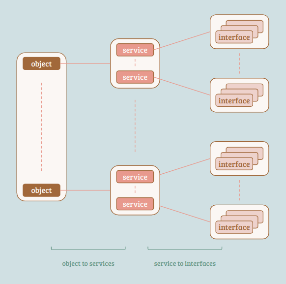

## Index

- [Introduction](#introduction)
- [Methods](#methods)
- [Association](#association)
- [Cheat Sheet](#cheat-sheet)
- [Reference](#reference)

## <a name="introduction"></a> Introduction

The D-Bus system relies on three main components: services, objects, and interfaces. 
The object mapper plays a crucial role in managing and providing access to this information. 
The mapper maintains a two-level data structure, known as the database, to facilitate efficient querying and retrieval of information.

The two main maps within the database are:

1. Object-to-services map:
   - This map associates objects with the services that provide them. Since services can act as namespaces, it is possible for multiple services to create objects with the same path.

2. Service-to-interfaces map:
   - This map enables the retrieval of interfaces associated with a specific service. Due to the design of the database, the search for interfaces of a target object is influenced by the service as the input.

<p align="center"></p>

We use `/xyz/openbmc_project/software` as an example to illustrate and distinguish the coverage of each method implemented by the object mapper.

```
             "/"                                                       |                  
             "/xyz"                                                    | GetAncestors()   
             "/xyz/openbmc_project"                                    |                  
                                                                                          
 target -->  "/xyz/openbmc_project/software"                           | GetObject()      
                                                                                          
             "/xyz/openbmc_project/software/10e36fd2"                  | GetSubTree() and 
             "/xyz/openbmc_project/software/10e36fd2/software_version" | GetSubTreePaths()
```

## <a name="methods"></a> Methods

### GetAncestors

In the context of the D-Bus system, let's consider a specific example to illustrate its functionality. 
Our focus will be on the object path `/xyz/openbmc_project/software/10e36fd2`.

```
busctl call --verbose \
   xyz.openbmc_project.ObjectMapper \        # service
   /xyz/openbmc_project/object_mapper \      # object
   xyz.openbmc_project.ObjectMapper \        # interface
   GetAncestors \                            # method
   sas \                                     # signature
   /xyz/openbmc_project/software \           # target object
   1 \                                       # number of the following interface(s)
   xyz.openbmc_project.Common.FactoryReset   # interface(s)
```       

For each object path, the mapper will list all the services that implement it, and obviously, the shorter path involves more services. 
With the help of the last argument: interface(s), we can limit the output to services that contain the interfaces intersecting our selection.

### GetObject

The object mapper provides a list of services that implement a specific object path. 
It's worth noting that shorter object paths tend to have a higher number of associated services. 
By utilizing the last argument, which specifies the desired interface(s), we can narrow down the output to only include services that have interfaces intersecting with our selection. 

```
busctl call --verbose \
  xyz.openbmc_project.ObjectMapper \      # service
  /xyz/openbmc_project/object_mapper \    # object
  xyz.openbmc_project.ObjectMapper \      # interface
  GetObject \                             # method
  sas \                                   # signature
  /xyz/openbmc_project/FruDevice \        # target object
  0                                       # number of the following interface(s)
```

### GetSubTree

The method traverses each child object path starting from the specified argument object, such as `/`, and includes them in the output. 

```
busctl call --verbose \
   xyz.openbmc_project.ObjectMapper \     # service
   /xyz/openbmc_project/object_mapper \   # object
   xyz.openbmc_project.ObjectMapper \     # interface
   GetSubTree \                           # method
   sias \                                 # signature
   / \                                    # every object starts with the given path is targeted
   0 \                                    # valid depth to search (0 means unlimited)
   1 \                                    # number of the following interface(s)
   xyz.openbmc_project.FruDeviceManager   # interface(s) as constraint
```

### GetSubTreePaths

`GetSubTree` function operates similarly in all aspects, except that the output is restricted to the object paths only, without including any service or interface information.

```
busctl call --verbose \
   xyz.openbmc_project.ObjectMapper \     # service
   /xyz/openbmc_project/object_mapper \   # object
   xyz.openbmc_project.ObjectMapper \     # interface
   GetSubTreePaths \                      # method
   sias \                                 # signature
   / \                                    # every object starts with the given path is targeted
   0 \                                    # valid depth to search (0 means unlimited)
   1 \                                    # number of the following interface(s)
   xyz.openbmc_project.FruDeviceManager   # interface(s) as constraint
```

<details><summary> More Details </summary>

```
+------+                                                                         
| main |                                                                         
+-|----+                                                                         
  |                                                                              
  |--> Set up handlers for matching rules:                                       
  |        Name Owner Changed                                                    
  |        Interfaces Added                                                      
  |        Interfaces Removed                                                    
  |        Association Changed                                                   
  |                                                                              
  |--> Register the methods provided by the service:                             
  |        GetAncestors()                                                        
  |        GetObject()                                                           
  |        GetSubTree()                                                          
  |        GetSubTreePaths()                                                     
  |        GetAssociatedSubTree()                                                
  |        GetAssociatedSubTreePaths()                                           
  |                                                                              
  |--> Initialize the interface.                                                 
  |                                                                              
  |--> Post a job to the I/O context.                                            
  |    +-------------+                                                           
  |    | doListNames | Set up the interface map and construct the list of owners.
  |    +-------------+                                                           
  |                                                                              
  |--> Request the service name.                                                 
  |                                                                              
  +--> Run the I/O context.                                                      
```

```
+------+
| main |
+-|----+
  |
  |--> prepare signal handlers for SIGINT, SIGTERM
  |
  |--> prepare handler and match rule for name change
  |    +------------+
  |    | anon func1 | update 'name_owners', introspect target and update associaion map
  |    +------------+
  |
  |--> prepare handler and match rule for added iface
  |    +------------+
  |    | anon func2 | handle added interface
  |    +------------+
  |
  |--> prepare handler and match rule for removed iface
  |    +------------+
  |    | anon func3 | handle entry removal
  |    +------------+
  |
  |--> prepare handler and match rule for changed assoc
  |    +--------------------+
  |    | associationChanged | update association map
  |    +--------------------+
  |
  |--> set up object: "/xyz/openbmc_project/object_mapper"
  |
  |--> prepare callback for method "GetAncestors"
  |        +--------------+
  |        | getAncestors | get ancestors of req_path
  |        +--------------+
  |
  |--> prepare callback for method "GetObject"
  |        +-----------+
  |        | getObject | given path & iface_map, get object(s)
  |        +-----------+
  |
  |--> prepare callback for method "GetSubTree"
  |        +------------+
  |        | getSubTree | get sub tree
  |        +------------+
  |
  |--> prepare callback for method "GetSubTreePaths"
  |        +-----------------+
  |        | getSubTreePaths | get sub tree paths
  |        +-----------------+
  |    +-------------+
  |--> | doListNames | add iface to map, update owners  
  |    +-------------+
  |
  +--> request service: "xyz.openbmc_project.ObjectMapper"
```

```
+------------+                                                                      
| anon func1 | : update 'name_owners', introspect target and update associaion map  
+-|----------+                                                                      
  |                                                                                 
  |--> read 'name', 'old owner' and 'new owner' from msg                            
  |                                                                                 
  |--> if 'old owner'                                                               
  |                                                                                 
  |        +-------------------------+                                              
  |------> | processNameChangeDelete | (skip)                                       
  |        +-------------------------+                                              
  |                                                                                 
  |--> if 'new owner'                                                               
  |                                                                                 
  |        +------------------+                                                     
  |------> | needToIntrospect | check if it's in whitelist only (not in blacklist)  
  |        +------------------+                                                     
  |                                                                                 
  |------> if yes                                                                   
  |                                                                                 
  |----------> name_owners[new_owner] = name                                        
  |                                                                                 
  |            +--------------------+                                             
  +----------> | startNewIntrospect | introspect target and update association map
               +--------------------+                                             
```

```
src/main.cpp
+--------------------+                                                                             
| startNewIntrospect | : introspect target and update association map                              
+-|------------------+                                                                             
  |    +------------------+                                                                          
  |--> | needToIntrospect | check if it's in whitelist only (not in blacklist)                       
  |    +------------------+                                                                          
  |                                                                                                  
  |--> if yes                                                                                        
  |                                                                                                  
  |        +---------------+                                                                         
  +------> | do_introspect | introspect target, for each node: for each iface: update association map
           +---------------+                                                                         
```
   
```
src/main.cpp
+--------------+
| doIntrospect | : recursively add iface to map and handle association
+-|------------+
  |
  +--> ->async_method_call
          +------------------------------------------------------------------------+
          |parse the input xml                                                     |
          |                                                                        |
          |start from element 'interface'                                          |
          |                                                                        |
          |while element != null                                                   |
          ||                                                                       |
          ||--> get iface from 'name'                                              |
          ||                                                                       |
          ||--> save in 'interfaceMap'                                             |
          ||                                                                       |
          ||--> if iface == xyz.openbmc_project.Association.Definitions            |
          ||    |                                                                  |
          ||    |    +----------------+                                            |
          ||    +--> | doAssociations | get target info and update association map |
          ||         +----------------+                                            |
          ||                                                                       |
          |+--> element = next sibling                                             |
          |                                                                        |
          |+---------------------------+                                           |
          || checkIfPendingAssociation | (skip)                                    |
          |+---------------------------+                                           |
          |                                                                        |
          |start from element 'node'                                               |
          |                                                                        |
          |while element != null                                                   |
          ||                                                                       |
          ||--> get child_path from 'name'                                         |
          ||                                                                       |
          ||--> if child_path exists                                               |
          ||    |                                                                  |
          ||    |    +--------------+                                              |
          ||    +--> | doIntrospect | (recursive)                                  |
          ||         +--------------+                                              |
          ||                                                                       |
          |+--> element = next sibling                                             |
          +------------------------------------------------------------------------+
          |service: process_name                                                   |
          |object: path                                                            |
          |iface: org.freedesktop.DBus.Introspectable                              |
          |method: Introspect                                                      |
          +------------------------------------------------------------------------+
```   

```
src/main.cpp   
+----------------+                                             
| doAssociations | : get target info and update association map
+-|--------------+                                             
  |                                                             
  |--> prepare callback for method call                         
  |       +----------------------------------------------+      
  |       |+--------------------+                        |      
  |       || associationChanged | update association map |      
  |       |+--------------------+                        |      
  |       +----------------------------------------------+      
  |                                                             
  +--> call service: processName                                
            object: path                                        
            iface: "org.freedesktop.DBus.Properties"            
            method: "Get"                                       
```

```
src/associations.cpp
+--------------------+                                                                                        
| associationChanged | : update association map                                                               
+-|------------------+                                                                                        
  |                                                                                                           
  |--> for each association                                                                                   
  |                                                                                                           
  |------> get 'forward', 'reverse', and 'endpoint' from association                                          
  |                                                                                                           
  |------> if endpoint isn't in arg continue                                                                  
  |                                                                                                           
  |            +-----------------------+                                                                      
  |----------> | addPendingAssociation | (skip)                                                               
  |            +-----------------------+                                                                      
  |                                                                                                           
  |----------> continue                                                                                       
  |                                                                                                           
  |------> if 'forward'                                                                                       
  |                                                                                                           
  |----------> add 'endpoint' to objects[path + "/" + forward]                                                
  |                                                                                                           
  |------> if 'reverse'                                                                                       
  |                                                                                                           
  |            add arg path to objects[path + "/" + reverse]                                                  
  |                                                                                                           
  |--> for each object                                                                                        
  |                                                                                                           
  |        +---------------------------+                                                                      
  |------> | addEndpointsToAssocIfaces | give arg endpointPaths, ensure they are all in endpoints of interface
  |        +---------------------------+                                                                      
  |    +---------------------------------+                                                                    
  |--> | checkAssociationEndpointRemoves | check if endpoints being removed                                   
  |    +---------------------------------+                                                                    
  |                                                                                                           
  |--> if objects isn't empty                                                                                 
  |                                                                                                           
  +------> ensure (path, owner, objects) exists                                                               
```

```
+---------------------------+                                                                        
| addEndpointsToAssocIfaces | : give arg endpointPaths, ensure they are all in endpoints of interface
+-|-------------------------+                                                                        
  |                                                                                                  
  |--> get iface from arg assocMaps                                                                  
  |                                                                                                  
  |--> get endpoints from iface                                                                      
  |                                                                                                  
  |--> for each endpoint_path in arg 'endpointPaths'                                                 
  |                                                                                                  
  |------> add endpoint_path to endpoints if it's not there yet                                      
  |                                                                                                  
  |--> if iface exists already                                                                       
  |                                                                                                  
  |------> set_property("endpoints") with endpoints                                                  
  |                                                                                                  
  |--> else                                                                                          
  |                                                                                                  
  |------> add interface "xyz.openbmc_project.Association" for arg assocPath                         
  |                                                                                                  
  +------> register_property("endpoints") with endpoints                                             
```

```
+------------+                                                                 
| anon func2 | : handle added interface
+--|---------+                                                                 
   |                                                                           
   |--> read msg                                                               
   |                                                                           
   |    +------------------+                                                   
   |--> | needToIntrospect | check if it's in whitelist only (not in blacklist)
   |    +------------------+                                                   
   |    +-----------------------+                                              
   +--> | processInterfaceAdded | handle added interface                       
        +-----------------------+                                              
```

```
+-----------------------+
| processInterfaceAdded | : handle added interface
+-|---------------------+
  |
  |--> for each added_iface
  |    -
  |    +--> if the iface == "xyz.openbmc_project.Association.Definitions"
  |         |
  |         |--> for each iface (property?)
  |         |    -
  |         |    +--> if it's "Associations"
  |         |         -
  |         |         +--> svae it in variantAssociations
  |         |
  |         |    +--------------------+
  |         +--> | associationChanged | update association map
  |              +--------------------+
  |
  |--> while we haven't reached root obj yet
  |    |
  |    |--> prepare default iface for current parent
  |    |
  |    +--> continue for higher parent
  |
  |    +---------------------------+
  +--> | checkIfPendingAssociation |
       +---------------------------+
```

```
+------------+                                                           
| anon func3 | : handle entry removal
+-|----------+                                                           
  |    +--------------+                                                  
  |--> | getWellKnown | check if the owner is 'well-known'               
  |    +--------------+                                                  
  |                                                                      
  |--> return if not                                                     
  |                                                                      
  |--> for each removed iface                                            
  |    |                                                                 
  |    |--> continue if the sender isn't in connection_map               
  |    |                                                                 
  |    |--> if the iface is "xyz.openbmc_project.Association.Definitions"
  |    |    |                                                            
  |    |    |    +-------------------+                                   
  |    |    +--> | removeAssociation | remove association                
  |    |         +-------------------+                                   
  |    |                                                                 
  |    +--> erase iface from interface_set                               
  |                                                                      
  |         if interface_set becomes empty                               
  |         -                                                            
  |         +--> erase interface_set from connection_map                 
  |                                                                      
  |--> if connection_map becomes empty                                   
  |    -                                                                 
  |    +--> remove connection_map from interface_map                     
  |                                                                      
  |    +-----------------------+                                         
  +--> | removeUnneededParents | remove unneeded parents                 
       +-----------------------+                                         
```

```
+-------------------+                                                                                         
| removeAssociation | : remove association                                                                    
+-|-----------------+                                                                                         
  |                                                                                                           
  +--> find services (owners) that have the object (path)                                                     
  |                                                                                                           
  |--> find assoccs of the arg owner                                                                          
  |                                                                                                           
  |--> for each (assoc_path, ep_to_remove)                                                                    
  |    |                                                                                                      
  |    |    +----------------------------+                                                                    
  |    +--> | removeAssociationEndpoints | remove endpoints from iface, and further remove iface if it's empty
  |         +----------------------------+                                                                    
  |                                                                                                           
  |--> erase assoc from owners                                                                                
  |                                                                                                           
  |--> if 'owners' becomes empty                                                                              
  |    -                                                                                                      
  |    +--> erase it from assocMaps                                                                           
  |                                                                                                           
  |    +-------------------------------+                                                                      
  +--> | removeFromPendingAssociations | (skip)                                                               
       +-------------------------------+                                                                      
```

```
+----------------------------+                                                                      
| removeAssociationEndpoints | : remove endpoints from iface, and further remove iface if it's empty
+-|--------------------------+                                                                      
  |                                                                                                 
  |--> get 'endpointsInDBus' from assoc                                                             
  |                                                                                                 
  |--> for each ep_to_remove                                                                        
  |    -                                                                                            
  |    +--> if the ep is in 'endpointsInDBus', erase it                                             
  |                                                                                                 
  |--> if endpointsInDBus becomes empty afterwards                                                  
  |    -                                                                                            
  |    +--> remove iface as well                                                                    
  |                                                                                                 
  +--> else                                                                                         
       -                                                                                            
       +--> set_property("endpoints", endpointsInDBus)                                              
```

```
+-----------------------+                               
| removeUnneededParents | : remove unneeded parents     
+-|---------------------+                               
  |                                                     
  +--> endless loop                                     
       |                                                
       |--> break if an object has more than three iface
       |                                                
       |--> remove object from interface_map            
       |                                                
       +--> continue to check upper level               
```

```
+--------------+                                         
| getAncestors | : get ancestors of req_path             
+-|------------+                                         
  |                                                      
  |--> ensure there's no tailing '/' of req_path         
  |                                                      
  +--> for each obj_path in iface_map                    
       -                                                 
       +--> add to 'ret' if it's the ancestor of req_path
```

```
+------------+                                                                                               
| getSubTree | : get sub tree                                                                                
+-|----------+                                                                                               
  |                                                                                                          
  |--> sort interfaces for later intersect() to work                                                         
  |                                                                                                          
  |--> ensure there's no tailing '/' of req_path                                                             
  |                                                                                                          
  +--> for each obj_path in iface_map                                                                        
       |                                                                                                     
       |--> calculate this_depth                                                                             
       |                                                                                                     
       +--> if the this_depth is valid (less than the specified one)                                         
            -                                                                                                
            +--> for each iface_map in obj_path (???)                                                        
                 |                                                                                           
                 |    +--------------------+                                                                 
                 +--> | addObjectMapResult | ensure there's an entry in 'objectmap' contains the interfaceMap
                      +--------------------+                                                                 
```

```
+--------------------+                                                                   
| addObjectMapResult | : ensure there's an entry in 'objectmap' contains the interfaceMap
+-|------------------+                                                                   
  |                                                                                      
  |--> check if entry is already in 'objectMap'                                          
  |                                                                                      
  |--> if found                                                                          
  |    -                                                                                 
  |    +--> add 'interfaceMap' to it                                                     
  |                                                                                      
  +--> else                                                                              
       |                                                                                 
       |--> prepare entry first                                                          
       |                                                                                 
       |--> add 'interfaceMap' to it                                                     
       |                                                                                 
       +--> add entry to 'objectMap'                                                     
```

```
+-----------------+                                          
| getSubTreePaths | : get sub tree paths                     
+-|---------------+                                          
  |                                                          
  |--> sort interfaces for later intersect() to work         
  |                                                          
  |--> ensure there's no tailing '/' of req_path             
  |                                                          
  +--> for each obj_path in iface_map                        
       |                                                     
       |--> calculate depth and check if it's valid          
       |                                                     
       |--> for each iface_map in obj_path                   
       |    -                                                
       |    +--> break if intersect() returns true           
       |                                                     
       +--> add this_path to ret if intersect() returned true
```
   
```
src/main.cpp
+-------------+                                                                             
| doListNames | : add iface to map, update owners                                           
+-|-----------+                                                                             
  |                                                                                         
  +--> ->async_method_call                                                                  
          +--------------------------------------------------------------------------------+
          |sort process_names                                                              |
          |                                                                                |
          |for each process_name                                                           |
          ||                                                                               |
          ||    +--------------------+                                                     |
          ||--> | startNewIntrospect | recursively add iface to map and handle association |
          ||    +--------------------+                                                     |
          ||    +--------------+                                                           |
          |+--> | updateOwners | owners[nameOwner] = newObject                             |
          |     +--------------+                                                           |
          +--------------------------------------------------------------------------------+
          service: org.freedesktop.DBus                                                     
          object: /org/freedesktop/DBus                                                     
          iface: org.freedesktop.DBus                                                       
          method: org.freedesktop.DBus                                                      
```

```
root@romulus:~# busctl get-property xyz.openbmc_project.Software.BMC.Updater /xyz/openbmc_project/software xyz.openbmc_project.Association.Definitions Associations
a(sss) 3 "functional" "software_version" "/xyz/openbmc_project/software/7e2de8e3" "active" "software_version" "/xyz/openbmc_project/software/7e2de8e3" "updateable" "software_version" "/xyz/openbmc_project/software/7e2de8e3"
root@romulus:~# 
root@romulus:~# 
root@romulus:~# 
root@romulus:~# 
root@romulus:~# 
root@romulus:~# 
root@romulus:~# busctl tree xyz.openbmc_project.ObjectMapper                                                                                               
`- /xyz
  `- /xyz/openbmc_project
    |- /xyz/openbmc_project/object_mapper
    `- /xyz/openbmc_project/software
      |- /xyz/openbmc_project/software/7e2de8e3
      | `- /xyz/openbmc_project/software/7e2de8e3/software_version
      |- /xyz/openbmc_project/software/active
      |- /xyz/openbmc_project/software/functional
      `- /xyz/openbmc_project/software/updateable

```

```
libmapper/app.c                                                                                                          
+------+                                                                                                                  
| main | : perform one of 'wait', 'subtree-remove', or 'get-service'                                                      
+-|----+                                                                                                                  
  |                                                                                                                       
  |--> if arg == wait                                                                                                     
  |    |                                                                                                                  
  |    |    +-----------+                                                                                                 
  |    +--> | wait_main | add match rules, wait for 'get objects' completion                                              
  |         +-----------+                                                                                                 
  |                                                                                                                       
  |--> elif arg == subtree-remove                                                                                         
  |    |                                                                                                                  
  |    |    +--------------+                                                                                              
  |    +--> | subtree_main | add match rule, send method call (get subtree paths) to obj_mapper, check if iface is removed
  |         +--------------+                                                                                              
  |                                                                                                                       
  +--> elif arg == get-service                                                                                            
       |                                                                                                                  
       |    +------------------+                                                                                          
       +--> | get_service_main | send method call (get obj) to obj_mapper to get service name                             
            +------------------+                                                                                          
```

```
libmapper/app.c                                                                    
+-----------+                                                                       
| wait_main | : add match rules, wait for 'get objects' completion                  
+-|---------+                                                                       
  |                                                                                 
  |--> endless loop                                                                 
  |    |                                                                            
  |    |    +----------------+                                                      
  |    |--> | sd_bus_default |                                                      
  |    |    +----------------+                                                      
  |    |    +------------------+                                                    
  |    |--> | sd_event_default |                                                    
  |    |    +------------------+                                                    
  |    |    +---------------------+                                                 
  |    |--> | sd_bus_attach_event |                                                 
  |    |    +---------------------+                                                 
  |    |    +-------------------+                                                   
  |    |--> | mapper_wait_async | add match rules, wait for 'get objects' completion
  |    |    +-------------------+                                                   
  |    |    +---------------+                                                       
  |    |--> | sd_event_loop |                                                       
  |    |    +---------------+                                                       
  |    |                                                                            
  |    +--> break                                                                   
  |                                                                                 
  |    +------+                                                                     
  +--> | exit |                                                                     
       +------+                                                                     
```

```
libmapper/mapper.c                                                                                                                                               
+-------------------+                                                                                                                                             
| mapper_wait_async | : add match rules, wait for 'get objects' completion                                                                                        
+-|-----------------+                                                                                                                                             
  |                                                                                                                                                               
  |--> alloc 'wait' and setup it                                                                                                                                  
  |                                                                                                                                                               
  |    +------------------+                                                                                                                                       
  +--> | sd_bus_add_match | add match rule 'IntrospectionComplete'                                                                                                
  |    +------------------+ +-----------------------------------------+                                                                                           
  |                         | async_wait_match_introspection_complete | for each obj in wait, send methond call (get object) to obj_mapper and wait for completion
  |                         +-----------------------------------------+                                                                                           
  |    +------------------+                                                                                                                                       
  |--> | sd_bus_add_match | add match rule 'InterfacesAdded'                                                                                                      
  |    +------------------+ +-----------------------------------------+                                                                                           
  |                         | async_wait_match_introspection_complete | for each obj in wait, send methond call (get object) to obj_mapper and wait for completion
  |                         +-----------------------------------------+                                                                                           
  |    +------------------------+                                                                                                                                 
  +--> | async_wait_get_objects | for each obj in wait, send methond call (get object) to obj_mapper and wait for completion                                      
       +------------------------+                                                                                                                                 
```

```
libmapper/mapper.c                                                                                                                     
+-----------------------------------------+                                                                                             
| async_wait_match_introspection_complete | : for each obj in wait, send methond call (get object) to obj_mapper and wait for completion
+-|---------------------------------------+                                                                                             
  |                                                                                                                                     
  |--> if wait is already finished, return                                                                                              
  |                                                                                                                                     
  |    +------------------------+                                                                                                       
  +--> | async_wait_get_objects | for each obj in wait, send methond call (get object) to obj_mapper and wait for completion            
       +------------------------+                                                                                                       
```

```
libmapper/mapper.c                                                                                                    
+------------------------+                                                                                             
| async_wait_get_objects | : for each obj in wait, send methond call (get object) to obj_mapper and wait for completion
+-|----------------------+                                                                                             
  |                                                                                                                    
  +--> for each obj in wait                                                                                            
       |                                                                                                               
       |--> setup tmp data                                                                                             
       |                                                                                                               
       |    +--------------------------+                                                                               
       +--> | sd_bus_call_method_async | prepare msg (method call), install callback, send msg out                     
            +--------------------------+ +-------------------------------+                                             
                                         | async_wait_getobject_callback | finish the wait on 'get object'             
                                         +-------------------------------+                                             
```

```
libmapper/mapper.c                                                
+-------------------------------+                                  
| async_wait_getobject_callback | : finish the wait on 'get object'
+-|-----------------------------+                                  
  |                                                                
  |--> for each obj in wait                                        
  |    -                                                           
  |    +--> if data_path == wait_obj                               
  |         -                                                      
  |         +--> wait_status = 1                                   
  |                                                                
  |    +-----------------------+                                   
  |--> | async_wait_check_done | check if done (all status == 1)   
  |    +-----------------------+                                   
  |                                                                
  +--> if done                                                     
       |                                                           
       |    +-----------------+                                    
       +--> | async_wait_done | finish the wait                    
            +-----------------+                                    
```

```
libmapper/mapper.c                  
+-----------------+                  
| async_wait_done | : finish the wait
+-|---------------+                  
  |                                  
  |--> wait->finished = 1            
  |                                  
  +--> if wait has callback()        
       -                             
       +--> call it, e.g.,           
            +------+                 
            | quit | exit event      
            +------+                 
```

```
libmapper/app.c                                                                                                             
+--------------+                                                                                                             
| subtree_main | : add match rule, send method call (get subtree paths) to obj_mapper, check if iface is removed             
+-|------------+                                                                                                             
  |                                                                                                                          
  |--> get namespace and interface from args                                                                                 
  |                                                                                                                          
  |    +----------------+                                                                                                    
  |--> | sd_bus_default |                                                                                                    
  |    +----------------+                                                                                                    
  |    +------------------+                                                                                                  
  |--> | sd_event_default |                                                                                                  
  |    +------------------+                                                                                                  
  |    +---------------------+                                                                                               
  |--> | sd_bus_attach_event |                                                                                               
  |    +---------------------+                                                                                               
  |    +----------------------+                                                                                              
  |--> | mapper_subtree_async | add match rule, send method call (get subtree paths) to obj_mapper, check if iface is removed
  |    +----------------------+                                                                                              
  |    +---------------+                                                                                                     
  |--> | sd_event_loop |                                                                                                     
  |    +---------------+                                                                                                     
  |    +------+                                                                                                              
  +--> | exit |                                                                                                              
       +------+                                                                                                              
```

```
libmapper/mapper.c                                                                                                                            
+----------------------+                                                                                                                       
| mapper_subtree_async | : add match rule, send method call (get subtree paths) to obj_mapper, check if iface is removed                       
+-|--------------------+                                                                                                                       
  |                                                                                                                                            
  |--> alloc and setup 'subtree'                                                                                                               
  |                                                                                                                                            
  |--> if op == remove                                                                                                                         
  |    |                                                                                                                                       
  |    |    +------------------+                                                                                                               
  |    +--> | sd_bus_add_match | send msg ('add match' method) to bus clients, add match rule to bus                                           
  |         +------------------+ +------------------------------+                                                                              
  |                              | async_subtree_match_callback | send method call (get subtree paths) to obj_mapper, check if iface is removed
  |                              +------------------------------+                                                                              
  |    +------------------------+                                                                                                              
  +--> | async_subtree_getpaths | send method call (get subtree paths) to obj_mapper, check if iface is removed                                
       +------------------------+                                                                                                              
```

```
libmapper/mapper.c                                                                                                                   
+------------------------------+                                                                                                      
| async_subtree_match_callback | : send method call (get subtree paths) to obj_mapper, check if iface is removed                      
+------------------------+-----+                                                                                                      
| async_subtree_getpaths | : send method call (get subtree paths) to obj_mapper, check if iface is removed                            
+-|----------------------+                                                                                                            
  |    +--------------------------+                                                                                                   
  +--> | sd_bus_call_method_async | send method call (get subtree paths) to obj_mapper                                                
       +--------------------------+ +---------------------------------+                                                               
                                    | async_subtree_getpaths_callback | check if we get nothing (which means the interface is removed)
                                    +---------------------------------+                                                               
```

```
libmapper/app.c                                                                          
+------------------+                                                                      
| get_service_main | : send method call (get obj) to obj_mapper to get service name       
+-|----------------+                                                                      
  |    +----------------+                                                                 
  |--> | sd_bus_default |                                                                 
  |    +----------------+                                                                 
  |    +--------------------+                                                             
  |--> | mapper_get_service | send method call (get obj) to obj_mapper to get service name
  |    +--------------------+                                                             
  |    +------+                                                                           
  +--> | exit |                                                                           
       +------+                                                                           
```

```
libmapper/mapper.c                                                                     
+--------------------+                                                                  
| mapper_get_service | : send method call (get obj) to obj_mapper to get service name   
+-|------------------+                                                                  
  |    +-------------------+                                                            
  |--> | mapper_get_object | send method call (get object) to obj_mapper, wait for reply
  |    +-------------------+                                                            
  |                                                                                     
  +--> read service name from reply                                                     
```

</details>

## <a name="association"></a> Association

(TBD)

## <a name="cheat-sheet"></a> Cheat Sheet

- GetAncestors

```
busctl call --verbose \
   xyz.openbmc_project.ObjectMapper \
   /xyz/openbmc_project/object_mapper \
   xyz.openbmc_project.ObjectMapper \
   GetAncestors \
   sas \
   /xyz/openbmc_project/software \
   1 \
   xyz.openbmc_project.Common.FactoryReset
```

- GetAssociatedSubTree

```
busctl call --verbose \
   xyz.openbmc_project.ObjectMapper \
   /xyz/openbmc_project/object_mapper \
   xyz.openbmc_project.ObjectMapper \
   GetAssociatedSubTree \
   ooias \
   /xyz/openbmc_project/software/active \
   /xyz/openbmc_project/software \
   0 \
   0
```

- GetAssociatedSubTreePaths

```
busctl call --verbose \
   xyz.openbmc_project.ObjectMapper \
   /xyz/openbmc_project/object_mapper \
   xyz.openbmc_project.ObjectMapper \
   GetAssociatedSubTreePaths \
   ooias \
   /xyz/openbmc_project/software/active \
   /xyz/openbmc_project/software \
   0 \
   0
```

- GetObject

```
busctl call --verbose \
  xyz.openbmc_project.ObjectMapper \
  /xyz/openbmc_project/object_mapper \
  xyz.openbmc_project.ObjectMapper \
  GetObject \
  sas \
  /xyz/openbmc_project/software \
  1 \
  xyz.openbmc_project.Association.Definitions
```

- GetSubTree

```
busctl call --verbose \
   xyz.openbmc_project.ObjectMapper \
   /xyz/openbmc_project/object_mapper \
   xyz.openbmc_project.ObjectMapper \
   GetSubTree \
   sias \
   /xyz/openbmc_project/software \
   0 \
   1 \
   xyz.openbmc_project.Association.Definitions
```

- GetSubTreePaths

```
busctl call --verbose \
   xyz.openbmc_project.ObjectMapper \
   /xyz/openbmc_project/object_mapper \
   xyz.openbmc_project.ObjectMapper \
   GetSubTreePaths \
   sias \
   /xyz/openbmc_project/software \
   0 \
   1 \
   xyz.openbmc_project.Association.Definitions
```

- Retrieve the unique ID of the target service.

```
e.g.,
busctl call --verbose \
  org.freedesktop.DBus \
  /org/freedesktop/DBus \
  org.freedesktop.DBus \
  GetNameOwner \
  s \
  xyz.openbmc_project.User.Manager
```

- Enumerate all service names.

```
busctl call --verbose \
  org.freedesktop.DBus \
  /org/freedesktop/DBus \
  org.freedesktop.DBus \
  ListNames
```

- Retrieve associations from the target object.

```
e.g.,
busctl call --verbose \                        
  xyz.openbmc_project.Software.BMC.Updater \   
  /xyz/openbmc_project/software \              
  org.freedesktop.DBus.Properties \            
  Get \                                        
  ss \                                         
  xyz.openbmc_project.Association.Definitions \
  Associations
```                      

## <a name="reference"></a> Reference

- [The Mapper](https://github.com/openbmc/phosphor-objmgr)
