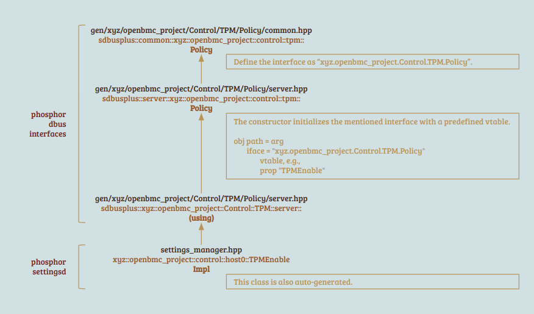
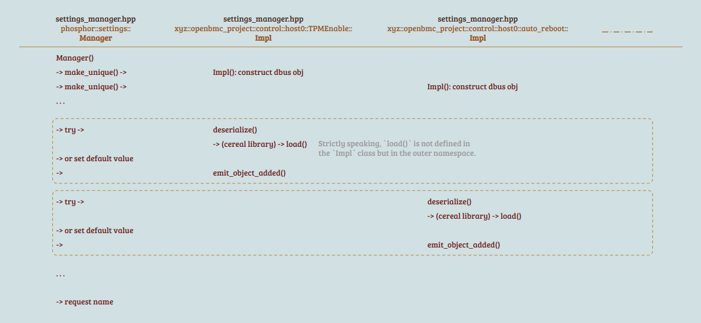

> Study case: Aspeed OpenBMC (commit 742fec782ef6c34c9fcd866116631e1d7aeedf8c)

## Index

- [Introduction](#introduction)
- [Intel Equivalent](#intel-equivalent)
- [Reference](#reference)

## <a name="introduction"></a> Introduction

`settings_manager.hpp` is automatically generated from `settings_manager.mako.hpp` and implements the `Impl` classes within each namespace. 
These `Impl` classes inherit from other classes defined in the `phosphor dbus interfaces` package, enabling them to support DBus object and interface handling. 
In addition to the `Impl` classes, `save()` and `load()` are implemented to meet the requirements of the `cereal` library, facilitating the export and import of class objects between memory and files.

<p align="center"></p>

In the constructor flow of the `Manager`, an instance of the `Impl` class is created for each namespace. 
The content of the object is either restored from external files or set to default values.

<p align="center"></p>

- Other Information

```
Requested name: xyz.openbmc_project.Settings
External file path: /var/lib/phosphor-settings-manager/settings/
```

However, in a new runtime environment, serialized files are unlikely to be present since no property has been changed yet. 
To initiate the logic of `serialize()`, try changing the property first.

```
# busctl set-property xyz.openbmc_project.Settings \
    /xyz/openbmc_project/control/host0/TPMEnable \
    xyz.openbmc_project.Control.TPM.Policy \
    TPMEnable \
    b \
    true
# cat /var/lib/phosphor-settings-manager/settings/xyz/openbmc_project/control/host0/TPMEnable__
{
    "value0": {
        "cereal_class_version": 2,
        "TPMEnable": true
    }
}
```

## <a name="intel-equivalent"></a> Intel Equivalent (obsolete)

The `settings` package, the equivalent in Intel OpenBMC, is no longer actively maintained.

<details><summary> More Details </summary>

```
+------+                                                          
| main | : request service 'Settings' and generate lots of objects
+-|----+                                                          
  |                                                               
  |--> ->request_name("xyz.openbmc_project.Settings")             
  |                                                               
  |    +--------------+                                           
  +--> | loadSettings | generate lots of objects                  
       +--------------+                                           
```

```
+--------------+                                                             
| loadSettings | : generate lots of objects                                  
+-|------------+                                                             
  |                                                                          
  +--> ste up obj: "/xyz/openbmc_project/control/minimum_ship_level_required"
                   "/xyz/openbmc_project/control/host0/auto_reboot"          
                   "/xyz/openbmc_project/control/host0/boot"                 
                   "/xyz/openbmc_project/control/host0/boot/one_time"        
                   "/xyz/openbmc_project/control/host0/power_cap"            
                   "/xyz/openbmc_project/control/host0/power_restore_policy" 
                   "/xyz/openbmc_project/control/power_restore_delay"        
                   "/xyz/openbmc_project/control/host0/acpi_power_state"     
                   "/xyz/openbmc_project/time/owner"                         
                   "/xyz/openbmc_project/time/sync_method"                   
                   "/xyz/openbmc_project/network/host0/intf"                 
                   "/xyz/openbmc_project/network/host0/intf/addr"            
                   "/xyz/openbmc_project/control/host0/TPMEnable"            
                   "/xyz/openbmc_project/control/power_supply_redundancy"    
                   "/xyz/openbmc_project/control/host0/turbo_allowed"        
                   "/xyz/openbmc_project/control/host0/systemGUID"           
                   "/xyz/openbmc_project/software/bios_active"               
                   "/xyz/openbmc_project/software/cpld_active"               
                   "/xyz/openbmc_project/software"                           
                   "/xyz/openbmc_project/control/processor_error_config"     
                   "/xyz/openbmc_project/control/bmc_reset_disables"         
                   "/com/intel/control/ocotshutdown_policy_config"           
                   "/xyz/openbmc_project/Chassis/Control/NMISource"          
                   "/xyz/openbmc_project/state/chassis0"                     
                   "/xyz/openbmc_project/control/chassis_capabilities_config"
                   "/xyz/openbmc_project/control/thermal_mode"               
                   "/xyz/openbmc_project/control/cfm_limit"                  
                   "/xyz/openbmc_project/ipmi/sol/eth0"                      
                   "/xyz/openbmc_project/ipmi/sol/eth1"                      
                   "/xyz/openbmc_project/ipmi/sol/eth2"                      
                   "/xyz/openbmc_project/control/host0/ac_boot"              
                   "/xyz/openbmc_project/Inventory/Item/Dimm"                
                   "/xyz/openbmc_project/logging/rest_api_logs"              
                   "/xyz/openbmc_project/software/apply_time"                
                   "/xyz/openbmc_project/logging/settings"                   
                   "/xyz/openbmc_project/pfr/last_events"                    
```

</details>

## <a name="reference"></a> Reference

- [phosphor-settingsd](https://github.com/openbmc/phosphor-settingsd)
