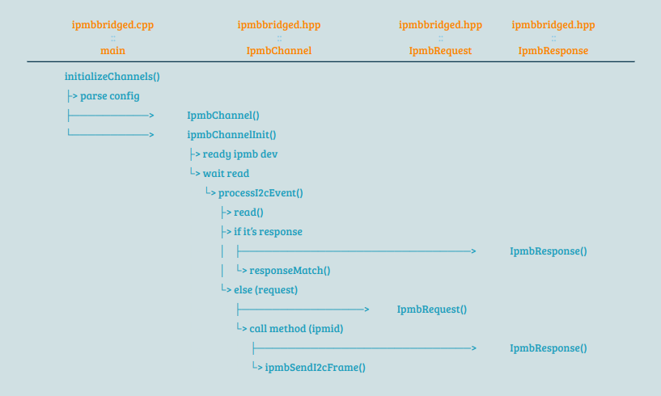
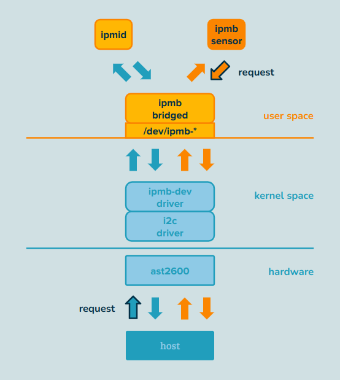

> Study case: Aspeed OpenBMC (commit 742fec782ef6c34c9fcd866116631e1d7aeedf8c)

## Index

- [Introduction](#introduction)
- [Reference](#reference)

##  Introduction

The `ipmbbridge` package features `ipmbbridged`, encompassing a receiving function and a D-Bus method that is published.

- **Receiving Function:**
  - This function captures responses when the BMC initiates an IPMB request and sends it out.
  - It also captures instances when the host sends an IPMB request to the BMC.

- **Published D-Bus Method:**
  - Users, including the IPMI sensor task, can utilize this D-Bus method to send IPMB requests out to the host.

### Init Flow
 

### Work Flow

 
##  Reference

- [ipmbbridge](https://github.com/openbmc/ipmbbridge)
