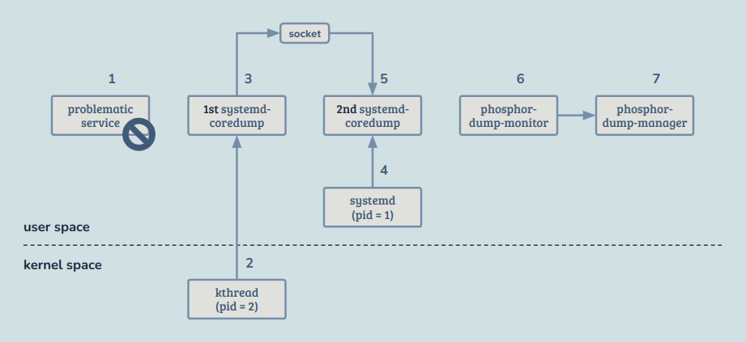
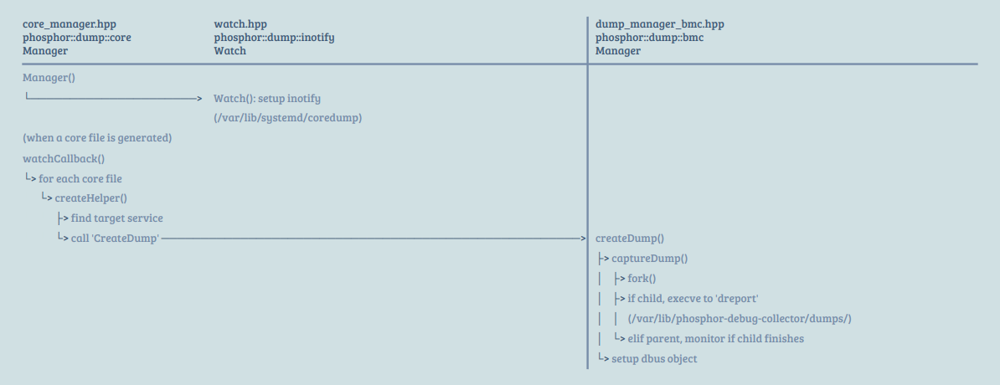

~> Study case: Aspeed OpenBMC (commit 8994be955087a76690d61daabe1834a5a2241992)

## Index

- [Introduction](#introduction)
- [Cheat Sheet](#cheat-sheet)
- [Reference](#reference)

## <a name="introduction"></a> Introduction

### Work Flow

<p align="center"></p>

1. Unexpectedly, a service crashes.
2. The kernel captures the exception, and `kthreadd` forks the initial `systemd-coredump`.
    - This behavior is dictated by the `/proc/sys/kernel/core_pattern`, configured by `50-coredump.conf`.
3. The kernel generates core data and sends it to the initial `systemd-coredump` via standard input, which then writes it to a socket monitored by `systemd`.
4. Leveraging the socket activation mechanism, `systemd` starts a second `systemd-coredump` instance.
5. This second instance receives the data from the socket and writes it to the filesystem at `/var/lib/systemd/coredump`.
6. `phosphor-dump-monitor` detects the creation of the core file and notifies `phosphor-dump-manager`.
7. `phosphor-dump-manager` forks `dreport`, which collects additional information and compresses it along with the core file, saving it to `/var/lib/phosphor-debug-collector/dumps`.

### Code Flow

<p align="center"></p>

<details><summary> More Details </summary>

### phosphor-dump-manager

```
dump_manager_main.cpp
```

```
refer to 'meson_options.txt' for path definitions                                                
dump_manager_main.cpp                                                                            
+------+                                                                                          
| main |                                                                                          
+-|----+                                                                                          
  |    +------------------+                                                                       
  |--> | sd_event_default | ???                                                                   
  |    +------------------+                                                                       
  |                                                                                               
  |--> prepare bmc_dump_manager and add to list                                                   
  |                                                                                               
  |--> prepare fault_log_manager and add to list                                                  
  |                                                                                               
  |    +----------------------+                                                                   
  |--> | dump::loadExtensions | do nothing                                                        
  |    +----------------------+                                                                   
  |                                                                                               
  |--> for each manager in list                                                                   
  |    |                                                                                          
  |    |    +------------------+                                                                  
  |    +--> | Manager::restore |                                                                  
  |         +------------------+                                                                  
  |                                                                                               
  |--> prepare eWatch                                                                             
  |    +--------------+                                                                           
  |    | Watch::Watch | register callbacks for interface events, read in file 'elogid' to variable
  |    +--------------+                                                                           
  |                                                                                               
  |--> request service 'xyz.openbmc_project.Dump.Manager'                                         
  |                                                                                               
  |    +---------------+                                                                          
  +--> | sd_event_loop | endless standby and work?                                                
       +---------------+                                                                          
```

```
+------------------+                                                                                     
| Manager::restore | : for each file in dump_dir, ensure they are in 'entries'                           
+-|----------------+                                                                                     
  |                                                                                                      
  |--> return if dump_dir doesn't exist or is empty                                                      
  |                                                                                                      
  |--> prepare iterator for the dir                                                                      
  |                                                                                                      
  +--> for each file in dump_dir                                                                         
       -                                                                                                 
       +--> if file name consists of digit only (otherwise we ignore it)                                 
            |                                                                                            
            |    +----------------------+                                                                
            +--> | Manager::createEntry | ensure there's the corresponding entry of arg file in 'entries'
                 +----------------------+                                                                
```

```
+----------------------+                                                                  
| Manager::createEntry | : ensure there's the corresponding entry of arg file in 'entries'
+-|--------------------+                                                                  
  |                                                                                       
  |--> return if arg file name doesn't match the pattern                                  
  |                                                                                       
  |--> get id from file name                                                              
  |                                                                                       
  |--> if id is in 'entries' already                                                      
  |    -                                                                                  
  |    +--> update info in 'entries'                                                      
  |                                                                                       
  +--> else                                                                               
       -                                                                                  
       +--> alloc entry and insert to 'entries'                                           
```

```
+--------------+                                                                             
| Watch::Watch | : register callbacks for interface events, read in file 'elogid' to variable
+-|------------+                                                                             
  |                                                                                          
  |--> prepare callbacks for interface addition and removal                                  
  |    +--------------------+                                                                
  |    | Watch::addCallback | fork a child running dreport                                   
  |    +--------------------+                                                                
  |    | Watch::delCallback | remove eid from elog_list, then serialize (?)                  
  |    +--------------------+                                                                
  |                                                                                          
  +--> if the file exists (/var/lib/phosphor-debug-collector/elogid)                         
       |                                                                                     
       |    +----------------------+                                                         
       +--> | logging::deserialize | read in file and archive to, e.g., elog_list            
            +----------------------+                                                         
```

```
+--------------------+                                                         
| Watch::addCallback | : fork a child running dreport                          
+-|------------------+                                                         
  |                                                                            
  |--> read msg                                                                
  |                                                                            
  |--> get eid and return if it's in the elog list already                     
  |                                                                            
  |--> find property "Message" of interface "xyz.openbmc_project.Logging.Entry"
  |                                                                            
  |--> given data, find error type                                             
  |                                                                            
  |--> return if the error type isn't support                                  
  |                                                                            
  |--> insert eid into elog list                                               
  |                                                                            
  |--> given error type, find item in bmc::TypeMap                             
  |                                                                            
  |    +-----------------+                                                     
  +--> | Manager::create | fork a child running dreport                        
       +-----------------+                                                     
```

```
+-----------------+                                                                              
| Manager::create | : fork a child running dreport                                               
+-|---------------+                                                                              
  |    +----------------------+                                                                  
  +--> | Manager::captureDump | : fork a child running dreport                                   
       +-|--------------------+                                                                  
         |                                                                                       
         |--> fork                                                                               
         |                                                                                       
         |--> if pid == 0 (the forked child)                                                     
         |    |                                                                                  
         |    |    +-------+ +---------+                                                         
         |    +--> | execl | | dreport | create archive of debug info files (including core file)
         |         +-------+ +---------+                                                         
         |                                                                                       
         |--> else (parent)                                                                      
         |    |    +--------------------+                                                        
         |    |    | sd_event_add_child | ???                                                    
         |    +--> +--------------------+                                                        
         |                                                                                       
         +--> update last_entry_id for next event                                                
```

```
+--------------------+                                                
| Watch::delCallback | : remove eid from elog_list, then serialize (?)
+-|------------------+                                                
  |                                                                   
  |--> read msg                                                       
  |                                                                   
  |--> get eid from obj_path                                          
  |                                                                   
  +--> if eid is in elog_list                                         
       |                                                              
       |--> erase it                                                  
       |                                                              
       |    +-----------------+                                       
       +--> | elog::serialize | ???                                   
            +-----------------+                                       
```

### phosphor-dump-monitor

```
core_manager_main.cpp
```

</details>

## <a name="cheat-sheet"></a> Cheat Sheet

- Build

```
# Add this line to my-test.bb
CXXFLAGS += " -no-pie"

# Add this line to build/conf/local.conf
IMAGE_INSTALL += "my-test"
```

- Debug

```
cd build

# The libraries for opkg are located here
export LD_LIBRARY_PATH=./tmp/work/x86_64-linux/opkg-native/0.6.2/recipe-sysroot-native/usr/lib/

MY_DEBUG_ROOT=tmp/rootfs-debug

# Retrieve the latest information for all packages.
./tmp/sysroots-components/x86_64/opkg-native/usr/bin/opkg -f ./tmp/work/ast2600_default-openbmc-linux-gnueabi/obmc-phosphor-image/1.0/opkg.conf -o $MY_DEBUG_ROOT update

# Install the target package to the local root filesystem for debugging.
fakeroot ./tmp/sysroots-components/x86_64/opkg-native/usr/bin/opkg -f ./tmp/work/ast2600_default-openbmc-linux-gnueabi/obmc-phosphor-image/1.0/opkg.conf -o $MY_DEBUG_ROOT install my-test my-test-dbg

gdb-multiarch

# When GDB interprets absolute paths, it prepends the specified prefix before searching.
(gdb) set solib-absolute-prefix .../tmp/rootfs-debug

# Add a search path for auto-load scripts.
(gdb) add-auto-load-safe-path .../tmp/rootfs-debug

(gdb) file tmp/rootfs-debug/usr/bin/my-test

(gdb) core-file obmcdump_31_1717709354/core.my-test.0.25fc9e2f99794302a107e0e7aafa1100.454.1717709350000000
```

- Related Paths

```
/var/lib/systemd/coredump
/var/lib/phosphor-debug-collector/dumps/
```

- ARM gdb build

```
# Add this line to build/conf/local.conf
EXTRA_IMAGE_FEATURES:append = " tools-debug"
```

## <a name="reference"></a> Reference

- [phosphor-debug-collector](https://github.com/openbmc/phosphor-debug-collector)
- [Debugging Tools and Techniques](https://docs.yoctoproject.org/dev-manual/debugging.html?highlight=launching+gdb+host+computer)
