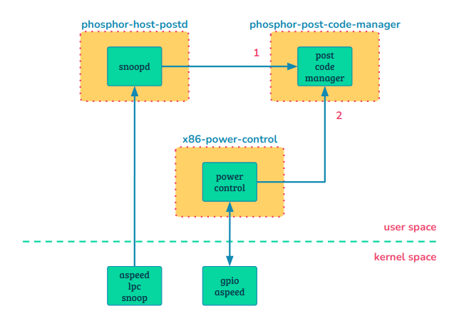

~> Study case: Aspeed OpenBMC (commit 8994be955087a76690d61daabe1834a5a2241992)

## Index

- [Introduction](#introduction)
- [Cheat Sheet](#cheat-sheet)
- [Reference](#reference)

## <a name="introduction"></a> Introduction

<p align="center"></p>

1. Whenever `snoopd` emits a signal of a post code update, the `post-code-manager` saves it to a list.
2. Whenever the host powers off, the `post-code-manager` clears the post code list.

## <a name="cheat-sheet"></a> Cheat Sheet

```
- Post code list path
/var/lib/phosphor-post-code-manager/host0

- Give ID, get post codes, e.g.,
busctl call xyz.openbmc_project.State.Boot.PostCode0 /xyz/openbmc_project/State/Boot/PostCode0 xyz.openbmc_project.State.Boot.PostCode GetPostCodes q 1

- Given ID, et post codes with timestamp
busctl call xyz.openbmc_project.State.Boot.PostCode0 /xyz/openbmc_project/State/Boot/PostCode0 xyz.openbmc_project.State.Boot.PostCode GetPostCodesWi
thTimeStamp q 1
```

## <a name="reference"></a> Reference
- [phosphor-host-postd](https://github.com/openbmc/phosphor-host-postd)
- [phosphor-post-code-manager](https://github.com/openbmc/phosphor-post-code-manager)
