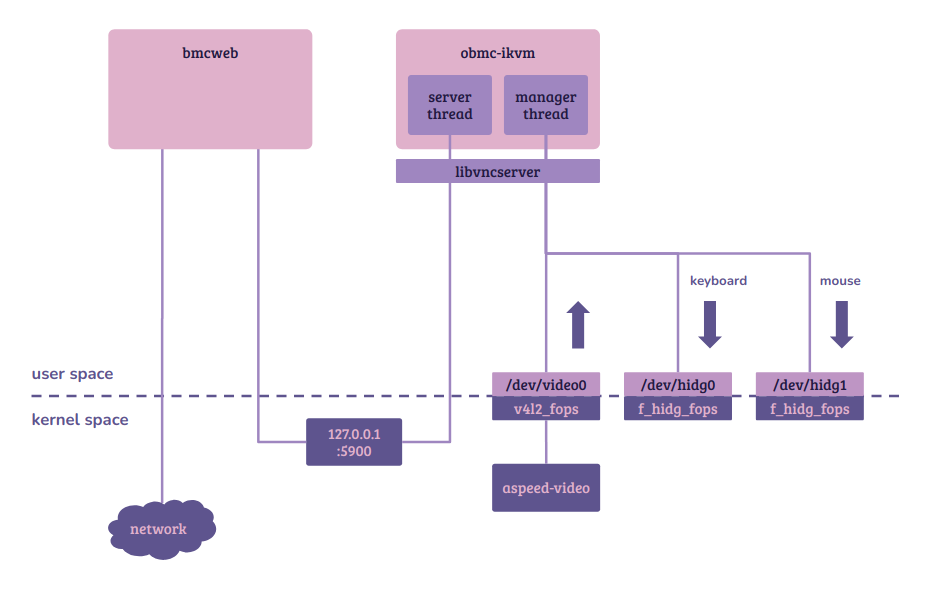
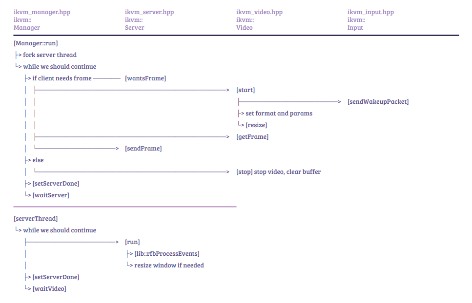

~> Study case: Aspeed OpenBMC (commit 8994be955087a76690d61daabe1834a5a2241992)

## Index

- [Introduction](#introduction)
- [Reference](#reference)

##  Introduction

### Work Flow

### Code Flow

##  Reference
- [OpenBMC IpKVM Server](https://github.com/openbmc/obmc-ikvm)
