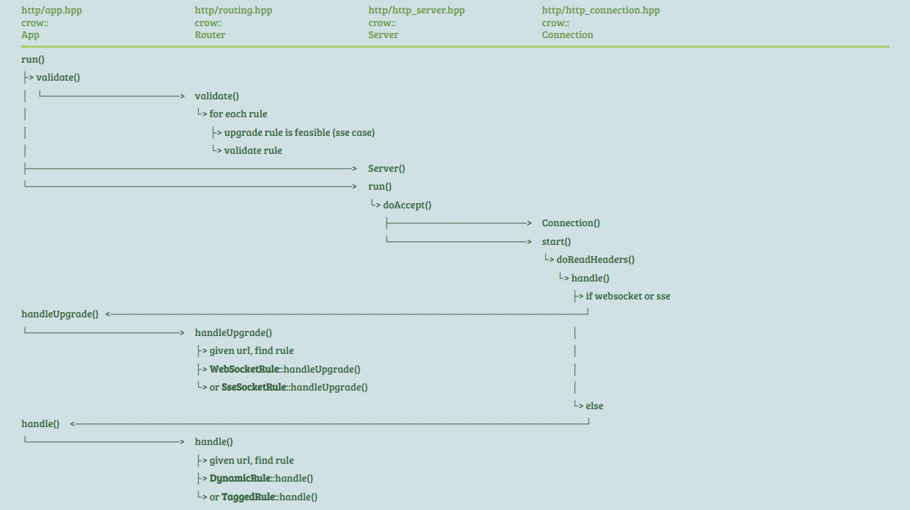

> Study case: Aspeed OpenBMC (commit 742fec782ef6c34c9fcd866116631e1d7aeedf8c)

## Index

- [Introduction](#introduction)
- [Code Flow](#code-flow)
- [Reference](#reference)

## <a name="introduction"></a> Introduction

Redfish is a standard that specifies RESTful APIs, enabling users to access various types of information and perform actions such as power operations and firmware updates.
The `bmcweb` package serves as an implementation of this standard, where handlers are registered for each predefined URL, internally referred to as `rules`. There are four main types of rules:

1. Dynamic rules:
   - Handle static assets like `.js` and `.html`, as well as web page-related resources provided by another package, `webui-vue`.
2. Tagged rules:
   - Cover the majority of URLs defined by Redfish.
3. WebSocket rules:
   - Allocate a WebSocket, functioning as a proxy for iKVM service towards clients.
4. SSE (Server-Sent Events) socket rules:
   - Facilitate server-sent events for real-time updates to clients.
 
Here are their registration flows during `bmcweb` initialization.


<details><summary> More Details </summary>

```
src/webserver_main.cpp
+-----+
| run | : register lots of uri handlers
+-|---+
  |    +--------------------------+
  |--> | webassets::requestRoutes | for each file (html, css, ...) under /usr/share/www/, determine (web_path, callback) and register to rules
  |    +--------------------------+
  |    +-------------------------+
  |--> | obmc_kvm::requestRoutes | configure and prepare ops for "/kvm/0"
  |    +-------------------------+
  |    +-------------------------+
  |--> | redfish::RedfishService | prepare redfish_service
  |    +-------------------------+
  |    +-------------------------+
  |--> | HttpClient::getInstance | get http-client handler
  |    +-------------------------+
  |    +----------------------------------+
  |--> | EventServiceManager::getInstance | get event-service-manager handler
  |    +----------------------------------+
  |    +-----------------------------+
  |--> | dbus_monitor::requestRoutes | configure and prepare ops for "/subscribe"
  |    +-----------------------------+
  |    +-----------------------------+
  |--> | image_upload::requestRoutes | configure and prepare ops for "/upload/image/<str>" and "/upload/image"
  |    +-----------------------------+
  |    +-------------------------------+
  |--> | openbmc_mapper::requestRoutes | configure and prepare ops for "/bus/", "/bus/system/", "/list/", "/xyz/<path>"
  |    +-------------------------------+                               "/org/<path>", "/download/dump/<str>/",
  |                                                                    "/bus/system/<str>/", "/bus/system/<str>/<path>"
  |    +-----------------------------+
  |--> | obmc_console::requestRoutes | configure and prepare ops for "/console0"
  |    +-----------------------------+
  |    +------------------------+
  +--> | obmc_vm::requestRoutes | configure and prepare ops for "/vm/0/0"
  |    +------------------------+
  |    +-----------------------------+
  |--> | login_routes::requestRoutes | configure and prepare ops for "/login"
  |    +-----------------------------+
  |    +-------------+
  |--> | setupSocket | get a socket and save in App obj
  |    +-------------+
  |    +--------------------------+
  |--> | nbd_proxy::requestRoutes | configure and prepare ops for "/nbd/<str>"
  |    +--------------------------+
  |    +-------------------------------------------+
  +--> | EventServiceManager::startEventLogMonitor | start event monitors on dir (/var/log) and file (/var/log/redfish)
  |    +-------------------------------------------+
  |    +------------------------------------------+
  +--> | hostname_monitor::registerHostnameSignal | register callback to hostname property change
  |    +------------------------------------------+
  |    +----------+
  +--> | App::run | prepare server/connection, authenticate, handle url
       +----------+
```

```
+--------------------------+                                                                                                             
| webassets::requestRoutes | : for each file (html, css, ...) under /usr/share/www/, determine (web_path, callback) and register to rules
+-|------------------------+                                                                                                             
  |                                                                                                                                      
  |--> types = css, html, js, png, woff, woff2, gif, ico                                                                                 
  |            ttf, svg, eot, xml, json, jpg, jpeg, map                                                                                  
  |                                                                                                                                      
  |--> root_path = "/usr/share/www/"                                                                                                     
  |                                                                                                                                      
  +--> for each item in paths                                                                                                            
       |                                                                                                                                 
       |--> if it's a hidden dir or symlink                                                                                              
       |    -                                                                                                                            
       |    +--> disable recursion                                                                                                       
       |                                                                                                                                 
       +--> elif it's a regular file                                                                                                     
            |                                                                                                                            
            |--> adjust web_path if necessary                                                                                            
            |                                                                                                                            
            |--> determine content_type                                                                                                  
            |                                                                                                                            
            |    +-------------------+                                                                                                   
            +--> | App::routeDynamic | prepare callback and register to rules                                                            
                 +-------------------+                                                                                                   
                     +------------------------------------------+                                                                        
                     |prepare response header                   |                                                                        
                     |                                          |                                                                        
                     |prepare body based on given absolute_path |                                                                        
                     +------------------------------------------+                                                                        
```

```
+-------------+                                              
| setupSocket | : get a socket and save in App obj           
+-|-----------+                                              
  |    +---------------+                                     
  |--> | sd_listen_fds | ???                                 
  |    +---------------+                                     
  |                                                          
  |--> if listen_fd == 1 (successful?)                       
  |    |                                                     
  |    |    +-------------------+                            
  |    |--> | sd_is_socket_inet | (check if socket is valid?)
  |    |    +-------------------+                            
  |    |                                                     
  |    |--> if valid (start webserver on socket)             
  |    |    |                                                
  |    |    |    +-------------+                             
  |    |    +--> | App::socket | save socket in obj          
  |    |         +-------------+                             
  |    |                                                     
  |    +--> else (start webserver on port)                   
  |         |                                                
  |         |    +-----------+                               
  |         +--> | App::port | save port (18080) in obj      
  |              +-----------+                               
  |                                                          
  +--> else                                                  
       |                                                     
       |    +-----------+                                    
       +--> | App::port | save port (18080) in obj           
            +-----------+                                    
```

```
+-------------------------------------------+                                                                     
| EventServiceManager::startEventLogMonitor | : start event monitors on dir (/var/log) and file (/var/log/redfish)
+-|-----------------------------------------+                                                                     
  |    +-------------------+                                                                                      
  |--> | inotify_add_watch | add watch to "/var/log"                                                              
  |    +-------------------+                                                                                      
  |    +-------------------+                                                                                      
  |--> | inotify_add_watch | add watch to "/var/log/redfish"                                                      
  |    +-------------------+                                                                                      
  |    +-----------------------------------------------+                                                          
  +--> | EventServiceManager::watchRedfishEventLogFile | add watcher (for dir) or send out event logs (for file)  
       +-----------------------------------------------+                                                          
```

```
+-----------------------------------------------+                                                                                          
| EventServiceManager::watchRedfishEventLogFile | : add watcher (for dir) or send out event logs (for file)                                
+-|---------------------------------------------+                                                                                          
  |                                                                                                                                        
  +--> ->async_read_some                                                                                                                   
          +-------------------------------------------------------------------------------------------------------------------------------+
          |while we haven't handled all the data                                                                                          |
          ||                                                                                                                              |
          ||--> if the event is dir_watch_desc                                                                                            |
          ||    |                                                                                                                         |
          ||    |--> if it's about 'create'                                                                                               |
          ||    |    |                                                                                                                    |
          ||    |    |    +------------------+                                                                                            |
          ||    |    |--> | inotify_rm_watch | remove existing watcher                                                                    |
          ||    |    |    +------------------+                                                                                            |
          ||    |    |    +-------------------+                                                                                           |
          ||    |    |--> | inotify_add_watch | add new watcher for redfish-event-log file                                                |
          ||    |    |    +-------------------+                                                                                           |
          ||    |    |    +-----------------------------------------------+                                                               |
          ||    |    |--> | EventServiceManager::resetRedfishFilePosition | reset file offset                                             |
          ||    |    |    +-----------------------------------------------+                                                               |
          ||    |    |    +--------------------------------------------+                                                                  |
          ||    |    +--> | EventServiceManager::readEventLogsFromFile | read msg from files, prepare json format and send out event logs |
          ||    |         +--------------------------------------------+                                                                  |
          ||    |                                                                                                                         |
          ||    +--> elif 'delete' or 'move to'                                                                                           |
          ||         |                                                                                                                    |
          ||         |    +------------------+                                                                                            |
          ||         +--> | inotify_rm_watch | remove existing watcher                                                                    |
          ||              +------------------+                                                                                            |
          ||                                                                                                                              |
          |+--> elif the event is file_watch_desc                                                                                         |
          |     -                                                                                                                         |
          |     +--> if it's about 'modify'                                                                                               |
          |          |                                                                                                                    |
          |          |    +--------------------------------------------+                                                                  |
          |          +--> | EventServiceManager::readEventLogsFromFile | read msg from files, prepare json format and send out event logs |
          |               +--------------------------------------------+                                                                  |
          |+-----------------------------------------------+                                                                              |
          || EventServiceManager::watchRedfishEventLogFile | (recursive)                                                                  |
          |+-----------------------------------------------+                                                                              |
          +-------------------------------------------------------------------------------------------------------------------------------+
```

```
+--------------------------------------------+                                                                   
| EventServiceManager::readEventLogsFromFile | : read msg from files, prepare json format and send out event logs
+-|------------------------------------------+                                                                   
  |                                                                                                              
  |--> open file "/var/log/redfish"                                                                              
  |                                                                                                              
  |--> move file offset to the next log to be read                                                               
  |                                                                                                              
  |--> while we get still read a line                                                                            
  |    |                                                                                                         
  |    |--> update file offset                                                                                   
  |    |                                                                                                         
  |    |    +-----------------------------+                                                                      
  |    |--> | event_log::getUniqueEntryID | given current timestamp, determine entry id                          
  |    |    +-----------------------------+                                                                      
  |    |    +------------------------------+                                                                     
  |    |--> | event_log::getEventLogParams | get msg_id and timestamp from log_entry                             
  |    |    +------------------------------+                                                                     
  |    |    +-------------------------------------+                                                              
  |    |--> | event_log::getRegistryAndMessageKey | get registry_name and msg_key from msg_id                    
  |    |    +-------------------------------------+                                                              
  |    |                                                                                                         
  |    +--> save the msg attributes in 'eventRecords'                                                            
  |                                                                                                              
  |    +---------------------------------------------------+                                                     
  |--> | EventServiceManager::deleteTerminatedSubcriptions | delete terminated subscriptions                     
  |    +---------------------------------------------------+                                                     
  |                                                                                                              
  +--> for each entry in subscriptions_map                                                                       
       -                                                                                                         
       +--> if format_type is 'event'                                                                            
            |                                                                                                    
            |    +--------------------------------------+                                                        
            +--> | Subscription::filterAndSendEventLogs | prepare json format and send out event logs            
                 +--------------------------------------+                                                        
```

```
+-----------------------------+                                              
| event_log::getUniqueEntryID | : given current timestamp, determine entry id
+-|---------------------------+                                              
  |                                                                          
  |--> get timestamp from log entry                                          
  |                                                                          
  |--> increment index if curr_timestamp == prev_timestamp                   
  |                                                                          
  |--> prev_timestamp = curr_timestamp                                       
  |                                                                          
  +--> determine entry_id: <curr_timestamp>_<index>                          
```

```
+---------------------------------------------------+                                                                                                   
| EventServiceManager::deleteTerminatedSubcriptions | : delete terminated subscriptions                                                                 
+-|-------------------------------------------------+                                                                                                   
  |                                                                                                                                                     
  |--> for each item in subscriptions_map                                                                                                               
  |    -                                                                                                                                                
  |    +--> if it's terminated                                                                                                                          
  |         -                                                                                                                                           
  |         +--> add to delete_ids                                                                                                                      
  |                                                                                                                                                     
  |--> for each id in delete_ids                                                                                                                        
  |    |                                                                                                                                                
  |    |--> given id, get item from subscriptions_map                                                                                                   
  |    |                                                                                                                                                
  |    |--> erase it from subscriptions_map & subscriptions_config_map                                                                                  
  |    |                                                                                                                                                
  |    |    +-----------------+                                                                                                                         
  |    +--> | sd_journal_send | log event for subscription deletion                                                                                     
  |         +-----------------+                                                                                                                         
  |                                                                                                                                                     
  +--> if delete_ids does have something                                                                                                                
       |                                                                                                                                                
       |    +-------------------------------------------------+                                                                                         
       |--> | EventServiceManager::updateNoOfSubscribersCount | if we still have subscriber(s), register callback for metric_report, otherwise cancel it
       |    +-------------------------------------------------+                                                                                         
       |    +----------------------------------------------+                                                                                            
       +--> | EventServiceManager::persistSubscriptionData | prepare json data and write to persistent file                                             
            +----------------------------------------------+                                                                                            
```

```
+-------------------------------------------------+                                                                                           
| EventServiceManager::updateNoOfSubscribersCount | : if we still have subscriber(s), register callback for metric_report, otherwise cancel it
+-|-----------------------------------------------+                                                                                           
  |                                                                                                                                           
  |--> for each item in subscriptions_map                                                                                                     
  |    -                                                                                                                                      
  |    +--> update statistics                                                                                                                 
  |                                                                                                                                           
  |--> if we still have subscribers                                                                                                           
  |    |                                                                                                                                      
  |    |    +-------------------------------------------------+                                                                               
  |    +--> | EventServiceManager::registerMetricReportSignal | register callback for metric_report                                           
  |         +-------------------------------------------------+                                                                               
  |                                                                                                                                           
  +--> else                                                                                                                                   
       |                                                                                                                                      
       |    +---------------------------------------------------+                                                                             
       +--> | EventServiceManager::unregisterMetricReportSignal | unregister callback for metric_report                                       
            +---------------------------------------------------+                                                                             
```

```
+-------------------------------------------------+                                      
| EventServiceManager::registerMetricReportSignal | : register callback for metric_report
+-|-----------------------------------------------+                                      
  |                                                                                      
  |--> prepare match rule and callback                                                   
  |                                                                                      
  |    +-------------------------------------------+                                     
  +--> | EventServiceManager::getReadingsForReport | get readings for report             
       +-------------------------------------------+                                     
```

```
+-------------------------------------------+                                          
| EventServiceManager::getReadingsForReport | : get readings for report                
+-|-----------------------------------------+                                          
  |                                                                                    
  |--> get info from msg                                                               
  |                                                                                    
  |    +---------------------------------------------------+                           
  |--> | EventServiceManager::deleteTerminatedSubcriptions | (recursive)               
  |    +---------------------------------------------------+                           
  |                                                                                    
  +--> for each entry in subscriptions_map                                             
       -                                                                               
       +--> if format_type is metric_report                                            
            |                                                                          
            |    +------------------------------------+                                
            +--> | Subscription::filterAndSendReports | if not filtered out, send event
                 +------------------------------------+                                
```

```
+----------------------------------------------+                                                 
| EventServiceManager::persistSubscriptionData | : prepare json data and write to persistent file
+-|--------------------------------------------+                                                 
  |                                                                                              
  |--> set up service_config attributes                                                          
  |                                                                                              
  |    +-----------------------+                                                                 
  +--> | ConfigFile::writeData | prepare json data and write to persistent file                  
       +-----------------------+                                                                 
```

```
+-----------------------+                                                 
| ConfigFile::writeData | : prepare json data and write to persistent file
+-|---------------------+                                                 
  |                                                                       
  |--> prepare json data                                                  
  |                                                                       
  |--> for each auth_tokens                                               
  |    -                                                                  
  |    +--> save in sessions                                              
  |                                                                       
  |--> for each subscriptions_config_map                                  
  |    |                                                                  
  |    |--> for each header                                               
  |    |    -                                                             
  |    |    +--> save value in haders                                     
  |    |                                                                  
  |    +--> save attributes in subscriptions                              
  |                                                                       
  +--> write data to persistent_file                                      
```

```
+--------------------------------------+                                              
| Subscription::filterAndSendEventLogs | : prepare json format and send out event logs
+-|------------------------------------+                                              
  |                                                                                   
  |--> for each log_entry in event_records                                            
  |    |                                                                              
  |    |--> get attributes from log_entry                                             
  |    |                                                                              
  |    |--> continue if this log_entry is filtered out                                
  |    |                                                                              
  |    |--> add log_entry to log_entry_array                                          
  |    |                                                                              
  |    |    +--------------------------------+                                        
  |    +--> | event_log::formatEventLogEntry | format log_entry as json data          
  |         +--------------------------------+                                        
  |                                                                                   
  |--> prepare msg in json format                                                     
  |                                                                                   
  +--> ->sendEvent                                                                    
```

```
+------------------------------------------+                                                       
| hostname_monitor::registerHostnameSignal | : register callback to hostname property change       
+-|----------------------------------------+                                                       
  |                                                                                                
  +--> prepare match rule and callback                                                             
          +---------------------------------------------------------------------------------------+
          |+------------------------------------+                                                 |
          || hostname_monitor::onPropertyUpdate | load certificate and verify it, install to dbus |
          |+------------------------------------+                                                 |
          +---------------------------------------------------------------------------------------+
```

```
+------------------------------------+                                                  
| hostname_monitor::onPropertyUpdate | : load certificate and verify it, install to dbus
+-|----------------------------------+                                                  
  |                                                                                     
  |--> read msg                                                                         
  |                                                                                     
  |--> load certificate ("/etc/ssl/certs/https/server.pem")                             
  |                                                                                     
  |    +-----------------+                                                              
  |--> | X509_get_pubkey | get public key                                               
  |    +-----------------+                                                              
  |    +-------------+                                                                  
  |--> | X509_verify |                                                                  
  |    +-------------+                                                                  
  |    +-----------------------------------+                                            
  |--> | ensuressl::generateSslCertificate | "/tmp/hostname_cert.tmp"                   
  |    +-----------------------------------+                                            
  |    +--------------------------------------+                                         
  +--> | hostname_monitor::installCertificate | install certificate to dbus             
       +--------------------------------------+                                         
```

```
http/app.hpp                                                      
+----------+                                                       
| App::run | : prepare server/connection, authenticate, handle url 
+-|--------+                                                       
  |    +---------------+                                           
  |--> | App::validate | (skip)                                    
  |    +---------------+                                           
  |                                                                
  |--> prepare 'ssl_server_t'                                      
  |                                                                
  |    +-------------+                                             
  +--> | Server::run | prepare connection, authenticate, handle url
       +-------------+                                             
```

```
http/http_server.hpp                                           
+-------------+                                                 
| Server::run | : prepare connection, authenticate, handle url  
+-|-----------+                                                 
  |    +-----------------+                                      
  |--> | loadCertificate | (skip)                               
  |    +-----------------+                                      
  |    +---------------+                                        
  |--> | updateDateStr | (skip)                                 
  |    +---------------+                                        
  |    +-------------------------+                              
  |--> | startAsyncWaitForSignal | (skip)                       
  |    +-------------------------+                              
  |    +----------+                                             
  +--> | doAccept | prepare connection, authenticate, handle url
       +----------+                                             
```

```
http/http_server.hpp                                                     
+----------+                                                              
| doAccept | : prepare connection, authenticate, handle url               
+-|--------+                                                              
  |                                                                       
  |--> prepare 'Connection'                                               
  |                                                                       
  +--> ->async_accept                                                     
          +--------------------------------------------------------------+
          |+-------------------+                                         |
          || Connection::start | get client ip, authenticate, handle url |
          |+-------------------+                                         |
          |+----------+                                                  |
          || doAccept | for next one                                     |
          |+----------+                                                  |
          +--------------------------------------------------------------+
```

```
http/http_connection.hpp                                                   
+-------------------+                                                       
| Connection::start | : get client ip, authenticate, handle url             
+-|-----------------+                                                       
  |    +---------------------------+                                        
  |--> | Connection::startDeadline |                                        
  |    +---------------------------+                                        
  |    +---------------------------+                                        
  +--> | Connection::doReadHeaders | get client ip, authenticate, handle url
       +---------------------------+                                        
```

```
http/http_connection.hpp                                                         
+---------------------------+                                                     
| Connection::doReadHeaders | : get client ip, authenticate, handle url           
+-|-------------------------+                                                     
  |                                                                               
  +--> http::async_read_header                                                    
          +----------------------------------------------------------------------+
          |+---------------------------------+                                   |
          || Connection::cancelDeadlineTimer |                                   |
          |+---------------------------------+                                   |
          |+--------------------------+                                          |
          || Connection::readClientIp |                                          |
          |+--------------------------+                                          |
          |+------------------------------+                                      |
          || authentication::authenticate | try all kinds of auth till it passes |
          |+------------------------------+                                      |
          |+---------------------+                                               |
          || Connectioin::doRead | get client ip, print request info, handle url |
          |+---------------------+                                               |
          +----------------------------------------------------------------------+
```

```
include/authentication.hpp                                            
+------------------------------+                                       
| authentication::authenticate | : try all kinds of auth till it passes
+-|----------------------------+                                       
  |                                                                    
  |--> ge auth_methods_config                                          
  |                                                                    
  |--> if config has tls                                               
  |    -    +----------------+                                         
  |    +--> | performTLSAuth | (skip)                                  
  |         +----------------+                                         
  |                                                                    
  |--> if not pass yet && config has xtoken                            
  |    -    +-------------------+                                      
  |    +--> | performXtokenAuth | (skip)                               
  |         +-------------------+                                      
  |                                                                    
  |--> if not pass yet && config has cookie                            
  |    -    +-------------------+                                      
  |    +--> | performCookieAuth | (skip)                               
  |         +-------------------+                                      
  |                                                                    
  |--> if not pass yet && config has session_token                     
  |    -    +------------------+                                       
  |    +--> | performTokenAuth | (skip)                                
  |         +------------------+                                       
  |                                                                    
  +--> if not pass yet && config has basic                             
       -    +------------------+                                       
       +--> | performBasicAuth | (skip)                                
            +------------------+                                       
```

```
http/http_connection.hpp                                                        
+--------------------+                                                           
| Connection::doRead | : get client ip, print request info, handle url           
+-|------------------+                                                           
  |                                                                              
  +--> http::async_read                                                          
          +---------------------------------------------------------------------+
          |+---------------------------------+                                  |
          || Connection::cancelDeadlineTimer | (skip)                           |
          |+---------------------------------+                                  |
          |+--------------------+                                               |
          || Connection::handle | get client ip, print request info, handle url |
          |+--------------------+                                               |
          +---------------------------------------------------------------------+
```

```
http/http_connection.hpp                                             
+--------------------+                                                
| Connection::handle | : get client ip, print request info, handle url
+-|------------------+                                                
  |    +--------------------------+                                   
  |--> | Connection::readClientIp |                                   
  |    +--------------------------+                                   
  |                                                                   
  |--> print request info (need to enable macro first)                
  |                                                                   
  |    +-------------+                                                
  +--> | App::handle | given url, find matched rule and handle the url
       +-------------+                                                
```

```
http/app.hpp                                                             
+-------------+                                                           
| App::handle | : given url, find matched rule and handle the url         
+-|-----------+                                                           
  |    +-----------------+                                                
  +--> | Rounter::handle | given url, find matched rule and handle the url
       +-----------------+                                                
```

```
http/routing.hpp                                                       
+----------------+                                                      
| Router::handle | : given url, find matched rule and handle the url    
+-|--------------+                                                      
  |    +-----------+                                                    
  |--> | findRoute | find rule method for later url handling            
  |    +-----------+                                                    
  |                                                                     
  |--> print match_rule info, e.g., '/login'                            
  |                                                                     
  +--> dbus-method call                                                 
          +----------------------------------------------+              
          |service: "xyz.openbmc_project.User.Manager"   |              
          |object: "/xyz/openbmc_project/user"           |              
          |interface: "xyz.openbmc_project.User.Manager" |              
          |method: "GetUserInfo"                         |              
          +------------------------------------------------------------+
          |check user attributes: privilege, remote, expired password? |
          |                                                            |
          |rule.handle                                                 |
          |(e.g., registered method in include/login_routes.hpp)       |
          +------------------------------------------------------------+
```

### redfish

```
redfish-core/lib/update_service.hpp                                                            
+----------------------------+                                                                  
| requestRoutesUpdateService | : prepare get/patch/post methods for '/redfish/v1/UpdateService/'
+-|--------------------------+                                                                  
  |                                                                                             
  |--> prepare 'get' method for /redfish/v1/UpdateService/                                      
  |       +-----------------------------+                                                       
  |       |fill response in json format |                                                       
  |       +-----------------------------+                                                       
  |                                                                                             
  |--> prepare 'patch' method for /redfish/v1/UpdateService/                                    
  |       +-------------------------------------------------------------------------+           
  |       |read 'HttpPushUriOptions', 'HttpPushUriApplyTime', 'ApplyTime' from json |           
  |       |                                                                         |           
  |       |prepare value based on 'ApplyTime' (Immediate or OnReset)                |           
  |       |                                                                         |           
  |       |call service: xyz.openbmc_project.Settings                               |           
  |       |     object: /xyz/openbmc_project/software/apply_time                    |           
  |       |     iface: org.freedesktop.DBus.Properties                              |           
  |       |     method: Set                                                         |           
  |       +-------------------------------------------------------------------------+           
  |                                                                                             
  |--> prepare 'post' method for /redfish/v1/UpdateService/                                     
  |       +--------------------------------------------------+                                  
  |       |+-------------------------+                       |                                  
  |       || handleUpdateServicePost | handle uploaded image |                                  
  |       |+-------------------------+                       |                                  
  |       +--------------------------------------------------+                                  
  |                                                                                             
  +--> prepare 'post' method for /redfish/v1/UpdateService/update/                              
          +--------------------------------------------------+                                  
          |+-------------------------+                       |                                  
          || handleUpdateServicePost | handle uploaded image |                                  
          |+-------------------------+                       |                                  
          +--------------------------------------------------+                                  
```

```
redfish-core/lib/update_service.hpp                               
+-------------------------+                                        
| handleUpdateServicePost | : handle uploaded image                
+-|-----------------------+                                        
  |    +-----------------------------+                             
  |--> | monitorForSoftwareAvailable | monitor 'available software'
  |    +-----------------------------+                             
  |                                                                
  +--> save request body to /tmp/images/ as uploaded image         
```

```
redfish-core/lib/update_service.hpp                               
+-----------------------------+                                    
| monitorForSoftwareAvailable | : monitor 'available software'     
+-|---------------------------+                                    
  |                                                                
  |--> return if fw_update_in_progress                             
  |                                                                
  |--> prepare match rule & callback                               
  |       +-------------------------------------------------------+
  |       |+------------------------+                             |
  |       || softwareInterfaceAdded | activate image through dbus |
  |       |+------------------------+                             |
  |       +-------------------------------------------------------+
  |                                                                
  +--> prepare match rule & callback                               
          +----------------------------------------------------+   
          |for each iface                                      |   
          |-                                                   |   
          |+--> if it's xyz.openbmc_project.Logging.Entry      |   
          |     -                                              |   
          |     +--> for each value                            |   
          |          -                                         |   
          |          +--> set up redfish msg according to type |   
          +----------------------------------------------------+   
```

```
redfish-core/lib/update_service.hpp                                                          
+------------------------+                                                                    
| softwareInterfaceAdded | : activate image through dbus                                      
+-|----------------------+                                                                    
  |                                                                                           
  |--> read iface_properties from msg                                                         
  |                                                                                           
  +--> for each ifrace                                                                        
       -                                                                                      
       +--> if it's xyz.openbmc_project.Software.Activation                                   
            |                                                                                 
            |--> ->async_method_call                                                          
            |       +------------------------------------------------------------------------+
            |       |+---------------+                                                       |
            |       || activateImage | call dbus method to activate image                    |
            |       |+---------------+                                                       |
            |       |                                                                        |
            |       |if async_resp is provided                                               |
            |       ||                                                                       |
            |       ||--> prepare task                                                       |
            |       ||       +--------------------------------------------------------------+|
            |       ||       |read msg                                                      ||
            |       ||       |                                                              ||
            |       ||       |if iface == xyz.openbmc_project.Software.Activation           ||
            |       ||       |-                                                             ||
            |       ||       |+--> given state, set up task data                            ||
            |       ||       |                                                              ||
            |       ||       |elif iface == xyz.openbmc_project.Software.ActivationProgress ||
            |       ||       |-                                                             ||
            |       ||       |+--> set up task data                                         ||
            |       ||       +--------------------------------------------------------------+|
            |       ||                                                                       |
            |       |+--> let task start work                                                |
            |       +------------------------------------------------------------------------+
            |       |service: xyz.openbmc_project.ObjectMapper                               |
            |       |object: /xyz/openbmc_project/object_mapper                              |
            |       |iface: xyz.openbmc_project.ObjectMapper                                 |
            |       |method: GetObject                                                       |
            |       +------------------------------------------------------------------------+
            |                                                                                 
            +--> break                                                                        
```

```
redfish-core/lib/update_service.hpp                             
+---------------+                                                
| activateImage | : call dbus method to activate image           
+-|-------------+                                                
  |                                                              
  +--> ->async_method_call service: "xyz.openbmc_project.Software.Activation"
                           object: "/xyz/openbmc_project/software/<id>"
                           iface: org.freedesktop.DBus.Properties
                           Set "RequestedActivation" = "xyz.openbmc_project.Software.Activation.RequestedActivations.Active"
```

</details>

## <a name="code-flow"></a> Code Flow

- Request Handling

<p align="center"></p>

## <a name="reference"></a> Reference

- [OpenBMC webserver](https://github.com/openbmc/bmcweb)
