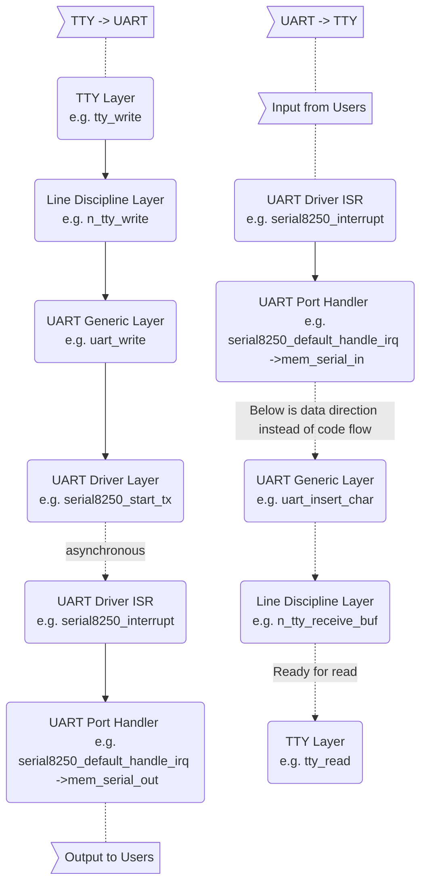
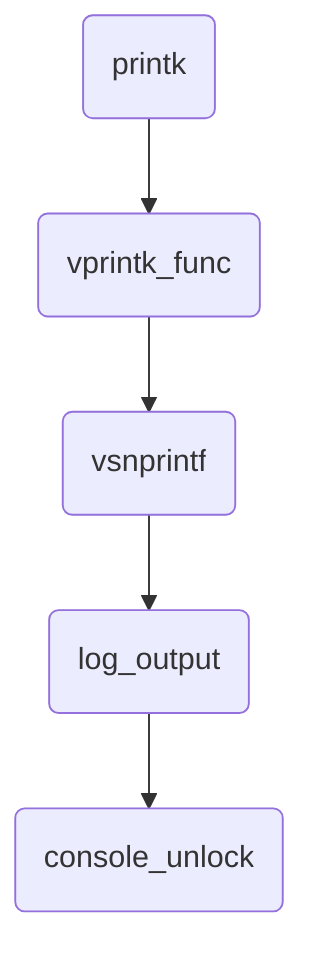

> Study case: Linux version 5.15.69 on OpenBMC

## Index

- [Introduction](#introduction)
- [GPIO Chip](#gpio-chip)
- [Pin Control](#pin-control)
- [System Startup](#system-startup)
- [Cheat Sheet](#cheat-sheet)
- [Reference](#reference)

1. [Introduction](#introduction)
2. [TTY Types](#tty-types)
3. [TTY <-> UART](#tty-uart)
5. [Mechanism of printk](#mechanism-of-printk)
6. [Kernel Boot Arguments](#kernel-boot-arguments)
7. [Conclusion](#conclusion)


## <a name="introduction"></a> Introduction

Console is the interface that users interact with systems through. 
In the old days, computers were expensive and many users shared one and accessed it by terminals, 
which were composed of small screens and teletypewriters (TTY). 
Nowadays it has become legacy but we can still see it on common OS. 
There are also pseudo TTYs shown when people access consoles in GUI desktop, or operate remote machines by SSH. 
On embedded systems, it's common that developers type commands through serial port interface (UART).
The following notes are based on OpenBMC@QEMU and Raspberry Pi 4.

## <a name="tty-types"></a> TTY Types
Device Name       | Description
--                | --
tty1 ~ n          | Command line interface. On Raspberry Pi, Ctrl + Alt + F1 ~ F6 can switch to corresponding TTY 
ptmx & pts/0 ~ n  | Pseudo TTY, responsible for GUI and SSH consoles
ttyS0 ~ n         | It means serial console and each represents one UART within chip
ttyAMA0 ~ n       | ARM serial console?
ttyUSB0 ~ n       | Serial cable with USB interface. E.g. Plug in the USB-to-TTL cable to Raspberry Pi and you can see one
ttyprintk         | Redirect message to this file and then it can be displayed by command 'dmesg'
tty               | Conceptually it's like a link that always points to the TTY device of current task
console           | In terms of results, it represents the one specified by the kernel boot argument 'console=', which is ttyS4 in my case

## <a name="tty-uart"></a> TTY <-> UART

By default, each user space task has the first three file descriptors used for stdin/stdout/stderr. Issue below command to inspect which TTY devices are used.
```
ls -l /proc/$$/fd
```

```
In serial console:
root@romulus:~# ls -l /proc/$$/fd
lrwx------    1 root     root            64 Jul 27 15:25 0 -> /dev/ttyS4
lrwx------    1 root     root            64 Jul 27 15:25 1 -> /dev/ttyS4
lrwx------    1 root     root            64 Jul 27 15:25 2 -> /dev/ttyS4
lrwx------    1 root     root            64 Jul 27 15:25 255 -> /dev/ttyS4

In SSH console:
root@romulus:~# ls -l /proc/$$/fd
lrwx------    1 root     root            64 Jul 27 15:26 0 -> /dev/pts/0
lrwx------    1 root     root            64 Jul 27 15:26 1 -> /dev/pts/0
lrwx------    1 root     root            64 Jul 27 15:26 2 -> /dev/pts/0
lrwx------    1 root     root            64 Jul 27 15:26 255 -> /dev/pts/0
```

Below are the flowcharts showing how data is output to or input from users.



## <a name="system-startup"></a> System Startup

```
param_setup_earlycon:   set up early console
console_setup:          parse 'console=xxx,yyy', add as preferred console 
proc_consoles_init:     create /proc/consoles
chr_dev_init
   tty_init:            init char devices for tty and console
aspeed_uart_routing_driver_init: register 'aspeed_uart_routing_driver' to bus 'platform'
serial8250_init
aspeed_vuart_driver_init
of_platform_serial_driver_init
mctp_serial_init
usb_serial_init
usb_serial_module_init
init_netconsole
univ8250_console_initcon
```

```
drivers/tty/serial/earlycon.c                                       
+----------------------+                                             
| param_setup_earlycon | : set up early console                      
+-|--------------------+                                             
  |                                                                  
  |--> if no buf (it is 'earlycon' alone)                            
  |    |                                                             
  |    |    +----------------------------------+                     
  |    |--> | early_init_dt_scan_chosen_stdout | set up early console
  |    |    +----------------------------------+                     
  |    |                                                             
  |    +--> return                                                   
  |                                                                  
  |    +----------------+                                            
  +--> | setup_earlycon | （skip, it is for case of 'earlycon=???')   
       +----------------+                                            
```

```
drivers/of/fdt.c                                                                                                     
+----------------------------------+                                                                                  
| early_init_dt_scan_chosen_stdout | ： set up early console                                                           
+-|--------------------------------+                                                                                  
  |                                                                                                                   
  |--> get node '/chosen'                                                                                             
  |                                                                                                                   
  |--> get property 'stdout-path'                                                                                     
  |                                                                                                                   
  |--> based on property value, get node, e.g., 'serial@1e784000'                                                     
  |                                                                                                                   
  +--> for each entry in '__earlycon_table' (drivers/tty/serial/8250/8250_early.c)                                    
       |                                                                                                              
       |--> if entry has no 'compatible' field, continue                                                              
       |                                                                                                              
       |    +---------------------------+                                                                             
       |--> | fdt_node_check_compatible | check if entry can handle the earlycon                                      
       |    +---------------------------+                                                                             
       |                                                                                                              
       |--> if not, continue                                                                                          
       |                                                                                                              
       |    +-------------------+                                                                                     
       +--> | of_setup_earlycon | iomap, handle dt properties, set up uart/ops, register console, print out queued log
            +-------------------+          
            
chosen {
   stdout-path = "/ahb/apb/serial@1e784000"; <----------
   bootargs = "console=ttyS4,115200 earlycon";
};

serial@1e784000 {
    compatible = "ns16550a"; <----------
    reg = <0x1e784000 0x20>;
    reg-shift = <0x02>;
    interrupts = <0x0a>;
    clocks = <0x02 0x0f>;
    no-loopback-test;
    status = "okay";
};

drivers/tty/serial/8250/8250_early.c
   EARLYCON_DECLARE(uart8250, early_serial8250_setup);
   EARLYCON_DECLARE(uart, early_serial8250_setup);
   OF_EARLYCON_DECLARE(ns16550, "ns16550", early_serial8250_setup);
   OF_EARLYCON_DECLARE(ns16550a, "ns16550a", early_serial8250_setup); <----------
   OF_EARLYCON_DECLARE(uart, "nvidia,tegra20-uart", early_serial8250_setup);
   OF_EARLYCON_DECLARE(uart, "snps,dw-apb-uart", early_serial8250_setup);
```

```
drivers/tty/serial/earlycon.c                                                                              
+-------------------+                                                                                       
| of_setup_earlycon | : iomap, handle dt properties, set up uart/ops, register console, print out queued log
+-|-----------------+                                                                                       
  |    +------------------------------+                                                                     
  |--> | of_flat_dt_translate_address | translate reg addr from given node, e.g., 'serial@1e784000'         
  |    +------------------------------+                                                                     
  |                                                                                                         
  |--> handle other dt properties                                                                           
  |                                                                                                         
  |--> if options (baud rate) is provided, save it in early_console_dev                                     
  |                                                                                                         
  |    +---------------+                                                                                    
  |--> | earlycon_init | parse string to determine idx                                                      
  |    +---------------+                                                                                    
  |                                                                                                         
  |--> call ->setup(), e.g.,                                                                                
  |    +------------------------+                                                                           
  |    | early_serial8250_setup | set up uart and install ops                                               
  |    +------------------------+                                                                           
  |                                                                                                         
  |    +---------------------+                                                                              
  |--> | earlycon_print_info | print, e.g., "earlycon: ns16550a0 at MMIO 0x1e784000 (options '')"           
  |    +---------------------+                                                                              
  |    +------------------+                                                                                 
  +--> | register_console | add console to 'console_drivers', print out queued log                          
       +------------------+                                                                                 
```

```
drivers/tty/serial/8250/8250_early.c                                         
+------------------------+                                                    
| early_serial8250_setup | : set up uart and install ops                      
+-|----------------------+                                                    
  |                                                                           
  |--> if dev hasn't specified baud rate                                      
  |    -                                                                      
  |    +--> read/write hw reg to setup uart                                   
  |                                                                           
  |--> else (not our case)                                                    
  |    |                                                                      
  |    |    +-----------+                                                     
  |    +--> | init_port | read/write hw reg to config baud rate and setup uart
  |         +-----------+                                                     
  |                                                                           
  +--> install ops                                                            
       +------------------------+                                             
       | early_serial8250_write | write each char in string to hw reg         
       +-----------------------++                                             
       | early_serial8250_read | (null bc of disabled config)                 
       +-----------------------+                                              
```

```
drivers/tty/serial/8250/8250_early.c                                              
+------------------------+                                                         
| early_serial8250_write | : write each char in string to hw reg                   
+-|----------------------+                                                         
  |    +--------------------+                                                      
  +--> | uart_console_write | : write each char in string to hw reg                
       +-|------------------+                                                      
         |                                                                         
         +--> for each char in string                                              
              -                                                                    
              +--> call arg putchar(), e.g.,                                       
                   +-------------+                                                 
                   | serial_putc | write 'c' to tx reg, wait till status shows done
                   +-------------+                                                 
```

```
kernel/printk/printk.c                                                                                          
+------------------+                                                                                             
| register_console | : add console to 'console_drivers', print out queued log                                    
+-|----------------+                                                                                             
  |                                                                                                              
  |--> ensure we have a preferred console                                                                        
  |                                                                                                              
  |    +------------------------+                                                                                
  |--> | try_enable_new_console | try to match new_con with 'console_cmdline', enable it if matched              
  |    +------------------------+                                                                                
  |                                                                                                              
  |--> if fail, try again with loosen condition                                                                  
  |                                                                                                              
  |    +--------------+                                                                                          
  |--> | console_lock |                                                                                          
  |    +--------------+                                                                                          
  |                                                                                                              
  |--> add new_con to the head of 'console_drivers'                                                              
  |                                                                                                              
  |    +----------------+                                                                                        
  |--> | console_unlock | for each valid record: prepend timestamp and ask console drivers to print out          
  |    +----------------+                                                                                        
  |    +----------------------+                                                                                  
  |--> | console_sysfs_notify | (skip)                                                                           
  |    +----------------------+                                                                                  
  |                                                                                                              
  |--> print, e.g., 'printk: bootconsole [ns16550a0] enabled'                                                    
  |                                                                                                              
  +--> if we have boot console already, and new one is real console                                              
       -                                                                                                         
       +--> for each console in 'console_drivers'                                                                
            -                                                                                                    
            +--> if it's boot console                                                                            
                 |                                                                                               
                 |    +--------------------+                                                                     
                 +--> | unregister_console | remove console from list, clear 'enabled' flag, print out queued log
                      +--------------------+                                                                     
```

```
kernel/printk/printk.c                                                                       
+------------------------+                                                                    
| try_enable_new_console | : try to match new_con with 'console_cmdline', enable it if matched
+-|----------------------+                                                                    
  |                                                                                           
  +--> for each console in 'console_cmdline' (e.g., added by console_setup)                   
       |                                                                                      
       |--> if attributes 'user_specified' mismatch, continue                                 
       |                                                                                      
       |--> if new_con doesn't have ->match() or fail to match                                
       |    |                                                                                 
       |    |--> try other attributes: name, index, and ->setup()                             
       |    |                                                                                 
       |    +--> if it still fails, continue or return error                                  
       |                                                                                      
       |--> label 'enabled' on new_con                                                        
       |                                                                                      
       |--> if it's the preferred console                                                     
       |    |                                                                                 
       |    |--> label 'cons_dev' on new_con                                                  
       |    |                                                                                 
       |    +--> has_preferred_console = true                                                 
       |                                                                                      
       +--> return                                                                            
```

```
kernel/printk/printk.c                                                                           
+----------------+                                                                                
| console_unlock | : for each valid record: prepend timestamp and ask console drivers to print out
+-|--------------+                                                                                
  |    +-----------------+                                                                        
  |--> | prb_rec_init_rd | init record with info and text                                         
  |    +-----------------+                                                                        
  |again:                                                                                         
  |--> endless loop                                                                               
  |    |                                                                                          
  |    |    +----------------+                                                                    
  |    |--> | prb_read_valid | read a record, update arg seq#                                     
  |    |    +----------------+                                                                    
  |    |                                                                                          
  |    |--> if fail to read, break                                                                
  |    |                                                                                          
  |    |--> ensure console_seq == r.info->seq                                                     
  |    |                                                                                          
  |    |    +-------------------+                                                                 
  |    |--> | record_print_text | prepend prefix and append '\0' to text body                     
  |    |    +-------------------+                                                                 
  |    |                                                                                          
  |    |--> console_seq++                                                                         
  |    |                                                                                          
  |    |    +----------------------+                                                              
  |    +--> | call_console_drivers | for each driver in 'console_drivers': call ->write()         
  |         +----------------------+                                                              
  |                                                                                               
  |--> next_seq = console_seq                                                                     
  |                                                                                               
  |    +----------------+                                                                         
  |--> | prb_read_valid | next_seq                                                                
  |    +----------------+                                                                         
  |                                                                                               
  +--> if next_seq is valid (somewhere fills it while we're performing the above actions)         
       -                                                                                          
       +--> go to 'again'                                                                         
```

```
kernel/printk/printk_ringbuffer.c                               
+----------------+                                               
| prb_read_valid | : read a record, update arg seq#              
+-|--------------+                                               
  |    +-----------------+                                       
  +--> | _prb_read_valid | : read a record, update arg seq#      
       +-|---------------+                                       
         |          +----------+                                 
         |--> while | prb_read |                                 
         |    |     +----------+                                 
         |    |     copy text data from ring buffer to arg record
         |    |                                                  
         |    |    +---------------+                             
         |    |--> | prb_first_seq | get seq# of tail descriptor 
         |    |    +---------------+                             
         |    |                                                  
         |    |--> if seq# < tail                                
         |    |    -                                             
         |    |    +--> seq# = tail (catch up and try again)     
         |    |                                                  
         |    +--> else                                          
         |         -                                             
         |         +--> return false (no existent record)        
         |                                                       
         +--> return true                                        
```

```
kernel/printk/printk_ringbuffer.c                                         
+----------+                                                               
| prb_read | : copy text data from ring buffer to arg record               
+-|--------+                                                               
  |                                                                        
  |--> extract descriptor id                                               
  |                                                                        
  |    +-------------------------+                                         
  |--> | desc_read_finalized_seq | copy desc to desc_out                   
  |    +-------------------------+                                         
  |                                                                        
  |--> if r->info is provided, copy info to it                             
  |                                                                        
  |    +-----------+                                                       
  |--> | copy_data |                                                       
  |    +-----------+                                                       
  |    +-------------------------+                                         
  +--> | desc_read_finalized_seq | to ensure it's still a finalized record?
       +-------------------------+                                         
```

```
kernel/printk/printk_ringbuffer.c                 
+-------------------------+                        
| desc_read_finalized_seq | : copy desc to desc_out
+-|-----------------------+                        
  |    +-----------+                               
  +--> | desc_read | : copy desc to desc_out       
       +-|---------+                               
         |                                         
         |--> copy desc to desc_out                
         |                                         
         +--> save state in desc_out               
```

```
kernel/printk/printk.c
+-------------------+                                                        
| record_print_text | : prepend prefix and append '\0' to text body          
+-|-----------------+                                                        
  |    +-------------------+                                                 
  |--> | info_print_prefix | add prefix (syslog/timestamp/caller) is required
  |    +-------------------+                                                 
  |                                                                          
  |--> endless loop (to handle multiple lines)                               
  |    |                                                                     
  |    |--> determine line_len                                               
  |    |                                                                     
  |    |--> assemble prefix and text                                         
  |    |                                                                     
  |    +--> append '\n' and break                                            
  |                                                                          
  +--> append '\0'                                                           
```

```
kernel/printk/printk.c                                                 
+-------------------+                                                   
| info_print_prefix | : add prefix (syslog/timestamp/caller) is required
+-|-----------------+                                                   
  |                                                                     
  |--> if arg syslog is specified                                       
  |    |                                                                
  |    |    +--------------+                                            
  |    +--> | print_syslog | add "<%u>" to buffer                       
  |         +--------------+                                            
  |                                                                     
  |--> if arg time is specified                                         
  |    |                                                                
  |    |    +------------+                                              
  |    +--> | print_time | add timestamp to buffer                      
  |         +------------+                                              
  |    +--------------+                                                 
  +--> | print_caller | print caller?                                   
       +--------------+                                                 
```

```
kernel/printk/printk.c                                                        
+----------------------+                                                       
| call_console_drivers | : for each driver in 'console_drivers': call ->write()
+-|--------------------+                                                       
  |                                                                            
  +--> for each driver in 'console_drivers'                                    
       -                                                                       
       +--> call driver->write(), e.g.,                                        
            +------------------------+                                         
            | early_serial8250_write | write each char in string to hw reg     
            +------------------------+                                         
```

```
kernel/printk/printk.c                                                                                
+--------------------+                                                                                 
| unregister_console | : remove console from list, clear 'enabled' flag, print out queued log          
+-|------------------+                                                                                 
  |                                                                                                    
  +--> print, e.g., "printk: bootconsole [ns16550a0] disabled"                                         
  |                                                                                                    
  |    +--------------+                                                                                
  |--> | console_lock |                                                                                
  |    +--------------+                                                                                
  |                                                                                                    
  |--> remove arg console from 'console_drivers'                                                       
  |                                                                                                    
  |--> remove flag 'enabled' from arg console                                                          
  |                                                                                                    
  |    +----------------+                                                                              
  |--> | console_unlock | for each valid record: prepend timestamp and ask console drivers to print out
  |    +----------------+                                                                              
  |                                                                                                    
  +--> if ->exit() exists, call it                                                                     
```

```
kernel/printk/printk.c                                                                   
+---------------+                                                                         
| console_setup | : parse 'console=xxx,yyy', add as preferred console                     
+-|-------------+                                                                         
  |                                                                                       
  |--> parse arg 'str, e.g., buf=ttyS4, options=115200                                    
  |                                                                                       
  |    +-------------------------+                                                        
  |--> | __add_preferred_console | ensure preferred console is set up in 'console_cmdline'
  |    +-------------------------+                                                        
  |                                                                                       
  +--> console_set_on_cmdline = 1                                                         
```

```
kernel/printk/printk.c                                                                 
+-------------------------+                                                             
| __add_preferred_console | ： ensure preferred console is set up in 'console_cmdline'   
+-|-----------------------+                                                             
  |                                                                                     
  |--> for each entry in 'console_cmdline'                                              
  |    |                                                                                
  |    |--> find name- and index-matched console_cmd                                    
  |    |                                                                                
  |    +--> if found                                                                    
  |         |                                                                           
  |         |--> preferred_console = i                                                  
  |         |                                                                           
  |         +--> return                                                                 
  |                                                                                     
  |--> preferred_console = i                                                            
  |                                                                                     
  +--> set up first empty entry in 'console_cmdline' (name/options/user_specified/index)
```

```
drivers/tty/tty_io.c                                                     
+----------+                                                              
| tty_init | : init char devices for tty and console                      
+-|--------+                                                              
  |    +-----------------+                                                
  |--> | tty_sysctl_init | (skip)                                         
  |    +-----------------+                                                
  |    +-----------+                                                      
  |--> | cdev_init | init cdev and install ops (tty_fops)                 
  |    +-----------+                                                      
  |    +----------+                                                       
  |--> | cdev_add | register cdev (tty_cdev)                              
  |    +----------+                                                       
  |    +------------------------+                                         
  |--> | register_chrdev_region | reserve the specified dev# range        
  |    +------------------------+                                         
  |    +---------------+                                                  
  |--> | device_create | given params (tty), create device                
  |    +---------------+                                                  
  |    +-----------+                                                      
  |--> | cdev_init | init cdev and install ops (console_fops)             
  |    +-----------+                                                      
  |    +----------+                                                       
  |--> | cdev_add | register cdev (console_cdev)                          
  |    +----------+                                                       
  |    +------------------------+                                         
  |--> | register_chrdev_region | reserve the specified dev# range        
  |    +------------------------+                                         
  |    +---------------------------+                                      
  +--> | device_create_with_groups | given params (console), create device
       +---------------------------+                                      
```

Here we list a few functions that are related to our topic and we'll introduce them one by one.
```
init calls
  └─ of_platform_default_populate_ini()
  └─ chr_dev_init()
       └─ tty_init()
  └─ of_platform_serial_driver_init()
```

- tty_init

  This function registers character devices for /dev/tty, /dev/console, and /dev/tty0~63 one after another.
  Noet that /dev/tty0 is handled differently from other /dev/tty#.
  However we won't look into any of them since they are not in the root file system of OpenBMC.
  
  ```
  tty_init()
    └─ register character device for /dev/tty
    └─ register character device for /dev/console
  ```
  
- of_platform_serial_driver_init

  It registers driver 'of_serial' and probes device '1e783000.serial' & '1e784000.serial' sequentially. Here we have to introduce the 'port' concept of uart.
  Take AST2500 for example, it might be equipped with up to 5 regular UARTs (leave virtual UART alone).
  Each UART component is regarded as 'port' in the code, e.g. ttyS4 is the port 5 of UART.
  Back to the probe, it registers the UART port to the framework for each of the matched devices.

  ```
  of_platform_serial_driver_init()
    └─ register driver 'of_serial'
         └─ probe device 1e783000.serial
              └─ set up the UART port and register it
              └─ register console but fail (it's not our preferred console, which is set by kernel boot command)
         └─ probe device 1e784000.serial
              └─ set up the UART port and register it              
              └─ register console and pass (preferred console)
  ```
  
  Registered consoles are for kernel space to print out messages.
  
## <a name="mechanism-of-printk"></a> Mechanism of printk()

Unlike user space processes have TTY device to direct input/output/error, kernel threads output messages by printk and below flowchart shows how it works.



- printk(), aggregate arguments
- vprintk_func(), deal with different contexts, e.g. NMI, safe, ...
- vsnprintf(), replace specifiers with real data
- log_output(), commit string to the circular buffer of printk as 'record'
- console_unlock(), for each valid record, add prefix and write to each console

```
console_unlock()
  └─ record_print_text(), insert timestamp to the beginning of string
  └─ call_console_drivers(), write out the committed record to each registered console
```

So, before registering any console, printk() can still work since it just commits the message into the ring buffer.
Once there's an available console, all pending records are handled sequentially.

## <a name="kernel-boot-arguments"></a> Kernel Boot Arguments

## <a name="conclusion"></a> Conclusion

User space tasks interact with TTY devices to control message direction, 
and the underlying destination can be local desktop application, remote machine, or serial port. 
Meanwhile, logs emitted by kernel space threads or services are committed to the circular buffer, 
which is further written out to each valid console if there's any.

There are still other interesting topics worth digging into, such as pseudo TTY and serial over LAN. Hope this note helps, thanks!

```
+------------------+                               
| tty_alloc_driver | : prepare tty driver          
+-|----------------+                               
  |    +--------------------+                      
  +--> | __tty_alloc_driver | : prepare tty driver 
       +-|------------------+                      
         |                                         
         |--> alloc and set up tty_driver          
         |                                         
         |--> if flag has no 'devpts_mem'          
         |                                         
         |------> alloc ttys and termios for driver
         |                                         
         |--> if flag has no 'dynamic_alloc'       
         |                                         
         |------> alloc ports for driver           
         |                                         
         +--> alloc cdevs for driver               
```

