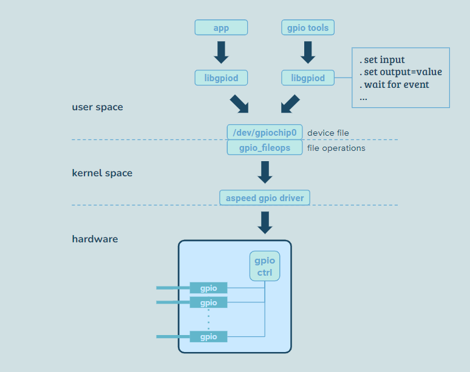
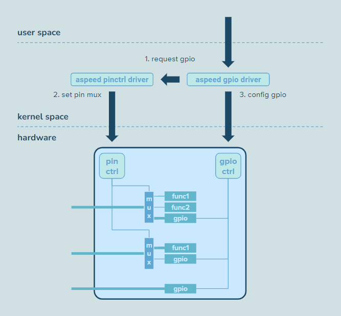

> Study case: Linux version 5.15.0 on OpenBMC

## Index

- [Introduction](#introduction)
- [GPIO Chip](#gpio-chip)
- [Pin Control](#pin-control)
- [System Startup](#system-startup)
- [Cheat Sheet](#cheat-sheet)
- [Reference](#reference)

## <a name="introduction"></a> Introduction

(TBD)

## <a name="gpio-chip"></a> GPIO Chip

Generic purpose input-output (GPIO) is the hardware pin through which we can send hardware signals to or receive from an external component. 
Given that the GPIO chip in AST2500 provides 29 groups (A, B, ... AB, AC), and each group contains 8 pins, there are 232 GPIO lines that we can control. 
Hardware designers decide where these lines connect; thus, the same pin might serve different purposes on different products. 
Information such as offset (index) or name is necessary to find the target line, but note that not all lines are configured with an identifier in DTS.

```
E.g., arch/arm/boot/dts/aspeed-bmc-opp-romulus.dts

...
&gpio {
    gpio-line-names =
    /*A0-A7*/   "","cfam-reset","","","","","fsi-mux","",
    /*B0-B7*/   "","","","","","","","",
    /*C0-C7*/   "","","","","","","","",
    /*D0-D7*/   "fsi-enable","","","nic_func_mode0","nic_func_mode1","","","",
....
```

Once we acquire the line handle, we specify flags later converted to value or event requests by the GPIO library internally. 
As for the event, a kernel thread is created to monitor and wake up the stalled task in response to the event (rising or falling edge, or both).

- value setting
  - output high
  - output low
  - input
- event waiting
  - input + register interrupt handler

<p align="center"></p>

The 'GPIO Lib' framework in kernel space bridges the userspace requests and the real GPIO chip driver provided by the vendor, e.g., Aspeed.

```
                                                +--
                                                |   static const struct file_operations gpio_fileops = {
                                                |       .release = gpio_chrdev_release,
                                                |       .open = gpio_chrdev_open,
  user             +------+ e.g. /dev/gpiochip0 |       .poll = lineinfo_watch_poll,
  -----------------| cdev |------------------   |       .read = lineinfo_watch_read,
  kernel           +------+                     |       .owner = THIS_MODULE,
                       |                        |       .llseek = no_llseek,
                       v                        |       .unlocked_ioctl = gpio_ioctl,
             |--  +---------+                   |   };
    generic  |    | gpiolib |                   +--
             +--  +---------+
                       |
                       v
             |--  +--------+
   specific  |    | driver |
e.g. aspeed  +--  +--------+                                                                              
```

<details><summary> More Details </summary>

| GPIO | Line | Name           | Use            | Direction | Note              |
| ---  | ---  | ---            | ---            | ---       | ---               |
| A4   | 4    |                | kernel         | input     | SCL9, TIMER5      |
| A5   | 5    |                | kernel         | input     | SDA9, TIMER6      |
| C0   | 16   |                | kernel         | input     | SD1CLK, SCL10     |
| C1   | 17   |                | kernel         | input     | SD1CMD, SDA10     |
| C2   | 18   |                | kernel         | input     | SD1DAT0, SCL11    |
| C3   | 19   |                | kernel         | input     | SD1DAT1, SDA11    |
| C4   | 20   |                | kernel         | input     | SD1DAT2, SCL12    |
| C5   | 21   |                | kernel         | input     | SD1DAT3, SDA12    |
| C6   | 22   |                | kernel         | input     | SD1CD, SCL13      |
| C7   | 23   |                | kernel         | input     | SD1WP, SDA13      |
| D3   | 27   | nic_func_mode0 | nic_func_mode0 | output    | SD2DAT1, GPID2OUT |
| D4   | 28   | nic_func_mode1 | nic_func_mode1 | output    | SD2DAT2, GPID4IN  |
| I3   | 67   | power-button   | sysfs          | input     | SYSMISO           |
| I4   | 68   |                | kernel         | input     | SPI1CS0, VBCS     |
| I5   | 69   |                | kernel         | input     | SPI1CK, VBCK      |
| I6   | 70   |                | kernel         | input     | SPI1MOSI, VBMOSI  |
| I7   | 71   |                | kernel         | input     | SPI1MISO, VBMISO  |
| J1   | 73   |                | sysfs          | input     | SGPMLD            |
| J2   | 74   | checkstop      | checkstop      | input     | SGPMO             |
| K0   | 80   |                | kernel         | input     | SCL5              |
| K1   | 81   |                | kernel         | input     | SDA5              |
| K2   | 82   |                | kernel         | input     | SCL6              |
| K3   | 83   |                | kernel         | input     | SDA6              |
| K4   | 84   |                | kernel         | input     | SCL7              |
| K5   | 85   |                | kernel         | input     | SDA7              |
| K6   | 86   |                | kernel         | input     | SCL8              |
| K7   | 87   |                | kernel         | input     | SDA8              |
| L0   | 88   |                | kernel         | input     | NCTS1             |
| L1   | 89   |                | kernel         | input     | VPIDE, NDCD1      |
| L2   | 90   |                | kernel         | input     | DASHU1, NDSR1     |
| L3   | 91   |                | kernel         | input     | VPIHS, NRI1       |
| L4   | 92   |                | kernel         | input     | VPIVS, NDTR1      |
| L5   | 93   |                | kernel         | input     | VPICLK, NRTS1     |
| L6   | 94   |                | kernel         | input     | DASHV1, TXD1      |
| L7   | 95   |                | kernel         | input     | DASHW1, RXD1      |
| N0   | 104  |                | kernel         | input     | DASHN0, PWM0      |
| N1   | 105  |                | kernel         | input     | DASHN1, PWM1      |
| N2   | 106  | led-fault      | fault          | output    | VPIG2, PWM2       |
| N4   | 108  | led-identify   | identify       | output    | VPIG4, PWM4       |
| Q0   | 128  |                | kernel         | input     | SCL3              |
| Q1   | 129  |                | kernel         | input     | SDA3              |
| Q2   | 130  |                | kernel         | input     | SCL4              |
| Q3   | 131  |                | kernel         | input     | SDA4              |
| Q7   | 135  | id-button      | id-button      | input     | PEWAKE            |
| R3   | 139  |                | phosphor-hwmon | output    | SPI2CK            |
| R5   | 141  | led-power      | power          | output    | SPI2MISO          |
| S7   | 151  | seq_cont       | seq_cont       | output    | VPOB9             |
| T0   | 152  |                | kernel         | input     | RGMII/RMII        |
| T1   | 153  |                | kernel         | input     | RGMII/RMII        |
| T2   | 154  |                | kernel         | input     | RGMII/RMII        |
| T3   | 155  |                | kernel         | input     | RGMII/RMII        |
| U4   | 164  |                | kernel         | input     | RGMII/RMII        |
| U6   | 166  |                | kernel         | input     | RGMII/RMII        |
| U7   | 167  |                | kernel         | input     | RGMII/RMII        |
| V0   | 168  |                | kernel         | input     | RGMII/RMII        |
| V1   | 169  |                | kernel         | input     | RGMII/RMII        |

```
drivers/gpio/gpiolib-cdev.c

static const struct file_operations gpio_fileops = {
    .release = gpio_chrdev_release,
    .open = gpio_chrdev_open,
    .poll = lineinfo_watch_poll,
    .read = lineinfo_watch_read,
    .owner = THIS_MODULE,
    .llseek = no_llseek,
    .unlocked_ioctl = gpio_ioctl,
#ifdef CONFIG_COMPAT
    .compat_ioctl = gpio_ioctl_compat,
#endif
};
```

```
drivers/gpio/gpiolib-cdev.c                                                             
+------------------+                                                                     
| gpio_chrdev_open | : prepare notifier & register to chain, set up file priv & open_mode
+-|----------------+                                                                     
  |                                                                                      
  |--> alloc bitmap to represent all gpio lines                                          
  |                                                                                      
  |                     +-------------------------+                                      
  |--> prepare callback | lineinfo_changed_notify | set up chg_info, wake up waiting task
  |                     +-------------------------+                                      
  |    +----------------------------------+                                              
  |--> | blocking_notifier_chain_register | register to notifier chain of gpio_dev       
  |    +----------------------------------+                                              
  |                                                                                      
  |--> save private data in file                                                         
  |                                                                                      
  |    +------------------+                                                              
  +--> | nonseekable_open | set file open_mode                                           
       +------------------+                                                              
```

```
drivers/gpio/gpiolib-cdev.c                                       
+-------------------------+                                        
| lineinfo_changed_notify | : set up chg_info, wake up waiting task
+-|-----------------------+                                        
  |                                                                
  |--> return if the gpio_desc isn't one of our targets            
  |                                                                
  |--> set up chg_info                                             
  |                                                                
  |    +-----------------------+                                   
  |--> | gpio_desc_to_lineinfo | set up info based on gpip_desc    
  |    +-----------------------+                                   
  |    +--------------+                                            
  +--> | wake_up_poll |                                            
       +--------------+                                            
```

```
drivers/gpio/gpiolib-cdev.c                                               
+-----------------------+                                                  
| gpio_desc_to_lineinfo | : set up info based on gpip_desc                 
+-|---------------------+                                                  
  |    +---------------------------+                                       
  |--> | pinctrl_gpio_can_use_line | check if gpio pin is available for use
  |    +---------------------------+                                       
  |                                                                        
  |--> set up info .name and .consumer (label)                             
  |                                                                        
  +--> set up info.flags based on desc.flags                               
```

```
drivers/gpio/gpiolib-cdev.c                                   
+---------------------+                                        
| lineinfo_watch_read | : read data from kfifo and copy to user
+-|-------------------+                                        
  |                                                            
  +--> while we still have something to read                   
       |                                                       
       |--> if kfifo is empty                                  
       |    -                                                  
       |    +--> determine to return or wait event             
       |                                                       
       |--> determine event_size                               
       |                                                       
       |    +-----------+                                      
       |--> | kfifo_out | get data from fifo                   
       |    +-----------+                                      
       |    +--------------+                                   
       |--> | copy_to_user |                                   
       |    +--------------+                                   
       |                                                       
       +--> bytes_read += event_size                           
```

```
drivers/gpio/gpiolib-cdev.c                                                                                                     
+------------+                                                                                                                   
| gpio_ioctl | : ioctl for gpio operation                                                                                        
+-|----------+                                                                                                                   
  |                                                                                                                              
  |--> switch cmd                                                                                                                
  |--> case get_chip_info                                                                                                        
  |    -    +--------------+                                                                                                     
  |    +--> | chipinfo_get | prepare chip_info and copy to user                                                                  
  |         +--------------+                                                                                                     
  |--> case get_line_handle                                                                                                      
  |    -    +-------------------+                                                                                                
  |    +--> | linehandle_create | create line handle, prepare fd/file with private = line_handle, coyp fd info to user           
  |         +-------------------+                                                                                                
  |--> case get_line_event                                                                                                       
  |    -    +------------------+                                                                                                 
  |    +--> | lineevent_create | create line event, set gpio input, request threaded irq, prepare fd/file for le, copy fd to user
  |         +------------------+                                                                                                 
  |--> case get_line_info || get_line_info_watch                                                                                 
  |    -    +-----------------+                                                                                                  
  |    +--> | lineinfo_get_v1 | fill line_info based on gpip_desc, copy line_info to user                                        
  |         +-----------------+                                                                                                  
  |--> case v2_get_line_info || v2_get_line_info_watch                                                                           
  |    -    +--------------+                                                                                                     
  |    +--> | lineinfo_get | fill line_info based on gpip_desc, copy line_info to user                                           
  |         +--------------+                                                                                                     
  |--> case get_line                                                                                                             
  |    -    +----------------+                                                                                                   
  |    +--> | linereq_create | for each line: request gpio and set direction, prepare fd/file, copy fd to user                   
  |         +----------------+                                                                                                   
  +--> case get_line_info_unwatch                                                                                                
       -    +------------------+                                                                                                 
       +--> | lineinfo_unwatch | copy data from user, clear target bit from bitmap                                               
            +------------------+                                                                                                 
```

```
drivers/gpio/gpiolib-cdev.c                                                                                
+-------------------+                                                                                       
| linehandle_create | : create line handle, prepare fd/file with private = line_handle, coyp fd info to user
+-|-----------------+                                                                                       
  |    +----------------+                                                                                   
  |--> | copy_from_user | copy handle_request from user                                                     
  |    +----------------+                                                                                   
  |    +---------------------------+                                                                        
  |--> | linehandle_validate_flags | validate flags                                                         
  |    +---------------------------+                                                                        
  |                                                                                                         
  |--> alloc line_handle, and set up from handle_request                                                    
  |                                                                                                         
  |--> for each line                                                                                        
  |    |                                                                                                    
  |    |    +-------------------+                                                                           
  |    |--> | gpiochip_get_desc | get gpio_desc                                                             
  |    |    +-------------------+                                                                           
  |    |    +--------------------+                                                                          
  |    |--> | gpiod_request_user | set label, call ->request() and ->get_direction() if feasible            
  |    |    +--------------------+                                                                          
  |    |                                                                                                    
  |    |--> save gpio_desc in line_handle                                                                   
  |    |                                                                                                    
  |    |    +--------------------------------+                                                              
  |    |--> | linehandle_flags_to_desc_flags | given handle_request, set gpio_desc.flags                    
  |    |    +--------------------------------+                                                              
  |    |    +----------------------+                                                                        
  |    |--> | gpiod_set_transitory | label 'transitory' in desc, set config                                 
  |    |    +----------------------+                                                                        
  |    |                                                                                                    
  |    |--> set gpio direction accordingly                                                                  
  |    |                                                                                                    
  |    |    +------------------------------+                                                                
  |    +--> | blocking_notifier_call_chain | call notifier for 'line_changed_requested'                     
  |         +------------------------------+                                                                
  |    +---------------------+                                                                              
  |--> | get_unused_fd_flags | get an available fd                                                          
  |    +---------------------+                                                                              
  |    +--------------------+                                                                               
  |--> | anon_inode_getfile | prepare a file (name = gpio-linehandle, fops = linehandle_fileops)            
  |    +--------------------+                                                                               
  |                                                                                                         
  |--> save fd in handle_request                                                                            
  |                                                                                                         
  |    +--------------+                                                                                     
  |--> | copy_to_user | copy handle_request back to user                                                    
  |    +--------------+                                                                                     
  |    +------------+                                                                                       
  +--> | fd_install | table[fd] = fill                                                                      
       +------------+                                                                                       
```

```
drivers/gpio/gpiolib-cdev.c                                                                                           
+------------------+                                                                                                   
| lineevent_create | : create line event, set gpio input, request threaded irq, prepare fd/file for le, copy fd to user
+-|----------------+                                                                                                   
  |    +----------------+                                                                                              
  |--> | copy_from_user | copy event_req from user                                                                     
  |    +----------------+                                                                                              
  |    +-------------------+                                                                                           
  |--> | gpiochip_get_desc | get gpio_desc                                                                             
  |    +-------------------+                                                                                           
  |                                                                                                                    
  |--> alloc line_event                                                                                                
  |                                                                                                                    
  |    +--------------------+                                                                                          
  |--> | gpiod_request_user | set label, call ->request() and ->get_direction() if feasible                            
  |    +--------------------+                                                                                          
  |                                                                                                                    
  |--> save gpio_desc in line_event                                                                                    
  |                                                                                                                    
  |    +--------------------------------+                                                                              
  |--> | linehandle_flags_to_desc_flags | given handle_request, set gpio_desc.flags                                    
  |    +--------------------------------+                                                                              
  |    +-----------------------+                                                                                       
  |--> | gpiod_direction_input | set direction input                                                                   
  |    +-----------------------+                                                                                       
  |                                                                                                                    
  |--> get irq from gpio_desc, save in line_event                                                                      
  |                                                                                                                    
  |    +----------------------+                                                                                        
  |--> | request_threaded_irq | request a thread to read the events                                                    
  |    +----------------------+                                                                                        
  |    +---------------------+                                                                                         
  |--> | get_unused_fd_flags | get an available fd                                                                     
  |    +---------------------+                                                                                         
  |    +--------------------+                                                                                          
  |--> | anon_inode_getfile | prepare a file (name = gpio-event, fops = lineevent_fileops)                             
  |    +--------------------+                                                                                          
  |                                                                                                                    
  |--> save fd in event_req                                                                                            
  |                                                                                                                    
  |    +--------------+                                                                                                
  |--> | copy_to_user | copy event_req back to user                                                                    
  |    +--------------+                                                                                                
  |    +------------+                                                                                                  
  +--> | fd_install |                                                                                                  
       +------------+                                                                                                  
```

```
drivers/gpio/gpiolib-cdev.c                                                   
+-----------------+                                                            
| lineinfo_get_v1 | : fill line_info based on gpip_desc, copy line_info to user
+-|---------------+                                                            
  |    +----------------+                                                      
  |--> | copy_from_user | copy line info from user                             
  |    +----------------+                                                      
  |    +-------------------+                                                   
  |--> | gpiochip_get_desc |                                                   
  |    +-------------------+                                                   
  |                                                                            
  |--> get gpio_desc accordingly                                               
  |                                                                            
  |--> if arg 'watch' is set                                                   
  |    -                                                                       
  |    +--> return error if that gpio line is already watched                  
  |                                                                            
  |    +-----------------------+                                               
  |--> | gpio_desc_to_lineinfo | set up line_info_v2 based on gpio_desc        
  |    +-----------------------+                                               
  |    +-------------------------+                                             
  |--> | gpio_v2_line_info_to_v1 | set up line_info based on line_info_v2      
  |    +-------------------------+                                             
  |    +--------------+                                                        
  +--> | copy_to_user | coyp line_info to user                                 
       +--------------+                                                        
```

```
drivers/gpio/gpiolib-cdev.c                                                
+--------------+                                                            
| lineinfo_get | : fill line_info based on gpip_desc, copy line_info to user
+-|------------+                                                            
  |    +----------------+                                                   
  |--> | copy_from_user | copy line info from user                          
  |    +----------------+                                                   
  |    +-------------------+                                                
  |--> | gpiochip_get_desc | get gpio_desc                                  
  |    +-------------------+                                                
  |                                                                         
  |--> if arg 'watch' is set                                                
  |    -                                                                    
  |    +--> return error if that gpio line is already watched               
  |                                                                         
  |    +-----------------------+                                            
  |--> | gpio_desc_to_lineinfo | set up line_info_v2 based on gpio_desc     
  |    +-----------------------+                                            
  |    +--------------+                                                     
  +--> | copy_to_user | copy line info to user                              
       +--------------+                                                     
```

```
drivers/gpio/gpiolib-cdev.c                                                                        
+----------------+                                                                                  
| linereq_create | : for each line: request gpio and set direction, prepare fd/file, copy fd to user
+-|--------------+                                                                                  
  |    +----------------+                                                                           
  |--> | copy_from_user | copy user_line_req from user                                              
  |    +----------------+                                                                           
  |    +------------------------------+                                                             
  |--> | gpio_v2_line_config_validate | validate line config                                        
  |    +------------------------------+                                                             
  |                                                                                                 
  |--> alloc line_req                                                                               
  |                                                                                                 
  |--> for each line                                                                                
  |    |                                                                                            
  |    |    +-------------------+ +--------------------+                                            
  |    +--> | INIT_DELAYED_WORK | | debounce_work_func |                                            
  |         +-------------------+ +--------------------+                                            
  |                                                                                                 
  |--> determine line_req.buffer_size                                                               
  |                                                                                                 
  |--> for each line                                                                                
  |    |                                                                                            
  |    |    +-------------------+                                                                   
  |    |--> | gpiochip_get_desc | get gpio_desc                                                     
  |    |    +-------------------+                                                                   
  |    |    +--------------------+                                                                  
  |    |--> | gpiod_request_user | set label, call ->request() and ->get_direction() if feasible    
  |    |    +--------------------+                                                                  
  |    |    +----------------------+                                                                
  |    |--> | gpiod_set_transitory | label 'transitory' in desc, set config                         
  |    |    +----------------------+                                                                
  |    |                                                                                            
  |    |--> if flag specified 'output'                                                              
  |    |    |    +----------------------------------+                                               
  |    |    |--> | gpio_v2_line_config_output_value | get value for output                          
  |    |    |    +----------------------------------+                                               
  |    |    |    +------------------------+                                                         
  |    |    +--> | gpiod_direction_output | set direction 'output'                                  
  |    |         +------------------------+                                                         
  |    +--> else                                                                                    
  |         |    +-----------------------+                                                          
  |         |--> | gpiod_direction_input | set direction 'input'                                    
  |         |    +-----------------------+                                                          
  |         |    +---------------------+                                                            
  |         +--> | edge_detector_setup | request threaded irq                                       
  |              +---------------------+                                                            
  |                                                                                                 
  |--> prepare fd/file                                                                              
  |                                                                                                 
  +--> copy fd to user                                                                              
```

### libgpiod

```
bindings/cxx/line.cpp                                                                           
+------------------+                                                                             
| gpiod::find_line | : find name-matched line                                                    
+-|----------------+                                                                             
  |                     +-----------------------+                                                
  +--> for each iter in | gpiod::make_chip_iter |                                                
       |                +-----------------------+                                                
       |                prepare a iterator of that many gpio chips, get chip info and fill struct
       |                                                                                         
       |    +-----------------+                                                                  
       +--> | chip::find_line | find name-matched line                                           
            +-----------------+                                                                  
```

```
bindings/cxx/iter.cpp                                                                                  
+-----------------------+                                                                               
| gpiod::make_chip_iter | : prepare a iterator of that many gpio chips, get chip info and fill struct   
+-|---------------------+                                                                               
  |    +---------------------+                                                                          
  |--> | gpiod_chip_iter_new | prepare a iterator of that many gpio chips, get chip info and fill struct
  |    +---------------------+                                                                          
  |                                                                                                     
  +--> convert to chip iterator ?                                                                       
```

```
lib/iter.c                                                                                        
+---------------------+                                                                            
| gpiod_chip_iter_new | : prepare a iterator of that many gpio chips, get chip info and fill struct
+-|-------------------+                                                                            
  |                                                                                                
  |--> find /dev/gpiochip*                                                                         
  |                                                                                                
  |--> alloc iterator                                                                              
  |                                                                                                
  |--> alloc that many chip struct and save in iterator                                            
  |                                                                                                
  +--> for each gpio_chip                                                                          
       |                                                                                           
       |    +-------------------------+                                                            
       +--> | gpiod_chip_open_by_name | open file & get chip info, prepare such chip struct        
            +-------------------------+                                                            
```

```
+-------------------------+                                                      
| gpiod_chip_open_by_name | : open file & get chip info, prepare such chip struct
+-|-----------------------+                                                      
  |                                                                              
  |--> prepare file name                                                         
  |                                                                              
  |    +-----------------+                                                       
  +--> | gpiod_chip_open | open file & get chip info, prepare such chip struct   
       +-----------------+                                                       
```

```
lib/core.c                                                              
+-----------------+                                                      
| gpiod_chip_open | : open file & get chip info, prepare such chip struct
+-|---------------+                                                      
  |    +------+                                                          
  |--> | open |                                                          
  |    +------+                                                          
  |    +------------------+                                              
  |--> | is_gpiochip_cdev | check if it's valid                          
  |    +------------------+                                              
  |                                                                      
  |--> alloc chip                                                        
  |                                                                      
  |    +-------+                                                         
  |--> | ioctl | opt = get_chip_info                                     
  |    +-------+                                                         
  |                                                                      
  +--> set up chip (fd, lines, name, label)                              
```

```
bindings/cxx/chip.cpp                                
+-----------------+                                   
| chip::find_line | : find name-matched line          
+-|---------------+                                   
  |    +----------------------+                       
  +--> | gpiod_chip_find_line | find name-matched line
       +----------------------+                       
```

```
lib/helpers.c                                                              
+----------------------+                                                    
| gpiod_chip_find_line | : find name-matched line                           
+-|--------------------+                                                    
  |    +---------------------+                                              
  |--> | gpiod_line_iter_new | prepare line_iter (have each line info ready)
  |    +---------------------+                                              
  |                                                                         
  +--> for each line                                                        
       |                                                                    
       |--> get line name and compare with arg name                         
       |                                                                    
       +--> if found                                                        
            |                                                               
            |    +----------------------+                                   
            |--> | gpiod_line_iter_free |                                   
            |    +----------------------+                                   
            |                                                               
            +--> return                                                     
```

```
lib/iter.c                                                                  
+---------------------+                                                      
| gpiod_line_iter_new | : prepare line_iter (have each line info ready)      
+-|-------------------+                                                      
  |                                                                          
  |--> alloc line_iter                                                       
  |                                                                          
  |--> get line# from chip, alloc that many lines and save in line_iter      
  |                                                                          
  +--> for each line                                                         
       |                                                                     
       |    +---------------------+                                          
       +--> | gpiod_chip_get_line | ensure target line exists in chip, get it
            +---------------------+                                          
```

```
lib/core.c                                                        
+---------------------+                                            
| gpiod_chip_get_line | : ensure target line exists in chip, get it
+-|-------------------+                                            
  |                                                                
  |--> ensure chip->lines is allocated                             
  |                                                                
  |--> if chip->line[offset] doesn't exist yet                     
  |    -                                                           
  |    +--> alloc line and set up, save in chip                    
  |                                                                
  |    else                                                        
  |    -                                                           
  |    +--> get line from chip                                     
  |                                                                
  |    +-------------------+                                       
  +--> | gpiod_line_update | get line info and fill arg line       
       +-------------------+                                       
```

```
lib/core.c                                            
+-------------------+                                  
| gpiod_line_update | : get line info and fill arg line
+-|-----------------+                                  
  |                                                    
  |--> save offset in line struct                      
  |                                                    
  |    +-------+                                       
  |--> | ioctl | opt = get_line_info                   
  |    +-------+                                       
  |                                                    
  +--> set up line based on the info                   
```

```
bindings/cxx/line.cpp                                    
+---------------+                                         
| line::request | : given config, set target lines
+-|-------------+                                         
  |                                                       
  |--> prepare bulk                                       
  |                                                       
  |    +--------------------+                             
  +--> | line_bulk::request | given config, get line values or events
       +--------------------+                             
```

```
 bindings/cxx/line_bulk.cpp                                                 
+--------------------+                                                      
| line_bulk::request | : given config, get line values or events            
+-|------------------+                                                      
  |    +-------------------------+                                          
  |--> | line_bulk::to_line_bulk | add all lines to bulk struct             
  |    +-------------------------+                                          
  |                                                                         
  |--> set up config (consumer, type: direction or event, flags)            
  |                                                                         
  |    +-------------------------+                                          
  +--> | gpiod_line_request_bulk | given req type, get line values or events
       +-------------------------+                                          
```

```
bindings/cxx/line_bulk.cpp                               
+-------------------------+                               
| line_bulk::to_line_bulk | : add all lines to bulk struct
+-|-----------------------+                               
  |    +----------------------+                           
  |--> | gpiod_line_bulk_init | set line_num = 0          
  |    +----------------------+                           
  |                                                       
  +--> for each line: add to bulk struct                  
```

```
lib/core.c                                                            
+-------------------------+                                            
| gpiod_line_request_bulk | : given req type, get line values or events
+-|-----------------------+                                            
  |                                                                    
  |--> if request type is about direction                              
  |    |                                                               
  |    |    +---------------------+                                    
  |    +--> | line_request_values | get each line info                 
  |         +---------------------+                                    
  |                                                                    
  +--> elif request type is about event                                
       |                                                               
       |    +---------------------+                                    
       +--> | line_request_events | get each line info                 
            +---------------------+                                    
```

```
lib/core.c                                                           
+---------------------+                                               
| line_request_values | : get each line info                          
+-|-------------------+                                               
  |                                                                   
  |--> set up req_handle                                              
  |                                                                   
  |--> set direction in flags                                         
  |                                                                   
  |--> for each line in bulk                                          
  |    -                                                              
  |    +--> set up line_offset and default_value of line in req_handle
  |                                                                   
  |--> retrieve fd from bulk                                          
  |                                                                   
  |    +-------+                                                      
  |--> | ioctl | opt = get_line_handle (kernel saves target fd in req)
  |    +-------+                                                      
  |    +---------------------+                                        
  +--> | line_make_fd_handle | prepare line_fd                        
  |    +---------------------+                                        
  |                                                                   
  +--> for each line in bulk                                          
       |                                                              
       |--> set up line                                               
       |                                                              
       |    +-------------+                                           
       |--> | line_set_fd | save line_fd in line                      
       |    +-------------+                                           
       |    +-------------------+                                     
       +--> | gpiod_line_update | get line info and fill arg line     
            +-------------------+                                     
```

```
lib/core.c                                                   
+---------------------+                                       
| line_request_events | : get each line info                  
+-|-------------------+                                       
  |                                                           
  +--> for each line                                          
       |                                                      
       |    +---------------------------+                     
       +--> | line_request_event_single | get single line info
            +---------------------------+                     
```

```
lib/core.c                                                 
+---------------------------+                               
| line_request_event_single | : get single line info        
+-|-------------------------+                               
  |                                                         
  |--> set up event_req                                     
  |                                                         
  |--> set up flags (rising, falling, both)                 
  |                                                         
  |    +-------+                                            
  |--> | ioctl | opt = get_line_event                       
  |    +-------+                                            
  |    +---------------------+                              
  |--> | line_make_fd_handle | prepare line_fd              
  |    +---------------------+                              
  |                                                         
  |--> set up line                                          
  |                                                         
  |    +-------------------+                                
  +--> | gpiod_line_update | get line info and fill arg line
       +-------------------+                                
```

```
bindings/cxx/line.cpp                               
+--------------------+                               
| line::event_get_fd | : given line, get fd          
+-|------------------+                               
  |    +-------------------------+                   
  +--> | gpiod_line_event_get_fd | given line, get fd
       +-------------------------+                   
```

```
lib/core.c                                     
+-------------------------+                     
| gpiod_line_event_get_fd | : given line, get fd
+-|-----------------------+                     
  |    +-------------+                          
  +--> | line_get_fd | given line, get fd       
       +-------------+                          
```

```
bindings/cxx/line.cpp                                                          
+------------------+                                                            
| line::event_read | : read events from fd                                      
+-|----------------+                                                            
  |    +-----------------------+                                                
  |--> | gpiod_line_event_read | read events from fd, so as to set up arg events
  |    +-----------------------+                                                
  |    +-----------------------+                                                
  +--> | line::make_line_event | make line event                                
       +-----------------------+                                                
```

```
lib/core.c                                                                              
+-----------------------+                                                                
| gpiod_line_event_read | : read events from fd, so as to set up arg events              
+-|---------------------+                                                                
  |    +--------------------------------+                                                
  +--> | gpiod_line_event_read_multiple | read events from fd, so as to set up arg events
       +--------------------------------+                                                
```

```
lib/core.c                                                                                 
+--------------------------------+                                                          
| gpiod_line_event_read_multiple | : read events from fd, so as to set up arg events        
+-|------------------------------+                                                          
  |    +-------------------------+                                                          
  |--> | gpiod_line_event_get_fd | get fd                                                   
  |    +-------------------------+                                                          
  |    +-----------------------------------+                                                
  +--> | gpiod_line_event_read_fd_multiple | read events from fd, so as to set up arg events
       +-----------------------------------+                                                
```

```
lib/core.c                                                                            
+-----------------------------------+                                                  
| gpiod_line_event_read_fd_multiple | : read events from fd, so as to set up arg events
+-|---------------------------------+                                                  
  |    +------+                                                                        
  |--> | read | read events                                                            
  |    +------+                                                                        
  |                                                                                    
  +--> for each event                                                                  
       -                                                                               
       +--> set up arg event based on read event                                       
```

```
bindings/cxx/line.cpp                                
+-----------------------+                             
| line::make_line_event | : make line event           
+-|---------------------+                             
  |                                                   
  |--> set event type to rising or falling accordingly
  |                                                   
  +--> save timestamp and source in arg               
```
    
</details>

### External GPIO Chip

(TBD)

```
arch/arm/boot/dts/aspeed-bmc-vegman-sx20.dts

...
&i2c11 {
    /* SMB_BMC_MGMT_LVC3 */
    gpio@21 {
        compatible = "nxp,pcal9535";
        reg = <0x21>;
        gpio-controller;
        #gpio-cells = <2>;
...
```

## <a name="pin-control"></a> Pin Control

Chips communicate with external hardware modules through pins, such as the I2C bus (2 pins), GPIO line (1 pin), or UART bus (8 pins). 
Modern chips aggregate multiple functions into one pin, e.g., through proper settings, a pin can be part of a UART or I2C bus or a simple GPIO line. 
If device functionality is achieved by these multi-functional pins, each must be correctly configured before the device can perform jobs. 
Kernel introduces pin control so users can specify the pin configs, and the driver mechanism manipulates the pin mux accordingly. 
Note that chip designers decide whether a pin is dedicated to one specific goal or is part of different purposes.

Let's look at the example of UART1 and UART5; the former needs the help of pin control to behave, while the latter is pretty straightforward. 
Property `pinctrl-0` specifies all the required pin configs; each contains the `group` and `function` that are later in use.

```
 uart1                                                               uart5                        
+----------------------------------------------------------+        +----------------------------+
|serial@1e783000 {                                         |        |serial@1e784000 {           |
|    compatible = "ns16550a";                              |        |    compatible = "ns16550a";|
|    reg = <0x1e783000 0x20>;                              |        |    reg = <0x1e784000 0x20>;|
|    reg-shift = <0x02>;                                   |        |    reg-shift = <0x02>;     |
|    interrupts = <0x09>;                                  |        |    interrupts = <0x0a>;    |
|    clocks = <0x02 0x0d>;                                 |        |    clocks = <0x02 0x0f>;   |
|    resets = <0x0f 0x04>;  +-- state                      |        |    no-loopback-test;       |
|    no-loopback-test;      |   default/init/sleep/idle    |        |    status = "okay";        |
|    status = "okay";       v                              |        |};                          |
|    pinctrl-names = "default";                            |        +----------------------------+
|    pinctrl-0 = <0x10 0x11 0x12 0x13 0x14 0x15 0x16 0x17>;|                                      
|};               ---+ ---+                     ---+ ---+  |                                      
+--------------------|----|------------------------|----|--+                                      
                     v    |                        v    |                                         
+----------------------+  |  +-----------------------+  |                                         
|txd1_default {        |  |  |ndcd1_default {        |  |                                         
|    function = "TXD1";|  |  |    function = "NDCD1";|  |                                         
|    groups = "TXD1";  |  |  |    groups = "NDCD1";  |  |                                         
|    phandle = <0x10>; |  |  |    phandle = <0x16>;  |  |                                         
|};                    |  |  |};                     |  |                                         
+----------------------+  |  +-----------------------+  |                                         
                          v                             v                                         
     +----------------------+      +----------------------+                                       
     |rxd1_default {        |      |nri1_default {        |                                       
     |    function = "RXD1";|      |    function = "NRI1";|                                       
     |    groups = "RXD1";  |      |    groups = "NRI1";  |                                       
     |    phandle = <0x11>; |      |    phandle = <0x17>; |                                       
     |};                    |      |};                    |                                       
     +----------------------+      +----------------------+                                       
```

Like the GPIO chip manages lines, the pin control device manipulates pin function through the information (pin/function/group) it keeps around. 
When performing the device and driver match flow, the pin control mechanism takes effect before the driver probing:

1. for each pin config in the current device node, find the `group` saved in the pin control device
2. for each pin in the `group`
    - disable any higher-priority function of that pin
    - enable target `function`
    
The UART1 has its 8-pin bus ready and available for drivers to probe and see if there's a successful match. 
Among all functions on a pin, GPIO has the lowest priority; this fact applies to not only multi-functional bus also single-purpose pins. 
When we operate on those simple GPIO lines, the underlying GPIO chip implicitly requests the GPIO function from the pin control device.

<p align="center"></p>

<details><summary> More Details </summary>

```                                                                                                
drivers/pinctrl/aspeed/pinctrl-aspeed-g5.c

 #define I2C3_DESC   SIG_DESC_SET(SCU90, 16) <========== setting to enable multi-function of the below pins
                                                                                                           
                                                                                                           
                          ball       setting                                                               
                            |           |                                                                  
 #define A11 128            v           v                                                                  
 SIG_EXPR_LIST_DECL_SINGLE(A11, SCL3, I2C3, I2C3_DESC);                                                    
 PIN_DECL_1(A11, GPIOQ0, SCL3);   ^              ^                                                         
                    ^      ^      |              |                                                         
                    |      |   signal         setting                                                      
                  gpio     |                                                                               
               (low prio)  |                                                                               
                           |                                                                               
                         func1                                                                             
                      (high prio)                                                                          
                                                                                                           
 #define A10 129                                                                                           
 SIG_EXPR_LIST_DECL_SINGLE(A10, SDA3, I2C3, I2C3_DESC);                                                    
 PIN_DECL_1(A10, GPIOQ1, SDA3);                                                                            
                                                                                                           
 FUNC_GROUP_DECL(I2C3, A11, A10) <========== declare A11, A10 as group I2C3                                
```

In the above declaration, ball **A11** can only be function 1 (SCL3, high priority) or other (GPIO, low priority). 
In some cases, it equips two extra functions instead of one. 
The I2C channel nine is an excellent example of this illustration.

```
 #define I2C9_DESC   SIG_DESC_SET(SCU90, 22) <========== setting to enable multi-function of the below pins                 
                                                                                                                            
                               signal                                                                                       
                                  |             settings to enable this function                                            
                          ball    |  function   +--------+                                                                  
                            |     |     |       |        |                                                                  
 #define C14 4              v     v     v       v        v                                                                  
 SIG_EXPR_LIST_DECL_SINGLE(C14, SCL9, I2C9, I2C9_DESC, COND1);                                                              
 SIG_EXPR_LIST_DECL_SINGLE(C14, TIMER5, TIMER5, SIG_DESC_SET(SCU80, 4), COND1);                                             
                            ^     ^     ^                  ^              ^                                                 
                            |     |     |                  |              |                                                 
                          ball    |  function              +--------------+                                                 
                                  |                        settings to enable this function                                 
                               signal                                                                                       
                                                                                                                            
                         func1                                                                                              
                      (high prio)                                                                                           
                           |                                                                                                
                           v                                                                                                
 PIN_DECL_2(C14, GPIOA4, SCL9, TIMER5);                                                                                     
                    ^             ^                                                                                         
                    |             |                                                                                         
                  other         func2                                                                                       
              (lowest prio)   (low prio)                                                                                    
                                                                                                                            
 FUNC_GROUP_DECL(TIMER5, C14);    <========== declare that group 'TIMER5' contains ball 'C14'                               
                                                                                                                            
 #define A13 5                                                                                                              
 SIG_EXPR_LIST_DECL_SINGLE(A13, SDA9, I2C9, I2C9_DESC, COND1);                                                              
 SIG_EXPR_LIST_DECL_SINGLE(A13, TIMER6, TIMER6, SIG_DESC_SET(SCU80, 5), COND1);                                             
 PIN_DECL_2(A13, GPIOA5, SDA9, TIMER6);                                                                                     
                                                                                                                            
 FUNC_GROUP_DECL(TIMER6, A13);    <========== declare that group 'TIMER6' contains ball 'A13'                               
                                                                                                                            
 FUNC_GROUP_DECL(I2C9, C14, A13); <========== declare that group 'I2C9' contains ball 'C14' and 'A13'                       
```

```
// MAC1LINK
static const struct aspeed_sig_desc sig_descs_MAC1LINK_MAC1LINK[] = {
    { ASPEED_IP_SCU, SCU80, BIT_MASK(0), 1, 0 }
};
static const struct aspeed_sig_expr sig_exprs_MAC1LINK_MAC1LINK = {
    .signal = "MAC1LINK",
    .function = "MAC1LINK",
    .ndescs = ARRAY_SIZE(sig_descs_MAC1LINK_MAC1LINK),
    .descs = &sig_descs_MAC1LINK_MAC1LINK[0],
};
static const struct aspeed_sig_expr *sig_exprs_MAC1LINK_MAC1LINK[] = {
    &sig_exprs_MAC1LINK_MAC1LINK, NULL
};
static const struct aspeed_sig_expr *
sig_exprs_0_MAC1LINK[ARRAY_SIZE(sig_exprs_MAC1LINK_MAC1LINK)]
__attribute__((alias(istringify(sig_exprs_MAC1LINK_MAC1LINK))));

// GPIOA0
static const struct aspeed_sig_desc sig_descs_GPIOA0_GPIOA0[] = {
};
static const struct aspeed_sig_expr sig_exprs_GPIOA0_GPIOA0 = {
    .signal = "GPIOA0",
    .function = "GPIOA0",
    .ndescs = ARRAY_SIZE(sig_descs_GPIOA0_GPIOA0),
    .descs = &sig_descs_GPIOA0_GPIOA0[0],
};
static const struct aspeed_sig_expr *sig_exprs_GPIOA0_GPIOA0[] = {
    &sig_exprs_GPIOA0_GPIOA0, NULL
};
static const struct aspeed_sig_expr *
sig_exprs_0_GPIOA0[ARRAY_SIZE(sig_exprs_GPIOA0_GPIOA0)]
__attribute__((alias(istringify(sig_exprs_GPIOA0_GPIOA0))));

// Both
static const struct aspeed_sig_expr **pin_exprs_0[] = {
    sig_exprs_0_MAC1LINK, sig_exprs_0_GPIOA0, NULL
};
static const struct aspeed_pin_desc pin_0 = {
    "0", &pin_exprs_0[0]
};
static const int group_pins_MAC1LINK[] = { 0 };
static const char *func_groups_MAC1LINK[] = { "MAC1LINK" };
```
    
```
drivers/base/pinctrl.c                                                                        
+-------------------+                                                                          
| pinctrl_bind_pins | : register pinctrl, select 'default' (or 'init') state                   
+-|-----------------+                                                                          
  |                                                                                            
  |--> alloc space for ->pins                                                                  
  |                                                                                            
  |    +------------------+                                                                    
  |--> | devm_pinctrl_get | ensure there's the pinctrl in pinctrl_list, return it              
  |    +------------------+                                                                    
  |    +----------------------+                                                                
  |--> | pinctrl_lookup_state | look up the specified state (default)                          
  |    +----------------------+                                                                
  |    +----------------------+                                                                
  |--> | pinctrl_lookup_state | look up the specified state (init)                             
  |    +----------------------+                                                                
  |                                                                                            
  +--> if not found                                                                            
       |                                                                                       
       |    +----------------------+                                                           
       +--> | pinctrl_select_state | ensure pinctrl is in the state (enable setting if not yet)
            +----------------------+                                                           
```

```
drivers/pinctrl/core.c                                                     
+------------------+                                                        
| devm_pinctrl_get | : ensure there's the pinctrl in pinctrl_list, return it
+-|----------------+                                                        
  |                                                                         
  |--> alloc space for ptr array                                            
  |                                                                         
  |    +-------------+                                                      
  |--> | pinctrl_get | ensure there's the pinctrl in pinctrl_list, return it
  |    +-------------+                                                      
  |    +------------+                                                       
  +--> | devres_add | add to dev as resource                                
       +------------+                                                       
```

```
drivers/pinctrl/core.c                                                                                    
+-------------+                                                                                            
| pinctrl_get | : ensure there's the pinctrl in pinctrl_list, return it                                    
+-|-----------+                                                                                            
  |    +--------------+                                                                                    
  |--> | find_pinctrl | look up pinctrl of the dev on 'pinctrl_list'                                       
  |    +--------------+                                                                                    
  |                                                                                                        
  |--> return if it's already there                                                                        
  |                                                                                                        
  |    +----------------+                                                                                  
  +--> | create_pinctrl | parse dt node and set up pinctrl (state and setting), add pinctrl to pinctrl_list
       +----------------+                                                                                  
```

```
drivers/pinctrl/core.c                                                                
+----------------------+                                                               
| pinctrl_select_state | : ensure pinctrl is in the state (enable setting if not yet)  
+-|--------------------+                                                               
  |                                                                                    
  |--> if pinctrl is already in the arg state, return                                  
  |                                                                                    
  |    +----------------------+                                                        
  +--> | pinctrl_commit_state | enable setting to commit the specified state of pinctrl
       +----------------------+                                                        
```

```
drivers/pinctrl/core.c                                                                        
+----------------------+                                                                       
| pinctrl_commit_state | : enable setting to commit the specified state of pinctrl             
+-|--------------------+                                                                       
  |                                                                                            
  |--> if pinctrl is in a state already                                                        
  |    -                                                                                       
  |    +--> (ignore)                                                                           
  |                                                                                            
  |--> for each setting in state (probably only 1 setting)                                     
  |    |                                                                                       
  |    |--> switch setting_type                                                                
  |    |--> case mux_group                                                                     
  |    |    -    +-----------------------+                                                     
  |    |    +--> | pinmux_enable_setting | for each pin in group: claim pin and enable function
  |    |         +-----------------------+                                                     
  |    |--> case configs_pin                                                                   
  |    |--> case configs_group                                                                 
  |    |    -                                                                                  
  |    |    +--> (skip)                                                                        
  |    |                                                                                       
  |    +--> if it's not the pinctrl of pinctrl_dev                                             
  |         |                                                                                  
  |         |    +------------------+                                                          
  |         +--> | pinctrl_link_add | (do nothing bc no link consumer)                         
  |              +------------------+                                                          
  |                                                                                            
  |--> for each setting in state (this loop is for config, not our business)                   
  |    -                                                                                       
  |    +--> (skip)                                                                             
  |                                                                                            
  +--> pinctrl->state = state                                                                  
```

```
drivers/pinctrl/pinmux.c                                                                                            
+-----------------------+                                                                                            
| pinmux_enable_setting | : for each pin in group: claim pin and enable function                                     
+-|---------------------+                                                                                            
  |                                                                                                                  
  |--> call ->get_group_pins(), e.g.,                                                                                
  |    +-------------------------------+                                                                             
  |    | aspeed_pinctrl_get_group_pins | given group idx, return pin info (pins & nums_pins)                         
  |    +-------------------------------+                                                                             
  |                                                                                                                  
  |--> for each pin                                                                                                  
  |    |                                                                                                             
  |    |    +-------------+                                                                                          
  |    +--> | pin_request | given pin#, get pin_desc and claim it (specify the owner)                                
  |         +-------------+                                                                                          
  |                                                                                                                  
  |--> for each pin                                                                                                  
  |    |                                                                                                             
  |    |    +--------------+                                                                                         
  |    |--> | pin_desc_get | given pin#, get pin_desc                                                                
  |    |    +--------------+                                                                                         
  |    |                                                                                                             
  |    +--> save setting_mux in pin_desc                                                                             
  |                                                                                                                  
  +--> call ->set_mux(), e.g.,                                                                                       
       +-----------------------+                                                                                     
       | aspeed_pinmux_set_mux | given function/group, for each pin in group: evaluate expression and enable function
       +-----------------------+                                                                                     
```
    
```
drivers/pinctrl/pinmux.c                                                  
+-------------+                                                            
| pin_request | : given pin#, get pin_desc and claim it (specify the owner)
+-|-----------+                                                            
  |    +--------------+                                                    
  |--> | pin_desc_get | given pin#, get pin_desc                           
  |    +--------------+                                                    
  |                                                                        
  |--> if the pin is claimed by another owner already, return error        
  |                                                                        
  +--> save arg owner in pin_desc                                          
```
    
```
drivers/pinctrl/aspeed/pinctrl-aspeed.c                                                                           
+-----------------------+                                                                                          
| aspeed_pinmux_set_mux | : given function/group, for each pin in group: evaluate expression and enable function   
+-|---------------------+                                                                                          
  |                                                                                                                
  |--> get function and group by their indexes                                                                     
  |                                                                                                                
  +--> for each pin in group                                                                                       
       |                                                                                                           
       |--> for each func_priority                                                                                 
       |    |                                                                                                      
       |    |    +--------------------------+                                                                      
       |    |--> | aspeed_find_expr_by_name | check if current func_priority provides expression of target function
       |    |    +--------------------------+                                                                      
       |    |                                                                                                      
       |    |--> if found, break                                                                                   
       |    |                                                                                                      
       |    |    +--------------------+                                                                            
       |    +--> | aspeed_disable_sig | make sure it's disabled so low-priority function has a chance              
       |         +--------------------+                                                                            
       |                                                                                                           
       |--> if no expression found, (skip)                                                                         
       |                                                                                                           
       |    +------------------------+                                                                             
       +--> | aspeed_sig_expr_enable | evaluate the expression and enable it                                       
            +------------------------+                                                                             
```
  
</details>

## <a name="system-startup"></a> System Startup

Let's introduce GPIO-related functions that print logs during system startup:

- pinctrl_init
    - creates the debug files under /sys/kernel/debug/pinctrl
- aspeed_gpio_probe
    - prepares GPIO chip struct of Aspeed operations and registers descriptors of each GPIO pin
- fsi_master_acf_init
    - (skip, it's a GPIO user)
- gpio_keys_probe
    - (skip, it's a GPIO user)
- systemd
    - (skip, it's a GPIO user)

```
[    0.112641] pinctrl core: initialized pinctrl subsystem                                          <---- pinctrl_init
...
[    0.383292] gpio-819 (nic_func_mode0): hogged as output/low                                      <---- aspeed_gpio_probe
[    0.383562] gpio-820 (nic_func_mode1): hogged as output/low                                      <---- aspeed_gpio_probe
[    0.383777] gpio-943 (seq_cont): hogged as output/low                                            <---- aspeed_gpio_probe
...
[    2.207040] fsi-master-acf gpio-fsi: ColdFire initialized, firmware v4 API v2.1 (trace disabled) <---- fsi_master_acf_init
[    2.501380] fsi-master-acf gpio-fsi: Coprocessor startup timeout !                               <---- fsi_master_acf_init
...
[    2.553890] input: gpio-keys as /devices/platform/gpio-keys/input/input0                         <---- gpio_keys_probe
...
[   17.143708] systemd[1]: Created slice Slice /system/phosphor-gpio-monitor.                       <---- systemd
```

<details><summary> More Details </summary>

```
pinctrl_init: create debug files under /sys/kernel/debug/pinctrl             
gpiolib_dev_init: register bus & driver, reserve dev#
gpiolib_sysfs_init: register 'gpio' class, for each entry@gpio_devices: create device and register to sysfs
aspeed_g5_pinctrl_driver: register 'aspeed_g5_pinctrl_driver' to bus 'platform'
    aspeed_g5_pinctrl_probe: iomap syscon (for scu), prepare pinctrl_dev and register it
gpiolib_debugfs_init: prepare '/sys/kernel/debug/gpio' with fops=gpiolib_fops
aspeed_gpio_driver_init: register 'aspeed_gpio_driver' to bus 'platform'
    aspeed_gpio_probe: set up aspeed_gpio, install ops, prepare gpio line descriptors, register gpio chip
aspeed_sgpio_driver_init: (skip, no matched device)
gpio_clk_driver_init: (skip, no matched device)
gpio_keys_polled_driver_init: (skip, no matched device)
i2c_mux_gpio_driver_init: (skip, no matched device)
w1_gpio_driver_init: (skip, no matched device)
gpio_led_driver_init: register 'gpio_led_driver' to bus 'platform'
    gpio_led_probe: for each led, prepare gpio_desc and led_struct                         
fsi_master_gpio_driver_init: (skip, no matched device)
fsi_master_acf_init: (skip, no matched device)
gpio_keys_init: register 'gpio_keys_device_driver' to bus 'platform'
    gpio_keys_probe: prepare pdate & input_dev & ddata, for each button: set up key, register input_dev
```

```
drivers/pinctrl/core.c                                                           
+--------------+                                                                  
| pinctrl_init | : create debug files under /sys/kernel/debug/pinctrl             
+-|------------+                                                                  
  |                                                                               
  |--> print "initialized pinctrl subsystem\n"                                    
  |                                                                               
  |    +----------------------+                                                   
  +--> | pinctrl_init_debugfs | create debug files under /sys/kernel/debug/pinctrl
       +----------------------+                                                   
```

```
+------------------+                                                                                 
| gpiolib_dev_init | : register bus & driver, reserve dev#
+----|-------------+                                                                                 
     |    +--------------+                                                                           
     |--> | bus_register | register 'gpio_bus_type'                                                  
     |    +--------------+                                                                           
     |    +-----------------+                                                                        
     |--> | driver_register | register 'gpio_stub_drv' (not important in our case)                   
     |    +-----------------+                                                                        
     |    +---------------------+                                                                    
     |--> | alloc_chrdev_region | reserve a range (256) of minor numbers for gpio character devices  
     |    +---------------------+                                                                    
     |                                                                                               
     |--> gpiolib_initialized = true                                                                 
     |                                                                                               
     |    +---------------------+                                                                    
     +--> | gpiochip_setup_devs | register each gpiochip dev in 'gpio_devices' (empty in in our case)
          +---------------------+                                                                    
```

```                                                                                        
drivers/gpio/gpiolib-sysfs.c                                                                                   
+--------------------+                                                                                          
| gpiolib_sysfs_init | : register 'gpio' class, for each entry@gpio_devices: create device and register to sysfs
+-|------------------+                                                                                          
  |    +----------------+                                                                                       
  |--> | class_register | register 'gpio' class                                                                 
  |    +----------------+                                                                                       
  |                                                                                                             
  +--> for each entry on 'gpio_devices'                                                                         
       |                                                                                                        
       |    +-------------------------+                                                                         
       +--> | gpiochip_sysfs_register | create device and register to sysfs                                     
            +-------------------------+                                                                         
```

```
drivers/pinctrl/aspeed/pinctrl-aspeed-g5.c                                                
+-------------------------+                                                                
| aspeed_g5_pinctrl_probe | : iomap syscon (for scu), prepare pinctrl_dev and register it  
+-|-----------------------+                                                                
  |                                                                                        
  |--> assign index to each line of aspeed_g5_pins                                         
  |                                                                                        
  |    +----------------------+                                                            
  +--> | aspeed_pinctrl_probe | iomap syscon (for scu), prepare pinctrl_dev and register it
       +----------------------+                                                            
```

```
drivers/pinctrl/aspeed/pinctrl-aspeed.c                                                
+----------------------+                                                                
| aspeed_pinctrl_probe | : iomap syscon (for scu), prepare pinctrl_dev and register it  
+-|--------------------+                                                                
  |                                                                                     
  |--> get pinctrl_dev's parent (syscon node)                                           
  |                                                                                     
  |    +-----------------------+                                                        
  |--> | syscon_node_to_regmap | read hw_reg info and do iomap (for later scu operation)
  |    +-----------------------+                                                        
  |    +------------------+                                                             
  +--> | pinctrl_register | init pinctrl_dev (and pins within), enable it               
       +------------------+                                                             
```

```
drivers/pinctrl/core.c                                                                      
+------------------+                                                                         
| pinctrl_register | : init pinctrl_dev (and pins within), enable it                         
+-|----------------+                                                                         
  |    +-------------------------+                                                           
  |--> | pinctrl_init_controller | prepare pinctrl_dev, register pins to it                  
  |    +-------------------------+                                                           
  |    +----------------+                                                                    
  +--> | pinctrl_enable | claims hogs (?), add pinctrl_dev to global list, create debug files
       +----------------+                                                                    
```

```
drivers/pinctrl/core.c                                               
+-------------------------+                                           
| pinctrl_init_controller | : prepare pinctrl_dev, register pins to it
+-|-----------------------+                                           
  |                                                                   
  |--> alloc pinctrl_dev                                              
  |                                                                   
  |--> set it up based on arguments                                   
  |                                                                   
  |    +------------------+                                           
  |--> | pinctrl_check_ops| check ops, e.g., aspeed_g5_pinctrl_ops    
  |    +------------------+                                           
  |    +------------------+                                           
  |--> | pinmux_check_ops | check ops, e.g., aspeed_g5_pinmux_ops     
  |    +------------------+                                           
  |    +-------------------+                                          
  |--> | pinconf_check_ops | check ops, e.g., aspeed_g5_conf_ops      
  |    +-------------------+                                          
  |    +-----------------------+                                      
  +--> | pinctrl_register_pins | register pins, e.g., aspeed_g5_pins  
       +-----------------------+                                      
```

```
drivers/pinctrl/core.c                                                          
+-----------------------+                                                        
| pinctrl_register_pins | : for each pin, prepare pin_desc and add to pinctrl_dev
+-|---------------------+                                                        
  |                                                                              
  +--> for each pin                                                              
       |                                                                         
       |    +--------------------------+                                         
       +--> | pinctrl_register_one_pin | prepare pin_desc and add to pinctrl_dev 
            +--------------------------+                                         
```

```
drivers/pinctrl/core.c                                               
+--------------------------+                                          
| pinctrl_register_one_pin | : prepare pin_desc and add to pinctrl_dev
+-|------------------------+                                          
  |    +--------------+                                               
  |--> | pin_desc_get | check if pin is registered already (shouldn't)
  |    +--------------+                                               
  |                                                                   
  |--> alloc pin_desc and set up (name, ...)                          
  |                                                                   
  |    +-------------------+                                          
  +--> | radix_tree_insert |                                          
       +-------------------+                                          
```

```
drivers/pinctrl/core.c                                                                             
+----------------+                                                                                  
| pinctrl_enable | : claims hogs (?), add pinctrl_dev to global list, create debug files            
+-|--------------+                                                                                  
  |    +--------------------+                                                                       
  +--> | pinctrl_claim_hogs | prepare pinctrl of pinctrl_dev, ensure it has default and sleep states
  |    +--------------------+                                                                       
  |                                                                                                 
  |--> add pinctrl_dev to global pinctrldev_list                                                    
  |                                                                                                 
  |    +-----------------------------+                                                              
  +--> | pinctrl_init_device_debugfs | create debug info under /sys/kernel/debug/pinctrl/           
       +-----------------------------+                                                              
```

```
drivers/pinctrl/core.c                                                                                    
+--------------------+                                                                                     
| pinctrl_claim_hogs | : prepare pinctrl of pinctrl_dev, ensure it has default and sleep states            
+-|------------------+                                                                                     
  |    +----------------+                                                                                  
  |--> | create_pinctrl | parse dt node and set up pinctrl (state and setting), add pinctrl to pinctrl_list
  |    +----------------+                                                                                  
  |                                                                                                        
  +--> ensure pinctrl_dev has default and sleep states                                                     
```

```
drivers/pinctrl/core.c                                                                                       
+----------------+                                                                                            
| create_pinctrl | : parse dt node and set up pinctrl (state and setting), add pinctrl to pinctrl_list        
+-|--------------+                                                                                            
  |                                                                                                           
  |--> alloc pin_ctrl                                                                                         
  |                                                                                                           
  |    +-------------------+                                                                                  
  |--> | pinctrl_dt_to_map | parse pinctrl info, for each config: register map to pinctrl_dev and pinctrl_maps
  |    +-------------------+                                                                                  
  |                                                                                                           
  |--> for each maps in pinctrl_maps: for each map in maps                                                    
  |    |                                                                                                      
  |    |--> continue if the map isn't for the dev                                                             
  |    |                                                                                                      
  |    |--> continue if map isn't for the pinctrl_dev                                                         
  |    |                                                                                                      
  |    |    +-------------+                                                                                   
  |    |--> | add_setting | add 'setting' to pinctrl 'state'                                                  
  |    |    +-------------+                                                                                   
  |    |                                                                                                      
  |    +--> return 'defer' if pinctrl_dev isn't available yet                                                 
  |                                                                                                           
  +--> add pinctrl to global 'pinctrl_list'                                                                   
```

```
drivers/pinctrl/devicetree.c                                                                                  
+-------------------+                                                                                          
| pinctrl_dt_to_map | : parse pinctrl info, for each config: register map to pinctrl_dev and global            
+-|-----------------+                                                                                          
  |                                                                                                            
  +--> for state = 0, 1, ...                                                                                   
       |                                                                                                       
       |--> get prop, e.g., 'pinctrl-0', which is a list of config                                             
       |                                                                                                       
       |--> if get nothing                                                                                     
       |    |                                                                                                  
       |    |--> if state is 0, return error (this dev need no pin ctrl)                                       
       |    |                                                                                                  
       |    +--> else, break (we have at least state 0)                                                        
       |                                                                                                       
       |--> get prop 'pinctrl-names'                                                                           
       |                                                                                                       
       |--> for each config                                                                                    
       |    |                                                                                                  
       |    |    +----------------------+                                                                      
       |    +--> | dt_to_map_one_config | convert config to map, register map to pinctrl_dev and 'pinctrl_maps'
       |         +----------------------+                                                                      
       |                                                                                                       
       +--> if no config (not our case)                                                                        
            |                                                                                                  
            |    +-------------------------+                                                                   
            +--> | dt_remember_dummy_state | (skip)                                                            
                 +-------------------------+                                                                   
```

```
drivers/pinctrl/devicetree.c                                                                                                 
+----------------------+                                                                                                      
| dt_to_map_one_config | : convert config to map, register map to pinctrl_dev and 'pinctrl_maps'                              
+-|--------------------+                                                                                                      
  |                                                                                                                           
  |--> endless loop (to get pinctrl_dev)                                                                                      
  |    |                                                                                                                      
  |    |    +--------------------+                                                                                            
  |    |--> | of_get_next_parent | which is the pinctrl dev itself                                                            
  |    |    +--------------------+                                                                                            
  |    |                                                                                                                      
  |    +--> return 'defer' error if it's root node already                                                                    
  |    |                                                                                                                      
  |    |    +------------------------------+                                                                                  
  |    |--> | get_pinctrl_dev_from_of_node | get pinctrl_dev from 'pinctrldev_list'                                           
  |    |    +------------------------------+                                                                                  
  |    |                                                                                                                      
  |    |--> break if found                                                                                                    
  |    |                                                                                                                      
  |    +--> return error if we are handling pinctrl_dev itself                                                                
  |                                                                                                                           
  |--> get pinctrl_dev's ops, e.g., aspeed_g5_pinctrl_ops                                                                     
  |                                                                                                                           
  |--> call ->dt_node_to_map(), e.g.,                                                                                         
  |    +------------------------------------+                                                                                 
  |    | pinconf_generic_dt_node_to_map_all | parse config_node, ensure we have space in map, add mux (group, function) to map
  |    +------------------------------------+                                                                                 
  |                                                                                                                           
  |    +-------------------------+                                                                                            
  +--> | dt_remember_or_free_map | register map_info to pinctrl_dev and global 'pinctrl_maps'                                 
       +-------------------------+                                                                                            
```

```
include/linux/pinctrl/pinconf-generic.h                                                                                            
+------------------------------------+                                                                                              
| pinconf_generic_dt_node_to_map_all | : parse config_node, ensure we have space in map, add mux (group, function) to map           
+-|----------------------------------+                                                                                              
  |    +--------------------------------+                                                                                           
  +--> | pinconf_generic_dt_node_to_map | : parse config_node, ensure we have space in map, add mux (group, function) to map        
       +-|------------------------------+                                                                                           
         |    +-----------------------------------+                                                                                 
         |--> | pinconf_generic_dt_subnode_to_map | parse config_node, ensure we have space in map, add mux (group, function) to map
         |    +-----------------------------------+                                                                                 
         |                                                                                                                          
         +--> for each child of config_node (not our case)                                                                          
              -                                                                                                                     
              +--> (skip)                                                                                                           
```

```
drivers/pinctrl/pinconf-generic.c                                                                                      
+-----------------------------------+                                                                                   
| pinconf_generic_dt_subnode_to_map | : parse config_node, ensure we have space in map, add mux (group, function) to map
+-|---------------------------------+                                                                                   
  |                                                                                                                     
  |--> get prop 'pins' (not our case)                                                                                   
  |                                                                                                                     
  |--> if fail                                                                                                          
  |    |                                                                                                                
  |    |--> get prop 'groups'                                                                                           
  |    |                                                                                                                
  |    +--> if type isn't set yet, set type = configs_group                                                             
  |                                                                                                                     
  |--> get prop 'function'                                                                                              
  |                                                                                                                     
  |    +---------------------------------+                                                                              
  |--> | pinconf_generic_parse_dt_config | parse pinconf params (do nothing in our case)                                
  |    +---------------------------------+                                                                              
  |                                                                                                                     
  |--> determine reserve size                                                                                           
  |                                                                                                                     
  |    +---------------------------+                                                                                    
  |--> | pinctrl_utils_reserve_map | ensure we have space for new maps                                                  
  |    +---------------------------+                                                                                    
  |                                                             i2c3_default {                                          
  +--> for each string in prop 'groups'                             function = "I2C3";                                  
       |                                                            groups = "I2C3";                                    
       |--> if prop 'function' has value                            phandle = <0x1d>;                                   
       |    |                                                   };                                                      
       |    |    +---------------------------+                                                                          
       |    +--> | pinctrl_utils_add_map_mux | add mux to map (type is changed to mux_group)                            
       |         +---------------------------+                                                                          
       |                                                                                                                
       +--> if pinconf found (not our case)                                                                             
            |                                                                                                           
            |    +-------------------------------+                                                                      
            +--> | pinctrl_utils_add_map_configs | add configs to map                                                   
                 +-------------------------------+                                                                      
```

```
drivers/pinctrl/pinconf-generic.c                                                 
+---------------------------------+                                                
| pinconf_generic_parse_dt_config | : parse pinconf params (do nothing in our case)
+-|-------------------------------+                                                
  |                                                                                
  |--> determine max_cfg and alloc space                                           
  |                                                                                
  |    +--------------+                                                            
  |--> | parse_dt_cfg | parse pinconf params (do nothing in our case)              
  |    +--------------+                                                            
  |                                                                                
  |--> return if not cfg found                                                     
  |                                                                                
  +--> duplicate cfg info to input args                                            
```

```
drivers/pinctrl/pinconf-generic.c
+--------------+                                                
| parse_dt_cfg | : parse pinconf params (do nothing in our case)
+-|------------+                                                
  |                                                             
  +--> for each param                                           
       |                                                        
       |--> get prop                                            
       |                                                        
       +--> continue if not found (our case)                    
```

```
drivers/pinctrl/pinctrl-utils.c                                 
+---------------------------+                                    
| pinctrl_utils_reserve_map | : ensure we have space for new maps
+-|-------------------------+                                    
  |                                                              
  |--> return if old maps are still enough to accomodate new maps
  |                                                              
  |--> extend old maps so it's new maps now                      
  |                                                              
  +--> save new maps info in input args                          
```

```
drivers/pinctrl/devicetree.c                                                                 
+-------------------------+                                                                   
| dt_remember_or_free_map | : register map_info to pinctrl_dev and global 'pinctrl_maps'      
+-|-----------------------+                                                                   
  |                                                                                           
  |--> for each map                                                                           
  |    -                                                                                      
  |    +--> set map name                                                                      
  |                                                                                           
  |--> alloc dt_map, save pinctrl_dev and map_info in it                                      
  |                                                                                           
  |--> add dt_map to pinctrl_dev                                                              
  |                                                                                           
  |    +---------------------------+                                                          
  +--> | pinctrl_register_mappings | prepare maps_node to save map info, add to 'pinctrl_maps'
       +---------------------------+                                                          
```

```
drivers/pinctrl/core.c                                                                  
+---------------------------+                                                            
| pinctrl_register_mappings | : prepare maps_node to save map info, add to 'pinctrl_maps'
+-|-------------------------+                                                            
  |                                                                                      
  |--> for each map                                                                      
  |    -                                                                                 
  |    +--> given map type, validate it                                                  
  |                                                                                      
  |--> alloc maps_node, save map info in it                                              
  |                                                                                      
  +--> add maps node to global 'pinctrl_maps'                                            
```

```
drivers/pinctrl/core.c                                                                      
+-------------+                                                                              
| add_setting | : add 'setting' to pinctrl 'state'                                           
+-|-----------+                                                                              
  |                                                                                          
  |--> ensure pinctrl has the 'state' of map                                                 
  |                                                                                          
  |--> alloc 'setting' and set up (map type, pinctrl_dev, ...)                               
  |                                                                                          
  |--> switch map_type                                                                       
  |--> case mux_group                                                                        
  |    -    +-----------------------+                                                        
  |    +--> | pinmux_map_to_setting | get func and grp idx separately, save them in 'setting'
  |         +-----------------------+                                                        
  |--> case configs_pin (not our case)                                                       
  |--> case configs_group (not our case)                                                     
  |    -    +-----------------------+                                                        
  |    +--> | pinconf_map_to_setting| (skip)                                                 
  |         +-----------------------+                                                        
  |                                                                                          
  +--> add 'setting' to 'state'                                                              
```

```
drivers/pinctrl/pinmux.c                                                                              
+-----------------------+                                                                              
| pinmux_map_to_setting | : get func and grp idx separately, save them in 'setting'                    
+-|---------------------+                                                                              
  |    +------------------------------+                                                                
  |--> | pinmux_func_name_to_selector | given function name, find matched entry in array and return idx
  |    +------------------------------+                                                                
  |                                                                                                    
  |--> save func idx in 'setting'                                                                      
  |                                                                                                    
  |--> call ->get_function_groups(), e.g.,                                                             
  |    +-----------------------------+                                                                 
  |--> | aspeed_pinmux_get_fn_groups | given func idx, return group info through params                
  |    +-----------------------------+                                                                 
  |                                                                                                    
  |--> if map has mux.group (our case)                                                                 
  |    |                                                                                               
  |    |    +--------------+                                                                           
  |    +--> | match_string | try to match (group string from map, group string from pinctrl_dev)       
  |         +--------------+                                                                           
  |    +----------------------------+                                                                  
  |--> | pinctrl_get_group_selector | given group name, find matched entry in array and return idx     
  |    +----------------------------+                                                                  
  |                                                                                                    
  +--> save grp idx in 'setting'                                                                       
```

```
drivers/pinctrl/pinmux.c                                                                         
+------------------------------+                                                                  
| pinmux_func_name_to_selector | : given function name, find matched entry in array and return idx
+-|----------------------------+                                                                  
  |                                                                                               
  |--> call ->get_functions_count(), e.g.,                                                        
  |    +----------------------------+                                                             
  |    | aspeed_pinmux_get_fn_count | return size of aspeed_g5_functions                          
  |    +----------------------------+                                                             
  |                                                                                               
  +--> for each function                                                                          
       |                                                                                          
       |--> call ->get_function_name(), e.g.,                                                     
       |    +---------------------------+                                                         
       |    | aspeed_pinmux_get_fn_name | given idx, get function name from array                 
       |    +---------------------------+                                                         
       |                                                                                          
       +--> if match found, return idx                                                            
```

```
drivers/pinctrl/core.c                                                             
+----------------------------+                                                      
| pinctrl_get_group_selector | : given group name, find matched group and return idx
+-|--------------------------+                                                      
  |                                                                                 
  |--> call ->get_groups_count(), e.g.,                                             
  |    +---------------------------------+                                          
  |    | aspeed_pinctrl_get_groups_count | return size of aspeed_g5_groups          
  |    +---------------------------------+                                          
  |                                                                                 
  +--> for each group                                                               
       |                                                                            
       |--> call ->get_group_name(), e.g.,                                          
       |    +---------------------------------+                                     
       |    | aspeed_pinctrl_get_groups_count | given idx, return group name        
       |    +---------------------------------+                                     
       |                                                                            
       +--> if match found, return idx                                              
```

```
drivers/gpio/gpiolib.c                                                           
+----------------------+                                                          
| gpiolib_debugfs_init | : prepare '/sys/kernel/debug/gpio' with fops=gpiolib_fops
+----------------------+                                                          
```

```
drivers/gpio/gpio-aspeed.c
+-------------------+                                                                                                    
| aspeed_gpio_probe | : set up aspeed_gpio, install ops, prepare gpio line descriptors, register gpio chip
+----|--------------+                                                                                                    
     |                                                                                                                   
     |--> set up 'aspeed_gpio' and install gpio chip operations (in, out, get, set, ...)                                 
     |                                                                                                                   
     |--> set up 'irq_chip' of 'aspeed_gpio' if device tree specifies the irq#                                           
     |                                                                                                                   
     |    +------------------------+                                                                                     
     +--> | devm_gpiochip_add_data | prepare desc for each gpio line, set up irq desc, register gpio chip 
          +------------------------+ (connect the generic layer (gpio lib) to specific driver (aspeed))
```

```
include/linux/gpio/driver.h
+------------------------+
| devm_gpiochip_add_data | : prepare desc for each gpio line, set up irq desc, register gpio chip
+-----|------------------+
      |    +---------------------------------+
      +--> | devm_gpiochip_add_data_with_key | : prepare desc for each gpio line, set up irq desc, register gpio chip
           +--------|------------------------+
                    |    +----------------------------+
                    +--> | gpiochip_add_data_with_key | prepare desc for each gpio line, set up irq desc, register gpio chip
                    |    +----------------------------+
                    |    +--------------------------+
                    +--> | devm_add_action_or_reset | add action 'devm_gpio_chip_release' as device resource
                         +--------------------------+
```

```
drivers/gpio/gpiolib.c
+----------------------------+
| gpiochip_add_data_with_key | : prepare desc for each gpio line, set up irq desc, register gpio chip
+------|---------------------+
       |
       |--> set up 'gpio device'
       |
       |--> allocate 'descriptor' for each GPIO line
       |
       |    +---------------------+
       |--> | gpiodev_add_to_list | add 'gpio device' to the 'gpio_devices' list
       |    +---------------------+
       |    +-----------------+
       |--> | of_gpiochip_add | add pin range and set hog (default gpio behavior)
       |    +-----------------+
       |    +----------------------+
       |--> | gpiochip_add_irqchip | set up target 'irq desc' based on the 'gpio chip'
       |    +----------------------+
       |
       +--> if gpiolib_initialized is set (yes, in gpio lib init)
            |
            |    +--------------------+
            +--> | gpiochip_setup_dev | register cdev
                 +--------------------+
```

```
drivers/gpio/gpiolib-of.c                                                                                       
+-----------------+                                                                                              
| of_gpiochip_add | : prase dt to add pin range, scan child nodes to hog gpio lines                              
+-|---------------+                                                                                              
  |                                                                                                              
  |--> if gpio_chip isn't installed ->of_node()                                                                  
  |    |                                                                                                         
  |    |                            +----------------------+                                                     
  |    +--> install the default one | of_gpio_simple_xlate |                                                     
  |                                 +----------------------+                                                     
  |    +-----------------------------+                                                                           
  |--> | of_gpiochip_init_valid_mask | use property "gpio-reserved-ranges" to init mask (not our case)           
  |    +-----------------------------+                                                                           
  |    +---------------------------+                                                                             
  |--> | of_gpiochip_add_pin_range | parse dt for pin range, add to gpio_dev (also add gpio range to pinctrl_dev)
  |    +---------------------------+                                                                             
  |    +------------------------+                                                                                
  +--> | of_gpiochip_scan_gpios | scan gpio child nodes to hog gpio lines                                        
       +------------------------+                                                                                
```

```
drivers/gpio/gpiolib-of.c                                                                                                  
+---------------------------+                                                                                               
| of_gpiochip_add_pin_range | : parse dt for pin range, add to gpio_dev (also add gpio range to pinctrl_dev)                
+-|-------------------------+                                                                                               
  |                                                                                                                         
  |--> find property "gpio-ranges-group-names"                                                                              
  |                                                                                                                         
  +--> endless loop                                                                                                         
       |                                                                                                                    
       |    +----------------------------------+                                                                            
       |--> | of_parse_phandle_with_fixed_args | prop = "gpio-ranges"                                                       
       |    +----------------------------------+                                                                            
       |                                                                                                                    
       |--> break if no more arguments                                                                                      
       |                                                                                                                    
       +--> if pin# is specified                                                                                            
       |    |                                                                                                               
       |    |    +------------------------+                                                                                 
       |    +--> | gpiochip_add_pin_range | prepare pin_range, add gpio_range to pinctrl_dev, add pin_range to gpio_dev     
       |         +------------------------+                                                                                 
       |                                                                                                                    
       +--> else                                     gpio@1e780000 {                                                        
            -                                        	...                                                                   
            +--> (special range, skip)                   gpio-ranges = <0xd 0x0 0x0 0xe8>;                                  
                                                     	...                |   |   |    -                                     
                                                                         |   |   |    +--> pin#                             
                                                                         |   |   +-------> pin offset                       
                                                                         |   +-----------> gpio offset                      
                                                                         +---------------> pinctrl handle                   
```

```
drivers/gpio/gpiolib.c                                                                                 
+------------------------+                                                                              
| gpiochip_add_pin_range | : prepare pin_range, add gpio_range to pinctrl_dev, add pin_range to gpio_dev
+-|----------------------+                                                                              
  |                                                                                                     
  |--> alloc pin_range and set up                                                                       
  |                                                                                                     
  |    +---------------------------------+                                                              
  |--> | pinctrl_find_and_add_gpio_range | add gpio_range to pinctrl_dev                                
  |    +---------------------------------+                                                              
  |                                                                                                     
  +--> add pin_range to gpio_dev                                                                        
```

```
drivers/gpio/gpiolib-of.c                                                            
+------------------------+                                                            
| of_gpiochip_scan_gpios | : scan gpio child nodes to hog gpio lines                  
+-|----------------------+                                                            
  |                                                                                   
  +--> for each child of gpio node                                                    
       |                                                                              
       |--> if it doesn't have prop "gpio-hog", continue                              
       |                                                                              
       |    +---------------------+                                                   
       |--> | of_gpiochip_add_hog | given a device node, parse dt and hog gpio line(s)
       |    +---------------------+                                                   
       |                                                                              
       +--> label 'populated' on the child node                                       
```

```
drivers/gpio/gpiolib-of.c                                                                           
+---------------------+                                                                              
| of_gpiochip_add_hog | : given a device node, parse dt and hog gpio line(s)                         
+-|-------------------+                                                                              
  |                                                                                                  
  +--> endless loop                                                                                  
       |                                                                                             
       |    +-------------------+                                                                    
       |--> | of_parse_own_gpio | parse dt, translate it to get gpio_desc (along with flags and name)
       |    +-------------------+                                                                    
       |                                                                                             
       |--> break if no more                                                                         
       |                                                                                             
       |    +-----------+                                                                            
       +--> | gpiod_hog | hog (request and set direction) a gpio line                                
            +-----------+                                                                            
```

```
drivers/gpio/gpiolib-of.c                                                                         
+-------------------+                                                                              
| of_parse_own_gpio | : parse dt, translate it to get gpio_desc (along with flags and name)        
+-|-----------------+                                                                              
  |                                                                                                
  |--> read prop "gpio-cells" (it's 2 in our case)                                                 
  |                                                                                                
  |--> for each cell (2)                                                                           
  |    -                                                                                           
  |    +--> read prop "gpios"                                                                      
  |                                                                                                
  |    +------------------------------+                                                            
  |--> | of_xlate_and_get_gpiod_flags | translate specifier and return the (gpio_desc, xlate_flags)
  |    +------------------------------+                                                            
  |                                                                                                
  |--> given xlate_flags, set lflags (low, transitory, up, down)                                   
  |                                                                                                
  |--> read prop to set dflags (input, output_low, output_high)                                    
  |                                                                                                
  +--> determine name                                                                              
                                           +----------------------------------------------+        
                                           |nic_func_mode0 {                              |        
                                           |    gpio-hog;                                 |        
                                           |    gpios = <0x1b 0x0>;                       |        
                                           |    output-low; |   -                         |        
                                           |};              |   +--> hwnum (before xlate) |        
                                           |                +------> flags                |        
                                           +----------------------------------------------+        
```

```
drivers/gpio/gpiolib-of.c                                                                    
+------------------------------+                                                              
| of_xlate_and_get_gpiod_flags | : translate specifier and return the (gpio_desc, xlate_flags)
+-|----------------------------+                                                              
  |                                                                                           
  |--> call ->of_xlate(), e.g.,                                                               
  |    +----------------------+                                                               
  |    | of_gpio_simple_xlate | (hwnum, flags) = (arg[0], arg[1]), and return them            
  |    +----------------------+                                                               
  |                                                                                           
  |    +-------------------+                                                                  
  +--> | gpiochip_get_desc | given hwnum, get target gpio_desc                                
       +-------------------+                                                                  
```

```
drivers/gpio/gpiolib.c                                                                      
+-----------+                                                                                
| gpiod_hog | : hog (request and set direction) a gpio line                                  
+-|---------+                                                                                
  |                                                                                          
  |--> get gpio_chip and hw_num (line) from gpio_desc                                        
  |                                                                                          
  |    +---------------------------+                                                         
  |--> | gpiochip_request_own_desc | get gpio_desc, request it from pinctrl and set direction
  |    +---------------------------+                                                         
  |                                                                                          
  |--> label 'hogged' on gpio_desc                                                           
  |                                                                                          
  +--> print e.g., "hogged as output/low"                                                    
```

```
drivers/gpio/gpiolib.c                                                                      
+---------------------------+                                                                
| gpiochip_request_own_desc | : get gpio_desc, request it from pinctrl and set direction     
+-|-------------------------+                                                                
  |                                                                                          
  |--> get gpio_desc by (gpio_chip, hw_num)                                                  
  |                                                                                          
  |    +----------------------+                                                              
  |--> | gpiod_request_commit | set label, call ->request() and ->get_direction() if feasible
  |    +----------------------+                                                              
  |    +-----------------------+                                                             
  +--> | gpiod_configure_flags | set gpio direction accordingly                              
       +-----------------------+                                                             
```

```
drivers/leds/leds-gpio.c                                                                   
+----------------+                                                                          
| gpio_led_probe | : for each led, prepare gpio_desc and led_struct                         
+-|--------------+                                                                          
  |                                                                                         
  |--> if led# > 0                                                                          
  |    |                                                                                    
  |    |    +--------------+                                                                
  |    |--> | devm_kzalloc | alloc private                                                  
  |    |    +--------------+                                                                
  |    |                                                                                    
  |    +--> for each led                                                                    
  |         |                                                                               
  |         |    +--------------------+                                                     
  |         |--> | gpio_led_get_gpiod | get gpio desc, add to device as resource            
  |         |    +--------------------+                                                     
  |         |    +-----------------+                                                        
  |         +--> | create_gpio_led | install ops, set gpio direction out, prepare led struct
  |              +-----------------+                                                        
  |                                                                                         
  +--> else                                                                                 
       |                                                                                    
       |    +------------------+                                                            
       +--> | gpio_leds_create | for each child, prepare gpio_desc and led_struct           
            +------------------+                                                            
```

```
drivers/leds/leds-gpio.c                                               
+--------------------+                                                  
| gpio_led_get_gpiod | : get gpio desc, add to device as resource       
+-|------------------+                                                  
  |    +----------------------+                                         
  +--> | devm_gpiod_get_index | get gpio desc, add to device as resource
       +----------------------+                                         
```

```
drivers/gpio/gpiolib-devres.c                                                 
+----------------------+                                                       
| devm_gpiod_get_index | : get gpio desc, add to device as resource            
+-|--------------------+                                                       
  |    +-----------------+                                                     
  |--> | gpiod_get_index | get gpio desc, request and set direction accordingly
  |    +-----------------+                                                     
  |    +--------------+                                                        
  |--> | devres_alloc | alloc a ptr                                            
  |    +--------------+                                                        
  |                                                                            
  |--> have the ptr points to gpio desc                                        
  |                                                                            
  |    +------------+                                                          
  +--> | devres_add |                                                          
       +------------+                                                          
```

```
drivers/gpio/gpiolib.c                                                               
+-----------------+                                                                   
| gpiod_get_index | : get gpio desc, request and set direction accordingly            
+-|---------------+                                                                   
  |                                                                                   
  |--> if of node exists (our case)                                                   
  |    |                                                                              
  |    |    +--------------+                                                          
  |    +--> | of_find_gpio |                                                          
  |         +--------------+                                                          
  |                                                                                   
  |--> else                                                                           
  |    |                                                                              
  |    |    +----------------+                                                        
  |    +--> | acpi_find_gpio |                                                        
  |         +----------------+                                                        
  |                                                                                   
  |--> if the desc is still not found                                                 
  |    |                                                                              
  |    |    +------------+                                                            
  |    +--> | gpiod_find |                                                            
  |         +------------+                                                            
  |                                                                                   
  |--> return if no gpio consumer (desc) found                                        
  |                                                                                   
  |    +---------------+                                                              
  |--> | gpiod_request | set label, call ->request() and ->get_direction() if feasible
  |    +---------------+                                                              
  |    +-----------------------+                                                      
  |--> | gpiod_configure_flags | set gpio direction accordingly                       
  |    +-----------------------+                                                      
  |                                                                                   
  +--> call notifier (gpio_line_changed_requested)                                    
```

```
drivers/gpio/gpiolib.c                                                                      
+---------------+                                                                            
| gpiod_request | : set label, call ->request() and ->get_direction() if feasible            
+-|-------------+                                                                            
  |                                                                                          
  |--> get gpio_dev from desc                                                                
  |                                                                                          
  |    +----------------------+                                                              
  +--> | gpiod_request_commit | set label, call ->request() and ->get_direction() if feasible
       +----------------------+                                                              
```

```
drivers/gpio/gpiolib.c
+----------------------+
| gpiod_request_commit | : set label, call ->request() and ->get_direction() if feasible
+-|--------------------+
  |    +----------------+
  |--> | desc_set_label |
  |    +----------------+
  |
  |--> if gpio_chip->request() exists
  |    |
  |    |    +------------------+
  |    |--> | gpio_chip_hwgpio | get desc offset
  |    |    +------------------+
  |    |
  |    +--> if the offset is valid
  |         -
  |         +--> call ->request(), e.g.,
  |              +---------------------+
  |              | aspeed_gpio_request | find the pinctrl_dev and request gpio from it
  |              +---------------------+
  |
  +--> if gpio_chip->get_direction() exists
       |
       |    +---------------------+
       +--> | gpiod_get_direction | call ->get_direction() and save result in desc flags
            +---------------------+
```
    
```
drivers/gpio/gpio-aspeed.c                                                
+---------------------+                                                    
| aspeed_gpio_request | : find the pinctrl_dev and request gpio from it    
+-|-------------------+                                                    
  |                                                                        
  |--> return error if we have no gpio on arg offset                       
  |                                                                        
  |    +----------------------+                                            
  |--> | pinctrl_gpio_request | find the pinctrl_dev that contains the gpio
  |    +----------------------+                                            
  |    +-------------+                                                     
  |--> | gpio_to_pin | convert gpio to pin                                 
  |    +-------------+                                                     
  |    +---------------------+                                             
  +--> | pinmux_request_gpio | request gpio from pinctrl_dev               
       +---------------------+                                             
```
    
```
drivers/pinctrl/core.c                                                       
+----------------------+                                                      
| pinctrl_gpio_request | : find the pinctrl_dev that contains the gpio        
+-|--------------------+                                                      
  |                                                                           
  +--> for each pinctrl_dev in pinctrldev_list                                
       |                                                                      
       |    +--------------------------+                                      
       |--> | pinctrl_match_gpio_range | find the range that includes arg gpio
       |    +--------------------------+                                      
       |                                                                      
       +--> if found                                                          
            -                                                                 
            +--> return pinctrl_dev and range info through args               
```
    
```
drivers/pinctrl/core.c                                                       
+---------------------+                                                       
| pinmux_request_gpio | : request gpio from pinctrl_dev                       
+-|-------------------+                                                       
  |                                                                           
  |--> prepare owner string                                                   
  |                                                                           
  |    +-------------+                                                        
  +--> | pin_request | save owner in pin_desc, call related request() if exist
       +-------------+                                                        
```
    
```
drivers/pinctrl/pinmux.c                                                
+-------------+                                                          
| pin_request | : save owner in pin_desc, call related request() if exist
+-|-----------+                                                          
  |    +--------------+                                                  
  |--> | pin_desc_get | get pin_desc                                     
  |    +--------------+                                                  
  |                                                                      
  |--> return if it's already claimed by other mux_owner or gpio_owner   
  |                                                                      
  |--> save owner to pin_desc's gpio_owner or mux_owner                  
  |                                                                      
  |--> if ->gpio_request_enable() exists (not our case)                  
  |    -                                                                 
  |    +--> call ->gpio_request_enable()                                 
  |                                                                      
  +--> elif >request() exists (not our case)                             
       -                                                                 
       +--> call ->request()                                             
                                                                         
```

```
drivers/gpio/gpiolib.c
+---------------------+
| gpiod_get_direction | : call ->get_direction() and save result in desc flags
+-|-------------------+
  |
  |--> get gpio_chip from desc
  |
  |    +------------------+
  |--> | gpio_chip_hwgpio | get desc offset
  |    +------------------+
  |
  |--> call ->get_direction(), e.g.,
  |    +---------------------------+
  |    | aspeed_gpio_get_direction |
  |    +---------------------------+
  |
  +--> save direction in desc flags                                        
```

```
drivers/gpio/gpiolib.c                                                     
+-----------------------+                                                   
| gpiod_configure_flags | : set gpio direction accordingly                  
+-|---------------------+                                                   
  |                                                                         
  |--> given lflags, set bits in desc flags                                 
  |                                                                         
  |    +----------------------+                                             
  |--> | gpiod_set_transitory | label 'transitory' in desc, set config      
  |    +----------------------+                                             
  |                                                                         
  |--> return if dflag has no direction set                                 
  |                                                                         
  |--> if direction is out                                                  
  |    |                                                                    
  |    |    +------------------------+                                      
  |    +--> | gpiod_direction_output | write hw reg to set direction = 'out'
  |         +------------------------+                                      
  |                                                                         
  +--> else                                                                 
       |                                                                    
       |    +-----------------------+                                       
       +--> | gpiod_direction_input | write hw reg to set direction = 'in'  
            +-----------------------+                                       
```

```
+----------------------+                                                                          
| gpiod_set_transitory | : label 'transitory' in desc, set config                                 
+-|--------------------+                                                                          
  |                                                                                               
  |--> set 'transitory' bit in desc flags                                                         
  |                                                                                               
  |    +----------------------------------------+                                                 
  +--> | gpio_set_config_with_argument_optional | prepare config, call ->set_config() if it exists
       +----------------------------------------+                                                 
```

```
+----------------------------------------+                                                   
| gpio_set_config_with_argument_optional | : prepare config, call ->set_config() if it exists
+-|--------------------------------------+                                                   
  |    +------------------+                                                                  
  |--> | gpio_chip_hwgpio | get gpio (offset) from desc                                      
  |    +------------------+                                                                  
  |    +-------------------------------+                                                     
  +--> | gpio_set_config_with_argument | prepare config, call ->set_config() if it exists    
       +-------------------------------+                                                     
```

```
drivers/gpio/gpiolib.c                                                             
+-------------------------------+                                                   
| gpio_set_config_with_argument | : prepare config, call ->set_config() if it exists
+-|-----------------------------+                                                   
  |                                                                                 
  |--> get gpio_dev from desc                                                       
  |                                                                                 
  |    +--------------------------+                                                 
  |--> | pinconf_to_config_packed | config = make pair (mode, argument)             
  |    +--------------------------+                                                 
  |    +--------------------+                                                       
  +--> | gpio_do_set_config | call ->set_config() if it exists                      
       +--------------------+                                                       
```

```
drivers/gpio/gpiolib.c                                                           
+------------------------+                                                        
| gpiod_direction_output | : write hw reg to set direction = 'out'                
+-|----------------------+                                                        
  |                                                                               
  |--> adjust value                                                               
  |                                                                               
  |--> if open_drain is set in flags                                              
  |    |                                                                          
  |    |    +-----------------+                                                   
  |    +--> | gpio_set_config | set config 'open_drain'                           
  |         +-----------------+                                                   
  |                                                                               
  |--> elif open_source is set in flags                                           
  |    |                                                                          
  |    |    +-----------------+                                                   
  |    +--> | gpio_set_config | set config 'open_source'                          
  |         +-----------------+                                                   
  |--> else                                                                       
  |    |                                                                          
  |    |    +-----------------+                                                   
  |    +--> | gpio_set_config | set config 'push_pull'                            
  |         +-----------------+                                                   
  |    +---------------+                                                          
  |--> | gpio_set_bias | based on desc.flags, determine bias and set config       
  |    +---------------+                                                          
  |    +-----------------------------------+                                      
  +--> | gpiod_direction_output_raw_commit | write hw reg to set direction = 'out'
       +-----------------------------------+                                      
```

```
drivers/gpio/gpiolib.c                                                                           
+---------------+                                                                                 
| gpio_set_bias | : based on desc.flags, determine bias and set config                            
+-|-------------+                                                                                 
  |                                                                                               
  |--> determine bias_bit and arg based on desc.flags                                             
  |                                                                                               
  |    +----------------------------------------+                                                 
  +--> | gpio_set_config_with_argument_optional | prepare config, call ->set_config() if it exists
       +----------------------------------------+                                                 
```

```
drivers/gpio/gpiolib.c                                                      
+-----------------------------------+                                        
| gpiod_direction_output_raw_commit | : write hw reg to set direction = 'out'
+-|---------------------------------+                                        
  |                                                                          
  |--> if gpio_chip has ->direction_output                                   
  |    -                                                                     
  |    +--> call it, e.g.,                                                   
  |         +---------------------+                                          
  |         | aspeed_gpio_dir_out | write hw reg to set direction = 'out'    
  |         +---------------------+                                          
  |                                                                          
  |--> else                                                                  
  |    -                                                                     
  |    +--> (ignore)                                                         
  |                                                                          
  +--> label 'out' on desc.flags                                             
```

```
drivers/gpio/gpio-aspeed.c                                    
+---------------------+                                        
| aspeed_gpio_dir_out | : write hw reg to set direction = 'out'
+-|-------------------+                                        
  |                                                            
  |--> read hw reg and set target bit                          
  |                                                            
  |    +---------------------------+                           
  |--> | aspeed_gpio_copro_request | request the access (?)    
  |    +---------------------------+                           
  |    +-------------------+                                   
  |--> | __aspeed_gpio_set | set or clear bit, write to hw reg 
  |    +-------------------+                                   
  |                                                            
  |--> write to hw reg (different from the above?)             
  |                                                            
  +--> if co-processor is involved (?)                         
       |                                                       
       |    +---------------------------+                      
       +--> | aspeed_gpio_copro_release | (skip)               
            +---------------------------+                      
```

```
drivers/gpio/gpio-aspeed.c                                                       
+---------------------------+                                                     
| aspeed_gpio_copro_request | : request the access (?)                            
+-|-------------------------+                                                     
  |                                                                               
  |--> return if no co-processor involved?                                        
  |                                                                               
  |--> call ->request_access(), e.g.,                                             
  |    +-----------------------------+                                            
  |    | fsi_master_acf_gpio_request | write hw reg to request the access         
  |    +-----------------------------+                                            
  |                                                                               
  |    +-------------------------------+                                          
  |--> | aspeed_gpio_change_cmd_source | write hw reg to change source back to arm
  |    +-------------------------------+                                          
  |                                                                               
  +--> update gpio cache                                                          
```

```
drivers/gpio/gpio-aspeed.c                              
+-------------------+                                    
| __aspeed_gpio_set | : set or clear bit, write to hw reg
+-|-----------------+                                    
  |                                                      
  |--> given offset, get cached reg value                
  |                                                      
  |--> set or clear bit                                  
  |                                                      
  |--> update cache                                      
  |                                                      
  +--> write back to hw reg                              
```

```
drivers/leds/leds-gpio.c                                                                   
+-----------------+                                                                         
| create_gpio_led | : install ops, set gpio direction out, prepare led struct               
+-|---------------+                                                                         
  |                                                                                         
  |--> install func for ->brightness_set()                                                  
  |                                                                                         
  |--> install func for ->blink_set()                                                       
  |                                                                                         
  |--> given template, set flags                                                            
  |                                                                                         
  |    +------------------------+                                                           
  |--> | gpiod_direction_output | write hw reg to set direction = 'out'                     
  |    +------------------------+                                                           
  |                                                                                         
  |--> if template has 'name' set                                                           
  |    |                                                                                    
  |    |--> save name in led_dat                                                            
  |    |                                                                                    
  |    |    +----------------------------+                                                  
  |    +--> | devm_led_classdev_register | prepare led struct, add to device as resource    
  |         +----------------------------+                                                  
  |                                                                                         
  +--> else                                                                                 
       |                                                                                    
       |    +--------------------------------+                                              
       +--> | devm_led_classdev_register_ext | prepare led struct, add to device as resource
            +--------------------------------+                                              
```

```
include/linux/leds.h                                                                                      
+----------------------------+                                                                             
| devm_led_classdev_register | : prepare led struct, add to device as resource                             
+-|--------------------------+                                                                             
  |    drivers/leds/led-class.c                                                                            
  |    +--------------------------------+                                                                  
  +--> | devm_led_classdev_register_ext | : prepare led struct, add to device as resource                  
       +-|------------------------------+                                                                  
         |    +--------------+                                                                             
         |--> | devres_alloc | alloc a ptr                                                                 
         |    +--------------+                                                                             
         |    +---------------------------+                                                                
         |--> | led_classdev_register_ext | determine name, init led work & timer, find the matched trigger
         |    +---------------------------+                                                                
         |                                                                                                 
         |--> have the ptr point to led_cdev                                                               
         |                                                                                                 
         |    +------------+                                                                               
         +--> | devres_add |                                                                               
              +------------+                                                                               
```

```
drivers/leds/led-class.c                                                                      
+---------------------------+                                                                  
| led_classdev_register_ext | : determine name, init led work & timer, find the matched trigger
+-|-------------------------+                                                                  
  |                                                                                            
  |--> determine name                                                                          
  |                                                                                            
  |    +------------------------+                                                              
  |--> | led_classdev_next_name | ensure it's unique                                           
  |    +------------------------+                                                              
  |    +---------------------------+                                                           
  |--> | device_create_with_groups | create files in sysfs                                     
  |    +---------------------------+                                                           
  |                                                                                            
  |--> add led_cdev to list (leds_list)                                                        
  |                                                                                            
  |    +-----------------------+                                                               
  |--> | led_update_brightness | get brightness value and save in struct                       
  |    +-----------------------+                                                               
  |    +---------------+                                                                       
  |--> | led_init_core | init led work and timer                                               
  |    +---------------+                                                                       
  |    +-------------------------+                                                             
  +--> | led_trigger_set_default | find matched trigger from list, save in led_cdev            
       +-------------------------+                                                             
```

```
drivers/leds/led-core.c                                                    
+---------------+                                                           
| led_init_core | : init led work and timer                                 
+-|-------------+                                                           
  |    +-----------+ +------------------------+                             
  |--> | INIT_WORK | | set_brightness_delayed | set brightness              
  |    +-----------+ +------------------------+                             
  |    +-------------+ +--------------------+                               
  +--> | timer_setup | | led_timer_function | set brightness, add timer back
       +-------------+ +--------------------+                               
```

```
drivers/leds/led-core.c                                     
+------------------------+                                   
| set_brightness_delayed | : set brightness                  
+-|----------------------+                                   
  |                                                          
  |--> if 'disable' is set, clear it                         
  |    |                                                     
  |    |    +-------------------------+                      
  |    +--> | led_stop_software_blink | delete blinking timer
  |         +-------------------------+                      
  |    +----------------------+                              
  +--> | __led_set_brightness | set brightness               
       +----------------------+                              
```

```
drivers/leds/led-core.c                                      
+--------------------+                                         
| led_timer_function | : set brightness, add timer back        
+-|------------------+                                         
  |    +--------------------+                                  
  |--> | led_get_brightness |                                  
  |    +--------------------+                                  
  |                                                            
  |--> if it off now                                           
  |    -                                                       
  |    +--> get brightness and delay for switch-on preparation 
  |                                                            
  |--> else (on)                                               
  |    -                                                       
  |    +--> get brightness and delay for switch-off preparation
  |                                                            
  |    +----------------------------+                          
  |--> | led_set_brightness_nosleep |                          
  |    +----------------------------+                          
  |    +-----------+                                           
  +--> | mod_timer | add timer back to framework               
       +-----------+                                           
```

```
drivers/leds/led-triggers.c                                                  
+-------------------------+                                                   
| led_trigger_set_default | : find matched trigger from list, save in led_cdev
+-|-----------------------+                                                   
  |                                                                           
  +--> for each trigger on list (trigger_list)                                
       -                                                                      
       +--> if matched trigger found                                          
            |                                                                 
            |    +-----------------+                                          
            |--> | led_trigger_set | save trigger in led_cdev                 
            |    +-----------------+                                          
            |                                                                 
            +--> break                                                        
```

```
drivers/leds/led-triggers.c                              
+-----------------+                                       
| led_trigger_set | : save trigger in led_cdev            
+-|---------------+                                       
  |                                                       
  |--> if led_cdev has an existing trigger                
  |    |                                                  
  |    |--> remove led_cdev from where it is              
  |    |                                                  
  |    |    +------------------+                          
  |    |--> | cancel_work_sync | cancel led work          
  |    |    +------------------+                          
  |    |    +-------------------------+                   
  |    |--> | led_stop_software_blink | delete blink timer
  |    |    +-------------------------+                   
  |    |                                                  
  |    |--> if trigger->deactivate() exists, call it      
  |    |                                                  
  |    +--> reset led_cdev                                
  |                                                       
  +--> if arg trigger is provided                         
       |                                                  
       |--> add led_cdev to list (trigger)                
       |                                                  
       +--> if trigger->activate() exists, call it        
```

```
drivers/leds/leds-gpio.c                                                              
+------------------+                                                                   
| gpio_leds_create | : for each child, prepare gpio_desc and led_struct                
+-|----------------+                                                                   
  |    +-----------------------------+                                                 
  |--> | device_get_child_node_count | count number of child node                      
  |    +-----------------------------+                                                 
  |                                                                                    
  +--> for each child                                                                  
       |                                                                               
       |    +----------------------------------+                                       
       |--> | devm_fwnode_get_gpiod_from_child | get gpio desc from fw node            
       |    +----------------------------------+                                       
       |    +----------------------------+                                             
       |--> | led_init_default_state_get | determine led default state                 
       |    +----------------------------+                                             
       |    +-----------------+                                                        
       |--> | create_gpio_led | install ops, set gpio direction out, prepare led struct
       |    +-----------------+                                                        
       |    +-------------------------+                                                
       +--> | gpiod_set_consumer_name | set consumer name on gpio_desc                 
            +-------------------------+                                                
```

```
drivers/input/keyboard/gpio_keys.c
+-----------------+
| gpio_keys_probe | : prepare pdate & input_dev & ddata, for each button: set up key, register input_dev
+-|---------------+
  |            +-----------------------------+
  |--> pdata = | gpio_keys_get_devtree_pdata | alloc buffer, save property values of child nodes
  |            +-----------------------------+
  |
  |--> alloc ddata (?)
  |
  |--> alloc keymap
  |
  |            +----------------------------+
  |--> input = | devm_input_allocate_device | prepare input_dev, add to dev as resource
  |            +----------------------------+
  |
  |--> save pdata and input in ddata
  |
  |--> further set up input (name, ops, id, ...)
  |
  |--> for each button
  |    |
  |    |    +---------------------+
  |    +--> | gpio_keys_setup_key | get gpio_desc, set capability, request irq
  |         +---------------------+
  |    +-----------------------+
  |--> | input_register_device | set up input_dev, register it
  |    +-----------------------+ print e.g., "input: gpio-keys as /devices/platform/gpio-keys/input/input0"
  |    +--------------------+
  +--> | device_init_wakeup | (skip)
       +--------------------+
```

```
drivers/input/keyboard/gpio_keys.c                                                
+-----------------------------+                                                    
| gpio_keys_get_devtree_pdata | : alloc buffer, save property values of child nodes
+-|---------------------------+                                                    
  |    +-----------------------------+                                             
  |--> | device_get_child_node_count | count number of child node                  
  |    +-----------------------------+                                             
  |                                                                                
  |--> alloc buffer  = pdata + button * n                                          
  |                                                                                
  +--> for each child node                                                         
       |                                                                           
       |--> button.code = value of property "linux,code"                           
       |                                                                           
       |--> button.desc = value of property "label"                                
       |                                                                           
       +--> button.xxx = value of property "ooo"                                   
```

```
drivers/input/input.c                                                    
+----------------------------+                                            
| devm_input_allocate_device | : prepare input_dev, add to dev as resource
+-|--------------------------+                                            
  |    +--------------+                                                   
  |--> | devres_alloc | alloc input_dev_resource                          
  |    +--------------+                                                   
  |    +-----------------------+                                          
  |--> | input_allocate_device | alloc input_dev and set it up            
  |    +-----------------------+                                          
  |                                                                       
  |--> save input_dev in resource                                         
  |                                                                       
  |    +------------+                                                     
  +--> | devres_add |                                                     
       +------------+                                                     
```

```
drivers/input/input.c                                  
+-----------------------+                                
| input_allocate_device | : alloc input_dev and set it up
+-|---------------------+                                
  |                                                      
  +--> alloc input_dev                                   
  |                                                      
  |--> set up device type & class                        
  |                                                      
  |    +-------------+                                   
  |--> | timer_setup | set up a null timer               
  |    +-------------+                                   
  |    +--------------+                                  
  +--> | dev_set_name | "input%lu"                       
       +--------------+                                  
```

```
drivers/input/keyboard/gpio_keys.c                                                                     
+---------------------+                                                                                 
| gpio_keys_setup_key | : get gpio_desc, set capability, request irq                                    
+-|-------------------+                                                                                 
  |                                                                                                     
  |--> if child is provided                                                                             
  |    |                                                                                                
  |    |    +-----------------------+                                                                   
  |    +--> | devm_fwnode_gpiod_get | get gpio desc                                                     
  |         +-----------------------+                                                                   
  |                                                                                                     
  |--> elif button has valid gpio#                                                                      
  |    |                                                                                                
  |    |    +-----------------------+                                                                   
  |    +--> | devm_gpio_request_one | request a gpio line and add to dev as resource                    
  |         +-----------------------+                                                                   
  |                                                                                                     
  |--> if gpio_desc is preppared                                                                        
  |    |                                                                                                
  |    |--> set up button_data                                                                          
  |    |                  +--------------------+                                                        
  |    +--> determine isr | gpio_keys_gpio_isr |                                                        
  |                       +--------------------+                                                        
  |--> else                                                                                             
  |    |                                                                                                
  |    |--> set up button_data                                                                          
  |    |                  +-------------------+                                                         
  |    +--> determine isr | gpio_keys_irq_isr |                                                         
  |                       +-------------------+                                                         
  |    +----------------------+                                                                         
  |--> | input_set_capability | label capabilities on input_dev                                         
  |    +----------------------+                                                                         
  |    +-----------------+                                                                              
  |--> | devm_add_action | add action to dev as resource                                                
  |    +-----------------+                                                                              
  |    +------------------------------+                                                                 
  +--> | devm_request_any_context_irq | request irq                                                     
       +------------------------------+                                                                 
```
    
</details>

## <a name="cheat-sheet"></a> Cheat Sheet

```
cd /sys/class/gpio
echo 123 > export
cd gpio123
cat direction # check current direction
echo out > direction
cat value
```

```
cat /sys/kernel/debug/gpio
```
    
```
root@romulus:~# gpiodetect
gpiochip0 [1e780000.gpio] (232 lines)

root@romulus:~# gpioinfo 0 | head
gpiochip0 - 232 lines:
        line   0:      unnamed       unused   input  active-high 
        line   1: "cfam-reset"       unused   input  active-high 
        line   2:      unnamed       unused   input  active-high 
        line   3:      unnamed       unused   input  active-high 
        line   4:      unnamed       kernel   input  active-high [used]
        line   5:      unnamed       kernel   input  active-high [used]
        line   6:    "fsi-mux"       unused  output  active-high 
        line   7:      unnamed       unused   input  active-high 
        line   8:      unnamed       unused   input  active-high 

root@romulus:~# gpioget 0 2     # get value from gpio chip '0' line '2'
0

root@romulus:~# gpioset 0 2=1   # set value to gpio chip '0' line '2' to '1'

root@romulus:~# gpioget 0 2     # get value from gpio chip '0' line '2'
1

root@romulus:~# gpiomon 0 2     # monitor value change on gpio chip '0' line '2'
```

## <a name="reference"></a> Reference

- [Linux kernel GPIO user space interface](https://embeddedbits.org/new-linux-kernel-gpio-user-space-interface/)
