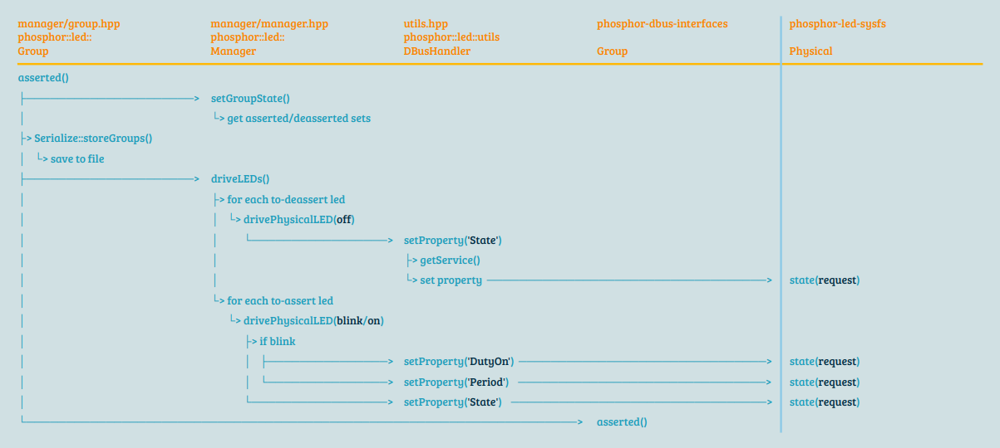
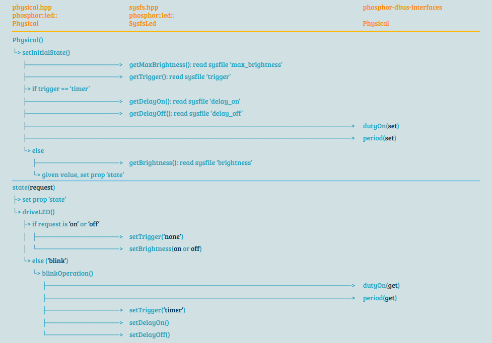

~> Study case: Aspeed OpenBMC (commit 742fec782ef6c34c9fcd866116631e1d7aeedf8c)

## Index

- [Introduction](#introduction)
- [Cheat Sheet](#cheat-sheet)
- [Reference](#reference)

## <a name="introduction"></a> Introduction

### phosphor-led-manager

<p align="center"></p>

### phosphor-led-sysfs

<p align="center"></p>

## <a name="cheat-sheet"></a> Cheat Sheet

- query sysfs of mmc0

```
udevadm info /sys/class/leds/mmc0\:\:
```

## <a name="reference"></a> Reference

- [phosphor-led-manager](https://github.com/openbmc/phosphor-led-manager)
- [phosphor-led-sysfs](https://github.com/openbmc/phosphor-led-sysfs)
