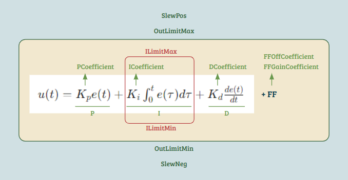
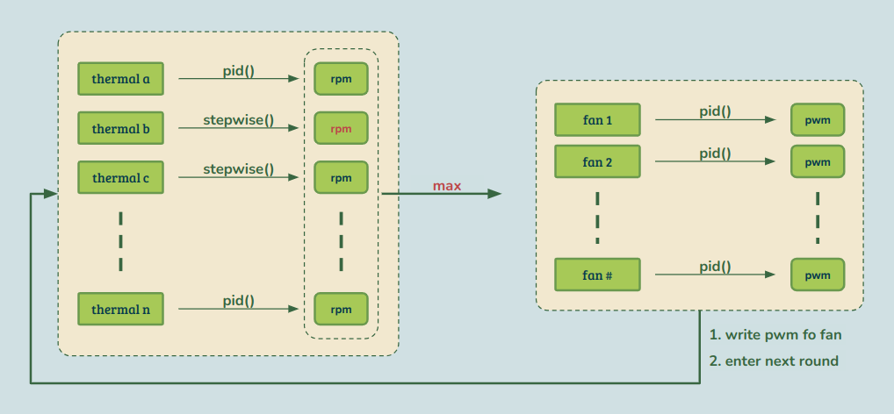
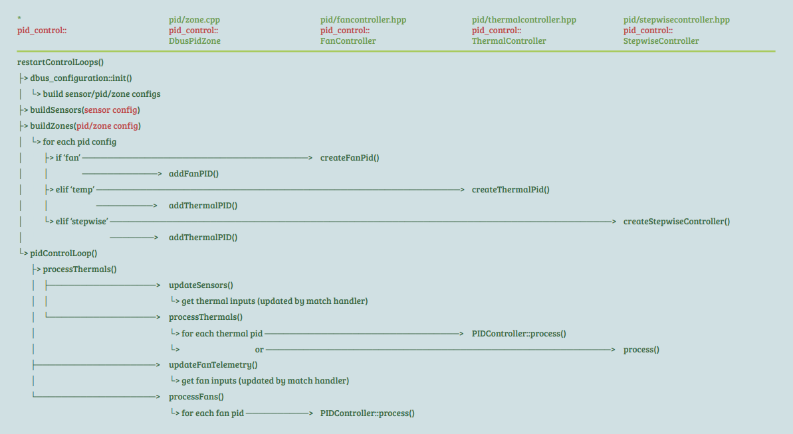
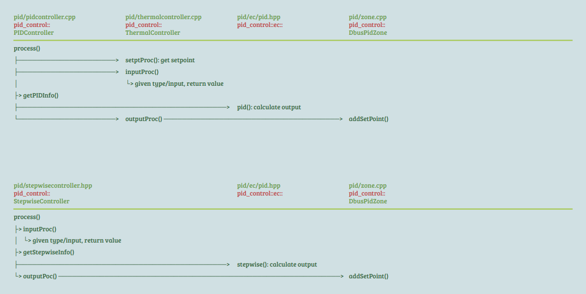
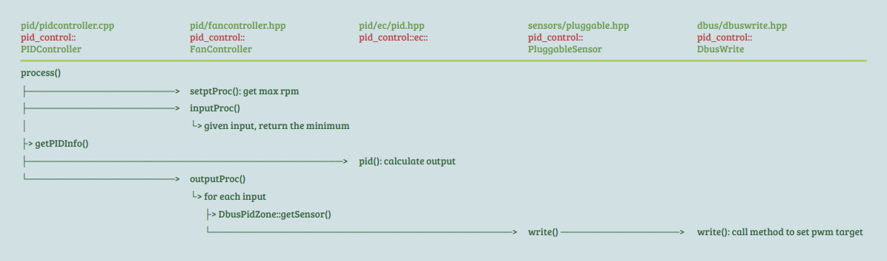

> Study case: Aspeed OpenBMC (commit 742fec782ef6c34c9fcd866116631e1d7aeedf8c)

## Index

- [Introduction](#introduction)
- [Code Flow](#code-flow)
- [Reference](#reference)

##  Introduction

The PID acronym stands for "proportional integral and derivative," representing a mathematical formula that takes input to calculate the output.
Configuring PID is essential for each sensor intended to be incorporated into the PID framework. Additionally, there is a zone configuration, which can be seen as a collection of PID configurations.
The fundamental concept behind PID control is to regulate fan PWM (Pulse Width Modulation) to bring the thermal conditions (such as temperature) closer to a predefined target point, formally referred to as the setpoint in both materials and code. 
This involves several parameters known as PID coefficients that are integral to the calculation process.

Beyond PID-type sensors, there are also stepwise-type sensors that employ a more straightforward approach to establish a direct mapping between input readings and output setpoints.
During each control iteration, all thermal sensors undergo traversal and calculation to determine a setpoint, employing either the PID formula or stepwise mapping. 
These setpoints are then stored in the zone.
Subsequently, it's the fan's turn to act. 
The maximum setpoint from the zone is taken as input, and the output PWM is calculated using the PID formula. 
This calculated value is then transmitted as a request to the fan control service.

##  Code Flow

- main

- thermal sensor process

- fan sensor process

##  Reference

- [phosphor-pid-control](https://github.com/openbmc/phosphor-pid-control)
