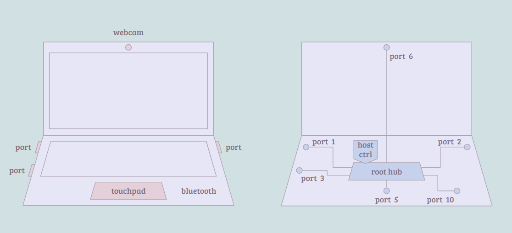

> The note is based on Linux version 5.15.0 in OpenBMC.

## Index

- [Introduction](#introduction)
- [Host](#host)
- [Device](#device)
- [Hub](#hub)
- [System Startup](#system-startup)
- [Cheat Sheet](#cheat-sheet)
- [Reference](#reference)

## <a name="introduction"></a> Introduction

(TBD)

## <a name="host"></a> Host

The universal serial bus (USB) is a typical master-slave framework in that the USB controller initiates a request, and the target device responds. 
The controller comes with a root hub; every port can further connects to a USB device or adapts to another hub, and so on. 
Following the significant USB standards, a few host controller drivers (HCD) have been adequately implemented and stuffed into the kernel.

- UHCI
    - the universal host controller interface
    - supports USB 1.x
    - proprietary interface from Intel
- OHCI
    - the open host controller interface
    - supports USB 1.x with improved interface
- EHCI
    - the enhanced host controller interface
    - supports USB 2.x
- xHCI
    - the extensible host controller interface
    - supports USB 3.x

Please refer to the below image for the general view of the USB topology obtained from my laptop (Vostro 5402):

<p align="center"></p>

<details><summary> More Details </summary>
  
```
$ lsusb --tree
/:  Bus 04.Port 1: Dev 1, Class=root_hub, Driver=xhci_hcd/4p, 10000M
/:  Bus 03.Port 1: Dev 1, Class=root_hub, Driver=xhci_hcd/12p, 480M
    |__ Port 1: Dev 6, If 0, Class=Human Interface Device, Driver=usbhid, 12M
    |__ Port 1: Dev 6, If 1, Class=Human Interface Device, Driver=usbhid, 12M
    |__ Port 5: Dev 3, If 0, Class=Vendor Specific Class, Driver=, 12M
    |__ Port 6: Dev 4, If 0, Class=Video, Driver=uvcvideo, 480M
    |__ Port 6: Dev 4, If 1, Class=Video, Driver=uvcvideo, 480M
    |__ Port 10: Dev 5, If 0, Class=Wireless, Driver=btusb, 12M
    |__ Port 10: Dev 5, If 1, Class=Wireless, Driver=btusb, 12M
/:  Bus 02.Port 1: Dev 1, Class=root_hub, Driver=xhci_hcd/4p, 10000M
/:  Bus 01.Port 1: Dev 1, Class=root_hub, Driver=xhci_hcd/1p, 480M
```
    
</details>

## <a name="device"></a> Device

```
struct usb_driver {
    const char *name;                                   // driver name (must be unique)
    int (*probe) (struct usb_interface *intf,
              const struct usb_device_id *id);          // check if (device, driver) match
    void (*disconnect) (struct usb_interface *intf);    // work with usb interface
    struct usbdrv_wrap drvwrap;                         // usb driver wrapper
};
```

```
struct usbdrv_wrap {
    struct device_driver driver;    // driver
    int for_devices;                // 0: interface driver, else: device driver
};
```

```
struct usb_device_id {
    __u16       match_flags;    // specifies which fields to compare
};
```

```
struct usb_device {
    int     devnum; // unique device number
    char        devpath[16];        // dev position in usb tree topology
    enum usb_device_state   state;  // e.g., attached, configured, ...
    enum usb_device_speed   speed;  // e.g., low, full, high, ...
    struct usb_device *parent;      // points to usb huuub
    struct usb_bus *bus;            // point to usb_bus
    struct device dev;              // generic device model
    struct usb_device_descriptor descriptor;    // more detailed dev data
    struct usb_host_config *config;             // list of possible configs
    struct usb_host_config *actconfig;          // poitns current working config
    char *product;      // hw info
    char *manufacturer; // hw info
    char *serial;       // hw info
    int maxchild;       // if self is a usb hub, this specifies how many ports it has
};
```

```
struct usb_bus {
    struct device *controller;  // points to controller
    struct device *sysdev;      /* as seen from firmware or bus */
    int busnum;             // unique bus number
    const char *bus_name;   // unique bus name
    u8 uses_pio_for_control;    /*
                     * Does the host controller use PIO
                     * for control transfers?
                     */
    u8 otg_port;            /* 0, or number of OTG/HNP port */
    unsigned is_b_host:1;       /* true during some HNP roleswitches */
    unsigned b_hnp_enable:1;    /* OTG: did A-Host enable HNP? */
    unsigned no_stop_on_short:1;    /*
                     * Quirk: some controllers don't stop
                     * the ep queue on a short transfer
                     * with the URB_SHORT_NOT_OK flag set.
                     */
    unsigned no_sg_constraint:1;    /* no sg constraint */
    unsigned sg_tablesize;      /* 0 or largest number of sg list entries */

    int devnum_next;        /* Next open device number in
                     * round-robin allocation */
    struct mutex devnum_next_mutex; /* devnum_next mutex */

    struct usb_devmap devmap;   // bitmap for dev# tracking
    struct usb_device *root_hub;    // points to root hub
    struct usb_bus *hs_companion;   /* Companion EHCI bus, if any */

    int bandwidth_allocated;    /* on this bus: how much of the time
                     * reserved for periodic (intr/iso)
                     * requests is used, on average?
                     * Units: microseconds/frame.
                     * Limits: Full/low speed reserve 90%,
                     * while high speed reserves 80%.
                     */
    int bandwidth_int_reqs;     /* number of Interrupt requests */
    int bandwidth_isoc_reqs;
```

```
 static struct usb_driver hub_driver = {
     .name =     "hub",                 
     .probe =    hub_probe,             
     .disconnect =   hub_disconnect,    
     .suspend =  hub_suspend,           
     .resume =   hub_resume,            
     .reset_resume = hub_reset_resume,  
     .pre_reset =    hub_pre_reset,     
     .post_reset =   hub_post_reset,    
     .unlocked_ioctl = hub_ioctl,       
     .id_table = hub_id_table,          
     .supports_autosuspend = 1,         
 };                                     
```

```
+-----------------+                                                                
| usb_device_read | : for each usb bus: traverse usb hierarchy and dump descriptors
+-|---------------+                                                                
  |                                                                                
  +--> for each usb bus                                                            
       |                                                                           
       |    +-----------------+                                                    
       +--> | usb_device_dump | traverse usb hierarchy and dump descriptors        
            +-----------------+                                                    
```

```
+-----------------+                                                                   
| usb_device_dump | : traverse usb hierarchy and dump descriptors                     
+-|---------------+                                                                   
  |                                                                                   
  |--> alloc 2 pages                                                                  
  |                                                                                   
  |--> prepare topology info                                                          
  |                                                                                   
  |--> if this is root hub (level is 0)                                               
  |    -                                                                              
  |    +--> prepare bandwidth info                                                    
  |                                                                                   
  |    +---------------+                                                              
  |--> | usb_dump_desc | prepare info of devoce, product, config, iad, iface, endpoint
  |    +---------------+                                                              
  |                                                                                   
  +--> for each child dev                                                             
       |                                                                              
       |    +-----------------+                                                       
       +--> | usb_device_dump | (recursive)                                           
            +-----------------+                                                       
```

```
+---------------+                                                                
| usb_dump_desc | ： prepare info of devoce, product, config, iad, iface, endpoint
+-|-------------+                                                                
  |    +----------------------------+                                            
  |--> | usb_dump_device_descriptor | prepare device info                        
  |    +----------------------------+                                            
  |    +-------------------------+                                               
  |--> | usb_dump_device_strings | prepare manufacturer/product/serial info      
  |    +-------------------------+                                               
  |                                                                              
  +--> for each config in descriptor                                             
       |                                                                         
       |    +-----------------+                                                  
       +--> | usb_dump_config | prepare info of config, iad, iface, endpoint     
            +-----------------+                                                  
```

```
+-----------------+                                                    
| usb_dump_config | : prepare info of config, iad, iface, endpoint     
+-|---------------+                                                    
  |    +----------------------------+                                  
  |--> | usb_dump_config_descriptor | prepare config info              
  |    +----------------------------+                                  
  |                                                                    
  |--> for each iface association descriptor (iad)                     
  |    |                                                               
  |    |    +-------------------------+                                
  |    +--> | usb_dump_iad_descriptor | prepare iad info               
  |         +-------------------------+                                
  |                                                                    
  +--> for each iface in config                                        
       -                                                               
       +--> for each alternate setting                                 
            |                                                          
            |    +--------------------+                                
            +--> | usb_dump_interface | prepare info of iface, endpoint
                 +--------------------+                                
```

```
+--------------------+                                            
| usb_dump_interface | : prepare info of iface, endpoint          
+-|------------------+                                            
  |    +-------------------------------+                          
  |--> | usb_dump_interface_descriptor | prepare iface info       
  |    +-------------------------------+                          
  |                                                               
  +--> for each endpoint                                          
       |                                                          
       |    +------------------------------+                      
       +--> | usb_dump_endpoint_descriptor | prepare endpoint info
            +------------------------------+                      
```

```
+---------------------+                                       
| usb_probe_interface | : match id, call iface_driver->probe()
+-|-------------------+                                       
  |                                                           
  |--> get outer usb driver                                   
  |                                                           
  |--> match id                                               
  |                                                           
  +--> call usb_driver->probe(), e.g.,                        
       +--------------+                                       
       | usbhid_probe |                                       
       +--------------+                                       
```

```
+------------------+                                                                 
| usb_probe_device | : choose best config and set to it, ready endpoints             
+-|----------------+                                                                 
  |                                                                                  
  |--> get outer udriver                                                             
  |                                                                                  
  +--> call ->probe(), e.g.,                                                         
       +--------------------------+                                                  
       | usb_generic_driver_probe | choose best config and set to it, ready endpoints
       +--------------------------+                                                  
```

```
+--------------------------+                                                                         
| usb_generic_driver_probe | : choose best config and set to it, ready endpoints                     
+-|------------------------+                                                                         
  |    +--------------------------+                                                                  
  |--> | usb_choose_configuration | choose the best config to start with                             
  |    +--------------------------+                                                                  
  |    +-----------------------+                                                                     
  |--> | usb_set_configuration | enable related endpoints, send msg (set config), register all ep_dev
  |    +-----------------------+                                                                     
  |    +-----------------------+                                                                     
  +--> | usb_notify_add_device | call notifier chain of udev addition                                
       +-----------------------+                                                                     
```

```
+-----------------------+                                                                       
| usb_set_configuration | : enable related endpoints, send msg (set config), register all ep_dev
+-|---------------------+                                                                       
  |                                                                                             
  |--> alloc ptr array for that many interfaces specified by the config                         
  |                                                                                             
  |--> for each ptr                                                                             
  |    -                                                                                        
  |    +--> alloc usb_iface                                                                     
  |                                                                                             
  |    +-------------------------+                                                              
  |--> | cancel_async_set_config | cancel any pending 'set config' req bc we are changing it    
  |    +-------------------------+                                                              
  |                                                                                             
  |--> for each iface                                                                           
  |    |                                                                                        
  |    |    +----------------------+                                                            
  |    |--> | usb_enable_interface | enable all endpoints of iface                              
  |    |    +----------------------+                                                            
  |    |                                                                                        
  |    |--> set up iface_dev                                                                    
  |    |                                                                                        
  |    |    +--------------+                                                                    
  |    +--> | dev_set_name | "%d-%s:%d.%d" = (bus_num, dev_path, config, iface_num)             
  |         +--------------+                                                                    
  |    +----------------------+                                                                 
  |--> | usb_control_msg_send | send msg to 'set config'                                        
  |    +----------------------+                                                                 
  |                                                                                             
  |--> save config in dev                                                                       
  |                                                                                             
  |--> for each iface                                                                           
  |    |                                                                                        
  |    |    +------------+                                                                      
  |    +--> | device_add | register dev to trigger driver binding                               
  |         +------------+                                                                      
  |    +---------------------+                                                                  
  +--> | create_intf_ep_devs | for each ep of iface, prepare ep_dev and register it             
       +---------------------+                                                                  
```

```
+----------------------+                                
| usb_enable_interface | : enable all endpoints of iface
+-|--------------------+                                
  |                                                     
  +--> for each endpoint of the iface                   
       |                                                
       |    +---------------------+                     
       +--> | usb_enable_endpoint | enable endpoint     
            +---------------------+                     
```

```
+---------------------+                                                            
| create_intf_ep_devs | : for each ep of iface, prepare ep_dev and register it     
+-|-------------------+                                                            
  |                                                                                
  +--> for each ep of iface                                                        
       |                                                                           
       |    +--------------------+                                                 
       +--> | usb_create_ep_devs | prepare ep_dev, register it and save in endpoint
            +--------------------+                                                 
```

```
+---------------------+                                                                                          
| ehci_platform_probe | : map io, register usb bus, prepare usb_dev/ep0, register isr, init hw, regoster root hub
+-|-------------------+                                                                                          
  |    +------------------+                                                                                      
  |--> | platform_get_irq | get irq parsed from dtb earlier                                                      
  |    +------------------+                                                                                      
  |    +----------------+                                                                                        
  |--> | usb_create_hcd | prepare hcd                                                                            
  |    +----------------+                                                                                        
  |                                                                                                              
  |--> set hcd params from default or dtb                                                                        
  |                                                                                                              
  |    +------------------------+                                                                                
  |--> | reset_control_deassert | (skip)                                                                         
  |    +------------------------+                                                                                
  |    +-----------------------+                                                                                 
  |--> | platform_get_resource | get reg base parsed from dtb earlier                                            
  |    +-----------------------+                                                                                 
  |    +-----------------------+                                                                                 
  |--> | devm_ioremap_resource | map io                                                                          
  |    +-----------------------+                                                                                 
  |    +-------------+                                                                                           
  +--> | usb_add_hcd | register usb bus, prepare usb_dev/ep0, register isr, init hw, regoster root hub           
       +-------------+                                                                                           
```

```
+-------------+                                                                                  
| usb_add_hcd | : register usb bus, prepare usb_dev/ep0, register isr, init hw, regoster root hub
+-|-----------+                                                                                  
  |                                                                                              
  |--> print "EHCI Host Controller"                                                              
  |                                                                                              
  |    +-------------------+                                                                     
  |--> | hcd_buffer_create | prepare buffer pools                                                
  |    +-------------------+                                                                     
  |    +------------------+                                                                      
  |--> | usb_register_bus | notify the event of bus addition                                     
  |    +------------------+                                                                      
  |    +---------------+                                                                         
  |--> | usb_alloc_dev | prepare usb_dev, enable ep0                                             
  |    +---------------+                                                                         
  |    +---------------------------+                                                             
  |--> | usb_phy_roothub_calibrate | do nothing bc of disabled config                            
  |    +---------------------------+                                                             
  |    +----------------------+              +-------------+      +----------+                   
  |--> | usb_hcd_request_irqs | register isr | usb_hcd_irq | ---> | ehci_irq |                   
  |    +----------------------+              +-------------+      +----------+                   
  |                                                                                              
  |--> call ->start(), e.g.,                                                                     
  |    +----------+                                                                              
  |    | ehci_run | write hw regs to init, create sys files                                      
  |    +----------+                                                                              
  |                                                                                              
  |    +-------------------+                                                                     
  +--> | register_root_hub | get descriptor, ready configs, register usb_Dev and ep_dev          
       +-------------------+                                                                     
```

```
+------------------+                                                 
| usb_register_bus | : notify the event of bus addition              
+-|----------------+                                                 
  |                                                                  
  |--> get an unique# and assign to bus                              
  |                                                                  
  |    +--------------------+                                        
  |--> | usb_notify_add_bus | call notifier chain of the bus addition
  |    +--------------------+                                        
  |                                                                  
  +--> print "new USB bus registered, assigned bus number %d\n"      
```

```
+----------------------+                                        
| usb_hcd_request_irqs | : register isr                         
+-|--------------------+                                        
  |                                                             
  +--> if irq# found                                            
       |                                                        
       |    +-------------+ +-------------+                     
       |--> | request_irq | | usb_hcd_irq | call ->driver->irq()
       |    +-------------+ +-------------+                     
       |                                                        
       +--> print "irq %d, %s 0x%08llx\n"                       
```

```
+-------------------+                                                                 
| register_root_hub | : get descriptor, ready configs, register usb_Dev and ep_dev    
+-|-----------------+                                                                 
  |    +---------------------------+                                                  
  |--> | usb_get_device_descriptor | get device descriptor                            
  |    +---------------------------+                                                  
  |                                                                                   
  |--> if bcd# >= 0x0201                                                              
  |    |                                                                              
  |    |    +------------------------+                                                
  |    +--> | usb_get_bos_descriptor | get bos descriptor                             
  |         +------------------------+                                                
  |    +----------------+                                                             
  +--> | usb_new_device | ready usb configs, prepare dev#, register usb_dev and ep_dev
       +----------------+                                                             
```

```
+------------------+                                                          
| usb_register_dev | : save driver fops in usb_minors, create device for iface
+-|----------------+                                                          
  |                                                                           
  |--> get minor_base from arg class_driver                                   
  |                                                                           
  |--> reset minor_base bc of enabled config                                  
  |                                                                           
  |    +----------------+                                                     
  |--> | init_usb_class | prepare usb_class with class 'usbmisc'              
  |    +----------------+                                                     
  |                                                                           
  |--> usb_minors[minor] = driver_class fops                                  
  |                                                                           
  |--> save minor in iface                                                    
  |                                                                           
  |    +---------------+                                                      
  +--> | device_create | create device for iface                              
       +---------------+                                                      
```

```
+-----------+                                                                    
| hub_probe | : prepare hub, get descriptor, prepare ports, activate hub         
+-|---------+                                                                    
  |                                                                              
  |--> print "USB hub found\n"                                                   
  |                                                                              
  |--> alloc hub                                                                 
  |                                                                              
  |    +-------------+ +-------------------+                                     
  |--> | timer_setup | | hub_retry_irq_urb |                                     
  |    +-------------+ +-------------------+                                     
  |    +------------------+                                                      
  |--> | usb_set_intfdata | save hub in intf                                     
  |    +------------------+                                                      
  |    +---------------+                                                         
  +--> | hub_configure | prepare hub, get descriptor, prepare ports, activate hub
       +---------------+                                                         
```

```
+---------------+                                                                            
| hub_configure | : prepare hub, get descriptor, prepare ports, activate hub                 
+-|-------------+                                                                            
  |                                                                                          
  |--> alloc buffer, status, and descriptor for hub                                          
  |                                                                                          
  |    +--------------------+                                                                
  |--> | get_hub_descriptor | prepare msg (get hub desc) and submit it                       
  |    +--------------------+                                                                
  |                                                                                          
  |--> print "%d port%s detected\n"                                                          
  |                                                                                          
  |--> alloc ports for hub                                                                   
  |                                                                                          
  |    +-----------+ +-------------+                                                         
  |--> | INIT_WORK | | hub_tt_work |                                                         
  |    +-----------+ +-------------+                                                         
  |    +---------------+                                                                     
  |--> | usb_alloc_urb | alloc urb for hub                                                   
  |    +---------------+                                                                     
  |    +------------------+                       +---------+                                
  |--> | usb_fill_int_urb | init an interrupt urb | hub_irq |                                
  |    +------------------+                       +---------+                                
  |                                               handle hub event, resubmit hub urb         
  |--> for each port                                                                         
  |                                                                                          
  |        +----------------------------+                                                    
  |------> | usb_hub_create_port_device | prepare port_dev, register it, find and link a peer
  |        +----------------------------+                                                    
  |    +--------------+                                                                      
  +--> | hub_activate | power up and submit hub urb                                          
       +--------------+                                                                      
```

```
+---------+                                                                
| hub_irq | : handle hub event, resubmit hub urb                           
+-|-------+                                                                
  |                                                                        
  +--> prepare event bitmap                                                
  |                                                                        
  |    +-------------+                                                     
  +--> | kick_hub_wq |                                                     
  |    +-|-----------+                                                     
  |      |    +------------+ +-----------+                                 
  |      +--> | queue_work | | hub_event | handle port event if there's any
  |           +------------+ +-----------+                                 
  |    +----------------------+                                            
  +--> | hub_resubmit_irq_urb | submit urb                                 
       +----------------------+                                            
```

```
+-----------+                                                                                           
| hub_event | : handle port event if there's any                                                        
+-|---------+                                                                                           
  |                                                                                                      
  +--> for each port of hub_dev                                                                          
       -                                                                                                 
       +--> if event bit is set                                                                          
            |                                                                                            
            |    +------------+                                                                          
            +--> | port_event | get port status and handle connection change (ready usb_dev and endpoint)
                 +------------+                                                                          
```

```
+------------+                                                                                    
| port_event | : get port status and handle connection change (ready usb_dev and endpoint)        
+-|----------+                                                                                    
  |    +-----------------+                                                                        
  |--> | get_port_status | send control req to get port_status and port_change                    
  |    +-----------------+                                                                        
  |                                                                                               
  |--> handle port_status and port_change                                                         
  |                                                                                               
  |--> determine if connect_change                                                                
  |                                                                                               
  +--> if connect_change                                                                          
       |                                                                                          
       |    +-------------------------+                                                           
       +--> | hub_port_connect_change | ready usb_dev and endpoint, get usb descriptor and configs
            +-------------------------+                                                           
```

```
+-------------------------+                                                                       
| hub_port_connect_change | : ready usb_dev and endpoint, get usb descriptor and configs          
+-|-----------------------+                                                                       
  |    +------------------+                                                                       
  +--> | hub_port_connect | : ready usb_dev and endpoint, get usb descriptor and configs          
       +-|----------------+                                                                       
         |                                                                                        
         |--> ensure there's no connected usb dev                                                 
         |                                                                                        
         +--> for each attempt (4)                                                                
              |                                                                                   
              |    +---------------+                                                              
              |--> | usb_alloc_dev | prepare usb_dev, enable ep0                                  
              |    +---------------+                                                              
              |    +---------------+                                                              
              |--> | choose_devnum | choose dev num which is used as file name in usbfs           
              |    +---------------+                                                              
              |    +---------------+                                                              
              |--> | hub_port_init | reset device, get descriptor                                 
              |    +---------------+                                                              
              |    +----------------+                                                             
              |--> | usb_new_device | ready usb configs, prepare dev#, register usb_dev and ep_dev
              |    +----------------+                                                             
              |                                                                                   
              +--> return if everything is fine                                                   
```

```
+----------------+                                                               
| usb_new_device | : ready usb configs, prepare dev#, register usb_dev and ep_dev
+-|--------------+                                                               
  |    +----------------------+                                                  
  |--> | usb_enumerate_device | ensure we have read the configs                  
  |    +----------------------+                                                  
  |                                                                              
  +--> prepare dev# for usb_dev                                                  
  |                                                                              
  |    +-----------------+                                                       
  |--> | announce_device | print kernel msgs                                     
  |    +-----------------+                                                       
  |    +------------+                                                            
  |--> | device_add | (trigger driver match & probe)
  |    +------------+                                                            
  |                                                                              
  |--> create sys files between usb port dev and child dev                       
  |                                                                              
  |    +--------------------+                                                    
  +--> | usb_create_ep_devs | prepare ep_dev, register it and save in endpoint   
       +--------------------+                                                    
```

```
+--------------------+                                                   
| usb_create_ep_devs | : prepare ep_dev, register it and save in endpoint
+-|------------------+                                                   
  |                                                                      
  |--> alloc ep_dev                                                      
  |                                                                      
  |--> set dev type = usb_ep_device_type                                 
  |                                                                      
  |    +-----------------+                                               
  |--> | device_register |                                               
  |    +-----------------+                                               
  |                                                                      
  +--> save ep_dev in endpoint                                           
```

```
+-----------------+                                                                     
| announce_device | : print kernel msgs                                                 
+-|---------------+                                                                     
  |                                                                                     
  |--> print "New USB device found, idVendor=%04x, idProduct=%04x, bcdDevice=%2x.%02x\n"
  |                                                                                     
  |--> print "New USB device strings: Mfr=%d, Product=%d, SerialNumber=%d\n"            
  |                                                                                     
  |    +-------------+                                                                  
  |--> | show_string | 'Product'                                                        
  |    +-------------+                                                                  
  |    +-------------+                                                                  
  |--> | show_string | 'Manufacturer'                                                   
  |    +-------------+                                                                  
  |    +-------------+                                                                  
  +--> | show_string | 'SerialNumber'                                                   
       +-------------+                                                                  
```

```
+----------------------+                                                        
| usb_enumerate_device | : ensure we have read the configs                      
+-|--------------------+                                                        
  |                                                                             
  |--> if we don't have config yet                                              
  |    |                                                                        
  |    |    +-----------------------+                                           
  |    +--> | usb_get_configuration | for each config: get descriptors and parse
  |         +-----------------------+                                           
  |                                                                             
  |--> prepare string cache for product/manufacturer/serial                     
  |                                                                             
  |    +--------------------------+                                             
  +--> | usb_enumerate_device_otg | do nothing bc of disabled config            
       +--------------------------+                                             
```

```
+----------------------+                                                     
| usb_enumerate_device | : for each config: get descriptors and parse        
+-|--------------------+                                                     
  |                                                                          
  |--> alloc config for dev                                                  
  |                                                                          
  |--> alloc raw_descriptors for dev                                         
  |                                                                          
  |--> alloc config_desc                                                     
  |                                                                          
  +--> for each config                                                       
       |                                                                     
       |    +--------------------+                                           
       |--> | usb_get_descriptor | get the 1st desc to know the config length
       |    +--------------------+                                           
       |                                                                     
       |--> alloc big_buffer                                                 
       |                                                                     
       |    +--------------------+                                           
       |--> | usb_get_descriptor | get them all                              
       |    +--------------------+                                           
       |                                                                     
       |--> save big_buffer in dev                                           
       |                                                                     
       |    +-------------------------+                                      
       +--> | usb_parse_configuration | parse config                         
            +-------------------------+                                      
```

```
+---------------+                                                           
| hub_port_init | : reset device, get descriptor                            
+-|-------------+                                                           
  |    +----------------+                                                   
  |--> | hub_port_reset | reset the device                                  
  |    +----------------+                                                   
  |                                                                         
  |--> given speed, determine max packet size                               
  |                                                                         
  |--> get driver_name from controller or sysdev                            
  |                                                                         
  |--> for each retry (2)                                                   
  |    |                                                                    
  |    |--> if new scheme                                                   
  |    |    |                                                               
  |    |    |    +-------------------+                                      
  |    |    |--> | hub_enable_device | enable device                        
  |    |    |    +-------------------+                                      
  |    |    |                                                               
  |    |    |--> for each operation                                         
  |    |    |    |                                                          
  |    |    |    |    +-----------------+                                   
  |    |    |    +--> | usb_control_msg | send control msg to get descriptor
  |    |    |         +-----------------+                                   
  |    |    |    +----------------+                                         
  |    |    +--> | hub_port_reset | reset the device                        
  |    |         +----------------+                                         
  |    |                                                                    
  |    |--> if usb_dev isn't a wusb                                         
  |    |    |                                                               
  |    |    |    +-----------------+                                        
  |    |    |--> | hub_set_address | set addr and reinit ep0                
  |    |    |    +-----------------+                                        
  |    |    |                                                               
  |    |    +--> break if new scheme                                        
  |    |                                                                    
  |    |    +---------------------------+                                   
  |    |--> | usb_get_device_descriptor |                                   
  |    |    +---------------------------+                                   
  |    |                                                                    
  |    +--> break                                                           
  |                                                                         
  |    +---------------------------+                                        
  |--> | usb_get_device_descriptor |                                        
  |    +---------------------------+                                        
  |                                                                         
  +--> if bcd# >= 0x0201                                                    
       |                                                                    
       |    +------------------------+                                      
       +--> | usb_get_bos_descriptor |                                      
            +------------------------+                                      
```

```
+---------------+                              
| usb_alloc_dev | : prepare usb_dev, enable ep0
+-|-------------+                              
  |                                            
  |--> alloc usb_dev                           
  |                                            
  |--> set bus and type of dev                 
  |                                            
  |    +---------------------+                 
  |--> | usb_enable_endpoint | enable endpoint 
  |    +---------------------+                 
  |                                            
  |--> set path string and route# of dev       
  |                                            
  |--> if dev inserts in root hub              
  |    |                                       
  |    |    +------------------------------+   
  |    +--> | usb_hcd_find_raw_port_number |   
  |         +------------------------------+   
  |                                            
  +--> set parent/bus/port# of dev             
```

```
+---------------------+                              
| usb_enable_endpoint | : enable endpoint            
+-|-------------------+                              
  |                                                  
  |--> if arg reset_ep is specified                  
  |    |                                             
  |    |    +------------------------+               
  |    +--> | usb_hcd_reset_endpoint | reset endpoint
  |         +------------------------+               
  |                                                  
  |--> save ep in dev                                
  |                                                  
  +--> label 'enabled' on ep                         
```

```
+-----------------+                                                                 
| get_port_status | : send control req to get port_status and port_change           
+-|---------------+                                                                 
  |    +---------------------+                                                      
  +--> | hub_ext_port_status | : send control req to get port_status and port_change
       +-|-------------------+                                                      
         |    +-----------------+                                                   
         |--> | get_port_status | send control req to get port status               
         |    +-----------------+                                                   
         |                                                                          
         +--> get port_status and port_change                                       
```

```
+----------------------------+                                                      
| usb_hub_create_port_device | : prepare port_dev, register it, find and link a peer
+-|--------------------------+                                                      
  |                                                                                 
  |--> alloc port_dev                                                               
  |                                                                                 
  |--> alloc req for port_dev                                                       
  |                                                                                 
  |--> assign port_dev to hub                                                       
  |                                                                                 
  |--> set type and driver for port_dev                                             
  |                                                                                 
  |    +-----------------+                                                          
  |--> | device_register |                                                          
  |    +-----------------+                                                          
  |    +--------------------+                                                       
  +--> | find_and_link_peer | find peer and relate it with arg port_dev             
       +--------------------+                                                       
```

```
+--------------------+                                                         
| find_and_link_peer | : find peer and relate it with arg port_dev             
+-|------------------+                                                         
  |                                                                            
  |--> if port_dev has specified location                                      
  |    |                                                                       
  |    |--> for each dev on 'usb' bus                                          
  |    |    |                                                                  
  |    |    |    +----------------+                                            
  |    |    +--> | match_location | find peer, relate it with port_dev if found
  |    |         +----------------+                                            
  |    +--> return                                                             
  |                                                                            
  |--> elif hdev has no parent                                                 
  |    -                                                                       
  |    +--> set peer_hdev = root_hub                                           
  |                                                                            
  |--> else                                                                    
  |    -                                                                       
  |    +--> set peer_hdev = upstream->peer->child                              
  |                                                                            
  |--> determine peer from peer_hdev                                           
  |                                                                            
  |    +-------------------+                                                   
  +--> | link_peers_report | relate peer and port_dev                          
       +-------------------+                                                   
```

```
+----------------+                                              
| match_location | : find peer, relate it with port_dev if found
+-|--------------+                                              
  |                                                             
  +--> for each of peer_hdev                                    
       -                                                        
       +--> if that peer and arg port_dev have the same location
            |                                                   
            |    +-------------------+                          
            +--> | link_peers_report | relate them              
                 +-------------------+                          
```

```
+--------------------+                                              
| get_hub_descriptor | : prepare msg (get hub desc) and submit it   
+-|------------------+                                              
  |                                                                 
  |--> determine type and size                                      
  |                                                                 
  +--> for 0, 1, 2                                                  
       |                                                            
       |    +-----------------+                                     
       +--> | usb_control_msg | set up a ctrl req, submit urb for it
            +-----------------+                                     
```

```
+-----------------+                                                                         
| usb_control_msg | : set up a ctrl req, submit urb for it                                  
+-|---------------+                                                                         
  |                                                                                         
  |--> alloc ctrl_req                                                                       
  |                                                                                         
  |--> set up type, req, value, index, and size                                             
  |                                                                                         
  |    +--------------------------+                                                         
  +--> | usb_internal_control_msg | prepare a 'control' urb, get an endpoint, submit the urb
       +--------------------------+                                                         
```

```
+--------------------------+                                                           
| usb_internal_control_msg | : prepare a 'control' urb, get an endpoint, submit the urb
+-|------------------------+                                                           
  |    +---------------+                                                               
  |--> | usb_alloc_urb | prepare urb                                                   
  |    +---------------+                                                               
  |    +----------------------+                                                        
  |--> | usb_fill_control_urb | set up a control urb                                   
  |    +----------------------+                                                        
  |    +--------------------+                                                          
  +--> | usb_start_wait_urb | get endpoint, submit urb for processing                  
       +--------------------+                                                          
```

```
+--------------------+                                           
| usb_start_wait_urb | : get endpoint, submit urb for processing 
+-|------------------+                                           
  |    +----------------+                                        
  |--> | usb_submit_urb | get endpoint, submit urb for processing
  |    +----------------+                                        
  |                                                              
  |--> return actual buf len through arg                         
  |                                                              
  |    +--------------+                                          
  +--> | usb_free_urb |                                          
       +--------------+                                          
```

```
+----------------+                                             
| usb_submit_urb | : get endpoint, submit urb for processing   
+-|--------------+                                             
  |    +-------------------+                                   
  |--> | usb_pipe_endpoint | get an in or out endpoint from dev
  |    +-------------------+                                   
  |                                                            
  |--> set up urb                                              
  |                                                            
  |    +-------------------+                                   
  |--> | usb_endpoint_type | get endpoint type                 
  |    +-------------------+                                   
  |                                                            
  |--> determine if 'is_out'                                   
  |                                                            
  |--> adjust max speed based on type                          
  |                                                            
  |    +--------------------+                                  
  +--> | usb_hcd_submit_urb | submit urb for processing        
       +--------------------+                                  
```

```
+--------------------+                                       
| usb_hcd_submit_urb | : submit urb for processing           
+-|------------------+                                       
  |    +-------------------+                                 
  |--> | usbmon_urb_submit | do nothing bc of disabled config
  |    +-------------------+                                 
  |                                                          
  |--> if it's root hub                                      
  |    |                                                     
  |    |    +----------------+                               
  |    +--> | rh_urb_enqueue | handle urb                    
  |         +----------------+                               
  |                                                          
  +--> else                                                  
       -                                                     
       +--> call ->urb_enqueue, e.g.,                        
            +------------------+                             
            | ehci_urb_enqueue | submit urb to somewhere?    
            +------------------+                             
```

```
+----------------+                                                             
| rh_urb_enqueue | : handle urb                                                
+---|------------+                                                             
    |                                                                          
    |--> if the ep has interrupt-type transfer                                 
    |    |                                                                     
    |    |    +-----------------+                                              
    |    +--> | rh_queue_status | add urb to ep, poll root hub status          
    |         +-----------------+                                              
    |                                                                          
    +--> if the ep has control-type transfer                                   
         |                                                                     
         |    +-----------------+                                              
         +--> | rh_call_control | get type from urb cmd, handle req accordingly
              +-----------------+                                              
```

```
+-----------------+                                                 
| rh_call_control | : get type from urb cmd, handle req accordingly 
+-|---------------+                                                 
  |    +-----------------------+                                    
  |--> | usb_hcd_link_urb_to_ep| add urb to ep                      
  |    +-----------------------+                                    
  |                                                                 
  |--> get type/value/index/length from urb cmd                     
  |                                                                 
  |--> alloc buffer                                                 
  |                                                                 
  |--> switch (request) type                                        
  |                                                                 
  |--> case 'device requests'                                       
  |    -                                                            
  |    +--> blabla                                                  
  |                                                                 
  |--> case 'endpoint requests'                                     
  |    -                                                            
  |    +--> blabla                                                  
  |                                                                 
  |--> case 'class requests'                                        
  |    -                                                            
  |    +--> call ->hub_control()                                    
  |         +------------------+                                    
  |         | ehci_hub_control |                                    
  |         +------------------+                                    
  |    +----------------------------+                               
  |--> | usb_hcd_unlink_urb_from_ep | remove urb from ep            
  |    +----------------------------+                               
  |    +----------------------+                                     
  +--> | usb_hcd_giveback_urb | return urb from hcd to device driver
       +----------------------+                                     
```

```
+-----------------+                                      
| rh_queue_status | : add urb to ep, poll root hub status
+-|---------------+                                      
  |    +------------------------+                        
  |--> | usb_hcd_link_urb_to_ep | add urb to ep          
  |    +------------------------+                        
  |                                                      
  |--> relate urb and hcd                                
  |                                                      
  +--> modify timer                                      
       +---------------+                                 
       | rh_timer_func | poll root hub status            
       +---------------+                                 
```

```
+---------------+                                     
| rh_timer_func | : poll root hub status              
+-|-------------+                                     
  |                                                   
  |--> get hcd from timer                             
  |                                                   
  |    +------------------------+                     
  +--> | usb_hcd_poll_rh_status | poll root hub status
       +------------------------+                     
```

```
+------------------------+                                                    
| usb_hcd_poll_rh_status | : poll root hub status                             
+-|----------------------+                                                    
  |                                                                           
  |--> call ->hub_status_data(), e.g.,                                        
  |    +----------------------+                                               
  |    | ehci_hub_status_data | build 'status change' packet                  
  |    +----------------------+                                               
  |                                                                           
  |--> if packet size is non-zero                                             
  |    |                                                                      
  |    |--> get urb from hcd                                                  
  |    |                                                                      
  |    +--> if urb exists                                                     
  |         |                                                                 
  |         |--> clear 'pending' of hcd                                       
  |         |                                                                 
  |         |--> copy packet to urb                                           
  |         |                                                                 
  |         |    +----------------------------+                               
  |         |--> | usb_hcd_unlink_urb_from_ep | remove urb from endpoint      
  |         |    +----------------------------+                               
  |         |    +----------------------+                                     
  |         +--> | usb_hcd_giveback_urb | return urb from hcd to device driver
  |              +----------------------+                                     
  |    +-----------+                                                          
  +--> | mod_timer | modify timer to poll status                              
       +-----------+                                                          
```

```
+----------------------+                                        
| usb_hcd_giveback_urb | :  return urb from hcd to device driver
+-|--------------------+                                        
  |                                                             
  |--> save status in urb                                       
  |                                                             
  |    +------------------------+                               
  +--> | __usb_hcd_giveback_urb | unanchor urb, complete it     
       +------------------------+                               
```

```
+------------------------+
| __usb_hcd_giveback_urb | : unanchor urb, complete it
+-|----------------------+
  |    +-------------------+
  |--> | unmap_urb_for_dma |
  |    +-------------------+
  |    +---------------------+
  |--> | usbmon_urb_complete | do nothing bc of disabled config
  |    +---------------------+
  |    +------------------+
  |--> | usb_unanchor_urb | remove urb from anchor list
  |    +------------------+
  |
  +--> call ->complete(), e.g.,
       +---------+
       | hub_irq | handle hub event, resubmit hub urb
       +---------+                                   
```

```
+---------------------------+
| gadget_dev_desc_UDC_store | : determine udc and bind to driver (ready gadget and composite), start udc
+-|-------------------------+
  |
  |--> prepare name, and set udc_name = name
  |
  |    +-------------------------+
  +--> | usb_gadget_probe_driver | determine udc and bind to driver (ready gadget and composite), start udc
       +-------------------------+


                    CONFIGFS_ATTR(gadget_dev_desc_, UDC);


                    #define CONFIGFS_ATTR(_pfx, _name)          \
                    static struct configfs_attribute gadget_dev_desc_attr_UDC = { \
                        .ca_name    = __stringify(UDC),       \
                        .ca_mode    = S_IRUGO | S_IWUSR,        \
                        .ca_owner   = THIS_MODULE,          \
                        .show       = gadget_dev_desc_UDC_show,       \
                        .store      = gadget_dev_desc_UDC_store,      \
                    }                                                                           
```

```
+-------------------------+                                                                               
| usb_gadget_probe_driver | : determine udc and bind to driver (ready gadget and composite), start udc    
+-|-----------------------+                                                                               
  |                                                                                                       
  |--> if driver udc_name is set                                                                          
  |                                                                                                       
  |------> for each udc on list                                                                           
  |                                                                                                       
  |----------> compare name, break if found                                                               
  |                                                                                                       
  |--> else                                                                                               
  |                                                                                                       
  |------> find the 1st available one                                                                     
  |                                                                                                       
  |--> return error if not found                                                                          
  |                                                                                                       
  |    +--------------------+                                                                             
  +--> | udc_bind_to_driver | relate udc/driver, set gadget speed, bind composite to gadget, and start udc
       +--------------------+                                                                             
```

```
+-------------------+                                         
| usb_ep_autoconfig | : get an available ep and set up        
+-|-----------------+                                         
  |    +----------------------+                               
  +--> | usb_ep_autoconfig_ss | get an available ep and set up
       +----------------------+                               
```

```
+----------------------+                                                                  
| usb_ep_autoconfig_ss | : get an available ep and set up                                 
+-|--------------------+                                                                  
  |                                                                                       
  |--> if gadget has ->match_ep                                                           
  |                                                                                       
  +------> call ->match_ep(), e.g.,                                                       
  |        +-----------------------+                                                      
  |        | ast_vhub_udc_match_ep | ensure we have a ep (find a matched one and alloc it)
  |        +-----------------------+                                                      
  |                                                                                       
  |------> go to 'found_ep' if found                                                      
  |                                                                                       
  |--> for each ep on list of gadget                                                      
  |                                                                                       
  |        +--------------------------+                                                   
  |------> | usb_gadget_ep_match_desc | check if endpoint and descriptor match each other 
  |        +--------------------------+                                                   
  |                                                                                       
  |------> go to 'found_ep' if found                                                      
  |found_ep                                                                               
  |--> determine addr and save in descriptor                                              
  |                                                                                       
  +--> set up ep                                                                          
```

```
+-----------------------+                                                                                          
| ast_vhub_udc_match_ep | : ensure we have a ep (find a matched one and alloc it)                                  
+-|---------------------+                                                                                          
  |                                                                                                                
  |--> for each ep on gadget                                                                                       
  |                                                                                                                
  |        +--------------------------+                                                                            
  |------> | usb_gadget_ep_match_desc | check if endpoint and descriptor match each other                          
  |        +--------------------------+                                                                            
  |                                                                                                                
  |------> return ep if match is found                                                                             
  |                                                                                                                
  |--> determine max speed based on type (control, isochronous, bulk, interrupt)                                   
  |                                                                                                                
  |--> traverse vhub to find an used endpoint                                                                      
  |                                                                                                                
  |    +--------------------+                                                                                      
  +--> | ast_vhub_alloc_epn | get an unused ep from vhub, set up (install ops, alloc buffer), add to list of gadget
       +--------------------+                                                                                      
```

```
+--------------------+                                                                                        
| ast_vhub_alloc_epn | : get an unused ep from vhub, set up (install ops, alloc buffer), add to list of gadget
+-|------------------+                                                                                        
  |                                                                                                           
  |--> get an unused endpoint from vhub                                                                       
  |                                                                                                           
  |--> set up endpoint                                                                                        
  |                                                                                                           
  |--> install ep ops 'ast_vhub_epn_ops'                                                                      
  |                                                                                                           
  |    +--------------------+                                                                                 
  |--> | dma_alloc_coherent |                                                                                 
  |    +--------------------+                                                                                 
  |    +---------------+                                                                                      
  +--> | list_add_tail | add ep to list of gadget                                                             
       +---------------+                                                                                      
```

```
+--------------------------+                                                    
| usb_gadget_ep_match_desc | : check if endpoint and descriptor match each other
+-|------------------------+                                                    
  |                                                                             
  |--> get type and max_packet of descriptor                                    
  |                                                                             
  |--> check direction, packet limit, and speed                                 
  |                                                                             
  +--> chec type (control, isochronous, bulk, interrupt)                        
```

```
+-----------------------+                                                                       
| composite_dev_prepare | : prepare req for composite, assign composite to gadget ep0 as private
+-|---------------------+                                                                       
  |    +----------------------+                                                                 
  |--> | usb_ep_alloc_request | alloc request                                                   
  |    +----------------------+                                                                 
  |                                                                                             
  |--> assign req to composite dev                                                              
  |                                                                                             
  |--> alloc buffer for req                                                                     
  |                                                                                             
  |    +--------------------+                                                                   
  |--> | device_create_file | create files under /sys/                                          
  |    +--------------------+                                                                   
  |                                                                                             
  |--> gadget ep0 private = composite                                                           
  |                                                                                             
  |    +-------------------------+                                                              
  +--> | usb_ep_autoconfig_reset | reset ep state                                               
       +-------------------------+                                                              
```

```
+----------------------+                   
| usb_ep_alloc_request | : alloc request   
+-|--------------------+                   
  |                                        
  +--> call ->alloc_request, e.g.,         
       +------------------------+          
       | ast_vhub_alloc_request | alloc req
       +------------------------+          
```

```
+---------------------+                                            
| usb_gstrings_attach | : duplicate strings and attach to composite
+|--------------------+                                            
 |    +---------------------+                                      
 |--> | copy_gadget_strings | alloc buffer and copy strings to it  
 |    +---------------------+                                      
 |    +---------------+                                            
 +--> | list_add_tail | append copied strings to list in composite 
      +---------------+                                            
```

```
+------------------------+                                                    
| gether_register_netdev | : set mac to net_dev and register it, clear carrier
+-|----------------------+                                                    
  |    +-----------------+                                                    
  |--> | eth_hw_addr_set | assign mac from dev to net_dev                     
  |    +-----------------+                                                    
  |    +-----------------+                                                    
  |--> | register_netdev | register net_dev                                   
  |    +-----------------+                                                    
  |                                                                           
  |--> print host and dev mac?                                                
  |                                                                           
  |    +-------------------+                                                  
  +--> | netif_carrier_off | clear carrier                                    
       +-------------------+                                                  
```

```
+--------------+
| ast_vhub_irq | : handle vhub irq
+-|------------+
  |    +--------+
  |--> | writel | ack interrupt
  |    +--------+
  |
  |--> if there's interrupt for endpoint
  |
  |------> for each involved endpoint
  |
  |            +----------------------+
  |----------> | ast_vhub_epn_ack_irq | ack epn irq
  |            +----------------------+
  |
  |--> if there's interrupt for port
  |
  |------> for each port
  |
  |            +------------------+
  |----------> | ast_vhub_dev_irq | handle dev irq
  |            +------------------+
  |
  |--> if there's interrupt for top-level vhub ep0
  |
  |        +-------------------------+
  |------> | ast_vhub_ep0_handle_ack | given ep0 state, handle the 1st req on list accordingly (send or receive)
  |        +-------------------------+
  |         or
  |        +---------------------------+
  |------> | ast_vhub_ep0_handle_setup | handle req propery, pass to gadget driver if needed
  |        +---------------------------+
  |
  |--> if there's interrupt for top-level bus events
  |
  |        +---------------------+
  |------> | ast_vhub_hub_resume | for each port, call its driver->resume()
  |        +---------------------+
  |         or
  |        +----------------------+
  |------> | ast_vhub_hub_suspend | for each port, call its driver->suspend()
  |        +----------------------+
  |         or
  |        +--------------------+
  +------> | ast_vhub_hub_reset | for each port, call its driver->suspend(), and write hw reg to reset
           +--------------------+
```

```
+----------------------+
| ast_vhub_epn_ack_irq | : ack epn irq
+-|--------------------+
  |
  |--> if the ep is in desc mode
  |
  |        +------------------------------+
  |------> | ast_vhub_epn_handle_ack_desc | handle ack desc
  |        +------------------------------+
  |
  |--> else
  |
  |        +-------------------------+
  +------> | ast_vhub_epn_handle_ack | handle ack
           +-------------------------+              
```

```
+------------------------------+
| ast_vhub_epn_handle_ack_desc | : handle ack desc
+-|----------------------------+
  |
  |--> get 'last' from hardware register
  |
  |    +--------------------------+
  |--> | list_first_entry_or_null | get the first req from queue of ep
  |    +--------------------------+
  |
  |--> while ep last != 'last'
  |                                                                req
  |------> get desc from ep last                                 +------+
  |                                                              |  +------+
  |------> ep last++                                             |  | desc |
  |                                                              |  +------+
  |------> continue if it's not an active req                    |  | desc |
  |                                                              |  +------+
  |------> if current desc is the last specified in req          |  | desc |
  |                                                              +--+------+
  |            +---------------+
  |----------> | ast_vhub_done | finalize req
  |            +---------------+
  |            +--------------------------+
  |----------> | list_first_entry_or_null | get next req from list (in case somewhere adds it suddenly?)
  |            +--------------------------+
  |
  +----------> break
  |
  |--> if there's more work (req)
  |
  |        +------------------------+
  +------> | ast_vhub_epn_kick_desc | given req, set up descripters, kick hardware to process
           +------------------------+ 
```

```
+---------------+
| ast_vhub_done | : finalize req
+-|-------------+
  |    +---------------+
  |--> | list_del_init | remove req from list
  |    +---------------+
  |
  |--> if req has used dma
  |
  |        +---------------------------------+
  |------> | usb_gadget_unmap_request_by_dev |
  |        +---------------------------------+
  |
  |--> if the req isn't internal
  |
  |        +-----------------------------+
  +------> | usb_gadget_giveback_request | control led and call ->complete(), e.g.,
           +-----------------------------+ composite_setup_complete()
```

```
+------------------------+
| ast_vhub_epn_kick_desc | : given req, set up descripters, kick hardware to process
+-|----------------------+
  |
  |--> lable 'active' on req
  |
  |--> return if the last desc in req is handled
  |
  |--> while we can still create desc and req needs one
  |
  |------> get next free desc from ep
  |
  |------> ep next++
  |
  |------> calculate chunk size
  |
  |------> populate desc (save buf addr in desc)
  |
  |------> save chunk size in desc
  |
  |------> if it's the end of req or we don't have enough desc
  |
  |----------> set 'interrupt' bit in desc
  |
  |    +--------+
  +--> | writel | kick hardware to process descriptors
       +--------+
```

```
 +-------------------------+
 | ast_vhub_epn_handle_ack | : handle ack
 +-|-----------------------+
   |    +-------+
   |--> | readl | read ep status
   |    +-------+
   |    +--------------------------+
   |--> | list_first_entry_or_null | get the 1st request
   |    +--------------------------+
   |
   |--> return if no req
   |
   |--> go to 'next chunk' if req isn't active
   |
   |--> clear 'active' on req
   |
   |--> prepare data buffer if needed, and adjust size
   |
   |--> label 'last' on req if it's a short packet
   |
   |--> if no other desc needs handling
   |
   |        +---------------+
   |------> | ast_vhub_done | finalize req
   |        +---------------+
   |        +--------------------------+
   |------> | list_first_entry_or_null | pick up next req
   |        +--------------------------+
   |
   |------> return if nothing to do
   |next chunk
   |    +-------------------+
   +--> | ast_vhub_epn_kick | prepare buf, save addr to hw reg, label 'active' on req, and kick and hw
        +-------------------+
```

```
+-------------------+
| ast_vhub_epn_kick | : prepare buf, save addr to hw reg, label 'active' on req, and kick and hw
+-|-----------------+
  |
  |--> calculate chunk size
  |
  |--> prepare buffer and write addr to hw register
  |
  |--> label 'active' on req (packet on the fly)
  |
  |    +--------+
  +--> | writel | kick the hw
       +--------+
```

```
+------------------+
| ast_vhub_dev_irq | : handle dev irq
+-|----------------+
  |    +-------+
  |--> | readl | read isr status
  |    +-------+
  |    +--------+
  |--> | writel | ack interrupt
  |    +--------+
  |
  |--> if 'epo in ack stall'
  |
  |        +-------------------------+
  |------> | ast_vhub_ep0_handle_ack | given ep0 state, handle the 1st req on list accordingly (send or receive)
  |        +-------------------------+
  |
  |--> if 'epo out ack stall'
  |
  |        +-------------------------+
  |------> | ast_vhub_ep0_handle_ack | given ep0 state, handle the 1st req on list accordingly (send or receive)
  |        +-------------------------+
  |
  |--> if 'ep0 setup'
  |
  |        +---------------------------+
  +------> | ast_vhub_ep0_handle_setup | handle req propery, pass to gadget driver if needed
           +---------------------------+                
```

```
+-------------------------+
| ast_vhub_ep0_handle_ack | : given ep0 state, handle the 1st req on list accordingly (send or receive)
+-|-----------------------+
  |    +-------+
  |--> | readl | read ep0 status
  |    +-------+
  |    +--------------------------+
  |--> | list_first_entry_or_null | get the first req
  |    +--------------------------+
  |
  |--> switch state
  |
  |--> case token
  |------> if req (shouldn't happen)
  |            +---------------+
  |----------> | ast_vhub_nuke | finalize all req on ep
  |            +---------------+
  +----------> stall = true
  |
  |--> case data
  |------> if no req (should have)
  |----------> stall = true
  |----------> break
  |------> if direction is 'in'
  |            +----------------------+
  |----------> | ast_vhub_ep0_do_send | copy from req to ep buffer, and trigger send
  |            +----------------------+
  |------> else ('out')
  |            +-------------------------+
  |----------> | ast_vhub_ep0_do_receive | copy from ep buffer to req, trigger 'receive' or 'send' accordingly
  |            +-------------------------+
  |
  |--> case status
  +------> if req (shouldn't happen)
  |            +---------------+
  |            | ast_vhub_nuke | finalize all req on ep
  |            +---------------+
  |------> if direction and ack mismatch
  |----------> stall = true
  |
  |--> case stall
  |        +---------------+
  |------> | ast_vhub_nuke | finalize all req on ep
  |        +---------------+
  |
  |--> if stall
  |
  |        +--------+
  +------> | writel | stall the ep
           +--------+
```

```
+---------------+
| ast_vhub_nuke | : finalize all req on ep
+-|-------------+
  |
  |--> while ep queue still has something
  |
  |        +------------------+
  |------> | list_first_entry | get the 1st req
  |        +------------------+
  |        +---------------+
  +------> | ast_vhub_done | finalize req
           +---------------+
```

```
+----------------------+
| ast_vhub_ep0_do_send | : copy from req to ep buffer, and trigger send
+-|--------------------+
  |
  |--> label 'last_desc' if it's the status from gadget
  |
  |--> if we're done (can receive)
  |
  |        +--------+
  |------> | writel | write 'rx buff ready' to hw reg
  |        +--------+
  |        +---------------+
  |------> | ast_vhub_done | finalize req
  |        +---------------+
  |
  +------> return
  |
  |--> decide chunk size
  |
  |    +--------+
  |--> | memcpy | copy data from req to ep buffer
  |    +--------+
  |    +--------+
  +--> | writel | save chunck size and trigger send
       +--------+ 
```

```
+-------------------------+
| ast_vhub_ep0_do_receive | : copy from ep buffer to req, trigger 'receive' or 'send' accordingly
+-|-----------------------+
  |
  |--> calculate remaining space
  |
  |--> copy data from ep buffer to request
  |
  |--> update 'actual' size
  |
  |--> if we're done (no more to receive)
  |
  |        +--------+
  |------> | writel | write 'tx buf ready'
  |        +--------+
  |        +---------------+
  |------> | ast_vhub_done | finalize req
  |        +---------------+
  |
  |--> else
  |
  |        +-----------------------+
  +------> | ast_vhub_ep0_rx_prime | write 'rx buf ready'
           +-----------------------+
```

```
+---------------------------+
| ast_vhub_ep0_handle_setup | : handle req propery, pass to gadget driver if needed
+-|-------------------------+
  |
  |--> copy setup packet from 'ep0 setup'
  |
  |--> set ep0 state and direction
  |
  |--> if ep has no device yet
  |
  |------> if req type is standard
  |
  |            +--------------------------+
  |----------> | ast_vhub_std_hub_request | handle the request properly
  |            +--------------------------+
  |
  |------> elif req type is class
  |
  |            +----------------------------+
  |----------> | ast_vhub_class_hub_request | handle the request properly
  |            +----------------------------+
  |
  |--> elif req type is statndard
  |
  |        +--------------------------+
  |------> | ast_vhub_std_dev_request | handle the request properly
  |        +--------------------------+
  |
  |--> return if rc == data
  |
  |--> if rc == driver (pass req to drvier)
  |
  |------> call ->setup()
  |
  |--> elif rc == stall
  |
  |        +--------+
  |------> | writel | write 'stall'
  |        +--------+
  |
  |--> elif rc == complete
  |
  |        +--------+
  +------> | writel | write 'tx buf ready'
           +--------+ 
```

```
+--------------------------+
| ast_vhub_std_hub_request | : handle the request properly
+-|------------------------+
  |
  |--> get value/index/length from ctrl req
  |
  |--> determine vhub speed
  |
  |--> switch req
  |
  |--> case 'set address': blabla
  |
  |--> case 'get status': blabla
  |
  |--> case 'set/clear feature': blabla
  |
  |--> case 'get/set configuration': blabla
  |
  |--> case 'get descriptor': blabla
  |
  +--> case 'get/set interface': blabla
```

```
+----------------------------+
| ast_vhub_class_hub_request | : handle the request properly
+-|---- ---------------------+
  |
  |--> get value/index/length from ctrl req
  |
  |--> switch req
  |
  |--> case 'get status': blabla
  |
  |--> case 'get/set hub feature': blabla
  |
  |--> case 'get/set port feature': blabla
  |
  +--> case 'tt?': blabla
```

```
+--------------------------+
| ast_vhub_std_dev_request | : handle the request properly
+-|------------------------+
  |
  |--> get value and index from 'ctrl req'
  |
  |--> switch req
  |
  |--> case 'set address': blabla
  |
  |--> case 'get status': blabla
  |
  +--> case 'set/clear feature': blabla
```

```
+--------------+                                                                                   
| gadgets_make | : alloc gadget_info, set up groups, composite & dev, install driver               
+-|------------+                                                                                   
  |                                                                                                
  |--> alloc gadget_info                                                                           
  |                                                                                                
  |    +-----------------------------+                                                             
  |--> | config_group_init_type_name | set up root group right under /sys/kernel/config/usb_gadget/
  |    +-----------------------------+                                                             
  |    +-----------------------------+                                         +---------------+   
  |--> | config_group_init_type_name | set up 'functions' group                | function_make |   
  |    +-----------------------------+                                         +---------------+   
  |    +----------------------------+                                                              
  |--> | configfs_add_default_group | add 'functions' group to root group                          
  |    +----------------------------+                                                              
  |    +-----------------------------+                                         +------------------+
  |--> | config_group_init_type_name | set up 'configs' group                  | config_desc_make |
  |    +-----------------------------+                                         +------------------+
  |    +----------------------------+                                                              
  |--> | configfs_add_default_group | add 'configs' group to root group                            
  |    +----------------------------+                                                              
  |    +-----------------------------+                                                             
  |--> | config_group_init_type_name | set up 'strings' group                                      
  |    +-----------------------------+                                                             
  |    +----------------------------+                                                              
  |--> | configfs_add_default_group | add 'strings' group to root group                            
  |    +----------------------------+                                                              
  |    +-----------------------------+                                         +--------------+    
  |--> | config_group_init_type_name | set up 'os_desc' group                  | os_desc_link |    
  |    +-----------------------------+                                         +--------------+    
  |    +----------------------------+                                                              
  |--> | configfs_add_default_group | add 'os_desc' group to root group                            
  |    +----------------------------+                                                              
  |                                                                                                
  |--> set up 'composite'                                                                          
  |                                                                                                
  |--> set desc type as 'device' (not config, not interface, not endpoint...)                      
  |                                                                                                
  |--> set up 'composite dev'                                                                      
  |                                                                                                
  +--> gadget_driver = configfs_driver_template                                                    
```

```
+---------------+                                                                       
| function_make | : given name, alloc instance and set name, add instance to gadget_info
+-|-------------+                                                                       
  |                                                                                     
  |--> prepare name buf                                                                 
  |                                                                                     
  |    +---------------------------+                                                    
  |--> | usb_get_function_instance | find arg-matched func_driver to alloc instance     
  |    +---------------------------+                                                    
  |    +----------------------+                                                         
  |--> | config_item_set_name | set item name                                           
  |    +----------------------+                                                         
  |                                                                                     
  |--> get gadget_info from arg group                                                   
  |                                                                                     
  |    +---------------+                                                                
  +--> | list_add_tail | append func_instance to gadget_info                            
       +---------------+                                                                
```

```
+---------------------------+                                                          
| usb_get_function_instance | : find arg-matched func_driver to alloc instance         
+-|-------------------------+                                                          
  |    +-------------------------------+                                               
  |--> | try_get_usb_function_instance | find arg-matched func_driver to alloc instance
  |    +-------------------------------+                                               
  |                                                                                    
  +--> return if it's successful                                                       
```

```
+-------------------------------+                                                 
| try_get_usb_function_instance | : find arg-matched func_driver to alloc instance
+-|-----------------------------+                                                 
  |                                                                               
  |--> for each func_driver on 'func_list'                                        
  |                                                                               
  |------> continue if arg name mismatches driver name                            
  |                                                                               
  |------> ->alloc_inst(), e.g.,                                                  
  |        +-----------------+                                                    
  |        | hidg_alloc_inst | prepare opts                                       
  |        +-----------------+                                                    
  |                                                                               
  |------> save func_driver in func_instance                                      
  |                                                                               
  +------> break                                                                  
```

```
+------------------+                                                                                     
| config_desc_make | : prepare config and create items of name and 'strings', add config to composite dev
+-|----------------+                                                                                     
  |                                                                                                      
  |--> get gadget_info from arg group                                                                    
  |                                                                                                      
  |--> prepare name buf                                                                                  
  |                                                                                                      
  |--> alloc config and set up (e.g., config value)                                                      
  |                                                                                                      
  |    +-----------------------------+                                  +---------------------+          
  |--> | config_group_init_type_name | create item of arg name          | config_usb_cfg_link |          
  |    +-----------------------------+                                  +---------------------+          
  |    +-----------------------------+                                                                   
  |--> | config_group_init_type_name |  create item 'strings'                                            
  |    +-----------------------------+                                                                   
  |    +----------------------------+                                                                    
  |--> | configfs_add_default_group | add string group to root group                                     
  |    +----------------------------+                                                                    
  |    +---------------------+                                                                           
  +--> | usb_add_config_only | ensure config is in composite dev                                         
       +---------------------+                                                                           
```

```
+---------------------+                                              
| config_usb_cfg_link | : alloc function and append to config        
+-|-------------------+                                              
  |                                                                  
  |--> check if func_inst comes from the gadget (it should)          
  |                                                                  
  |    +------------------+                                          
  |--> | usb_get_function | get func_driver and call its ->alloc_func
  |    +------------------+                                          
  |    +---------------+                                             
  +--> | list_add_tail | append the allocated function to config     
       +---------------+                                             
```

```
+---------------------+                                           
| usb_add_config_only | : ensure config is in composite dev       
+-|-------------------+                                           
  |                                                               
  |--> return error if no config value                            
  |                                                               
  |--> for each composite config                                  
  |                                                               
  |------> return error if there's other config has the same value
  |                                                               
  |    +---------------+                                          
  +--> | list_add_tail | append config to composite dev           
       +---------------+                                          
```

```
+--------------+                                                   
| os_desc_link | : find target usb config and save in composite dev
+-|------------+                                                   
  |                                                                
  |--> find target config from composite dev                       
  |                                                                
  +--> save its usb config in composite dev                        
```

## <a name="hub"></a> Hub

## <a name="system-startup"></a> System Startup

```
usb_common_init         : create /sys/kernel/debug/usb
usb_init                : register bus, notifier, intf driver 'usbfs_driver' & 'hub_driver', dev driver 'usb_generic_driver'
usb_udc_init            : register 'udc' class
ehci_hcd_init           : create /sys/kernel/debug/usb/ehci
ehci_platform_init      : determine 'ehci_platform_hc_driver', and register 'ehci_platform_driver'
usb_storage_driver_init : init template and register 'usb_storage_driver'
usb_serial_init         : prepare tty driver, register bus 'usb-serial'
usb_serial_module_init  : register usb intf driver, register arg drivers to bus 'usb-serial'
gadget_cfs_init         : init gadget_subsys and prepare config_fs for it
ast_vhub_driver_init    : register ast vhub driver
ecmmod_init             : disabled by default (CONFIG_USB_CONFIGFS_ECM)
gethmod_init            : disabled by default (CONFIG_USB_CONFIGFS_ECM_SUBSET)
rndismod_init           : disabled by default (CONFIG_USB_CONFIGFS_RNDIS)
mass_storagemod_init    : set up function driver by args, register the function driver
ffsmod_init             : disabled by default (CONFIG_USB_CONFIGFS_F_FS)
hidmod_init             : set up function driver by args, register the function driver
hid_init                : register bus and create /sys/kernel/debug/hid/
hid_generic_init        : register hid driver 'hid_generic', trigger the match between dev/drv
hid_init                : init quirks, register 'hid_driver'
```

```
+-----------------+                                         
| usb_common_init | : create /sys/kernel/debug/usb          
+-|---------------+                                         
  |    +--------------------+                               
  |--> | debugfs_create_dir | /sys/kernel/debug/usb?        
  |    +--------------------+                               
  |    +------------------+                                 
  +--> | ledtrig_usb_init | do nothing bc of disabled config
       +------------------+                                                           
```

```
+----------+                                                                                                     
| usb_init | : register bus, notifier, intf driver 'usbfs_driver' & 'hub_driver', dev driver 'usb_generic_driver'
+-|--------+                                                                                                     
  |    +-------------------+                                                                                     
  |--> | usb_init_pool_max | init pool_max = 64 in our case                                                      
  |    +-------------------+                                                                                     
  |    +------------------+                                                                                      
  |--> | usb_debugfs_init | create /sys/kernel/debug/usb/devices                                                 
  |    +------------------+                                                                                      
  |    +-------------------+                                                                                     
  |--> | usb_acpi_register | do nothing bc of disabled config                                                    
  |    +-------------------+                                                                                     
  |    +--------------+                                                                                          
  |--> | bus_register | 'usb_bus_type'                                                                           
  |    +--------------+                                                                                          
  |    +-----------------------+                                                                                 
  |--> | bus_register_notifier | register notifier for later file addition or removal under /sys/                
  |    +-----------------------+                                                                                 
  |    +----------------+                                                                                        
  |--> | usb_major_init | prepare and register cdev                                                              
  |    +----------------+                                                                                        
  |    +--------------+                                                                                          
  |--> | usb_register | register usb interface driver 'usbfs_driver'                                             
  |    +--------------+                                                                                          
  |    +----------------+                                                                                        
  |--> | usb_devio_init | init usb dev io                                                                        
  |    +----------------+                                                                                        
  |    +--------------+                                                                                          
  |--> | usb_hub_init | register usb interface driver 'hub_driver'                                               
  |    +--------------+                                                                                          
  |    +----------------------------+                                                                            
  +--> | usb_register_device_driver | register usb device driver 'usb_generic_driver' and probe devices          
       +----------------------------+                                                                            
```

```
+--------------+                                                
| usb_register | : register usb interface driver                
+-|------------+                                                
  |    +---------------------+                                  
  +--> | usb_register_driver | : register usb interface driver  
       +-|-------------------+                                  
         |                                                      
         |--> set up arg driver (.probe = usb_probe_interface)
         |                                                      
         |    +-----------------+                               
         |--> | driver_register |                               
         |    +-----------------+                               
         |    +------------------------+                        
         |--> | usb_create_newid_files | create files under /sys
         |    +------------------------+                        
         |                                                      
         +--> print "%s: registered new interface driver %s\n"  
```

```
+----------------+                                             
| usb_devio_init | : init usb dev io                           
+-|--------------+                                             
  |    +------------------------+                              
  |--> | register_chrdev_region | reserve a range of dev_t     
  |    +------------------------+                              
  |    +-----------+                                           
  |--> | cdev_init | usbdev_file_operations                    
  |    +-----------+                                           
  |    +----------+                                            
  |--> | cdev_add | register cdev                              
  |    +----------+                                            
  |    +---------------------+                                 
  +--> | usb_register_notify | register notifer for dev removal
       +---------------------+                                 
```

```
+--------------+                                                  
| usb_hub_init | : register usb interface driver 'hub_driver'     
+-|------------+                                                  
  |    +--------------+                                           
  |--> | usb_register | register usb interface driver 'hub_driver'
  |    +--------------+                                           
  |    +-----------------+                                        
  +--> | alloc_workqueue | "usb_hub_wq"                           
       +-----------------+                                        
```

```
+----------------------------+                                                                 
| usb_register_device_driver | : register usb device driver and probe devices                  
+-|--------------------------+                                                                 
  |                                                                                            
  |--> set up arg new_udriver (.probe = usb_probe_device)                                                               
  |                                                                                            
  |    +-----------------+                                                                     
  |--> | driver_register |                                                                     
  |    +-----------------+                                                                     
  |                                                                                            
  +--> print "%s: registered new device driver %s\n"                                           
  |                                                                                            
  |--> for each device in usb bus                                                              
  |                                                                                            
  |        +---------------------------+                                                       
  +------> | __usb_bus_reprobe_drivers | check if driver and device match (reprobe is possible)
           +---------------------------+                                                       
```

```
+---------------------------+                                                                         
| __usb_bus_reprobe_drivers | : check if driver and device match (reprobe is possible)                
+-|-------------------------+                                                                         
  |                                                                                                   
  |--> return if the current driver isn't usb_generic_driver                                          
  |                                                                                                   
  |    +-----------------------+                                                                      
  |--> | usb_driver_applicable | check if driver and device match                                     
  |    +-----------------------+                                                                      
  |                                                                                                   
  |--> return if matched                                                                              
  |                                                                                                   
  |    +----------------+                                                                             
  +--> | device_reprobe | in case probing criteria of the device changes, it might need another driver
       +----------------+                                                                             
```

```
+---------------+                                                           
| ehci_hcd_init | : create /sys/kernel/debug/usb/ehci                       
+-|-------------+                                                           
  |                                                                         
  |--> print "ehci_hcd: USB 2.0 'Enhanced' Host Controller (EHCI) Driver"   
  |                                                                         
  |    +--------------------+                                               
  |--> | debugfs_create_dir | /sys/kernel/debug/usb/ehci                    
  |    +--------------------+                                               
  |    +---------------------------+                                        
  +--> | platform_register_drivers | register nothing bc of disabled configs
       +---------------------------+                                        
```

```
ehci-platform.c
+--------------------+                                                                           
| ehci_platform_init | : determine 'ehci_platform_hc_driver', and register 'ehci_platform_driver'
+-|------------------+                                                                           
  |                                                                                              
  |--> print ehci-platform: EHCI generic platform driver                                         
  |                                                                                              
  |    +------------------+                                                                      
  |--> | ehci_init_driver | determine 'ehci_platform_hc_driver' and overwrite some attributes    
  |    +------------------+                                                                      
  |    +--------------------------+                                                              
  +--> | platform_driver_register | register platform driver 'ehci_platform_driver'              
       +--------------------------+                                                              
```

```
+------------------+                                                                    
| ehci_init_driver | : determine 'ehci_platform_hc_driver' and overwrite some attributes
+-|----------------+                                                                    
  |                                                                                     
  |--> have global 'ehci_platform_hc_driver' point to 'ehci_hc_driver'                  
  |                                                                                     
  +--> apply 'platform_overrides' to overwrite some attributes                          
```

```
storage/usb.c                                                               
+-------------------------+                                                  
| usb_storage_driver_init | : init template and register 'usb_storage_driver'
+-|-----------------------+                                                  
  |                                                                          
  |--> init 'usb_stor_host_template'                                         
  |                                                                          
  +--> register interface driver 'usb_storage_driver'                        
```

```
+-----------------+                                                    
| usb_serial_init | : prepare tty driver, register bus 'usb-serial'    
+-|---------------+                                                    
  |    +------------------+                                            
  |--> | tty_alloc_driver | prepare tty driver                         
  |    +------------------+                                            
  |                                                                    
  |--> assign to 'usb_serial_tty_driver'                               
  |                                                                    
  |    +--------------+                                                
  |--> | bus_register | 'usb_serial_bus_type'                          
  |    +--------------+                                                
  |                                                                    
  |--> further set up 'usb_serial_tty_driver'                          
  |                                                                    
  |    +--------------------+                                          
  |--> | tty_set_operations | 'serial_ops'                             
  |    +--------------------+                                          
  |    +-----------------------------+                                 
  +--> | usb_serial_generic_register | do nothing bc of disabled config
       +-----------------------------+                                 
```

```
serial/pl2303.c                                                                                                    
+------------------------+                                                                                           
| usb_serial_module_init | : register usb intf driver, register arg drivers to bus 'usb-serial'                      
+-|----------------------+                                                                                           
  |    +-----------------------------+                                                                               
  +--> | usb_serial_register_drivers | : register usb intf driver, register arg drivers to bus 'usb-serial'          
       +-|---------------------------+                                                                               
         |                                                                                                           
         |--> alloc usb_driver                                                                                       
         |                                                                                                           
         |--> set up driver and install ops                                                                          
         |                                                                                                           
         |    +--------------+                                                                                       
         |--> | usb_register | register usb interface driver                                                         
         |    +--------------+                                                                                       
         |                                                                                                           
         |--> for each driver in arg 'serial_drivers'                                                                
         |                                                                                                           
         |------> save the newly allocated usb_driver ptr                                                            
         |                                                                                                           
         |        +---------------------+                                                                            
         |------> | usb_serial_register | add driver to 'usb_serial_driver_list', register driver to bus 'usb-serial'
         |        +---------------------+                                                                            
         |                                                                                                           
         |--> set id_table for match                                                                                 
         |                                                                                                           
         |    +---------------+                                                                                      
         +--> | driver_attach | try match device and probe (but I don't see the 'bus' set anywhere)                  
              +---------------+                                                                                      
```

```
+---------------------+                                                                              
| usb_serial_register | : add driver to 'usb_serial_driver_list', register driver to bus 'usb-serial'
+-|-------------------+                                                                              
  |    +----------------------------+                                                                
  |--> | usb_serial_operations_init | reset some fields                                              
  |    +----------------------------+                                                                
  |                                                                                                  
  |--> add driver to 'usb_serial_driver_list'                                                        
  |                                                                                                  
  |    +-------------------------+                                                                   
  +--> | usb_serial_bus_register | set driver bus type to 'usb-serial', register driver              
       +-------------------------+                                                                   
```

```
 +-----------------+                                                                                        
 | gadget_cfs_init | : init gadget_subsys and prepare config_fs for it                                      
 +-|---------------+                                                                                        
   |    +-------------------+                                                                               
   |--> | config_group_init |                                                                               
   |    +-------------------+                                                                               
   |    +-----------------------------+                                                                     
   +--> | configfs_register_subsystem | prepare sb of config_fs, alloc a folder and publish it to user space
        +-----------------------------+                                                                     
```

```
+----------------+
| ast_vhub_probe | : prepare vhub/ports/endpoints, ioremap, register isr, alloc dma buf, init hw
+-|--------------+
  |
  |--> alloc 'vhub' as dev resource
  |
  |--> get 'downstream ports' fom of_node, and it's 5
  |
  |--> alloc that many port struct for vhub
  |
  |--> get 'generic endpoints' fom of_node, and it's 0xf
  |
  |--> alloc that many endpoint struct for vhub
  |
  |    +-----------------------+
  |--> | devm_ioremap_resource | iomap hardware registers
  |    +-----------------------+
  |    +--------+
  |--> | writel | mask and ack all interrupts before installing handlers
  |    +--------+
  |    +------------------+
  |--> | platform_get_irq | get irq number from resource
  |    +------------------+
  |    +------------------+
  |--> | devm_request_irq | register isr
  |    +------------------+ ast_vhub_irq: handle dev irq
  |    +--------------------+
  |--> | dma_alloc_coherent | alloc a big dma buffer for everyone (ep0, port, vhub)
  |    +--------------------+
  |    +-------------------+
  |--> | ast_vhub_init_ep0 | init vhub ep0 (no device addtion involved)
  |    +-------------------+
  |
  |--> for each port
  |
  |        +-------------------+
  |------> | ast_vhub_init_dev | prepare vhub/endpoints/port/gadget, add devices
  |        +-------------------+
  |    +-------------------+
  |--> | ast_vhub_init_hub | init vhub's work and descriptors
  |    +-------------------+
  |    +------------------+
  |--> | ast_vhub_init_hw | init hw
  |    +------------------+
  |
  +--> print "Initialized virtual hub in USB%d mode\n"
```
  
```
+-------------------+
| ast_vhub_init_dev | : prepare vhub/endpoints/port/gadget, add devices
+-|-----------------+
  |
  |--> set up 'vhub dev'
  |
  |    +-------------------+
  |--> | ast_vhub_init_ep0 | (so each device also has an ep0?)
  |    +-------------------+
  |    +---------+
  |--> | kcalloc | alloc that many endpoints beside ep0 (at most 30)
  |    +---------+
  |    +---------+
  |--> | kzalloc | alloc device for port
  |    +---------+
  |    +--------------+
  |--> | dev_set_name |
  |    +--------------+
  |    +------------+
  |--> | device_add |
  |    +------------+
  |
  +--> set up gadget and install 'ast_vhub_udc_ops' (udc for usb device controller)
  |
  |    +--------------------+
  +--> | usb_add_gadget_udc | init gadget, prepare udc, add devices respectively, try binding udc to driver
  |    +--------------------+
  |
  +--> label 'registered' on 'vhub dev'
```

```
+--------------------+
| usb_add_gadget_udc | : init gadget, prepare udc, add devices respectively, try binding udc to driver
+-|------------------+
  |    +----------------------------+
  +--> | usb_add_gadget_udc_release | : init gadget, prepare udc, add devices respectively, try binding udc to driver
       +-|--------------------------+
         |    +-----------------------+
         |--> | usb_initialize_gadget | set name, init work
         |    +-----------------------+
         |    +----------------+
         +--> | usb_add_gadget | prepare udc, add two devices (gadge/udc), try binding udc to driver
              +----------------+
```

```
+----------------+
| usb_add_gadget | : prepare udc, add two devices (gadge/udc), try binding udc to driver
+-|--------------+
  |
  |--> alloc udc
  |
  |--> set up udc
  |
  |    +------------+
  |--> | device_add | add gadget
  |    +------------+
  |
  |--> relate udc and gadget
  |
  |    +---------------+
  |--> | list_add_tail | add udc to 'udc_list'
  |    +---------------+
  |    +------------+
  |--> | device_add | add udc
  |    +------------+
  |    +----------------------+
  |--> | usb_gadget_set_state | set state 'not attached', schedule gadget work
  |    +----------------------+
  |    +------------------------------+
  +--> | check_pending_gadget_drivers | for each driver in list, try binding udc to it
       +------------------------------+
```

```
+------------------------------+
| check_pending_gadget_drivers | ： for each driver in list, try binding udc to it
+-|----------------------------+
  |
  |--> for each driver on 'gadget_driver_pending_list'
  |
  |------> if match
  |
  |            +--------------------+
  |----------> | udc_bind_to_driver | relate udc/driver, set gadget speed and start udc
  |            +--------------------+
  |        +---------------+
  +------> | list_del_init | remove driver from the pending list
           +---------------+
```

```
+--------------------+
| udc_bind_to_driver | : relate udc/driver, set gadget speed, bind composite to gadget, and start udc
+-|------------------+
  |
  |--> save driver info in udc
  |
  |    +--------------------------+
  |--> | usb_gadget_udc_set_speed | call gadget ops to set speed
  |    +--------------------------+
  |
  |--> call driver->bind(), e.g.,
  |    +-------------------------+
  |    | configfs_composite_bind | bind composite to gadget (ready configs and functions)
  |    +-------------------------+
  |    +----------------------+
  |--> | usb_gadget_udc_start | call gadget's ->udc_start()
  |    +----------------------+
  |    +-----------------------------------+
  |--> | usb_gadget_enable_async_callbacks | call gadget's ->udc_async_callbacks() if it exists
  |    +-----------------------------------+
  |    +-------------------------+
  +--> | usb_udc_connect_control | let gadget connect to host if 'udc vbus' exists, otherwise disconnect
       +-------------------------+
```

```
+-------------------------+                                                                                       
| configfs_composite_bind | : bind composite to gadget (ready configs and functions)                              
+-|-----------------------+                                                                                       
  |                                                                                                               
  |--> relate gadget and composite_dev                                                                            
  |                                                                                                               
  |    +-----------------------+                                                                                  
  |--> | composite_dev_prepare | prepare req for composite, assign composite to gadget ep0 as private             
  |    +-----------------------+                                                                                  
  |                                                                                                               
  |--> return error if no config for composite                                                                    
  |                                                                                                               
  |--> check if each config has at least one function                                                             
  |                                                                                                               
  |--> if 'string' list isn't empty                                                                               
  |    |                                                                                                          
  |    |    +---------------------+                                                                               
  |    +--> | usb_gstrings_attach | duplicate strings from gadget_info and attach to composite                    
  |         +---------------------+                                                                               
  |    +---------------+                                                                                          
  |--> | gadget_is_otg | check if it's a on-the-go adapter (ignore the related code)                              
  |    +---------------+                                                                                          
  |                                                                                                               
  |--> for each config                                                                                            
  |    |                                                                                                          
  |    |    +---------------------+                                                                               
  |    |--> | usb_gstrings_attach | duplicate strings from config and attach to composite                         
  |    |    +---------------------+                                                                               
  |    |                                                                                                          
  |    |--> for each func in config                                                                               
  |    |    |                                                                                                     
  |    |    |--> remove func from list                                                                            
  |    |    |                                                                                                     
  |    |    |    +------------------+                                                                             
  |    |    +--> | usb_add_function | add functions to config, get endpoints, alloc req, install ops to, e.g., ecm
  |    |         +------------------+                                                                             
  |    |    +-------------------------+                                                                           
  |    |--> | usb_gadget_check_config | call ->check_config if it exists (not our case)                           
  |    |    +-------------------------+                                                                           
  |    |    +-------------------------+                                                                           
  |    +--> | usb_ep_autoconfig_reset | reset endpoints and gadget                                                
  |         +-------------------------+                                                                           
  |                                                                                                               
  +--> if 'use_os_string' is set                                                                                  
       |                                                                                                          
       |    +-------------------------------+                                                                     
       +--> | composite_os_desc_req_prepare | prepare req (and its buffer), relate it and composite_dev           
            +-------------------------------+                                                                     
```

```
+-------------------------------+                                                            
| composite_os_desc_req_prepare | : prepare req (and its buffer), relate it and composite_dev
+-|-----------------------------+                                                            
  |    +----------------------+                                                              
  |--> | usb_ep_alloc_request | alloc request                                                
  |    +----------------------+                                                              
  |                                                                                          
  |--> alloc buffer for req                                                                  
  |                                                                                          
  +--> relate composite_dev and req                                                          
```

```
+------------------+                                                                               
| usb_add_function | : add functions to config, get endpoints, alloc req, install ops to, e.g., ecm
+-|----------------+                                                                               
  |                                                                                                
  |--> relate function and config                                                                  
  |                                                                                                
  |--> if ->bind exists                                                                            
  |                                                                                                
  +------> call ->bind, e.g.,                                                                      
           +----------+                                                                            
           | ecm_bind | add functions to config, get endpoints, alloc req, install ops to ecm      
           +----------+                                                                            
```

```
+----------+                                                                           
| ecm_bind | : add functions to config, get endpoints, alloc req, install ops to ecm   
+-|--------+                                                                           
  |                                                                                    
  |--> get opts from 'function'                                                        
  |                                                                                    
  |--> if opts isn't bound yet                                                         
  |                                                                                    
  |        +-------------------+                                                       
  |------> | gether_set_gadget | relate net_dev and gadget                             
  |        +-------------------+                                                       
  |        +------------------------+                                                  
  |------> | gether_register_netdev | set mac to net_dev and register it, clear carrier
  |        +------------------------+                                                  
  |    +---------------------+                                                         
  |--> | usb_gstrings_attach | attach strings from ecm to composite                    
  |    +---------------------+                                                         
  |    +------------------+                                                            
  |--> | usb_interface_id | config->interface[id] = function, id++                     
  |    +------------------+                                                            
  |    +------------------+                                                            
  |--> | usb_interface_id | one for 'in', and one for 'out'?                           
  |    +------------------+                                                            
  |    +-------------------+                                                           
  |--> | usb_ep_autoconfig | get an available ep and set up (for 'in')                 
  |    +-------------------+                                                           
  |    +-------------------+                                                           
  |--> | usb_ep_autoconfig | for 'out'                                                 
  |    +-------------------+                                                           
  |    +-------------------+                                                           
  |--> | usb_ep_autoconfig | for 'notify'                                              
  |    +-------------------+                                                           
  |    +----------------------+                                                        
  +--> | usb_ep_alloc_request | alloc request for ecm                                  
  |    +----------------------+                                                        
  |                                                                                    
  |--> set up high-speed and super-speed from full-speed setting                       
  |                                                                                    
  |    +------------------------+                                                      
  |--> | usb_assign_descriptors | set up 'function' speed descriptors: ssp, ss, hs, fs 
  |    +------------------------+                                                      
  |                                                                                    
  +--> install ops to ecm port                                                         
       +----------+                                                                    
       | ecm_open | notify endpoint of the 'open'                                      
       +-----------+                                                                   
       | ecm_close | notify endpoint of the 'close'                                    
       +-----------+                                                                   
```

```
+----------+                                                     
| ecm_open | : notify endpoint of the 'open'                     
+-|--------+                                                     
  |                                                              
  |--> is_open = true                                            
  |                                                              
  |--> state = CONNECT                                           
  |                                                              
  |    +---------------+                                         
  +--> | ecm_do_notify | set up req, add to ep_queue for handling
       +---------------+                                         
```

```
+---------------+                                               
| ecm_do_notify | : set up req, add to ep_queue for handling    
+-|-------------+                                               
  |                                                             
  |--> switch state                                             
  |                                                             
  |--> case connect                                             
  |                                                             
  |------> set up event                                         
  |                                                             
  |------> state = 'speed'                                      
  |                                                             
  |--> case speed                                               
  |                                                             
  |------> set up event and data                                
  |                                                             
  |------> state = 'none'                                       
  |                                                             
  |    +--------------+                                         
  +--> | usb_ep_queue | set up req, add to ep_queue for handling
       +--------------+                                         
```

```
+--------------+                                                      
| usb_ep_queue | : set up req, add to ep_queue for handling           
+-|------------+                                                      
  |                                                                   
  +--> call ->queue, e.g.,                                            
       +--------------------+                                         
       | ast_vhub_epn_queue | set up req, add to ep_queue for handling
       +--------------------+                                         
```

```
+--------------------+                                                                                       
| ast_vhub_epn_queue | : set up req, add to ep_queue for handling                                            
+-|------------------+                                                                                       
  |                                                                                                          
  |--> set up req                                                                                            
  |                                                                                                          
  |--> append req to ep_queue                                                                                
  |                                                                                                          
  |--> if the queue was empty                                                                                
  |                                                                                                          
  |------> if it's desc_mode                                                                                 
  |                                                                                                          
  |            +------------------------+                                                                    
  +----------> | ast_vhub_epn_kick_desc | given req, set up descripters, kick hardware to process            
  |            +------------------------+                                                                    
  |                                                                                                          
  |------> else                                                                                              
  |                                                                                                          
  |            +-------------------+                                                                         
  +----------> | ast_vhub_epn_kick | prepare buf, save addr to hw reg, label 'active' on req, and kick and hw
               +-------------------+                                                                         
```

```
+-------------------+
| ast_vhub_init_hub | : init vhub's work and descriptors
+-|-----------------+
  |    +-----------+
  |--> | INIT_WORK | ast_vhub_wake_work: resume each port, wake up host
  |    +-----------+
  |    +--------------------+
  +--> | ast_vhub_init_desc | init descriptors of vhub
       +--------------------+
```

```
+--------------------+
| ast_vhub_wake_work | : resume each port, wake up host
+-|-- ---------------+
  |
  |--> for each port in vhub
  |
  |------> ensure the port is in 'suspend' status
  |
  |        +---------------------+
  |------> | ast_vhub_dev_resume | call vhub driver->resume()
  |        +---------------------+
  |    +---------------------------+
  +--> | ast_vhub_send_host_wakeup | write hw reg to wake up host
       +---------------------------+
```
  
```
+--------------------+
| ast_vhub_init_desc | : init descriptors of vhub
+-|------------------+
  |
  |--> init vhub dev descriptor
  |
  |--> init vhub config descriptor
  |
  |--> init vhub hub descriptor
  |
  +--> init vhub string descriptor
```

```
+------------------+
| ast_vhub_init_hw | : init hw
+-|----------------+
  |
  |--> enable phy
  |
  |--> set descriptor ring size
  |
  |--> reset all devices
  |
  |--> disable and clean up ack/nack interrupts
  |
  |--> have default setting for ep0, enable hw hub for ep1
  |
  |--> configure ep0 dma buffer
  |
  |--> clear address
  |
  |--> pull up hub (the effect of insertion?)
  |
  +--> enable some interrupts
```

```
+-------------+                                                               
| ecmmod_init | : set up function driver by args, register the function driver
+-|-----------+                                                               
  |                                                                           
  |--> prepare function driver (ecm_alloc_inst, ecm_alloc)                    
  |                                                                           
  |        +----------------+                                                 
  |        | ecm_alloc_inst | alloc opts, prepare netdev                      
  |        +----------------+                                                 
  |        +-----------+                                                      
  |        | ecm_alloc | alloc ecm, set up port and install ops               
  |        +-----------+                                                      
  |    +-----------------------+                                              
  +--> | usb_function_register |                                              
       +-----------------------+                                              
```

```
+----------------+                                                                                       
| ecm_alloc_inst | : alloc opts, prepare netdev                                                          
+---|------------+                                                                                       
    |                                                                                                    
    |--> alloc opts                                                                                      
    |                                                                                                    
    |--> install free func = ecm_free_inst                                                               
    |                                                                                                    
    |    +----------------------+                                                                        
    |--> | gether_setup_default | alloc netdev, set name, generate random mac for dev & host, install ops
    |    +----------------------+                                                                        
    |    +-----------------------------+                                                                 
    +--> | config_group_init_type_name | set item = ""?                                                  
         +-----------------------------+                                                                 
```

```
+----------------------+                                                                                      
| gether_setup_default | : alloc netdev, set name, generate random mac for dev & host, install ops            
+-|--------------------+                                                                                      
  |    +---------------------------+                                                                          
  +--> | gether_setup_name_default | : alloc netdev, set name, generate random mac for dev & host, install ops
       +-|-------------------------+                                                                          
         |    +----------------+                                                                              
         |--> | alloc_etherdev | alloc net_dev                                                                
         |    +----------------+                                                                              
         |                                                                                                    
         |--> label mac type as 'random'                                                                      
         |                                                                                                    
         |    +---------------------+                                                                         
         |--> | skb_queue_head_init | init skb list                                                           
         |    +---------------------+                                                                         
         |                                                                                                    
         |--> decide net_dev name                                                                             
         |                                                                                                    
         |    +-----------------+                                                                             
         |--> | eth_random_addr | generate random mac for dev                                                 
         |    +-----------------+                                                                             
         |                                                                                                    
         |--> print "using random %s ethernet address\n", "self"                                              
         |                                                                                                    
         |    +-----------------+                                                                             
         |--> | eth_random_addr | generate random mac for host                                                
         |    +-----------------+                                                                             
         |                                                                                                    
         |--> print "using random %s ethernet address\n", "host"                                              
         |                                                                                                    
         |--> install 'eth_netdev_ops' for net_dev                                                            
         |                                                                                                    
         |--> install 'ops' for eth tool                                                                      
         |                                                                                                    
         |--> set dev type = 'gadget'                                                                         
         |                                                                                                    
         +--> set max/min mtu                                                                                 
```

```
+-----------+                                            
| ecm_alloc | : alloc ecm, set up port and install ops   
+-|---------+                                            
  |                                                      
  |--> alloc ecm                                         
  |                                                      
  |--> get opts from arg fi                              
  |                                                      
  |    +--------------------------+                      
  +--> | gether_get_host_addr_cdc | get mac in cdc format
  |    +--------------------------+                      
  |                                                      
  +--> set up port and install ops                       
```

```
function/f_mass_storage.c                                                                   
+----------------------+                                                                     
| mass_storagemod_init | : set up function driver by args, register the function driver      
+-|--------------------+                                                                     
  |                                                                                          
  |--> prepare function driver (fsg_alloc_inst, fsg_alloc)                                   
  |        +----------------+                                                                
  |        | fsg_alloc_inst | alloc opts, set up 'func_inst' and 'common', return 'func_inst'
  |        +----------------+                                                                
  |        +-----------+                                                                     
  |        | fsg_alloc | alloc fsg, set up 'function' and return it                          
  |        +-----------+                                                                     
  |    +-----------------------+                                                             
  +--> | usb_function_register | register function driver to 'func_list'                     
       +-----------------------+                                                             
```

```
+----------------+                                                                             
| fsg_alloc_inst | : alloc opts, set up 'func_inst' and 'common', return 'func_inst'           
+-|--------------+                                                                             
  |                                                                                            
  |--> alloc opts                                                                              
  |                                                                                            
  |--> install free func 'fsg_free_inst'                                                       
  |                                                                                            
  |    +------------------+                                                                    
  |--> | fsg_common_setup | ensure 'common' exists and init it                                 
  |    +------------------+                                                                    
  |    +----------------------------+                                                          
  |--> | fsg_common_set_num_buffers | alloc buf heads and buffer to replace the one of 'common'
  |    +----------------------------+                                                          
  |                                                                                            
  |--> print ", version: " FSG_DRIVER_VERSION "\n"                                             
  |                                                                                            
  |    +-----------------------+                                                               
  |--> | fsg_common_create_lun | prepare lun, save in 'common'                                 
  |    +-----------------------+                                                               
  |    +-----------------------------+                                                         
  |--> | config_group_init_type_name | ???                                                     
  |    +-----------------------------+                                                         
  |    +-----------------------------+                                                         
  |--> | config_group_init_type_name | ???                                                     
  |    +-----------------------------+                                                         
  |    +----------------------------+                                                          
  +--> | configfs_add_default_group | ???                                                      
       +----------------------------+                                                          
```

```
+----------------------------+                                                            
| fsg_common_set_num_buffers | : alloc buf heads and buffer to replace the one of 'common'
+-|--------------------------+                                                            
  |                                                                                       
  |--> alloc buf_head * n                                                                 
  |                                                                                       
  |--> alloc buffer for each buf_head                                                     
  |                                                                                       
  |    +--------------------------+                                                       
  |--> | _fsg_common_free_buffers | free buf heads and their buffer                       
  |    +--------------------------+                                                       
  |                                                                                       
  +--> install the newly generated buf heads to 'common'                                  
```

```
+-----------------------+                                                             
| fsg_common_create_lun | : prepare lun, save in 'common'                             
+-|---------------------+                                                             
  |                                                                                   
  |--> alloc and setup lun                                                            
  |                                                                                   
  |--> if common->sysfs has no value                                                  
  |                                                                                   
  |------> set lun name                                                               
  |                                                                                   
  |--> else                                                                           
  |                                                                                   
  |------> set lun name                                                               
  |                                                                                   
  |        +-----------------+                                                        
  |------> | device_register | register lun device                                    
  |        +-----------------+                                                        
  |                                                                                   
  |--> save lun in 'common'                                                           
  |                                                                                   
  |--> if cfg has name                                                                
  |                                                                                   
  |        +--------------+                                                           
  |------> | fsg_lun_open | set up arg curlun by file attributes and block/sector info
  |        +--------------+                                                           
  |                                                                                   
  +--> prepare lun file info and print it                                             
```

```
+--------------+                                                             
| fsg_lun_open | : set up arg curlun by file attributes and block/sector info
+-|------------+                                                             
  |    +-----------+                                                         
  |--> | filp_open |                                                         
  |    +-----------+                                                         
  |                                                                          
  +--> set up arg curlun by file attributes and block/sector info            
```

```
function/f_hid.c                                                             
+-------------+                                                               
| hidmod_init | : set up function driver by args, register the function driver
+-|-----------+                                                               
  |                                                                           
  |--> prepare function driver based on                                       
  |        +-----------------+                                                
  |        | hidg_alloc_inst | prepare opts                                   
  |        +-----------------+                                                
  |        +------------+                                                     
  |        | hidg_alloc | alloc hidg, set up it based on opts, install ops    
  |        +------------+                                                     
  |    +-----------------------+                                              
  +--> | usb_function_register | register function driver to 'func_list'      
       +-----------------------+                                              
```

```
+-----------------+                                                                 
| hidg_alloc_inst | : prepare opts                                                  
+-|---------------+                                                                 
  |                                                                                 
  |--> alloc opts                                                                   
  |                                                                                 
  |--> set free_func = hidg_free_inst                                               
  |                                                                                 
  |--> if hidg_ida isn't set yet                                                    
  |                                                                                 
  |        +------------+                                                           
  |------> | ghid_setup | create class 'hidg' and request a range of dev_t          
  |        +------------+                                                           
  |    +----------------+                                                           
  |--> | hidg_get_minor | get a minor from requested dev_t range, and assign to opts
  |    +----------------+                                                           
  |    +-----------------------------+                                              
  +--> | config_group_init_type_name | ???                                          
       +-----------------------------+                                              
```

```
+------------+                                                   
| ghid_setup | : create class 'hidg' and request a range of dev_t
+-|----------+                                                   
  |    +--------------+                                          
  |--> | class_create | 'hidg'                                   
  |    +--------------+                                          
  |    +---------------------+                                   
  |--> | alloc_chrdev_region | request dev_t for 'hidg'          
  |    +---------------------+                                   
  |                                                              
  +--> save requested dev_t somewhere                            
```

```
+------------+                                                   
| hidg_alloc | : alloc hidg, set up it based on opts, install ops
+--|---------+                                                   
   |                                                             
   |--> alloc hidg                                               
   |                                                             
   |--> get of opts that contains arg func_inst                  
   |                                                             
   |--> set up hidg based on opts                                
   |                                                             
   +--> install operations to hidg                               
```

```
hid/hid-core.c                                             
+----------+                                                 
| hid_init | : register bus and create /sys/kernel/debug/hid/
+-|--------+                                                 
  |    +--------------+                                      
  |--> | bus_register | 'hid_bus_type'                       
  |    +--------------+                                      
  |    +-------------+                                       
  |--> | hidraw_init | do nothing bc of disabled config      
  |    +-------------+                                       
  |    +----------------+                                    
  +--> | hid_debug_init | create /sys/kernel/debug/hid/      
       +----------------+                                                            
```

```
hid/hid-generic.c                                                                         
+------------------+                                                                       
| hid_generic_init | : register hid driver 'hid_generic', trigger the match between dev/drv
+-|----------------+                                                                       
  |    +---------------------+                                                             
  +--> | hid_register_driver |                                                             
       +-|-------------------+                                                             
         |    +-----------------------+                                                    
         +--> | __hid_register_driver |                                                    
              +-|---------------------+                                                    
                |                                                                          
                |--> set bus = hid_bus_type                                                
                |                                                                          
                |    +-----------------+                                                   
                +--> | driver_register |                                                   
                     +-|---------------+                                                   
                       |                                                                   
                       |--> for each driver on bus                                         
                       |                                                                   
                       |        +------------------------+                                 
                       +------> | __hid_bus_driver_added |                                 
                                +-|----------------------+                                 
                                  |                                                        
                                  |--> for each device on bus                              
                                  |                                                        
                                  |        +---------------------------+                   
                                  +------> | __hid_bus_reprobe_drivers | try to match      
                                           +---------------------------+                   
```

```
usbhid/hid-core.c                                                      
+----------+                                                            
| hid_init | : init quirks, register 'hid_driver'                       
+-|--------+                                                            
  |    +-----------------+                                              
  |--> | hid_quirks_init | for each quirk: ensure it's in 'dquirks_list'
  |    +-----------------+                                              
  |    +--------------+                                                 
  |--> | usb_register | register usb interface driver                   
  |    +--------------+                                                 
  |                                                                     
  +--> print "usbhid: USB HID core driver"                              
```

```
+-----------------+                                                                              
| hid_quirks_init | : for each quirk: ensure it's in 'dquirks_list'                              
+-|---------------+                                                                              
  |                                                                                              
  |--> for each quirk param                                                                      
  |                                                                                              
  |------> fetch (vendor, product, quirks) from param                                            
  |                                                                                              
  |        +-------------------+                                                                 
  +------> | hid_modify_dquirk | prepare quirk_new based on arg id, ensure it's in 'dquirks_list'
           +-------------------+                                                                 
```

```
+-------------------+                                                                   
| hid_modify_dquirk | : prepare quirk_new based on arg id, ensure it's in 'dquirks_list'
+-|-----------------+                                                                   
  |                                                                                     
  |--> alloc hid_dev                                                                    
  |                                                                                     
  |--> alloc quirk_new                                                                  
  |                                                                                     
  |--> set up hid_dev and quirk_new based on arg id                                     
  |                                                                                     
  |--> for each node on dquirks_list                                                    
  |                                                                                     
  |        +------------------+                                                         
  |------> | hid_match_one_id |                                                         
  |        +------------------+                                                         
  |                                                                                     
  |------> if match                                                                     
  |                                                                                     
  |----------> replace node with quirk_new for a better match                           
  |                                                                                     
  |--> if not match (new node)                                                          
  |                                                                                     
  +------> append quirk_new to the end of 'dquirks_list'                                
```
  
## <a name="cheat-sheet"></a> Cheat Sheet

```
cat /sys/kernel/debug/usb/devices
```
  
## <a name="reference"></a> Reference

- [T. Petazzoni, Using USB gadget drivers](https://bootlin.com/doc/legacy/usb-gadget/usb_gadget_drivers.pdf)
- [M. Porter, Kernel USB Gadget Configfs Interface](https://elinux.org/images/e/ef/USB_Gadget_Configfs_API_0.pdf)
- [USB overview](https://wiki.st.com/stm32mpu/wiki/USB_overview)
- [M. Nazarewicz, The USB composite framework](https://lwn.net/Articles/395712/)
- [Yannik, Linux USB Driver](https://yannik520.github.io/usb/usb.html)
- [S. Venkateswaran, Essential Linux Device Drivers](http://www.embeddedlinux.org.cn/essentiallinuxdevicedrivers/final/ch11lev1sec1.html)
