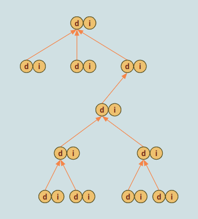

> Study case: ASPEED Linux version 5.15.41

## Index

- [Introduction](#introduction)
- [File Types](#file-types)
- [VFS Structures](#vfs-structures)
- [VFS Operations](#vfs-operations)
- [Notify](#notify)
- [System Startup](#system-startup)
- [Reference](#reference)

## <a name="introduction"></a> Introduction

A file system manages file metadata and data, such as NTFS in Windows and the EXT family in Linux. 
The virtual file system (VFS) provides a unified interface for users to interact with files using methods like read() and write(). 
It simplifies the complexity of file system design and implementation, allowing us to use any file system without needing to understand its specific details.

## <a name="file-types"></a> File Types

The VFS supports seven file types, including regular files and folders. 
Each file type is associated with its corresponding inode and file operations, allowing for separate handling of metadata and data.

- regular file
  - Files like jpg, png, and mp4 belong to the category of regular files. While they share the same file type, each file format represents a distinct composition and structure.

```
inode->i_op = &shmem_inode_operations;
inode->i_fop = &shmem_file_operations;
```

- Directory
  - A folder is a container that holds files and other folders within a file system. Examples of folders include "/", "/home/", and "/tmp/".

```
inode->i_op = &shmem_dir_inode_operations;
inode->i_fop = &simple_dir_operations;
```

- Link
  - A symbolic or soft link is a type of link, distinct from a hard link. It serves as a shortcut to another destination.

```
inode->i_op = &empty_iops;
inode->i_fop = &no_open_fops;
```

- Character device
  - Please refer to my other page for information on this topic.

```
inode->i_op = &shmem_special_inode_operations;
inode->i_fop = &def_chr_fops;
```

- Block device
  - Please refer to my other page for information on this topic.

```
inode->i_op = &shmem_special_inode_operations;
inode->i_fop = &def_blk_fops;
```

- Pipe
  - I haven't studied this part yet.

```
inode->i_op = &shmem_special_inode_operations;
inode->i_fop = &pipefifo_fops;
```

- Socket
  - File operations are unnecessary for the socket type since it only becomes available when a task opens it with specified arguments.

```
inode->i_op = &shmem_special_inode_operations;
inode->i_fop = &no_open_fops;
```

In our example, the filesystem **shmem** demonstrates its implementation. 
However, it's important to note that each file system has its own unique implementation for the seven file types.

## <a name="vfs-structures"></a> VFS Structures

- struct **inode**
    - The struct inode stores file metadata and provides information on accessing the file data.
- struct **dentry**
    - Typically, one **inode** is associated with one **dentry** (excluding hard links).
    - The **dentry** in VFS holds the file name.
    - It establishes the hierarchy of folders and files, serving as a cache to optimize lookup operations.
- struct **file**
    - The struct **file** is a temporary, process-specific component created when a task opens a file.
- struct **mount**
    - Folders and files form a hierarchical tree structure within a designated area, such as a partition, with each having its own filesystem and tree.
    - Prior to accessing them, we need to mount them onto the root hierarchy, which is managed by the struct **mount**.

In the diagram below, we can observe the root mount along with two other mounted trees: **/run/initramfs/ro** and **/run/initramfs/rw**. 
Within the root mount, the dentry of each inode is responsible for maintaining the file hierarchy. 
When tasks access **/run/initramfs/rw/abc.txt**, the VFS generates temporary **file** structures for each access individually.

<p align="center"></p>

<details><summary> More Details </summary>

```
                           +---+                                      
                           | m | root mount                           
                           +---+                                      
                          /     \                                     
                        /-       -\                                   
                       /           \                                  
                      /             \                                 
                    /-   +---+---+   -\                               
                   /     | i | d |'/'  \                              
                  /      +---+---+      \                             
                 /             |         \                            
               /-    +---------+---------+-\                          
              /      |                   |  \                         
             / +---+---+           +---+---+ \                +---+   
           /-  | i | d |'var'      | i | d | ---------------  | m |   
          /    +---+---+           +---+---+    \             +---+   
         /           |                 'home'    \           /     \  
        /     +------------+                      \         /       \ 
      /-      |            |                       -\      - ---------
     /  +---+---+     +---+---+                      \                
    /   | i | d |     | i | d |'log.txt'              \               
  /-    +---+-|-+     +---+---+                        -\             
 /            |'more'   ^                                \            
--------------|---------|----------------------------------           
            +---+       |          +---+                              
            | m |       ^--------  | f |  task a                      
            +---\       |          +---+                              
           /     \      |          +---+                              
          /       \     +--------  | f |  task b                      
         - ---------               +---+                              
```

</details>
  
## <a name="vfs-operations"></a> VFS Operations

### Change working directory

The **cd** command, used for changing directories in the command-line interface of Linux, is a commonly used command. 
It is a built-in shell function and does not have its own standalone binary. 
The **cd** function internally calls the **chdir** system call, and the kernel begins the process of interpreting the target path string. 
Before delving into how the kernel interprets the path, let's introduce some relevant fields in the data structure. 
The **task_struct** includes an **fs** pointer that points to **fs_struct**, which holds the **root** and **path** information.

- **root**:
  - **dentry**: The dentry of the root directory ("/").
  - **mnt**: The mount to which the paired dentry belongs, such as the root mount.

- **pwd**:
  - **dentry**: The dentry of the current folder/directory.
  - **mnt**: The mount to which the paired dentry belongs, such as the root mount or /dev/mtdblock4.

When parsing a path, we need to start with a specific dentry, which can either come from the **root** or **pwd** fields. 
These correspond to two types of paths:

- Absolute path:
  - An absolute path starts with a leading '/', and the kernel initiates the lookup process using the dentry of the root folder.

- Relative path:
  - A relative path does not have a leading '/', and the dentry from the **pwd** field becomes the starting point for the lookup process.

A path consists of several components divided by '/', where the leading slash, if present, is considered a component as well.

<p align="center"></p>

During a path lookup, the process starts with the leading component, where its dentry is obtained either from **root** or **pwd**, depending on the type of path. 
Each component of the path, except for '.', involves either an upward (..) or downward (other names) lookup.
In an iterative manner, after each upward or downward lookup, we acquire the dentry of the next component, continuing until we reach the final component or the second-to-last component, depending on the objective. 
For a downward lookup, we utilize the dentry of the current component and the name string of the next component to search for the corresponding dentry in the hash table.

Example:
- dentry of '/' + name string 'run' -> dentry of **run**
- dentry of 'run' + name string 'initramfs' -> dentry of **initramfs**

<p align="center"></p>

Performing an upward lookup, such as '../..', is relatively simple because each dentry has a direct pointer to its parent. 

<p align="center"></p>

<details><summary> More Details </summary>

```
           task_struct                                                                                  
            +--------+                                                                                  
            | +----+ |                                                                                  
            | | fs |------------------->  fs_struct                                                     
            | +----+ |                  +----------+                                                    
            +--------+                  |   root   |  root folder '/'                                   
                                        |+--------+|                                                    
+--------+                              ||  +---+ ||                                                    
|vfsmount| <---------------------------------mnt| ||  which mount the dentry belongs to, e.g. root mount
+--------+                              ||  +---+ ||                                                    
     ^             +--------+           ||+------+||                                                    
     |             | dentry | <-----------|dentry|||  dentry of '/'                                     
     |             +--------+           ||+------+||                                                    
     |                                  |+--------+|                                                    
     |                                  |   pwd    |  current working folder, e.g., '/home/penguin'     
     |                                  |+--------+|                                                    
     |                                  ||  +---+ ||                                                    
     +--------------------------------------|mnt| ||  which mount the dentry belongs to, e.g. root mount
                                        ||  +---+ ||                                                    
                   +--------+           ||+------+||                                                    
                   | dentry | <------------dentry|||  dentry of 'penguin'                               
                   +--------+           ||+------+||                                                    
                                        |+--------+|                                                    
                                        +----------+                                                    
```
                                                     
```
                                    +------+
             /  ─────────────────── |dentry| + 'usr'
             |                      +------+
             |                            |
 +-----+----------+                       |  lookup hash table
 |     |          |                       v
 |     |          |                 +------+
root  sbin       usr  ───────────── |dentry| + 'sbin'
                  |                 +------+
                  |                       |
             +----|----+                  |  lookup hash table
             |    |    |                  v
             |    |    |            +------+
            bin  lib  sbin  ─────── |dentry|
                                    +------+
```
                                                     
```
                                    +------+
             /  ─────────────────── |dentry|
             |                      +------+
             |                            ^
 +-----+----------+                       |  poitner to parent
 |     |          |                       |
 |     |          |                 +------+
root  sbin       usr  ───────────── |dentry|
                  |                 +------+
                  |                       ^
             +----|----+                  |  poitner to parent
             |    |    |                  |
             |    |    |            +------+
            bin  lib  sbin  ─────── |dentry|
                                    +------+
```
                                                     
For the single dot and non-leading slash, the kernel will ignore them and advance till the component is meaningful.

```
 /usr/./././././//////////././././././sbin
     |-------------------------------|    
                   skip                   
```
  
```
fs/open.c
+-----------+                                                                                
| sys_chdir | : chage pwd of current task to given path                                        
+--|--------+                                                                                
   |    +--------------+                                                                     
   +--> | user_path_at |                                                                     
        +---|----------+                                                                     
            |    +--------------------+                                                      
            +--> | user_path_at_empty |                                                      
                 +----|---------------+                                                      
                      |    +-----------------+                                               
                      |--> | filename_lookup | lookup the path, save dentry and mnt in 'path'
                      |    +-----------------+                                               
                      |    +------------+                                                    
                      +--> | set_fs_pwd | set pwd to the given 'path'                        
                           +------------+                                                    
```
      
```
fs/namei.c
+-----------------+                                                                                                              
| vfs_path_lookup | : lookup the path, save dentry and mnt in 'path'
+----|------------+                                                                                                              
     |    +-----------------+                                                                                                    
     +--> | filename_lookup | : lookup the path, save dentry and mnt in 'path'
          +----|------------+                                                                                                    
               |    +---------------+                                                                                            
               |--> | set_nameidata | set up nd and replace the one of current task                                              
               |    +---------------+                                                                                            
               |    +---------------+                                                                                            
               |--> | path_lookupat |                                                                                            
               |    +---|-----------+                                                                                            
               |        |    +-----------+                                                                                       
               |        |--> | path_init | decide the starting point for lookup                                                  
               |        |    +-----------+                                                                                       
               |        |                                                                                                        
               |        |--> endless loop                                                                                        
               |        |                                                                                                        
               |        |        +----------------+                                                                              
               |        |------> | link_path_walk | walk through the path name, update dentry and mnt of the last component in nd
               |        |        +----------------+                                                                              
               |        |                                                                                                        
               |        |------> break loop if error                                                                             
               |        |                                                                                                        
               |        |        +-------------+                                                                                 
               |        |------> | lookup_last | update path (dentry + mnt) and inode of nd to next component                    
               |        |        +-------------+                                                                                 
               |        |                                                                                                        
               |        |------> break loop if error                                                                             
               |        |                                                                                                        
               |        +--> copy path to argument and reset nd                                                                  
               |                                                                                                                 
               |    +-------------------+                                                                                        
               +--> | restore_nameidata |                                                                                        
                    +-------------------+                                                                                        
```

```
fs/namei.c
+-----------+                                                 
| path_init | : set nd's root, path, and inode
+--|--------+                                                 
   |                                                          
   |--> if it's a absolute path (starts with a '/')           
   |                                                          
   |        +--------------+                                  
   |------> | nd_jump_root |                                  
   |        +---|----------+                                  
   |            |    +----------+                             
   |            |--> | set_root | nd->root = current->fs->root
   |            |    +----------+                             
   |            |                                             
   |            +--> nd->path = nd->root                      
   |                                                          
   |--> else (a relative path)                                
   |                                                          
   |------> nd->path = current->fs->pwd                       
   |                                                          
   +------> set nd->inode from nd->path                       
```
      
```
fs/namei.c
+----------------+                                                                          
| link_path_walk | : walk through the path name, update dentry and mnt of the last component in nd
+---|------------+                                                                          
    |                                                                                       
    |--> endless loop                                                                       
    |                                                                                       
    +------> update nd last                                                                 
    |                                                                                       
    |        +----------------+                                                             
    |------> | walk_component | update path (dentry + mnt) and inode of nd to next component
    |        +----------------+                                                             
    |                                                                                       
    +------> (ignore link handling)                                                         
```

```
fs/namei.c
+----------------+                                                                          
| walk_component | : update path (dentry + mnt) and inode of nd to next component           
+---|------------+                                                                          
    |                                                                                       
    |--> if it's DOT or DOTDOT                                                              
    |                                                                                       
    |        +-------------+                                                                
    |------> | handle_dots | update path and inode of nd if it's DOTDOT (do nothing for DOT)
    |        +-------------+                                                                
    |                                                                                       
    |------> return                                                                         
    |                                                                                       
    |    +-------------+                                                                    
    |--> | lookup_fast | find child dentry in hash table by parent dentry and child name    
    |    +-------------+                                                                    
    |    +-----------+                                                                      
    +--> | step_into | update path and inode of nd (automount and link cases are considered)
         +-----------+                                                                      
```

```
fs/namei.c
+-------------+                                                                             
| handle_dots | : update path and inode of nd if it's DOTDOT (do nothing for DOT)             
+---|---------+                                                                             
    |                                                                                       
    |--> if it's DOTDOT (do nothing for DOT case)                                           
    |                                                                                       
    |------> ensure nd has root setting                                                     
    |                                                                                       
    |    +---------------+                                                                  
    |--> | follow_dotdot |                                                                  
    |    +---|-----------+                                                                  
    |        |                                                                              
    |        |--> if it's the root, return NULL                                             
    |        |                                                                              
    |        |--> if it's a mount point                                                     
    |        |                                                                              
    |        |        +-------------------+                                                 
    |        |------> | choose_mountpoint | update dentry and mnt in path with mount point  
    |        |        +-------------------+                                                 
    |        |                                                                              
    |        +--> get parent dentry and inode                                               
    |                                                                                       
    |    +-----------+                                                                      
    +--> | step_into | update path and inode of nd (automount and link cases are considered)
         +-----------+                                                                      
```

```
fs/namei.c
+-----------+                                                                     
| step_into | : update path and inode of nd (automount and link cases are considered)
+--|--------+                                                                     
   |    +---------------+                                                         
   |--> | handle_mounts | : update mnt and dentry of path if it's mounted           
   |    +---|-----------+                                                         
   |        |    +-----------------+                                              
   |        +--> | traverse_mounts |                                              
   |             +----|------------+                                              
   |                  |    +-------------------+                                  
   |                  +--> | __traverse_mounts |                                  
   |                       +----|--------------+                                  
   |                            |                                                 
   |                            |--> if it's mounted                              
   |                            |                                                 
   |                            |        +------------+                           
   |                            |------> | lookup_mnt | return the first child mnt
   |                            |        +------------+                           
   |                            |                                                 
   |                            |------> update the mnt and dentry of path with it
   |                            |                                                 
   |                            +--> (ignore the case of auto mount)              
   |                                                                              
   |--> update path and inode of nd                                               
   |                                                                              
   +--> (ignore the case of link)                                                 
```

</details>

### File Creation

We can use the utility **touch**, **echo**, or a formal editor like **vim** and **nano** for file creation. 
Here's the strace of **touch**, and it's the flag O_CREAT that instructs the kernel to create the file if it's not there.

```
root@romulus:~# strace touch /run/zzz-file
...
openat(AT_FDCWD, "/run/zzz-file", O_RDWR|O_CREAT|O_LARGEFILE, 0666) = 3
close(3)                                = 0
...
```

So the operational flow is like this:

- It's an absolute path, and we start from the dentry **root**.
- Look up till the last component, **zzz-file**, but it's not there.
- Since the utility has specified flag **O_CREAT**, then parent inode, **run** in the example, creates the file.

<p align="center"></p>

<details><summary> More Details </summary>

```
    +--------------------------->     /                                                                                     
    |                                 |                                                                                     
    |                                 |                                                                                     
    |                     +-----------|-----------+                                                                         
    |                     |           |           |                                                                         
    |                     |           |           |                                                                         
    |                    etc        home         lib                                                                        
                                      |                                                                                     
+------+                              |                                                                                     
| root |                              |                                                                                     
+------+                              |                                                     +--                             
+-----+                               |                                                     |    ...                        
| pwd |   ---------------------->   root   inode->i_op = &shmem_dir_inode_operations;  -----+    .create     = shmem_create,
+-----+                               |    inode->i_fop = &simple_dir_operations;           |    ...                        
                                      |                                                     +--                             
                                      |                                                                                     
                                      |                                                                                     
                                      |                                                                                     
                                   blabla?                                                                                  
```
  
Function vfs_create() isn't related to our example here.

```
fs/namei.c
+------------+                                                                         
| vfs_create | prepare an inode of regular file and link it with given dentry    
+--|---------+                                                                         
   |                                                                                   
   |--> if dir inode has no ->create(), return error                                   
   |                                                                                   
   +--> call ->create(), e.g.,                                                         
        +--------------+                                                               
        | shmem_create | prepare an inode of regular file and link it with given dentry
        +--------------+                                                               
```
      
</details>      

### File Removal
We use the utility **rm** to remove the target file, and here's the strace log.

```
root@romulus:~# strace rm /run/zzz-file
...
access("/run/zzz-file", W_OK)           = 0
unlink("/run/zzz-file")                 = 0
...
```

So the operational flow is like this:

- It's an absolute path, and we start from the dentry **root**.
- Look up till the parent of the last component.
- Ask that parent to unlink the child **zzz-file**, which means releasing the inode and dentry of it.

<p align="center"></p>

<details><summary> More Details </summary>

```
    +--------------------------->     /                                                                                     
    |                                 |                                                                                     
    |                                 |                                                                                     
    |                     +-----------|-----------+                                                                         
    |                     |           |           |                                                                         
    |                     |           |           |                                                                         
    |                    etc        home         lib                                                                        
                                      |                                                                                     
+------+                              |                                                                                     
| root |                              |                                                                                     
+------+                              |                                                     +--                             
+-----+                               |                                                     |    ...                        
| pwd |   ---------------------->   root   inode->i_op = &shmem_dir_inode_operations;  -----+    .unlink     = shmem_unlink,
+-----+                               |    inode->i_fop = &simple_dir_operations;           |    ...                        
                                      |                                                     +--                             
                                      |                                                                                     
                                      |                                                                                     
                                      |                                                                                     
                                 >>blabla<<  delete 
```
  
```
fs/namei.c
+------------+                                                                         
| sys_unlink |                                                                         
+-|----------+                                                                         
  |    +-------------+                                                             
  +--> | do_unlinkat |                                                             
       +---|---------+                                                             
           |    +-------------------+                                              
           |--> | filename_parentat | only walk to the parent of the last component
           |    +-------------------+                                              
           |    +---------------+                                                  
           |--> | __lookup_hash | get the dentry of the last component             
           |    +---------------+                                                  
           |    +------------+                                                     
           |--> | vfs_unlink | inode nlink--, dentry ref count--                   
           |    +------------+                                                     
           |    +------+                                                           
           |--> | dput | release dentry if no one uses it                          
           |    +------+                                                           
           |    +------+                                                           
           +--> | iput | release inode if no one uses it                           
                +------+                                                           
```

```
fs/namei.c
+------------+                                                           
| vfs_unlink |                                                           
+--|---------+                                                           
   |                                                                     
   |--> if dir has no ->unlink(), return error                           
   |                                                                     
   |--> if dentry is a mount point, return error                         
   |                                                                     
   |--> call ->unlink(), e.g.,                                           
   |    +--------------+                                                 
   |    | shmem_unlink | inode nlink--, dentry ref count--               
   |    +--------------+                                                 
   |    +---------------+                                                
   +--> | detach_mounts | detach the mount if the dentry is a mount point
        +---------------+                                                
```
      
</details>      

### Directory Creation

We use the utility mkdir to create a folder, and it eventually calls the same-name syscall.

```
root@romulus:~# strace mkdir /run/zzz-dir
...
mkdir("/run/zzz-dir", 0777)             = 0
...
```

So the operational flow is like this:
  
- It's an absolute path, and we start from the dentry **root**.
- Look up till the parent of the last component.
- Ask the parent to create the child folder **zzz-dir** and install operation sets of directory type.
  
<p align="center"></p>

<details><summary> More Details </summary>
  
```
    +--------------------------->     /                                                                                    
    |                                 |                                                                                    
    |                                 |                                                                                    
    |                     +-----------|-----------+                                                                        
    |                     |           |           |                                                                        
    |                     |           |           |                                                                        
    |                    etc        home         lib                                                                       
                                      |                                                                                    
+------+                              |                                                                                    
| root |                              |                                                                                    
+------+                              |                                                     +--                            
+-----+                               |                                                     |    ...                       
| pwd |   ---------------------->   root   inode->i_op = &shmem_dir_inode_operations;  -----+    .mkdir      = shmem_mkdir,
+-----+                               |    inode->i_fop = &simple_dir_operations;           |    ...                       
                                      |                                                     +--                            
                                      |                                                                                    
                                      |                                                                                    
                                      |                                                                                    
                                   klakla  inode->i_op = &shmem_dir_inode_operations;                                      
                                           inode->i_fop = &simple_dir_operations;                                          
```

```
fs/namei.c
+-----------+                                                                               
| sys_mkdir |                                                                               
+--|--------+                                                                               
   |    +------------+                                                                      
   +--> | do_mkdirat |                                                                      
        +--|---------+                                                                      
           |    +-----------------+                                                         
           |--> | filename_create |                                                         
           |    +----|------------+                                                         
           |         |    +-------------------+                                             
           |         |--> | filename_parentat | lookup till the parent of the last component
           |         |    +-------------------+                                             
           |         |    +---------------+                                                 
           |         +--> | __lookup_hash | either locate target dentry or create one       
           |              +---------------+                                                 
           |    +-----------+                                                               
           +--> | vfs_mkdir |                                                               
                +-----------+                                                               
```

```
fs/namei.c
+-----------+                                                                      
| vfs_mkdir | prepare an inode of directory and link it with given dentry          
+--|--------+                                                                      
   |                                                                               
   |--> if dir inode has no ->mkdir(), return error                                
   |                                                                               
   +--> call ->mkdir(), e.g.,                                                      
        +-------------+                                                            
        | shmem_mkdir | prepare an inode of directory and link it with given dentry
        +-------------+                                                            
```

</details>

### Directory Removal

We can utilize the command **rmdir** to remove the folder for an empty folder, and here's the strace log.

```
  
root@romulus:~# strace rmdir /run/zzz-dir
...
rmdir("/run/zzz-dir")                   = 0
...
```

So the operational flow is like this:

- It's an absolute path, and we start from the dentry **root**.
- Look up till the parent of the last component.
- Ask the parent to remove the child folder **/run/zzz-dir**, releasing the inode and dentry.

<p align="center"></p>

<details><summary> More Details </summary>
  
```
    +--------------------------->     /                                                                                    
    |                                 |                                                                                    
    |                                 |                                                                                    
    |                     +-----------|-----------+                                                                        
    |                     |           |           |                                                                        
    |                     |           |           |                                                                        
    |                    etc        home         lib                                                                       
                                      |                                                                                    
+------+                              |                                                                                    
| root |                              |                                                                                    
+------+                              |                                                     +--                            
+-----+                               |                                                     |    ...                       
| pwd |   ---------------------->   root   inode->i_op = &shmem_dir_inode_operations;  -----+    .rmdir      = shmem_rmdir,
+-----+                               |    inode->i_fop = &simple_dir_operations;           |    ...                       
                                      |                                                     +--                            
                                      |                                                                                    
                                      |                                                                                    
                                      |                                                                                    
                                 >>klakla<<   detete                                                                       
```

```
fs/namei.c
+-----------+                                                                     
| sys_rmdir |                                                                     
+--|--------+                                                                     
   |    +----------+                                                              
   +--> | do_rmdir |                                                              
        +--|-------+                                                              
           |    +-------------------+                                             
           |--> | filename_parentat | lookup till the parent of the last component
           |    +-------------------+                                             
           |    +---------------+                                                 
           |--> | __lookup_hash | either locate target dentry or create one       
           |    +---------------+                                                 
           |    +-----------+                                                     
           +--> | vfs_rmdir |                                                     
                +-----------+                                                     
```

```
fs/namei.c
+-----------+                                                            
| vfs_rmdir |                                                            
+--|--------+                                                            
   |                                                                     
   |--> if dir has no ->rmdir(), return error                            
   |                                                                     
   |--> if it's a mount point, return error                              
   |                                                                     
   |--> call ->rmdir(), e.g.,                                            
   |    +-------------+                                                  
   |    | shmem_rmdir | inode nlink-- -- --, dentry ref count--          
   |    +-------------+                                                  
   |    +----------------------+                                         
   |--> | shrink_dcache_parent | release unused child dentries           
   |    +----------------------+                                         
   |    +---------------+                                                
   +--> | detach_mounts | detach the mount if the dentry is a mount point
        +---------------+                                                
```

</details>
      
### Copy

When we have to copy a file or a folder, utility **cp** does the job, and here's the strace log.

- It opens both the source and destination files.
- Start to read from the source and write to the destination till there's no more data.
- Close both file descriptors.

```
root@romulus:~# echo abc > /run/zzz-file1 
root@romulus:~# strace cp /run/zzz-file1 /run/zzz-file2
...
openat(AT_FDCWD, "/run/zzz-file1", O_RDONLY|O_LARGEFILE) = 3
openat(AT_FDCWD, "/run/zzz-file2", O_WRONLY|O_CREAT|O_EXCL|O_LARGEFILE, 0100644) = 4
sendfile64(4, 3, NULL, 16777216)        = 4
sendfile64(4, 3, NULL, 16777216)        = 0
close(4)                                = 0
close(3)                                = 0
...
```

Here's the strace log for copying a folder.

```
root@romulus:~# mkdir /run/zzz-dir1
root@romulus:~# echo aaa > /run/zzz-dir1/aaa
root@romulus:~# echo bbb > /run/zzz-dir1/bbb
root@romulus:~# strace cp -a /run/zzz-dir1/ /run/zzz-dir2
...
mkdir("/run/zzz-dir2", 040755)          = 0
...
openat(AT_FDCWD, "/run/zzz-dir1/", O_RDONLY|O_NONBLOCK|O_LARGEFILE|O_DIRECTORY|O_CLOEXEC) = 3
...
openat(AT_FDCWD, "/run/zzz-dir1/bbb", O_RDONLY|O_LARGEFILE) = 4
openat(AT_FDCWD, "/run/zzz-dir2/bbb", O_WRONLY|O_CREAT|O_EXCL|O_LARGEFILE, 0100644) = 5
sendfile64(5, 4, NULL, 16777216)        = 4
sendfile64(5, 4, NULL, 16777216)        = 0
close(5)                                = 0
close(4)                                = 0
...
chown32("/run/zzz-dir2/bbb", 0, 0)      = 0
chmod("/run/zzz-dir2/bbb", 0100644)     = 0
...
openat(AT_FDCWD, "/run/zzz-dir1/aaa", O_RDONLY|O_LARGEFILE) = 4
openat(AT_FDCWD, "/run/zzz-dir2/aaa", O_WRONLY|O_CREAT|O_EXCL|O_LARGEFILE, 0100644) = 5
sendfile64(5, 4, NULL, 16777216)        = 4
sendfile64(5, 4, NULL, 16777216)        = 0
close(5)                                = 0
close(4)                                = 0
...
chown32("/run/zzz-dir2/aaa", 0, 0)      = 0
chmod("/run/zzz-dir2/aaa", 0100644)     = 0
...
close(3)                                = 0
chmod("/run/zzz-dir2", 040755)          = 0
...
chown32("/run/zzz-dir2", 0, 0)          = 0
chmod("/run/zzz-dir2", 040755)          = 0
...
```

<p align="center"></p>
  
### Mount

- What does mount do?
  - To connect the file tree to another one.
- Why do we need to mount?
  - To make the isolated file tree visible.
- Why do Windows users not have to mount?
  - Automatic mount

The kernel will prepare the below structures for the source tree: **mount**, **dentry**, **inode**. 
The **mount** doesn't connect to anything yet and isn't visible to the users.

Later the kernel mounts the source tree onto the dentry of the destination folder, which is also known as the mount point. 
Also, the mount structure of the mount point acts as the parent mount, and the **mnt_parent** points to the right place. 
That's how we make the source tree of a specific disk partition visible to us, and now the **lookup** can traverse into it.

<p align="center"></p>
  
<details><summary> More Details </summary>
  
We start the introduction by command **mount** usage.

```
          +------------------------+                    
          | where the file tree is |                    
          +------------------------+                    
                       ^                                
                       |                                
                --------------                          
 mount -t jffs2 /dev/mtdblock5 /run/initramfs/rw        
       --------                -----------------        
           |                           |                
           v                           v                
 +------------------+   +------------------------------+
 | file tree format |   | where I want it connects to, |
 +------------------+   | a.k.a. mount point           |
                        +------------------------------+
```
  
```
+---------> mount                                     
|     +----------------+                              
|     |      mnt       |                              
|     |  +----------+  |                              
|     |  |+--------+|  |                              
|     |  ||mnt_root|---------------+                  
|     |  |+--------+|  |           |                  
|     |  +----------+  |           v                  
|     |+--------------+|        +------+       +-----+
|     ||mnt_mountpoint--------> |dentry| <---> |inode|
|     |+--------------+|        +------+       +-----+
|     |  +----------+  |                              
+---------mnt_parent|  |                              
      |  +----------+  |                              
      +----------------+                              
```
  
```
+-----------------------------> mount
|                   |     +----------------+
|                   |     |      mnt       |
|                   |     |  +----------+  |
|                   |     |  |+--------+|  |
|                   |     |  ||mnt_root-----------------------------------+
|                   |     |  |+--------+|  |                              |
|                   |     |  +----------+  |                              v
|                   |     |+--------------+|                          +------+-----+
|                   |     ||mnt_mountpoint--------------------------> |dentry|inode|
|                   |     |+--------------+|                          +---^--+-----+
|                   |     |  +----------+  |                              |
|                   +---------mnt_parent|  |                              |
|                         |  +----------+  |                 +--------------------------------------+
|                         +----------------+                 |                  |                   |
|                                                        +---|--+-----+     +---|--+-----+      +---|--+-----+
|                                                        |dentry|inode|     |dentry|inode|      |dentry|inode|
|                                                        +---^--+-----+     +------+-----+      +---^--+-----+
|                                                            |                                      |
|                                                            |                                      |
|                                               +----------------------+                       +---------------------+
|                                               |                      |                       |                     |
|           mount                           +---|--+-----+         +---|--+-----+          +---|--+-----+        +---|--+-----+
|     +----------------+        +---------> |dentry|inode|         |dentry|inode|          |dentry|inode|        |dentry|inode|
|     |      mnt       |        |           +------+-----+         +------+-----+          +------+-----+        +------+-----+
|     |  +----------+  |        |
|     |  |+--------+|  |        |               +------+-----+
|     |  ||mnt_root-------------|-------------> |dentry|inode|
|     |  |+--------+|  |        |               +---^--+-----+
|     |  +----------+  |        |                   |
|     |+--------------+|        |                   |
|     ||mnt_mountpoint----------+      +-------------------------+
|     |+--------------+|               |                         |
|     |  +----------+  |           +---|--+-----+            +---|--+-----+
+---------mnt_parent|  |           |dentry|inode|            |dentry|inode|
      |  +----------+  |           +---^--+-----+            +---^--+-----+
      +----------------+               |                         |
                                       |                         |
                                       |                    +---------------+
                                       |                    |               |
                                   +---|--+-----+       +---|--+-----+  +---|--+-----+
                                   |dentry|inode|       |dentry|inode|  |dentry|inode|
                                   +------+-----+       +------+-----+  +------+-----+
```

```
fs/namespace.c
+------------+                                                                                                                 
| kern_mount | prepare 'super_block' and mount nowhere (for internal use)                                                      
+--|---------+                                                                                                                 
   |    +----------------+                                                                                                     
   +--> | vfs_kern_mount |                                                                                                     
        +---|------------+                                                                                                     
            |    +----------------------+                                                                                      
            |--> | fs_context_for_mount | allocate fc and fs-specific private data
            |    +-----|----------------+                                                                                      
            |          |    +------------------+                                                                               
            |          +--> | alloc_fs_context | 
            |               +----|-------------+                                                                               
            |                    |                                                                                             
            |                    |--> allcoate fs context (fc)                                                                 
            |                    |                                                                                             
            |                    +--> call ->init_fs_context(), e.g.,                                                          
            |                         +--------------------+                                                                   
            |                         | bd_init_fs_context | prepare pseudo fs context and install 'bdev_sops'                 
            |                         +--------------------+                                                                   
            |    +----------+                                                                                                  
            +--> | fc_mount |                                                                                                  
                 +--|-------+                                                                                                  
                    |    +--------------+                                                                                      
                    |--> | vfs_get_tree |                                                                                      
                    |    +---|----------+                                                                                      
                    |        |                                                                                                 
                    |        +--> call ->get_tree(), e.g.,                                                                     
                    |             +--------------------+                                                                       
                    |             | pseudo_fs_get_tree | allocate 'super_block' and set up (e.g., preapre its inode and dentry)
                    |             +--------------------+                                                                       
                    |    +------------------+                                                                                  
                    +--> | vfs_create_mount | allocate and set up 'mount'                                                      
                         +------------------+                                                                                  
```

</details>

## <a name="notify"></a> Notify
  
(TBD)
  
<details><summary> More Details </summary>

```
fs/notify/inotify/inotify_user.c
+---------------+
| inotify_init1 | : prepare group, prepare anon file (priv = group) and install to fd table
+|--------------+
 |    +-----------------+
 +--> | do_inotify_init | : prepare group, prepare anon file (priv = group) and install to fd table
      +-|---------------+
        |    +-------------------+
        |--> | inotify_new_group | prepare group & event, return group
        |    +-------------------+
        |    +------------------+
        +--> | anon_inode_getfd | prepare an anon file and install to fd table
             +------------------+
```

```
fs/notify/inotify/inotify_user.c                                                                         
+-------------------+                                                                                     
| inotify_new_group | : prepare group & event, return group                                               
+-|-----------------+                                                                                     
  |    +---------------------------+                                                                      
  |--> | fsnotify_alloc_user_group | alloc fsnotify_group and install arg ops (e.g., inotify_fsnotify_ops)
  |    +---------------------------+                                                                      
  |                                                                                                       
  +--> alloc event and set it up                                                                          
```
  
</details>

## <a name="system-startup"></a> System Startup

```
 start_kernel                                                                                                                        
 |                                                                                                                                   
 |--> vfs_caches_init_early                                                                                                          
 |    |                                                                                                                              
 |    |--> dcache_init_early                                                                                                         
 |    |    -                                                                                                                         
 |    |    +--> alloc_large_system_hash       [    0.000000] Dentry cache hash table entries: 65536 (order: 6, 262144 bytes, linear) 
 |    |                                                                                                                              
 |    +--> inode_init_early                                                                                                          
 |         -                                                                                                                         
 |         +--> alloc_large_system_hash       [    0.000000] Inode-cache hash table entries: 32768 (order: 5, 131072 bytes, linear)  
 |                                                                                                                                   
 +--> vfs_caches_init                                                                                                                
      -                                                                                                                              
      +--> mnt_init                                                                                                                  
           -                                                                                                                         
           ---> alloc_large_system_hash       [    0.007705] Mount-cache hash table entries: 1024 (order: 0, 4096 bytes, linear)     
           +--> alloc_large_system_hash       [    0.007951] Mountpoint-cache hash table entries: 1024 (order: 0, 4096 bytes, linear)
                                                                                                                                     
                                                                                                                                     
 kernel_init                                                                                                                         
 -                                                                                                                                   
 +--> kernel_init_freeable                                                                                                           
 |    -                                                                                                                              
 |    +--> do_basic_setup                                                                                                            
 |         -                                                                                                                         
 |         +--> do_initcalls                                                                                                         
 |              -                                                                                                                    
 |              +--> populate_rootfs                                                                                                 
 |                   -                                                                                                               
 |                   +--> do_populate_rootfs  [    0.272771] Trying to unpack rootfs image as initramfs...                           
 |                                                                                                                                   
 +--> run_init_process                        [    1.770911] Run /init as init process                                               
                                              [    1.771093]   with arguments:                                                       
                                              [    1.771159]     /init                                                               
                                              [    1.771183]   with environment:                                                     
                                              [    1.771204]     HOME=/                                                              
                                              [    1.771220]     TERM=linux                                                          
```
  
Kernel prepares the data structures for any mount attempt, and the root filesystem has no exception. 
We can see that there's only one pair of dentry and inode, which represents the well-known '/' entry. 
After letting tasks know where the **mount** and **dentry** are, the file tree becomes visible to them.

When building the kernel image, data under **usr/** will become the initramfs included in the generated kernel image, and it contributes the very minimum rootfs:

- /dev
- /dev/console
- /root

After unpacking the initramfs, the file tree is like this:

And then the complete rootfs either comes from initrd or other mediums:

- Initrd
  - It's initramfs-romulus in our case. Don't be bothered by its naming since there might be some historical factors.
- NFS
  - The source is from an NFS server.
- CIFS
  - The source if from a Samba server.
- Block
  - The source is from a drive partition, another common case in practical usage.

After unpacking the initrd, the file tree is like this, which doesn't display them all:
  
<p align="center"></p>
  
<details><summary> More Details </summary>
  
```
+---------> mount                                     
|     +----------------+                              
|     |      mnt       |                              
|     |  +----------+  |                              
|     |  |+--------+|  |                              
|     |  ||mnt_root|---------------+                  
|     |  |+--------+|  |           |                  
|     |  +----------+  |           v                  
|     |+--------------+|        +------+       +-----+
|     ||mnt_mountpoint--------> |dentry| <---> |inode|
|     |+--------------+|        +------+       +-----+
|     |  +----------+  |                              
+---------mnt_parent|  |                              
      |  +----------+  |                              
      +----------------+                              
```

```
      mount
+----------------+
|      mnt       |
|  +----------+  |
|  |+--------+|  |
|  ||mnt_root-----------------------------------+
|  |+--------+|  |                              |
|  +----------+  |                              v
|+--------------+|                          +------+-----+
||mnt_mountpoint--------------------------> |dentry|inode|
|+--------------+|                          +---^--+-----+
|  +----------+  |                              |
|  |mnt_parent|  |                              |
|  +----------+  |                 +------------------------+
+----------------+                 |                        |
                               +---|--+-----+           +---|--+-----+
                           dev |dentry|inode|      root |dentry|inode|
                               +---^--+-----+           +------+-----+
                                   |
                                   |
                                   |
                                   |
                               +---|--+-----+
                       console |dentry|inode|
                               +------+-----+
```
  
```
                         +-----------+                                      
                         | initramfs |                                      
                         +--/-----\--+                                      
                           /       \                                        
                          /         \                                       
                         v           v                                      
                 +--------+         +-------+                               
 our study case  | initrd |         | other |                               
                 +--------+         /-------\                               
                                   /    |    \                              
                                  /     |     \                             
                                 v      v      v                            
                           +-----+  +------+   +-------+                    
                           | nfs |  | cifs |   | block | another common case
                           +-----+  +------+   +-------+                    
```
  
```
                                            mount                                                                                 
                                      +----------------+                                                                          
                                      |      mnt       |                                                                          
                                      |  +----------+  |                                                                          
                                      |  |+--------+|  |                                                                          
                                      |  ||mnt_root-------------+                                                                 
                                      |  |+--------+|  |        |                                                                 
                                      |  +----------+  |        |                                                                 
                                      |+--------------+|        |                                                                 
                                      ||mnt_mountpoint----------+                                                                 
                                      |+--------------+|        |                                                                 
                                      |  +----------+  |        |                                                                 
                                      |  |mnt_parent|  |        |                                                                 
                                      |  +----------+  |        v                                                                 
                                      +----------------+                                                                          
                                                                /                                                                 
                                                                |                                                                 
       +----------+---------------+----------------------+------+---------------------------------------------------------------+ 
       |          |               |                      |                     |                    |     |          |          | 
      bin        dev             etc                   init                   lib                  root  sbin       usr        var
       |          |               |                                            |                                     |            
       |          |       +---------------+                        +------------------------+                   +----|----+       
       |          |       |       |       |                        |           |            |                   |    |    |       
 busybox.suid  console  group  passwd  systemd                 firmware  ld-linux.so.3  libc.so.6              bin  bin  sbin     
                                          |                        |                                                              
                                          |                        |                                                              
                                          |                        |                                                              
                                       system                cf-fsi-fw.bin                                                        
                                          |                                                                                       
                                          |                                                                                       
                                          |                                                                                       
                                 sysinit.target.wants                                                                             
```
  
```
fs/dcache.c
+-----------------------+                                                                                                      
| vfs_caches_init_early |                                                                                                      
+-----|-----------------+                                                                                                      
      |                                                                                                                        
      |--> init 'in_lookup_hashtable'                                                                                          
      |                                                                                                                        
      |    +-------------------+                                                                                               
      |--> | dcache_init_early |                                                                                               
      |    +----|--------------+                                                                                               
      |         |    +-------------------------+                                                                               
      |         +--> | alloc_large_system_hash |                                                                               
      |              +------|------------------+                                                                               
      |                     |                                                                                                  
      |                     |--> allocate and init hash table                                                                  
      |                     |                                                                                                  
      |                     +--> print '[    0.000000] Dentry cache hash table entries: 65536 (order: 6, 262144 bytes, linear)'
      |                                                                                                                        
      |    +------------------+                                                                                                
      +--> | inode_init_early |                                                                                                
           +----|-------------+                                                                                                
                |    +-------------------------+                                                                               
                +--> | alloc_large_system_hash |                                                                               
                     +------|------------------+                                                                               
                            |                                                                                                  
                            |--> allocate and init hash table                                                                  
                            |                                                                                                  
                            +--> print '[    0.000000] Inode-cache hash table entries: 32768 (order: 5, 131072 bytes, linear)' 
```

```
fs/dcache.c
+-----------------+
| vfs_caches_init |
+----|------------+
     |
     |--> prepare kmem cache for 'path' (4096 characters at most)
     |
     |    +-------------+
     |--> | dcache_init | preapre kmem cache for 'dentry'
     |    +-------------+
     |    +------------+
     |--> | inode_init | preapre kmem cache for 'inode'
     |    +------------+
     |    +------------+
     |--> | files_init | preapre kmem cache for 'file'
     |    +------------+
     |    +---------------------+
     |--> | files_maxfiles_init | determine the max number of files in system
     |    +---------------------+
     |    +----------+
     |--> | mnt_init | (traced separately)
     |    +----------+
     |    +-----------------+
     |--> | bdev_cache_init |
     |    +----|------------+
     |         |
     |         |--> prepare kmem cache for 'bdev_indoe'
     |         |
     |         |    +---------------------+
     |         |--> | register_filesystem | register arg (e.g., 'bd_type') to 'file_systems' list
     |         |    +---------------------+
     |         |    +------------+
     |         +--> | kern_mount | prepare 'super_block' and mount nowhere (for internal use)
     |              +--|---------+
     |                 |    +----------------+
     |                 +--> | vfs_kern_mount |
     |                      +----------------+
     |    +-------------+
     +--> | chrdev_init | init 'cdev_map'
          +-------------+                                                 
```

```
fs/namespace.c
+----------+
| mnt_init |
+--|-------+
   |
   |--> prepare kmem cache for 'mount'
   |
   |--> allocate 'mount_hashtable'
   |
   |--> allocate 'mountpoint_hashtable'
   |
   |    +-------------+
   |--> | kernfs_init | prepare kmem cache for 'kernfs_node' and 'kernfs_iattrs'
   |    +-------------+
   |    +------------+
   |--> | sysfs_init |
   |    +--|---------+
   |       |    +--------------------+
   |       +--> | kernfs_create_root | prepare kernel fs 'root' and its 'node'
   |       |    +--------------------+
   |       |    +---------------------+
   |       +--> | register_filesystem | register arg (e.g., 'sysfs_fs_type') to 'file_systems' list
   |            +---------------------+
   |    +------------+
   |--> | shmem_init |
   |    +--|---------+
   |       |    +-----------------------+
   |       +--> | shmem_init_inodecache | prepare kmem cache for 'shmem_inode_info'
   |            +-----------------------+
   |            +---------------------+
   |            | register_filesystem | register arg (e.g., 'shmem_fs_type') to 'file_systems' list
   |            +---------------------+
   |            +------------+
   |            | kern_mount | prepare 'super_block' and mount nowhere (for internal use)
   |            +--|---------+
   |               |    +----------------+
   |               +--> | vfs_kern_mount |
   |                    +----------------+
   |    +-------------+
   |--> | init_rootfs | determine 'is_tmpfs' (it's 'true' in our case)
   |    +-------------+
   |    +-----------------+
   +--> | init_mount_tree |
        +----|------------+
             |    +----------------+
             |--> | vfs_kern_mount | prepare 'super_block' and mount nowhere
             |    +----------------+
             |
             |--> prepare a mount namespace and set the root mount (by what we got from the above)
             |
             |    +------------+
             |--> | set_fs_pwd |
             |    +------------+
             |    +-------------+
             +--> | set_fs_root |
                  +-------------+
```

```
fs/kernfs/dir.c
+--------------------+                                                          
| kernfs_create_root | : prepare kernel fs 'root' and its 'node'
+----|---------------+                                                          
     |                                                                          
     |--> allocate 'root' (kernfs_root)                                         
     |                                                                          
     |    +-------------------+                                                 
     |--> | __kernfs_new_node | allocate 'node' (kernfs_node)                   
     |    +-------------------+                                                 
     |                                                                          
     |--> set up 'root'                                                         
     |                                                                          
     |    +-----------------+                                                   
     +--> | kernfs_activate | traverse the ndoe(s) and label 'ACTIVATED' on each
          +-----------------+                                                   
```

```
fs/open.c
+----------+                                                                                                
| sys_open |                                                                                                
+--|-------+                                                                                                
   |    +-------------+                                                                                     
   +--> | do_sys_open |                                                                                     
        +---|---------+                                                                                     
            |    +----------------+                                                                         
            +--> | do_sys_openat2 |                                                                         
                 +---|------------+                                                                         
                     |    +---------------------+                                                           
                     |--> | get_unused_fd_flags | find an unused fd from file desc table                    
                     |    +---------------------+                                                           
                     |    +--------------+                                                                  
                     |--> | do_filp_open |                                                                  
                     |    +---|----------+                                                                  
                     |        |    +-------------+                                                          
                     |        +--> | path_openat |                                                          
                     |             +---|---------+                                                          
                     |                 |    +------------------+                                            
                     |                 |--> | alloc_empty_file | allocate 'file'                            
                     |                 |    +------------------+                                            
                     |                 |                                                                    
                     |                 |--> walk path to get the final dentry (might create new file if flag has O_CREAT)
                     |                 |                                                                    
                     |                 |    +---------+                                                     
                     |                 +--> | do_open |                                                     
                     |                      +--|------+                                                     
                     |                         |    +----------+                                            
                     |                         +--> | vfs_open |                                            
                     |                              +--|-------+                                            
                     |                                 |    +----------------+                              
                     |                                 +--> | do_dentry_open |                              
                     |                                      +---|------------+                              
                     |                                          |                                           
                     |                                          |--> get fops from inode and install to file
                     |                                          |                                           
                     |                                          +--> call ->open(), e.g.,                   
                     |                                               +-------------+                        
                     |                                               | blkdev_open |                        
                     |                                               +-------------+                        
                     |    +------------+                                                                    
                     +--> | fd_install | table[fd] = file                                                   
                          +------------+                                                                    
```


```
fs/read_write.c
+----------+                                         
| sys_read |                                         
+--|-------+                                         
   |    +-----------+                                
   +--> | ksys_read |                                
        +--|--------+                                
           |                                         
           |--> get offset from 'file'               
           |                                         
           |    +----------+                         
           |--> | vfs_read |                         
           |    +--|-------+                         
           |       |                                 
           |       |--> if ->read() exists           
           |       |                                 
           |       |------> call ->read()            
           |       |                                 
           |       |--> else if ->read_iter() exists 
           |       |                                 
           |       +------> call ->read_iter(), e.g.,
           |                +------------------+     
           |                | blkdev_read_iter |     
           |                +------------------+     
           |                                         
           +--> update offset to 'file'              
```

```
fs/read_write.c
+-----------+
| sys_write |
+--|--------+
   |    +------------+
   +--> | ksys_write |
        +--|---------+
           |    +-----------+
           |--> | file_ppos | get file offset
           |    +-----------+
           |    +-----------+
           |--> | vfs_write |
           |    +--|--------+
           |       |
           |       |--> if file has ->write
           |       |
           |       |-------> call ->write()
           |       |               +-----------+
           |       |         e.g., | write_mem |
           |       |               +-----------+
           |       |
           |       +--> else if file has ->write_iter
           |       |
           |       |        +----------------+
           |       +------->| new_sync_write |
           |                +---|------------+
           |                    |    +-----------------+
           |                    +--> | call_write_iter |
           |                         +----|------------+
           |                              |
           |                              +--> call ->write_iter()
           |                                         +-----------------+
           |                                   e.g., | sock_write_iter |
           |                                         +-----------------+
           |
           +--> update file offset                                  
```

```
fs/open.c
+-----------+                                                         
| sys_close |                                                         
+--|--------+                                                         
   |    +----------+                                                  
   +--> | close_fd |                                                  
        +--|-------+                                                  
           |    +-----------+                                         
           |--> | pick_file | remove file from table[fd] and return it
           |    +-----------+                                         
           |                                                          
           |--> if ->flush() exists                                   
           |                                                          
           +------> call ->flush()                                    
```

```
fs/inode.c
+--------------------+                        
| init_special_inode |                        
+----|---------------+                        
     |                                        
     |--> if mode is 'char'                   
     |                                        
     |------> install 'def_chr_fops' to inode 
     |                                        
     |--> else if mode if 'block'             
     |                                        
     +------> install 'def_blk_fops' to inode 
     |                                        
     |--> else if mode if 'fifo'              
     |                                        
     +------> install 'pipefifo_fops' to inode
     |                                        
     |--> else if mode if 'sock'              
     |                                        
     +------> do ntohing                      
     |                                        
     |--> else                                
     |                                        
     +------> error                           
```

```
fs/dcache.c
+-------------+                                         
| d_make_root |                                         
+---|---------+                                         
    |    +--------------+                               
    |--> | d_alloc_anon |                               
    |    +---|----------+                               
    |        |    +-----------+                         
    |        +--> | __d_alloc | allocate and init dentry
    |             +-----------+                         
    |    +---------------+                              
    +--> | d_instantiate | fill inode info in dentry    
         +---------------+                              
```

```
fs/libfs.c
+--------------------+
| pseudo_fs_get_tree | : allocate 'super_block' and set up (e.g., preapre its inode and dentry)
+----|---------------+
     |    +----------------+
     +--> | get_tree_nodev |
          +---|------------+
              |    +---------------+
              +--> | vfs_get_super |
                   +---|-----------+
                       |    +---------+
                       |--> | sget_fc |
                       |    +--|------+
                       |       |    +-------------+
                       |       +--> | alloc_super |
                       |            +---|---------+
                       |                |
                       |                |--> allocate a super block (sb) and set up it
                       |                |
                       |                |--> call arg set(), e.g.,
                       |                |    +-------------------+
                       |                |    | set_anon_super_fc | assign an free dev_t to the sb
                       |                |    +-------------------+
                       |                |
                       |                +--> add the sb to 'super_blocks' list
                       |
                       +--> if sb doesn't have root yet

                                call arg fill_super(), e.g.,
                                +----------------------+
                                | pseudo_fs_fill_super | prepare indoe and dentry for sb
                                +----------------------+
```

```
init/initramfs.c
+-----------------+                                                                 
| populate_rootfs |                                                                 
+----|------------+                                                                 
     |    +-----------------------+                                                 
     +--> | async_schedule_domain | (do_populate_rootfs)                            
          +-----|-----------------+                                                 
                |    +----------------------------+                                 
                +--> | async_schedule_node_domain |                                 
                     +------|---------------------+                                 
                            |    +-----------+                                      
                            |--> | INIT_WORK | (async_run_entry_fn)                 
                            |    +-----------+                                      
                            |                                                       
                            |--> add entry to domain                                
                            |                                                       
                            |    +-----------------+                                
                            +--> | queue_work_node | add work to 'system_unbound_wq'
                                 +-----------------+                                
```

```
fs/open.c
+-----------+                                                                                       
| filp_open |                                                                                       
+--|--------+                                                                                       
   |    +----------------+                                                                          
   |--> | getname_kernel | prepare 'filename' and copy name string to its field                     
   |    +----------------+                                                                          
   |    +----------------+                                                                          
   +--> | file_open_name |                                                                          
        +---|------------+                                                                          
            |    +--------------+                                                                   
            +--> | do_filp_open | allocate 'file', find dentry/inode, install ops, and call ->open()
                 +--------------+                                                                   
```

```                                                     
 00000000: 3037 3037 3031 3030 3030 3032 4431 3030  070701000002D100
           |------------| |-----------------| |---                  
             cpio magic           ino                               
 00000010: 3030 3431 4544 3030 3030 3030 3030 3030  0041ED0000000000
           -------------| |-----------------| |---                  
                mode              uid                               
 00000020: 3030 3030 3030 3030 3030 3030 3032 3632  0000000000000262
           -------------| |-----------------| |---                  
                gid              nlink                              
 00000030: 3438 3937 3231 3030 3030 3030 3030 3030  4897210000000000
           -------------| |-----------------| |---                  
               mtime           body len                             
 00000040: 3030 3030 3033 3030 3030 3030 3031 3030  0000030000000100
           -------------| |-----------------| |---                  
               major             minor                              
 00000050: 3030 3030 3030 3030 3030 3030 3030 3030  0000000000000000
           -------------| |-----------------| |---                  
              for rdev          for rdev                            
 00000060: 3030 3030 3034 3030 3030 3030 3030 6465  00000400000000de
           -------------|                     |---                  
              name len                                              
 00000070: 7600 0000 3037 3037 3031 3030 3030 3032  v...070701000002
           ---|      |------------| |-------------                  
           name        cpio magic         ino                       
 00000080: 4432 3030 3030 3231 3830 3030 3030 3030  D200002180000000
           ---| |-----------------| |-------------                  
                        mode              uid                       
 00000090: 3030 3030 3030 3030 3030 3030 3030 3030  0000000000000000
           ---| |-----------------| |-------------                  
                        gid              nlink                      
 000000a0: 3031 3632 3438 3937 3231 3030 3030 3030  0162489721000000
           ---| |-----------------| |-------------                  
                       mtime            body len                    
 000000b0: 3030 3030 3030 3030 3033 3030 3030 3030  0000000003000000
           ---| |-----------------| |-------------                  
                       major             minor                      
 000000c0: 3031 3030 3030 3030 3035 3030 3030 3030  0100000005000000
           ---| |-----------------| |-------------                  
                      for rder          for rder                    
 000000d0: 3031 3030 3030 3030 3043 3030 3030 3030  010000000C000000
           ---| |-----------------|                                 
                      name len                                      
 000000e0: 3030 6465 762f 636f 6e73 6f6c 6500 0000  00dev/console...
                |---------------------------|                       
                            name                                 
 (skip the remaining entries ...)
```

```
dir /dev 0755 0 0
nod /dev/console 0600 0 0 c 5 1
dir /root 0700 0 0
```

```
fs/namei.c
+---------------+                                                                                        
| path_parentat | : walk through the path name, update dentry and mnt of the last component in nd
+---|-----------+                                                                                        
    |    +-----------+                                                                                   
    |--> | path_init | set nd's root, path, and inode                                                    
    |    +-----------+                                                                                   
    |    +----------------+                                                                              
    |--> | link_path_walk | walk through the path name, update dentry and mnt of the last component in nd
    |    +----------------+                                                                              
    |    +---------------+                                                                               
    |--> | complete_walk | finalize something that doesn't matter to us                                  
    |    +---------------+                                                                               
    |                                                                                                    
    |--> copy path to argument and reset nd                                                              
    |                                                                                                    
    |    +----------------+                                                                              
    +--> | terminate_walk | finalize something that doesn't matter to us                                 
         +----------------+                                                                              
```

```
fs/inode.c
+-----------+                                                                                           
| new_inode | : allocate a complex or regular inode, init and add to sb's list                            
+--|--------+                                                                                           
   |    +------------------+                                                                            
   |--> | new_inode_pseudo |                                                                            
   |    +----|-------------+                                                                            
   |         |    +-------------+                                                                       
   |         +--> | alloc_inode |                                                                       
   |              +---|---------+                                                                       
   |                  |                                                                                 
   |                  |--> if sb has ->alloc_inode()                                                    
   |                  |                                                                                 
   |                  |------> call ->alloc_inode(), e.g.,                                              
   |                  |        +-------------------+                                                    
   |                  |        | shmem_alloc_inode | allocate a complex inode containing the regular one
   |                  |        +-------------------+                                                    
   |                  |                                                                                 
   |                  |--> else                                                                         
   |                  |                                                                                 
   |                  |        +------------------+                                                     
   |                  |------> | kmem_cache_alloc | allocate a regular one                              
   |                  |        +------------------+                                                     
   |                  |    +-------------------+                                                        
   |                  +--> | inode_init_always | init inode, e.g., set its sb                           
   |                       +-------------------+                                                        
   |    +-------------------+                                                                           
   +--> | inode_sb_list_add | add the inode to sb's list                                                
        +-------------------+                                                                           
```

```
fs/namei.c
+-------------+                                                                                    
| vfs_tmpfile | : prepare dentry and inode, set dentry's name using ino, and link inode and dentry   
+---|---------+                                                                                    
    |                                                                                              
    |--> if dir inode doesn't have ->tmpfile(), return error                                       
    |                                                                                              
    |    +---------+                                                                               
    |--> | d_alloc | allocate and init a dentry, link with its parent                              
    |    +---------+                                                                               
    |                                                                                              
    +--> call ->tmpfile(), e.g.,                                                                   
         +---------------+                                                                         
         | shmem_tmpfile | prepare an inode, set dentry's name using ino, and link inode and dentry
         +---------------+                                                                         
```

```
fs/namei.c
+-----------+                                                                           
| vfs_mknod | : call inode->mknod(e.g., prepare inode of specified type and link to arg dentry)
+--|--------+                                                                           
   |                                                                                    
   |--> if dir inode has no ->mknod(), return error                                     
   |                                                                                    
   +--> call ->mknod(), e.g.,                                                           
        +-------------+                                                                 
        | shmem_mknod | prepare an inode of specified type and link it with given dentry
        +-------------+                                                                 
```

```
fs/namei.c
+-------------+                                                                    
| vfs_symlink |                                                                    
+---|---------+                                                                    
    |                                                                              
    |--> if dir has no ->symlink(), return error                                   
    |                                                                              
    +--> call ->symlink(), e.g.,                                                   
         +---------------+                                                         
         | shmem_symlink | preapre inode, save dst path to it, and link with dentry
         +---------------+                                                         
```

```
fs/namei.c
+----------+                                                          
| vfs_link | : fill inode info in the new dentry and link them          
+--|-------+                                                          
   |                                                                  
   +--> call ->link(), e.g.,                                          
        +------------+                                                
        | shmem_link | fill inode info in the new dentry and link them
        +------------+                                                
```

```
fs/namei.c
+------------+                                          
| vfs_rename |                                          
+--|---------+                                          
   |                                                    
   |--> if old dir has no ->rename(), return error      
   |                                                    
   +--> call ->rename(), e.g.,                          
        +---------------+                               
        | shmem_rename2 | unlink dst dentry if it exists
        +---------------+                               
```

```
fs/namei.c
+--------------+                                                  
| vfs_readlink |                                                  
+---|----------+                                                  
    |                                                             
    |--> get dst path from inode (we ignore the lenghty path case)
    |                                                             
    +--> copy data to arg buffer                                  
```

```
fs/namei.c
+--------------+                                                                  
| vfs_get_link |                                                                  
+---|----------+                                                                  
    |                                                                             
    |--> if given entry isn't a link file, return error                           
    |                                                                             
    +--> call ->get_link()                                                        
         +----------------+                                                       
         | shmem_get_link | get the virtual address of inode mapping at offset = 0
         +----------------+                                                       
```

```
fs/init.c
+------------+                                                                                                                 
| init_mkdir | : create dentry, prepare inode of dir and link to that dentry
+--|---------+                                                                                                                 
   |    +------------------+                                                                                                   
   |--> | kern_path_create | : ensure target dentry exists (create one if not)
   |    +----|-------------+                                                                                                   
   |         |    +-----------------+                                                                                          
   |         +--> | filename_create | ensure target dentry exists (create one if not)                                          
   |              +----|------------+                                                                                          
   |                   |    +-------------------+                                                                              
   |                   |--> | filename_parentat | walk through the path name, update dentry and mnt of the last component in nd
   |                   |    +-------------------+                                                                              
   |                   |    +---------------+                                                                                  
   |                   +--> | __lookup_hash | ensure target dentry exists (find the existing one or create one otherwise)      
   |                        +---------------+                                                                                  
   |    +-----------+                                                                                                          
   +--> | vfs_mkdir | prepare an inode of directory and link it with given dentry                                              
        +-----------+                                                                                                          
```

```
fs/open.c
+--------------+                                                                                                                       
| vfs_truncate | : truncate inode if size becomes to smaller, update inode info                                                          
+---|----------+                                                                                                                       
    |    +-------------+                                                                                                               
    +--> | do_truncate |                                                                                                               
         +---|---------+                                                                                                               
             |                                                                                                                         
             |--> preapre 'iattr' and update 'size' field                                                                              
             |                                                                                                                         
             |    +---------------+                                                                                                    
             +--> | notify_change | : update attributes in inode (truncate inode is size becomes smaller)
                  +---|-----------+                                                                                                    
                      |                                                                                                                
                      |--> adjust 'iattr'                                                                                              
                      |                                                                                                                
                      |--> if inode has ->setattr()                                                                                    
                      |                                                                                                                
                      |------> call ->setattr(), e.g.,                                                                                 
                      |        +---------------+                                                                                       
                      |        | shmem_setattr | truncate inode if size becomes to smaller, copy attributes to inode                   
                      |        +---------------+                                                                                       
                      |                                                                                                                
                      |--> else                                                                                                        
                      |                                                                                                                
                      |        +----------------+                                                                                      
                      +------> | simple_setattr | truncate inode if size becomes to smaller, copy attributes to inode, mark inode dirty
                               +----------------+                                                                                      
```

```
init/do_mounts.c
+------------+                                                                               
| mount_root | : try to mount root based on root dev_t                                         
+--|---------+                                                                               
   |                                                                                         
   |--> if ROOT_DEV == Root_NFS (actually the logic is removed bc of disabled config)        
   |                                                                                         
   |        +----------------+                                                               
   |------> | mount_nfs_root |                                                               
   |        +----------------+                                                               
   |                                                                                         
   |------> return                                                                           
   |                                                                                         
   +--> if ROOT_DEV == Root_CIFS (actually the logic is removed bc of disabled config)       
   |                                                                                         
   |        +-----------------+                                                              
   |------> | mount_cifs_root |                                                              
   |        +-----------------+                                                              
   |                                                                                         
   |------> return                                                                           
   |                                                                                         
   +--> if ROOT_DEV == 0                                                                     
   |                                                                                         
   |        +------------------+                                                             
   |------> | mount_nodev_root |                                                             
   |        +------------------+                                                             
   |                                                                                         
   |------> return if mounted successfully                                                   
   |                                                                                         
   |    +------------+                                                                       
   |--> | create_dev | create a block device file with name "/dev/root" and dev_t ROOT_DEV   
   |    +------------+                                                                       
   |    +------------------+                                                                 
   +--> | mount_block_root | determine fs list, try to mount root with each till any succeeds
        +------------------+                                                                 
```

```
init/do_mounts.c
+------------------+                                                                                
| mount_block_root | : determine fs list, try to mount root with each till any succeeds
+----|-------------+                                                                                
     |    +------------+                                                                            
     |--> | alloc_page | allocate a page for fs name list                                           
     |    +------------+                                                                            
     |                                                                                              
     |--> if user has specified 'rootfstype' in boot command (note: it's regarded as a fs name list)
     |                                                                                              
     |------> copy it to the allocated page                                                         
     |                                                                                              
     |--> else                                                                                      
     |                                                                                              
     |        +--------------------+                                                                
     |------> | list_bdev_fs_names | prepare a list of registered fs, and copy to the page          
     |        +--------------------+                                                                
     |                                                                                              
     |--> for each fs name in list                                                                  
     |                                                                                              
     |        +---------------+                                                                     
     |------> | do_mount_root | mount given 'name' to '/root'                                       
     |        +---------------+                                                                     
     |                                                                                              
     +------> break loop if mounted successfully                                                    
```

```
init/do_mounts.c
+---------------+                                                      
| do_mount_root | : mount given 'name' to '/root'                        
+---|-----------+                                                      
    |                                                                  
    |--> if arg 'data' is given                                        
    |                                                                  
    |        +------------+                                            
    |------> | alloc_page | allocate a page                            
    |        +------------+                                            
    |                                                                  
    |------> copy 'data' to the allocated page                         
    |                                                                  
    |    +------------+                                                
    |--> | init_mount | mount properly based on flags                  
    |    +------------+                                                
    |    +------------+                                                
    |--> | init_chdir | update pwd of current task to '/root'          
    |    +------------+                                                
    |                                                                  
    +--> print "VFS: Mounted root (%s filesystem)%s on device %u:%u.\n"
```

```
fs/init.c
+------------+                                                                                                
| init_mount | : mount properly based on flags                                                                  
+--|---------+                                                                                                
   |    +-----------+                                                                                         
   |--> | kern_path | lookup the path, save dentry and mnt in 'path'                                          
   |    +-----------+                                                                                         
   |    +------------+                                                                                        
   +--> | path_mount |                                                                                        
        +--|---------+                                                                                        
           |                                                                                                  
           |--> adjust flags                                                                                  
           |                                                                                                  
           |--> if blabla                                                                                     
           |                                                                                                  
           |        +--------------------+                                                                    
           |------> | do_reconfigure_mnt |                                                                    
           |        +--------------------+                                                                    
           |                                                                                                  
           |--> else if blabla                                                                                
           |                                                                                                  
           |        +------------+                                                                            
           |------> | do_remount |                                                                            
           |        +------------+                                                                            
           |                                                                                                  
           |--> else if blabla                                                                                
           |                                                                                                  
           |        +-------------+                                                                           
           |------> | do_loopback |                                                                           
           |        +-------------+                                                                           
           |                                                                                                  
           |--> else if blabla                                                                                
           |                                                                                                  
           |         +----------------+                                                                       
           |------>  | do_change_type |                                                                       
           |         +----------------+                                                                       
           |                                                                                                  
           |--> else if blabla                                                                                
           |                                                                                                  
           |         +-------------------+                                                                    
           |------>  | do_move_mount_old | peform a moving mount
           |         +-------------------+                                                                    
           |                                                                                                  
           |--> else                                                                                          
           |                                                                                                  
           |        +--------------+                                                                          
           +------> | do_new_mount | prepare sb/dentry/inode of child mnt, and connect child mnt to parent mnt
                    +--------------+                                                                          
```

```
fs/namespace.c
+-------------------+                                                                    
| do_move_mount_old | : peform a moving mount
+----|--------------+                                                                    
     |    +-----------+                                                                  
     |--> | kern_path | lookup the path, save dentry and mnt in 'path'                   
     |    +-----------+                                                                  
     |    +---------------+                                                              
     +--> | do_move_mount |                                                              
          +---|-----------+                                                              
              |    +----------------------+                                              
              +--> | attach_recursive_mnt | connect src (child) mnt to dst (parent) mnt  
                   +----------------------+                                              
```

```
fs/namespace.c
+--------------+                                                                                
| do_new_mount | : prepare sb/dentry/inode of child mnt, and connect child mnt to parent mnt      
+---|----------+                                                                                
    |    +-------------+                                                                        
    |--> | get_fs_type | get 'fs' based on name                                                 
    |    +-------------+                                                                        
    |    +----------------------+                                                               
    |--> | fs_context_for_mount | allocate fc and fs-specific private data                      
    |    +----------------------+                                                               
    |                                                                                           
    |--> parse params for the 'fc'                                                              
    |                                                                                           
    |    +--------------+                                                                       
    |--> | vfs_get_tree | allocate 'super_block' and set up (e.g., preapre its inode and dentry)
    |    +--------------+                                                                       
    |    +-----------------+                                                                    
    +--> | do_new_mount_fc | connect src (child) mnt to dst (parent) mnt                        
         +-----------------+                                                                    
```

```
fs/namespace.c
+-----------------+                                                                                         
| do_new_mount_fc | : connect src (child) mnt to dst (parent) mnt                                             
+----|------------+                                                                                         
     |    +------------------+                                                                              
     |--> | vfs_create_mount | allocate 'mount' (which includes 'vfsmnt'), and set up                       
     |    +------------------+                                                                              
     |    +------------+                                                                                    
     |--> | lock_mount | ensure the dentry of path has a 'mountpoint'                                       
     |    +------------+                                                                                    
     |    +--------------+                                                                                  
     |--> | do_add_mount |                                                                                  
     |    +---|----------+                                                                                  
     |        |    +------------+                                                                           
     |        +--> | graft_tree |                                                                           
     |             +--|---------+                                                                           
     |                |    +----------------------+                                                         
     |                +--> | attach_recursive_mnt | connect src (child) mnt to dst (parent) mnt
     |                     +----------------------+                                                         
     |    +--------------+                                                                                  
     +--> | unlock_mount |                                                                                  
          +--------------+                                                                                  
```

```
fs/namespace.c
+----------------------+
| attach_recursive_mnt | : connect src (child) mnt to dst (parent) mnt
+-----|----------------+
      |    +----------------+
      +--> | get_mountpoint | get source mount point
      |    +----------------+
      |
      |--> if dst mnt is shared
      |
      |------> (skip, not our case)
      |
      +--> if it's a moving mount (src is mounted at somewhere already)
      |
      |        +------------+
      |------> | unhash_mnt | detatch from old parent mnt
      |        +------------+
      |        +------------+
      |------> | attach_mnt | connect to new parent mnt
      |        +------------+
      |
      |--> else (new mount)
      |
      |        +--------------------+
      |------> | mnt_set_mountpoint | connect src (child) mnt to dst (parent) mnt
      |        +--------------------+
      |        +-------------+
      |------> | commit_tree | add child mnt to parent's hash table and children list
      |        +-------------+
      |
      |--> for each mnt in local list
      |
      +------> (skip, it's related to shared mnt)                                
```

```
init/do_mounts.c
+-------------------+                                                                    
| prepare_namespace | : mount root based on boot command                                   
+----|--------------+                                                                    
     |                                                                                   
     |--> if user has specified 'root_delay' in boot command                             
     |                                                                                   
     |------> print "Waiting %d sec before mounting root device...\n"                    
     |                                                                                   
     |        +--------+                                                                 
     |------> | ssleep | wait that many seconds                                          
     |        +--------+                                                                 
     |    +--------------+                                                               
     |--> | md_run_setup | (do nothing bc of disabled config)                            
     |    +--------------+                                                               
     |                                                                                   
     |--> if user has specified 'root' in boot command                                   
     |                                                                                   
     |------> if it's 'mtd' or 'ubi'                                                     
     |                                                                                   
     |            +------------------+                                                   
     +----------> | mount_block_root |                                                   
     |            +------------------+                                                   
     |                                                                                   
     |----------> go to 'out'                                                            
     |                                                                                   
     |        +---------------+                                                          
     |------> | name_to_dev_t | string to dev_t                                          
     |        +---------------+                                                          
     |    +-------------+                                                                
     |--> | initrd_load | (disabled)                                                     
     |    +-------------+                                                                
     |                                                                                   
     |--> retry till we have a valid ROOT_DEV                                            
     |                                                                                   
     |    +------------+                                                                 
     |--> | mount_root | try to mount root based on root dev_t                           
     |    +------------+                                                                 
     |    +----------------+                                                             
     |--> | devtmpfs_mount | (skip for now)                                              
     |    +----------------+                                                             
     |    +------------+                                                                 
     |--> | init_mount | perform a moving mount of '/root' to '/', and now '/' points to the copy of our initramfs
     |    +------------+                                                                 
     |    +-------------+                                                                
     +--> | init_chroot | update root of current task to '/root'  <-- what's the purpose?
          +-------------+                                                                
```

```
init/do_mounts.c
+-------------------+                                                                    
| prepare_namespace | : mount root based on boot command                                   
+----|--------------+                                                                    
     |                                                                                   
     |--> if user has specified 'root_delay' in boot command                             
     |                                                                                   
     |------> print "Waiting %d sec before mounting root device...\n"                    
     |                                                                                   
     |        +--------+                                                                 
     |------> | ssleep | wait that many seconds                                          
     |        +--------+                                                                 
     |    +--------------+                                                               
     |--> | md_run_setup | (do nothing bc of disabled config)                            
     |    +--------------+                                                               
     |                                                                                   
     |--> if user has specified 'root' in boot command                                   
     |                                                                                   
     |------> if it's 'mtd' or 'ubi'                                                     
     |                                                                                   
     |            +------------------+                                                   
     +----------> | mount_block_root |                                                   
     |            +------------------+                                                   
     |                                                                                   
     |----------> go to 'out'                                                            
     |                                                                                   
     |        +---------------+                                                          
     |------> | name_to_dev_t | string to dev_t                                          
     |        +---------------+                                                          
     |    +-------------+                                                                
     |--> | initrd_load | (disabled)                                                     
     |    +-------------+                                                                
     |                                                                                   
     |--> retry till we have a valid ROOT_DEV                                            
     |                                                                                   
     |    +------------+                                                                 
     |--> | mount_root | try to mount root based on root dev_t                           
     |    +------------+                                                                 
     |    +----------------+                                                             
     |--> | devtmpfs_mount | (skip for now)                                              
     |    +----------------+                                                             
     |    +------------+                                                                 
     |--> | init_mount | perform a moving mount of '.' to '/'     <-- what's the purpose?
     |    +------------+                                                                 
     |    +-------------+                                                                
     +--> | init_chroot | update root of current task to '/root'  <-- what's the purpose?
          +-------------+                                                                
```

```
fs/anon_inodes.c
+------------------+                                                                              
| anon_inode_getfd | : prepare an anon file and install to fd table                               
+----|-------------+                                                                              
     |    +--------------------+                                                                  
     +--> | __anon_inode_getfd |                                                                  
          +----|---------------+                                                                  
               |    +---------------------+                                                       
               |--> | get_unused_fd_flags | find an unused fd from file desc table                
               |    +---------------------+                                                       
               |    +----------------------+                                                      
               |--> | __anon_inode_getfile | prepare file (and its inode/dentry), set up that file
               |    +----------------------+                                                      
               |    +------------+                                                                
               +--> | fd_install | table[fd] = file                                               
                    +------------+                                                                
```

```
fs/anon_inodes.c
+----------------------+                                                        
| __anon_inode_getfile | : prepare file (and its inode/dentry), set up that file
+-----|----------------+                                                        
      |                                                                         
      |--> inode = anon_inode_inode                                             
      |                                                                         
      |    +-------------------+                                                
      |--> | alloc_file_pseudo | allocate a file (and its dentry)               
      |    +-------------------+                                                
      |                                                                         
      +--> set up file                                                          
```

```
fs/file_table.c
+-------------------+                                                   
| alloc_file_pseudo | : allocate a file (and its dentry)                
+----|--------------+                                                   
     |    +----------------+                                            
     |--> | d_alloc_pseudo | allocate a dentry (no support for 'lookup')
     |    +----------------+                                            
     |    +---------------+                                             
     |--> | d_instantiate | fill dentry info based on the given inode   
     |    +---------------+                                             
     |    +------------+                                                
     +--> | alloc_file | allocate a file                                
          +------------+                                                
```

```
include/linux/poll.h
+----------+                                                        
| vfs_poll | : e.g., return 'poll_in' if there's pending signal     
+--|-------+                                                        
   |                                                                
   +--> call ->poll(), e.g.,                                        
        +---------------+                                           
        | signalfd_poll | return 'poll_in' if there's pending signal
        +---------------+                                           
```

```
fs/inode.c
+--------------+                                                        
| dispose_list | : evict each inode in list                             
+---|----------+                                                        
    |                                                                   
    |--> while list has something                                       
    |                                                                   
    |------> remove first inode from list                               
    |                                                                   
    |        +-------+                                                  
    +------> | evict | unlink inode, truncate mapping, and release inode
             +-------+                                                  
```

```
fs/inode.c
+-------+                                                                                        
| evict | : unlink inode, truncate mapping, and release inode                                    
+-|-----+                                                                                        
  |                                                                                              
  |--> ensure inode isn't on writeback list                                                      
  |                                                                                              
  |    +-------------------+                                                                     
  |--> | inode_sb_list_del | remove inode from sb                                                
  |    +-------------------+                                                                     
  |    +--------------------------+                                                              
  |--> | inode_wait_for_writeback | wait till the writeback on inode finishes                    
  |    +--------------------------+                                                              
  |                                                                                              
  |--> if ->evict_inode() exists                                                                 
  |                                                                                              
  |------> call ->evict_inode(), e.g.,                                                           
  |        +-------------------+                                                                 
  |        | shmem_evict_inode | truncate inode mapping, set 'freeing' and 'clear' in inode state
  |        +-------------------+                                                                 
  |                                                                                              
  |--> else                                                                                      
  |                                                                                              
  |        +----------------------------+                                                        
  |------> | truncate_inode_pages_final | remove all pages from mapping and release them         
  |        +----------------------------+                                                        
  |        +-------------+                                                                       
  |------> | clear_inode |                                                                       
  |        +-------------+                                                                       
  |    +-------------------+                                                                     
  |--> | remove_inode_hash |                                                                     
  |    +-------------------+                                                                     
  |    +-------------+                                                                           
  |--> | wake_up_bit | who's waiting?                                                            
  |    +-------------+                                                                           
  |    +---------------+                                                                         
  +--> | destroy_inode |                                                                         
       +---------------+                                                                         
```
  
</details>

## <a name="reference"></a> Reference

- [Shared Subtrees](https://www.kernel.org/doc/Documentation/filesystems/sharedsubtree.txt)
